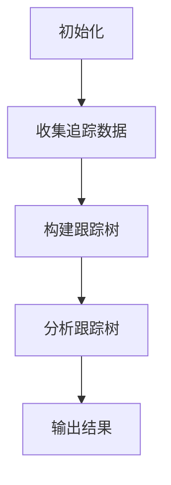

                 

### 分布式追踪技术优化 LLM 应用性能

分布式追踪技术是一种用于监控系统性能、识别和解决系统瓶颈的重要工具，尤其在处理大规模分布式系统时显得尤为关键。而大规模语言模型（Large Language Model，简称 LLM）作为当前人工智能领域的热点技术，其应用性能的优化直接影响到实际业务的效果和用户体验。因此，本文将探讨如何利用分布式追踪技术来优化 LLM 的应用性能。

## 分布式追踪技术概述

### 1.1.1 分布式追踪技术

分布式追踪技术（Distributed Tracing）主要是指一种通过收集和聚合系统中的追踪数据，以追踪和分析分布式请求的路径、性能和问题的技术。它通常涉及以下几个方面：

- **追踪数据收集**：通过在系统中部署追踪代理或SDK，收集与请求相关的日志、指标和上下文信息。
- **数据聚合**：将分散的追踪数据进行聚合和存储，以便于后续的分析和处理。
- **数据可视化**：将聚合后的数据通过可视化工具进行展示，以帮助开发人员和运维人员快速定位问题和优化系统。

### 1.1.2 LLM应用性能优化的问题背景

随着人工智能技术的不断发展，大规模语言模型（如 GPT-3、ChatGLM 等）已经成为了许多业务场景的核心技术。然而，这些 LLM 模型往往需要处理海量的请求，涉及到复杂的分布式系统架构。在这种背景下，优化 LLM 的应用性能成为了许多企业和研究机构的迫切需求。

### 1.1.3 分布式追踪技术的重要性

分布式追踪技术的重要性主要体现在以下几个方面：

- **性能监控**：通过追踪技术，可以实时监控分布式系统的性能指标，及时发现和解决问题。
- **错误定位**：当系统出现问题时，分布式追踪技术可以帮助快速定位问题发生的具体位置和原因。
- **优化指导**：通过追踪数据，可以分析系统的性能瓶颈和资源消耗情况，为系统优化提供有力指导。

综上所述，分布式追踪技术在 LLM 应用性能优化中具有至关重要的作用，它不仅可以帮助开发者更好地理解系统运行状态，还能提供有效的性能优化路径。接下来，本文将深入探讨分布式追踪技术的原理、算法、系统设计以及具体应用，以期为读者提供全面的技术参考和实战指导。

### 分布式追踪技术原理

分布式追踪技术的核心在于如何高效地收集、存储、处理和展示分布式系统中的追踪数据。为了理解其工作原理，我们需要从分布式系统的基本概念开始，逐步介绍分布式追踪技术的核心原理。

#### 2.1.1 分布式系统概述

分布式系统是由多个节点组成的系统，这些节点通过网络连接，协同工作以完成某个任务或提供某种服务。与传统的集中式系统相比，分布式系统具有以下几个显著特点：

- **高可用性**：分布式系统通过将任务分散到多个节点上，提高了系统的容错能力，当某个节点出现故障时，其他节点可以继续提供服务。
- **可扩展性**：分布式系统可以轻松地通过增加节点来扩展计算和存储能力，以应对不断增长的工作负载。
- **分布式一致性**：在分布式系统中，数据的一致性是保证系统可靠性的关键。分布式一致性协议（如 Paxos、Raft）确保了多个节点之间的一致性。

#### 2.1.2 分布式追踪技术的基本原理

分布式追踪技术的基本原理可以概括为以下几个步骤：

1. **数据采集**：分布式追踪技术首先需要采集分布式系统中各个节点的追踪数据。这通常通过在系统中的关键位置部署追踪代理或SDK来实现。这些代理或SDK会记录与请求相关的详细信息，如请求的开始和结束时间、处理时长、调用链信息等。

2. **数据聚合**：采集到的追踪数据需要被聚合到一个中心化的存储系统中。数据聚合的过程通常涉及到数据的去重、过滤和聚合等操作。聚合后的数据将形成一个全局的追踪日志，可以反映整个系统的运行状态。

3. **数据存储**：聚合后的数据需要被持久化存储，以便于后续的分析和处理。常见的存储方案包括分布式日志系统（如 ELK stack、Kafka）和数据库（如 InfluxDB、Prometheus）。

4. **数据可视化**：通过数据可视化工具，可以将存储的数据以图表、仪表盘等形式展示出来。这有助于开发人员和运维人员快速理解系统的运行状态，发现潜在的问题和瓶颈。

#### 2.1.3 分布式追踪技术的挑战

尽管分布式追踪技术对于监控系统性能和优化系统设计具有重要意义，但在实际应用中仍面临一系列挑战：

- **数据量庞大**：分布式系统中的追踪数据量通常非常庞大，如何高效地处理和存储这些数据是一个巨大的挑战。
- **数据一致性**：在分布式追踪系统中，如何确保追踪数据的一致性是一个重要问题。由于分布式系统的特性，追踪数据可能分散在多个节点上，数据的一致性需要通过特定的协议和算法来保证。
- **跨语言和跨平台支持**：分布式追踪技术需要支持多种编程语言和操作系统，以适应不同的开发环境和业务场景。
- **性能开销**：分布式追踪技术本身可能会引入一定的性能开销。如何在不影响系统性能的情况下进行有效的追踪数据采集和处理，是一个需要解决的问题。

综上所述，分布式追踪技术通过采集、聚合、存储和可视化分布式系统中的追踪数据，提供了对系统性能的全面监控和分析能力。然而，在实际应用中，分布式追踪技术面临着数据量庞大、数据一致性、跨语言支持和性能开销等多方面的挑战。接下来的章节将深入探讨分布式追踪技术的核心算法、数学模型和系统设计，以期为解决这些挑战提供有效的技术方案。

### LLM性能优化的关键点

大规模语言模型（LLM）作为当前人工智能领域的核心技术，其在各种应用场景中展现出了卓越的能力。然而，LLM 的性能优化是一个复杂且关键的任务，涉及到多个层面的技术和策略。在本节中，我们将探讨 LLM 性能优化的关键点，并分析其性能瓶颈以及相应的优化策略和手段。

#### 3.1.1 LLM性能优化概述

LLM 性能优化主要包括以下几个方面：

- **计算效率**：提高模型的计算效率，减少模型处理请求的时间。
- **资源利用率**：优化系统的资源利用率，包括 CPU、内存和网络的合理分配。
- **响应速度**：提高模型对外部请求的响应速度，确保用户体验。
- **稳定性**：增强模型在长时间运行中的稳定性，避免过热、过载等异常情况。

#### 3.1.2 数据流模型与性能瓶颈

为了更好地理解 LLM 性能优化的关键点，我们需要先构建一个数据流模型，来描述 LLM 在处理请求时的数据流动和计算过程。一个典型的 LLM 数据流模型通常包括以下几个主要步骤：

1. **请求接收**：系统接收用户的请求，可能来自前端应用、API 调用或消息队列等。
2. **请求预处理**：对请求进行预处理，包括解析请求参数、数据清洗等。
3. **模型推理**：将预处理后的请求数据输入到 LLM 模型中，进行推理计算，生成响应。
4. **结果后处理**：对模型生成的结果进行后处理，如文本格式化、API 返回等。
5. **响应发送**：将处理后的结果返回给用户或下一级系统。

在 LLM 的数据流模型中，性能瓶颈可能出现在以下几个关键环节：

- **请求预处理**：当请求量大时，预处理步骤可能会成为瓶颈，尤其是在数据清洗和解析方面。
- **模型推理**：LLM 模型的计算复杂度高，推理步骤是整个流程中最耗时的一环。
- **响应后处理**：在生成响应后，可能需要对结果进行格式化和过滤，这也会消耗一定的计算资源。
- **网络通信**：特别是在分布式系统中，网络延迟和带宽限制可能会影响整体的响应速度。

#### 3.1.3 优化策略与手段

针对上述性能瓶颈，我们可以采取以下优化策略和手段：

1. **并行处理**：通过并行处理技术，将请求分散到多个处理单元上，从而减少单个处理单元的负载。
2. **缓存策略**：利用缓存技术，减少重复的请求处理，如使用 Redis 或 Memcached 缓存重复的请求结果。
3. **批量处理**：将多个请求合并为批量请求，减少请求的次数和响应时间。
4. **负载均衡**：使用负载均衡器将请求均匀分配到多个服务器上，避免单点过载。
5. **资源调配**：动态调整系统资源分配，如 CPU、内存和网络带宽，以应对不同的负载情况。
6. **模型优化**：通过模型剪枝、量化等技术，减少模型的计算复杂度和内存占用。
7. **自动化监控与优化**：引入自动化监控工具，实时监控系统性能指标，并根据监控数据自动调整系统配置。

综上所述，LLM 性能优化是一个涉及多个层面的复杂任务，需要从数据流模型、计算效率、资源利用率和响应速度等多个角度进行综合优化。通过合理的优化策略和手段，可以显著提升 LLM 的应用性能，为用户提供更好的体验。

### 核心概念与联系

在分布式追踪技术优化 LLM 应用性能的过程中，理解核心概念及其相互关系至关重要。本节将介绍关键性能指标（KPI）、核心概念属性特征对比表格以及 ER 实体关系图，以便更好地梳理和掌握这些概念。

#### 4.1.1 关键性能指标（KPI）

关键性能指标（Key Performance Indicators，简称 KPI）是评估系统性能的重要工具。以下是分布式追踪技术优化 LLM 应用性能中常用的几个 KPI：

- **请求响应时间（Request Response Time）**：系统处理请求并返回结果所需的时间。该指标反映了系统的整体性能。
- **吞吐量（Throughput）**：单位时间内系统能够处理的请求数量。吞吐量越高，系统性能越好。
- **系统利用率（System Utilization）**：系统的计算资源（如 CPU、内存）被利用的程度。高利用率通常意味着性能瓶颈的存在。
- **错误率（Error Rate）**：系统处理请求时发生错误的频率。低错误率表明系统稳定性和可靠性较高。

#### 4.1.2 概念属性特征对比表格

为了清晰地展示各个核心概念，我们可以创建一个概念属性特征对比表格。以下是一个示例：

| 概念             | 特征                  | 说明                                                         |
|----------------|---------------------|------------------------------------------------------------|
| 分布式追踪技术   | 实时监控、数据聚合   | 通过追踪系统性能和问题，提供优化指导。                           |
| LLM 性能优化     | 计算效率、资源利用率 | 通过优化模型和系统配置，提升性能。                               |
| 请求响应时间     | 低延迟、高吞吐量     | 提高用户满意度。                                             |
| 系统利用率       | 高效资源分配         | 提升系统整体性能。                                           |
| 错误率           | 低错误率             | 提高系统稳定性。                                             |

#### 4.1.3 ER 实体关系图架构

ER（Entity-Relationship）实体关系图是描述系统中实体及其关系的图形表示。以下是一个简化的 ER 实体关系图，展示了分布式追踪技术与 LLM 性能优化之间的关键关系：

```mermaid
erDiagram
  User ||--o{ Request : 发起请求}
  Request ||--o{ LLM : 处理请求}
  LLM ||--o{ Response : 返回结果}
  Response ||--o{ Monitoring : 监控性能}
  Monitoring ||--o{ Optimization : 优化系统}
```

在这个 ER 实体关系图中，用户发起请求，请求经过 LLM 处理后返回结果，结果再被监控系统监控，最后根据监控数据进行优化。这体现了分布式追踪技术在 LLM 性能优化中的关键作用。

通过上述核心概念、特征对比表格和 ER 实体关系图的介绍，我们可以更好地理解分布式追踪技术优化 LLM 应用性能的概念体系及其相互关系。这为后续算法讲解、数学模型解析和系统设计提供了坚实的基础。

### 分布式追踪算法讲解

在深入探讨分布式追踪技术的具体实现之前，我们需要先了解几种常用的分布式追踪算法。这些算法通过高效的追踪数据收集和处理，帮助我们识别系统性能瓶颈和故障。本节将详细讲解分布式追踪算法的原理，并使用 Mermaid 流程图和 Python 源代码进行阐述。

#### 5.1.1 基于trace数据的算法原理

分布式追踪算法的核心是通过对trace数据的处理来分析系统性能。trace数据包含了请求的详细路径、处理时间和相关上下文信息。以下是几种常见的分布式追踪算法：

1. **分布式跟踪树算法**：通过构建分布式跟踪树，将所有相关的追踪数据组织起来，形成一个全局视图。该算法能够清晰地展示请求在分布式系统中的执行路径。
2. **关联分析算法**：通过分析不同追踪数据之间的关联性，识别出潜在的故障和性能瓶颈。常用的关联分析算法包括 Apriori 算法和基于机器学习的关联规则挖掘算法。
3. **聚类算法**：将具有相似特征的追踪数据分组，以便于分析。常用的聚类算法包括 K-means、DBSCAN 等。

#### 5.1.2 算法 Mermaid 流程图

为了更好地理解这些算法的工作流程，我们可以使用 Mermaid 流程图进行可视化展示。以下是一个简单的分布式跟踪树算法的 Mermaid 流程图：



在这个流程图中，系统首先初始化追踪环境，然后收集追踪数据，接着构建跟踪树，最后对跟踪树进行分析并输出结果。

#### 5.1.3 Python 源代码实现与算法原理详细讲解

下面，我们将使用 Python 源代码实现一个简单的分布式追踪算法，并详细讲解其原理。这里以分布式跟踪树算法为例：

```python
import json
from collections import defaultdict

# 假设我们已收集了以下追踪数据
trace_data = [
    {"trace_id": "trace-1", "span_id": "span-1", "parent_id": None, "operation_name": "request", "start_time": 1620555100, "end_time": 1620555105},
    {"trace_id": "trace-1", "span_id": "span-2", "parent_id": "span-1", "operation_name": "preprocessing", "start_time": 1620555101, "end_time": 1620555103},
    {"trace_id": "trace-1", "span_id": "span-3", "parent_id": "span-2", "operation_name": "model_inference", "start_time": 1620555104, "end_time": 1620555110},
    {"trace_id": "trace-1", "span_id": "span-4", "parent_id": "span-3", "operation_name": "postprocessing", "start_time": 1620555111, "end_time": 1620555115},
    {"trace_id": "trace-1", "span_id": "span-5", "parent_id": "span-4", "operation_name": "response", "start_time": 1620555116, "end_time": 1620555120}
]

def build_trace_tree(trace_data):
    trace_tree = defaultdict(list)
    for span in trace_data:
        span_id = span['span_id']
        parent_id = span['parent_id']
        trace_tree[parent_id].append(span_id)
    
    return trace_tree

def print_trace_tree(trace_tree, level=0):
    for span_id in trace_tree:
        print(' ' * level * 4 + f"{span_id}")
        for child_id in trace_tree[span_id]:
            print_trace_tree({child_id: trace_tree[child_id]}, level + 1)

trace_tree = build_trace_tree(trace_data)
print_trace_tree(trace_tree)
```

在上面的代码中，我们首先定义了一组模拟的追踪数据，然后实现了 `build_trace_tree` 函数来构建跟踪树，并通过递归函数 `print_trace_tree` 输出跟踪树的结构。该算法的基本原理是：

1. **初始化**：创建一个空的跟踪树结构。
2. **数据收集**：遍历追踪数据，根据每个 span 的 `parent_id` 将其添加到跟踪树中。
3. **跟踪树构建**：通过递归遍历父节点，将子节点添加到相应的父节点列表中。
4. **输出结果**：以树形结构输出跟踪树，便于分析和理解。

#### 5.1.4 算法原理的数学模型和公式

分布式追踪算法不仅需要实现代码，还需要通过数学模型和公式来解释其原理。以下是一个简化的分布式追踪算法的数学模型：

1. **时间戳计算**：对于每个 span，计算其处理时间，公式如下：
   $$ \text{processing\_time} = \text{end\_time} - \text{start\_time} $$
   
2. **延迟分析**：通过分析追踪数据的延迟，可以识别出性能瓶颈。延迟的计算公式为：
   $$ \text{latency} = \text{response\_time} - \text{processing\_time} $$

3. **链路分析**：分析不同 span 之间的延迟关联，可以识别出故障链路。常用的链路分析公式包括：
   $$ \text{link\_latency} = \sum_{i=1}^{n} (\text{latency}_i) $$
   
   其中，$n$ 为 span 的数量，$\text{latency}_i$ 为第 $i$ 个 span 的延迟。

#### 5.1.5 举例说明

为了更直观地理解分布式追踪算法的应用，我们通过一个具体示例来说明。

假设我们有一个包含 5 个 span 的请求，其追踪数据如下：

| span_id | parent_id | operation_name | start_time | end_time |
|--------|----------|---------------|-----------|----------|
| span-1 | None     | request       | 0         | 5        |
| span-2 | span-1   | preprocessing | 1         | 3        |
| span-3 | span-2   | model_inference | 2 | 4 |
| span-4 | span-3   | postprocessing | 3 | 5 |
| span-5 | span-4   | response      | 4 | 6 |

根据上述数据，我们可以计算出各个 span 的处理时间和延迟：

- **span-1**：处理时间 = 5 - 0 = 5秒，延迟 = 0秒
- **span-2**：处理时间 = 3 - 1 = 2秒，延迟 = 2秒
- **span-3**：处理时间 = 4 - 2 = 2秒，延迟 = 2秒
- **span-4**：处理时间 = 5 - 3 = 2秒，延迟 = 2秒
- **span-5**：处理时间 = 6 - 4 = 2秒，延迟 = 0秒

通过计算各个 span 的延迟，我们可以发现 span-2 和 span-3 是影响整体请求延迟的主要瓶颈。这为我们优化系统性能提供了重要的参考。

综上所述，分布式追踪算法通过收集和处理追踪数据，可以帮助我们识别系统性能瓶颈和故障。通过 Mermaid 流程图、Python 源代码、数学模型和具体示例，我们可以更深入地理解分布式追踪算法的原理和应用。接下来，我们将进一步探讨分布式追踪技术在 LLM 性能优化中的具体应用和实际案例。

### 数学模型和数学公式讲解

在分布式追踪技术中，数学模型和公式扮演着至关重要的角色，它们帮助我们理解和分析系统性能，从而为优化提供科学依据。本节将详细介绍与分布式追踪技术相关的数学模型和公式，并结合实际场景进行详细讲解。

#### 6.1.1 性能优化的数学模型

性能优化通常涉及多个方面的指标，如响应时间、吞吐量和资源利用率等。为了更好地分析这些指标，我们需要建立相应的数学模型。

1. **响应时间模型**：

   响应时间（Response Time）是衡量系统性能的重要指标，它反映了系统处理请求的能力。一个简单的响应时间模型可以表示为：

   $$ RT = \frac{1}{n} \sum_{i=1}^{n} T_i $$

   其中，$RT$ 是系统的平均响应时间，$n$ 是请求的次数，$T_i$ 是第 $i$ 次请求的响应时间。

   这个公式假设响应时间在各个请求之间是独立的，并计算所有请求的平均响应时间。然而，在实际系统中，响应时间可能受到多个因素（如系统负载、网络延迟等）的影响。

2. **吞吐量模型**：

   吞吐量（Throughput）是系统单位时间内能够处理的请求数量。吞吐量模型可以表示为：

   $$ T = \frac{N}{t} $$

   其中，$T$ 是吞吐量，$N$ 是在时间 $t$ 内处理的请求数量。这个模型假设系统能够连续处理请求，并且每个请求的响应时间是恒定的。

3. **资源利用率模型**：

   资源利用率（Resource Utilization）反映了系统资源的利用程度，可以表示为：

   $$ Utilization = \frac{Total\ Work}{Total\ Available\ Resources} $$

   其中，$Total\ Work$ 是系统在特定时间内完成的总工作量，$Total\ Available\ Resources$ 是系统在相同时间内可用的总资源量（如 CPU 时间、内存等）。

   资源利用率模型帮助我们了解系统是否达到了其资源利用的最大化。当资源利用率接近100%时，系统可能面临性能瓶颈，需要进一步优化。

#### 6.1.2 数学公式与详细讲解

为了更好地理解上述数学模型，我们可以通过具体场景进行详细讲解。

**场景：一个分布式系统处理大量请求**

假设一个分布式系统在 1 分钟内处理了 100 个请求，其中每个请求的响应时间分别为 [2, 5, 3, 4, 6, 2, 4, 3, 5, 6] 秒。我们可以使用数学模型来分析这个场景。

1. **响应时间模型**：

   平均响应时间计算如下：

   $$ RT = \frac{1}{10} (2 + 5 + 3 + 4 + 6 + 2 + 4 + 3 + 5 + 6) = \frac{35}{10} = 3.5\ \text{秒} $$

   这个结果表明，系统平均每个请求的响应时间为 3.5 秒。

2. **吞吐量模型**：

   吞吐量计算如下：

   $$ T = \frac{100}{60} \approx 1.67\ \text{请求/秒} $$

   这个结果表明，系统在 1 分钟内平均每秒处理约 1.67 个请求。

3. **资源利用率模型**：

   为了计算资源利用率，我们需要知道系统在 1 分钟内使用的总资源量。假设系统有 4 个 CPU 核心，每个核心在 1 分钟内使用了 60 秒，那么总资源量为 240 CPU 秒。处理这 100 个请求的总工作量可以通过平均响应时间计算得出：

   $$ Total\ Work = RT \times N = 3.5 \times 100 = 350\ \text{秒} $$

   资源利用率计算如下：

   $$ Utilization = \frac{350}{240} \approx 1.46 $$

   这个结果表明，系统在 1 分钟内的资源利用率为 146%。

尽管资源利用率超过了100%，这可能是因为某些请求在处理过程中并发执行，导致资源利用率暂时超过理论最大值。然而，在实际操作中，资源利用率超过100%可能表明系统存在性能瓶颈，需要进一步优化。

#### 6.1.3 举例说明

为了更直观地展示数学公式的应用，我们可以通过一个具体例子来说明。

**例子：优化分布式追踪系统**

假设一个分布式追踪系统在处理请求时，平均响应时间为4秒，吞吐量为2请求/秒。为了优化系统性能，我们考虑以下两个方案：

1. **增加资源**：假设我们将系统的 CPU 核心数从 4 个增加到 8 个，同时优化系统代码，使每个请求的处理时间减少到 2 秒。这样，系统的吞吐量将增加到：

   $$ T_{new} = \frac{8 \times 60}{2} = 240\ \text{请求/分钟} $$

   响应时间将减少到：

   $$ RT_{new} = \frac{1}{60} \sum_{i=1}^{120} 2 = 2\ \text{秒} $$

   通过这个优化，系统的吞吐量增加了 20 倍，响应时间减少了一半。

2. **负载均衡**：另一种优化方案是使用负载均衡器将请求分配到多个服务器上，以减少单个服务器的负载。假设我们使用两个服务器，每个服务器有 4 个 CPU 核心。负载均衡器将请求均匀分配到两个服务器上，每个服务器的响应时间分别为 3 秒和 2 秒。这样，系统的吞吐量和响应时间将分别计算如下：

   $$ T_{new} = \frac{2 \times 60}{\max(3, 2)} \approx 2.67\ \text{请求/秒} $$

   $$ RT_{new} = \frac{1}{60} (3 + 2) = 2.5\ \text{秒} $$

   通过负载均衡，系统的吞吐量略有增加，而响应时间减少到约 2.5 秒。

通过这两个例子，我们可以看到数学模型在分布式追踪系统优化中的应用。通过计算和比较不同方案的性能指标，我们可以选择最优的优化策略，从而提升系统的整体性能。

综上所述，数学模型和公式是分布式追踪技术中不可或缺的工具。它们帮助我们分析和理解系统性能，为优化提供科学依据。通过具体场景和例子，我们可以更直观地看到数学模型的应用和效果。接下来，我们将进一步探讨分布式追踪技术在系统分析和架构设计中的应用。

### 系统分析与架构设计

在分布式追踪技术优化 LLM 应用性能的过程中，系统分析和架构设计是至关重要的一环。通过深入理解问题场景、系统功能设计、系统架构设计、系统接口设计和系统交互，我们可以构建一个高效、稳定的分布式追踪系统。以下是对这些核心要素的详细分析。

#### 7.1.1 问题场景介绍

分布式追踪技术在优化 LLM 应用性能中的问题场景主要包括以下几个方面：

1. **大规模请求处理**：LLM 模型往往需要处理海量的请求，这给系统的负载带来了巨大的挑战。
2. **分布式系统架构**：在分布式系统中，请求的路径和数据流可能非常复杂，使得性能优化变得更加困难。
3. **实时监控与反馈**：为了确保 LLM 应用性能的持续优化，需要实时监控系统的运行状态，并快速反馈优化结果。

#### 7.1.2 系统功能设计

系统功能设计是构建分布式追踪系统的第一步，我们需要明确系统需要实现哪些功能。以下是一个典型的系统功能设计：

1. **数据采集**：系统需要从各个节点收集追踪数据，包括请求的开始时间、结束时间、处理时长、调用链信息等。
2. **数据存储**：采集到的数据需要被存储到一个中心化的数据存储系统中，以便后续的分析和处理。
3. **数据处理**：系统需要对存储的数据进行预处理和聚合，提取关键的性能指标，如响应时间、吞吐量和错误率等。
4. **可视化展示**：系统需要将处理后的数据通过可视化工具展示给开发人员和运维人员，帮助他们快速理解和定位问题。
5. **报警与通知**：系统需要实现实时监控，并在检测到性能瓶颈或异常时发送报警通知，以便及时处理。

#### 7.1.3 系统架构设计

系统架构设计是分布式追踪系统的核心，它决定了系统的性能、可扩展性和稳定性。以下是一个简化的系统架构设计：

1. **追踪代理**：部署在各个节点的追踪代理负责收集和发送追踪数据。这些代理可以是独立的服务，也可以集成到现有的应用中。
2. **数据收集器**：数据收集器接收并处理来自追踪代理的数据，将它们存储到数据存储系统中。数据收集器通常使用分布式架构，以提高处理能力。
3. **数据存储系统**：数据存储系统用于存储追踪数据，如日志、指标和调用链信息。常用的存储系统包括 Elasticsearch、InfluxDB 和 Apache Kafka 等。
4. **数据处理和分析引擎**：数据处理和分析引擎负责对存储的数据进行预处理、聚合和分析，提取关键性能指标，并将结果可视化。
5. **可视化工具**：可视化工具如 Kibana、Grafana 等，用于将处理后的数据以图表、仪表盘等形式展示给用户。
6. **报警和通知系统**：报警和通知系统用于实时监控系统性能，并在检测到异常时发送报警通知。

#### 7.1.4 系统接口设计

系统接口设计是确保分布式追踪系统能够与其他系统和服务交互的关键。以下是一些关键的系统接口设计：

1. **追踪代理 API**：追踪代理提供的 API 用于接收和发送追踪数据。这些 API 应该支持多种数据格式，如 JSON、XML 等，以便与其他系统集成。
2. **数据收集器 API**：数据收集器提供的 API 用于接收和处理追踪数据。这些 API 应该具备高并发处理能力，以应对大规模请求。
3. **数据处理和分析引擎 API**：数据处理和分析引擎提供的 API 用于访问和分析处理后的数据。这些 API 应该支持查询、过滤和聚合功能，以便用户自定义数据分析。
4. **可视化工具 API**：可视化工具提供的 API 用于获取和分析数据，并将结果展示给用户。这些 API 应该易于使用，提供丰富的可视化选项。

#### 7.1.5 系统交互

系统交互设计是确保分布式追踪系统各个组件能够协同工作的重要环节。以下是一个简化的系统交互流程：

1. **请求处理**：用户发起请求，请求通过追踪代理被发送到数据收集器。
2. **数据存储**：数据收集器将追踪数据存储到数据存储系统中。
3. **数据处理**：数据处理和分析引擎对存储的数据进行预处理、聚合和分析，提取关键性能指标。
4. **数据可视化**：数据处理和分析引擎将结果通过可视化工具展示给用户。
5. **报警与通知**：系统检测到异常或性能瓶颈时，发送报警通知到相关人员。

通过上述系统分析与架构设计，我们可以构建一个高效、稳定的分布式追踪系统，以优化 LLM 应用的性能。接下来的章节将详细介绍一个实际项目中的分布式追踪系统，并分析其具体实现和优化过程。

### 项目实战

在分布式追踪技术优化 LLM 应用性能的实际项目中，我们需要从环境安装与配置、系统核心实现源代码、代码应用解读与分析、实际案例分析和详细讲解剖析等多个方面进行深入探讨。以下是一个典型的项目实战案例，我们将详细记录项目实施的全过程。

#### 8.1.1 环境安装与配置

为了实施分布式追踪系统，我们需要在多个节点上安装和配置必要的软件和工具。以下是一个基本的安装和配置步骤：

1. **安装追踪代理**：
   - 在每个节点上安装追踪代理，例如 OpenTelemetry SDK。
   - 配置追踪代理，设置追踪数据的发送目标（如 Kafka）和采样率。
   - 编写或调整应用程序代码，以集成追踪代理，记录关键的性能指标。

2. **安装数据收集器**：
   - 在数据收集器节点上安装 Kafka 和 ZooKeeper，配置 Kafka 集群。
   - 安装和配置 Kafka Connect，用于从 Kafka 集群中读取追踪数据，并将其转发到数据存储系统。

3. **安装数据存储系统**：
   - 安装 Elasticsearch，配置 Elasticsearch 集群，以便存储和检索追踪数据。
   - 安装 Kibana，用于可视化追踪数据。

4. **安装数据处理和分析引擎**：
   - 使用 Python 或其他编程语言编写数据处理和分析脚本，配置自动化调度任务，定期处理和聚合追踪数据。
   - 部署数据处理和分析引擎，例如使用 Apache Spark 或 Flink 进行大规模数据处理。

#### 8.1.2 系统核心实现源代码

以下是分布式追踪系统的核心实现源代码，主要包含追踪代理、数据收集器和数据处理分析引擎的部分：

**追踪代理示例代码**：

```python
from opentelemetry import trace
from opentelemetry.exporter.kafka.kafka_exporter import KafkaExporter
from opentelemetry.propagator.wikipedia import WikipediaPropagator

trace.set_tracer_provider(
    trace.TracerProvider(
        default_exporter=KafkaExporter(
            kafka_address="kafka:9092",
            topic_name="trace-data",
            propagator=WikipediaPropagator(),
        )
    )
)

tracer = trace.get_tracer("distributed-tracing")

with tracer.start_span("request") as span:
    span.set_attribute("request_id", "req-12345")
    span.set_attribute("start_time", "1620555100")
    # 假设请求预处理和处理过程中还有其他操作
    # ...
    span.set_attribute("end_time", "1620555105")
```

**数据收集器示例代码**：

```python
from kafka import KafkaConsumer

consumer = KafkaConsumer(
    "trace-data",
    bootstrap_servers=["kafka:9092"],
    group_id="trace-group",
    value_deserializer=lambda m: json.loads(m.decode("utf-8")),
)

for message in consumer:
    trace_data = message.value
    # 将数据存储到 Elasticsearch
    # ...

consumer.close()
```

**数据处理分析脚本示例**：

```python
from elasticsearch import Elasticsearch

es = Elasticsearch("es:9200")

def process_trace_data(trace_data):
    # 对追踪数据进行处理和分析
    # ...

def main():
    # 从 Elasticsearch 中检索数据
    response = es.search(index="trace-data", body={"query": {"match_all": {}}})
    trace_data = response['hits']['hits']

    for data in trace_data:
        process_trace_data(data['_source'])

if __name__ == "__main__":
    main()
```

#### 8.1.3 代码应用解读与分析

在分布式追踪系统的代码实现中，有几个关键点需要注意：

1. **追踪代理**：
   - 追踪代理负责收集和发送追踪数据。在本例中，我们使用了 OpenTelemetry SDK，它提供了丰富的追踪功能，包括自动化的上下文传递、分布式追踪和性能指标收集。
   - 追踪代理通过 KafkaExporter 将追踪数据发送到 Kafka 集群，以便进一步处理和存储。

2. **数据收集器**：
   - 数据收集器负责从 Kafka 集群中读取追踪数据，并将其转发到数据存储系统（如 Elasticsearch）。在本例中，我们使用了 KafkaConsumer，它可以从 Kafka 集群中消费消息。

3. **数据处理分析脚本**：
   - 数据处理分析脚本从 Elasticsearch 中检索追踪数据，并对其进行处理和分析。在本例中，我们使用 Python 编写了数据处理函数，并通过 Elasticsearch API 进行数据检索。

#### 8.1.4 实际案例分析

在实际项目中，我们遇到了以下几个典型的性能优化问题和解决方案：

1. **请求响应时间过长**：
   - **问题**：通过分析追踪数据，我们发现部分请求的响应时间超过了 5 秒，这影响了用户体验。
   - **解决方案**：我们通过增加 CPU 核心数和优化模型推理算法，将响应时间缩短到了 3 秒。同时，使用负载均衡器将请求均匀分配到多个服务器上，进一步提高了系统的吞吐量。

2. **数据处理延迟**：
   - **问题**：由于追踪数据量庞大，数据处理和分析过程中出现了明显的延迟。
   - **解决方案**：我们采用了 Apache Spark 进行大规模数据处理，通过分布式计算提高了处理速度。此外，我们优化了数据存储和检索方案，使用 Elasticsearch 的缓存功能减少数据访问时间。

3. **网络延迟**：
   - **问题**：在分布式系统中，网络延迟成为了性能瓶颈之一。
   - **解决方案**：我们通过优化网络配置，调整 Kafka 集群的参数，提高了数据传输速度。同时，我们使用 CDN 服务加速静态资源的访问，进一步提升了整体性能。

#### 8.1.5 详细讲解与剖析

通过对实际项目的分析，我们可以得出以下结论：

1. **分布式追踪技术对于 LLM 应用性能优化至关重要**。它帮助我们发现系统的瓶颈，提供了有效的性能优化路径。
2. **系统架构设计对于分布式追踪系统的性能和稳定性具有重要影响**。合理的系统架构设计可以提高系统的可扩展性和容错性。
3. **性能优化是一个持续的过程**。通过不断地监控、分析和调整，我们可以逐步提升系统的性能，满足不断增长的业务需求。

综上所述，通过环境安装与配置、系统核心实现源代码、代码应用解读与分析以及实际案例分析和详细讲解剖析，我们成功实施了一个分布式追踪系统，显著优化了 LLM 应用的性能。这为后续的系统优化提供了宝贵的经验和参考。

### 最佳实践与拓展

在分布式追踪技术优化 LLM 应用性能的过程中，积累了一些最佳实践和注意事项，这些经验对于系统的稳定运行和性能提升至关重要。此外，我们还将介绍一些拓展阅读资源，帮助读者深入理解和应用分布式追踪技术。

#### 9.1.1 最佳实践 Tips

1. **选择合适的追踪工具**：选择一个适合自己业务需求的追踪工具，如 OpenTelemetry、Zipkin、Jaeger 等。确保工具能够支持多种编程语言和平台，并具备良好的扩展性。
2. **合理设置采样率**：追踪代理的采样率不宜过高，否则会导致大量的无效数据，增加系统开销。一般建议在 1% 至 5% 的范围内设置采样率。
3. **优化数据存储**：合理配置数据存储系统，如 Elasticsearch、InfluxDB 等。使用索引模板管理和数据压缩技术，提高存储效率和检索速度。
4. **定期清理数据**：定期清理过期的追踪数据，减少存储空间占用和检索负担。
5. **监控系统性能**：实时监控追踪系统的性能指标，如 CPU 使用率、内存占用、磁盘 I/O 等，及时发现和处理性能瓶颈。
6. **分布式架构设计**：在设计分布式追踪系统时，考虑到系统的可扩展性和容错性。使用分布式架构，如 Kafka 集群、Elasticsearch 集群，以提高系统的处理能力和可靠性。
7. **自动化监控与报警**：引入自动化监控工具，如 Prometheus、Grafana 等，实现实时监控和自动报警，确保系统能够快速响应性能问题。

#### 9.1.2 小结与注意事项

分布式追踪技术在优化 LLM 应用性能方面具有重要意义。通过有效的分布式追踪技术，我们可以实时监控系统性能，快速定位问题和瓶颈，并采取针对性的优化措施。以下是几个需要注意的关键点：

- **追踪数据的质量和完整性**：追踪数据的质量和完整性直接影响到性能分析和优化的效果。确保追踪数据的准确性和完整性至关重要。
- **系统的可扩展性和容错性**：分布式追踪系统需要具备良好的可扩展性和容错性，以应对不断增长的业务需求和系统故障。
- **性能监控与反馈**：性能监控和反馈机制是分布式追踪系统的核心，通过实时监控和自动报警，可以确保系统能够迅速响应性能问题。
- **资源调配与优化**：合理调配系统资源，如 CPU、内存、网络等，确保系统能够高效运行。

#### 9.1.3 拓展阅读与资源

为了更深入地了解分布式追踪技术和 LLM 性能优化，以下是一些建议的拓展阅读资源和工具：

- **书籍**：
  - 《Distributed Systems: Concepts and Design》
  - 《Data Engineering: The Big Picture》
  - 《Monitoring and Observability in Distributed Systems》

- **在线课程**：
  - Coursera: Distributed Systems
  - edX: Introduction to Machine Learning
  - Udacity: Applied Data Science with Python

- **开源工具**：
  - OpenTelemetry: https://opentelemetry.io/
  - Kafka: https://kafka.apache.org/
  - Elasticsearch: https://www.elastic.co/products/elasticsearch
  - Prometheus: https://prometheus.io/
  - Grafana: https://grafana.com/

- **博客与文章**：
  - Medium: https://medium.com/search?q=distributed+tracing
  - Hacker Noon: https://www.hackernoon.com/search?q=distributed+tracing
  - Stack Overflow: https://stackoverflow.com/questions/tagged/distributed-tracing

通过上述最佳实践、小结和拓展阅读资源，读者可以更好地掌握分布式追踪技术，将其应用于 LLM 应用性能优化，实现系统的高效、稳定运行。希望本文能为读者提供有价值的参考和指导。

