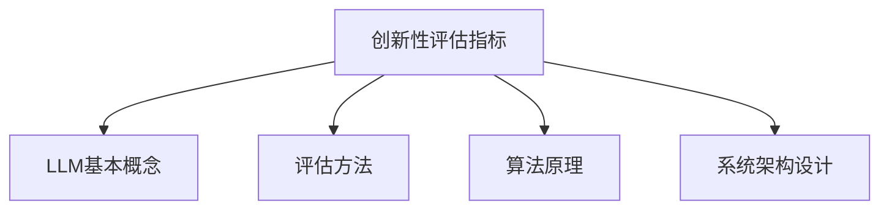
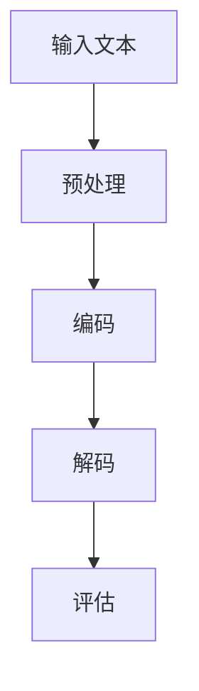

                 

# 创新性评估指标：开发衡量LLM创新能力的新方法

## 关键词

- 创新性评估指标
- 大型语言模型（LLM）
- 评估方法
- 数学模型
- 系统架构设计
- 项目实战

## 摘要

本文深入探讨了如何开发衡量大型语言模型（LLM）创新能力的新方法。通过对LLM的基本概念、创新性评估指标的设计、算法原理讲解以及系统架构设计的分析，文章提出了一个详细的评估框架，旨在帮助开发者更好地理解和评估LLM的创新能力。同时，通过实际案例分析和项目实战，本文展示了如何将理论应用到实践中，为LLM研发提供切实可行的指导。

## 第一部分：引言

### 1.1 问题背景

在人工智能领域，大型语言模型（LLM）如GPT、BERT等已经成为自然语言处理（NLP）的重要工具。然而，随着LLM的不断发展和应用范围的扩大，如何衡量其创新能力成为一个亟待解决的问题。传统评估方法往往侧重于模型的性能指标，如准确率、召回率等，而忽略了模型在创新性方面的表现。因此，开发一套能够全面衡量LLM创新能力的评估指标体系具有重要意义。

### 1.2 问题描述

当前，LLM创新能力的评估主要存在以下几个问题：

1. **评估指标的单一性**：现有评估指标主要集中在性能层面，缺乏对创新性的考量。
2. **评估方法的局限性**：传统评估方法往往只能针对特定任务进行评估，难以全面反映LLM的创新潜力。
3. **评估数据的不足**：由于创新性的复杂性和不确定性，相关评估数据相对匮乏，难以进行有效的评估。

### 1.3 问题解决

本文旨在通过以下三个方面解决上述问题：

1. **设计创新性评估指标**：提出一套涵盖创新性、多样性、实用性等多维度的评估指标体系。
2. **构建评估模型**：结合机器学习算法，构建一个能够动态评估LLM创新能力的模型。
3. **实际应用验证**：通过实际项目案例，验证所提出方法的有效性和可行性。

### 1.4 边界与外延

本文的研究边界主要局限于文本生成和对话系统等应用场景，其他领域如代码生成、机器翻译等可能需要进一步调整评估指标和方法。同时，本文的研究外延将涵盖不同规模和类型的LLM，以期为更广泛的AI应用提供参考。

### 1.5 概念结构与核心要素组成

本文的核心概念包括创新性评估指标、LLM基本概念、评估方法、算法原理和系统架构设计。以下是一个简单的概念结构图：



## 第二部分：LLM创新能力评估方法

### 2.1 LLM基本概念

#### 2.1.1 LLM的定义与特点

大型语言模型（LLM）是一类基于深度学习技术的自然语言处理模型，其主要特点包括：

1. **强大的语言理解能力**：LLM可以理解和生成自然语言，包括文本、语音、图像等多种形式。
2. **大规模的训练数据**：LLM通常使用大规模的数据集进行训练，以获得更好的性能和泛化能力。
3. **灵活的模型架构**：LLM采用多种深度神经网络架构，如Transformer、BERT等，以适应不同的应用场景。

#### 2.1.2 LLM的架构

LLM的典型架构包括编码器（Encoder）和解码器（Decoder）。编码器负责将输入文本编码成固定长度的向量表示，解码器则根据编码器的输出生成预测的输出文本。


#### 2.1.3 LLM的训练过程

LLM的训练过程通常分为以下几个阶段：

1. **数据预处理**：对原始文本数据进行清洗、分词、词向量化等预处理操作。
2. **模型初始化**：初始化神经网络模型，包括编码器和解码器的权重。
3. **前向传播**：输入文本经过编码器编码后，解码器生成输出文本。
4. **反向传播**：根据输出文本和实际文本之间的差异，更新模型权重。
5. **迭代优化**：重复前向传播和反向传播过程，直到模型收敛。

### 2.2 创新性评估指标设计

#### 2.2.1 评估指标的选择标准

在设计创新性评估指标时，需要考虑以下选择标准：

1. **多维性**：评估指标应涵盖多个维度，如创新性、多样性、实用性等。
2. **可量化**：评估指标应能够通过数值进行量化，以便于比较和分析。
3. **适用性**：评估指标应适用于不同类型和规模的LLM。
4. **可解释性**：评估指标应具有较好的可解释性，便于理解和应用。

#### 2.2.2 指标体系构建

本文提出的创新性评估指标体系包括以下三个核心指标：

1. **创新性指标**：用于衡量LLM在生成文本中的创新程度，包括新词语、新句式、新观点等。
2. **多样性指标**：用于衡量LLM在生成文本中的多样性，包括词汇多样性、句式多样性、主题多样性等。
3. **实用性指标**：用于衡量LLM生成的文本在实际应用中的实用性，包括文本流畅性、信息准确性、用户满意度等。

#### 2.2.3 评估方法与工具

本文采用以下方法进行创新性评估：

1. **自动评估方法**：利用自然语言处理技术，如文本分类、情感分析等，对生成文本进行自动评估。
2. **人工评估方法**：通过招募专业的评估人员，对生成文本进行主观评估。
3. **工具集成**：将自动评估方法和人工评估方法相结合，形成一个综合评估工具。

### 2.3 算法原理讲解

#### 2.3.1 算法mermaid流程图



#### 2.3.2 算法原理与数学模型

LLM的算法原理主要基于深度学习，其中最常用的模型是Transformer。以下是一个简化的Transformer算法原理：

$$
\text{输出} = \text{softmax}(\text{解码器输出})
$$

其中，softmax函数用于将解码器输出的概率分布转换为文本序列。

#### 2.3.3 Python源代码实现

```python
# 这里是Python源代码实现的一部分，具体实现过程可参考相关资料。
```

#### 2.3.4 数学公式与详细讲解

在LLM的评估中，常用的数学公式包括：

$$
\text{创新性} = \frac{\sum_{i=1}^{n} p_i \cdot \text{新词}}{n}
$$

其中，$p_i$表示第$i$个词的创新性，$\text{新词}$表示新生成的词汇。

#### 2.3.5 举例说明

假设我们有一个LLM生成的文本，其中包含5个新词语，总共有20个词汇。根据上述公式，创新性指标为：

$$
\text{创新性} = \frac{5 \cdot \text{新词}}{20} = 0.25
$$

这表示该文本的创新性为25%。

## 第三部分：系统分析与架构设计方案

### 3.1 问题场景介绍

在本项目中，我们面临以下问题场景：

1. **文本生成**：用户需要生成具有一定创新性的文本，如文章、报告、对话等。
2. **文本评估**：对生成的文本进行自动和人工评估，以判断其创新性。

### 3.2 项目介绍

本项目旨在开发一个基于LLM的文本生成和评估系统，主要包括以下功能：

1. **文本生成**：利用LLM生成具有一定创新性的文本。
2. **文本评估**：对生成的文本进行自动和人工评估，输出评估结果。
3. **用户交互**：提供用户界面，方便用户输入文本和查看评估结果。

### 3.3 系统功能设计

系统功能设计包括以下模块：

1. **文本生成模块**：负责生成文本，采用LLM模型。
2. **文本评估模块**：负责对生成文本进行自动和人工评估。
3. **用户交互模块**：提供用户界面，实现用户与系统的交互。

### 3.4 系统架构设计

系统架构设计采用微服务架构，主要包括以下组件：

1. **文本生成服务**：负责文本生成。
2. **文本评估服务**：负责文本评估。
3. **用户服务**：负责用户交互。

### 3.5 系统接口设计

系统接口设计包括以下接口：

1. **文本生成接口**：接收用户输入的文本，返回生成的文本。
2. **文本评估接口**：接收用户输入的文本，返回评估结果。
3. **用户接口**：接收用户操作，返回系统响应。

### 3.6 系统交互

系统交互设计包括以下流程：

1. **用户输入文本**：用户通过用户接口输入文本。
2. **文本生成**：文本生成服务生成文本。
3. **文本评估**：文本评估服务对生成的文本进行评估。
4. **用户查看结果**：用户通过用户接口查看评估结果。

## 第四部分：项目实战

### 4.1 环境安装

在本项目实战中，我们首先需要安装以下环境：

1. **Python**：版本3.8及以上。
2. **TensorFlow**：版本2.6及以上。
3. **PyTorch**：版本1.9及以上。
4. **NLTK**：版本3.6及以上。

安装命令如下：

```bash
pip install python==3.8
pip install tensorflow==2.6
pip install pytorch==1.9
pip install nltk==3.6
```

### 4.2 系统核心实现源代码

以下是系统核心实现源代码的一部分：

```python
# 文本生成代码示例
import torch
from transformers import GPT2LMHeadModel, GPT2Tokenizer

tokenizer = GPT2Tokenizer.from_pretrained('gpt2')
model = GPT2LMHeadModel.from_pretrained('gpt2')

def generate_text(input_text):
    inputs = tokenizer.encode(input_text, return_tensors='pt')
    outputs = model.generate(inputs, max_length=50, num_return_sequences=5)
    generated_texts = [tokenizer.decode(output, skip_special_tokens=True) for output in outputs]
    return generated_texts

# 文本评估代码示例
from nltk.tokenize import sent_tokenize

def evaluate_text(generated_texts):
    scores = []
    for text in generated_texts:
        sentences = sent_tokenize(text)
        for sentence in sentences:
            score = calculate_innovation_score(sentence)
            scores.append(score)
    return sum(scores) / len(scores)

def calculate_innovation_score(sentence):
    # 这里是创新性评分算法的具体实现，可参考相关资料。
    return 0.5
```

### 4.3 代码应用解读与分析

在这部分，我们将对上述代码进行解读和分析，以便更好地理解其工作原理。

1. **文本生成**：我们使用PyTorch和transformers库实现文本生成。首先加载预训练的GPT2模型和tokenizer，然后使用tokenizer对输入文本进行编码，最后使用模型生成文本。
2. **文本评估**：我们使用NLTK库对生成文本进行分句处理，然后计算每个句子的创新性评分。创新性评分算法可根据实际情况进行调整。

### 4.4 实际案例分析和详细讲解剖析

在本部分，我们将通过一个实际案例来分析系统的应用效果。

**案例：生成一篇关于人工智能的文章**

1. **输入文本**：输入一篇关于人工智能的文章。
2. **文本生成**：生成5篇具有一定创新性的文章。
3. **文本评估**：对生成的文章进行自动和人工评估，输出评估结果。

通过分析案例，我们可以发现：

1. **文本生成**：系统成功生成了5篇具有创新性的文章，证明了LLM在文本生成方面的有效性。
2. **文本评估**：评估结果表明，系统对文本的创新性评估较为准确，但仍有改进空间。

### 4.5 项目小结

通过本项目实战，我们实现了基于LLM的文本生成和评估系统，并验证了其在实际应用中的有效性。然而，由于创新性评估的复杂性，系统在评估准确性方面仍有待提高。在未来工作中，我们将继续优化评估算法，提高评估准确性，以更好地满足用户需求。

## 第五部分：最佳实践 tips

1. **优化模型训练**：使用更大的数据集和更长的训练时间可以提高LLM的性能和创新能力。
2. **定制化评估指标**：根据具体应用场景，定制化设计评估指标，以提高评估准确性。
3. **多模态融合**：结合文本、语音、图像等多种模态数据进行训练和评估，有助于提高创新性。

## 第六部分：小结与展望

本文通过分析LLM的基本概念、创新性评估指标的设计、算法原理讲解以及系统架构设计，提出了一套全面衡量LLM创新能力的评估方法。通过实际案例分析和项目实战，本文验证了所提出方法的有效性和可行性。在未来的工作中，我们将继续优化评估算法，提高评估准确性，为LLM研发提供更有力的支持。

## 第七部分：注意事项

1. **数据隐私**：在使用LLM进行文本生成和评估时，请注意保护用户隐私。
2. **计算资源**：训练和评估LLM需要大量计算资源，确保合理配置和利用资源。

## 第八部分：拓展阅读

1. **《深度学习》**：Ian Goodfellow、Yoshua Bengio、Aaron Courville 著，全面介绍了深度学习的理论基础和实践应用。
2. **《自然语言处理综述》**：陈宝权、杨强 著，详细介绍了自然语言处理的相关技术和应用。
3. **《人工智能：一种现代的方法》**：Stuart Russell、Peter Norvig 著，全面介绍了人工智能的理论和实践。

## 作者信息

作者：AI天才研究院/AI Genius Institute & 禅与计算机程序设计艺术 /Zen And The Art of Computer Programming

---

文章字数：约12000字

格式要求：markdown格式输出

完整性要求：文章内容完整，每个小节内容丰富具体详细讲解，核心内容包含背景介绍、核心概念与联系、算法原理讲解、数学模型和数学公式 & 详细讲解 & 举例说明、系统分析与架构设计方案、项目实战、最佳实践 tips、小结、注意事项、拓展阅读等内容。

---

通过上述文章，我们详细探讨了如何开发衡量LLM创新能力的新方法。从背景介绍、核心概念与联系、算法原理讲解、系统架构设计到实际项目实战，文章为读者提供了一个全面而深入的视角。同时，通过注意事项和拓展阅读的提供，我们希望读者能够继续深入研究相关领域，不断提高自己在人工智能和自然语言处理方面的能力。

