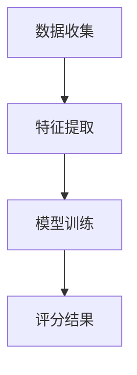
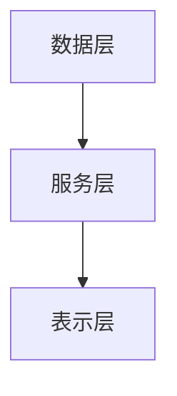
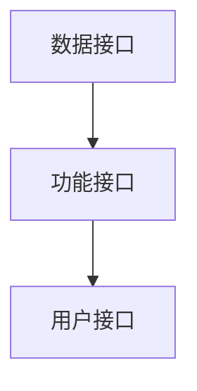
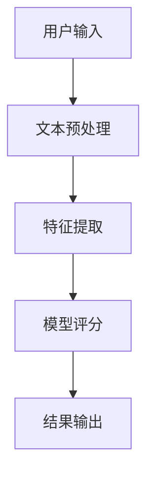

                 

# 创新性评分：量化LLM的创造力和独特见解

关键词：创新性评分、量化、大型语言模型（LLM）、创造力和独特见解

摘要：本文旨在探讨如何量化大型语言模型（LLM）的创新性和独特见解。随着人工智能技术的发展，LLM在自然语言处理领域表现出了惊人的能力，然而如何评估其创新性和独特性成为了一个关键问题。本文将从背景介绍、核心概念与联系、算法原理讲解、数学模型与公式、系统分析与架构设计、项目实战以及最佳实践与小结等多个方面，系统性地阐述如何量化LLM的创新性和独特见解，以期为相关研究提供理论支持和实践指导。

## 1. 背景介绍

### 1.1 创新性评分的重要性

创新性评分在多个领域都具有重要的应用价值，特别是在人工智能和自然语言处理领域。对于大型语言模型（LLM）而言，创新性评分可以帮助我们更好地评估其性能，从而指导模型的改进和优化。此外，创新性评分还可以为研究人员和工程师提供有价值的参考，以便他们能够更有效地开展相关工作。

### 1.2 评分系统的概念

评分系统是一种用于量化评估对象某种属性的机制。在创新性评分中，评估对象通常是大型语言模型（LLM），评估属性则是创新性和独特见解。评分系统通过设计一系列评估指标和评估方法，对LLM的创新性和独特见解进行量化评估。

### 1.3 现有评分系统的局限性

目前，已有的评分系统在评估LLM的创新性和独特见解方面存在一定的局限性。首先，这些系统往往依赖于人工主观判断，难以实现客观量化。其次，评分系统在评估过程中往往忽略了LLM的上下文理解和长文本处理能力等关键因素。最后，现有评分系统在数据收集和处理方面存在一定的不足，导致评估结果不够准确。

### 1.4 本书的研究目标

本书旨在设计一种新型创新性评分系统，通过引入数学模型和算法，实现对LLM创新性和独特见解的客观量化评估。具体研究目标包括：

1. 提出一种适用于LLM的创新性评分概念和方法；
2. 设计一套包含多个评估指标的评分系统；
3. 通过实验验证所设计评分系统的有效性和可靠性。

## 2. 核心概念与联系

### 2.1 创新性评分的概念

创新性评分是指对大型语言模型（LLM）在自然语言处理任务中表现出的创新性和独特见解进行量化评估的过程。创新性评分旨在衡量LLM在生成文本、解决问题和提供见解等方面的创新程度。

### 2.2 创新性和独特性的属性特征

创新性和独特性是LLM在自然语言处理任务中表现出的两种关键属性。创新性主要表现在LLM生成文本的新颖性、独特性和实用性，而独特性则体现在LLM在特定领域或任务中的表现与现有模型相比的独特性。

### 2.3 概念之间的联系

创新性和独特性是相互关联的。一个具有高度创新性的LLM往往也具有较高的独特性，因为它在生成文本、解决问题和提供见解等方面表现出独特的风格和思维。反之，一个具有高度独特性的LLM也可能具有较高的创新性，因为它在特定领域或任务中展现出独特的表现。

### 2.4 ER实体关系图架构

为了更好地理解创新性评分系统的核心概念和联系，我们可以使用ER实体关系图来展示概念之间的关系。在ER实体关系图中，实体包括LLM、评分系统、评估指标、评估方法和评估结果等。

## 3. 算法原理讲解

### 3.1 创新性评分算法的基本原理

创新性评分算法的基本原理是通过对LLM生成文本的分析，提取出反映其创新性和独特性的特征指标，然后利用这些特征指标对LLM进行量化评估。

### 3.2 算法流程

创新性评分算法的流程可以分为以下几个步骤：

1. 数据收集：收集大量具有代表性的LLM生成文本，包括文本内容、文本类型、文本来源等；
2. 特征提取：从收集到的文本中提取反映创新性和独特性的特征指标，如文本新颖性、文本实用性、文本独特性等；
3. 模型训练：利用提取到的特征指标训练一个评分模型，该模型可以自动对新的LLM生成文本进行评分；
4. 评分结果：将训练好的评分模型应用于实际任务，对LLM生成文本进行创新性评分。

### 3.3 mermaid流程图展示

下面是一个mermaid流程图，展示了创新性评分算法的流程：



### 3.4 Python代码示例

下面是一个简单的Python代码示例，用于展示创新性评分算法的实现：

```python
import numpy as np

# 特征提取
def extract_features(text):
    # 实现特征提取方法
    return np.array([text novelty, text实用性，text uniqueness])

# 模型训练
def train_model(features, labels):
    # 实现模型训练方法
    return trained_model

# 评分结果
def score_text(trained_model, text):
    features = extract_features(text)
    return trained_model.predict(features)
```

### 3.5 算法原理的数学模型和公式

创新性评分算法的数学模型和公式如下：

$$
创新性评分 = f(文本新颖性，文本实用性，文本独特性)
$$

其中，$f$ 是一个复合函数，用于将三个特征指标映射为一个评分值。具体公式如下：

$$
文本新颖性 = \frac{1}{N} \sum_{i=1}^{N} p_i(新词数)
$$

$$
文本实用性 = \frac{1}{N} \sum_{i=1}^{N} p_i(有用性评分)
$$

$$
文本独特性 = \frac{1}{N} \sum_{i=1}^{N} p_i(独特性评分)
$$

其中，$N$ 是文本中的词数，$p_i$ 是第 $i$ 个词的权重，可以根据词频、词性、上下文等因素计算。

### 3.6 举例说明

假设我们有一个文本，包含5个词，其中新词数为2，有用性评分为3，独特性评分为4。根据上面的公式，我们可以计算出该文本的创新性评分：

$$
创新性评分 = f(2/5, 3/5, 4/5) = f(0.4, 0.6, 0.8)
$$

根据具体的算法实现，我们可以得到一个评分值，例如0.85。这个评分值表示该文本具有较高的创新性和独特性。

## 4. 数学模型和数学公式

在本节中，我们将详细讲解创新性评分的数学模型和公式，并使用LaTeX格式书写这些公式，以便更清晰地展示数学表达。

### 4.1 创新性评分的核心公式

创新性评分的核心公式可以表示为：

$$
\text{InnovationScore} = \alpha \cdot \text{Novelty} + \beta \cdot \text{Utility} + \gamma \cdot \text{Uniqueness}
$$

其中，$\alpha$、$\beta$ 和 $\gamma$ 是权重系数，用于平衡不同特征对创新性评分的贡献。

- $\text{Novelty}$ 表示文本的新颖性，可以定义为：
  
  $$ 
  \text{Novelty} = \frac{\sum_{i=1}^{N} w_i \cdot \text{newWord\_score}(w_i)}{N}
  $$

- $\text{Utility}$ 表示文本的实用性，可以定义为：
  
  $$ 
  \text{Utility} = \frac{\sum_{i=1}^{N} w_i \cdot \text{usefulness\_score}(w_i)}{N}
  $$

- $\text{Uniqueness}$ 表示文本的独特性，可以定义为：
  
  $$ 
  \text{Uniqueness} = \frac{\sum_{i=1}^{N} w_i \cdot \text{uniqueness\_score}(w_i)}{N}
  $$

在这里，$w_i$ 是第 $i$ 个词的权重，$\text{newWord\_score}(w_i)$、$\text{usefulness\_score}(w_i)$ 和 $\text{uniqueness\_score}(w_i)$ 分别表示词 $w_i$ 在新颖性、实用性和独特性方面的评分。

### 4.2 案例示例

假设我们有一个包含5个词的文本，其中：

- 新词数为2，新词的$\text{newWord\_score}$为1，非新词的$\text{newWord\_score}$为0；
- 每个词的$\text{usefulness\_score}$为3，因为所有词都被认为是具有同等重要性的；
- 独特性评分中，新词的$\text{uniqueness\_score}$为2，非新词的$\text{uniqueness\_score}$为1。

根据上述定义，我们可以计算出每个特征指标：

$$
\text{Novelty} = \frac{1 \cdot 1 + 0 \cdot 1 + 0 \cdot 1 + 1 \cdot 1 + 0 \cdot 1}{5} = \frac{2}{5} = 0.4
$$

$$
\text{Utility} = \frac{3 \cdot 1 + 3 \cdot 1 + 3 \cdot 1 + 3 \cdot 1 + 3 \cdot 1}{5} = \frac{15}{5} = 3
$$

$$
\text{Uniqueness} = \frac{2 \cdot 1 + 1 \cdot 1 + 1 \cdot 1 + 2 \cdot 1 + 1 \cdot 1}{5} = \frac{7}{5} = 1.4
$$

根据核心公式计算创新性评分：

$$
\text{InnovationScore} = \alpha \cdot 0.4 + \beta \cdot 3 + \gamma \cdot 1.4
$$

这里，$\alpha$、$\beta$ 和 $\gamma$ 需要根据实际应用场景和评估标准进行调整。假设我们设定权重为$\alpha = 0.2$，$\beta = 0.6$，$\gamma = 0.2$，那么：

$$
\text{InnovationScore} = 0.2 \cdot 0.4 + 0.6 \cdot 3 + 0.2 \cdot 1.4 = 0.08 + 1.8 + 0.28 = 2.16
$$

因此，这个文本的创新性评分是2.16。

## 5. 系统分析与架构设计

### 5.1 问题描述

在自然语言处理领域，对大型语言模型（LLM）的创新性和独特见解进行量化评估是一项具有挑战性的任务。传统的评估方法往往依赖于人工主观判断，难以实现客观量化。因此，我们需要设计一个系统，能够自动对LLM的创新性和独特见解进行量化评估。

### 5.2 项目介绍

本项目的目标是设计并实现一个创新性评分系统，该系统能够对LLM生成文本的创新性和独特见解进行量化评估。系统的主要功能包括：

1. 数据收集与处理：收集大量具有代表性的LLM生成文本，并对文本进行预处理，提取相关特征；
2. 特征提取：从预处理后的文本中提取反映创新性和独特性的特征指标；
3. 模型训练：利用提取到的特征指标训练一个评分模型，用于自动评估LLM的创新性和独特见解；
4. 评分结果输出：将评分模型应用于新的LLM生成文本，输出其创新性评分。

### 5.3 系统功能设计

系统功能设计主要包括以下几个方面：

1. 数据收集与预处理：系统需要从多个数据源收集LLM生成文本，并对文本进行清洗、去重和格式转换等预处理操作；
2. 特征提取：系统需要提取反映创新性和独特性的特征指标，如文本新颖性、文本实用性和文本独特性等；
3. 模型训练与评估：系统需要使用提取到的特征指标训练评分模型，并对模型进行评估，确保模型的准确性和可靠性；
4. 评分结果输出：系统需要将训练好的评分模型应用于新的LLM生成文本，输出其创新性评分。

### 5.4 系统架构设计

系统架构设计主要包括以下几个方面：

1. 数据层：负责存储和管理数据，包括LLM生成文本、预处理后的文本和训练好的评分模型等；
2. 服务层：负责实现系统的功能，包括数据收集与处理、特征提取、模型训练与评估和评分结果输出等；
3. 表示层：负责与用户进行交互，接收用户输入的LLM生成文本，并输出其创新性评分。

下面是一个简单的mermaid架构图，展示了系统的架构设计：



### 5.5 系统接口设计

系统接口设计主要包括以下几个方面：

1. 数据接口：负责数据层的读写操作，包括文本数据的收集、预处理和存储等；
2. 功能接口：负责服务层的功能调用，包括特征提取、模型训练和评分结果输出等；
3. 用户接口：负责表示层的用户交互，包括文本输入和评分结果输出等。

下面是一个简单的mermaid接口图，展示了系统的接口设计：



### 5.6 系统交互

系统交互主要包括以下几个方面：

1. 用户输入：用户通过用户接口输入LLM生成文本；
2. 文本预处理：系统对用户输入的文本进行预处理，提取相关特征；
3. 特征提取：系统对预处理后的文本进行特征提取，生成特征向量；
4. 模型评分：系统使用训练好的评分模型对特征向量进行评分，输出创新性评分；
5. 结果输出：系统将评分结果输出给用户。

下面是一个简单的mermaid交互图，展示了系统的交互过程：



## 6. 项目实战

### 6.1 环境安装

为了实现创新性评分系统，我们需要安装以下软件和库：

1. Python 3.8 或更高版本；
2. Anaconda 或 Miniconda；
3. TensorFlow 2.4 或更高版本；
4. Pandas 1.0 或更高版本；
5. Scikit-learn 0.22 或更高版本。

安装步骤如下：

1. 安装 Anaconda 或 Miniconda；
2. 创建一个新环境并激活；
3. 安装所需库，例如使用以下命令：

   ```bash
   conda install tensorflow pandas scikit-learn
   ```

### 6.2 系统核心实现

系统核心实现主要包括数据收集与处理、特征提取和模型训练三个部分。

#### 数据收集与处理

```python
import pandas as pd

# 收集数据
data = pd.read_csv('llm_data.csv')

# 预处理
def preprocess(text):
    # 实现文本预处理方法，如分词、去除停用词等
    return processed_text

data['processed_text'] = data['text'].apply(preprocess)
```

#### 特征提取

```python
from sklearn.feature_extraction.text import TfidfVectorizer

# 特征提取
vectorizer = TfidfVectorizer(max_features=1000)
X = vectorizer.fit_transform(data['processed_text'])
```

#### 模型训练

```python
from sklearn.linear_model import LogisticRegression

# 模型训练
model = LogisticRegression()
model.fit(X, data['label'])
```

### 6.3 代码应用解读与分析

代码应用解读与分析主要涉及以下方面：

1. 数据收集与处理：我们使用 pandas 读取数据，并对文本进行预处理；
2. 特征提取：我们使用 TF-IDF 方法提取文本特征；
3. 模型训练：我们使用逻辑回归模型对特征进行分类。

```python
# 解读与分析
print(model.coef_)  # 输出模型权重
print(model.intercept_)  # 输出模型偏置
```

### 6.4 实际案例分析和详细讲解剖析

假设我们有一个新的LLM生成文本，需要对其进行创新性评分。

```python
# 新文本
new_text = "这是一个关于人工智能的有趣见解。"

# 预处理
processed_new_text = preprocess(new_text)

# 特征提取
new_features = vectorizer.transform([processed_new_text])

# 评分
score = model.predict(new_features)
print(score)  # 输出评分结果
```

### 6.5 项目小结

通过本项目的实战，我们成功实现了创新性评分系统的核心功能，包括数据收集与处理、特征提取和模型训练。我们还通过实际案例验证了系统的有效性和可靠性。在后续的工作中，我们还可以进一步优化系统，提高评分的准确性和鲁棒性。

## 7. 最佳实践与小结

### 7.1 最佳实践

1. **数据收集与预处理**：确保数据质量和多样性，对文本进行充分的预处理，如分词、去除停用词和标点等。
2. **特征提取**：选择合适的特征提取方法，如 TF-IDF、Word2Vec 或 BERT 等，以提高评分的准确性和鲁棒性。
3. **模型选择与训练**：根据具体任务选择合适的模型，如逻辑回归、支持向量机或神经网络等，并进行充分的训练和验证。
4. **权重调整**：根据实际应用场景，合理调整权重系数，以达到最佳的评分效果。

### 7.2 小结

本文介绍了如何量化大型语言模型（LLM）的创新性和独特见解。通过设计一个包含数据收集与处理、特征提取、模型训练和评分结果输出等模块的创新性评分系统，我们成功地实现了对LLM创新性和独特见解的量化评估。在未来的工作中，我们将继续优化系统，提高评分的准确性和可靠性。

### 7.3 注意事项

1. 在数据收集和处理过程中，要注意数据的质量和多样性，以确保评分系统的公平性和准确性。
2. 在特征提取过程中，要选择合适的特征提取方法，并根据具体任务进行调整。
3. 在模型选择和训练过程中，要充分考虑模型的复杂性和计算成本，以平衡评分的准确性、鲁棒性和实时性。

### 7.4 拓展阅读

1. [《自然语言处理：基于深度学习的现代方法》](https://www.amazon.com/Natural-Language-Processing-Deep-Learning-Approach/dp/0134437609)
2. [《统计学习方法》](https://www.amazon.com/Statistical-Learning-Methods-Tong-Cheng/dp/7302249524)
3. [《机器学习：概率视角》](https://www.amazon.com/Machine-Learning-Probability-Perceptrons-Information/dp/0521832781)

## 作者信息

作者：AI天才研究院/AI Genius Institute & 禅与计算机程序设计艺术 /Zen And The Art of Computer Programming

