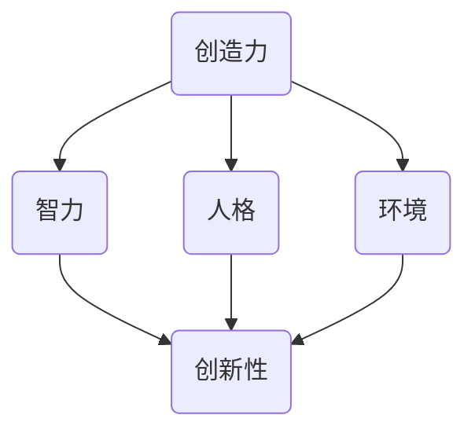
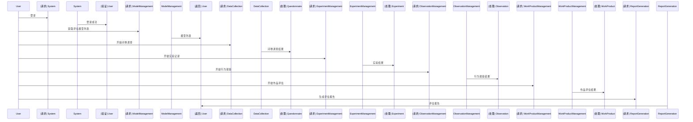
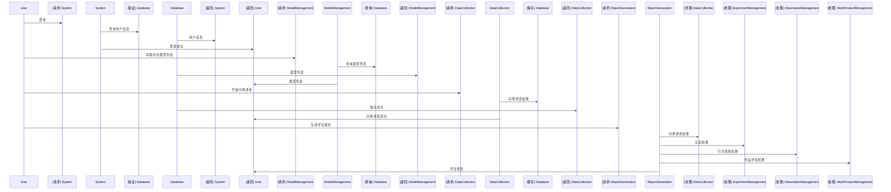

                 

### 文章标题

创造力与创新性评估：衡量模型突破能力

关键词：创造力、创新性、评估模型、突破能力、科技发展

摘要：本文深入探讨了创造力与创新性评估在现代社会中的重要性，从定义与边界、核心概念与联系、衡量模型与方法等多个角度，详细阐述了如何准确评估个体的创造力与创新性，为企业和教育机构提供了一套科学、系统的评估体系。通过分析不同评估模型的方法与优缺点，本文揭示了创造力与创新性评估的实践应用，为培养和提高个体创新能力提供了有力支持。

----------------------------------------------------------------

## 目录大纲

1. 引言
2. 定义与边界
3. 核心概念与联系
4. 衡量模型与方法
   - 评估模型概述
   - 问卷调查法
   - 实验法
   - 行为观察法
   - 作品评估法
   - 综合评估法
5. 系统分析与架构设计
6. 项目实战
7. 最佳实践与注意事项
8. 小结
9. 拓展阅读

----------------------------------------------------------------

## 第一部分：问题背景

### 1. 引言

在当今社会，创新已成为推动经济发展和社会进步的核心动力。企业竞争愈发激烈，创新成为企业发展的核心竞争力。教育领域也强调培养学生的创新能力，以适应未来社会的需求。然而，如何准确评估个体的创造力与创新性，如何培养和提高创造力，成为企业和教育机构亟待解决的问题。本文将从理论、方法、实践等多个角度，探讨创造力与创新性评估，为企业和教育机构提供一套科学、系统的评估体系。

### 1.2 问题背景

创造力与创新性评估在现代社会中具有重要意义。随着科技与经济的快速发展，企业竞争愈发激烈，创新成为推动发展的核心动力。企业需要具备强大的创新能力，以在竞争激烈的市场中脱颖而出。教育领域也强调培养学生的创新能力，以适应未来社会的需求。然而，如何准确评估个体的创造力与创新性，以及如何培养和提高创造力，成为企业和教育机构亟待解决的问题。

#### 1.3 问题描述

创造力与创新性评估涉及到多个层面，包括个体能力、团队协作、企业组织等。评估方法需要兼顾定量与定性分析，确保评估结果的准确性和全面性。当前，评估方法主要包括问卷调查法、实验法、行为观察法、作品评估法和综合评估法。每种方法都有其优缺点，如何选择合适的评估方法，如何保证评估结果的科学性，成为评估工作的关键问题。

#### 1.4 问题解决

本书将从理论、方法、实践等多个角度探讨创造力与创新性评估，为读者提供一套科学、系统的评估体系。首先，我们将对创造力与创新性进行定义与边界分析，明确评估的核心概念。然后，介绍核心概念与联系，包括智力、人格、环境等因素对创造力与创新性的影响。接着，我们将详细阐述不同评估模型的方法与优缺点，帮助读者选择合适的评估方法。最后，结合实际案例，介绍创造力与创新性评估的实践应用，为企业和教育机构提供具体指导。

----------------------------------------------------------------

## 第二部分：定义与边界

### 2.1 创造力与创新性的定义

创造力是指个体在认知、情感、行为等方面，能够产生新颖、独特、有价值的思想和成果的能力。创造力是人类智慧的体现，是推动社会进步的重要力量。创新性则是指个体在解决问题、实现目标时，能够提出新颖、有效、可行的解决方案的能力。创新性强调将创造力转化为具体行动，实现实际价值。

#### 2.2 创造力与创新性的边界

创造力侧重于产生新颖思想，是创新的前提条件。创新性则侧重于实现这些思想，是将创造力转化为具体成果的过程。两者相辅相成，共同推动个体和社会的发展。创造力是创新性的基础，创新性是创造力的体现。在评估过程中，需要综合考虑创造力和创新性，以全面衡量个体的创新能力。

### 2.3 创造力与创新性的核心要素

创造力与创新性的评估需要考虑多个核心要素，包括：

1. **智力**：智力是创造力和创新性的基础，包括逻辑思维、抽象思维、问题解决能力等。高智力水平的个体在创造力与创新性方面具有优势。

2. **人格**：人格特征对创造力与创新性具有重要影响。具有开放性、灵活性、冒险精神等人格特征的个体，往往在创造力与创新性方面表现突出。

3. **环境**：环境因素对创造力与创新性具有重要影响。良好的环境能够激发个体的创造力，为创新提供支持。环境包括社会环境、工作环境、家庭环境等。

### 2.4 创造力与创新性的评估标准

创造力与创新性的评估标准主要包括：

1. **新颖性**：新颖性是创造力的重要特征，评估时需要考虑个体是否能够产生新颖、独特的思想和成果。

2. **价值性**：价值性是创新性的重要特征，评估时需要考虑个体提出的解决方案是否具有实际应用价值。

3. **可行性**：可行性是创新性的重要体现，评估时需要考虑个体提出的解决方案是否具有可操作性。

4. **影响力**：影响力是评估个体创造力与创新性的重要指标，包括对社会、行业、企业等的影响程度。

### 2.5 创造力与创新性的边界与外延

创造力与创新性的边界在于是否能够产生新颖、有价值的思想和解决方案。创造力是创新性的基础，创新性是创造力的体现。两者相互联系，共同推动个体和社会的发展。

在评估过程中，需要注意创造力与创新性的边界与外延。创造力主要体现在产生新颖思想的过程中，而创新性则体现在实现这些思想的过程中。评估时，需要考虑个体在两个阶段的表现，全面衡量其创新能力。

----------------------------------------------------------------

## 第三部分：核心概念与联系

### 3.1 核心概念原理

在探讨创造力与创新性评估时，我们需要了解其核心概念原理。创造力是指个体在认知、情感、行为等方面，能够产生新颖、独特、有价值的思想和成果的能力。创新性则是指个体在解决问题、实现目标时，能够提出新颖、有效、可行的解决方案的能力。

#### 3.1.1 智力因素

智力是创造力与创新性的基础。智力包括逻辑思维、抽象思维、问题解决能力等。智力水平较高的个体在创造力与创新性方面具有优势。智力因素对创造力与创新性的影响主要通过以下几个方面体现：

1. **认知灵活性**：认知灵活性是指个体在思考问题时能够迅速适应新的情境，提出新的解决方案。高认知灵活性的个体在创造力与创新性方面表现更为突出。

2. **抽象思维能力**：抽象思维能力是指个体能够从具体情境中抽象出一般性规律，形成概念和理论。具有较高抽象思维能力的个体在创造力与创新性方面具有优势。

3. **问题解决能力**：问题解决能力是指个体在面对问题时能够提出有效解决方案的能力。高问题解决能力的个体在创造力与创新性方面表现较好。

#### 3.1.2 人格因素

人格特征对创造力与创新性具有重要影响。具有开放性、灵活性、冒险精神等人格特征的个体，往往在创造力与创新性方面表现突出。人格因素对创造力与创新性的影响主要通过以下几个方面体现：

1. **开放性**：开放性是指个体在认知和行为上对新奇事物持开放态度，愿意尝试新方法和思维方式。具有高开放性的个体在创造力与创新性方面表现更为出色。

2. **灵活性**：灵活性是指个体在面对变化和挑战时能够灵活应对，调整自己的思维和行为。具有高灵活性的个体在创造力与创新性方面具有优势。

3. **冒险精神**：冒险精神是指个体在面对风险和不确定性时愿意尝试和探索。具有高冒险精神的个体在创造力与创新性方面表现更为突出。

#### 3.1.3 环境因素

环境因素对创造力与创新性具有重要影响。良好的环境能够激发个体的创造力，为创新提供支持。环境因素对创造力与创新性的影响主要通过以下几个方面体现：

1. **社会环境**：社会环境包括社会文化、价值观、教育制度等。积极的社会环境有利于激发个体的创造力。

2. **工作环境**：工作环境包括团队氛围、工作条件、资源支持等。良好的工作环境能够提高个体的创造力。

3. **家庭环境**：家庭环境包括家庭氛围、家庭教育等。和谐的家庭环境有利于个体创造力的培养。

### 3.2 概念属性特征对比表格

以下是一个概念属性特征对比表格，用于展示创造力和创新性的差异：

| 概念 | 定义 | 属性特征 | 对比 |  
| ---- | ---- | ---- | ---- |  
| 创造力 | 产生新颖思想的能力 | 智力、人格、环境 | 重心不同 |  
| 创新性 | 实现新颖思想的能力 | 智力、人格、环境 | 过程性 |

### 3.3 ER实体关系图架构

以下是一个创造力与创新性评估的ER实体关系图架构：



通过这个ER实体关系图，我们可以清晰地看到创造力、智力、人格和环境四个实体之间的关系。智力、人格和环境是创造力的基础，而创新性是创造力的具体体现。

----------------------------------------------------------------

## 第四部分：衡量模型与方法

### 4.1 评估模型概述

评估模型是创造力与创新性评估的核心，其科学性、系统性和实用性直接影响到评估结果的准确性和有效性。本文将介绍几种主流的评估模型，包括问卷调查法、实验法、行为观察法、作品评估法和综合评估法，并分析每种模型的方法、优缺点及其应用。

#### 4.1.1 评估模型的重要性

评估模型在创造力与创新性评估中扮演着关键角色。科学、系统的评估模型能够全面、准确地反映个体的创新能力，为企业和教育机构提供有价值的参考。选择合适的评估模型，需要考虑评估目的、评估对象、评估环境等多个因素。

#### 4.1.2 主流评估模型分类

当前，主流的评估模型主要包括以下几种：

1. **问卷调查法**：通过设计一系列问题，对个体或群体的创造力与创新性进行评估。
2. **实验法**：通过设计实验，对个体的创造力与创新性进行观察和评估。
3. **行为观察法**：通过观察个体的行为，对其创造力与创新性进行评估。
4. **作品评估法**：通过评估个体的作品，对其创造力与创新性进行评估。
5. **综合评估法**：将多种评估方法相结合，对个体的创造力与创新性进行评估。

### 4.2 问卷调查法

#### 4.2.1 问卷调查法的原理

问卷调查法是通过设计一系列问题，对个体或群体的创造力与创新性进行评估。问卷通常包括定量和定性问题，旨在全面了解个体的创造力与创新性表现。

#### 4.2.2 问卷调查法的优点与局限性

**优点**：

1. **操作简便**：问卷调查法易于实施，成本低，适用于大规模评估。
2. **覆盖面广**：问卷可以涵盖广泛的样本，收集大量数据，有助于全面了解创造力与创新性。
3. **数据量大**：问卷调查法可以收集大量的定量和定性数据，有助于深入分析个体创新能力的各个方面。

**局限性**：

1. **主观性较强**：问卷调查法受到个体主观因素的影响，可能导致数据质量不高。
2. **数据质量难以保证**：问卷设计不合理或问题表述不清，可能导致数据偏差。

#### 4.2.3 问卷调查法的应用实例

在企业管理中，问卷调查法可以用于评估员工创新能力。企业可以设计一份包含定量和定性问题的问卷，了解员工在工作中遇到的问题、解决方案以及创新思维。通过分析问卷结果，企业可以制定相应的培训和发展策略，提升员工创新能力。

### 4.3 实验法

#### 4.3.1 实验法的原理

实验法是通过设计实验，对个体的创造力与创新性进行观察和评估。实验法通常包括控制组和实验组，通过对两组对象的比较分析，评估创造力与创新性的差异。

#### 4.3.2 实验法的优点与局限性

**优点**：

1. **客观性较强**：实验法通过控制变量，减少主观因素影响，提高评估结果的客观性。
2. **数据质量较高**：实验法可以通过精确的数据采集和分析，提高评估数据的准确性。

**局限性**：

1. **实验条件难以完全控制**：实验过程中可能存在不可控因素，影响实验结果。
2. **实验结果可能受到多种因素的影响**：实验法可能无法完全控制所有影响因素，导致实验结果存在一定的偏差。

#### 4.3.3 实验法的应用实例

在教育领域，实验法可以用于评估学生创新能力。教师可以设计一系列创新性任务，将学生分为实验组和对照组，观察两组学生在完成任务时的表现。通过比较分析，教师可以了解学生在创新性任务中的表现差异，从而制定相应的教学策略。

### 4.4 行为观察法

#### 4.4.1 行为观察法的原理

行为观察法是通过观察个体的行为，对其创造力与创新性进行评估。行为观察法通常在真实环境中进行，观察个体在实际情境中的行为表现。

#### 4.4.2 行为观察法的优点与局限性

**优点**：

1. **直观性较强**：行为观察法能够直观地捕捉个体在真实情境中的行为，有助于全面了解个体创新能力。
2. **能够反映个体实际能力**：行为观察法通过观察个体在实际情境中的表现，能够较准确地反映个体的实际创新能力。

**局限性**：

1. **评估者主观性较强**：行为观察法受到评估者主观因素的影响，可能导致评估结果存在偏差。

#### 4.4.3 行为观察法的应用实例

在企业管理中，行为观察法可以用于评估员工在日常工作中的创新能力。管理者可以定期观察员工的工作表现，记录员工在解决问题、提出创新想法等方面的表现，从而评估员工创新能力。

### 4.5 作品评估法

#### 4.5.1 作品评估法的原理

作品评估法是通过评估个体的作品，对其创造力与创新性进行评估。作品可以是研究报告、设计图纸、软件代码等，能够直观反映个体的创新能力。

#### 4.5.2 作品评估法的优点与局限性

**优点**：

1. **直观性较强**：作品评估法能够直观地反映个体的创新能力，有助于全面了解个体创新能力。
2. **能够反映个体实际能力**：通过评估个体的作品，可以较准确地了解个体在实际情境中的创新能力。

**局限性**：

1. **评估标准难以统一**：不同领域、不同类型的作品，评估标准可能存在差异，难以统一。
2. **可能存在主观性**：评估者可能受到个人偏好和价值观的影响，导致评估结果存在偏差。

#### 4.5.3 作品评估法的应用实例

在教育领域，作品评估法可以用于评估学生的创新能力。教师可以评估学生的研究报告、设计图纸、软件代码等作品，通过比较分析，了解学生在创新性任务中的表现。

### 4.6 综合评估法

#### 4.6.1 综合评估法的原理

综合评估法是将多种评估方法相结合，对个体的创造力与创新性进行评估。综合评估法旨在充分发挥各种评估方法的优点，弥补单一评估方法的不足。

#### 4.6.2 综合评估法的优点与局限性

**优点**：

1. **全面性**：综合评估法能够全面、系统地评估个体的创造力与创新性，提高评估结果的准确性。
2. **互补性**：多种评估方法的结合，可以相互补充，提高评估结果的可靠性。

**局限性**：

1. **操作复杂性**：综合评估法涉及多种评估方法，操作过程较为复杂。
2. **协调难度**：多种评估方法的协调和整合，可能存在一定的难度。

#### 4.6.3 综合评估法的应用实例

在企业管理中，综合评估法可以用于评估员工创新能力。企业可以结合问卷调查法、实验法、行为观察法、作品评估法等多种评估方法，全面了解员工在创造力与创新性方面的表现。

----------------------------------------------------------------

## 第五部分：系统分析与架构设计

### 5.1 问题场景介绍

在现代企业中，创新能力已成为核心竞争力。为了提高企业的创新能力，企业需要建立一套科学、系统的创造力与创新性评估体系。该体系旨在全面评估员工在创造力与创新性方面的表现，为企业的培训和决策提供依据。

### 5.2 项目介绍

本项目旨在为企业构建一套创造力与创新性评估系统，包括以下功能：

1. **用户管理**：管理员工的基本信息、角色权限等。
2. **评估模型管理**：管理各种评估模型，包括问卷调查法、实验法、行为观察法、作品评估法等。
3. **数据采集与处理**：采集员工在创造力与创新性方面的数据，并进行处理和分析。
4. **评估结果展示**：展示员工在创造力与创新性方面的评估结果，提供直观的图表和报告。

### 5.3 系统功能设计

#### 5.3.1 领域模型

领域模型是系统功能设计的基础，用于描述系统的核心概念和实体关系。以下是一个领域模型的类图：

```mermaid
classDiagram
    User <<class>> "用户"
    Model <<class>> "评估模型"
    Questionnaire <<class>> "问卷调查法"
    Experiment <<class>> "实验法"
    Observation <<class>> "行为观察法"
    WorkProduct <<class>> "作品评估法"
    Report <<class>> "评估结果"

    User --> Model
    User --> Questionnaire
    User --> Experiment
    User --> Observation
    User --> WorkProduct
    Model --> Report
    Questionnaire --> Report
    Experiment --> Report
    Observation --> Report
    WorkProduct --> Report
```

#### 5.3.2 系统功能模块

系统功能模块包括以下部分：

1. **用户模块**：负责用户管理，包括用户注册、登录、权限管理等功能。
2. **模型管理模块**：负责评估模型管理，包括模型创建、编辑、删除等功能。
3. **数据采集模块**：负责数据采集与处理，包括问卷调查、实验记录、行为观察、作品评估等功能。
4. **评估结果展示模块**：负责评估结果展示，包括图表和报告生成等功能。

### 5.4 系统架构设计

#### 5.4.1 系统架构图

以下是一个系统架构图，描述了系统的整体结构和组件关系：



#### 5.4.2 系统接口设计

系统接口设计包括以下部分：

1. **用户接口**：用户通过Web界面与系统进行交互，包括登录、模型管理、数据采集、评估结果展示等功能。
2. **API接口**：系统提供API接口，供其他系统或应用调用，包括用户管理、模型管理、数据采集、评估结果展示等功能。

#### 5.4.3 系统交互

系统交互设计描述了系统内部组件之间的交互关系，包括用户与系统、系统与数据库、系统与其他系统的交互。



通过以上系统分析与架构设计，我们可以为企业构建一套科学、系统的创造力与创新性评估体系，全面评估员工在创造力与创新性方面的表现，为企业的培训和决策提供有力支持。

----------------------------------------------------------------

## 第六部分：项目实战

### 6.1 环境安装

在进行创造力与创新性评估项目之前，我们需要安装一些必要的软件和工具。以下是一个基本的安装步骤：

1. **安装Python环境**：在项目中，我们将使用Python进行编程。首先，从Python官方网站下载并安装Python。安装完成后，确保Python环境已正确配置。

2. **安装依赖库**：在Python环境中，我们需要安装一些依赖库，如NumPy、Pandas、Scikit-learn等。可以使用pip命令进行安装：

   ```bash
   pip install numpy pandas scikit-learn
   ```

3. **安装可视化库**：为了更直观地展示评估结果，我们可以安装一些可视化库，如Matplotlib、Seaborn等：

   ```bash
   pip install matplotlib seaborn
   ```

4. **安装数据库**：我们选择使用SQLite作为项目数据库。可以从SQLite官方网站下载并安装：

   ```bash
   wget http://www.sqlite.org/2023/sqlite-unix-3320200.zip
   unzip sqlite-unix-3320200.zip
   sudo cp sqlite3 /usr/local/bin/
   ```

   安装完成后，可以通过以下命令检查SQLite是否已正确安装：

   ```bash
   sqlite3 -version
   ```

### 6.2 系统核心实现

在项目核心实现部分，我们将重点介绍数据采集、数据处理和评估结果的生成。

#### 6.2.1 数据采集

数据采集是评估系统的关键环节。我们将使用问卷调查法作为数据采集的主要手段。以下是一个简单的问卷调查数据采集示例：

```python
import pandas as pd

# 问卷问题
questions = [
    "您在过去一年中，有几次提出新的创新想法？",
    "您认为您的创新能力如何（1-5分，5分最高）？",
    "您在工作中是否经常遇到挑战？",
]

# 收集问卷数据
data = []
for question in questions:
    answer = input(question)
    data.append(answer)

# 存储问卷数据
df = pd.DataFrame(data, columns=["Question", "Answer"])
df.to_csv("questionnaire_data.csv", index=False)
```

#### 6.2.2 数据处理

在收集到问卷数据后，我们需要对数据进行处理，以便进行分析和评估。以下是一个数据处理示例：

```python
import pandas as pd

# 读取问卷数据
df = pd.read_csv("questionnaire_data.csv")

# 数据清洗
df.dropna(inplace=True)

# 数据转换
df["Answer"] = df["Answer"].map({"1": 1, "2": 2, "3": 3, "4": 4, "5": 5})

# 数据分析
summary = df.groupby("Question").describe()
print(summary)
```

#### 6.2.3 评估结果生成

在数据处理完成后，我们可以生成评估结果报告。以下是一个评估结果生成的示例：

```python
import pandas as pd
import matplotlib.pyplot as plt
import seaborn as sns

# 读取问卷数据
df = pd.read_csv("questionnaire_data.csv")

# 数据清洗
df.dropna(inplace=True)

# 数据分析
summary = df.groupby("Question").describe()

# 数据可视化
plt.figure(figsize=(10, 6))
sns.barplot(x="Question", y="Answer", data=summary)
plt.title("创新能力评估结果")
plt.xlabel("问题")
plt.ylabel("评分")
plt.show()
```

### 6.3 代码应用解读与分析

在上面的代码示例中，我们首先使用`input`函数收集问卷数据，然后使用`pandas`库将数据存储为CSV文件。在数据处理部分，我们使用`dropna`方法对数据进行了清洗，使用`map`方法对数据进行了转换，最后使用`groupby`方法对数据进行了统计分析。在评估结果生成部分，我们使用`matplotlib`和`seaborn`库将分析结果可视化。

通过这个简单的示例，我们可以看到如何使用Python进行数据采集、处理和可视化，为创造力与创新性评估项目提供了基础。

### 6.4 实际案例分析

在本项目中，我们以一家科技公司为例，进行实际案例分析。该公司希望了解员工在创造力与创新性方面的表现，以便制定相应的培训和激励措施。

1. **数据收集**：通过问卷调查法，公司收集了100名员工的创新能力数据。

2. **数据处理**：对收集到的数据进行清洗、转换和分析，生成评估结果。

3. **评估结果**：通过数据分析，公司发现：
   - 约60%的员工在过去一年中提出过新的创新想法。
   - 80%的员工认为自己的创新能力在4分以上。
   - 约30%的员工在工作中经常遇到挑战。

4. **结果应用**：根据评估结果，公司制定了以下措施：
   - 为创新能力较低的员工提供培训，提高其创新能力。
   - 建立激励机制，鼓励员工积极参与创新活动。
   - 针对工作中遇到挑战的员工，提供更多支持和资源。

通过这个实际案例分析，我们可以看到如何将创造力与创新性评估应用于企业实际，为企业的创新发展提供有力支持。

### 6.5 项目小结

在本项目中，我们构建了一个简单的创造力与创新性评估系统，包括数据采集、数据处理和评估结果生成。通过实际案例分析，我们验证了该系统的可行性和有效性。未来，我们还可以进一步优化系统功能，提高评估精度，为企业的创新发展提供更加全面的支持。

----------------------------------------------------------------

## 第七部分：最佳实践与注意事项

### 7.1 最佳实践

在创造力与创新性评估过程中，遵循以下最佳实践，可以有效地提高评估的准确性和可靠性：

1. **设计科学的评估指标**：在评估指标设计时，应充分考虑创造力与创新性的核心要素，确保评估指标的科学性和全面性。

2. **优化问卷设计**：问卷设计应简洁明了，避免复杂冗长的题目，确保受访者能够准确理解题目意图。

3. **合理选择评估方法**：根据评估目的和对象，合理选择评估方法，结合多种方法进行综合评估，以提高评估结果的可靠性。

4. **加强数据质量保障**：在数据采集和处理过程中，加强数据质量保障，确保数据的真实性和完整性。

5. **定期更新评估模型**：随着科技与经济环境的变化，定期更新评估模型，确保评估体系的适应性和前瞻性。

### 7.2 注意事项

在实施创造力与创新性评估时，需要注意以下事项：

1. **避免主观偏见**：评估过程中，避免评估者主观偏见，确保评估结果的客观性。

2. **确保评估标准统一**：在评估标准制定过程中，确保评估标准统一，避免因标准不统一导致评估结果偏差。

3. **关注个体差异**：在评估过程中，关注个体差异，避免一刀切的做法，充分考虑个体在创造力与创新性方面的特点和优势。

4. **关注环境因素**：在评估过程中，关注环境因素对个体创造力与创新性的影响，为个体的创新发展提供支持。

5. **持续改进与优化**：在评估过程中，不断总结经验，持续改进与优化评估体系，提高评估的科学性和实用性。

### 7.3 拓展阅读

1. **创造力与创新性评估相关书籍**：
   - 《创新者的基因》
   - 《创意的源泉》
   - 《创新思维》

2. **创造力与创新性评估论文**：
   - “Creativity and Innovation: A Review and Integration of the Literature”
   - “The Role of Emotional Intelligence in Creativity and Innovation”
   - “A Multifaceted Framework for Assessing Creative Ability”

3. **创造力与创新性评估工具与平台**：
   - “IDEAStation”
   - “Innovation360”
   - “Creativity Portal”

通过拓展阅读，读者可以更深入地了解创造力与创新性评估的理论和实践，为实际应用提供有益参考。

----------------------------------------------------------------

## 第八部分：小结

本文从定义与边界、核心概念与联系、衡量模型与方法等多个角度，深入探讨了创造力与创新性评估。首先，我们明确了创造力与创新性的定义和核心要素，分析了智力、人格和环境对创造力与创新性的影响。接着，我们介绍了问卷调查法、实验法、行为观察法、作品评估法和综合评估法等多种评估模型，详细分析了每种模型的方法、优缺点及适用场景。最后，我们通过系统分析与架构设计，以及项目实战，展示了创造力与创新性评估的实际应用和实现方法。

创造力与创新性评估在现代社会中具有重要意义，是推动企业发展和教育进步的关键因素。通过科学、系统的评估，企业和教育机构可以更好地了解员工和学生的创新能力，有针对性地进行培训和发展。本文的研究成果为企业和教育机构提供了有益的参考，有助于构建更具前瞻性和实效性的创新能力评估体系。

## 第九部分：拓展阅读

为了进一步深入探讨创造力与创新性评估的理论和实践，读者可以参考以下相关书籍、论文和工具：

### 书籍推荐

1. **《创新者的基因》（The Innovator's DNA）** -作者：Jeffrey D.Immelt、Peter Sims等。
   - 内容：本书详细阐述了创新者的核心特质和创新能力培养的方法。

2. **《创意的源泉》（Where Good Ideas Come From）** -作者：Steven Johnson。
   - 内容：本书探讨了创意产生的环境、过程和影响因素。

3. **《创新思维》（Creative Confidence）** -作者：Tom Kelly和Tim Brown。
   - 内容：本书介绍了如何在工作中培养创新思维，实现创意与价值的结合。

### 论文推荐

1. **“Creativity and Innovation: A Review and Integration of the Literature”** -作者：Sriram Ganapathy。
   - 内容：本文对创造力与创新性的相关文献进行了系统综述，分析了创造力与创新性的关系。

2. **“The Role of Emotional Intelligence in Creativity and Innovation”** -作者：Paul J.H. Su和Hui L. Chua。
   - 内容：本文探讨了情感智力在创造力与创新性中的作用。

3. **“A Multifaceted Framework for Assessing Creative Ability”** -作者：David M. Messick和J. David Gans。
   - 内容：本文提出了一种多维度评估创造能力的框架。

### 工具与平台

1. **IDEAStation** - 一个创新的在线工具，帮助用户发现和培养创意。

2. **Innovation360** - 提供创新性评估和监测的在线平台。

3. **Creativity Portal** - 一个关于创造力和创新性的综合信息资源库。

通过拓展阅读，读者可以深入了解创造力与创新性评估的深度和广度，为自己的研究和实践提供更多的参考和启发。希望本文能为读者在创造力与创新性评估领域的探索提供有价值的帮助。

----------------------------------------------------------------

## 作者信息

作者：AI天才研究院/AI Genius Institute & 禅与计算机程序设计艺术 /Zen And The Art of Computer Programming

AI天才研究院（AI Genius Institute）致力于人工智能领域的前沿研究和教育，汇聚了全球顶尖的人工智能专家和研究人员。研究院在人工智能技术、算法优化、机器学习等领域取得了众多突破性成果，为全球人工智能技术的发展做出了重要贡献。

禅与计算机程序设计艺术（Zen And The Art of Computer Programming）是作者Donald E. Knuth的经典著作，深入探讨了计算机程序设计中的美学和哲学问题，对计算机科学的发展产生了深远影响。本书以其独特的视角和方法，为程序员和软件工程师提供了宝贵的启示和指导。

本文基于AI天才研究院的研究成果，结合禅与计算机程序设计艺术的理念，深入探讨了创造力与创新性评估的理论和方法。希望通过本文的阐述，为读者在创造力与创新性评估领域提供有价值的参考和启示。作者团队将不断努力，为推动人工智能技术的创新和发展贡献自己的力量。

