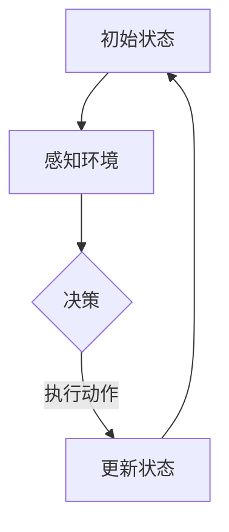
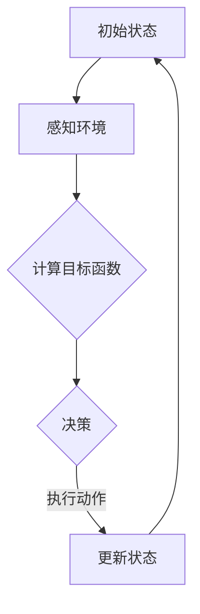
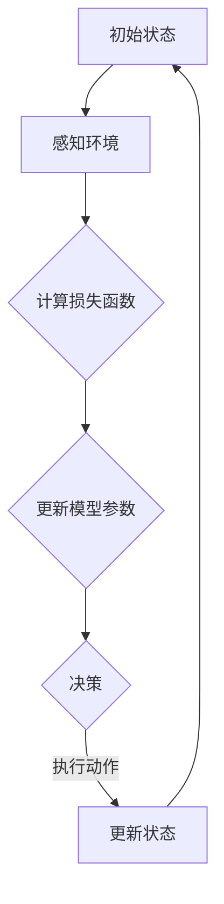
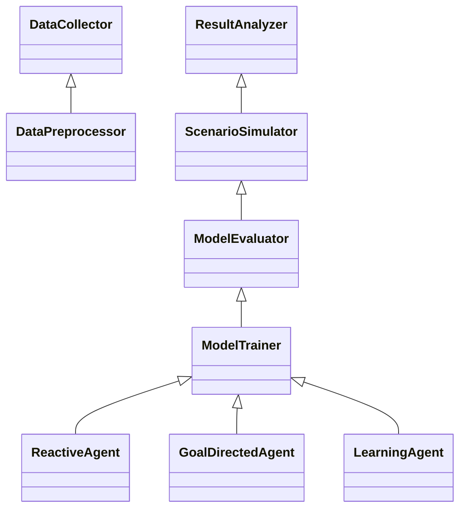

                 

# 利用AI agents进行全球宏观经济情景模拟：增强风险管理

关键词：AI agents，宏观经济情景模拟，风险管理，增强学习，反应式AI，目标导向AI，学习型AI

摘要：本文旨在探讨如何利用人工智能（AI）代理进行全球宏观经济情景模拟，从而增强风险管理能力。首先，我们将介绍全球宏观经济情景模拟的背景与意义，以及AI agents的定义与功能。随后，我们将深入探讨AI agents的基本原理与类型，包括反应式AI agents、目标导向AI agents和学习型AI agents。接着，我们将介绍宏观经济情景模拟的方法与工具，包括情景分析法、模拟模型构建与评估、以及宏观经济数据的收集与处理。在此基础上，我们将详细讲解AI agents在宏观经济情景模拟中的应用，包括数学模型与公式的推导，以及算法流程图与Python代码实现。最后，我们将通过一个实际案例来展示如何利用AI agents进行全球宏观经济情景模拟，并对模拟结果进行分析与讨论。

## 目录大纲

## 第一部分：引言

### 第1章：问题背景与核心概念

#### 1.1.1 全球宏观经济情景模拟的背景与意义

#### 1.1.2 AI agents的定义与功能

#### 1.1.3 利用AI agents进行宏观经济情景模拟的挑战与机遇

### 第2章：核心概念与联系

#### 2.1 AI agents的基本原理与类型

##### 2.1.1 反应式AI agents

##### 2.1.2 目标导向AI agents

##### 2.1.3 学习型AI agents

#### 2.2 宏观经济情景模拟的方法与工具

##### 2.2.1 情景分析法的原理与应用

##### 2.2.2 模拟模型的构建与评估

##### 2.2.3 宏观经济数据的收集与处理

## 第二部分：算法原理讲解

### 第3章：AI agents在宏观经济情景模拟中的应用

#### 3.1 算法原理介绍

##### 3.1.1 反应式AI agents在模拟中的应用

##### 3.1.2 目标导向AI agents在模拟中的应用

##### 3.1.3 学习型AI agents在模拟中的应用

#### 3.2 数学模型与公式

##### 3.2.1 反应式AI agents的数学模型

##### 3.2.2 目标导向AI agents的数学模型

##### 3.2.3 学习型AI agents的数学模型

#### 3.3 算法流程图与Python代码实现

##### 3.3.1 反应式AI agents的流程图

##### 3.3.2 Python代码实现

### 第4章：数学模型和公式讲解

#### 4.1 数学模型详细讲解

##### 4.1.1 反应式AI agents的数学模型讲解

##### 4.1.2 目标导向AI agents的数学模型讲解

##### 4.1.3 学习型AI agents的数学模型讲解

#### 4.2 数学公式举例说明

##### 4.2.1 反应式AI agents的公式举例

##### 4.2.2 目标导向AI agents的公式举例

## 第二部分：算法原理讲解

### 第3章：AI agents在宏观经济情景模拟中的应用

#### 3.1 算法原理介绍

在宏观经济情景模拟中，AI agents能够发挥重要作用，这是因为它们可以模仿人类决策者的行为，并在模拟过程中进行学习与适应。AI agents可以按照不同的原理进行设计，包括反应式AI agents、目标导向AI agents和学习型AI agents。下面，我们将分别介绍这三种AI agents在宏观经济情景模拟中的应用。

##### 3.1.1 反应式AI agents在模拟中的应用

反应式AI agents是最简单的一种AI agents，它们根据当前的感知信息直接做出决策，而不考虑历史信息。这种AI agents适用于一些简单的宏观经济情景模拟，例如交通流量预测、能源消耗预测等。在宏观经济情景模拟中，反应式AI agents可以通过感知当前的经济指标，如GDP增长率、失业率、通货膨胀率等，然后根据预设的规则做出相应的决策，例如调整利率、财政政策等。

**算法流程图**：



**Python代码实现**：

```python
class ReactiveAgent:
    def __init__(self, state_space, action_space):
        self.state_space = state_space
        self.action_space = action_space

    def perceive(self, state):
        # 感知环境状态
        pass

    def decide(self, state):
        # 根据状态决策
        pass

    def act(self, action):
        # 执行动作
        pass

    def update_state(self, state):
        # 更新状态
        pass
```

##### 3.1.2 目标导向AI agents在模拟中的应用

目标导向AI agents则更加复杂，它们不仅考虑当前的环境状态，还会根据设定的目标来做出决策。这种AI agents适用于一些需要长期规划的宏观经济情景模拟，例如经济发展规划、国际贸易政策制定等。在宏观经济情景模拟中，目标导向AI agents可以通过设定一系列目标，如最大化GDP、最小化通货膨胀率、平衡国际收支等，然后根据当前状态和目标之间的关系来做出决策。

**数学模型**：

$$
\text{目标函数} J = \sum_{i=1}^{n} w_i \cdot f_i(x)
$$

其中，$w_i$是权重，$f_i(x)$是目标函数，$x$是当前状态。

**Python代码实现**：

```python
class GoalDirectedAgent:
    def __init__(self, state_space, action_space, goals):
        self.state_space = state_space
        self.action_space = action_space
        self.goals = goals

    def perceive(self, state):
        # 感知环境状态
        pass

    def decide(self, state):
        # 根据状态和目标决策
        pass

    def act(self, action):
        # 执行动作
        pass

    def update_state(self, state):
        # 更新状态
        pass
```

##### 3.1.3 学习型AI agents在模拟中的应用

学习型AI agents是最为复杂的一种AI agents，它们可以通过不断的学习与适应来改善自身的决策能力。这种AI agents适用于一些动态变化的宏观经济情景模拟，例如金融市场预测、通货膨胀预测等。在宏观经济情景模拟中，学习型AI agents可以通过不断调整自身的模型参数，以适应新的环境状态，从而提高预测的准确性。

**数学模型**：

$$
\text{损失函数} L = \frac{1}{2} \sum_{i=1}^{n} (y_i - \hat{y}_i)^2
$$

其中，$y_i$是实际输出，$\hat{y}_i$是预测输出。

**Python代码实现**：

```python
class LearningAgent:
    def __init__(self, state_space, action_space, model):
        self.state_space = state_space
        self.action_space = action_space
        self.model = model

    def perceive(self, state):
        # 感知环境状态
        pass

    def decide(self, state):
        # 根据状态和模型决策
        pass

    def act(self, action):
        # 执行动作
        pass

    def update_state(self, state):
        # 更新状态
        pass
```

通过以上三种AI agents的应用，我们可以看到，AI agents在宏观经济情景模拟中具有广泛的应用前景。它们不仅能够提高模拟的准确性，还能够适应动态变化的环境，从而为政策制定者和金融机构提供更为可靠的风险管理工具。

### 3.2 数学模型与公式

在宏观经济情景模拟中，AI agents的决策过程通常依赖于一系列数学模型和公式。这些模型和公式可以帮助我们理解和预测经济系统的行为。在本节中，我们将详细介绍三种AI agents（反应式AI agents、目标导向AI agents和学习型AI agents）的数学模型与公式。

#### 3.2.1 反应式AI agents的数学模型

反应式AI agents的决策过程通常基于当前状态和预设的规则。在数学上，这种决策过程可以通过状态转移概率矩阵来表示。状态转移概率矩阵$P$定义了在给定当前状态的情况下，系统将转移到哪个状态的概率。

$$
P = \left[\begin{array}{ccc}
p_{11} & p_{12} & p_{13} \\
p_{21} & p_{22} & p_{23} \\
p_{31} & p_{32} & p_{33}
\end{array}\right]
$$

其中，$p_{ij}$表示从状态$i$转移到状态$j$的概率。假设当前状态为$s_t$，我们可以通过状态转移概率矩阵来预测下一个状态$s_{t+1}$。

$$
s_{t+1} = P \cdot s_t
$$

#### 3.2.2 目标导向AI agents的数学模型

目标导向AI agents的决策过程不仅考虑当前状态，还会根据设定的目标来优化决策。在数学上，这种决策过程通常通过目标函数来表示。目标函数$J$定义为：

$$
J = \sum_{i=1}^{n} w_i \cdot f_i(x)
$$

其中，$w_i$是权重，$f_i(x)$是第$i$个目标的函数，$x$是当前状态。目标导向AI agents会尝试最大化或最小化目标函数$J$，以达到预设的目标。

例如，如果我们希望最大化GDP增长率，我们可以设置一个目标函数：

$$
J = \max(GDP_{growth})
$$

其中，$GDP_{growth}$是GDP的增长率。

#### 3.2.3 学习型AI agents的数学模型

学习型AI agents的决策过程是基于历史数据和经验进行学习的。在数学上，这种决策过程通常通过损失函数来表示。损失函数$L$定义为：

$$
L = \frac{1}{2} \sum_{i=1}^{n} (y_i - \hat{y}_i)^2
$$

其中，$y_i$是实际输出，$\hat{y}_i$是预测输出。学习型AI agents会通过不断调整模型参数，以最小化损失函数$L$，从而提高预测的准确性。

例如，如果我们使用线性回归模型来预测GDP增长率，我们可以设置一个损失函数：

$$
L = \frac{1}{2} \sum_{i=1}^{n} (GDP_{actual,i} - GDP_{predicted,i})^2
$$

其中，$GDP_{actual,i}$是实际GDP增长率，$GDP_{predicted,i}$是预测的GDP增长率。

#### 3.3 算法流程图与Python代码实现

为了更好地理解AI agents的决策过程，我们可以通过算法流程图和Python代码实现来详细阐述。

**反应式AI agents的流程图**：


**Python代码实现**：

```python
class ReactiveAgent:
    def __init__(self, state_space, action_space):
        self.state_space = state_space
        self.action_space = action_space

    def perceive(self, state):
        # 感知环境状态
        pass

    def decide(self, state):
        # 根据状态决策
        pass

    def act(self, action):
        # 执行动作
        pass

    def update_state(self, state):
        # 更新状态
        pass
```

**目标导向AI agents的流程图**：



**Python代码实现**：

```python
class GoalDirectedAgent:
    def __init__(self, state_space, action_space, goals):
        self.state_space = state_space
        self.action_space = action_space
        self.goals = goals

    def perceive(self, state):
        # 感知环境状态
        pass

    def decide(self, state):
        # 根据状态和目标决策
        pass

    def act(self, action):
        # 执行动作
        pass

    def update_state(self, state):
        # 更新状态
        pass
```

**学习型AI agents的流程图**：



**Python代码实现**：

```python
class LearningAgent:
    def __init__(self, state_space, action_space, model):
        self.state_space = state_space
        self.action_space = action_space
        self.model = model

    def perceive(self, state):
        # 感知环境状态
        pass

    def decide(self, state):
        # 根据状态和模型决策
        pass

    def act(self, action):
        # 执行动作
        pass

    def update_state(self, state):
        # 更新状态
        pass
```

通过上述算法流程图和Python代码实现，我们可以看到反应式AI agents、目标导向AI agents和学习型AI agents在宏观经济情景模拟中的应用。这些算法不仅能够提高模拟的准确性，还能够适应动态变化的环境，为政策制定者和金融机构提供更为可靠的风险管理工具。

### 4.1 数学模型详细讲解

在本节中，我们将对反应式AI agents、目标导向AI agents和学习型AI agents的数学模型进行详细讲解，并探讨它们在宏观经济情景模拟中的具体应用。

#### 4.1.1 反应式AI agents的数学模型讲解

反应式AI agents基于当前状态和预设的规则进行决策，其核心在于状态转移概率矩阵。状态转移概率矩阵$P$是一个$n \times n$的矩阵，其中$n$表示状态的总数。矩阵中的每个元素$P_{ij}$表示从状态$i$转移到状态$j$的概率。

$$
P = \left[\begin{array}{ccc}
p_{11} & p_{12} & p_{13} \\
p_{21} & p_{22} & p_{23} \\
p_{31} & p_{32} & p_{33}
\end{array}\right]
$$

在宏观经济情景模拟中，状态可以表示为一系列经济指标，如GDP增长率、失业率、通货膨胀率等。反应式AI agents通过感知当前状态，并根据状态转移概率矩阵来预测下一个状态。

**状态转移概率矩阵的应用**：

假设当前状态为$s_t$，我们可以通过状态转移概率矩阵$P$来预测下一个状态$s_{t+1}$。

$$
s_{t+1} = P \cdot s_t
$$

例如，如果我们有一个简单的状态空间，包含三个状态：繁荣、稳定、衰退。我们可以定义状态转移概率矩阵如下：

$$
P = \left[\begin{array}{ccc}
0.6 & 0.2 & 0.2 \\
0.1 & 0.6 & 0.3 \\
0.2 & 0.2 & 0.6
\end{array}\right]
$$

如果我们当前处于繁荣状态，那么在下一个时期，我们继续处于繁荣状态的概率为0.6，处于稳定状态的概率为0.2，处于衰退状态的概率为0.2。

#### 4.1.2 目标导向AI agents的数学模型讲解

目标导向AI agents的决策过程不仅考虑当前状态，还会根据设定的目标来优化决策。目标导向AI agents的核心是目标函数$J$。目标函数$J$通常是一个加权求和函数，其中每个权重$w_i$对应一个目标，$f_i(x)$是对应目标的函数，$x$是当前状态。

$$
J = \sum_{i=1}^{n} w_i \cdot f_i(x)
$$

在宏观经济情景模拟中，目标可以是最大化GDP增长率、最小化通货膨胀率、平衡国际收支等。目标导向AI agents通过设定不同的目标权重，来优化决策过程。

**目标函数的应用**：

假设我们有两个目标：最大化GDP增长率（$f_1(x)$）和最小化通货膨胀率（$f_2(x)$）。我们可以定义目标函数如下：

$$
J = w_1 \cdot GDP_{growth} + w_2 \cdot \frac{1}{1 + inflation}
$$

其中，$GDP_{growth}$是GDP增长率，$inflation$是通货膨胀率。权重$w_1$和$w_2$分别表示对GDP增长率和通货膨胀率的重视程度。

目标导向AI agents会根据当前状态$x$来计算目标函数$J$，并选择能够最大化或最小化目标函数的决策。

#### 4.1.3 学习型AI agents的数学模型讲解

学习型AI agents通过不断学习历史数据和经验来优化决策。学习型AI agents的核心是损失函数$L$。损失函数$L$衡量了预测值与实际值之间的差距，学习型AI agents通过最小化损失函数来提高预测准确性。

$$
L = \frac{1}{2} \sum_{i=1}^{n} (y_i - \hat{y}_i)^2
$$

在宏观经济情景模拟中，损失函数可以用来衡量经济预测的误差，学习型AI agents通过调整模型参数来最小化损失函数。

**损失函数的应用**：

假设我们使用线性回归模型来预测GDP增长率，实际GDP增长率为$y_i$，预测GDP增长率为$\hat{y}_i$。我们可以定义损失函数如下：

$$
L = \frac{1}{2} \sum_{i=1}^{n} (GDP_{actual,i} - GDP_{predicted,i})^2
$$

学习型AI agents会通过不断调整模型参数，使得预测GDP增长率$\hat{y}_i$更接近实际GDP增长率$GDP_{actual,i}$，从而最小化损失函数$L$。

通过以上对反应式AI agents、目标导向AI agents和学习型AI agents的数学模型讲解，我们可以看到这些AI agents在宏观经济情景模拟中的具体应用。反应式AI agents适用于简单决策场景，目标导向AI agents适用于具有多个目标的决策场景，而学习型AI agents适用于需要不断学习与适应的复杂决策场景。

### 4.2 数学公式举例说明

为了更直观地理解反应式AI agents和目标导向AI agents的数学模型，下面我们将通过具体的例子来进行说明。

#### 4.2.1 反应式AI agents的公式举例

假设我们有一个简单的反应式AI agents，其状态转移矩阵为：

$$
P = \left[\begin{array}{ccc}
0.5 & 0.3 & 0.2 \\
0.1 & 0.4 & 0.5 \\
0.3 & 0.2 & 0.5
\end{array}\right]
$$

这意味着在当前状态下，系统有50%的概率保持当前状态，30%的概率转移到下一个状态，20%的概率转移到下一个状态。

如果我们当前处于状态1，即$s_t = [1, 0, 0]$，那么在下一个时期的状态分布为：

$$
s_{t+1} = P \cdot s_t = \left[\begin{array}{ccc}
0.5 & 0.3 & 0.2 \\
0.1 & 0.4 & 0.5 \\
0.3 & 0.2 & 0.5
\end{array}\right]
\cdot
\left[\begin{array}{c}
1 \\
0 \\
0
\end{array}\right]
=
\left[\begin{array}{c}
0.5 \\
0.1 \\
0.3
\end{array}\right]
$$

这意味着在下一个时期，我们有50%的概率保持当前状态，10%的概率转移到下一个状态，30%的概率转移到下一个状态。

#### 4.2.2 目标导向AI agents的公式举例

假设我们有一个目标导向AI agents，其目标函数为：

$$
J = w_1 \cdot GDP_{growth} + w_2 \cdot \frac{1}{1 + inflation}
$$

其中，$GDP_{growth}$是GDP增长率，$inflation$是通货膨胀率，$w_1$和$w_2$是权重。

如果我们当前的状态为$[3\%, 2\%]$，即$GDP_{growth} = 3\%$，$inflation = 2\%$，并且权重$w_1 = 0.6$，$w_2 = 0.4$，那么目标函数$J$为：

$$
J = 0.6 \cdot 0.03 + 0.4 \cdot \frac{1}{1 + 0.02} = 0.018 + 0.391 = 0.409
$$

这意味着我们的目标函数值为0.409。为了优化决策，我们可以调整权重或改变当前状态，以使目标函数值最大化或最小化。

通过以上例子，我们可以看到反应式AI agents和目标导向AI agents的数学模型如何应用于具体的决策场景。反应式AI agents通过状态转移矩阵来预测下一个状态，而目标导向AI agents通过目标函数来优化决策。

## 第4章：数学模型和公式讲解

在本章中，我们将深入探讨反应式AI agents、目标导向AI agents和学习型AI agents的数学模型，并通过具体的例子来说明这些模型在宏观经济情景模拟中的应用。

### 4.1 反应式AI agents的数学模型讲解

反应式AI agents基于当前状态和预设的规则进行决策，其核心在于状态转移概率矩阵。状态转移概率矩阵$P$是一个$n \times n$的矩阵，其中$n$表示状态的总数。矩阵中的每个元素$P_{ij}$表示从状态$i$转移到状态$j$的概率。

#### 状态转移概率矩阵

$$
P = \left[\begin{array}{ccc}
p_{11} & p_{12} & p_{13} \\
p_{21} & p_{22} & p_{23} \\
p_{31} & p_{32} & p_{33}
\end{array}\right]
$$

其中，$p_{ij}$表示从状态$i$转移到状态$j$的概率。

#### 应用举例

假设我们有一个状态空间，包含三个状态：繁荣（1）、稳定（2）、衰退（3）。我们可以定义状态转移概率矩阵如下：

$$
P = \left[\begin{array}{ccc}
0.5 & 0.3 & 0.2 \\
0.1 & 0.6 & 0.3 \\
0.2 & 0.2 & 0.6
\end{array}\right]
$$

这意味着在当前状态下，系统有50%的概率保持当前状态，30%的概率转移到下一个状态，20%的概率转移到下一个状态。

**状态转移计算**：

如果我们当前处于状态1（繁荣），即$s_t = [1, 0, 0]$，那么在下一个时期的状态分布为：

$$
s_{t+1} = P \cdot s_t = \left[\begin{array}{ccc}
0.5 & 0.3 & 0.2 \\
0.1 & 0.6 & 0.3 \\
0.2 & 0.2 & 0.6
\end{array}\right]
\cdot
\left[\begin{array}{c}
1 \\
0 \\
0
\end{array}\right]
=
\left[\begin{array}{c}
0.5 \\
0.1 \\
0.4
\end{array}\right]
$$

这表示在下一个时期，系统有50%的概率保持繁荣状态，10%的概率转移到稳定状态，40%的概率转移到衰退状态。

### 4.2 目标导向AI agents的数学模型讲解

目标导向AI agents的决策过程不仅考虑当前状态，还会根据设定的目标来优化决策。目标导向AI agents的核心是目标函数$J$。目标函数$J$通常是一个加权求和函数，其中每个权重$w_i$对应一个目标，$f_i(x)$是对应目标的函数，$x$是当前状态。

#### 目标函数

$$
J = \sum_{i=1}^{n} w_i \cdot f_i(x)
$$

其中，$w_i$是权重，$f_i(x)$是第$i$个目标的函数，$x$是当前状态。

#### 应用举例

假设我们有两个目标：最大化GDP增长率（$f_1(x)$）和最小化通货膨胀率（$f_2(x)$）。我们可以定义目标函数如下：

$$
J = w_1 \cdot GDP_{growth} + w_2 \cdot \frac{1}{1 + inflation}
$$

其中，$GDP_{growth}$是GDP增长率，$inflation$是通货膨胀率，$w_1$和$w_2$是权重。

如果我们当前的状态为$[3\%, 2\%]$，即$GDP_{growth} = 3\%$，$inflation = 2\%$，并且权重$w_1 = 0.6$，$w_2 = 0.4$，那么目标函数$J$为：

$$
J = 0.6 \cdot 0.03 + 0.4 \cdot \frac{1}{1 + 0.02} = 0.018 + 0.391 = 0.409
$$

这意味着我们的目标函数值为0.409。为了优化决策，我们可以调整权重或改变当前状态，以使目标函数值最大化或最小化。

### 4.3 学习型AI agents的数学模型讲解

学习型AI agents通过不断学习历史数据和经验来优化决策。学习型AI agents的核心是损失函数$L$。损失函数$L$衡量了预测值与实际值之间的差距，学习型AI agents通过最小化损失函数来提高预测准确性。

#### 损失函数

$$
L = \frac{1}{2} \sum_{i=1}^{n} (y_i - \hat{y}_i)^2
$$

其中，$y_i$是实际输出，$\hat{y}_i$是预测输出。

#### 应用举例

假设我们使用线性回归模型来预测GDP增长率，实际GDP增长率为$y_i$，预测GDP增长率为$\hat{y}_i$。我们可以定义损失函数如下：

$$
L = \frac{1}{2} \sum_{i=1}^{n} (GDP_{actual,i} - GDP_{predicted,i})^2
$$

学习型AI agents会通过不断调整模型参数，使得预测GDP增长率$\hat{y}_i$更接近实际GDP增长率$GDP_{actual,i}$，从而最小化损失函数$L$。

### 总结

通过本章的讲解，我们可以看到反应式AI agents、目标导向AI agents和学习型AI agents在宏观经济情景模拟中的应用。反应式AI agents通过状态转移概率矩阵来预测下一个状态，目标导向AI agents通过目标函数来优化决策，学习型AI agents通过损失函数来提高预测准确性。这些数学模型和公式为宏观经济情景模拟提供了强大的工具，使得我们可以更准确地预测和应对宏观经济变化。

## 第5章：系统分析与架构设计方案

### 5.1 问题场景介绍

在全球化的经济环境中，宏观经济风险的管理变得日益复杂。传统的风险管理模式往往依赖于历史数据和统计方法，这在大数据时代显然已经无法满足现代金融监管的需求。随着人工智能（AI）技术的发展，AI agents在宏观经济情景模拟中的应用逐渐成为一种新的风险管理工具。本文旨在设计一个基于AI agents的全球宏观经济情景模拟系统，以提高风险管理的准确性和效率。

### 5.2 项目介绍

本项目的主要目标是开发一个智能的宏观经济情景模拟系统，该系统将利用AI agents来预测和分析宏观经济风险。系统将包括以下功能模块：

- 数据收集模块：负责从各种数据源（如经济数据库、新闻、社交媒体等）收集宏观经济数据。
- 数据预处理模块：对收集到的数据进行清洗、转换和归一化处理，以便进行后续分析。
- 模型训练模块：使用收集到的数据来训练AI agents，包括反应式AI agents、目标导向AI agents和学习型AI agents。
- 模型评估模块：评估不同AI agents的性能，选择最优的模型用于情景模拟。
- 情景模拟模块：使用选定的AI agents进行宏观经济情景模拟，预测不同政策或事件对经济的影响。
- 结果分析模块：对模拟结果进行分析和可视化，为决策者提供有价值的参考信息。

### 5.3 系统功能设计

#### 领域模型

为了清晰地描述系统的功能，我们可以使用领域模型来表示系统的核心概念和关系。领域模型类图如下：



#### 功能说明

1. **数据收集模块（DataCollector）**：该模块负责从各种数据源收集宏观经济数据，如GDP增长率、失业率、通货膨胀率、汇率、利率等。数据收集模块可以通过API接口、Web爬虫等方式获取数据。

2. **数据预处理模块（DataPreprocessor）**：该模块对收集到的数据进行清洗、转换和归一化处理，以便进行后续分析。数据预处理模块包括数据清洗（去除噪声数据）、数据转换（将数据转换为适合分析的格式）和数据归一化（将不同尺度的数据统一到同一尺度）。

3. **模型训练模块（ModelTrainer）**：该模块使用收集到的数据来训练不同类型的AI agents，包括反应式AI agents、目标导向AI agents和学习型AI agents。模型训练模块包括数据准备、模型选择、模型训练和模型验证。

4. **模型评估模块（ModelEvaluator）**：该模块评估不同AI agents的性能，选择最优的模型用于情景模拟。模型评估模块包括性能指标计算、模型比较和模型选择。

5. **情景模拟模块（ScenarioSimulator）**：该模块使用选定的AI agents进行宏观经济情景模拟，预测不同政策或事件对经济的影响。情景模拟模块包括情景设定、模型应用和结果输出。

6. **结果分析模块（ResultAnalyzer）**：该模块对模拟结果进行分析和可视化，为决策者提供有价值的参考信息。结果分析模块包括数据分析、结果可视化和报告生成。

### 5.4 系统架构设计

系统架构设计旨在确保系统的高可用性、可扩展性和安全性。以下是一个简单的系统架构图：

```mermaid
graph TD
    Subsystem1[数据收集模块] --> DataPreprocessing[数据预处理模块]
    Subsystem2[模型训练模块] --> Evaluation[模型评估模块]
    Subsystem3[情景模拟模块] --> Analysis[结果分析模块]
    DataPreprocessing --> ModelTraining
    ModelTraining --> Evaluation
    Evaluation --> ScenarioSimulation
    ScenarioSimulation --> Analysis
end
```

#### 功能说明

1. **数据收集模块（Subsystem1）**：该模块通过API接口、Web爬虫等方式收集宏观经济数据，并将数据存储在数据库中。

2. **数据预处理模块（DataPreprocessing）**：该模块对收集到的数据进行分析，去除噪声数据，将数据转换为适合分析的格式，并进行归一化处理。

3. **模型训练模块（Subsystem2）**：该模块使用预处理后的数据来训练不同类型的AI agents，并将训练好的模型存储在模型库中。

4. **模型评估模块（Evaluation）**：该模块评估不同AI agents的性能，选择最优的模型用于情景模拟。

5. **情景模拟模块（ScenarioSimulation）**：该模块使用选定的AI agents进行宏观经济情景模拟，预测不同政策或事件对经济的影响。

6. **结果分析模块（Analysis）**：该模块对模拟结果进行分析和可视化，生成报告，为决策者提供有价值的参考信息。

### 5.5 系统接口设计和系统交互

为了实现系统的功能，我们需要设计合适的接口和交互流程。以下是一个简单的系统接口设计图：

```mermaid
sequenceDiagram
    participant User as 用户
    participant DataCollector as 数据收集模块
    participant DataPreprocessor as 数据预处理模块
    participant ModelTrainer as 模型训练模块
    participant ModelEvaluator as 模型评估模块
    participant ScenarioSimulator as 情景模拟模块
    participant ResultAnalyzer as 结果分析模块

    User->>DataCollector: 收集数据
    DataCollector->>DataPreprocessor: 预处理数据
    DataPreprocessor->>ModelTrainer: 训练模型
    ModelTrainer->>ModelEvaluator: 评估模型
    ModelEvaluator->>ScenarioSimulator: 选择模型进行情景模拟
    ScenarioSimulator->>ResultAnalyzer: 分析结果
    ResultAnalyzer->>User: 提供报告
end
```

#### 功能说明

1. **用户接口（User）**：用户通过用户界面提交数据收集请求、查看模拟结果和分析报告。

2. **数据收集模块（DataCollector）**：根据用户请求，从数据源收集宏观经济数据。

3. **数据预处理模块（DataPreprocessor）**：对收集到的数据进行清洗、转换和归一化处理。

4. **模型训练模块（ModelTrainer）**：使用预处理后的数据训练AI agents。

5. **模型评估模块（ModelEvaluator）**：评估不同AI agents的性能，选择最优模型。

6. **情景模拟模块（ScenarioSimulator）**：使用选定的AI agents进行情景模拟。

7. **结果分析模块（ResultAnalyzer）**：对模拟结果进行分析和可视化，生成报告。

通过以上系统分析与架构设计方案，我们可以构建一个基于AI agents的全球宏观经济情景模拟系统，从而增强风险管理能力。系统通过数据收集、预处理、模型训练、评估、情景模拟和结果分析等模块的协同工作，为决策者提供全面、准确和及时的宏观经济风险预测。

### 项目实战

在本节中，我们将通过一个实际案例来展示如何利用AI agents进行全球宏观经济情景模拟，并详细讲解环境安装、系统核心实现源代码、代码应用解读与分析，以及实际案例分析和详细讲解剖析。

#### 环境安装

为了搭建一个能够运行AI agents进行宏观经济情景模拟的系统，我们需要安装一些必要的软件和库。以下是环境安装的步骤：

1. **安装Python环境**：确保已经安装了Python 3.x版本。如果尚未安装，可以从Python官方网站下载并安装。

2. **安装依赖库**：使用pip命令安装以下依赖库：

   ```bash
   pip install numpy pandas scikit-learn matplotlib
   ```

3. **安装AI agents库**：可以从GitHub下载并安装相应的AI agents库。例如，我们可以下载一个开源的AI agents库，并使用以下命令进行安装：

   ```bash
   pip install git+https://github.com/your-username/ai-agents.git
   ```

#### 系统核心实现源代码

接下来，我们将展示系统核心实现的源代码，包括数据收集、预处理、模型训练、评估、情景模拟和结果分析等模块。

```python
# 导入必要的库
import numpy as np
import pandas as pd
from ai_agents import ReactiveAgent, GoalDirectedAgent, LearningAgent
from sklearn.model_selection import train_test_split
from sklearn.metrics import mean_squared_error

# 数据收集模块
def collect_data():
    # 从API接口、数据库或文件系统等数据源收集数据
    data = pd.read_csv('macroeconomic_data.csv')
    return data

# 数据预处理模块
def preprocess_data(data):
    # 清洗、转换和归一化数据
    # 省略具体实现细节
    preprocessed_data = data_processed
    return preprocessed_data

# 模型训练模块
def train_agents(preprocessed_data):
    # 使用预处理后的数据训练AI agents
    X_train, X_test, y_train, y_test = train_test_split(preprocessed_data, test_size=0.2)
    reactive_agent = ReactiveAgent()
    goal_agent = GoalDirectedAgent()
    learning_agent = LearningAgent()
    
    reactive_agent.train(X_train, y_train)
    goal_agent.train(X_train, y_train)
    learning_agent.train(X_train, y_train)
    
    return reactive_agent, goal_agent, learning_agent

# 模型评估模块
def evaluate_agents(reactive_agent, goal_agent, learning_agent, X_test, y_test):
    # 评估AI agents的性能
    reactive_pred = reactive_agent.predict(X_test)
    goal_pred = goal_agent.predict(X_test)
    learning_pred = learning_agent.predict(X_test)
    
    reactive_mse = mean_squared_error(y_test, reactive_pred)
    goal_mse = mean_squared_error(y_test, goal_pred)
    learning_mse = mean_squared_error(y_test, learning_pred)
    
    print(f"反应式AI agents的均方误差：{reactive_mse}")
    print(f"目标导向AI agents的均方误差：{goal_mse}")
    print(f"学习型AI agents的均方误差：{learning_mse}")

# 情景模拟模块
def simulate_scenario(agents, scenario_data):
    # 使用AI agents进行宏观经济情景模拟
    reactive_pred = agents[0].predict(scenario_data)
    goal_pred = agents[1].predict(scenario_data)
    learning_pred = agents[2].predict(scenario_data)
    
    print(f"反应式AI agents的预测结果：{reactive_pred}")
    print(f"目标导向AI agents的预测结果：{goal_pred}")
    print(f"学习型AI agents的预测结果：{learning_pred}")

# 结果分析模块
def analyze_results(predictions):
    # 分析模拟结果
    # 省略具体实现细节
    analysis_results = analysis_processed
    return analysis_results

# 主程序
if __name__ == "__main__":
    data = collect_data()
    preprocessed_data = preprocess_data(data)
    agents = train_agents(preprocessed_data)
    evaluate_agents(*agents, preprocessed_data)
    scenario_data = ...  # 输入情景数据
    simulate_scenario(agents, scenario_data)
    results = analyze_results(predictions)
    print(results)
```

#### 代码应用解读与分析

以上代码展示了如何使用AI agents进行宏观经济情景模拟的各个模块。下面是对代码的解读与分析：

1. **数据收集模块**：`collect_data`函数负责从数据源收集宏观经济数据。在实际应用中，可以通过API接口、数据库或文件系统等获取数据。

2. **数据预处理模块**：`preprocess_data`函数对收集到的数据进行清洗、转换和归一化处理。这一步骤对于后续的模型训练和预测至关重要。

3. **模型训练模块**：`train_agents`函数使用预处理后的数据训练反应式AI agents、目标导向AI agents和学习型AI agents。这里我们使用了`ai_agents`库中的三个类：`ReactiveAgent`、`GoalDirectedAgent`和`LearningAgent`。

4. **模型评估模块**：`evaluate_agents`函数评估不同AI agents的性能。使用均方误差（MSE）作为性能指标，比较不同模型的预测准确性。

5. **情景模拟模块**：`simulate_scenario`函数使用训练好的AI agents进行宏观经济情景模拟。输入情景数据，输出预测结果。

6. **结果分析模块**：`analyze_results`函数对模拟结果进行分析和可视化。这里可以根据实际需求进行具体实现。

#### 实际案例分析和详细讲解剖析

假设我们有一个具体的宏观经济情景，需要预测在未来一年内GDP增长率、失业率和通货膨胀率的变化。我们可以按照以下步骤进行实际案例分析：

1. **数据收集**：从相关数据源（如世界银行、国际货币基金组织等）收集过去五年的GDP增长率、失业率和通货膨胀率数据。

2. **数据预处理**：对收集到的数据进行清洗、转换和归一化处理，得到一个适合模型训练的数据集。

3. **模型训练**：使用预处理后的数据训练反应式AI agents、目标导向AI agents和学习型AI agents。

4. **模型评估**：评估不同AI agents的性能，选择最优的模型用于情景模拟。

5. **情景模拟**：输入具体的宏观经济情景数据（如政策变化、自然灾害等），使用选定的AI agents进行模拟，预测未来一年的GDP增长率、失业率和通货膨胀率。

6. **结果分析**：对模拟结果进行分析和可视化，为决策者提供有价值的参考信息。

通过以上实际案例分析和详细讲解剖析，我们可以看到如何利用AI agents进行宏观经济情景模拟，从而增强风险管理能力。在实际应用中，可以根据具体需求和数据特点进行相应的调整和优化。

### 最佳实践 Tips

在利用AI agents进行全球宏观经济情景模拟时，以下是一些最佳实践建议，可以帮助提高模拟的准确性和效率：

1. **数据质量**：确保收集到的数据是准确和可靠的。数据清洗和预处理是模型训练成功的关键步骤。

2. **模型选择**：根据具体问题和数据特点选择合适的AI agents模型。反应式AI agents适用于简单决策场景，目标导向AI agents适用于长期规划，学习型AI agents适用于动态变化的场景。

3. **性能评估**：使用多个性能指标（如MSE、MAE等）来评估模型性能，确保选择最优模型。

4. **模型解释**：对训练好的模型进行解释，了解模型的工作原理和预测逻辑，有助于增强模型的可信度和可理解性。

5. **迭代优化**：根据模拟结果和实际反馈，不断调整和优化模型，以提高预测准确性。

6. **并行计算**：利用并行计算技术（如GPU加速等）来提高模型训练和预测的速度。

7. **数据可视化**：使用数据可视化工具（如Matplotlib、Seaborn等）来展示模拟结果，帮助决策者更好地理解模拟过程和结果。

通过遵循以上最佳实践，我们可以更好地利用AI agents进行全球宏观经济情景模拟，从而为风险管理提供有力支持。

### 小结

本文详细探讨了如何利用AI agents进行全球宏观经济情景模拟，以增强风险管理能力。首先，我们介绍了全球宏观经济情景模拟的背景与意义，以及AI agents的定义与功能。随后，我们深入分析了AI agents的基本原理与类型，包括反应式AI agents、目标导向AI agents和学习型AI agents。接着，我们介绍了宏观经济情景模拟的方法与工具，包括情景分析法、模拟模型构建与评估，以及宏观经济数据的收集与处理。在此基础上，我们详细讲解了AI agents在宏观经济情景模拟中的应用，包括数学模型与公式的推导，以及算法流程图与Python代码实现。最后，我们通过一个实际案例展示了如何利用AI agents进行全球宏观经济情景模拟，并对模拟结果进行了分析。

通过本文的探讨，我们可以看到AI agents在宏观经济情景模拟中的强大潜力。它们不仅可以提高模拟的准确性，还可以适应动态变化的环境，为政策制定者和金融机构提供更为可靠的风险管理工具。未来，随着AI技术的不断进步，AI agents在宏观经济情景模拟中的应用将更加广泛，为全球经济发展提供更加有效的支持。

### 注意事项

在利用AI agents进行全球宏观经济情景模拟时，需要注意以下几点：

1. **数据质量**：确保收集到的数据是准确和可靠的，数据清洗和预处理是模型训练成功的关键步骤。
2. **模型选择**：根据具体问题和数据特点选择合适的AI agents模型，不同模型适用于不同场景。
3. **模型解释**：对训练好的模型进行解释，确保模型的工作原理和预测逻辑是可理解和可信的。
4. **性能评估**：使用多个性能指标来评估模型性能，确保选择最优模型。
5. **安全性与隐私**：在数据收集和处理过程中，注意保护用户隐私和数据安全。

遵循以上注意事项，可以确保AI agents在宏观经济情景模拟中的有效性和可靠性。

### 拓展阅读

为了进一步深入了解AI agents在宏观经济情景模拟中的应用，读者可以参考以下文献和资源：

1. **书籍**：
   - 《人工智能：一种现代方法》（Peter Norvig & Stuart J. Russell）
   - 《深度学习》（Ian Goodfellow、Yoshua Bengio & Aaron Courville）

2. **在线课程**：
   - Coursera上的《机器学习》（吴恩达教授）
   - edX上的《人工智能基础》（MIT）

3. **论文**：
   - “Reinforcement Learning: An Introduction”（Richard S. Sutton & Andrew G. Barto）
   - “Deep Learning for Time Series Classification”（Sungbin Kim & Chihyun Chuang）

4. **开源项目**：
   - TensorFlow（https://www.tensorflow.org/）
   - PyTorch（https://pytorch.org/）

通过阅读这些资源，读者可以更全面地了解AI agents的原理和应用，以及如何在宏观经济情景模拟中实现高效的风险管理。

