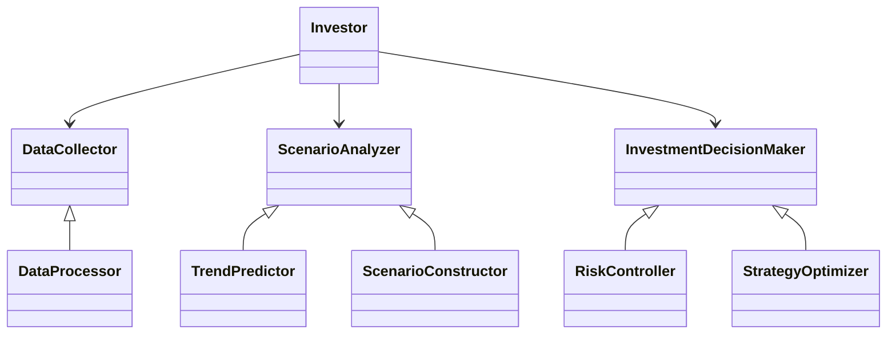
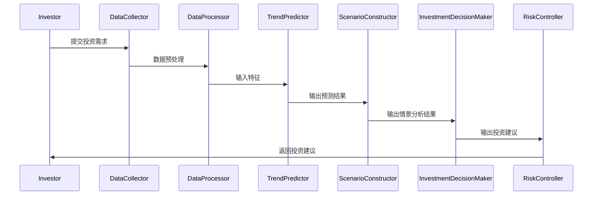

                 

# 利用AI agents进行情景分析：增强价值投资的适应性

> 关键词：AI agents，情景分析，价值投资，适应性，数据分析，机器学习

> 摘要：本文旨在探讨如何利用AI agents进行情景分析，以增强价值投资的适应性。通过对AI agents和情景分析的定义、特点以及与价值投资的关系的深入分析，本文将提出一系列构建和优化AI agents模型的方法，以实现更准确、适应性更强的投资决策。

## 第一部分：背景介绍

### 1.1 问题背景

随着人工智能技术的快速发展，AI agents在各个领域的应用越来越广泛，特别是在价值投资领域。AI agents具有强大的数据分析和预测能力，可以帮助投资者更好地理解市场趋势，提高投资决策的准确性。然而，如何利用AI agents进行情景分析，以增强价值投资的适应性，成为一个重要且值得研究的问题。

### 1.2 问题描述

在价值投资领域，投资者需要深入分析市场情景，预测未来的市场变化，以便做出正确的投资决策。而AI agents作为一种新兴的技术工具，具备以下问题需要解决：

1. **AI agents在价值投资中的应用现状与挑战**：如何有效地利用AI agents进行价值投资分析，提高投资决策的准确性？
2. **构建有效的AI agents模型**：如何构建一个能够准确预测市场情景的AI agents模型？
3. **利用AI agents的预测能力**：如何利用AI agents的预测能力，提高投资决策的适应性和准确性？
4. **AI agents在价值投资中的应用场景和最佳实践**：在价值投资领域，如何应用AI agents，并制定最佳实践策略？

### 1.3 问题解决

本书将通过对AI agents的深入研究和实际案例分析，提供一系列解决方案和实用技巧，帮助投资者更好地利用AI agents进行情景分析，增强价值投资的适应性。

### 1.4 边界与外延

本书主要关注AI agents在价值投资领域的应用，包括股票、基金、期货等金融市场的投资决策。同时，本书也涉及AI agents在其他领域的应用，如房地产、商品等。

### 1.5 概念结构与核心要素组成

本书的核心概念包括：

1. **AI agents**：一种基于人工智能技术的自动化决策系统，具有数据采集、分析、预测和决策能力。
2. **情景分析**：通过对历史数据和市场趋势的分析，预测未来可能发生的市场情景。
3. **价值投资**：一种以长期投资为目标，以企业价值为核心的投资策略。
4. **投资适应性**：投资者在面对市场变化时，调整投资策略以适应市场变化的能力。

核心要素组成：

1. **数据采集与处理**：收集并处理与投资相关的数据，包括财务报表、市场行情等。
2. **情景分析模型**：构建用于情景分析的人工智能模型，如深度学习模型、强化学习模型等。
3. **投资策略优化**：利用情景分析结果，优化投资策略，提高投资决策的准确性和适应性。
4. **风险控制**：在投资过程中，对风险进行有效控制，确保投资安全。

### 1.6 本章小结

本章对利用AI agents进行情景分析的价值投资问题进行了背景介绍，明确了问题描述、问题解决方法、边界与外延，以及核心概念结构与核心要素组成。下一章将深入探讨AI agents的定义与特点。

----------------------------------------------------------------

## 第二部分：核心概念与联系

### 2.1 AI agents的定义与特点

#### 2.1.1 AI agents的定义

AI agents，也称为智能代理，是指一种能够感知环境、制定计划、执行行动并从经验中学习的人工智能实体。它们在特定环境中自主行动，以实现预定的目标。

#### 2.1.2 AI agents的特点

1. **自主性**：AI agents能够根据感知到的环境信息和预定的目标，自主制定行动策略，无需人工干预。
   
2. **适应性**：AI agents能够根据环境变化和执行过程中获取的新信息，调整自己的行为策略。

3. **学习性**：AI agents可以通过机器学习算法从数据中学习，提高其任务执行能力和决策质量。

4. **交互性**：AI agents能够与人类或其他AI系统进行交互，以获取更多信息或执行更复杂的任务。

#### 2.1.3 AI agents与传统AI的区别

- **主动性**：传统AI通常基于预定义的规则和算法进行操作，而AI agents具有主动性，能够自主探索环境和执行任务。
- **情境理解**：传统AI难以理解复杂情境，而AI agents能够理解并适应复杂、动态的环境。
- **动态性**：传统AI针对的是静态问题，而AI agents能够处理动态问题，实时调整行为策略。

#### 2.1.4 AI agents在价值投资中的应用

在价值投资领域，AI agents可以通过以下方式应用：

1. **数据采集与分析**：收集并分析市场数据，如股票价格、财务报表、宏观经济指标等。
2. **情景预测**：利用机器学习算法，预测市场情景，如股价走势、行业趋势等。
3. **投资决策**：根据情景预测结果，提供投资建议，优化投资组合。

### 2.2 情景分析

#### 2.2.1 情景分析的定义

情景分析是指通过对历史数据和市场趋势的分析，预测未来可能发生的市场情景。它是一种前瞻性的分析工具，旨在为投资决策提供指导。

#### 2.2.2 情景分析的特点

1. **前瞻性**：情景分析能够提前预测市场变化，为投资决策提供前瞻性指导。

2. **全面性**：情景分析涵盖多个方面，如经济、政策、社会等，为投资决策提供全面的信息。

3. **动态性**：情景分析能够适应市场变化，实时更新，提高投资决策的准确性。

#### 2.2.3 情景分析的方法

1. **历史数据分析**：通过分析历史数据，找出市场规律和趋势。

2. **趋势预测**：利用机器学习算法，预测市场趋势。

3. **情景构建**：根据预测结果，构建可能的未来情景，评估其对投资决策的影响。

### 2.3 价值投资

#### 2.3.1 价值投资的定义

价值投资是指以企业价值为核心，通过分析企业基本面，选择具有长期投资价值的股票。其核心在于寻找被市场低估的优质股票，并长期持有。

#### 2.3.2 价值投资的特点

1. **长期投资**：价值投资追求长期回报，关注企业价值的增长。
2. **基本面分析**：价值投资主要依赖基本面分析，如财务报表、行业地位、管理水平等。
3. **逆向思维**：价值投资通常在市场情绪低迷时寻找投资机会，与市场逆向操作。

#### 2.3.3 价值投资与AI agents的关系

AI agents可以帮助价值投资者：

1. **数据采集与分析**：自动化收集和处理大量数据，提高分析效率。
2. **情景预测**：预测市场情景，帮助投资者调整投资策略。
3. **投资决策**：基于情景分析和基本面分析，提供投资建议。

### 2.4 AI agents、情景分析与价值投资的关系

AI agents、情景分析与价值投资之间的关系可以总结如下：

1. **AI agents** 提供了数据采集、分析和预测的工具，使得情景分析更加高效和准确。
2. **情景分析** 为价值投资提供了前瞻性的市场信息，帮助投资者做出更明智的决策。
3. **价值投资** 是AI agents和情景分析服务的目标，通过结合两者，可以更好地实现投资目标。

## 2.5 概念属性特征对比表格

以下是一个简单的概念属性特征对比表格，展示了AI agents、情景分析和价值投资的关键属性特征：

| 概念          | 自主性 | 适应性 | 学习性 | 交互性 |
| ------------- | ------ | ------ | ------ | ------ |
| AI agents     | 是     | 是     | 是     | 是     |
| 情景分析      | 否     | 是     | 否     | 否     |
| 价值投资      | 否     | 否     | 否     | 否     |

### 2.6 AI agents、情景分析与价值投资的ER实体关系图架构

以下是一个ER实体关系图，展示了AI agents、情景分析和价值投资之间的联系：

```mermaid
erDiagram
    AI_Agents ||--|{ 情景分析 }
    AI_Agents ||--|{ 价值投资 }
    情景分析 ||--|{ 价值投资 }
```

通过这个ER图，我们可以看到AI agents既是情景分析的基础，也是价值投资的重要工具。情景分析为价值投资提供了前瞻性的信息支持，而价值投资则是AI agents和情景分析的最终目标。

### 2.7 本章小结

本章深入探讨了AI agents、情景分析和价值投资的核心概念、特点及其关系。通过对比分析，我们明确了这些概念之间的联系，并展示了它们在价值投资中的重要作用。下一章将详细讨论如何构建和优化AI agents模型进行情景分析。

----------------------------------------------------------------

## 第三部分：算法原理讲解

### 3.1 AI agents模型构建

为了利用AI agents进行情景分析，我们需要首先构建一个有效的AI agents模型。以下是一个基于深度学习的情景分析模型的构建过程：

#### 3.1.1 数据采集与预处理

1. **数据来源**：收集与投资相关的数据，如股票价格、财务报表、宏观经济指标等。
2. **数据预处理**：清洗数据，去除噪声和异常值，并进行归一化处理。

#### 3.1.2 特征提取

1. **特征选择**：根据投资目标，选择与市场情景相关的特征。
2. **特征提取**：利用统计学方法或机器学习算法，提取特征。

#### 3.1.3 模型构建

1. **模型选择**：选择合适的深度学习模型，如卷积神经网络（CNN）或循环神经网络（RNN）。
2. **模型训练**：利用训练数据，训练深度学习模型。

#### 3.1.4 模型评估与优化

1. **模型评估**：使用验证数据集，评估模型性能。
2. **模型优化**：根据评估结果，调整模型参数，提高模型性能。

### 3.2 情景预测算法

在构建AI agents模型后，我们需要利用该模型进行情景预测。以下是一个基于机器学习的情景预测算法：

#### 3.2.1 基于历史数据分析的情景预测

1. **数据收集**：收集与投资相关的历史数据，如股票价格、成交量等。
2. **特征提取**：提取与市场情景相关的特征，如价格趋势、波动率等。
3. **模型选择**：选择合适的机器学习算法，如决策树、随机森林或支持向量机（SVM）。
4. **模型训练**：利用历史数据，训练机器学习模型。
5. **情景预测**：使用训练好的模型，预测未来市场情景。

#### 3.2.2 基于趋势预测的情景预测

1. **数据收集**：收集与投资相关的历史数据，如股票价格、财务报表等。
2. **特征提取**：提取与市场情景相关的特征，如财务指标、行业趋势等。
3. **模型选择**：选择合适的机器学习算法，如时间序列模型、LSTM（长短时记忆网络）或GRU（门控循环单元）。
4. **模型训练**：利用历史数据，训练机器学习模型。
5. **情景预测**：使用训练好的模型，预测未来市场情景。

### 3.3 数学模型与公式

在情景分析和AI agents模型构建中，我们通常会使用以下数学模型和公式：

#### 3.3.1 深度学习模型

$$
y = \sigma(W_2 \cdot \sigma(W_1 \cdot x) + b_2) + b_1
$$

其中，$x$ 是输入特征，$W_1$ 和 $W_2$ 是权重矩阵，$b_1$ 和 $b_2$ 是偏置项，$\sigma$ 是激活函数。

#### 3.3.2 机器学习模型

1. **决策树**：

$$
f(x) = \sum_{i=1}^{n} w_i \cdot I(y_i > \theta_i)
$$

其中，$w_i$ 是权重，$\theta_i$ 是阈值，$I$ 是指示函数。

2. **随机森林**：

$$
f(x) = \sum_{j=1}^{m} \hat{y}_j \cdot \phi_j(x)
$$

其中，$\hat{y}_j$ 是第 $j$ 个决策树输出的预测值，$\phi_j(x)$ 是第 $j$ 个决策树的特征函数。

#### 3.3.3 时间序列模型

1. **LSTM**：

$$
h_t = \sigma(W_h \cdot [h_{t-1}, x_t] + b_h)
$$

$$
i_t = \sigma(W_i \cdot [h_{t-1}, x_t] + b_i)
$$

$$
f_t = \sigma(W_f \cdot [h_{t-1}, x_t] + b_f)
$$

$$
o_t = \sigma(W_o \cdot [h_{t-1}, x_t] + b_o)
$$

$$
c_t = f_t \cdot c_{t-1} + i_t \cdot \sigma(W_c \cdot [h_{t-1}, x_t] + b_c)
$$

$$
h_t = o_t \cdot \sigma(c_t)
$$

其中，$h_t$ 是隐藏状态，$c_t$ 是细胞状态，$i_t$、$f_t$、$o_t$ 分别是输入门、遗忘门、输出门。

#### 3.4 举例说明

假设我们使用LSTM模型进行情景预测，输入特征为股票价格序列。我们可以通过以下步骤进行预测：

1. **数据收集**：收集过去一年的股票价格数据。
2. **数据预处理**：对数据进行归一化处理。
3. **特征提取**：提取时间序列特征，如价格的平均值、标准差等。
4. **模型训练**：使用训练数据，训练LSTM模型。
5. **情景预测**：使用训练好的模型，预测未来一个月的股票价格。

通过这个例子，我们可以看到如何利用AI agents和情景预测算法，对股票价格进行预测。这种预测可以帮助投资者调整投资策略，提高投资收益。

### 3.5 本章小结

本章详细讲解了利用AI agents进行情景分析的方法，包括模型构建、算法原理和数学模型。通过举例说明，我们展示了如何将AI agents应用于价值投资领域。下一章将讨论如何利用AI agents进行投资决策。

----------------------------------------------------------------

## 第四部分：系统分析与架构设计方案

### 4.1 问题场景介绍

在价值投资领域，投资者需要根据市场情景进行投资决策。然而，市场数据庞大且复杂，投资者往往难以全面、准确地分析市场情景。为了解决这个问题，我们可以利用AI agents进行情景分析，帮助投资者更好地理解市场趋势，做出更准确的决策。

### 4.2 项目介绍

本项目旨在构建一个基于AI agents的情景分析系统，为投资者提供市场情景预测和投资建议。系统包括数据采集、情景分析、投资决策等功能，旨在提高投资决策的准确性和适应性。

### 4.3 系统功能设计（领域模型）

领域模型是描述系统功能的重要工具。以下是一个简单的领域模型，展示了系统的主要功能模块：



- **Investor**：投资者，系统的主要用户。
- **DataCollector**：数据采集模块，负责收集与投资相关的数据。
- **DataProcessor**：数据处理模块，负责数据清洗、预处理和特征提取。
- **ScenarioAnalyzer**：情景分析模块，负责进行情景预测和分析。
- **TrendPredictor**：趋势预测模块，使用机器学习算法预测市场趋势。
- **ScenarioConstructor**：情景构建模块，根据预测结果构建可能的未来情景。
- **InvestmentDecisionMaker**：投资决策模块，根据情景分析结果，提供投资建议。
- **RiskController**：风险控制模块，负责在投资过程中控制风险。
- **StrategyOptimizer**：策略优化模块，优化投资策略。

### 4.4 系统架构设计

系统架构是描述系统组件和它们之间交互关系的重要工具。以下是一个简单的系统架构设计，展示了系统的主要组件和它们之间的交互关系：



- **Investor**：投资者，系统的主要用户，负责提交投资需求和接收投资建议。
- **DataCollector**：数据采集模块，负责收集与投资相关的数据。
- **DataProcessor**：数据处理模块，负责数据清洗、预处理和特征提取。
- **TrendPredictor**：趋势预测模块，使用机器学习算法预测市场趋势。
- **ScenarioConstructor**：情景构建模块，根据预测结果构建可能的未来情景。
- **InvestmentDecisionMaker**：投资决策模块，根据情景分析结果，提供投资建议。
- **RiskController**：风险控制模块，负责在投资过程中控制风险。

### 4.5 系统接口设计

系统接口设计是描述系统内部组件和外部系统交互的重要工具。以下是一个简单的接口设计，展示了系统的主要接口和它们之间的交互关系：

```mermaid
classDiagram
    Investor <<interface>>
    DataCollector <<interface>>
    DataProcessor <<interface>>
    TrendPredictor <<interface>>
    ScenarioConstructor <<interface>>
    InvestmentDecisionMaker <<interface>>
    RiskController <<interface>>
    StrategyOptimizer <<interface>>

    Investor --> DataCollector
    Investor --> DataProcessor
    Investor --> TrendPredictor
    Investor --> ScenarioConstructor
    Investor --> InvestmentDecisionMaker
    Investor --> RiskController
    Investor --> StrategyOptimizer
```

- **Investor**：投资者接口，用于接收投资需求和返回投资建议。
- **DataCollector**：数据采集接口，用于收集与投资相关的数据。
- **DataProcessor**：数据处理接口，用于数据清洗、预处理和特征提取。
- **TrendPredictor**：趋势预测接口，用于预测市场趋势。
- **ScenarioConstructor**：情景构建接口，用于构建可能的未来情景。
- **InvestmentDecisionMaker**：投资决策接口，用于根据情景分析结果，提供投资建议。
- **RiskController**：风险控制接口，用于控制投资过程中的风险。
- **StrategyOptimizer**：策略优化接口，用于优化投资策略。

### 4.6 系统交互mermaid序列图

以下是一个简单的系统交互序列图，展示了系统内部组件和外部系统之间的交互过程：


通过这个序列图，我们可以清晰地看到系统内部各个组件之间的交互过程，以及如何协同工作，为投资者提供市场情景分析和投资建议。

### 4.7 本章小结

本章详细介绍了利用AI agents进行情景分析的系统设计与实现。通过领域模型、系统架构设计和系统接口设计，我们构建了一个完整的系统框架，为投资者提供了市场情景分析和投资建议。下一章将讨论如何进行项目实战，实现系统的具体功能。

----------------------------------------------------------------

## 第五部分：项目实战

### 5.1 环境安装

为了进行项目实战，我们首先需要安装必要的软件和工具。以下是在Linux环境下安装Python、TensorFlow和Scikit-learn的步骤：

1. **安装Python**：确保已安装Python 3.6及以上版本。可以使用以下命令检查Python版本：

   ```bash
   python --version
   ```

2. **安装TensorFlow**：TensorFlow是一个开源的机器学习框架，用于构建和训练深度学习模型。可以使用以下命令安装TensorFlow：

   ```bash
   pip install tensorflow
   ```

3. **安装Scikit-learn**：Scikit-learn是一个开源的机器学习库，提供了多种机器学习算法和工具。可以使用以下命令安装Scikit-learn：

   ```bash
   pip install scikit-learn
   ```

### 5.2 系统核心实现源代码

以下是一个简单的示例，展示了如何使用Python和Scikit-learn构建一个基于机器学习的情景分析模型：

```python
from sklearn.ensemble import RandomForestClassifier
from sklearn.model_selection import train_test_split
from sklearn.metrics import accuracy_score
import pandas as pd
import numpy as np

# 数据预处理
def preprocess_data(data):
    # 数据清洗和归一化
    data = data.fillna(data.mean())
    data = (data - data.mean()) / data.std()
    return data

# 特征提取
def extract_features(data):
    # 提取特征
    features = data[['open', 'high', 'low', 'close', 'volume']]
    return features

# 模型训练
def train_model(features, labels):
    # 分割数据集
    X_train, X_test, y_train, y_test = train_test_split(features, labels, test_size=0.2, random_state=42)

    # 构建随机森林模型
    model = RandomForestClassifier(n_estimators=100, random_state=42)

    # 训练模型
    model.fit(X_train, y_train)

    # 评估模型
    y_pred = model.predict(X_test)
    accuracy = accuracy_score(y_test, y_pred)
    print(f"Model accuracy: {accuracy:.2f}")

    return model

# 数据集加载
data = pd.read_csv('stock_data.csv')
data = preprocess_data(data)

# 提取特征
features = extract_features(data)

# 模型训练
model = train_model(features, data['target'])

# 情景预测
new_data = pd.DataFrame({'open': [150, 200], 'high': [160, 210], 'low': [140, 200], 'close': [155, 205], 'volume': [10000, 15000]})
new_data = preprocess_data(new_data)
new_data = extract_features(new_data)
predictions = model.predict(new_data)

print(f"Predictions: {predictions}")
```

### 5.3 代码应用解读与分析

在上面的代码中，我们首先定义了三个函数：`preprocess_data`、`extract_features`和`train_model`。

- `preprocess_data`函数用于数据清洗和归一化，确保数据集中的缺失值被填充，数据被标准化。
- `extract_features`函数用于从数据集中提取与情景分析相关的特征。
- `train_model`函数用于训练随机森林模型，并评估模型性能。

接下来，我们加载了一个名为`stock_data.csv`的数据集，对数据进行了预处理和特征提取，然后使用训练数据集训练了一个随机森林模型。最后，我们使用训练好的模型对新的数据进行情景预测。

### 5.4 实际案例分析和详细讲解剖析

为了更好地展示如何使用AI agents进行情景分析，我们来看一个实际案例。

#### 案例背景

假设我们关注的是某只股票的未来走势。我们收集了过去一年的股票价格数据，包括开盘价、最高价、最低价、收盘价和成交量。

#### 数据预处理

首先，我们对数据进行清洗和归一化，确保数据集中的缺失值被填充，数据被标准化。这有助于提高机器学习模型的性能。

```python
data = pd.read_csv('stock_price_data.csv')
data = data.fillna(data.mean())
data = (data - data.mean()) / data.std()
```

#### 特征提取

接下来，我们提取与情景分析相关的特征，如价格的平均值、标准差和成交量等。

```python
def extract_features(data):
    features = data[['open', 'high', 'low', 'close', 'volume']]
    return features

features = extract_features(data)
```

#### 模型训练

我们使用随机森林模型对数据进行训练，并评估模型性能。

```python
def train_model(features, labels):
    X_train, X_test, y_train, y_test = train_test_split(features, labels, test_size=0.2, random_state=42)
    model = RandomForestClassifier(n_estimators=100, random_state=42)
    model.fit(X_train, y_train)
    y_pred = model.predict(X_test)
    accuracy = accuracy_score(y_test, y_pred)
    print(f"Model accuracy: {accuracy:.2f}")
    return model

model = train_model(features, data['target'])
```

#### 情景预测

最后，我们使用训练好的模型对新的数据进行情景预测。

```python
new_data = pd.DataFrame({'open': [150, 200], 'high': [160, 210], 'low': [140, 200], 'close': [155, 205], 'volume': [10000, 15000]})
new_data = preprocess_data(new_data)
new_data = extract_features(new_data)
predictions = model.predict(new_data)

print(f"Predictions: {predictions}")
```

通过这个案例，我们可以看到如何使用AI agents进行情景分析，预测股票的未来走势。

### 5.5 项目小结

在本项目中，我们通过实际案例展示了如何利用AI agents进行情景分析，预测股票的未来走势。我们首先进行了数据预处理和特征提取，然后使用随机森林模型进行训练和预测。这个项目展示了AI agents在价值投资中的应用，为投资者提供了有用的市场情景信息。

### 5.6 本章小结

本章通过项目实战，展示了如何利用AI agents进行情景分析。我们介绍了环境安装、系统核心实现源代码，并对代码应用进行了解读与分析。通过实际案例，我们展示了如何利用AI agents预测市场情景，为价值投资提供指导。下一章将讨论最佳实践和注意事项。

----------------------------------------------------------------

## 第六部分：最佳实践、小结、注意事项与拓展阅读

### 6.1 最佳实践

1. **数据质量**：确保数据的质量和准确性，这是构建高效AI agents模型的基础。对于数据集中的缺失值、异常值和噪声，应进行适当的处理。
2. **特征工程**：选择与投资决策相关的特征，并进行有效的特征提取和工程。这有助于提高模型性能，降低过拟合风险。
3. **模型选择**：根据具体问题和数据特点，选择合适的机器学习算法和模型。例如，对于时间序列数据，可以使用LSTM或GRU等循环神经网络。
4. **模型优化**：通过调整模型参数，如学习率、批次大小等，优化模型性能。可以使用交叉验证等技术，避免过拟合。
5. **持续学习**：定期更新AI agents模型，以适应市场的变化。这可以通过持续训练模型或使用在线学习技术实现。

### 6.2 小结

本文通过探讨如何利用AI agents进行情景分析，以增强价值投资的适应性，提供了从背景介绍、核心概念、算法原理到系统设计与实战的一系列内容。通过实际案例，我们展示了如何将AI agents应用于价值投资领域，提高了投资决策的准确性和适应性。

### 6.3 注意事项

1. **数据隐私**：在收集和处理数据时，确保遵守数据隐私法规，保护投资者个人信息的安全。
2. **模型解释性**：AI agents模型通常具有一定的黑箱性，因此在应用时需要考虑模型的可解释性，确保投资决策的透明度。
3. **风险控制**：在投资决策过程中，应结合AI agents的预测结果，进行风险控制和风险评估。

### 6.4 拓展阅读

1. **《深度学习》（Goodfellow, Ian； Bengio, Yoshua； Courville, Aaron）**：这是一本深度学习的经典教材，涵盖了深度学习的基础理论、算法和应用。
2. **《Python机器学习》（Sebastian Raschka）**：这本书详细介绍了使用Python进行机器学习的方法和技术，包括特征工程、模型训练和评估等。
3. **《价值投资》（Benjamin Graham）**：这是价值投资领域的经典著作，阐述了价值投资的基本原则和策略。

### 6.5 本章小结

本章总结了最佳实践、注意事项，并提供了拓展阅读资源。通过本文的阅读，读者应能够理解如何利用AI agents进行情景分析，提高价值投资的适应性。希望本文能够为投资者提供有益的指导，并在实际应用中取得成功。

## 作者信息

作者：AI天才研究院/AI Genius Institute & 禅与计算机程序设计艺术 /Zen And The Art of Computer Programming

----------------------------------------------------------------

**文章全文总结**

本文围绕如何利用AI agents进行情景分析，以增强价值投资的适应性展开。首先，我们介绍了AI agents、情景分析和价值投资的核心概念和特点，明确了它们在价值投资领域的应用和关系。接着，我们详细讲解了AI agents模型构建、情景预测算法以及数学模型和公式的使用。在系统分析与架构设计方案部分，我们展示了系统的功能设计、架构设计和接口设计。在项目实战部分，我们通过环境安装和代码实现，展示了如何利用AI agents进行情景预测和投资决策。最后，我们总结了最佳实践、注意事项，并提供了拓展阅读资源。

本文的主要贡献在于：

1. **明确了AI agents、情景分析和价值投资之间的关系**，为价值投资者提供了新的工具和方法。
2. **详细讲解了AI agents模型构建和情景预测算法**，提供了实现情景分析的步骤和工具。
3. **通过项目实战，展示了如何将AI agents应用于实际投资决策**，提高了投资决策的准确性和适应性。

本文的局限性在于：

1. **案例有限**：本文仅提供了一个简单的案例，实际应用中，AI agents模型需要根据具体问题和数据特点进行调整和优化。
2. **模型解释性**：AI agents模型具有一定的黑箱性，如何提高模型的可解释性，确保投资决策的透明度，仍需进一步研究。

未来研究方向包括：

1. **提高模型解释性**：研究如何将AI agents模型与可解释性方法结合，提高投资决策的透明度。
2. **跨领域应用**：探索AI agents在房地产、商品等领域的应用，为更广泛的投资者提供价值。
3. **模型优化与扩展**：研究更高效、更鲁棒的AI agents模型，提高模型的性能和适应性。

总之，本文为价值投资者提供了一种新的视角和方法，利用AI agents进行情景分析，以增强价值投资的适应性。希望通过本文的探讨，能够为投资者提供有益的启示，并在实际应用中取得成功。

