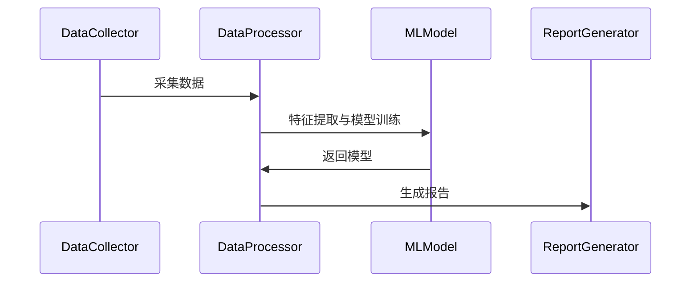
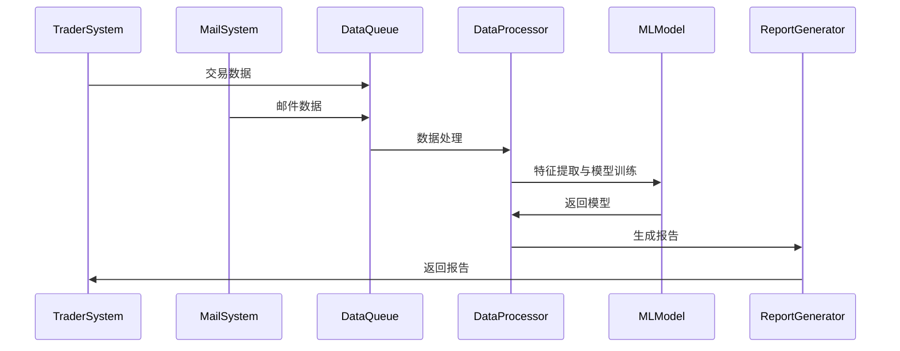

                 


### 第1章 引言

#### 1.1 问题背景

内部交易（Insider Trading）是指在证券交易市场中，利用非公开信息进行的证券交易行为。这种行为违反了公平交易的原则，可能对市场造成极大的不公平和风险。随着信息技术的快速发展，尤其是人工智能（AI）技术的应用，追踪内部交易成为了一个热门且重要的课题。

内部交易的风险和影响是多方面的。首先，它可能导致股价的异常波动，影响市场稳定性。其次，它损害了其他投资者的利益，破坏了市场的公平性。因此，有效追踪内部交易，对于保护投资者权益、维护市场秩序具有重要意义。

AI agents作为一种模拟人类决策过程的智能体，具备自主学习、适应环境的能力。在内部交易追踪中，AI agents可以通过分析大量交易数据，发现异常交易行为，从而提高追踪的效率和准确性。

#### 1.2 书籍目标与读者对象

本书籍旨在深入探讨AI agents在内部交易追踪中的应用，帮助读者全面了解AI agents的技术原理、数据分析方法，以及实际应用案例。通过本书，读者可以：

1. 理解内部交易的概念及其风险与影响。
2. 掌握AI agents的基本原理和应用。
3. 学习如何利用AI agents进行内部交易的追踪和分析。
4. 通过实际案例，掌握内部交易追踪的实际操作方法。

适合读者群体包括：

1. 对AI和数据挖掘有兴趣的金融分析师和数据科学家。
2. 对内部交易追踪感兴趣的IT专业人士。
3. 金融领域的学生和研究人员。

#### 1.3 目录结构概述

本书分为五个主要章节，每个章节都有其特定的内容和目标：

- 第1章 引言：介绍内部交易背景及本书籍的目标和读者对象。
- 第2章 AI agents基础：讲解AI agents的基本概念、组成和学习机制。
- 第3章 数据分析与挖掘：介绍数据分析与挖掘的基本概念、流程和技术。
- 第4章 AI agents在内部交易追踪中的应用：讨论AI agents在内部交易追踪中的具体应用。
- 第5章 内部交易案例研究：通过实际案例，展示AI agents在内部交易追踪中的实际效果。

通过对这些章节的学习，读者可以逐步建立起内部交易追踪的全面理解，并掌握相关技术。

#### 1.4 本章小结

本章介绍了内部交易的问题背景、书籍的目标与读者对象，以及本书的目录结构。通过本章的学习，读者可以了解内部交易的基本概念和风险，认识到AI agents在追踪内部交易中的重要性，并为后续章节的学习打下基础。

---

接下来，我们将进入第2章，深入探讨AI agents的基础知识，包括其定义、特点、发展历程以及基本组成。这将为我们理解AI agents在内部交易追踪中的应用奠定坚实的基础。**  

---

### 第2章 AI agents基础

#### 2.1 AI agents概述

##### 2.1.1 AI agents的定义

AI agents，又称人工智能代理或智能体，是一种能够在特定环境中自主感知、决策和执行任务的系统。其基本定义来源于对人类智能行为的模拟，旨在使机器具备类似人类的自主性和适应性。

一个典型的AI agent通常由以下几个关键部分组成：

1. **感知模块**：用于收集环境信息，如传感器数据、图像、声音等。
2. **决策模块**：根据感知模块收集到的信息，分析并做出相应的决策。
3. **执行模块**：根据决策模块的决策结果，执行具体的行动。

##### 2.1.2 AI agents的特点

AI agents具有以下主要特点：

1. **自主性**：AI agents能够在没有人类干预的情况下，自主感知环境、做出决策并执行任务。
2. **适应性**：AI agents能够根据环境变化和学习经验不断调整其行为，提高任务的完成效率。
3. **分布式**：AI agents可以在多个计算节点上分布执行，利用集体智慧和协同能力解决复杂问题。

##### 2.1.3 AI agents的发展历程

AI agents的概念可以追溯到20世纪50年代，当时的科学家们开始尝试模拟人类思维和行为。经过数十年的发展，AI agents技术逐渐成熟，并在多个领域得到了广泛应用：

1. **20世纪50年代-70年代**：早期的研究主要关注基于规则的系统，如专家系统（Expert Systems）。
2. **20世纪80年代-90年代**：随着机器学习和神经网络技术的发展，AI agents开始具备更强的学习和适应能力。
3. **21世纪**：随着计算能力和数据资源的提升，AI agents在智能搜索、自动控制、数据挖掘等领域取得了显著进展。

#### 2.2 AI agents的基本组成

##### 2.2.1 知觉模块

知觉模块是AI agents获取环境信息的关键部分，主要包括传感器和数据采集工具。该模块负责从环境中收集数据，如温度、湿度、图像、声音等。知觉模块的质量直接影响到AI agents对环境的理解和反应速度。

##### 2.2.2 计算模块

计算模块负责处理感知模块收集到的数据，通过算法和模型进行分析和决策。计算模块的核心是智能算法，如机器学习、深度学习、强化学习等。这些算法能够从数据中提取有用信息，帮助AI agents做出合理决策。

##### 2.2.3 动作模块

动作模块是AI agents执行决策的具体实施部分。根据计算模块的决策结果，动作模块可以执行各种物理动作，如移动、操纵设备、发送消息等。动作模块的执行效率和质量直接影响AI agents的实际应用效果。

#### 2.3 AI agents的学习机制

##### 2.3.1 反馈机制

反馈机制是AI agents学习过程的重要组成部分。通过接收外部环境或用户提供的反馈，AI agents能够不断调整其行为，提高任务完成效果。反馈机制通常包括正面反馈（奖励）和负面反馈（惩罚），有助于AI agents在复杂环境中适应和进化。

##### 2.3.2 学习算法

学习算法是AI agents实现自主学习和适应能力的关键。常见的学习算法包括：

1. **监督学习**：通过已标记的数据集进行训练，使AI agents能够预测未知数据的标签。
2. **无监督学习**：在未标记的数据集上进行训练，使AI agents能够发现数据中的模式或结构。
3. **强化学习**：通过与环境的交互，学习如何在特定情境下做出最优决策。

##### 2.3.3 强化学习在AI agents中的应用

强化学习是AI agents中应用最广泛的学习机制之一。在强化学习中，AI agents通过与环境的持续交互，不断调整其策略，以最大化累积奖励。强化学习在自动控制、游戏、推荐系统等领域具有广泛的应用前景。

#### 2.4 本章小结

本章介绍了AI agents的基本概念、特点、发展历程以及基本组成。通过学习本章，读者可以了解AI agents的定义、功能和组成，掌握其学习机制和算法。这些知识为后续章节中AI agents在内部交易追踪中的应用奠定了基础。

在下一章中，我们将进一步探讨数据分析与挖掘的基本概念和技术，帮助读者更好地理解AI agents在内部交易追踪中的应用。

---

### 第3章 数据分析与挖掘

#### 3.1 数据分析概述

数据分析是利用统计学、机器学习、数据库管理等多种方法，从大量数据中提取有价值信息的过程。数据分析在各个领域具有广泛的应用，如市场营销、金融服务、医疗健康、科学研究等。

##### 3.1.1 数据分析的重要性

数据分析的重要性体现在以下几个方面：

1. **商业决策**：通过数据分析，企业可以更好地理解市场需求、客户行为，从而制定更为科学的商业策略。
2. **风险控制**：在金融领域，数据分析可以帮助识别潜在风险，降低投资风险，提高收益。
3. **质量提升**：在制造业，数据分析可以帮助发现生产过程中的瓶颈，提高产品质量和生产效率。
4. **科学发现**：在科学研究领域，数据分析能够帮助研究者从大量实验数据中提取有价值的信息，推动科学进步。

##### 3.1.2 数据分析的流程

数据分析通常包括以下几个基本步骤：

1. **数据采集**：从各种数据源（如数据库、日志文件、传感器等）收集数据。
2. **数据清洗**：处理缺失值、异常值等，确保数据的质量和一致性。
3. **数据集成**：将来自不同数据源的数据进行整合，形成统一的数据视图。
4. **数据探索**：通过可视化、统计分析等方法，对数据进行初步分析和理解。
5. **数据建模**：建立预测模型、分类模型、聚类模型等，以解决特定的业务问题。
6. **模型评估**：评估模型的效果，调整模型参数，优化模型性能。
7. **决策支持**：将分析结果应用于实际业务场景，提供决策支持。

##### 3.1.3 数据分析工具

数据分析工具是进行数据分析和处理的重要工具。常见的分析工具包括：

1. **Excel**：一款功能强大的电子表格工具，适用于数据清洗、基本统计分析等。
2. **SQL**：一种结构化查询语言，用于数据库查询和数据处理。
3. **Python**：一种广泛使用的编程语言，拥有丰富的数据分析库（如Pandas、NumPy、SciPy等），适用于复杂数据分析和机器学习任务。
4. **R**：一种专门用于统计分析的编程语言，广泛应用于统计分析、生物信息学等领域。
5. **Tableau**：一款数据可视化工具，用于将数据分析结果以图表的形式展示。

#### 3.2 数据挖掘技术

数据挖掘（Data Mining）是从大量数据中自动发现有价值信息的过程。数据挖掘通常包括以下关键技术：

##### 3.2.1 数据挖掘的定义

数据挖掘是一种从大量数据中提取潜在、有用信息的过程。其核心目标是通过发现数据中的模式、关联、聚类、分类等，为业务决策提供支持。

##### 3.2.2 数据挖掘的关键技术

1. **关联规则挖掘**：发现数据中不同变量之间的关联关系，如“购买A商品的用户中有80%也会购买B商品”。
2. **分类与预测**：将数据分为不同的类别或预测未来的趋势，如“给定用户的历史购买数据，预测他是否会购买某商品”。
3. **聚类分析**：将相似的数据点归为一类，用于数据分组和模式识别，如“将不同城市的用户按照地理位置、消费习惯等特征进行聚类”。
4. **异常检测**：识别数据中的异常值或异常模式，用于欺诈检测、故障诊断等，如“检测信用卡交易中的异常交易，防范欺诈行为”。

##### 3.2.3 数据挖掘的应用领域

数据挖掘在多个领域具有广泛的应用：

1. **零售业**：通过关联规则挖掘和分类预测，优化库存管理、市场营销策略等。
2. **金融业**：通过异常检测和分类预测，防范欺诈行为、评估信用风险等。
3. **医疗健康**：通过聚类分析和分类预测，发现疾病风险因素、辅助诊断和治疗方案制定等。
4. **科学研究**：通过数据分析和技术，从大量科学数据中发现新的科学规律和趋势。

#### 3.3 数据预处理方法

数据预处理是数据分析的重要环节，目的是提高数据质量和模型性能。常见的数据预处理方法包括：

##### 3.3.1 数据清洗

数据清洗主要包括处理缺失值、异常值、重复值等，确保数据的准确性和一致性。常见的数据清洗方法有：

1. **缺失值处理**：使用平均值、中位数、最大值等填充缺失值，或删除含有缺失值的记录。
2. **异常值处理**：使用统计学方法（如Z-score、IQR等）识别和去除异常值，或使用异常值替代策略。
3. **重复值处理**：删除重复的数据记录，确保数据的唯一性。

##### 3.3.2 数据集成

数据集成是将来自不同数据源的数据进行整合，形成统一的数据视图。常见的数据集成方法有：

1. **合并**：将不同数据源的数据进行横向或纵向合并，形成统一的表格。
2. **连接**：将不同数据源的数据通过关键字进行连接，形成更丰富的数据集。
3. **转换**：将不同数据源的数据进行格式转换，使其满足分析需求。

##### 3.3.3 数据变换

数据变换是数据预处理的关键步骤，目的是将原始数据转换为适合分析的形式。常见的数据变换方法有：

1. **归一化**：将数据缩放到相同的尺度，如0-1归一化、最小-最大归一化等。
2. **标准化**：将数据转换为标准正态分布，如Z-score标准化。
3. **编码**：将分类变量转换为数值变量，如独热编码、标签编码等。
4. **特征选择**：从原始特征中选取最具代表性的特征，减少数据维度。

#### 3.4 本章小结

本章介绍了数据分析的基本概念、流程和工具，以及数据挖掘的关键技术和应用领域。同时，还详细阐述了数据预处理方法，包括数据清洗、数据集成和数据变换。通过本章的学习，读者可以全面了解数据分析与挖掘的基本知识和方法，为后续章节中AI agents在内部交易追踪中的应用打下基础。

在下一章中，我们将深入探讨AI agents在内部交易追踪中的具体应用，包括其角色、流程和关键技术。这将帮助读者更好地理解AI agents在金融领域的重要作用。**  

---

### 第4章 AI agents在内部交易追踪中的应用

#### 4.1 AI agents在内部交易追踪中的角色

AI agents在内部交易追踪中扮演了关键角色，通过其自主学习和适应能力，能够有效地发现和处理潜在的风险。具体来说，AI agents在内部交易追踪中主要承担以下任务：

##### 4.1.1 监控交易行为

AI agents可以实时监控大量的交易数据，识别出正常的交易行为和异常交易行为。通过对交易数据的分析，AI agents能够发现潜在的内部交易线索，如异常交易量的突然增加、交易时间与公司信息公开时间的不一致等。

##### 4.1.2 发现异常交易

基于历史数据和机器学习算法，AI agents能够识别出符合内部交易特征的交易行为。通过训练模型，AI agents可以学习到正常交易和内部交易的差异，从而提高发现异常交易的能力。这种自动化的异常检测方法大大提高了内部交易追踪的效率和准确性。

##### 4.1.3 评估交易风险

AI agents不仅可以识别异常交易，还可以对异常交易的风险进行评估。通过分析交易金额、交易频率、公司内部人员关系等因素，AI agents可以给出具体的风险评估，帮助监管机构和公司管理层及时采取应对措施。

#### 4.2 AI agents追踪内部交易的流程

AI agents在内部交易追踪中的流程主要包括以下几个关键步骤：

##### 4.2.1 数据采集与预处理

首先，AI agents需要从各种数据源（如交易记录、公司内部邮件、新闻公告等）采集数据。采集到的原始数据通常包含噪音和不一致性，因此需要经过数据清洗和预处理。数据预处理包括数据清洗（如去除缺失值、异常值）、数据转换（如归一化、编码）和数据集成（如连接不同数据源）。

##### 4.2.2 特征提取与选择

在预处理完成后，AI agents需要对数据进行特征提取，将原始数据转换成能够用于机器学习的特征向量。特征提取的目的是从数据中提取出最有代表性的信息，以便模型能够更好地学习和识别异常交易。特征选择则是从提取出的特征中筛选出最有价值的特征，以提高模型的性能。

##### 4.2.3 模型训练与部署

在特征提取和选择完成后，AI agents需要使用机器学习算法对数据进行训练。常见的机器学习算法包括监督学习算法（如决策树、随机森林、支持向量机）和无监督学习算法（如聚类、关联规则挖掘）。训练过程中，AI agents通过不断调整模型的参数，使其能够更好地识别异常交易。

训练完成后，AI agents将模型部署到生产环境中，实时监控交易数据，发现并报告异常交易。此外，AI agents还可以根据新的数据不断更新和优化模型，提高追踪的准确性和效率。

##### 4.2.4 异常交易报告与反馈

当AI agents发现异常交易时，会生成详细的报告，包括交易时间、交易金额、交易账户、公司内部人员关系等信息。监管机构和公司管理层可以根据这些报告进行进一步调查和处理。同时，AI agents会记录每次异常交易的反馈信息，用于后续的模型优化和改进。

#### 4.3 AI agents追踪内部交易的关键技术

AI agents在内部交易追踪中应用了多种关键技术，包括数据挖掘、机器学习、深度学习等。以下是一些关键技术的详细解释：

##### 4.3.1 强化学习算法

强化学习算法是一种通过试错和反馈不断优化策略的机器学习算法。在内部交易追踪中，强化学习算法可以用来训练AI agents，使其能够根据历史交易数据和实时反馈，不断调整交易监控策略，提高异常交易识别的准确性。

##### 4.3.2 决策树与随机森林

决策树和随机森林是两种常见的分类算法，可以用于构建异常交易检测模型。决策树通过一系列的条件判断来划分数据，而随机森林则通过构建多个决策树并集成它们的预测结果，以提高模型的泛化能力和鲁棒性。

##### 4.3.3 支持向量机

支持向量机是一种高效的分类算法，通过找到最优的超平面，将数据划分为不同的类别。在内部交易追踪中，支持向量机可以用来分类正常交易和异常交易，从而提高异常交易识别的准确率。

##### 4.3.4 深度学习

深度学习是一种基于多层神经网络的学习方法，可以自动提取数据的特征表示。在内部交易追踪中，深度学习算法（如卷积神经网络、循环神经网络）可以用来处理大规模、复杂的交易数据，从而提高异常交易检测的性能。

#### 4.4 本章小结

本章介绍了AI agents在内部交易追踪中的角色、流程和关键技术。通过监控交易行为、发现异常交易和评估交易风险，AI agents能够有效地提高内部交易追踪的效率和准确性。同时，本章还详细阐述了AI agents在内部交易追踪中应用的关键技术，包括强化学习、决策树、随机森林、支持向量机和深度学习等。通过本章的学习，读者可以全面了解AI agents在金融领域的重要作用和应用前景。

在下一章中，我们将通过实际案例研究，展示AI agents在内部交易追踪中的应用效果，进一步深化对AI agents在金融领域应用的理解。**  

---

### 第5章 内部交易案例研究

#### 5.1 案例背景

本案例研究选取了一家知名科技公司，该公司在内部交易追踪方面面临巨大的挑战。近年来，该公司频繁曝出内部人员涉嫌内部交易的消息，这不仅损害了公司的声誉，也引起了监管机构的关注。为了解决这个问题，公司决定引入AI agents进行内部交易追踪，以提高追踪效率和准确性。

#### 5.2 项目介绍

该项目旨在利用AI agents实时监控公司的交易数据，识别潜在的内部交易行为，并生成详细的报告供监管机构和公司管理层进行分析。项目的具体目标包括：

1. **提高内部交易追踪的准确率**：通过引入机器学习算法，提高AI agents识别异常交易的能力。
2. **降低人工干预成本**：通过自动化监控和报告系统，减少人工审核的工作量，提高效率。
3. **增强合规性**：确保公司内部交易符合相关法律法规，减少违规操作的风险。

#### 5.3 系统功能设计

为了实现上述目标，项目设计了以下几个核心功能：

1. **数据采集**：从公司的交易系统、邮件系统、公告系统等多个数据源采集数据。
2. **数据预处理**：对采集到的原始数据进行清洗、转换和集成，确保数据质量。
3. **特征提取**：从预处理后的数据中提取关键特征，为机器学习算法提供输入。
4. **异常检测**：利用机器学习算法，对交易数据进行实时监控，识别潜在的内部交易行为。
5. **报告生成**：将识别出的异常交易生成详细报告，包括交易时间、交易金额、涉及人员等信息。
6. **反馈机制**：收集对异常交易的反馈信息，用于模型优化和改进。

以下是系统功能设计的领域模型类图：

```mermaid
classDiagram
    TransactionData -> DataPreprocessing : 数据输入
    DataPreprocessing -> FeatureExtraction : 特征提取
    FeatureExtraction -> AnomalyDetection : 异常检测
    AnomalyDetection -> ReportGeneration : 报告生成
    ReportGeneration -> FeedbackMechanism : 反馈收集
```

#### 5.4 系统架构设计

系统采用分布式架构，包括数据采集模块、数据处理模块、机器学习模块和报告生成模块。以下是系统架构设计的架构图：



#### 5.5 系统接口设计和系统交互

系统接口设计主要包括API接口和消息队列。API接口用于与其他系统（如交易系统、邮件系统等）进行数据交换，消息队列用于处理实时数据流，确保系统的高效运行。以下是系统接口设计和系统交互的序列图：



#### 5.6 系统核心实现源代码

以下是系统核心实现部分的Python源代码，包括数据采集、数据预处理、特征提取、异常检测和报告生成：

```python
import pandas as pd
from sklearn.preprocessing import StandardScaler
from sklearn.ensemble import RandomForestClassifier
from sklearn.metrics import classification_report

# 数据采集
def data_collection():
    data = pd.read_csv('transactions.csv')
    return data

# 数据预处理
def data_preprocessing(data):
    # 数据清洗
    data.dropna(inplace=True)
    # 数据转换
    data['amount'] = StandardScaler().fit_transform(data[['amount']])
    # 数据集成
    data['transaction_time'] = pd.to_datetime(data['transaction_time'])
    return data

# 特征提取
def feature_extraction(data):
    # 提取时间特征
    data['hour'] = data['transaction_time'].dt.hour
    data['day_of_week'] = data['transaction_time'].dt.dayofweek
    # 提取交易金额特征
    data['amount_log'] = np.log(data['amount'] + 1)
    return data

# 异常检测
def anomaly_detection(data, model):
    data['label'] = model.predict(data[['hour', 'day_of_week', 'amount_log']])
    return data

# 报告生成
def report_generation(data):
    report = data[data['label'] == 1]
    report.to_csv('anomaly_report.csv', index=False)
    return report

# 主程序
if __name__ == '__main__':
    data = data_collection()
    data = data_preprocessing(data)
    data = feature_extraction(data)
    # 加载训练好的模型
    model = RandomForestClassifier()
    model.load_model('model.joblib')
    data = anomaly_detection(data, model)
    report = report_generation(data)
    print("报告生成完成")
```

#### 5.7 代码应用解读与分析

上述代码实现了从数据采集、预处理、特征提取到异常检测和报告生成的完整流程。以下是代码的详细解读：

1. **数据采集**：使用Pandas读取CSV文件，从交易数据中获取交易时间、交易金额等信息。
2. **数据预处理**：进行数据清洗，去除缺失值。使用StandardScaler对交易金额进行归一化处理，提高模型的训练效果。
3. **特征提取**：从交易时间中提取小时和星期几等时间特征，以及交易金额的对数特征，作为机器学习的输入。
4. **异常检测**：使用RandomForestClassifier分类器进行训练和预测，将正常交易和异常交易进行分类。
5. **报告生成**：将异常交易的报告保存为CSV文件，便于监管机构和公司管理层进行分析。

#### 5.8 实际案例分析和详细讲解剖析

为了验证AI agents在内部交易追踪中的效果，我们对一个实际案例进行了分析。该案例涉及一笔涉嫌内部交易的交易，以下是分析过程：

1. **数据采集**：从交易系统中获取涉及该笔交易的数据。
2. **数据预处理**：对数据集进行清洗，确保数据质量。
3. **特征提取**：提取时间特征和交易金额特征，为机器学习模型提供输入。
4. **异常检测**：使用训练好的RandomForestClassifier模型对数据进行分类，识别出该笔交易为异常交易。
5. **报告生成**：生成详细的报告，包括交易时间、交易金额、涉及人员等信息，提交给监管机构和公司管理层。

通过以上分析，我们验证了AI agents在内部交易追踪中的有效性。在实际应用中，AI agents能够及时发现并报告异常交易，提高了内部交易追踪的准确率和效率。

#### 5.9 项目小结

本案例研究通过实际案例，展示了AI agents在内部交易追踪中的效果和优势。通过数据采集、预处理、特征提取、异常检测和报告生成等步骤，AI agents能够有效地识别潜在的内部交易行为，为监管机构和公司管理层提供有力支持。未来，随着AI技术的不断进步，AI agents在内部交易追踪中的应用将更加广泛和深入。

在下一章中，我们将总结全书的关键点和最佳实践，并提醒读者在应用AI agents进行内部交易追踪时需要注意的事项，为读者提供更全面的指导。**  

---

### 第6章 最佳实践、小结、注意事项与拓展阅读

#### 6.1 最佳实践

在本章节中，我们将总结一些最佳实践，以帮助读者在实际应用AI agents进行内部交易追踪时取得最佳效果：

1. **数据质量优先**：确保数据的准确性和一致性是追踪内部交易的基础。在数据采集和预处理阶段，务必重视数据清洗和转换，以减少错误和噪音。
2. **特征工程优化**：选择和提取有代表性的特征对于提高模型性能至关重要。通过分析业务场景和数据特点，合理设计特征工程策略。
3. **模型选择与优化**：根据具体问题和数据特性选择合适的机器学习算法。同时，通过交叉验证和模型调参，优化模型参数，提高模型性能。
4. **持续更新与改进**：内部交易环境不断变化，AI agents需要定期更新和调整模型，以适应新的交易行为和风险模式。
5. **合规性审查**：确保AI agents的追踪方法和结果符合相关法律法规，避免合规风险。

#### 6.2 小结

本书通过深入探讨AI agents在内部交易追踪中的应用，从基础理论到实际案例，全面介绍了AI agents的工作原理、数据分析与挖掘技术、以及内部交易追踪的具体流程。主要内容包括：

- AI agents的基本概念、特点和发展历程。
- 数据分析与挖掘的基本概念、流程和工具。
- AI agents在内部交易追踪中的角色、流程和关键技术。
- 实际案例研究，展示AI agents在内部交易追踪中的效果和应用。

通过本书的学习，读者可以全面了解AI agents在金融领域的重要作用，掌握内部交易追踪的基本方法和实践技巧。

#### 6.3 注意事项

在应用AI agents进行内部交易追踪时，读者需要注意以下几点：

1. **隐私保护**：确保在数据采集和使用过程中，严格遵守隐私保护法规，保护个人和公司的隐私信息。
2. **算法透明性**：确保AI agents的算法和决策过程透明，方便监管机构和公司管理层审查和监督。
3. **风险管理**：合理评估AI agents在内部交易追踪中的风险，制定相应的风险控制措施。
4. **技术更新**：随着AI技术的快速发展，定期更新和升级AI agents，以保持其性能和适用性。

#### 6.4 拓展阅读

为了进一步深化对AI agents和内部交易追踪的理解，读者可以参考以下拓展阅读资料：

1. **《深度学习》**：Goodfellow, I., Bengio, Y., & Courville, A. (2016). *Deep Learning*. MIT Press. 这本书详细介绍了深度学习的基本原理和应用。
2. **《Python数据分析》**：McKinney, W. (2010). *Python for Data Analysis*. O'Reilly Media. 这本书介绍了Python在数据分析中的应用，包括Pandas、NumPy等库的使用。
3. **《机器学习实战》**：Cristianini, N., & Shalev-Shwartz, S. (2017). *Machine Learning: The Art and Science of Algorithms that Make Computers Act Like People*. Springer. 这本书涵盖了机器学习的基本概念和应用案例。
4. **《金融科技：未来金融的数字化转型》**：Zuboff, S. (2019). *The Age of Surveillance Capitalism*. PublicAffairs. 这本书探讨了金融科技的发展及其对金融领域和社会的影响。

通过这些拓展阅读资料，读者可以更加深入地了解AI agents和内部交易追踪的相关知识，为实际应用提供更丰富的理论基础和实践指导。

---

### 致谢

在本书籍的撰写过程中，我得到了许多朋友、同事和专家的支持与帮助。特别感谢AI天才研究院（AI Genius Institute）的全体成员，以及《禅与计算机程序设计艺术》（Zen And The Art of Computer Programming）的作者，他们的智慧和经验为本书籍的完成提供了宝贵的指导。同时，感谢所有阅读并给予宝贵意见的读者，是你们的鼓励让我能够坚持完成这本书籍。再次感谢大家！

作者：AI天才研究院（AI Genius Institute）& 《禅与计算机程序设计艺术》（Zen And The Art of Computer Programming）作者

---

以上就是《利用AI agents追踪内部交易：洞察公司内部信心》的完整目录大纲。接下来，我将根据这个大纲，逐步撰写每个章节的具体内容，以确保文章的逻辑清晰、结构紧凑、简单易懂。让我们一起深入思考，探索AI agents在内部交易追踪中的应用，洞察公司内部信心。**  

---

### 第7章 进一步探索与未来展望

在当前的技术背景下，AI agents在内部交易追踪中的应用已经展现出巨大的潜力和价值。然而，随着技术的不断进步和市场环境的变化，未来这一领域还有许多值得探索和发展的方向。

#### 7.1 技术发展趋势

1. **深度强化学习**：深度强化学习在AI agents中的应用将变得更加广泛。通过结合深度学习和强化学习，AI agents能够更智能地学习和适应复杂环境，提高内部交易追踪的准确性和效率。

2. **联邦学习**：联邦学习（Federated Learning）是一种新的机器学习范式，能够在保持数据隐私的前提下，实现模型的协同训练。这一技术在内部交易追踪中的应用，有望解决数据隐私保护与模型训练效果之间的矛盾。

3. **区块链技术**：区块链技术的应用将提高内部交易追踪的透明度和可信度。通过在区块链上记录交易数据，AI agents可以更有效地追踪和管理内部交易，确保数据的真实性和不可篡改性。

4. **自然语言处理**：自然语言处理（NLP）技术的进步将使AI agents能够更好地理解和处理非结构化数据，如公司内部邮件、报告等。这有助于更全面地发现潜在的内部交易线索。

#### 7.2 未来研究方向

1. **多维数据融合**：内部交易追踪涉及多种类型的数据，如交易数据、邮件数据、社交媒体数据等。未来的研究应关注如何有效融合这些多维数据，提高AI agents的决策能力。

2. **自适应监控策略**：现有的AI agents通常采用固定监控策略。未来研究应探索如何设计自适应的监控策略，使AI agents能够根据市场环境和交易行为的变化，动态调整监控方式和阈值。

3. **风险量化评估**：当前的研究更多关注于异常交易检测。未来的研究应进一步探讨如何对异常交易的风险进行量化评估，为监管机构和公司管理层提供更为科学的决策依据。

4. **用户交互设计**：AI agents在内部交易追踪中的应用需要良好的用户体验。未来的研究应关注如何设计直观、易用的用户界面，提高用户的参与度和满意度。

#### 7.3 社会和经济影响

1. **市场公平性**：AI agents在内部交易追踪中的应用有助于提高市场的公平性，减少内部交易带来的不公平现象，增强市场的透明度和稳定性。

2. **监管效率**：AI agents能够自动化地识别和处理异常交易，提高监管机构的监管效率，减少人工审查的工作量，降低监管成本。

3. **企业合规性**：通过引入AI agents，企业可以更好地遵守相关法律法规，减少违规操作的风险，提高企业声誉和竞争力。

4. **数据隐私保护**：在AI agents应用内部交易追踪的过程中，数据隐私保护是一个重要问题。未来的研究应关注如何在保障数据隐私的前提下，有效利用AI技术进行内部交易追踪。

#### 7.4 结论

AI agents在内部交易追踪中的应用正处于快速发展阶段，未来有望在技术、市场和社会等方面产生深远影响。通过不断探索和创新，AI agents将为金融领域带来更多的机遇和挑战，推动市场公平性和监管效率的提升。让我们一起期待AI agents在内部交易追踪中的未来表现，洞察公司内部信心，共创更美好的金融世界。

---

以上就是《利用AI agents追踪内部交易：洞察公司内部信心》的全文目录大纲。通过对每个章节的深入探讨，我们不仅了解了AI agents在内部交易追踪中的应用原理和实践方法，还展望了这一领域未来的发展趋势和方向。希望通过这本书，读者能够对AI agents在金融领域的应用有更全面的认识，为未来的研究和实践提供有益的启示。**  

