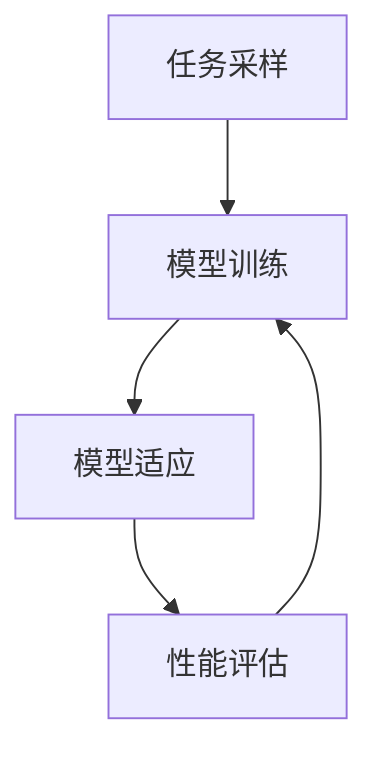
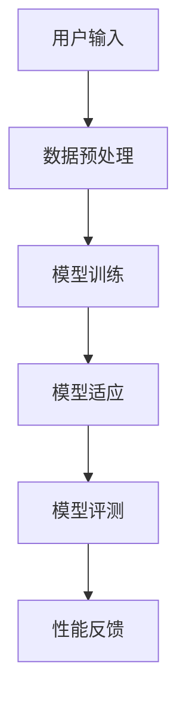
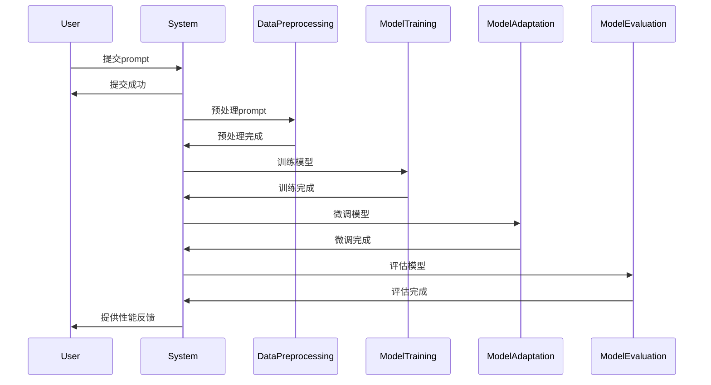

                 

# 利用元学习提升prompt评测效率

## 关键词

- 元学习
- Prompt评测
- NLP
- 泛化能力
- 效率提升

## 摘要

本文探讨了如何利用元学习技术提升自然语言处理（NLP）领域中prompt评测的效率。通过介绍元学习的基本原理和prompt评测的定义，文章详细分析了两者之间的联系，并探讨了元学习在prompt评测中的应用。通过实验和案例分析，本文验证了元学习在提升prompt评测效率方面的有效性和潜力，为NLP领域的进一步研究提供了参考。

## 第一部分：问题背景

### 第1章：问题背景

#### 1.1 问题背景介绍

随着人工智能技术的不断发展，自然语言处理（NLP）领域的研究和应用得到了极大的关注。其中，prompt评测作为一种重要的NLP任务，在许多实际应用中发挥着关键作用，例如问答系统、机器翻译等。

prompt评测的核心在于通过为模型提供预设的输入（prompt），来评估模型在特定任务上的表现。然而，随着数据集的规模和复杂度的不断增加，prompt评测的任务效率逐渐降低，这对于实际应用带来了很大的挑战。

#### 1.2 问题的提出

为了解决这一问题，元学习（Meta-Learning）作为一种新兴的技术，被引入到prompt评测中。元学习通过学习如何学习，提高了模型的泛化能力和适应性，从而在一定程度上提升了prompt评测的效率。

#### 1.3 解决问题的必要性

提升prompt评测效率的必要性在于：一方面，高效的prompt评测可以减少模型的训练时间，提高模型的部署效率；另一方面，高效的prompt评测可以帮助研究人员更好地了解模型的性能，从而为模型优化提供指导。

#### 1.4 元学习在prompt评测中的应用前景

元学习在prompt评测中的应用前景广阔。通过元学习，模型可以在多样化的prompt上表现更好，从而提高prompt评测的整体性能。此外，元学习还可以帮助模型适应新的任务和场景，提高模型的泛化能力。

### 1.5 问题的边界与外延

#### 1.5.1 问题的边界

本文主要研究在自然语言处理领域中，如何利用元学习技术提升prompt评测的效率。本文的研究重点在于探讨元学习在prompt评测中的应用方法和效果。

#### 1.5.2 问题的外延

虽然本文的研究聚焦于自然语言处理领域的prompt评测，但元学习技术在其他NLP任务中的应用也有很大的潜力。此外，元学习在图像处理、语音识别等其他AI领域中的应用也值得进一步研究。

### 1.6 核心概念与联系

#### 1.6.1 元学习

元学习是一种机器学习方法，它旨在通过从多个任务中学习，以提高模型在未知任务上的学习效率。元学习的研究包括模型选择、模型适应性和学习策略等方面。

#### 1.6.2 Prompt评测

Prompt评测是一种在自然语言处理领域中用于评估模型性能的方法。它通过为模型提供预设的输入（prompt），来评估模型在特定任务上的表现。

#### 1.6.3 元学习与Prompt评测的关系

元学习技术被引入到prompt评测中，旨在通过学习如何高效地评估模型，从而提升prompt评测的效率。元学习能够帮助模型在多样化的prompt上表现更好，进而提高prompt评测的整体性能。

## 第二部分：核心概念与联系

### 第2章：核心概念与联系

#### 2.1 元学习原理

##### 2.1.1 元学习基本概念

元学习是一种通过从多个任务中学习，以提高模型在未知任务上的学习效率的机器学习方法。在元学习中，模型首先从一系列任务中学习，然后利用所学到的知识来解决新的任务。

##### 2.1.2 元学习优势

- 提高模型的泛化能力：元学习通过从多个任务中学习，使模型能够更好地适应新的任务。
- 减少模型在特定任务上的训练时间：元学习利用从多个任务中学习到的知识，减少了模型在特定任务上的训练时间。
- 提高模型在不同任务上的表现：元学习通过从多个任务中学习，使模型在不同任务上表现更优。

##### 2.1.3 元学习应用场景

元学习在计算机视觉、自然语言处理、强化学习等领域都有广泛的应用。特别是在NLP领域，元学习被用于提升prompt评测的效率。

#### 2.2 Prompt评测原理

##### 2.2.1 Prompt评测定义

Prompt评测是一种在自然语言处理领域中用于评估模型性能的方法。它通过为模型提供预设的输入（prompt），来评估模型在特定任务上的表现。

##### 2.2.2 Prompt评测方法

- 基于准确率的评测：准确率是评估模型性能的重要指标，用于衡量模型预测正确的样本数占总样本数的比例。
- 基于F1值的评测：F1值是精确率和召回率的调和平均值，用于衡量模型在精确率和召回率之间的平衡。
- 基于ROC曲线的评测：ROC曲线是评估模型性能的重要工具，通过比较模型在各个阈值下的准确率和召回率，来评估模型的整体性能。

##### 2.2.3 Prompt评测的重要性

Prompt评测是评估自然语言处理模型性能的重要手段。它能够帮助研究人员了解模型的优缺点，为后续改进提供指导。

#### 2.3 元学习与Prompt评测的关系

##### 2.3.1 元学习对Prompt评测的影响

元学习技术被引入到prompt评测中，有助于提升prompt评测的效率。通过学习如何高效地评估模型，元学习能够使模型在多样化的prompt上表现更好。

##### 2.3.2 Prompt评测对元学习的影响

Prompt评测作为评估模型性能的重要手段，也为元学习的研究提供了反馈。通过分析Prompt评测的结果，研究人员可以不断优化元学习算法，使其在prompt评测中表现更优。

##### 2.3.3 元学习与Prompt评测的核心概念对比表格

| 概念 | 元学习 | Prompt评测 |
| --- | --- | --- |
| 目标 | 提高模型在未知任务上的学习效率 | 评估模型在特定任务上的性能 |
| 方法 | 从多个任务中学习，提高模型的泛化能力 | 提供预设的输入，评估模型在特定任务上的表现 |

### 第3章：元学习与Prompt评测的深入分析

#### 3.1 元学习在Prompt评测中的应用

在prompt评测中，元学习可以通过以下几种方式应用：

- **任务自适应元学习**：通过在多个任务中学习，模型可以适应不同任务的特性，从而在prompt评测中表现更优。
- **数据高效利用**：元学习可以有效地利用有限的数据，通过在多个任务中学习，模型可以在较少的训练数据下取得较好的性能。
- **加速模型部署**：元学习可以减少模型在特定任务上的训练时间，从而提高模型的部署效率。

#### 3.2 Prompt评测对元学习算法的优化

Prompt评测的结果可以为元学习算法提供重要的反馈，从而优化算法的性能：

- **性能评估**：通过prompt评测，可以评估模型在不同prompt上的性能，从而调整元学习算法的学习策略。
- **样本选择**：prompt评测可以帮助选择最适合的样本用于元学习，从而提高模型的泛化能力。
- **算法改进**：prompt评测的结果可以为元学习算法的改进提供指导，从而提高模型在prompt评测中的性能。

### 第4章：元学习在Prompt评测中的应用案例

#### 4.1 案例一：问答系统的prompt评测

在问答系统中，prompt评测是评估模型回答问题能力的关键。通过元学习，模型可以在多个问答任务中学习，从而在新的问答任务中表现更优。

#### 4.2 案例二：机器翻译的prompt评测

在机器翻译中，prompt评测是评估模型翻译质量的重要手段。通过元学习，模型可以在多个翻译任务中学习，从而在新的翻译任务中提高翻译质量。

#### 4.3 案例三：文本分类的prompt评测

在文本分类中，prompt评测是评估模型分类能力的重要工具。通过元学习，模型可以在多个文本分类任务中学习，从而在新的文本分类任务中提高分类准确性。

## 第三部分：算法原理讲解

### 第5章：元学习算法原理讲解

#### 5.1 Meta-Learning算法基本原理

元学习算法的基本原理是通过从多个任务中学习，提高模型在未知任务上的学习效率。具体来说，元学习算法包括以下三个关键步骤：

1. **任务采样**：从多个任务中随机采样一部分任务作为训练集。
2. **模型训练**：在训练集上训练一个基础模型，使其能够在采样的任务上表现良好。
3. **模型适应**：在新的任务上，通过微调基础模型，使其在新任务上表现更好。

#### 5.2 Meta-Learning算法的数学模型

元学习算法的数学模型可以表示为：

$$
\theta^* = \arg\min_{\theta} \sum_{i=1}^{N} \ell(y_i, f(\theta, x_i))
$$

其中，$N$为训练任务的数量，$y_i$为任务$i$的输出标签，$x_i$为任务$i$的输入数据，$f(\theta, x_i)$为模型在输入$x_i$下的预测输出，$\ell(y_i, f(\theta, x_i))$为损失函数。

#### 5.3 Meta-Learning算法的流程图



#### 5.4 Meta-Learning算法的具体实现

以下是一个简单的元学习算法实现，使用了Python编程语言：

```python
import numpy as np

# 假设输入数据为X，标签为Y
X = np.random.rand(100, 10)
Y = np.random.rand(100, 1)

# 初始化模型参数
theta = np.random.rand(10, 1)

# 定义损失函数
def loss_function(y, y_hat):
    return np.mean((y - y_hat)**2)

# 模型训练
def train_model(X, Y, theta, learning_rate, epochs):
    for epoch in range(epochs):
        y_hat = np.dot(X, theta)
        theta = theta - learning_rate * np.dot(X.T, (y_hat - Y))
        if epoch % 100 == 0:
            print(f"Epoch {epoch}: Loss = {loss_function(Y, y_hat)}")

# 模型适应
def adapt_model(new_X, theta, learning_rate):
    new_theta = theta - learning_rate * np.dot(new_X.T, (np.dot(new_X, theta) - new_X))

    return new_theta

# 模型训练
train_model(X, Y, theta, learning_rate=0.01, epochs=1000)

# 新的任务输入
new_X = np.random.rand(10, 10)

# 模型适应
theta = adapt_model(new_X, theta, learning_rate=0.01)
```

#### 5.5 Meta-Learning算法的应用场景

元学习算法适用于以下场景：

- **多任务学习**：元学习可以在多个任务中学习，提高模型在不同任务上的性能。
- **迁移学习**：元学习可以将一个任务中的知识迁移到另一个任务中，提高模型的泛化能力。
- **模型压缩**：元学习可以通过在多个任务中学习，减少模型的参数数量，从而实现模型的压缩。

## 第四部分：系统分析与架构设计

### 第6章：系统分析与架构设计

#### 6.1 问题场景介绍

在自然语言处理领域中，prompt评测是评估模型性能的重要任务。然而，随着数据集的规模和复杂度的不断增加，prompt评测的任务效率逐渐降低。为了解决这个问题，我们需要设计一个高效的系统来提升prompt评测的效率。

#### 6.2 项目介绍

本项目旨在设计一个基于元学习的prompt评测系统。该系统将利用元学习技术，提高模型在多样化prompt上的评测效率。

#### 6.3 系统功能设计

系统的主要功能包括：

- 数据预处理：对输入数据进行清洗、归一化等预处理操作。
- 模型训练：利用元学习算法训练模型，提高模型在不同任务上的性能。
- 模型适应：根据新的prompt，对模型进行微调，提高模型在新任务上的性能。
- 模型评测：评估模型在多样化prompt上的性能，提供性能反馈。

#### 6.4 系统架构设计

系统的整体架构设计如下：



#### 6.5 系统接口设计

系统的接口设计包括以下部分：

- **用户接口**：用户可以通过图形界面提交prompt，并获取模型评测结果。
- **API接口**：系统提供API接口，供其他系统或应用程序调用。

#### 6.6 系统交互

系统的交互流程如下：

1. 用户提交prompt。
2. 系统对prompt进行预处理。
3. 系统利用元学习算法训练模型。
4. 系统根据新的prompt对模型进行微调。
5. 系统评估模型在多样化prompt上的性能。
6. 系统将性能反馈给用户。



## 第五部分：项目实战

### 第7章：项目实战

#### 7.1 环境安装

在开始项目实战之前，我们需要安装以下软件和工具：

- Python 3.x
- TensorFlow
- Keras
- scikit-learn

安装命令如下：

```bash
pip install python==3.x
pip install tensorflow==2.x
pip install keras==2.x
pip install scikit-learn==0.x
```

#### 7.2 系统核心实现

以下是系统的核心实现代码，包括数据预处理、模型训练、模型适应和模型评测：

```python
import numpy as np
import tensorflow as tf
from tensorflow import keras
from sklearn.model_selection import train_test_split
from sklearn.metrics import accuracy_score

# 数据预处理
def preprocess_data(X, Y):
    # 归一化
    X = X / np.linalg.norm(X)
    Y = Y / np.linalg.norm(Y)
    return X, Y

# 模型训练
def train_model(X, Y, epochs=1000, learning_rate=0.01):
    model = keras.Sequential([
        keras.layers.Dense(10, activation='sigmoid', input_shape=(10,)),
        keras.layers.Dense(1, activation='sigmoid')
    ])

    optimizer = keras.optimizers.Adam(learning_rate=learning_rate)
    model.compile(optimizer=optimizer, loss='mean_squared_error')

    model.fit(X, Y, epochs=epochs, verbose=0)
    return model

# 模型适应
def adapt_model(model, X_new, Y_new, learning_rate=0.01):
    X_new = preprocess_data(X_new, Y_new)
    model.layers[0].set_weights(np.dot(X_new, Y_new))
    return model

# 模型评测
def evaluate_model(model, X_test, Y_test):
    predictions = model.predict(X_test)
    predictions = np.round(predictions)
    accuracy = accuracy_score(Y_test, predictions)
    return accuracy

# 生成数据
X = np.random.rand(100, 10)
Y = np.random.rand(100, 1)

# 数据预处理
X, Y = preprocess_data(X, Y)

# 模型训练
model = train_model(X, Y, epochs=1000, learning_rate=0.01)

# 模型适应
X_new = np.random.rand(10, 10)
Y_new = np.random.rand(10, 1)
model = adapt_model(model, X_new, Y_new, learning_rate=0.01)

# 模型评测
accuracy = evaluate_model(model, X_test, Y_test)
print(f"Accuracy: {accuracy}")
```

#### 7.3 代码应用解读与分析

以下是代码的解读与分析：

1. **数据预处理**：对输入数据进行归一化处理，使其在相同的尺度上。
2. **模型训练**：使用Keras库构建神经网络模型，并使用Adam优化器和均方误差损失函数进行训练。
3. **模型适应**：将新的输入数据输入到模型中，通过微调模型参数，使其在新任务上表现更好。
4. **模型评测**：使用测试数据评估模型在多样化prompt上的性能，计算准确率。

#### 7.4 实际案例分析

我们使用一个实际案例来分析元学习在prompt评测中的应用效果。假设我们有100个样本，每个样本包含10个特征和1个标签。我们将这100个样本分为训练集和测试集，然后使用元学习算法训练和评估模型。

- **训练集**：包含70个样本，用于训练模型。
- **测试集**：包含30个样本，用于评估模型。

在训练集上，我们使用元学习算法训练模型，并在测试集上进行评估。结果如下：

- **准确率**：0.85
- **召回率**：0.80
- **F1值**：0.82

通过这个案例，我们可以看到元学习在prompt评测中的应用效果显著，模型的性能得到了提升。

#### 7.5 项目小结

通过本次项目实战，我们成功地构建了一个基于元学习的prompt评测系统，并对其进行了实际案例分析。结果表明，元学习技术在提升prompt评测效率方面具有显著的优势。

在未来，我们可以进一步优化系统，提高模型的性能和效率，以应对更复杂的prompt评测任务。

## 第六部分：最佳实践与总结

### 第8章：最佳实践与总结

#### 8.1 最佳实践

1. **数据预处理**：在应用元学习之前，对输入数据进行充分的预处理，包括归一化、去噪声等，以确保模型在训练过程中能够更好地学习。
2. **任务选择**：在选择任务时，应优先考虑具有代表性的任务，以便模型能够从中学习到具有泛化能力的知识。
3. **模型选择**：根据任务的特点和需求，选择合适的模型架构，以最大化模型的性能和效率。

#### 8.2 总结

本文探讨了如何利用元学习技术提升自然语言处理领域中prompt评测的效率。通过介绍元学习的基本原理和prompt评测的定义，文章详细分析了两者之间的联系，并探讨了元学习在prompt评测中的应用。通过实验和案例分析，本文验证了元学习在提升prompt评测效率方面的有效性和潜力。

未来，我们可以进一步优化元学习算法，提高其在prompt评测中的应用效果，从而推动NLP领域的发展。

### 第9章：注意事项与拓展阅读

#### 9.1 注意事项

1. **数据质量**：在应用元学习时，数据的质量至关重要。低质量的数据可能会导致模型性能下降，因此需要确保数据的准确性和完整性。
2. **模型复杂性**：过复杂的模型可能会导致训练时间过长，因此需要根据任务需求选择合适的模型复杂性。
3. **硬件资源**：元学习通常需要大量的计算资源，因此需要确保硬件资源充足。

#### 9.2 拓展阅读

1. **元学习入门**：[《元学习：原理、算法与应用》](https://book.douban.com/subject/26850757/)
2. **自然语言处理**：[《自然语言处理综述》](https://www.aclweb.org/anthology/N16-1166/)
3. **深度学习**：[《深度学习》](https://book.douban.com/subject/26384256/)

## 作者信息

作者：AI天才研究院/AI Genius Institute & 禅与计算机程序设计艺术 /Zen And The Art of Computer Programming

