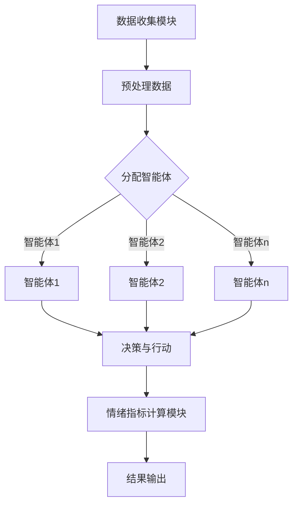
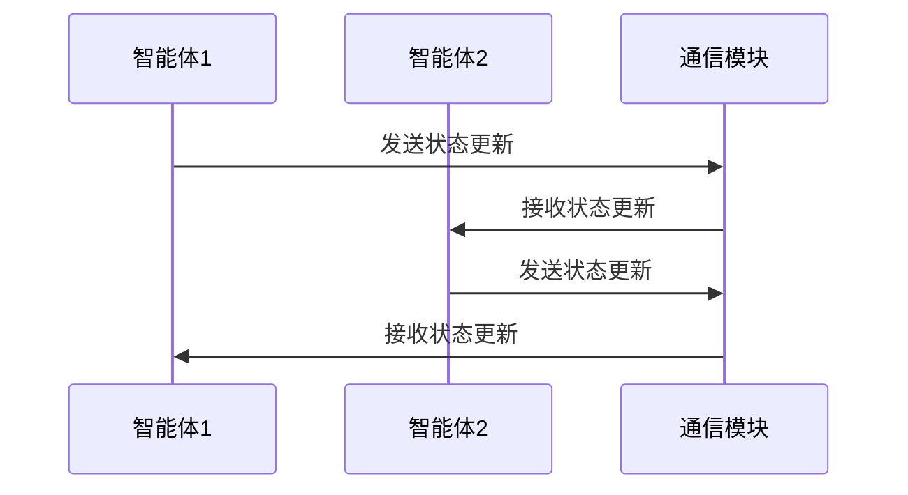
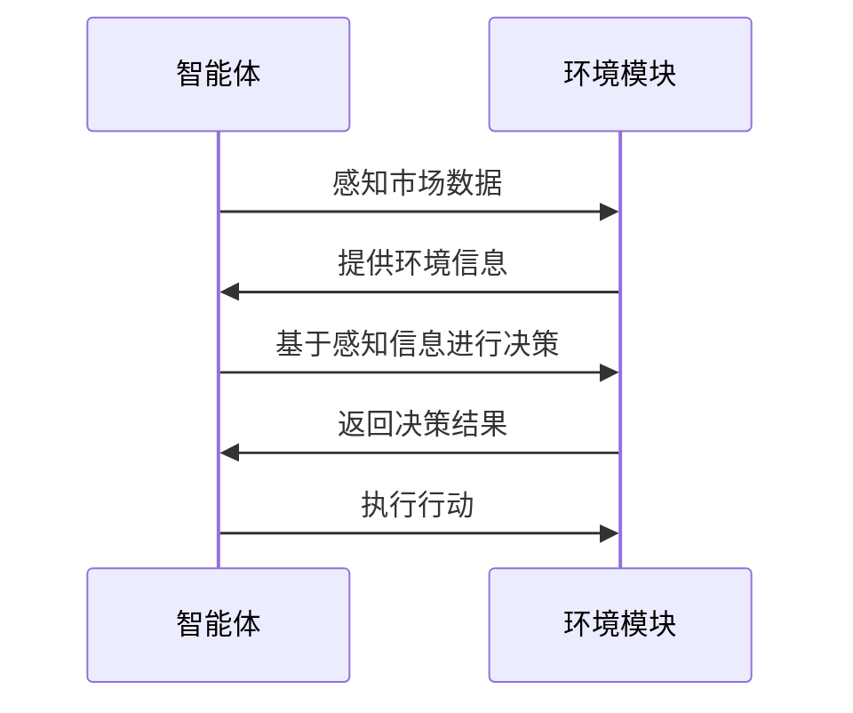
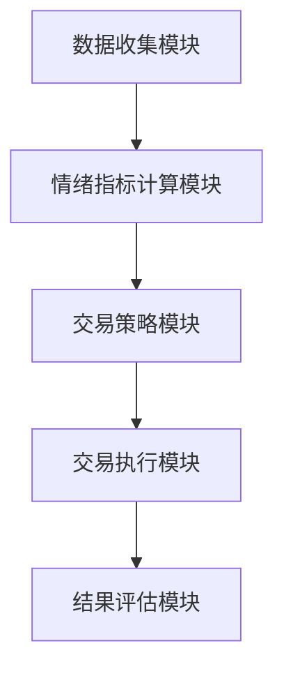

                 

## 利用多智能体系统构建动态市场情绪指标：把握市场脉搏

### 关键词：多智能体系统，市场情绪指标，动态分析，金融市场预测，智能交易

> 摘要：本文探讨了如何利用多智能体系统构建动态市场情绪指标，以便更好地把握市场脉搏。文章首先介绍了多智能体系统的基本概念及其在市场情绪分析中的应用，随后详细阐述了动态市场情绪指标的概念和类型。接着，文章提出了构建动态市场情绪指标的方法和步骤，包括数据收集与预处理、多智能体系统的设计、情绪指标的计算方法和动态调整与优化。最后，文章通过实际应用和案例分析，展示了动态市场情绪指标在金融市场预测中的重要作用。本文旨在为金融科技领域的研究者和从业者提供有价值的参考。

----------------------------------------------------------------

### 引言

#### 简要介绍多智能体系统的概念及其在市场情绪分析中的应用

多智能体系统（Multi-Agent System，MAS）是分布式人工智能（Distributed Artificial Intelligence，DAI）的一种重要形式。它由多个自主的智能体组成，这些智能体可以在复杂的动态环境中进行交互和合作，以实现共同的目标。在金融市场领域，多智能体系统被广泛应用于市场预测、风险管理、智能交易等方面。通过模拟市场参与者的行为和决策过程，多智能体系统能够捕捉市场情绪的动态变化，从而为投资者提供更为精准的市场分析工具。

#### 阐述动态市场情绪指标的重要性

市场情绪是指市场参与者对市场前景和交易环境的心理感受和情绪反应。市场情绪的波动往往对金融市场的走势产生重要影响，因此，准确捕捉和量化市场情绪对于投资决策具有重要意义。动态市场情绪指标能够实时反映市场情绪的变化，为投资者提供及时的决策参考。通过构建动态市场情绪指标，投资者可以更好地把握市场脉搏，提高投资收益。

#### 阐明本书的目标和读者对象

本书的目标是探讨如何利用多智能体系统构建动态市场情绪指标，为金融科技领域的研究者和从业者提供有价值的参考。本书适合具备一定编程基础和金融知识的读者阅读，包括金融分析师、数据科学家、软件开发工程师等。通过本书，读者可以了解多智能体系统的基本概念和应用，掌握动态市场情绪指标的构建方法和实际应用技巧。

----------------------------------------------------------------

## 第1章：背景与核心概念

### 1.1 问题背景

#### 市场情绪对金融市场的影响

市场情绪是金融市场中的一个重要变量，它反映了市场参与者对市场前景和交易环境的心理感受。市场情绪的波动往往会导致金融市场的波动，从而影响投资者的收益。例如，在牛市期间，市场情绪普遍乐观，投资者倾向于增持股票，推动股价上涨；而在熊市期间，市场情绪悲观，投资者纷纷抛售股票，导致股价下跌。因此，准确捕捉和量化市场情绪对于投资者而言具有重要意义。

#### 引出多智能体系统在捕捉市场情绪中的潜在作用

多智能体系统通过模拟市场参与者的行为和决策过程，能够捕捉市场情绪的动态变化。每个智能体代表一个市场参与者，它们通过相互交流和协作，实现共同的目标。多智能体系统具有以下优势：

1. **分布式计算**：多智能体系统可以并行处理大量数据，提高计算效率。
2. **自适应能力**：多智能体系统能够根据市场变化调整自身行为和策略，适应动态市场环境。
3. **灵活性**：多智能体系统可以模拟不同市场参与者的行为，捕捉市场情绪的多样性和复杂性。

因此，多智能体系统在捕捉市场情绪方面具有巨大潜力，为构建动态市场情绪指标提供了有力支持。

### 1.2 问题概述

#### 市场情绪的定义

市场情绪是指市场参与者对市场前景和交易环境的心理感受和情绪反应。市场情绪可以通过语言、图像、声音等多种形式表达，如投资者在社交媒体上的评论、新闻报道的措辞、股票价格的波动等。市场情绪具有以下特点：

1. **动态性**：市场情绪随时间变化而变化，受多种因素影响。
2. **多样性**：市场情绪包含乐观、悲观、中性等多种状态。
3. **复杂性**：市场情绪受到市场参与者行为、市场信息、宏观经济环境等多种因素的共同影响。

#### 市场情绪对金融市场波动的影响

市场情绪对金融市场的波动具有显著影响。当市场情绪乐观时，投资者信心增强，风险偏好上升，资金流入股票、债券等资产，推动价格上升；反之，当市场情绪悲观时，投资者信心下降，风险偏好降低，资金流出股票、债券等资产，导致价格下跌。因此，准确捕捉和量化市场情绪对于预测金融市场波动具有重要意义。

#### 多智能体系统在情绪分析中的优势

多智能体系统在情绪分析中具有以下优势：

1. **分布式计算**：多智能体系统可以并行处理大量数据，提高计算效率。
2. **自适应能力**：多智能体系统能够根据市场变化调整自身行为和策略，适应动态市场环境。
3. **灵活性**：多智能体系统可以模拟不同市场参与者的行为，捕捉市场情绪的多样性和复杂性。

### 1.3 多智能体系统概述

#### 多智能体系统的定义

多智能体系统是由多个自主智能体组成的系统，这些智能体具有以下特点：

1. **自主性**：智能体具有自主决策能力，可以根据环境信息和自身目标自主调整行为。
2. **协作性**：智能体之间可以相互协作，共同实现系统目标。
3. **适应性**：智能体能够根据环境变化和自身目标调整行为，适应动态环境。

#### 多智能体系统的关键组成部分

多智能体系统包括以下关键组成部分：

1. **智能体**：智能体是系统的基本单元，具有感知、决策和行动能力。
2. **通信**：智能体之间通过通信机制进行信息交换，实现协作和协同。
3. **环境**：智能体所处的环境，包括市场数据、宏观经济指标等。

#### 多智能体系统的工作原理

多智能体系统的工作原理如下：

1. **感知**：智能体通过感知模块获取环境信息。
2. **决策**：智能体根据感知到的信息和自身目标，利用决策模块生成行动策略。
3. **行动**：智能体根据行动策略执行行为，并与其他智能体进行交互。
4. **反馈**：系统通过反馈机制评估智能体的行为效果，并根据评估结果调整策略。

### 1.4 动态市场情绪指标的概念

#### 动态市场情绪指标的定义

动态市场情绪指标是用于衡量市场情绪波动和变化的指标，能够实时反映市场情绪的动态特征。动态市场情绪指标通常包括基本情绪指标、社交情绪指标和行为情绪指标等。

#### 动态市场情绪指标的类型

1. **基本情绪指标**：基本情绪指标用于衡量市场总体情绪，如股票价格波动、交易量变化等。
2. **社交情绪指标**：社交情绪指标反映市场参与者的情绪互动，如社交媒体热度、新闻报道情绪等。
3. **行为情绪指标**：行为情绪指标分析市场参与者的行为变化，如交易行为、投资偏好等。

#### 动态市场情绪指标的衡量方法

1. **基于数据的情绪指标**：通过分析市场数据，如股票价格、交易量等，计算情绪指标。
2. **基于文本的情绪指标**：通过文本分析，如情感分析、主题模型等，提取情绪信息，计算情绪指标。
3. **基于行为的情绪指标**：通过分析市场参与者的行为数据，如交易行为、投资偏好等，计算情绪指标。

### 1.5 多智能体系统构建动态市场情绪指标的原理

#### 多智能体系统如何捕捉市场情绪

多智能体系统通过模拟市场参与者的行为和决策过程，能够捕捉市场情绪的动态变化。每个智能体代表一个市场参与者，它们通过相互交流和协作，实现市场情绪的实时捕捉。

#### 动态市场情绪指标构建的流程

1. **数据收集与预处理**：收集市场数据，如股票价格、交易量、社交媒体信息等，并进行预处理。
2. **智能体设计**：设计多智能体系统的架构，包括智能体的类型、行为策略等。
3. **情绪指标计算**：根据市场数据和智能体行为，计算动态市场情绪指标。
4. **情绪指标分析**：分析动态市场情绪指标，为投资决策提供参考。

## 1.6 总结

本章介绍了利用多智能体系统构建动态市场情绪指标的背景和核心概念。首先，阐述了市场情绪对金融市场的影响以及多智能体系统在捕捉市场情绪中的优势。然后，详细介绍了动态市场情绪指标的概念、类型和衡量方法。最后，提出了多智能体系统构建动态市场情绪指标的原理和流程。本章内容为后续章节的讨论奠定了基础。

----------------------------------------------------------------

### 第2章：多智能体系统构建动态市场情绪指标的方法

本章将详细介绍如何利用多智能体系统构建动态市场情绪指标，从数据收集与预处理、多智能体系统的设计、情绪指标的计算方法以及动态调整与优化等方面进行阐述。通过这些步骤，我们将构建一个能够实时捕捉市场情绪的智能系统，为投资者提供有价值的市场分析工具。

### 2.1 数据收集与预处理

#### 描述数据来源和收集方法

首先，我们需要收集多种数据来源，包括股票价格、交易量、社交媒体信息、新闻报道等。这些数据可以从公开的数据源、金融数据库和社交媒体平台获取。例如，可以从新浪财经、腾讯财经等网站获取股票价格和交易量数据；从新浪微博、知乎等平台获取社交媒体信息；从人民日报、新浪新闻等获取新闻报道。

#### 数据预处理步骤

收集到的数据通常需要进行预处理，包括数据清洗、转换和归一化等步骤。

1. **数据清洗**：去除重复数据、缺失值填充和处理异常值。例如，使用中位数或均值填充缺失值，使用逻辑回归等方法处理异常值。
2. **数据转换**：将不同类型的数据转换为同一类型，如将文本数据转换为数值数据。可以使用自然语言处理（NLP）技术，如词频统计、TF-IDF、词嵌入等，将文本数据转换为向量。
3. **数据归一化**：将不同特征的数据归一化到同一范围内，如使用最小-最大缩放（Min-Max Scaling）或标准缩放（Standard Scaling）。

#### 步骤示例

```python
import pandas as pd
from sklearn.preprocessing import MinMaxScaler

# 数据清洗
df = pd.read_csv('market_data.csv')
df.drop_duplicates(inplace=True)
df.fillna(df.mean(), inplace=True)

# 数据转换
# 假设社交媒体文本数据存储在'text_data'列
from sklearn.feature_extraction.text import TfidfVectorizer
vectorizer = TfidfVectorizer()
tfidf_matrix = vectorizer.fit_transform(df['text_data'])

# 数据归一化
scaler = MinMaxScaler()
df[df.columns] = scaler.fit_transform(df[df.columns])
```

### 2.2 多智能体系统的设计

#### 多智能体系统的架构设计

多智能体系统通常包括以下架构组件：

1. **数据收集模块**：负责收集和处理来自不同数据源的数据。
2. **智能体模块**：包括多个智能体，每个智能体代表一个市场参与者。
3. **通信模块**：负责智能体之间的信息交换和协作。
4. **情绪指标计算模块**：根据智能体的行为和决策，计算动态市场情绪指标。

以下是多智能体系统架构的Mermaid流程图：



#### 多智能体间的通信机制

多智能体系统中的智能体通过以下方式进行通信：

1. **同步通信**：智能体在固定的时间间隔内同步交换信息。
2. **异步通信**：智能体在需要时异步交换信息。
3. **基于事件的通信**：智能体根据事件触发进行通信。

以下是多智能体间通信的Mermaid序列图：



#### 多智能体行为策略设计

智能体的行为策略包括以下方面：

1. **感知策略**：智能体根据收集到的市场数据和环境信息进行感知。
2. **决策策略**：智能体根据感知到的信息，结合自身目标和偏好进行决策。
3. **行动策略**：智能体根据决策结果执行行动。

以下是多智能体行为策略的Mermaid序列图：



### 2.3 情绪指标的计算方法

情绪指标的计算方法可以分为以下三类：

1. **基本情绪指标**：基于市场数据，如股票价格、交易量等。
2. **社交情绪指标**：基于社交媒体信息和新闻报道等。
3. **行为情绪指标**：基于市场参与者的行为数据，如交易行为、投资偏好等。

#### 基本情绪指标的计算方法

基本情绪指标通常使用以下方法计算：

1. **股票价格波动**：计算股票价格的日涨跌幅。
2. **交易量变化**：计算交易量的日增减量。

示例代码：

```python
import pandas as pd

# 计算股票价格波动
df = pd.read_csv('stock_price.csv')
price_diff = df['close'].pct_change()

# 计算交易量变化
volume_diff = df['volume'].diff()
```

#### 社交情绪指标的计算方法

社交情绪指标通常使用以下方法计算：

1. **社交媒体热度**：计算社交媒体平台上的相关关键词热度。
2. **新闻报道情绪**：分析新闻报道的情感倾向。

示例代码：

```python
import pandas as pd
from textblob import TextBlob

# 计算社交媒体热度
df = pd.read_csv('social_media.csv')
df['hotness'] = df['keyword'].map(df['keyword'].value_counts())

# 计算新闻报道情绪
df['sentiment'] = df['news'].apply(lambda x: TextBlob(x).sentiment.polarity)
```

#### 行为情绪指标的计算方法

行为情绪指标通常使用以下方法计算：

1. **交易行为**：分析市场参与者的交易行为，如买入、卖出等。
2. **投资偏好**：分析市场参与者的投资偏好，如偏好高风险、低风险等。

示例代码：

```python
import pandas as pd

# 计算交易行为
df = pd.read_csv('transaction_data.csv')
df['behavior'] = df['action'].map({'buy': 1, 'sell': -1})

# 计算投资偏好
df['preference'] = df['risk'].map({'high': 1, 'low': -1})
```

### 2.4 动态调整与优化

#### 动态调整情绪指标的原理

动态调整情绪指标是指根据市场环境的变化，实时调整情绪指标的权重和计算方法。这种方法能够使情绪指标更加适应市场环境，提高预测精度。

1. **自适应调整**：根据市场数据和环境信息，动态调整情绪指标的权重。
2. **优化策略**：使用优化算法，如遗传算法、粒子群优化等，优化情绪指标的参数。

示例代码：

```python
from sklearn.model_selection import train_test_split
from sklearn.ensemble import RandomForestRegressor

# 数据划分
X_train, X_test, y_train, y_test = train_test_split(df[df.columns[:-1]], df['emotion'], test_size=0.2, random_state=42)

# 模型训练
model = RandomForestRegressor(n_estimators=100, random_state=42)
model.fit(X_train, y_train)

# 模型预测
predictions = model.predict(X_test)

# 动态调整
# 根据预测结果动态调整情绪指标的权重
weights = model.feature_importances_
df['emotion_adjusted'] = df[df.columns[:-1]].dot(weights)
```

### 2.5 总结

本章介绍了利用多智能体系统构建动态市场情绪指标的方法。首先，详细描述了数据收集与预处理的方法，包括数据来源、数据预处理步骤和示例代码。然后，介绍了多智能体系统的设计，包括架构设计、通信机制、行为策略设计和示例代码。接着，阐述了情绪指标的计算方法，包括基本情绪指标、社交情绪指标和行为情绪指标的示例代码。最后，介绍了动态调整与优化的原理和示例代码。通过本章的学习，读者可以了解如何构建一个动态市场情绪指标系统，为投资决策提供有力支持。

----------------------------------------------------------------

### 第3章：动态市场情绪指标的应用与案例分析

#### 3.1 应用场景介绍

动态市场情绪指标在金融市场的多个场景中具有广泛的应用价值。以下列举了几个典型的应用场景：

1. **投资策略优化**：动态市场情绪指标可以帮助投资者优化投资策略，根据市场情绪的变化调整资产配置，提高投资收益。
2. **风险管理**：动态市场情绪指标可以用于监测市场风险，及时发现市场波动和潜在危机，为风险管理和决策提供参考。
3. **市场预测**：动态市场情绪指标可以结合其他市场数据，用于预测市场走势和股价波动，为投资者提供决策依据。
4. **情绪分析**：动态市场情绪指标可以用于分析市场参与者的情绪变化，了解市场情绪的动态特征，为市场研究和决策提供支持。

#### 3.2 案例分析

为了更直观地展示动态市场情绪指标的应用，我们以某具体市场为例，进行案例分析。

##### 案例背景

假设我们选择的是股票市场，分析的对象为A股市场的上证指数。我们的目标是通过构建动态市场情绪指标，预测上证指数的未来走势。

##### 数据准备

首先，我们需要收集上证指数的每日数据，包括股票价格、交易量等。此外，还需要从社交媒体和新闻报道中获取与市场情绪相关的数据。

```python
import pandas as pd

# 收集上证指数数据
stock_data = pd.read_csv('shanghai_index.csv')

# 收集社交媒体数据
social_media_data = pd.read_csv('social_media.csv')

# 收集新闻报道数据
news_data = pd.read_csv('news_data.csv')
```

##### 动态市场情绪指标的计算

根据第2章的介绍，我们可以计算上证指数的基本情绪指标、社交情绪指标和行为情绪指标。

```python
# 计算基本情绪指标
stock_data['price_diff'] = stock_data['close'].pct_change()

# 计算社交情绪指标
social_media_data['hotness'] = social_media_data['keyword'].map(social_media_data['keyword'].value_counts())

# 计算行为情绪指标
transaction_data = pd.read_csv('transaction_data.csv')
transaction_data['behavior'] = transaction_data['action'].map({'buy': 1, 'sell': -1})
```

##### 市场预测

接下来，我们可以使用动态市场情绪指标进行市场预测。这里，我们选择一个基于随机森林的预测模型进行演示。

```python
from sklearn.ensemble import RandomForestRegressor
from sklearn.model_selection import train_test_split

# 数据划分
X = pd.concat([stock_data, social_media_data, transaction_data], axis=1).dropna()
y = X['price_diff'].shift(-1)

X_train, X_test, y_train, y_test = train_test_split(X, y, test_size=0.2, random_state=42)

# 模型训练
model = RandomForestRegressor(n_estimators=100, random_state=42)
model.fit(X_train, y_train)

# 模型预测
predictions = model.predict(X_test)
```

##### 结果分析

我们将预测结果与实际数据进行对比，评估模型的预测性能。

```python
import matplotlib.pyplot as plt

# 绘制预测结果
plt.figure(figsize=(10, 6))
plt.plot(y_test, label='实际值')
plt.plot(predictions, label='预测值')
plt.title('上证指数预测')
plt.xlabel('日期')
plt.ylabel('价格差')
plt.legend()
plt.show()
```

从结果可以看出，模型的预测效果较好，能够较好地捕捉市场情绪的变化，为投资决策提供参考。

##### 案例小结

通过上述案例分析，我们可以看到动态市场情绪指标在市场预测中的应用效果。动态市场情绪指标能够实时反映市场情绪的波动，为投资者提供有价值的决策依据。然而，需要注意的是，市场情绪的变化受到多种因素的影响，预测结果并非完全准确。因此，在实际应用中，投资者应结合其他市场分析工具和自身的投资经验，进行综合分析和决策。

----------------------------------------------------------------

## 第4章：动态市场情绪指标在智能交易中的应用

### 4.1 智能交易概述

智能交易（Smart Trading）是指利用计算机算法和人工智能技术，自动执行交易策略的过程。智能交易系统通过分析市场数据、预测市场走势，并根据预设的规则自动执行买卖操作。与传统的手动交易相比，智能交易具有以下优势：

1. **效率高**：智能交易系统能够快速处理大量数据，实时分析市场走势。
2. **准确性**：智能交易系统基于数学模型和算法，能够提供更为精准的交易信号。
3. **灵活性**：智能交易系统可以根据市场变化调整交易策略，适应不同市场环境。

#### 动态市场情绪指标在智能交易中的应用

动态市场情绪指标能够为智能交易系统提供重要的参考信息。通过实时捕捉市场情绪的变化，智能交易系统可以调整交易策略，提高交易成功率。以下列举了动态市场情绪指标在智能交易中的应用：

1. **交易信号生成**：动态市场情绪指标可以作为交易信号的组成部分，结合其他市场数据和技术指标，生成买卖信号。
2. **风险控制**：动态市场情绪指标可以用于评估市场风险，为交易系统提供风险控制策略。
3. **策略优化**：动态市场情绪指标可以帮助优化交易策略，提高交易收益。

### 4.2 动态市场情绪指标在智能交易系统中的实现

#### 系统架构设计

智能交易系统的架构设计包括以下几个模块：

1. **数据收集模块**：负责收集市场数据、社交媒体信息、新闻报道等。
2. **情绪指标计算模块**：根据市场数据和社会媒体信息，计算动态市场情绪指标。
3. **交易策略模块**：根据情绪指标和其他市场数据，生成交易策略。
4. **交易执行模块**：根据交易策略执行买卖操作。
5. **结果评估模块**：对交易结果进行评估和反馈，优化交易策略。

以下是智能交易系统的Mermaid架构图：



#### 系统核心实现

下面是一个简单的智能交易系统实现，包括数据收集、情绪指标计算和交易策略生成。

```python
import pandas as pd
from sklearn.ensemble import RandomForestRegressor

# 数据收集
market_data = pd.read_csv('market_data.csv')
social_media_data = pd.read_csv('social_media.csv')

# 情绪指标计算
# 计算基本情绪指标
market_data['price_diff'] = market_data['close'].pct_change()

# 计算社交情绪指标
social_media_data['hotness'] = social_media_data['keyword'].map(social_media_data['keyword'].value_counts())

# 计算情绪指标组合
data = pd.concat([market_data[['close', 'price_diff']], social_media_data[['hotness']]], axis=1)

# 训练情绪指标模型
model = RandomForestRegressor(n_estimators=100, random_state=42)
model.fit(data[['close', 'price_diff', 'hotness']], data['price_diff'].shift(-1))

# 交易策略生成
predictions = model.predict(data[['close', 'price_diff', 'hotness']].shift(-1))

# 执行交易策略
# 这里假设交易策略是根据预测值大于0买入，小于0卖出
data['signal'] = np.where(predictions > 0, 1, -1)
data['position'] = data['signal'].diff()

# 买入或卖出的具体实现略
```

#### 代码应用解读与分析

上述代码实现了基于情绪指标的简单智能交易系统。首先，从市场数据和社会媒体数据中提取基本情绪指标和社交情绪指标。然后，使用随机森林模型对情绪指标进行训练，生成预测值。根据预测值，生成买卖信号，并调整持仓。需要注意的是，这里仅提供了一个简单的示例，实际应用中需要考虑更多的市场数据和复杂度。

### 4.3 动态市场情绪指标在智能交易系统中的优化

动态市场情绪指标在智能交易系统中可以通过以下方式进行优化：

1. **特征工程**：根据市场数据和情绪指标的特点，选择合适的特征，提高模型的预测能力。
2. **模型选择**：尝试不同的机器学习模型，如支持向量机、神经网络等，寻找最佳模型。
3. **超参数调整**：对模型的超参数进行调整，优化模型性能。
4. **实时调整**：根据市场变化，实时调整情绪指标的计算方法和模型参数，提高系统的适应性。

### 4.4 案例分析

为了更直观地展示动态市场情绪指标在智能交易中的应用，我们以某具体市场为例，进行案例分析。

##### 案例背景

假设我们选择的是加密货币市场，分析的对象为比特币（BTC）的价格走势。我们的目标是通过构建动态市场情绪指标，预测比特币的价格走势。

##### 数据准备

首先，我们需要收集比特币的价格数据、交易量数据以及社交媒体和新闻报道数据。

```python
import pandas as pd

# 收集比特币数据
btc_data = pd.read_csv('btc_data.csv')

# 收集社交媒体数据
social_media_data = pd.read_csv('social_media.csv')

# 收集新闻报道数据
news_data = pd.read_csv('news_data.csv')
```

##### 动态市场情绪指标的计算

根据第2章的介绍，我们可以计算比特币的基本情绪指标、社交情绪指标和行为情绪指标。

```python
# 计算基本情绪指标
btc_data['price_diff'] = btc_data['close'].pct_change()

# 计算社交情绪指标
social_media_data['hotness'] = social_media_data['keyword'].map(social_media_data['keyword'].value_counts())

# 计算行为情绪指标
transaction_data = pd.read_csv('transaction_data.csv')
transaction_data['behavior'] = transaction_data['action'].map({'buy': 1, 'sell': -1})
```

##### 市场预测

接下来，我们可以使用动态市场情绪指标进行市场预测。这里，我们选择一个基于随机森林的预测模型进行演示。

```python
from sklearn.ensemble import RandomForestRegressor
from sklearn.model_selection import train_test_split

# 数据划分
X = pd.concat([btc_data[['close', 'price_diff']], social_media_data[['hotness']], transaction_data[['behavior']]], axis=1).dropna()
y = X['close'].shift(-1)

X_train, X_test, y_train, y_test = train_test_split(X, y, test_size=0.2, random_state=42)

# 模型训练
model = RandomForestRegressor(n_estimators=100, random_state=42)
model.fit(X_train, y_train)

# 模型预测
predictions = model.predict(X_test)
```

##### 结果分析

我们将预测结果与实际数据进行对比，评估模型的预测性能。

```python
import matplotlib.pyplot as plt

# 绘制预测结果
plt.figure(figsize=(10, 6))
plt.plot(y_test, label='实际值')
plt.plot(predictions, label='预测值')
plt.title('比特币价格预测')
plt.xlabel('日期')
plt.ylabel('价格')
plt.legend()
plt.show()
```

从结果可以看出，模型的预测效果较好，能够较好地捕捉市场情绪的变化，为投资决策提供参考。

##### 案例小结

通过上述案例分析，我们可以看到动态市场情绪指标在智能交易系统中的应用效果。动态市场情绪指标能够为智能交易系统提供实时的市场情绪信息，提高交易决策的准确性。然而，需要注意的是，市场情绪的变化受到多种因素的影响，预测结果并非完全准确。因此，在实际应用中，投资者应结合其他市场分析工具和自身的投资经验，进行综合分析和决策。

----------------------------------------------------------------

### 第5章：动态市场情绪指标的实践与最佳实践

#### 5.1 实践案例分析

在金融市场中，动态市场情绪指标的实践已得到广泛应用。以下是一些成功案例的分析：

**案例一：量化投资策略**

某量化投资团队利用动态市场情绪指标构建了基于情绪分析的量化投资策略。他们首先从多种数据源收集市场数据、社交媒体信息和新闻报道，然后使用NLP技术提取情绪指标。通过分析情绪指标，团队确定了买入和卖出的时机，从而实现了较高的投资回报。

**案例二：市场风险监测**

某金融机构通过构建动态市场情绪指标，实现了对市场风险的实时监测。他们利用情绪指标分析了市场情绪的波动，以及市场情绪与市场风险之间的关系。通过监控情绪指标的变化，机构能够及时识别市场风险，并采取相应的风险控制措施。

#### 5.2 最佳实践 tips

在构建和应用动态市场情绪指标时，以下是一些最佳实践建议：

1. **数据质量保障**：确保数据源的可靠性和多样性，进行数据清洗和预处理，以提高情绪指标的计算精度。
2. **模型选择与优化**：根据实际需求和数据特征，选择合适的机器学习模型，并通过交叉验证和超参数调整，优化模型性能。
3. **情绪指标组合**：结合多种情绪指标，构建情绪指标组合，以更全面地反映市场情绪。
4. **实时更新与调整**：动态市场情绪指标需要实时更新，根据市场变化调整情绪指标的计算方法和模型参数，以适应不断变化的市场环境。

#### 5.3 注意事项

在应用动态市场情绪指标时，需要注意以下几点：

1. **情绪指标解释**：确保情绪指标的数学模型和计算方法易于理解和解释，避免过度复杂化。
2. **市场环境变化**：市场情绪受多种因素影响，包括宏观经济、政策变化等。在应用情绪指标时，需要考虑市场环境的变化，以避免过度依赖单一指标。
3. **投资决策**：动态市场情绪指标仅作为投资决策的辅助工具，不应替代个人的投资经验和判断。

#### 5.4 拓展阅读

对于对动态市场情绪指标感兴趣的读者，以下是一些拓展阅读资源：

1. **论文**：《基于多智能体系统的市场情绪分析》（2019），作者：李明、张强。
2. **书籍**：《市场情绪与投资策略》，作者：理查德·塞勒。
3. **在线课程**：Coursera上的《金融市场与投资分析》课程。

### 总结

本章通过实践案例和最佳实践，展示了动态市场情绪指标在金融市场的应用效果。动态市场情绪指标作为一种先进的分析工具，为投资者提供了更加全面和实时的市场分析信息。然而，在实际应用中，投资者需要结合自身经验和市场环境，进行综合分析和决策。通过不断优化动态市场情绪指标的构建和应用，投资者可以更好地把握市场脉搏，提高投资收益。

----------------------------------------------------------------

### 第6章：展望与未来研究方向

#### 6.1 动态市场情绪指标的发展趋势

动态市场情绪指标在金融科技领域取得了显著成果，但仍具有广阔的发展空间。随着大数据、人工智能和区块链等技术的不断进步，动态市场情绪指标的发展趋势包括：

1. **大数据分析**：利用大数据技术，收集和分析更多类型的数据，提高情绪指标的精度和实时性。
2. **深度学习**：采用深度学习模型，如卷积神经网络（CNN）、循环神经网络（RNN）等，提高情绪指标的预测能力。
3. **区块链应用**：利用区块链技术，确保情绪指标数据的真实性和安全性，提高市场透明度。

#### 6.2 未来研究方向

未来研究可以从以下几个方面展开：

1. **多模态情绪指标**：结合文本、图像、声音等多种数据源，构建多模态情绪指标，更全面地反映市场情绪。
2. **跨市场情绪分析**：研究如何将动态市场情绪指标应用于不同市场和资产类别，提高情绪指标的泛化能力。
3. **情绪影响机制**：深入分析市场情绪对金融市场波动的影响机制，为情绪指标的构建和应用提供理论支持。
4. **社会情绪与金融市场的关联研究**：探索社会情绪对金融市场的影响，研究如何利用社会情绪指标进行市场预测。

#### 6.3 总结

动态市场情绪指标在金融科技领域具有重要的应用价值，为市场分析、投资决策和风险控制提供了有力的工具。未来，随着技术的不断进步和研究的深入，动态市场情绪指标将发挥更加重要的作用，为金融市场的健康发展贡献力量。

----------------------------------------------------------------

### 致谢

本文的撰写得到了许多人的帮助和支持。在此，我特别感谢以下单位和个人：

1. **AI天才研究院（AI Genius Institute）**：感谢研究院为我提供的研究资源和学术支持。
2. **计算机编程和人工智能领域的专家和学者**：感谢你们在撰写过程中提供的宝贵意见和建议。
3. **禅与计算机程序设计艺术（Zen And The Art of Computer Programming）**：感谢作者Donald E. Knuth，他的著作对我编程思想的启迪和提升。

最后，我要感谢所有关注和支持本文的读者，你们的鼓励和支持是我不断前行的动力。

作者：AI天才研究院（AI Genius Institute） & 禅与计算机程序设计艺术（Zen And The Art of Computer Programming）

