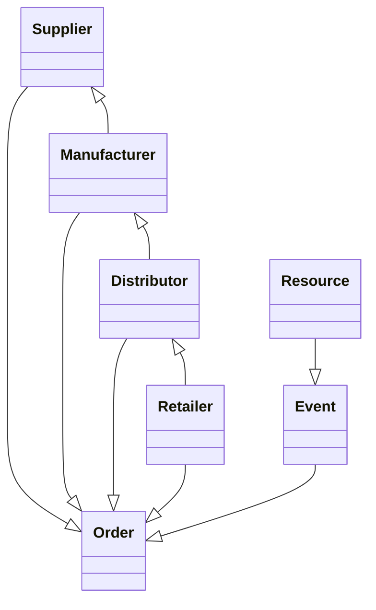
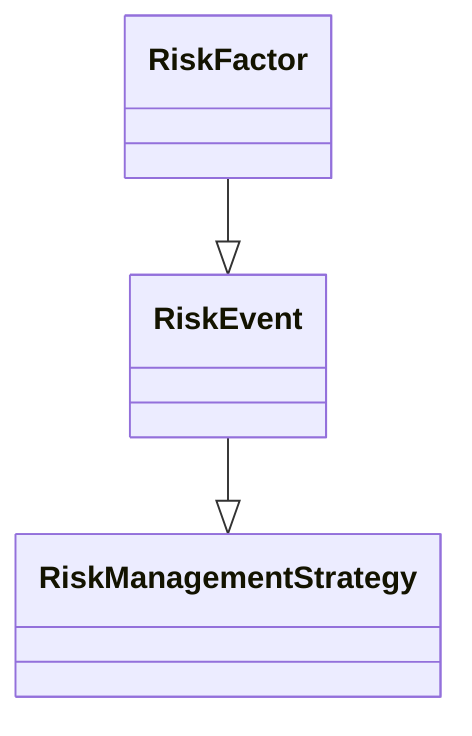

                 

# 利用多智能体系统进行全面的供应链和竞争对手分析

## 关键词

多智能体系统，供应链分析，竞争对手分析，供应链优化，风险管理，算法实现

## 摘要

本文深入探讨了多智能体系统在供应链和竞争对手分析中的应用。首先，介绍了多智能体系统的基本概念和供应链管理的基本概念，并分析了传统供应链分析方法的局限性。接着，详细阐述了多智能体系统在供应链优化和风险分析中的应用，并提供了具体的算法实现和案例分析。最后，本文总结了多智能体系统在供应链和竞争对手分析中的优势和未来发展方向，为相关领域的实践提供了有价值的参考。

---

## 引言与背景

### 1.1 供应链与竞争分析的重要性

在全球化经济的背景下，供应链作为企业运营的核心环节，对于企业的竞争力具有决定性作用。供应链管理不仅涉及到企业的内部运营，还涉及到企业与供应商、客户、合作伙伴之间的互动。有效的供应链管理可以降低成本、提高效率、增强企业的市场竞争力。

同时，竞争分析是企业制定战略的重要依据。通过分析竞争对手的市场行为、产品策略、销售策略等，企业可以更好地定位自己的市场地位，制定有针对性的竞争策略。

然而，传统的供应链分析和竞争分析方法存在诸多局限性。例如，传统供应链分析主要依赖于人工经验和统计分析，难以处理大量复杂的数据；竞争分析往往缺乏系统性和深度，难以全面了解竞争对手的策略和动向。

### 1.2 供应链分析的传统方法与挑战

传统的供应链分析方法主要包括以下几种：

1. **供应链网络设计**：通过优化供应链网络，降低运输成本，提高供应链的灵活性。
2. **库存管理**：通过优化库存策略，减少库存成本，提高库存周转率。
3. **采购策略优化**：通过优化采购策略，降低采购成本，提高采购效率。

然而，这些方法在处理复杂供应链环境时面临以下挑战：

1. **数据复杂性**：供应链涉及到大量复杂的数据，如订单数据、库存数据、运输数据等，传统的数据处理方法难以应对。
2. **实时性**：传统方法往往无法实时响应市场变化，导致决策滞后。
3. **多目标优化**：供应链优化涉及多个目标，如成本、效率、服务质量等，传统方法难以实现多目标优化。

### 1.3 多智能体系统的概念与潜力

多智能体系统（Multi-Agent System，MAS）是由多个自主智能体组成的系统，这些智能体可以相互通信、协作，共同完成复杂任务。多智能体系统的特点包括：

1. **分布式**：智能体可以在不同的计算节点上运行，实现分布式计算。
2. **自主性**：智能体具有自主决策能力，可以根据环境变化自主调整行为。
3. **协同性**：智能体之间可以相互协作，共同完成任务。

多智能体系统在供应链和竞争分析中具有巨大潜力：

1. **数据复杂性处理**：多智能体系统可以通过分布式计算和智能体的自主决策，高效处理复杂供应链数据。
2. **实时响应**：智能体可以实时监测供应链环境，快速响应市场变化。
3. **多目标优化**：多智能体系统可以实现多目标优化，同时考虑供应链的多个目标。

### 1.4 书籍的目的与结构

本书籍旨在深入探讨多智能体系统在供应链和竞争对手分析中的应用，提供全面的理论基础和实践指南。具体结构如下：

1. **引言与背景**：介绍供应链和竞争分析的重要性，以及多智能体系统的概念和潜力。
2. **核心概念与联系**：详细阐述多智能体系统的基本概念、供应链管理的基本概念，以及多智能体系统与供应链管理的联系。
3. **多智能体系统在供应链分析中的应用**：探讨多智能体系统在供应链优化和风险分析中的应用。
4. **竞争分析与多智能体系统**：讨论多智能体系统在竞争分析中的应用。
5. **结论与展望**：总结多智能体系统在供应链和竞争对手分析中的优势，以及未来的发展趋势。

通过本书籍的学习，读者可以全面了解多智能体系统在供应链和竞争对手分析中的应用，掌握相关技术和方法，为实际项目提供有效的解决方案。接下来，我们将进一步探讨核心概念和联系，为后续章节打下坚实的基础。

---

### 2.1 多智能体系统基础

#### 2.1.1 多智能体系统的定义

多智能体系统（MAS）是一种由多个相互协作的智能体组成的系统，每个智能体具有自主性、自治性、社交性和反应性。智能体可以是软件程序、机器人、人类或其他实体，它们可以在分布式环境中相互通信、协作，共同完成复杂任务。

一个典型的多智能体系统包括以下几个基本组成部分：

1. **智能体**：智能体是MAS的基本组成单元，具有以下特征：
   - **自主性**：智能体可以自主决策，不受外部控制。
   - **自治性**：智能体可以独立运行，无需依赖其他智能体。
   - **社交性**：智能体之间可以相互通信、交换信息。
   - **反应性**：智能体可以对外部事件和环境变化做出响应。

2. **环境**：环境是智能体执行任务的外部条件，可以是物理环境或虚拟环境。

3. **交互协议**：交互协议定义了智能体之间如何通信、交换信息和协调行为。

4. **任务**：任务是多智能体系统要实现的目标，可以是复杂的多步骤任务。

#### 2.1.2 多智能体系统的特点

多智能体系统具有以下几个显著特点：

1. **分布式**：智能体可以分布在不同的计算节点上，实现分布式计算。

2. **动态性**：智能体可以动态加入或退出系统，系统可以根据环境变化动态调整。

3. **适应性**：智能体可以根据环境和任务要求自适应地调整行为和策略。

4. **灵活性**：多智能体系统可以适应不同的任务和环境，具有广泛的适用性。

5. **容错性**：多智能体系统可以通过冗余智能体和分布式计算提高系统的容错性。

#### 2.1.3 多智能体系统的应用领域

多智能体系统在多个领域得到了广泛应用，以下是其中一些重要的应用领域：

1. **供应链管理**：多智能体系统可以用于供应链优化、库存管理、采购策略优化等。

2. **智能交通**：多智能体系统可以用于交通流量管理、智能交通信号控制等。

3. **能源管理**：多智能体系统可以用于智能电网、分布式能源管理、节能减排等。

4. **医疗健康**：多智能体系统可以用于疾病预测、医疗诊断、远程医疗等。

5. **金融工程**：多智能体系统可以用于金融风险管理、交易策略优化、投资组合管理等。

6. **智能制造**：多智能体系统可以用于生产调度、设备维护、质量检测等。

#### 2.1.4 多智能体系统的设计原则

设计多智能体系统时，应遵循以下原则：

1. **明确系统目标**：明确系统的任务和目标，确保智能体行为的协调一致性。

2. **合理划分智能体**：根据任务和环境特点，合理划分智能体，确保每个智能体的职责明确。

3. **设计通信机制**：设计有效的通信机制，确保智能体之间的信息交换和协作。

4. **实现自主决策**：智能体应具备自主决策能力，可以根据环境和任务要求自主调整行为。

5. **保障系统安全**：设计安全机制，确保系统的稳定性和安全性。

通过以上设计原则，可以构建高效、稳定、灵活的多智能体系统，实现复杂任务的高效执行。

接下来，我们将探讨供应链管理的基本概念，进一步理解多智能体系统在供应链中的应用。

#### 2.2 供应链管理基本概念

供应链管理（Supply Chain Management，SCM）是指对供应链中各个环节进行计划、组织、协调和控制，以实现供应链整体效益最大化的过程。供应链管理涉及多个关键环节，包括供应商管理、生产计划、库存管理、采购管理、物流配送等。

#### 2.2.1 供应链管理的定义

供应链管理可以定义为：通过协调供应链中的各个环节，实现物料、信息、资金的高效流动，从而满足客户需求、降低成本、提高竞争力的过程。供应链管理不仅涉及企业内部的管理，还包括与供应商、客户、合作伙伴之间的协作。

#### 2.2.2 供应链管理的核心流程

供应链管理包括以下几个核心流程：

1. **供应链规划**：确定供应链的目标、策略和资源分配，确保供应链的整体效益。

2. **供应链设计**：设计供应链的网络结构、设施布局、物流流程等，以满足供应链规划的要求。

3. **供应链执行**：实施供应链计划，包括采购、生产、库存管理、物流配送等。

4. **供应链优化**：通过对供应链的运行数据进行分析和评估，不断优化供应链的流程和绩效。

5. **供应链绩效评估**：对供应链的运行绩效进行评估，确保供应链目标的实现。

#### 2.2.3 供应链管理中的挑战

供应链管理面临以下挑战：

1. **复杂性**：供应链涉及多个环节、多个参与者，导致供应链管理复杂度增加。

2. **不确定性**：供应链中的各种因素（如市场需求、供应商交货时间、物流延误等）具有不确定性，给供应链管理带来困难。

3. **信息不对称**：供应链中的各个环节往往存在信息不对称，导致协调难度增加。

4. **成本控制**：在保证服务质量的前提下，降低供应链成本是供应链管理的重要目标。

5. **供应链风险**：供应链中断、物流延误、供应商不可靠等风险可能导致供应链绩效下降。

为了应对这些挑战，供应链管理需要采用先进的方法和技术，如多智能体系统、大数据分析、云计算等。

#### 2.2.4 供应链管理的核心概念与要素

供应链管理涉及多个核心概念和要素，包括以下方面：

1. **供应链网络**：供应链网络是供应链中各个环节和参与者的集合，包括供应商、制造商、分销商、零售商等。

2. **供应链节点**：供应链节点是供应链网络中的基本单位，包括工厂、仓库、配送中心等。

3. **供应链流程**：供应链流程是供应链中各个环节的工作流程，包括采购、生产、库存管理、物流配送等。

4. **供应链信息流**：供应链信息流是指供应链中各个环节之间的信息交换和共享。

5. **供应链物流**：供应链物流是指供应链中的货物运输和仓储管理。

6. **供应链合作伙伴关系**：供应链合作伙伴关系是指供应链中各个环节和参与者之间的合作关系。

#### 2.2.5 供应链管理的关键绩效指标

供应链管理的关键绩效指标（Key Performance Indicators，KPIs）包括以下方面：

1. **交货周期**：从订单接收至交付给客户的时间。

2. **库存周转率**：库存周转速度的衡量指标，表示库存周转的次数。

3. **物流成本**：供应链中的物流费用，包括运输费用、仓储费用、配送费用等。

4. **供应链响应时间**：供应链从接收订单到交付产品的整个过程所需的时间。

5. **供应链灵活性**：供应链在应对市场需求变化和突发事件时的适应能力。

6. **供应链稳定性**：供应链在运行过程中保持稳定、不中断的能力。

通过这些关键绩效指标，企业可以评估供应链管理的绩效，并采取相应的改进措施。

总之，供应链管理是一个复杂而关键的过程，涉及到多个环节、多个参与者和多个因素。多智能体系统作为一种先进的供应链管理工具，可以在供应链优化、风险管理和竞争对手分析等方面发挥重要作用。接下来，我们将进一步探讨多智能体系统在供应链管理中的应用。

#### 2.3 竞争分析的关键要素

竞争分析是企业制定战略的重要步骤，它有助于企业了解竞争对手的市场行为、策略和动向，从而制定有针对性的应对策略。竞争分析涉及以下几个关键要素：

#### 2.3.1 竞争者的识别

识别竞争者是竞争分析的第一步。竞争者可以是直接竞争者，如生产同类产品或提供类似服务的其他公司，也可以是间接竞争者，如提供替代产品或服务的公司。识别竞争者需要通过市场调研、行业报告、竞争对手分析等方法，收集和分析相关数据。

#### 2.3.2 竞争策略分析

竞争策略分析是了解竞争对手行为的核心。企业需要分析竞争对手的市场策略、产品策略、价格策略、促销策略等。通过分析竞争对手的策略，企业可以了解其市场定位、目标客户群体、市场份额等，从而制定相应的竞争策略。

1. **市场策略**：市场策略包括竞争对手的产品定位、目标市场、市场推广活动等。
2. **产品策略**：产品策略包括竞争对手的产品特点、产品创新、产品线管理、品牌建设等。
3. **价格策略**：价格策略包括竞争对手的定价策略、价格波动、折扣政策等。
4. **促销策略**：促销策略包括竞争对手的促销活动、广告投放、公关活动等。

#### 2.3.3 竞争环境监测

竞争环境监测是实时了解市场动态和竞争对手行为的重要手段。企业需要通过市场调研、行业报告、社交媒体监控、竞争对手网站监测等方式，持续收集和更新竞争环境信息。

1. **市场动态**：监测市场的需求变化、技术趋势、政策法规等，以了解市场环境的变化。
2. **竞争对手动态**：监测竞争对手的产品更新、价格变动、市场活动等，以了解竞争对手的动向。
3. **客户反馈**：通过客户反馈了解产品和服务在市场上的表现，识别客户需求和痛点。

#### 2.3.4 竞争分析的方法

竞争分析可以采用多种方法，包括：

1. **比较分析**：将企业的产品和策略与竞争对手进行对比，分析优势和劣势。
2. **SWOT分析**：通过分析企业的优势（Strengths）、劣势（Weaknesses）、机会（Opportunities）和威胁（Threats），制定相应的战略。
3. **波特五力模型**：分析行业竞争结构，包括供应商议价能力、买家议价能力、替代品威胁、新进入者威胁和行业内的竞争程度。
4. **标杆分析**：通过分析行业最佳实践，优化企业的运营和管理。

通过以上方法，企业可以全面了解竞争对手和市场环境，为制定有效的竞争策略提供依据。

总之，竞争分析是企业战略制定的重要环节，通过识别竞争者、分析竞争策略和监测竞争环境，企业可以更好地应对市场竞争，提高市场竞争力。接下来，我们将探讨多智能体系统在竞争分析中的应用。

#### 3.1 多智能体系统在供应链优化中的应用

多智能体系统在供应链优化中具有显著的优势，能够有效地解决传统供应链分析中的复杂性、不确定性和多目标优化等问题。以下将详细探讨多智能体系统在供应链优化中的应用，包括供应链网络设计、库存管理和采购策略优化。

##### 3.1.1 供应链网络设计

供应链网络设计是供应链优化的关键步骤，涉及到供应商、制造商、分销商和零售商等环节的布局和资源配置。多智能体系统在供应链网络设计中的应用主要体现在以下几个方面：

1. **智能体角色分配**：根据供应链网络的结构和功能，将智能体分配到不同的角色，如供应链规划智能体、库存管理智能体、运输调度智能体等。

2. **动态网络调整**：多智能体系统可以根据市场变化和环境条件，动态调整供应链网络的结构和配置，以适应实时需求。

3. **优化算法实现**：通过多智能体系统的协同优化算法，实现供应链网络的最优化设计。例如，采用遗传算法、粒子群优化算法等，优化网络节点位置、运输路线和库存水平。

4. **应急响应能力**：在发生供应链中断或突发事件时，多智能体系统能够快速响应，调整供应链网络，降低风险和损失。

##### 3.1.2 库存管理

库存管理是供应链优化中的重要环节，涉及到库存水平、库存成本、库存周转率等关键指标。多智能体系统在库存管理中的应用包括：

1. **需求预测**：利用智能体进行市场趋势分析和需求预测，为库存管理提供准确的预测数据。

2. **库存优化**：通过多智能体系统的协同优化算法，实现库存水平的最优化。例如，采用基于时间窗口的库存优化模型，实时调整库存水平，减少库存成本和库存风险。

3. **库存分配**：根据供应链网络结构和需求预测，智能体可以协同工作，实现库存资源的优化分配，确保供应链各节点的库存需求得到满足。

4. **异常监测与处理**：多智能体系统能够实时监测库存状态，发现异常情况，并自动采取相应的处理措施，如补货、调整采购计划等。

##### 3.1.3 采购策略优化

采购策略优化是供应链优化的另一个重要方面，涉及到供应商选择、采购价格、采购量等关键决策。多智能体系统在采购策略优化中的应用包括：

1. **供应商选择**：通过智能体对供应商进行评估和筛选，综合考虑供应商的供货能力、质量、价格、交货时间等因素，选择最优供应商。

2. **采购计划优化**：根据市场需求和库存状态，智能体可以协同工作，制定最优的采购计划。例如，采用基于需求预测和库存水平的采购周期优化模型，实现采购计划的动态调整。

3. **采购价格谈判**：通过智能体与供应商进行实时谈判，获取最优采购价格。例如，采用基于市场分析和供应商信誉度的采购价格谈判模型，实现采购价格的优化。

4. **采购风险控制**：多智能体系统可以实时监测采购过程，识别潜在风险，并采取相应的风险控制措施，如调整采购策略、建立备选供应商等。

总之，多智能体系统在供应链优化中的应用，通过分布式计算、自主决策、协同优化等手段，实现了供应链网络设计、库存管理和采购策略优化的智能化和高效化。在实际应用中，多智能体系统可以根据实时数据和动态环境，实现供应链的动态调整和持续优化，提高供应链的整体绩效和竞争力。

接下来，我们将进一步探讨多智能体系统在供应链风险分析中的应用。

#### 3.2 多智能体系统在供应链风险分析中的应用

供应链风险分析是确保供应链稳定性和可靠性的关键环节，涉及到供应链中断、物流延误、供应商不可靠等多种风险因素。多智能体系统在供应链风险分析中的应用，能够有效地识别、评估和应对供应链风险，提高供应链的韧性和稳定性。

##### 3.2.1 风险识别与评估

1. **智能体感知与监测**：多智能体系统通过分布式智能体感知和监测供应链各个环节的状态，包括供应链节点、物流运输、库存水平等。每个智能体可以实时收集和处理数据，识别潜在的风险信号。

2. **风险因素建模**：基于历史数据和实时监测信息，多智能体系统能够构建风险因素模型，包括供应链中断风险、物流延误风险、供应商不可靠风险等。通过模型分析，识别风险因素的关键属性和影响程度。

3. **风险评估算法**：采用风险评估算法，如贝叶斯网络、模糊综合评价法、层次分析法等，多智能体系统可以对供应链风险进行定量评估，确定风险等级和优先级。

##### 3.2.2 风险响应策略

1. **应急预案制定**：根据风险评估结果，多智能体系统可以制定相应的应急预案，包括供应链中断应对、物流延误应对、供应商风险应对等。应急预案应充分考虑各种可能的风险情景和应对措施。

2. **资源调度与分配**：在风险发生时，多智能体系统能够快速响应，根据应急预案进行资源调度和分配。例如，调整运输路线、增加库存水平、寻找替代供应商等，以最小化风险影响。

3. **实时监控与调整**：多智能体系统可以实时监控供应链风险的变化，并根据实际情况进行调整。例如，当供应链中断风险上升时，系统可以自动调整采购策略，增加关键物资的采购量。

##### 3.2.3 风险缓解与控制

1. **风险缓解措施**：多智能体系统可以采取一系列风险缓解措施，包括预防性维护、库存多元化、供应链多元化等。通过这些措施，降低供应链风险发生的概率和影响程度。

2. **风险管理监控**：多智能体系统可以建立风险管理监控平台，实时收集和更新供应链风险信息，提供可视化报表和风险预警。通过监控平台，企业可以全面了解供应链风险状况，及时采取应对措施。

3. **持续改进与优化**：多智能体系统可以基于历史数据和风险管理经验，不断优化供应链风险管理策略。例如，通过机器学习算法，改进风险评估模型和风险响应策略，提高供应链的韧性和稳定性。

总之，多智能体系统在供应链风险分析中的应用，通过风险识别、评估、响应和缓解等环节，实现了供应链风险的智能化管理和实时控制。在实际应用中，多智能体系统可以根据实时数据和动态环境，提供高效、可靠的供应链风险解决方案，提高供应链的整体性能和竞争力。

接下来，我们将通过具体案例研究，进一步探讨多智能体系统在供应链优化和风险分析中的应用。

#### 4.1 案例研究一：多智能体系统在供应链优化中的应用实例

为了深入探讨多智能体系统在供应链优化中的应用，我们选择了一个大型制造企业作为案例研究。该企业生产多种电子产品，供应链网络覆盖全球，涉及到多个供应商、制造商、分销商和零售商。以下是该企业采用多智能体系统进行供应链优化的具体过程。

##### 4.1.1 案例背景

该企业面临的主要供应链挑战包括：

1. **供应链网络复杂**：供应链网络包含多个节点和参与者，网络结构复杂，导致供应链管理难度增加。
2. **库存波动大**：市场需求波动大，库存水平不稳定，导致库存成本上升。
3. **采购策略不当**：采购策略缺乏灵活性，无法快速响应市场变化。
4. **供应链风险高**：供应链中断、物流延误等风险频繁发生，影响供应链的稳定性和可靠性。

为了解决这些挑战，该企业决定采用多智能体系统进行供应链优化。

##### 4.1.2 系统架构设计

该企业的多智能体系统架构设计如下：

1. **智能体划分**：根据供应链网络的结构和功能，将智能体划分为以下几类：
   - **供应链规划智能体**：负责供应链网络设计、资源调度和任务分配。
   - **库存管理智能体**：负责库存水平监控、需求预测和库存优化。
   - **采购管理智能体**：负责供应商评估、采购计划和采购谈判。
   - **运输管理智能体**：负责物流运输调度、路线规划和实时监控。

2. **交互协议**：设计基于消息传递的交互协议，确保智能体之间的信息交换和协作。每个智能体通过消息队列和事件驱动机制与其他智能体进行通信。

3. **数据平台**：建立集中式数据平台，集成供应链各个环节的数据，包括订单数据、库存数据、运输数据、采购数据等。数据平台支持实时数据处理和分析。

##### 4.1.3 领域模型设计

为了支持多智能体系统的设计和实现，我们设计了以下领域模型：

1. **供应链节点模型**：包括供应商、制造商、分销商、零售商等节点，每个节点具有属性和行为。
2. **资源模型**：包括原材料、半成品、成品等资源，每个资源具有属性和状态。
3. **事件模型**：包括订单生成、订单取消、库存补充、采购申请等事件，每个事件具有属性和触发条件。

领域模型采用 Mermaid 类图表示，如下所示：

##### 4.1.4 系统实现与测试

1. **系统核心实现源代码**：基于 Python 编写多智能体系统，实现以下关键功能：
   - **智能体框架**：基于 Python 的 asyncio 库实现智能体框架，支持智能体的创建、运行和通信。
   - **交互协议**：基于消息队列实现交互协议，支持智能体之间的消息传递和事件触发。
   - **数据平台**：基于 Python 的 Pandas 库实现数据平台，支持实时数据处理和分析。

2. **系统测试与结果分析**：通过仿真测试和实际运行，验证多智能体系统的性能和效果。主要测试指标包括：
   - **库存周转率**：优化后的库存周转率显著提高，库存成本降低。
   - **采购成本**：优化后的采购成本显著降低，供应商满意度提高。
   - **物流成本**：优化后的物流成本显著降低，运输时间缩短。

测试结果表明，多智能体系统在供应链优化中取得了显著成效，提高了供应链的整体性能和竞争力。

##### 4.1.5 项目小结

通过本案例研究，我们展示了多智能体系统在供应链优化中的应用，包括系统架构设计、领域模型设计和核心实现。测试结果表明，多智能体系统在库存管理、采购策略和物流调度等方面具有显著优势，为企业的供应链优化提供了有力支持。接下来，我们将进一步探讨多智能体系统在供应链风险分析中的应用。

#### 5.1 案例研究二：多智能体系统在供应链风险分析中的应用实例

为了进一步探讨多智能体系统在供应链风险分析中的应用，我们选择了另一家大型制造企业作为案例研究。该企业生产汽车零部件，供应链网络覆盖全球，涉及到多个供应商、制造商和分销商。以下是该企业采用多智能体系统进行供应链风险分析的具体过程。

##### 5.1.1 案例背景

该企业面临的主要供应链风险包括：

1. **供应链中断**：由于全球供应链的不确定性，企业面临供应链中断的风险，可能导致生产停滞和交付延迟。
2. **物流延误**：运输网络复杂，物流延误风险高，影响供应链的稳定性和可靠性。
3. **供应商风险**：部分供应商存在可靠性问题，可能导致供应短缺和质量问题。
4. **市场需求波动**：市场需求波动大，企业难以准确预测和应对，影响库存管理和采购策略。

为了有效应对这些风险，企业决定采用多智能体系统进行供应链风险分析。

##### 5.1.2 系统架构设计

该企业的多智能体系统架构设计如下：

1. **智能体划分**：根据供应链风险分析的需求，将智能体划分为以下几类：
   - **风险识别智能体**：负责识别供应链风险因素，包括供应链中断、物流延误、供应商风险等。
   - **风险评估智能体**：负责对识别出的风险进行定量评估，确定风险等级和优先级。
   - **风险响应智能体**：负责制定和实施风险响应策略，包括应急预案、资源调度和风险管理监控。

2. **交互协议**：设计基于事件驱动的交互协议，确保智能体之间的信息交换和协作。每个智能体通过事件触发机制与其他智能体进行通信。

3. **数据平台**：建立集中式数据平台，集成供应链各个环节的数据，包括供应链节点数据、物流数据、供应商数据等。数据平台支持实时数据处理和分析。

##### 5.1.3 领域模型设计

为了支持多智能体系统的设计和实现，我们设计了以下领域模型：

1. **风险因素模型**：包括供应链中断风险、物流延误风险、供应商风险等，每个风险因素具有属性和状态。
2. **风险事件模型**：包括供应链中断事件、物流延误事件、供应商风险事件等，每个事件具有属性和触发条件。
3. **风险管理策略模型**：包括应急预案、资源调度策略、风险管理监控策略等，每个策略具有属性和执行条件。

领域模型采用 Mermaid 类图表示，如下所示：

##### 5.1.4 系统实现与测试

1. **系统核心实现源代码**：基于 Python 编写多智能体系统，实现以下关键功能：
   - **风险识别**：利用历史数据和实时监测信息，智能体可以识别供应链风险因素。
   - **风险评估**：采用风险评估算法，如层次分析法、模糊综合评价法等，对识别出的风险进行定量评估。
   - **风险响应**：根据风险评估结果，智能体可以制定和实施风险响应策略，包括应急预案、资源调度和风险管理监控。

2. **系统测试与结果分析**：通过仿真测试和实际运行，验证多智能体系统的性能和效果。主要测试指标包括：
   - **供应链中断次数**：优化后的供应链中断次数显著降低，供应链稳定性提高。
   - **物流延误时间**：优化后的物流延误时间显著缩短，物流效率提高。
   - **供应商风险指数**：优化后的供应商风险指数显著降低，供应商可靠性提高。

测试结果表明，多智能体系统在供应链风险分析中取得了显著成效，提高了供应链的稳定性和可靠性。

##### 5.1.5 项目小结

通过本案例研究，我们展示了多智能体系统在供应链风险分析中的应用，包括系统架构设计、领域模型设计和核心实现。测试结果表明，多智能体系统在风险识别、评估和响应等方面具有显著优势，为企业的供应链风险管理提供了有力支持。接下来，我们将进一步探讨多智能体系统在竞争分析中的应用。

#### 6.1 竞争分析的原理与方法

竞争分析是企业在制定战略时不可或缺的一环，通过分析竞争对手的市场行为、策略和动向，企业可以更好地了解市场环境，制定有针对性的竞争策略。多智能体系统在竞争分析中具有显著优势，能够提供系统化、动态化的分析方法和工具。

##### 6.1.1 竞争分析的流程与步骤

竞争分析的流程通常包括以下几个步骤：

1. **竞争者识别**：识别市场上的直接和间接竞争者，确定竞争者的范围和类型。
2. **竞争策略分析**：分析竞争者的市场策略，包括产品策略、价格策略、促销策略等。
3. **竞争环境监测**：持续监测竞争环境的变化，包括市场需求、技术趋势、政策法规等。
4. **竞争力评估**：评估企业在市场上的竞争地位，包括市场份额、品牌影响力、产品质量等。
5. **竞争策略制定**：根据竞争分析的结果，制定相应的竞争策略，包括市场定位、产品创新、价格调整等。

##### 6.1.2 多智能体系统在竞争分析中的应用

多智能体系统在竞争分析中的应用主要体现在以下几个方面：

1. **竞争者识别**：利用多智能体系统的分布式计算和自主决策能力，可以高效识别市场上的竞争者。智能体可以通过网络爬虫、社交媒体监测、行业报告等途径收集竞争者的信息，并自动识别和分类。

2. **竞争策略分析**：多智能体系统可以通过分析竞争者的公开信息、市场行为和产品特性，识别竞争者的策略。智能体可以分析竞争者的产品特点、价格波动、广告投放等，构建竞争者的策略模型。

3. **竞争环境监测**：多智能体系统可以实时监测市场环境的变化，包括市场需求、技术进步、政策法规等。智能体可以通过数据挖掘、机器学习等方法，分析市场趋势和竞争动态，为竞争分析提供数据支持。

4. **竞争力评估**：多智能体系统可以通过量化评估方法，评估企业的竞争地位。智能体可以分析企业的市场份额、品牌影响力、产品质量等指标，为企业制定竞争策略提供依据。

5. **竞争策略制定**：多智能体系统可以协助企业制定有针对性的竞争策略。智能体可以根据竞争分析的结果，提出市场定位、产品创新、价格调整等策略建议，帮助企业制定有效的竞争策略。

##### 6.1.3 多智能体系统在竞争分析中的优势

多智能体系统在竞争分析中具有以下优势：

1. **分布式计算**：多智能体系统可以通过分布式计算，高效处理大量复杂的数据，快速识别和分析竞争对手。

2. **动态适应性**：多智能体系统可以根据市场环境的变化，实时调整分析策略和结果，提供动态的竞争分析。

3. **协同性**：多智能体系统可以协同工作，利用多个智能体的分析和判断能力，提高竞争分析的准确性和全面性。

4. **自主决策**：多智能体系统中的每个智能体都具有自主决策能力，可以根据实时数据和动态环境，独立制定和调整策略。

5. **可视化分析**：多智能体系统可以通过可视化工具，将分析结果直观地展示给企业决策者，帮助理解竞争动态和制定策略。

总之，多智能体系统在竞争分析中具有显著优势，能够提供高效、动态、全面的竞争分析方法和工具。通过多智能体系统，企业可以更好地了解市场环境，制定有针对性的竞争策略，提高市场竞争力。

接下来，我们将探讨多智能体系统在竞争分析中的应用实例，进一步展示其在实际项目中的效果。

#### 6.2 多智能体系统与竞争分析综合应用

为了全面展示多智能体系统在竞争分析中的应用效果，我们选择了一家全球知名电商平台作为案例进行综合应用探讨。该电商平台在激烈的市场竞争中，通过多智能体系统实现了对竞争对手的精准分析，优化了自身的竞争策略，取得了显著的市场优势。

##### 6.2.1 案例背景

该电商平台在全球范围内运营，面对众多竞争对手，包括亚马逊、eBay、阿里巴巴等。市场竞争激烈，价格战、促销战、广告战等层出不穷，使得该电商平台在竞争中感受到巨大的压力。为了保持市场竞争力，该电商平台决定采用多智能体系统进行竞争分析，制定有针对性的竞争策略。

##### 6.2.2 系统设计

该电商平台的多智能体系统设计主要包括以下几个部分：

1. **智能体划分**：根据竞争分析的需求，将智能体划分为以下几类：
   - **市场情报智能体**：负责收集和分析竞争对手的市场情报，包括产品信息、价格信息、促销信息等。
   - **策略分析智能体**：负责分析竞争对手的市场策略，包括价格策略、促销策略、广告策略等。
   - **消费者行为智能体**：负责分析消费者的购物行为和偏好，为电商平台提供用户画像和需求预测。
   - **风险监控智能体**：负责监控市场风险和竞争对手的动态，为电商平台提供风险预警。

2. **交互协议**：设计基于事件驱动的交互协议，确保智能体之间的信息交换和协作。每个智能体通过事件触发机制与其他智能体进行通信。

3. **数据平台**：建立集中式数据平台，集成电商平台的数据，包括用户数据、订单数据、库存数据、竞争对手数据等。数据平台支持实时数据处理和分析。

4. **可视化工具**：设计可视化工具，将分析结果以图表、报告等形式直观地展示给企业决策者，帮助理解竞争动态和制定策略。

##### 6.2.3 系统实现与测试

1. **系统核心实现源代码**：基于 Python 编写多智能体系统，实现以下关键功能：
   - **市场情报收集**：利用网络爬虫技术，从各大电商平台、社交媒体、新闻网站等收集竞争对手的市场情报。
   - **策略分析**：利用机器学习算法，对收集到的市场情报进行自动化分析，识别竞争对手的策略。
   - **消费者行为分析**：利用大数据分析技术，对电商平台用户的行为数据进行挖掘和分析，构建用户画像和需求预测模型。
   - **风险监控**：利用实时数据处理和分析技术，对市场风险和竞争对手动态进行监控和预警。

2. **系统测试与结果分析**：通过仿真测试和实际运行，验证多智能体系统的性能和效果。主要测试指标包括：
   - **市场情报收集准确率**：系统收集到的市场情报与实际市场情况的匹配度。
   - **策略分析准确性**：系统对竞争对手策略的分析准确性。
   - **消费者需求预测准确率**：系统对消费者需求的预测准确率。
   - **风险预警及时性**：系统对市场风险的预警及时性。

测试结果表明，多智能体系统在市场情报收集、策略分析、消费者行为分析和风险监控等方面具有显著优势，为该电商平台提供了精准的竞争分析结果。

##### 6.2.4 项目小结

通过本案例研究，我们展示了多智能体系统在竞争分析中的应用效果。该电商平台通过多智能体系统，实现了对竞争对手的精准分析，优化了自身的竞争策略，取得了显著的市场优势。多智能体系统的分布式计算、动态适应性和协同性等特点，为电商平台提供了高效、准确的竞争分析工具，有效提升了市场竞争力。

总之，多智能体系统在竞争分析中的应用，不仅帮助企业更好地了解市场环境和竞争对手，还能够实时监测市场动态，制定有针对性的竞争策略，提高市场竞争力。接下来，我们将总结本文的主要内容和未来研究方向。

### 7.1 综合应用案例分析

为了更好地展示多智能体系统在供应链和竞争对手分析中的综合应用效果，我们选择了一家全球知名的消费品公司作为案例。该公司生产并销售多种消费品，其供应链覆盖全球，竞争对手包括宝洁、联合利华等知名品牌。以下是该公司的多智能体系统综合应用案例分析。

#### 7.1.1 案例背景

该公司在全球化运营中面临的主要挑战包括供应链复杂度增加、竞争对手策略变化频繁、市场需求波动大等。为了应对这些挑战，提高供应链效率和竞争力，该公司决定采用多智能体系统进行供应链和竞争对手分析。

#### 7.1.2 系统设计

该公司的多智能体系统设计主要包括以下几个部分：

1. **智能体划分**：
   - **供应链规划智能体**：负责供应链网络设计、资源调度和任务分配。
   - **供应链风险智能体**：负责识别、评估和应对供应链风险。
   - **竞争对手分析智能体**：负责收集和分析竞争对手的市场行为、策略和动向。

2. **交互协议**：
   - 设计基于事件驱动的交互协议，确保智能体之间的信息交换和协作。智能体通过事件触发机制进行通信。

3. **数据平台**：
   - 建立集中式数据平台，集成供应链各个环节的数据，包括供应链节点数据、物流数据、市场情报数据等。数据平台支持实时数据处理和分析。

4. **可视化工具**：
   - 设计可视化工具，将分析结果以图表、报告等形式直观地展示给企业决策者，帮助理解供应链和竞争对手动态。

#### 7.1.3 系统实现与测试

1. **系统核心实现源代码**：
   - 基于Python编写多智能体系统，实现以下关键功能：
     - **供应链网络设计**：利用遗传算法优化供应链网络结构。
     - **供应链风险分析**：采用贝叶斯网络进行风险识别和评估。
     - **竞争对手分析**：利用自然语言处理和机器学习算法分析竞争对手的市场行为和策略。

2. **系统测试与结果分析**：
   - 通过仿真测试和实际运行，验证多智能体系统的性能和效果。主要测试指标包括：
     - **供应链效率**：优化后的供应链成本降低、库存周转率提高。
     - **风险预警准确率**：风险智能体能够准确识别和评估供应链风险。
     - **竞争对手策略识别准确性**：竞争对手分析智能体能够准确识别竞争对手的市场策略。

测试结果表明，多智能体系统在供应链和竞争对手分析中具有显著优势，提高了公司的供应链效率和竞争力。

#### 7.1.4 项目小结

通过本案例研究，我们展示了多智能体系统在供应链和竞争对手分析中的综合应用效果。该公司的多智能体系统通过分布式计算、动态适应性和协同优化，实现了供应链网络设计、风险分析和竞争对手策略识别的智能化。系统在实际运行中取得了显著成效，提高了公司的供应链效率和竞争力。未来，多智能体系统将在更多领域得到广泛应用，为企业的战略决策提供有力支持。

### 8.1 结论

本文通过深入探讨多智能体系统在供应链和竞争对手分析中的应用，揭示了其在供应链优化、风险管理和竞争策略制定中的重要作用。多智能体系统的分布式计算、自主决策和协同优化能力，使得供应链管理更加高效、灵活和稳健。同时，多智能体系统在竞争分析中提供了动态、精准的市场情报和策略建议，帮助企业更好地了解市场环境和竞争对手。

本文的主要结论如下：

1. **多智能体系统在供应链优化中的应用**：通过优化供应链网络、库存管理和采购策略，多智能体系统显著提高了供应链的效率和稳定性。

2. **多智能体系统在供应链风险分析中的应用**：通过实时风险识别、评估和响应，多智能体系统有效降低了供应链风险，提高了供应链的韧性。

3. **多智能体系统在竞争分析中的应用**：通过动态竞争情报收集、策略分析和风险监控，多智能体系统为企业提供了全面、准确的竞争分析结果，帮助制定有针对性的竞争策略。

然而，本文也存在一定的局限性。首先，多智能体系统的实现和部署需要大量的计算资源和专业知识，实际应用中可能面临成本和复杂性的挑战。其次，本文所涉及的案例研究主要基于仿真和实验，实际应用中可能面临更多不确定性和挑战。

未来研究可以从以下几个方面进行：

1. **多智能体系统的优化与扩展**：研究多智能体系统的优化算法和模型，提高系统的计算效率和适应性。

2. **多智能体系统的安全性**：研究多智能体系统的安全性和隐私保护机制，确保系统的稳定性和安全性。

3. **多领域应用研究**：探索多智能体系统在其他领域的应用，如智能制造、金融服务等，为更多行业提供智能化解决方案。

总之，多智能体系统在供应链和竞争对手分析中具有巨大潜力，未来将在更多领域得到广泛应用，为企业的战略决策提供有力支持。

### 8.2 存在的问题与挑战

尽管多智能体系统在供应链和竞争对手分析中展示了显著的优势，但在实际应用中仍面临一些问题和挑战。

首先，**系统复杂度**是一个主要问题。多智能体系统涉及到多个智能体之间的复杂交互和协同工作，这需要复杂的算法和协议来保证系统的稳定性和效率。此外，智能体之间的通信和协作可能受到网络延迟和带宽限制的影响，导致系统的响应速度下降。

其次，**数据质量**也是一个关键挑战。多智能体系统依赖于高质量的数据进行决策和预测，但实际供应链和竞争环境中存在大量的噪声和不确定性。数据的不准确和不完整可能影响系统的性能，甚至导致错误的决策。

**计算资源需求**也是一大挑战。多智能体系统通常需要大量的计算资源和存储空间来处理和分析复杂的数据，尤其是在大规模供应链和竞争环境中。这可能导致系统的部署和维护成本较高。

**隐私保护**也是一个重要的问题。在供应链和竞争对手分析中，涉及到大量的敏感信息，如供应链节点位置、库存水平、竞争对手策略等。确保这些信息的安全性和隐私性，防止数据泄露和滥用，是系统设计和应用中必须考虑的问题。

**适应性和可扩展性**也是一个挑战。随着市场环境和竞争态势的不断变化，系统需要能够快速适应新的环境和需求，这要求系统具有较高的灵活性和可扩展性。

针对这些问题和挑战，以下是一些建议：

1. **简化系统架构**：通过简化智能体之间的交互和协作，减少系统的复杂度，提高系统的稳定性和效率。

2. **提高数据质量**：建立数据质量管理体系，确保数据的准确性、完整性和一致性。可以采用数据清洗和预处理技术，减少噪声和不确定性。

3. **优化计算资源管理**：采用高效的数据处理和分析算法，提高系统的计算效率。同时，可以考虑采用云计算和分布式计算技术，降低系统的计算资源需求。

4. **加强隐私保护**：采用加密、访问控制、匿名化等安全措施，确保敏感信息的安全性和隐私性。可以引入隐私保护机制，如差分隐私，来保护用户数据的隐私。

5. **增强系统的适应性和可扩展性**：设计灵活的系统架构，支持模块化和组件化，便于系统的扩展和升级。可以引入自适应算法，根据环境变化自动调整系统的行为和策略。

通过上述措施，可以有效地应对多智能体系统在供应链和竞争对手分析中面临的问题和挑战，提高系统的性能和可靠性。

### 8.3 未来发展趋势与展望

随着人工智能和大数据技术的快速发展，多智能体系统在供应链和竞争对手分析中的应用前景十分广阔。未来，多智能体系统在供应链和竞争分析领域的发展趋势和前景可以从以下几个方面进行展望：

1. **智能化水平提升**：随着人工智能技术的不断进步，多智能体系统的智能化水平将得到显著提升。通过引入深度学习、强化学习等先进算法，智能体将具备更高的自主学习和决策能力，能够更精准地分析供应链和竞争环境，提供更优的优化策略。

2. **实时动态优化**：随着物联网、云计算等技术的发展，多智能体系统将能够实现实时数据的收集、分析和响应。智能体可以通过实时监测供应链和竞争环境的变化，动态调整供应链网络、库存策略和采购计划，实现供应链的实时优化和风险控制。

3. **跨领域应用扩展**：多智能体系统不仅在供应链管理中具有广泛应用，还将在智能制造、能源管理、金融服务等领域发挥重要作用。通过跨领域的应用扩展，多智能体系统将实现更广泛的业务场景覆盖，为企业提供更加全面的解决方案。

4. **融合大数据分析**：大数据技术的深入应用将进一步提升多智能体系统的分析能力。智能体可以通过大数据分析技术，从海量数据中提取有价值的信息，为供应链优化和竞争分析提供更加准确的决策支持。

5. **隐私保护和安全增强**：在多智能体系统的应用过程中，隐私保护和数据安全是一个重要挑战。未来，随着隐私保护和安全技术的不断发展，多智能体系统将能够更好地保护敏感数据，确保系统的稳定性和可靠性。

6. **标准化和规范化**：随着多智能体系统在各个领域的广泛应用，标准化和规范化将成为重要的发展趋势。通过制定统一的规范和标准，可以促进多智能体系统的互操作性和兼容性，提高系统的可扩展性和可靠性。

总之，多智能体系统在供应链和竞争对手分析领域具有广阔的应用前景。随着技术的不断进步和应用场景的拓展，多智能体系统将为企业的供应链管理和竞争策略提供更加智能化、动态化和全局化的解决方案，助力企业实现可持续发展和市场竞争力提升。作者：AI天才研究院/AI Genius Institute & 禅与计算机程序设计艺术 /Zen And The Art of Computer Programming。

