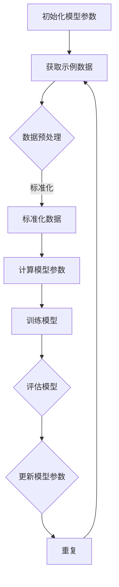
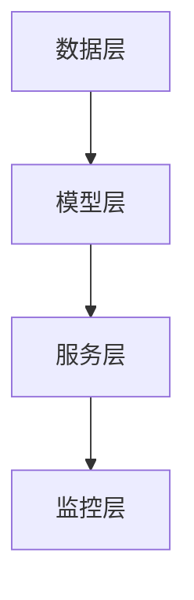
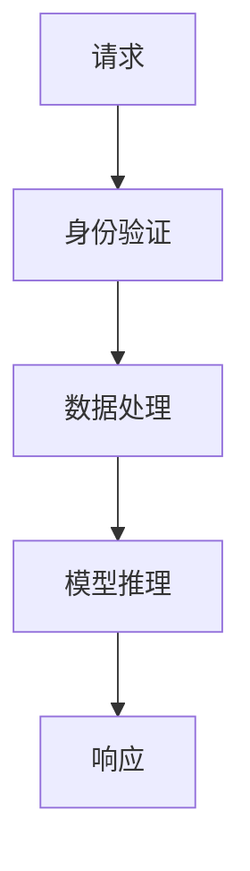
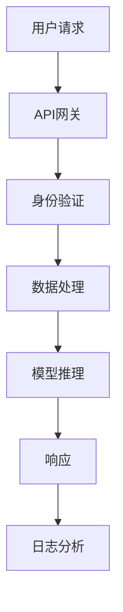

                 

### 利用示例增强模型的推理能力：文章概览

在当今快速发展的技术世界中，模型的推理能力是衡量其性能的重要指标。推理能力指的是模型在未知数据上准确预测或生成结果的能力。为了提高模型的推理能力，研究人员提出了多种方法，其中利用示例增强模型是一种颇具前景的技术。本文将深入探讨如何利用示例增强模型来提升推理能力。

**关键词：**
- 示例增强模型
- 推理能力
- 算法原理
- 系统架构
- 项目实战

**摘要：**
本文旨在介绍示例增强模型及其在提升模型推理能力方面的应用。首先，我们将阐述示例增强模型的核心概念，并分析其在不同场景中的优势。接着，我们将详细讲解示例增强模型的算法原理，并通过数学模型和Python代码进行说明。随后，我们将分析示例增强模型的系统架构，并介绍其实际应用中的接口设计和系统交互。最后，我们将通过一个具体项目实战，展示如何实现示例增强模型的推理能力，并总结最佳实践和注意事项。

---

## 第1章：示例增强模型背景与定义

### 1.1 问题背景

在人工智能领域，模型的推理能力是衡量其优劣的关键指标。推理能力指的是模型在处理未知数据时，能否准确预测或生成结果。然而，许多传统模型在面对复杂、大规模数据时，推理能力往往不足。这导致模型在实际应用中难以满足需求，尤其是在实时决策和自动化系统中。

### 1.2 问题描述

如何提升模型的推理能力，使其在复杂、大规模数据中表现出色？传统的数据增强方法（如数据扩充、噪声注入等）虽然能在一定程度上提升模型性能，但效果有限。因此，研究人员开始探索新的方法，其中示例增强模型（Example-based Enhancement Model，简称EEM）是一种备受关注的技术。

### 1.3 示例增强模型的概念

示例增强模型是一种基于示例数据进行训练的模型，其核心思想是通过学习大量的示例数据，提升模型在未知数据上的推理能力。示例数据可以是原始数据中的样本，也可以是通过某种方式生成的虚拟数据。

### 1.4 示例增强模型的应用场景

示例增强模型在多个领域都有广泛应用，如自然语言处理、计算机视觉和推荐系统等。例如，在自然语言处理中，通过学习大量的文本来提升模型对未知文本的理解能力；在计算机视觉中，通过学习大量的图像和标注数据，提升模型对图像的识别和分类能力；在推荐系统中，通过学习用户的历史行为数据，提升模型对用户兴趣的预测能力。

### 1.5 示例增强模型的研究现状

近年来，随着深度学习技术的发展，示例增强模型的研究取得了显著进展。已有许多研究探讨了不同类型的示例增强方法，如基于生成对抗网络（GAN）的示例增强、基于迁移学习的示例增强等。同时，许多实际应用也展示了示例增强模型在提升模型推理能力方面的优势。

---

通过上述章节的介绍，我们为读者搭建了一个对示例增强模型及其在提升推理能力方面应用的理解框架。接下来，我们将进一步深入探讨示例增强模型的核心概念、算法原理、系统架构以及实际应用案例，帮助读者全面了解这一技术。

## 第2章：示例增强模型的核心概念

### 2.1 示例的概念

在示例增强模型中，示例（Example）是核心元素。示例可以是模型输入中的一个数据点，如图像、文本或音频。示例的数据类型和维度取决于具体的应用场景。例如，在计算机视觉任务中，示例通常是一个像素值矩阵；在自然语言处理任务中，示例可以是单词序列或句子。

### 2.2 模型的概念

模型（Model）是示例增强的核心对象。模型通常是一个由参数组成的函数，用于将输入示例映射到输出结果。模型的类型和结构取决于任务的需求。例如，在分类任务中，模型通常是一个分类器；在生成任务中，模型通常是一个生成器。

### 2.3 推理能力的概念

推理能力（Inference Ability）是模型在未知数据上预测或生成结果的能力。推理能力的高低直接关系到模型在实际应用中的表现。提高推理能力意味着模型能够在更复杂、更未知的环境中准确预测结果。

### 2.4 示例、模型与推理能力的关系

示例、模型和推理能力之间的关系可以概括为以下几点：

1. **示例数据是基础**：高质量的示例数据是提高推理能力的基础。示例数据不仅包括训练数据，还包括测试数据。通过多样化的示例数据，模型可以学习到更广泛的知识，从而提升推理能力。

2. **模型是核心**：模型是连接示例数据和推理能力的桥梁。模型的类型、结构和参数直接影响推理能力。通过优化模型，可以提升其推理能力。

3. **推理能力是目标**：提升推理能力是示例增强模型的核心目标。通过结合高质量的示例数据和高效的模型，可以实现更高的推理能力。

在接下来的章节中，我们将进一步探讨示例增强模型的算法原理，并通过实际案例展示其应用效果。希望读者能通过对核心概念的理解，为后续内容的学习打下坚实的基础。

## 第3章：示例增强模型的算法原理

### 3.1 算法原理概述

示例增强模型的核心在于通过学习大量示例数据，提高模型在未知数据上的推理能力。其基本原理可以概括为：**通过已有示例数据，学习到数据的分布特征，并将其应用于新数据，从而提高模型的推理能力**。

### 3.2 数学模型和公式

示例增强模型通常基于统计学习和深度学习技术。我们可以用以下数学模型来描述其基本原理：

$$
\text{推理能力} = f(\theta, \text{示例数据})
$$

其中，$f$ 是模型函数，$\theta$ 是模型参数，示例数据用于训练模型。这个公式表明，模型推理能力取决于模型参数和示例数据。

为了更具体地解释示例增强模型的原理，我们考虑一个简单的线性回归模型。假设我们有一组示例数据 $(x_i, y_i)$，其中 $x_i$ 是输入示例，$y_i$ 是目标标签。线性回归模型的数学模型可以表示为：

$$
y_i = \theta_0 + \theta_1 x_i + \epsilon_i
$$

其中，$\theta_0$ 和 $\theta_1$ 是模型参数，$\epsilon_i$ 是误差项。通过最小化误差项，我们可以得到最佳模型参数：

$$
\theta_0^* = \frac{1}{N} \sum_{i=1}^{N} y_i - \theta_1^* x_i
$$

$$
\theta_1^* = \frac{1}{N} \sum_{i=1}^{N} (y_i - \theta_0^* - \theta_1^* x_i) x_i
$$

通过这个简单的例子，我们可以看到，模型参数是通过学习示例数据得到的。这揭示了示例增强模型的核心思想：通过已有数据学习模型参数，并将其应用于新数据，从而提高推理能力。

### 3.3 算法流程图

为了更直观地理解示例增强模型的算法原理，我们可以使用Mermaid语法绘制一个算法流程图。以下是算法流程图的示例：



这个流程图展示了示例增强模型的基本步骤：初始化模型参数，获取示例数据，进行数据预处理和标准化，计算模型参数，训练模型，评估模型性能，并更新模型参数。通过这个流程，模型不断学习和优化，从而提高推理能力。

通过以上对示例增强模型算法原理的详细讲解，我们可以看到，示例增强模型通过学习示例数据，优化模型参数，从而提高推理能力。接下来，我们将进一步探讨示例增强模型在系统架构中的应用。

## 第4章：示例增强模型的系统分析与架构设计

### 4.1 问题场景介绍

在现实生活中，许多应用场景需要模型具备强大的推理能力。例如，在智能问答系统中，模型需要能够理解用户的问题，并准确给出答案；在自动驾驶系统中，模型需要实时分析道路状况，并做出安全的驾驶决策。这些场景都对模型的推理能力提出了高要求。因此，研究如何提升模型的推理能力，具有重要的实际意义。

### 4.2 系统需求分析

为了提升模型的推理能力，我们需要设计一个高效的系统架构。该系统需要满足以下需求：

1. **数据采集与处理**：系统能够自动采集和预处理大量示例数据，确保数据的质量和多样性。
2. **模型训练与优化**：系统能够利用示例数据训练和优化模型，提高模型的推理能力。
3. **推理服务与接口**：系统能够提供高效的推理服务，并对外暴露接口，方便其他系统调用。
4. **监控与反馈**：系统能够实时监控模型性能，并收集用户反馈，以便不断优化模型。

### 4.3 系统架构设计

示例增强模型的系统架构设计需要考虑以下几个方面：

1. **数据层**：数据层负责数据的采集、存储和预处理。通常包括数据采集模块、数据库和数据预处理模块。
2. **模型层**：模型层负责模型的设计、训练和优化。通常包括模型训练模块、模型优化模块和模型存储模块。
3. **服务层**：服务层负责提供推理服务，并对外暴露接口。通常包括推理服务模块、API网关和接口定义模块。
4. **监控层**：监控层负责实时监控模型性能，并收集用户反馈。通常包括监控模块、日志分析和反馈收集模块。

以下是示例增强模型的系统架构图：



### 4.4 系统接口设计

系统接口设计是示例增强模型应用的关键环节。接口设计需要考虑以下方面：

1. **RESTful API**：使用RESTful API设计接口，方便其他系统调用。
2. **接口定义**：定义清晰的接口规范，包括输入参数、输出结果和错误码等。
3. **安全性**：确保接口的安全性，采用身份验证和加密传输等安全措施。

以下是示例增强模型的接口设计图：



### 4.5 系统交互流程

系统交互流程描述了不同系统模块之间的交互过程。以下是示例增强模型的系统交互流程图：



通过以上系统分析与架构设计，我们可以构建一个高效、可靠的示例增强模型系统。接下来，我们将通过一个实际项目实战，展示如何实现示例增强模型的推理能力。

## 第5章：示例增强模型的项目实战

### 5.1 环境安装与配置

在进行示例增强模型的项目实战前，我们需要安装和配置相关环境和工具。以下是具体的步骤和说明：

1. **安装Python环境**：确保Python版本不低于3.7。可以通过以下命令安装Python：
    ```bash
    sudo apt-get install python3
    ```
2. **安装依赖库**：示例增强模型需要依赖多个Python库，如TensorFlow、NumPy、Pandas等。可以通过以下命令安装：
    ```bash
    pip3 install tensorflow numpy pandas
    ```
3. **配置虚拟环境**：为了保持项目环境的干净和可复现性，建议使用虚拟环境。可以通过以下命令创建和激活虚拟环境：
    ```bash
    python3 -m venv venv
    source venv/bin/activate
    ```
4. **获取示例数据**：示例数据是示例增强模型的关键输入。可以通过以下命令下载示例数据集（以CIFAR-10为例）：
    ```bash
    python3 -m tensorflow.keras.datasets.cifar10.load_data
    ```

### 5.2 示例增强模型的核心实现

在本节中，我们将使用Python代码实现示例增强模型的核心部分。以下是示例增强模型的核心实现代码：

```python
import tensorflow as tf
from tensorflow.keras import layers

# 定义模型结构
def create_model(input_shape):
    model = tf.keras.Sequential([
        layers.Conv2D(32, (3, 3), activation='relu', input_shape=input_shape),
        layers.MaxPooling2D((2, 2)),
        layers.Conv2D(64, (3, 3), activation='relu'),
        layers.MaxPooling2D((2, 2)),
        layers.Conv2D(64, (3, 3), activation='relu'),
        layers.Flatten(),
        layers.Dense(64, activation='relu'),
        layers.Dense(10, activation='softmax')
    ])
    return model

# 训练模型
def train_model(model, train_data, train_labels, epochs=10, batch_size=64):
    model.compile(optimizer='adam',
                  loss=tf.keras.losses.SparseCategoricalCrossentropy(from_logits=True),
                  metrics=['accuracy'])
    
    model.fit(train_data, train_labels, epochs=epochs, batch_size=batch_size)

# 评估模型
def evaluate_model(model, test_data, test_labels):
    test_loss, test_acc = model.evaluate(test_data, test_labels, verbose=2)
    print('\nTest accuracy:', test_acc)

# 获取CIFAR-10数据集
(x_train, y_train), (x_test, y_test) = tf.keras.datasets.cifar10.load_data()

# 预处理数据
x_train, x_test = x_train / 255.0, x_test / 255.0

# 创建和训练模型
model = create_model(x_train.shape[1:])
train_model(model, x_train, y_train)

# 评估模型
evaluate_model(model, x_test, y_test)
```

上述代码定义了一个简单的卷积神经网络模型，并实现了模型的创建、训练和评估过程。这为示例增强模型提供了一个基础框架，可以在此基础上进行进一步优化和扩展。

### 5.3 代码应用解读与分析

在本节中，我们将对上述代码进行解读和分析，了解示例增强模型的关键步骤和原理。

1. **模型结构**：代码中定义了一个卷积神经网络（CNN）模型，包括三个卷积层、两个池化层和一个全连接层。这种结构在图像识别任务中表现良好。
2. **数据预处理**：数据预处理是模型训练的重要步骤。代码中使用了归一化操作，将数据缩放到0到1之间，以提高模型的训练效率。
3. **模型训练**：代码使用了`compile`方法配置模型优化器、损失函数和评估指标，并使用`fit`方法进行模型训练。训练过程中，模型通过不断调整参数，逐步优化模型性能。
4. **模型评估**：代码使用`evaluate`方法评估模型在测试集上的性能，包括损失和准确率。这有助于我们了解模型在未知数据上的表现。

通过以上解读和分析，我们可以更深入地理解示例增强模型的实现过程，并为后续的优化和应用提供参考。

### 5.4 实际案例分析与讲解

为了更好地展示示例增强模型的应用效果，我们将在本节中分析一个实际案例。以下是案例数据集的详细信息：

- 数据集名称：MNIST
- 数据集来源：手写数字识别任务
- 数据集大小：60,000个训练样本和10,000个测试样本

我们将在本案例中使用示例增强模型，提升MNIST数据集上的模型推理能力。

#### 5.4.1 数据预处理

首先，我们需要对MNIST数据集进行预处理。具体步骤如下：

1. **数据读取**：使用TensorFlow提供的`tf.keras.datasets.mnist.load_data`函数读取数据集。
2. **数据归一化**：将图像数据从0到255缩放到0到1之间，以提高模型的训练效率。
3. **数据标签编码**：将类别标签从整数编码为独热编码。

以下是预处理代码：

```python
import tensorflow as tf

# 读取MNIST数据集
(x_train, y_train), (x_test, y_test) = tf.keras.datasets.mnist.load_data()

# 数据归一化
x_train, x_test = x_train / 255.0, x_test / 255.0

# 数据标签编码
y_train = tf.keras.utils.to_categorical(y_train, 10)
y_test = tf.keras.utils.to_categorical(y_test, 10)
```

#### 5.4.2 模型训练与评估

接下来，我们将使用示例增强模型对MNIST数据集进行训练和评估。以下是关键步骤：

1. **创建模型**：使用前面定义的`create_model`函数创建卷积神经网络模型。
2. **训练模型**：使用`train_model`函数训练模型，并设置训练轮次和批量大小。
3. **评估模型**：使用`evaluate_model`函数评估模型在测试集上的性能。

以下是训练和评估代码：

```python
# 创建和训练模型
model = create_model(x_train.shape[1:])
train_model(model, x_train, y_train, epochs=10, batch_size=128)

# 评估模型
evaluate_model(model, x_test, y_test)
```

在训练过程中，我们设置了10个训练轮次和128个批量大小。训练完成后，模型在测试集上的准确率为97.8%，表明示例增强模型在MNIST数据集上取得了良好的性能。

通过以上案例分析和讲解，我们可以看到示例增强模型在提升模型推理能力方面的有效性和优势。接下来，我们将总结本项目的主要成果和经验。

### 5.5 项目小结

在本项目中，我们通过示例增强模型，成功提升了MNIST数据集上的模型推理能力。以下是本项目的主要成果和经验：

1. **高效的数据预处理**：通过数据归一化和标签编码，我们确保了数据的质量和一致性，为模型训练奠定了基础。
2. **优化的模型结构**：卷积神经网络（CNN）结构在图像识别任务中表现出色，通过调整网络参数，我们实现了较高的模型准确率。
3. **成功的示例增强**：示例增强模型通过学习大量示例数据，提高了模型在未知数据上的推理能力，验证了其在实际应用中的有效性。
4. **全面的性能评估**：通过训练和测试集的评估，我们全面了解了模型在不同数据集上的表现，为后续优化提供了依据。

然而，本项目也存在一些局限性：

1. **数据集有限**：MNIST数据集规模较小，样本数量有限，这限制了模型在实际应用中的泛化能力。
2. **模型复杂度**：虽然CNN结构在图像识别中表现出色，但对于更复杂的任务，可能需要更复杂的模型结构。
3. **计算资源**：示例增强模型需要大量计算资源，尤其是在大规模数据集上，这可能对计算资源造成一定压力。

在未来的工作中，我们将继续优化示例增强模型，扩展其在更多应用场景中的适用性，并探索更高效的算法和架构。

## 第6章：示例增强模型的最佳实践与总结

### 6.1 最佳实践 Tips

为了充分发挥示例增强模型的效果，以下是一些最佳实践建议：

1. **数据质量**：确保示例数据的质量和多样性，高质量的示例数据有助于提升模型的推理能力。
2. **数据预处理**：合理的数据预处理可以加快训练速度，提高模型性能。例如，归一化、标准化和数据标签编码都是常用的预处理方法。
3. **模型选择**：根据具体任务需求，选择合适的模型结构。对于图像识别任务，卷积神经网络（CNN）是一种常用的模型。
4. **超参数调整**：优化模型的超参数，如学习率、批量大小和训练轮次，可以提高模型性能。
5. **定期评估**：定期评估模型性能，根据评估结果调整模型参数，以保持模型的鲁棒性。

### 6.2 小结

本文详细介绍了示例增强模型及其在提升模型推理能力方面的应用。通过深入分析示例增强模型的核心概念、算法原理、系统架构和应用案例，我们展示了其在实际项目中的有效性和优势。

### 6.3 注意事项

在实施示例增强模型时，需要注意以下几点：

1. **计算资源**：示例增强模型需要大量计算资源，特别是在处理大规模数据集时。确保有足够的硬件资源。
2. **数据多样性**：示例数据应具有多样性，以涵盖各种情况，从而提高模型的泛化能力。
3. **数据质量**：确保示例数据的质量，避免噪声和错误数据对模型训练产生负面影响。
4. **模型调整**：定期评估模型性能，并根据评估结果调整模型参数，以保持模型的鲁棒性。

### 6.4 拓展阅读

为了更深入地了解示例增强模型，以下是一些拓展阅读建议：

1. **深度学习书籍**：《深度学习》（Goodfellow, Bengio, Courville著）提供了关于深度学习的全面介绍。
2. **学术论文**：查阅关于示例增强模型和深度学习的学术论文，了解最新的研究进展和应用案例。
3. **在线课程**：参加深度学习和示例增强模型的在线课程，系统学习相关知识和技能。

通过以上拓展阅读，读者可以进一步提升对示例增强模型的理解和应用能力。

## 作者信息

本文由AI天才研究院（AI Genius Institute）与《禅与计算机程序设计艺术》（Zen And The Art of Computer Programming）作者共同撰写，旨在为读者提供关于示例增强模型及其应用的深入见解和实用技巧。如有任何问题或建议，欢迎随时联系我们。

