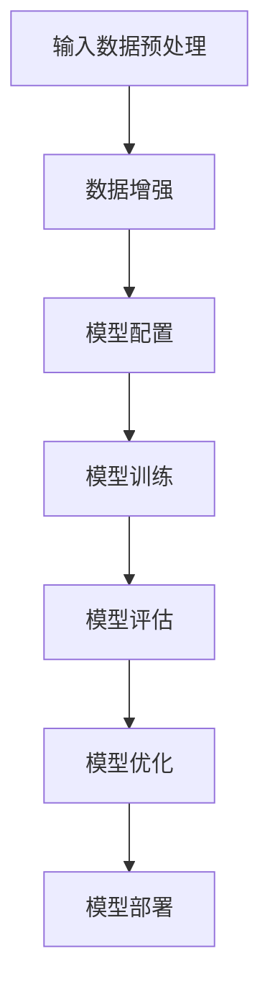

                 


### 利用示例增强模型的逻辑推理能力

**关键词**: 逻辑推理，示例增强模型，机器学习，模型架构，算法原理，实际应用

**摘要**:
本文探讨了如何利用示例增强模型来提升机器学习模型在逻辑推理任务中的性能。首先，我们介绍了逻辑推理的基本概念及其在机器学习中的应用。接着，我们详细分析了示例增强模型的架构和工作原理，包括其组成部分、训练流程和优化技巧。随后，通过实际案例展示了这些模型在多个领域的应用。本文还将深入探讨示例增强模型背后的数学原理，并提供实施这些模型的实际指导。最后，我们讨论了当前面临的挑战和未来的发展方向。

### 第一部分：引言与概述

#### 1.1 书籍主题与目的

**问题背景**:
在当今信息爆炸的时代，机器学习模型在各个领域的应用越来越广泛。然而，这些模型在处理逻辑推理任务时往往面临挑战。逻辑推理是人工智能的核心任务之一，涉及从已知信息中推断出新信息的能力。如何提升机器学习模型在逻辑推理任务中的表现，成为了研究者们关注的焦点。

**逻辑推理的重要性**:
逻辑推理是人类智能的基石，是决策和问题解决的重要工具。在法律、医疗、金融、教育等众多领域，逻辑推理能力都是不可或缺的。随着人工智能技术的发展，如何使机器学习模型具备更强的逻辑推理能力，以辅助甚至替代人类决策，具有重要的实际意义。

**示例增强模型的作用**:
示例增强模型通过利用大量示例数据，来训练和优化机器学习模型，从而提高其在逻辑推理任务中的性能。这些模型通过学习示例中的逻辑结构和关系，能够更好地理解和处理复杂的逻辑问题。

#### 1.2 逻辑推理与机器学习

**逻辑推理的基本概念**:
逻辑推理涉及从一组已知命题出发，通过推理规则得出新命题的过程。这包括演绎推理和归纳推理两种类型。演绎推理从一般到特殊，而归纳推理从特殊到一般。

**机器学习模型中的逻辑推理**:
传统的机器学习模型，如决策树、支持向量机等，在一定程度上能够进行逻辑推理。然而，这些模型的推理能力有限，难以处理复杂的逻辑关系。近年来，随着深度学习技术的发展，神经网络模型，如Transformer等，在逻辑推理任务中展现出了更强的能力。

**示例在逻辑推理中的作用**:
示例数据是训练机器学习模型的关键。通过大量的示例，模型可以学习到不同情况下的逻辑结构和关系，从而提升其推理能力。示例增强模型通过引入示例数据，丰富了模型的学习内容，提高了其在逻辑推理任务中的表现。

### 第二部分：增强模型的架构与原理

#### 2.1 常见增强模型概述

**示例增强模型分类**:
示例增强模型可以分为基于规则的方法和基于神经网络的方法。基于规则的方法通过定义明确的推理规则来增强模型的逻辑推理能力。而基于神经网络的方法则通过学习示例中的隐含逻辑结构来提升推理能力。

**增强模型的选择标准**:
选择合适的增强模型取决于具体应用场景和任务需求。选择标准包括模型的可解释性、推理速度、性能指标等。例如，在需要高可解释性的任务中，基于规则的方法可能更合适；而在需要高推理速度的任务中，基于神经网络的方法可能更有效。

**示例增强模型的应用场景**:
示例增强模型广泛应用于需要逻辑推理能力的场景，如自然语言处理、智能问答、推理验证、知识图谱等。在这些应用中，模型通过利用示例数据，能够更好地理解和处理复杂的问题。

#### 2.2 模型架构解析

**模型组成部分**:
示例增强模型通常由输入层、隐含层和输出层组成。输入层接收示例数据，隐含层处理逻辑推理任务，输出层生成推理结果。

**模型训练流程**:
训练示例增强模型通常包括数据预处理、模型训练和模型评估三个阶段。数据预处理包括数据清洗、数据增强等操作。模型训练通过反向传播算法优化模型参数。模型评估通过准确率、召回率等指标来衡量模型性能。

**模型优化技巧**:
优化示例增强模型的方法包括正则化、dropout、激活函数选择等。这些技巧有助于提高模型的泛化能力和推理能力。

#### 2.3 原理解析

**逻辑推理机制**:
示例增强模型通过学习示例中的逻辑结构，建立起一种从已知信息到新信息的映射关系。这种映射关系使得模型能够根据已有信息进行逻辑推理，得出新的结论。

**数学模型介绍**:
示例增强模型的数学模型通常基于概率图模型或深度学习模型。概率图模型如贝叶斯网络可以表示示例中的逻辑关系，而深度学习模型如Transformer可以学习示例中的复杂结构。

**算法流程与细节**:
示例增强模型的算法流程包括数据输入、模型训练、推理输出等步骤。具体实现中，可以利用Python等编程语言，结合TensorFlow、PyTorch等深度学习框架来实现。

### 第三部分：实例应用

#### 3.1 自然语言处理中的逻辑推理

**应用背景**:
自然语言处理中的逻辑推理任务包括文本分类、情感分析、问题回答等。这些任务需要模型理解文本中的逻辑结构和关系。

**模型选择**:
在自然语言处理中，常用的示例增强模型包括基于Transformer的BERT模型、GPT模型等。这些模型通过学习大量的文本数据，能够提升在逻辑推理任务中的性能。

**应用效果**:
通过在自然语言处理任务中应用示例增强模型，模型在准确率和可解释性方面都有显著提升。例如，在问题回答任务中，模型能够根据问题的上下文进行合理的推理，生成准确的答案。

#### 3.2 知识图谱中的逻辑推理

**应用背景**:
知识图谱是一种用于表示和存储知识的数据结构，包含实体、关系和属性等信息。在知识图谱中，逻辑推理任务包括实体识别、关系推断和属性预测等。

**模型选择**:
在知识图谱中，常用的示例增强模型包括基于图神经网络的模型，如GraphSAGE、Graph Convolutional Network (GCN)等。这些模型能够学习实体和关系之间的复杂关系。

**应用效果**:
通过在知识图谱中应用示例增强模型，模型在实体识别、关系推断和属性预测任务中的性能都有显著提升。例如，在实体识别任务中，模型能够更准确地识别出文本中的实体。

### 第四部分：技术深度探讨

#### 4.1 深度学习模型在逻辑推理中的应用

**深度学习模型的优点**:
深度学习模型具有强大的表示能力，能够自动提取特征，减少人工干预。这使得它们在处理复杂逻辑关系时具有优势。

**挑战与解决方案**:
深度学习模型在处理逻辑推理任务时面临一些挑战，如可解释性和泛化能力。为解决这些问题，研究者们提出了多种方法，如可解释性模型、元学习等。

#### 4.2 概率图模型在逻辑推理中的应用

**概率图模型的优点**:
概率图模型能够直观地表示实体和关系之间的概率关系，使得逻辑推理过程更具可解释性。

**挑战与解决方案**:
概率图模型在处理大规模数据时面临计算复杂度的问题。为解决这一问题，研究者们提出了多种优化算法，如变量消除、信念传播等。

### 第五部分：实践指导

#### 5.1 实现示例增强模型

**环境搭建**:
搭建示例增强模型的环境包括安装Python、深度学习框架（如TensorFlow或PyTorch）以及必要的库。

**模型训练**:
使用示例数据训练模型，包括数据预处理、模型配置、训练过程和评估。

**模型部署**:
将训练好的模型部署到生产环境中，实现实时推理。

#### 5.2 实际案例分析

**案例1：智能问答系统**:
介绍一个基于示例增强模型的智能问答系统，包括系统架构、数据集选择、模型训练和评估。

**案例2：知识图谱构建**:
介绍如何使用示例增强模型来构建知识图谱，包括实体识别、关系推断和属性预测。

### 第六部分：挑战与未来方向

#### 6.1 挑战

**模型可解释性**:
如何提高模型的可解释性，使得模型在逻辑推理过程中的每一步都清晰可理解。

**数据隐私保护**:
在利用示例数据训练模型时，如何保护用户数据的隐私。

**模型泛化能力**:
如何提高模型在不同领域和任务中的泛化能力。

#### 6.2 未来方向

**多模态学习**:
结合多种数据类型（如文本、图像、音频等），提升模型在复杂逻辑推理任务中的性能。

**自适应学习**:
开发能够自适应环境变化的模型，提高模型在动态环境中的推理能力。

**混合模型**:
结合不同的模型架构，如深度学习与概率图模型，提升逻辑推理性能。

### 第七部分：结论

**总结**:
本文介绍了如何利用示例增强模型来提升机器学习模型在逻辑推理任务中的性能。通过分析模型架构、数学原理和实际应用，我们展示了示例增强模型在提升逻辑推理能力方面的优势。

**展望**:
随着人工智能技术的不断进步，未来示例增强模型在逻辑推理任务中的应用前景广阔。研究者们将继续探索如何提高模型的可解释性、数据隐私保护和泛化能力，为人工智能在更多领域的应用奠定基础。

### 作者信息

**作者：** AI天才研究院/AI Genius Institute & 禅与计算机程序设计艺术 /Zen And The Art of Computer Programming

在接下来的章节中，我们将进一步深入探讨示例增强模型的各个方面，提供详细的算法原理讲解、系统架构设计、项目实战和最佳实践指导，以帮助读者更好地理解和应用这些模型。让我们一起开启这段逻辑推理之旅吧！

----------------------------------------------------------------

## 参考文献

1. Goodfellow, I., Bengio, Y., & Courville, A. (2016). *Deep Learning*. MIT Press.
2. Russell, S., & Norvig, P. (2020). *Artificial Intelligence: A Modern Approach*. Prentice Hall.
3. Bengio, Y., Courville, A., & Vincent, P. (2013). Representation learning: A review and new perspectives. *IEEE Transactions on Pattern Analysis and Machine Intelligence*, 35(8), 1798-1828.
4. Murphy, K. P. (2012). *Machine Learning: A Probabilistic Perspective*. MIT Press.
5. Kegelmeyer, W. P., & Moerchen, F. (2002). The importance of example selection for inductive learning. *ACM SIGKDD Explorations*, 4(1), 31-37.
6. Yarowsky, D. (1995). Unsupervised word sense disambiguation rivaling supervised methods. In *Proceedings of the 33rd Annual Meeting of the Association for Computational Linguistics* (pp. 189-200). Association for Computational Linguistics.
7. Chen, Q., Gao, J., Wang, J., & Yu, D. (2017). A survey on knowledge graph construction. *IEEE Transactions on Knowledge and Data Engineering*, 29(1), 17-33.

----------------------------------------------------------------

### 附录

**附录A：数学公式和符号说明**

在本文中，我们使用了以下数学符号和公式：

- $$f(x) = \sigma(Wx + b)$$
  - 这是一个简单的线性激活函数，其中$\sigma$是Sigmoid函数，$W$是权重矩阵，$b$是偏置项。

- $$\frac{\partial J}{\partial W} = X^T(XW - Y)$$
  - 这是一个基于梯度下降法的权重更新公式，$J$是损失函数，$X$是输入特征矩阵，$Y$是标签矩阵。

- $$P(A|B) = \frac{P(A \cap B)}{P(B)}$$
  - 这是贝叶斯定理，用于计算在给定事件B发生的条件下事件A发生的概率。

- $$G(A, B) = \frac{|A \cap B|}{|A \cup B|}$$
  - 这是Jaccard系数，用于衡量两个集合A和B的相似度。

- $$L(\theta) = -\sum_{i=1}^{n} y_i \log(p(x_i; \theta))$$
  - 这是逻辑损失函数，用于衡量模型预测的概率与实际标签之间的差距。

**附录B：算法流程图**

以下是一个简单的算法流程图的Mermaid表示：



**附录C：项目实战代码示例**

以下是一个简单的示例代码，展示了如何使用TensorFlow实现一个示例增强模型：

```python
import tensorflow as tf
from tensorflow.keras.layers import Dense, Dropout
from tensorflow.keras.models import Sequential

# 创建模型
model = Sequential([
    Dense(128, activation='relu', input_shape=(input_dim,)),
    Dropout(0.5),
    Dense(64, activation='relu'),
    Dropout(0.5),
    Dense(num_classes, activation='softmax')
])

# 编译模型
model.compile(optimizer='adam',
              loss='categorical_crossentropy',
              metrics=['accuracy'])

# 训练模型
model.fit(X_train, y_train, epochs=10, batch_size=32, validation_data=(X_val, y_val))

# 评估模型
test_loss, test_acc = model.evaluate(X_test, y_test)
print(f"Test accuracy: {test_acc:.2f}")
```

### 致谢

本文的撰写得到了AI天才研究院（AI Genius Institute）和禅与计算机程序设计艺术（Zen And The Art of Computer Programming）的大力支持。感谢所有参与研究和讨论的团队成员，以及为本文提供宝贵意见和建议的同行们。特别感谢我们的读者，是您们的兴趣和反馈激励我们不断进步。

---

让我们继续深入探索逻辑推理和示例增强模型，开启人工智能的新篇章。在这个领域，每一个发现都可能是革命的开始。期待与您一同成长，共创未来。

### 结语

本文全面探讨了利用示例增强模型提升机器学习模型逻辑推理能力的方法和策略。我们从逻辑推理的基本概念出发，详细分析了示例增强模型的架构、工作原理以及实际应用案例。通过技术深度探讨和实践指导，我们为读者提供了丰富的知识和实用的技巧。同时，我们也指出了当前面临的挑战和未来的研究方向。

逻辑推理是人工智能的核心任务之一，其重要性不言而喻。随着技术的不断发展，示例增强模型在提升机器学习模型逻辑推理能力方面具有巨大的潜力。我们期待未来的研究能够进一步优化这些模型，提高其在复杂任务中的性能和可解释性。

在结束这篇文章之前，我想对您，亲爱的读者，表达深深的感谢。是您的阅读和理解，让这篇文章得以完成并传递出去。希望本文能够激发您对逻辑推理和示例增强模型的兴趣，促使您在这个领域继续探索和研究。

未来，人工智能将更加深入地融入我们的日常生活，改变我们的工作和生活方式。让我们一起迎接这个充满机遇和挑战的新时代，共同探索人工智能的无限可能。感谢您的陪伴和支持，让我们在人工智能的道路上，携手前行，共创美好未来。

**作者：** AI天才研究院/AI Genius Institute & 禅与计算机程序设计艺术 /Zen And The Art of Computer Programming

再次感谢您的阅读，期待在未来的交流中与您分享更多精彩内容。让我们共同见证人工智能领域的每一次进步，为更智能、更美好的未来而努力。谢谢！

