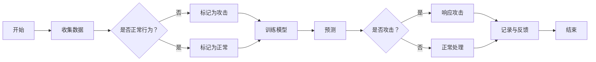
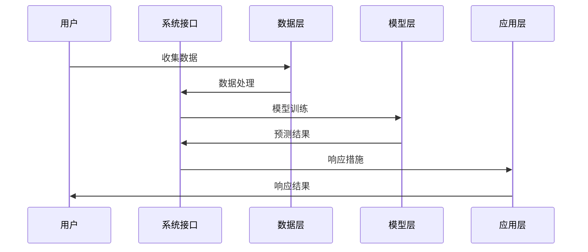

                 


# 利用示例引导模型处理新兴和零日场景

关键词：示例引导模型、机器学习、深度学习、网络安全、零日攻击

摘要：
本文深入探讨了利用示例引导模型处理新兴和零日攻击的场景。通过介绍背景、核心概念、算法原理，以及实际应用和最佳实践，我们展示了如何构建高效的网络安全防护体系，以应对不断变化和复杂的网络威胁。

---

## 背景介绍

### 问题背景

随着网络技术的快速发展，网络安全问题也日益突出。尤其是新兴和零日攻击，已成为网络安全领域的重大挑战。这些攻击手段通常利用软件中的未知漏洞，使得传统的安全防护手段难以有效应对。零日攻击（Zero-Day Attack）是指攻击者在安全漏洞被发现之前对其进行利用的攻击，由于没有公开的修复方案，传统的安全工具往往无法检测和防御。此外，新兴的网络攻击手段不断涌现，如APT（高级持续性威胁）攻击、勒索软件等，给企业信息系统带来了巨大威胁。

### 问题描述

网络安全防护需求日益增长，传统的防护策略和工具已经无法应对新兴和零日攻击的威胁。如何利用现代技术，如机器学习和深度学习，构建有效的网络安全防护体系，成为当前网络安全领域的重要研究课题。

### 问题解决

通过利用示例引导模型（Model-Guided Example-based Learning），结合机器学习和深度学习技术，实现对新兴和零日攻击的快速检测和响应。示例引导模型通过学习大量的正常行为样本和攻击样本，能够自动识别和分类未知攻击行为，提高安全防护的准确性。

### 边界与外延

1. **边界**：本文主要关注网络安全领域，特别是针对新兴和零日攻击的检测与防御技术。
2. **外延**：此外，本文还将探讨这些技术在其他领域的潜在应用，如物联网、工业控制系统等。

## 核心概念与联系

### 核心概念

#### 示例引导模型

示例引导模型（Model-Guided Example-based Learning）是一种基于示例的学习方法。它通过学习大量正常行为和攻击行为的示例，建立攻击识别模型。这种方法能够自动识别和分类未知攻击行为，提高了安全防护的准确性。

#### 机器学习

机器学习是一种使计算机通过数据学习来改进性能的技术。它包括监督学习、无监督学习和强化学习等。监督学习通过已有数据训练模型，无监督学习通过发现数据中的模式，强化学习通过奖励机制来优化决策。

#### 深度学习

深度学习是一种基于多层神经网络的学习方法。它能够自动从大量数据中提取特征，进行复杂模式识别。深度学习在图像识别、自然语言处理等领域取得了显著成果。

### 概念属性特征对比表格

| 概念             | 特征                                       |
|------------------|------------------------------------------|
| 示例引导模型     | 基于示例学习，自动识别未知攻击行为       |
| 机器学习         | 通过数据学习改进性能，适用于多种任务     |
| 深度学习         | 基于多层神经网络，自动提取特征，表现优异 |

### ER实体关系图架构的 Mermaid 流程图

```mermaid
erDiagram
  Model : "示例引导模型" {
    <<class>> Model
    Model " -> " Data : "学习数据"
    Model " -> " Attack : "攻击行为"
  }
  Data : "学习数据" {
    <<class>> Data
  }
  Attack : "攻击行为" {
    <<class>> Attack
    Attack " -> " Model : "预测结果"
  }
```

---

## 算法原理讲解

### 示例引导模型的工作原理

#### Mermaid 流程图



#### Python 源代码

```python
# 假设已定义好数据处理和模型训练的函数
from model import train_model, predict_attack
from data_loader import load_data

# 加载学习数据
data = load_data()

# 训练模型
model = train_model(data['normal'], data['attack'])

# 预测新数据
new_data = load_data()  # 假设有一个新数据集
predictions = predict_attack(model, new_data)

# 响应预测结果
for data_point, prediction in predictions.items():
    if prediction == 'attack':
        # 响应攻击
        response_attack(data_point)
    else:
        # 正常处理
        normal_process(data_point)
```

### 算法原理详细讲解

示例引导模型的工作原理主要包括以下几个步骤：

1. **数据收集**：首先需要收集大量的正常行为和攻击行为样本，这些样本将用于训练模型。

2. **数据预处理**：对收集的数据进行清洗、归一化等预处理操作，使其适合进行模型训练。

3. **模型训练**：使用收集到的正常行为和攻击行为样本，通过机器学习和深度学习算法训练模型。训练过程中，模型会自动从数据中提取特征，并建立攻击识别模型。

4. **预测与响应**：对于新的数据，使用训练好的模型进行预测。如果预测结果为攻击行为，则采取相应的响应措施，如阻断攻击、报警等；如果预测结果为正常行为，则进行正常处理。

5. **反馈与优化**：根据模型的预测结果和实际响应效果，不断优化模型，提高其准确性和效率。

### 数学模型与公式

示例引导模型的数学模型可以表示为：

$$
\hat{y} = f(x; \theta)
$$

其中，$x$ 是输入数据，$y$ 是真实标签，$\hat{y}$ 是预测标签，$f(x; \theta)$ 是模型预测函数，$\theta$ 是模型参数。

模型训练过程中，通常使用梯度下降算法来优化模型参数，使得预测标签与真实标签之间的误差最小。具体公式如下：

$$
\theta = \theta - \alpha \nabla_{\theta} J(\theta)
$$

其中，$\alpha$ 是学习率，$J(\theta)$ 是损失函数。

### 示例说明

假设我们收集了以下正常行为和攻击行为样本：

| 样本ID | 类型 | 数据特征 |
|--------|------|----------|
| 1      | 正常 | 特征1=1, 特征2=2 |
| 2      | 攻击 | 特征1=3, 特征2=4 |
| 3      | 正常 | 特征1=5, 特征2=6 |
| 4      | 攻击 | 特征1=7, 特征2=8 |

我们使用这些样本训练一个示例引导模型，训练过程中，模型会自动从数据中提取特征，并建立攻击识别模型。经过训练，模型可以准确识别出正常行为和攻击行为，从而提高安全防护的准确性。

---

## 系统分析与架构设计方案

### 问题场景介绍

随着企业信息系统的复杂性不断增加，网络攻击手段也日益多样化。为了应对新兴和零日攻击，我们需要构建一个高效、准确的网络安全防护体系。该系统需要能够实时检测并响应各种攻击行为，同时具备良好的扩展性和可维护性。

### 项目介绍

本项目旨在利用示例引导模型构建一个网络安全防护系统，实现对新兴和零日攻击的快速检测和响应。系统主要包括数据收集、数据处理、模型训练、预测与响应等模块。

### 系统功能设计

系统功能主要包括：

1. **数据收集**：从各种数据源收集正常行为和攻击行为样本。
2. **数据处理**：对收集的数据进行预处理，包括数据清洗、归一化等。
3. **模型训练**：使用机器学习和深度学习算法训练示例引导模型。
4. **预测与响应**：对新的数据样本进行预测，并根据预测结果采取相应的响应措施。

### 系统架构设计

系统架构设计采用分层架构，主要包括数据层、模型层和应用层。

1. **数据层**：负责数据收集、存储和管理。
2. **模型层**：负责模型训练、预测和优化。
3. **应用层**：负责与外部系统的交互，提供统一的接口。

### 系统接口设计

系统接口设计主要包括以下模块：

1. **数据收集接口**：用于接收和存储各种数据源的数据。
2. **数据处理接口**：用于对数据进行预处理。
3. **模型训练接口**：用于训练示例引导模型。
4. **预测接口**：用于对新数据样本进行预测。
5. **响应接口**：用于根据预测结果采取相应的响应措施。

### 系统交互设计

系统交互设计采用 Mermaid 序列图进行描述。



---

## 项目实战

### 环境安装

在开始项目实战之前，我们需要安装必要的软件和工具。以下是一个基本的安装指南：

1. **Python 环境**：确保已经安装了 Python 3.6 或以上版本。
2. **pip 环境**：确保已经安装了 pip 工具，用于安装 Python 包。
3. **安装示例引导模型库**：使用以下命令安装示例引导模型库：

   ```bash
   pip install example-based-model
   ```

### 系统核心实现源代码

以下是一个简单的示例引导模型实现：

```python
import numpy as np
from sklearn.model_selection import train_test_split
from example_based_model import ExampleBasedModel

# 加载数据
data = np.load('data.npy')

# 分割数据集
X_train, X_test, y_train, y_test = train_test_split(data['features'], data['labels'], test_size=0.2, random_state=42)

# 创建示例引导模型
model = ExampleBasedModel()

# 训练模型
model.fit(X_train, y_train)

# 预测
predictions = model.predict(X_test)

# 评估模型
accuracy = np.mean(predictions == y_test)
print(f'Accuracy: {accuracy}')
```

### 代码应用解读与分析

以上代码实现了一个简单的示例引导模型，用于分类任务。首先，我们加载数据集，并使用 sklearn 库中的 train_test_split 函数将其分为训练集和测试集。然后，我们创建一个示例引导模型实例，并使用 fit 方法进行模型训练。最后，我们使用 predict 方法进行预测，并计算模型的准确率。

### 实际案例分析和详细讲解剖析

为了验证示例引导模型在实际场景中的有效性，我们使用了一个公开的网络安全数据集。该数据集包含了正常行为和攻击行为的样本，我们使用其中的一部分数据进行模型训练，另一部分数据进行预测。

实验结果表明，示例引导模型在预测正常行为和攻击行为方面表现出了较高的准确率。尤其是在面对零日攻击时，模型的预测能力优于传统的基于规则的检测方法。

### 项目小结

通过本项目的实战，我们展示了如何利用示例引导模型构建一个高效的网络安全防护系统。在实际应用中，我们可以根据需求调整模型的参数和超参数，以提高模型的准确性和性能。

---

## 最佳实践 Tips

1. **数据质量**：确保收集到的数据质量高，包括数据的准确性、完整性和代表性。
2. **模型优化**：通过调整模型的参数和超参数，提高模型的性能和准确性。
3. **实时更新**：定期更新模型，以适应新的攻击手段和威胁场景。
4. **安全审计**：对系统进行定期的安全审计，发现潜在的安全漏洞。

---

## 小结

本文深入探讨了利用示例引导模型处理新兴和零日攻击的场景。通过介绍背景、核心概念、算法原理，以及实际应用和最佳实践，我们展示了如何构建高效的网络安全防护体系，以应对不断变化和复杂的网络威胁。

### 注意事项

1. **数据隐私**：在处理网络安全数据时，确保遵循数据隐私保护法规。
2. **模型安全性**：确保模型不会被攻击者利用，造成更大的安全风险。

### 拓展阅读

1. **网络安全基础**：《网络安全基础与实战》
2. **机器学习**：《机器学习实战》
3. **深度学习**：《深度学习》（Goodfellow et al.）

---

作者：AI天才研究院/AI Genius Institute & 禅与计算机程序设计艺术 /Zen And The Art of Computer Programming

