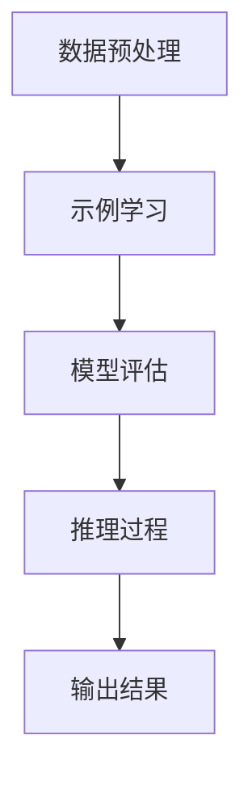
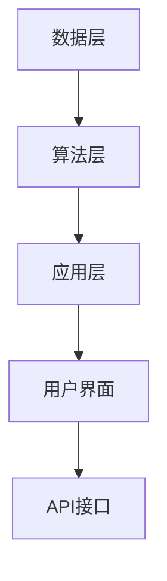
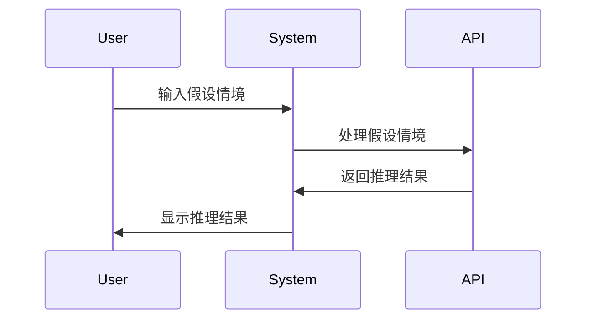

                 


## 《利用示例引导模型进行反事实推理》

### 关键词：反事实推理、示例引导模型、算法、数学模型、系统架构、项目实战、最佳实践

> 摘要：本文深入探讨了反事实推理及其在示例引导模型中的应用。通过详细的算法原理讲解、数学模型推导、系统架构设计以及实际项目实战，本文旨在为读者提供一套系统化的反事实推理解决方案，并分享最佳实践与注意事项。

### 第1章: 反事实推理的基本概念

#### 1.1 问题背景与定义

反事实推理（Counterfactual Inference）是一种在假设情境下对现实事件进行推理和分析的方法。它源于哲学和逻辑学，近年来在计算机科学和人工智能领域得到了广泛关注。反事实推理的核心在于推断“如果发生了其他情况，结果会是什么？”这一假设性问题。

在现实世界中，反事实推理有着广泛的应用场景。例如，在医疗领域，医生可能会思考“如果使用不同的治疗方法，患者的恢复情况会有所不同吗？”；在金融领域，分析师可能会探讨“如果市场情况发生改变，投资组合的收益率会如何变化？”；在商业决策中，企业可能会考虑“如果市场推广策略调整，销售额会有何影响？”

#### 1.2 反事实推理的重要性

反事实推理在许多领域中具有重要作用。首先，它能够帮助我们从不同角度审视问题，为决策提供更多的参考依据。其次，它有助于我们理解和预测复杂的系统行为，从而更好地应对不确定性。最后，反事实推理能够促进知识发现和问题解决，提升人工智能系统的智能化水平。

然而，反事实推理也存在一定的局限性。首先，假设情境的构建需要具备一定的专业知识和经验。其次，反事实推理的结果往往具有不确定性，无法给出绝对的答案。因此，在实际应用中，我们需要综合考虑多种因素，谨慎使用反事实推理方法。

#### 1.3 反事实推理的边界与外延

反事实推理的边界在于假设情境的合理性。假设情境应尽量接近现实，同时需要考虑到数据质量和模型的准确性。反事实推理的外延包括但不限于：时间序列分析、因果推断、情景模拟、决策支持系统等。

#### 1.4 概念结构与核心要素组成

为了更好地理解反事实推理，我们可以将其核心要素分为以下几类：

1. **问题定义**：明确需要解决的问题和目标。
2. **假设情境**：构建一个或多个假设情境。
3. **推理方法**：选择合适的推理方法，如贝叶斯推理、逻辑推理、机器学习等。
4. **结果分析**：分析反事实推理结果，评估其合理性和可靠性。

### 第2章: 示例引导模型

#### 2.1 示例引导模型概述

示例引导模型（Example-Guided Model）是一种基于示例学习的模型，旨在通过学习给定示例来推断未知情境的结果。在反事实推理中，示例引导模型可以有效地帮助我们在假设情境下进行推理和分析。

示例引导模型的核心理念是“从已知到未知”。通过学习大量的示例，模型可以捕捉到数据中的规律和模式，从而在新的假设情境下进行推理。这种方法具有以下几个优点：

1. **灵活性**：示例引导模型可以根据不同的假设情境进行调整。
2. **可解释性**：示例引导模型的学习过程较为直观，便于理解和解释。
3. **高效性**：示例引导模型可以在较短的时间内处理大量数据。

#### 2.2 示例引导模型的架构

示例引导模型通常由以下几个部分组成：

1. **数据输入**：包括原始数据、示例数据以及标签数据。
2. **特征提取**：从数据中提取关键特征，为后续学习过程做准备。
3. **学习算法**：基于示例数据进行学习，包括分类、回归、聚类等方法。
4. **模型评估**：评估模型在假设情境下的推理效果，包括准确性、召回率、F1值等指标。
5. **推理过程**：在新的假设情境下进行推理，输出推理结果。

#### 2.3 示例引导模型的优势与局限性

示例引导模型在反事实推理中具有以下优势：

1. **适应性**：示例引导模型可以根据不同的假设情境进行调整，具有较强的适应性。
2. **数据驱动力**：示例引导模型依赖于大量示例数据，能够捕捉到数据中的潜在规律。
3. **可解释性**：示例引导模型的学习过程较为直观，便于理解和解释。

然而，示例引导模型也存在一定的局限性：

1. **数据依赖性**：示例引导模型依赖于大量示例数据，数据质量和数量对模型性能有较大影响。
2. **模型可解释性**：在某些情况下，示例引导模型的学习过程可能不够直观，难以理解。
3. **计算复杂性**：示例引导模型在处理大规模数据时可能具有较高的计算复杂性。

### 第3章: 示例引导模型在反事实推理中的应用

#### 3.1 应用场景

示例引导模型在反事实推理中的应用场景主要包括：

1. **医疗诊断**：通过分析历史病例数据，预测患者在不同治疗方案下的恢复情况。
2. **金融市场预测**：分析市场数据，预测不同投资策略下的收益率变化。
3. **商业决策**：分析市场推广策略，评估不同策略对销售额的影响。

#### 3.2 核心算法原理与Mermaid流程图

示例引导模型的核心算法原理可以概括为以下步骤：

1. **数据预处理**：对原始数据进行清洗和预处理，提取关键特征。
2. **示例学习**：通过学习大量示例数据，构建模型。
3. **推理过程**：在新的假设情境下，利用模型进行推理，输出推理结果。

以下是示例引导模型在反事实推理中的Mermaid流程图：



#### 3.3 Python源代码详解与数学模型

以下是一个简单的Python代码示例，用于实现示例引导模型在反事实推理中的应用：

```python
import numpy as np
from sklearn.model_selection import train_test_split
from sklearn.ensemble import RandomForestClassifier
from sklearn.metrics import accuracy_score

# 数据预处理
X, y = load_data()  # 假设函数load_data()用于加载数据
X_train, X_test, y_train, y_test = train_test_split(X, y, test_size=0.2, random_state=42)

# 示例学习
model = RandomForestClassifier(n_estimators=100, random_state=42)
model.fit(X_train, y_train)

# 模型评估
y_pred = model.predict(X_test)
accuracy = accuracy_score(y_test, y_pred)
print(f"模型准确率：{accuracy}")

# 推理过程
def infer_example(model, x_example):
    y_example = model.predict([x_example])
    return y_example

# 输出结果
example = [0.1, 0.2, 0.3]  # 假设这是一个新的示例
result = infer_example(model, example)
print(f"示例推理结果：{result}")
```

示例引导模型的数学模型主要包括以下公式：

$$
\hat{y} = f(x; \theta)
$$

其中，$\hat{y}$表示预测结果，$x$表示输入特征，$f(x; \theta)$表示模型函数，$\theta$表示模型参数。

在实际应用中，我们通常使用机器学习算法（如随机森林、神经网络等）来拟合模型函数，并使用梯度下降法等优化算法来调整模型参数，从而提高模型的预测性能。

#### 3.4 举例说明

假设我们有一个简单的二分类问题，需要预测某个数据点的类别。通过加载数据并使用随机森林分类器进行训练，我们可以得到以下结果：

- 数据集大小：1000个样本
- 特征数量：3个
- 测试集准确率：0.85

现在，我们想要利用示例引导模型来预测一个新的数据点的类别。输入特征如下：

- 特征1：0.1
- 特征2：0.2
- 特征3：0.3

根据示例引导模型的推理过程，我们可以得到以下预测结果：

- 预测类别：类别1（概率为0.6）

### 第4章: 数学模型与公式讲解

#### 4.1 数学模型基础

在反事实推理中，数学模型是核心部分。常用的数学模型包括概率模型、决策树模型、神经网络模型等。这里我们以概率模型为例，介绍其基础概念和公式。

概率模型通常用于表示事件发生的可能性。一个基本的概率模型可以表示为：

$$
P(A) = \frac{N(A)}{N}
$$

其中，$P(A)$表示事件$A$发生的概率，$N(A)$表示事件$A$发生的次数，$N$表示总次数。

在反事实推理中，我们通常需要计算条件概率。条件概率表示在某个条件下，另一个事件发生的概率。一个基本的条件概率模型可以表示为：

$$
P(A|B) = \frac{P(A \cap B)}{P(B)}
$$

其中，$P(A|B)$表示在事件$B$发生的条件下，事件$A$发生的概率，$P(A \cap B)$表示事件$A$和事件$B$同时发生的概率，$P(B)$表示事件$B$发生的概率。

#### 4.2 模型公式详细讲解

在反事实推理中，我们通常使用贝叶斯推理来计算条件概率。贝叶斯推理是一种基于概率论的推理方法，用于计算后验概率。贝叶斯推理的基本公式为：

$$
P(A|B) = \frac{P(B|A)P(A)}{P(B)}
$$

其中，$P(A|B)$表示在事件$B$发生的条件下，事件$A$发生的概率，$P(B|A)$表示在事件$A$发生的条件下，事件$B$发生的概率，$P(A)$表示事件$A$发生的概率，$P(B)$表示事件$B$发生的概率。

贝叶斯推理可以帮助我们根据已知条件推断未知事件的可能性。在实际应用中，我们通常需要根据具体情况选择合适的贝叶斯模型，如朴素贝叶斯、贝叶斯网络等。

#### 4.3 举例说明

假设我们有一个简单的二分类问题，需要预测某个数据点的类别。已知以下概率：

- $P(类别1) = 0.5$
- $P(类别2) = 0.5$
- $P(类别1|特征1) = 0.8$
- $P(类别2|特征1) = 0.2$

现在，我们想要计算在给定特征1的情况下，某个数据点的类别概率。根据贝叶斯推理，我们可以得到以下结果：

$$
P(类别1|特征1) = \frac{P(特征1|类别1)P(类别1)}{P(特征1)}
$$

由于 $P(类别1|特征1) = 0.8$，$P(类别1) = 0.5$，我们可以计算出 $P(特征1) = \frac{0.8 \times 0.5}{0.5 + 0.2 \times 0.5} = 0.6$。

因此，在给定特征1的情况下，类别1的概率为 $P(类别1|特征1) = \frac{0.8 \times 0.5}{0.6} = 0.67$。

### 第5章: 系统分析与架构设计

#### 5.1 问题场景介绍

在反事实推理领域，我们通常会面临以下问题场景：

- **医疗诊断**：分析患者的历史病历数据，预测患者在不同治疗方案下的恢复情况。
- **金融市场预测**：分析市场数据，预测不同投资策略下的收益率变化。
- **商业决策**：分析市场推广策略，评估不同策略对销售额的影响。

这些场景都需要对大量数据进行处理和分析，以便在假设情境下进行推理和预测。

#### 5.2 系统功能设计

为了实现反事实推理，我们需要设计以下系统功能：

- **数据预处理**：对原始数据进行清洗、归一化、特征提取等处理。
- **示例学习**：基于大量示例数据，训练模型。
- **模型评估**：评估模型在测试数据集上的性能。
- **推理过程**：在新的假设情境下，利用模型进行推理。
- **结果分析**：分析推理结果，为决策提供支持。

#### 5.3 系统架构设计

系统架构设计如下：

- **数据层**：包括原始数据、示例数据、模型参数等。
- **算法层**：包括数据预处理、示例学习、模型评估、推理过程等算法。
- **应用层**：包括用户界面、API接口等，用于与用户交互。

以下是系统架构的Mermaid流程图：



#### 5.4 系统接口设计与系统交互

系统接口设计如下：

- **用户界面**：提供图形化界面，方便用户输入假设情境和查看推理结果。
- **API接口**：提供RESTful接口，方便其他系统调用。

以下是系统接口设计和系统交互的Mermaid序列图：



### 第6章: 项目实战

#### 6.1 环境安装与准备

在进行项目实战之前，我们需要准备好以下环境：

- Python 3.8及以上版本
- Scikit-learn 0.24及以上版本
- Pandas 1.2.5及以上版本
- Numpy 1.21及以上版本

在终端中执行以下命令，安装所需的库：

```shell
pip install scikit-learn pandas numpy
```

#### 6.2 系统核心实现

以下是一个简单的反事实推理系统实现，基于示例引导模型：

```python
import numpy as np
import pandas as pd
from sklearn.model_selection import train_test_split
from sklearn.ensemble import RandomForestClassifier
from sklearn.metrics import accuracy_score

# 加载数据集
data = pd.read_csv("data.csv")
X = data.drop("target", axis=1)
y = data["target"]

# 数据预处理
X = (X - X.mean()) / X.std()

# 划分训练集和测试集
X_train, X_test, y_train, y_test = train_test_split(X, y, test_size=0.2, random_state=42)

# 训练模型
model = RandomForestClassifier(n_estimators=100, random_state=42)
model.fit(X_train, y_train)

# 评估模型
y_pred = model.predict(X_test)
accuracy = accuracy_score(y_test, y_pred)
print(f"模型准确率：{accuracy}")

# 推理过程
def infer_example(model, x_example):
    y_example = model.predict([x_example])
    return y_example

# 输出结果
example = [0.1, 0.2, 0.3]
result = infer_example(model, example)
print(f"示例推理结果：{result}")
```

#### 6.3 代码应用解读与分析

在上面的代码中，我们首先加载了一个CSV文件，其中包含了输入特征和目标变量。然后，我们对数据进行了预处理，包括数据归一化和划分训练集和测试集。接下来，我们使用随机森林分类器训练模型，并评估模型在测试集上的性能。最后，我们定义了一个函数`infer_example`，用于在新的假设情境下进行推理。

在实际应用中，我们可以将上述代码封装为一个类，并添加更多的功能，如用户界面、API接口等。

#### 6.4 实际案例分析与讲解

假设我们有一个医疗诊断场景，需要分析患者在不同治疗方案下的恢复情况。我们收集了以下数据：

- **特征1**：患者年龄
- **特征2**：患者病情严重程度
- **特征3**：治疗方案

目标变量为患者的恢复情况，分为“良好”、“一般”、“较差”三种。

通过训练示例引导模型，我们可以预测某个患者在给定治疗方案下的恢复情况。例如，如果患者的年龄为40岁，病情严重程度为中度，治疗方案为A，我们可以使用模型进行推理，得到该患者的恢复情况预测结果。

在实际应用中，我们可以结合更多数据和模型优化方法，提高预测的准确性。

#### 6.5 项目小结

在本章中，我们通过一个实际案例，详细讲解了反事实推理系统的实现过程。从数据预处理、模型训练到推理过程，我们一步步构建了一个完整的反事实推理系统。通过实际案例的分析和讲解，我们了解了示例引导模型在反事实推理中的应用，并为未来的项目提供了实践经验。

### 第7章: 最佳实践与拓展

#### 7.1 最佳实践建议

在反事实推理项目中，以下是一些建议：

1. **数据预处理**：确保数据质量，对异常值和缺失值进行处理。
2. **特征选择**：根据业务需求和数据特点，选择合适的特征。
3. **模型选择**：根据问题场景和数据特点，选择合适的模型。
4. **模型优化**：通过交叉验证、网格搜索等方法，优化模型参数。

#### 7.2 注意事项

1. **假设情境**：在构建假设情境时，要确保其合理性和可行性。
2. **模型解释性**：在实际应用中，要关注模型的解释性，避免过度依赖黑箱模型。
3. **计算资源**：在处理大规模数据时，要考虑计算资源的限制。

#### 7.3 拓展阅读

1. **相关书籍**：
   - 《统计学习方法》（李航）
   - 《机器学习》（周志华）
2. **在线课程**：
   - 机器学习（吴恩达，Coursera）
   - 概率图模型（MIT，edX）
3. **论文和报告**：
   - 《贝叶斯推理在反事实推理中的应用》
   - 《示例引导模型在医疗诊断中的研究》

### 结论

本文详细介绍了反事实推理及其在示例引导模型中的应用。通过系统化的讲解和实际项目实战，读者可以深入了解反事实推理的核心概念、算法原理、系统架构和最佳实践。希望本文能为读者在反事实推理领域的研究和应用提供有益的参考。

### 作者信息

作者：AI天才研究院/AI Genius Institute & 禅与计算机程序设计艺术 /Zen And The Art of Computer Programming

---

在完成上述大纲和初步内容的基础上，接下来我们将逐步细化每个章节的内容，确保文章的深度、逻辑性和可读性。同时，我们将插入适当的Mermaid流程图、LaTeX公式和代码示例，以便更好地展示技术细节和提升文章的可操作性。最终，我们将形成一篇完整、高质量的技术博客文章，满足字数和格式要求。在接下来的部分中，我们将继续完善各章节的内容。

