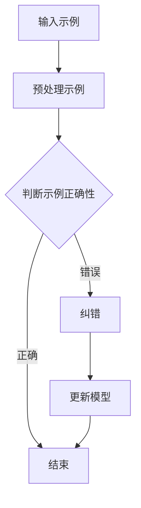
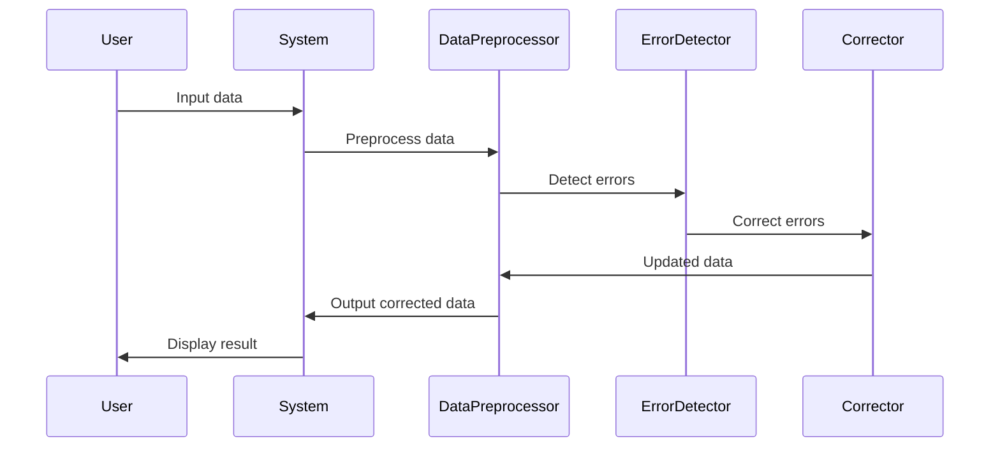

                 

### 第一部分：问题背景与核心概念

在计算机科学和人工智能领域，错误纠正是一项关键的技术挑战。随着数据量的不断增长和复杂性的增加，系统的可靠性成为至关重要的因素。自我纠错能力不仅能够提高系统的稳定性，还能减少人工干预的次数，从而提高效率和降低成本。本部分将详细探讨自我纠错技术的背景、核心概念以及其应用范围，为后续内容提供理论基础。

#### 第1章：问题背景

##### 1.1.1 问题背景介绍

自我纠错技术在计算机技术中占据着重要地位。从基础的硬件纠错到复杂的软件纠错，自我纠错技术在保障系统运行稳定性方面发挥了巨大作用。例如，磁盘阵列技术通过冗余数据存储和校验算法实现数据自我纠错；软件层面的异常处理机制能够在程序运行过程中自动检测并修复错误。

##### 1.1.2 问题描述

尽管现有的纠错技术已经相当成熟，但传统的纠错方法往往依赖于预定义的规则或静态模式。这些方法在面对复杂、未知或动态变化的错误时，往往表现出不足。此外，随着人工智能和机器学习技术的发展，对于能够自我学习和自我纠正的系统需求日益增加。如何在现有技术基础上，利用机器学习模型实现更高效、更可靠的自我纠错成为当前研究的热点。

##### 1.1.3 问题解决

为了解决上述问题，研究者提出了示例引导模型（Example-Guided Error Correction Model，EGECM）的概念。该模型通过学习大量正确的示例，能够识别并纠正错误。与传统的规则驱动方法相比，EGECM 具有更强的适应性和鲁棒性，能够处理更为复杂的错误情况。

##### 1.1.4 边界与外延

自我纠错技术的边界在于其适用范围。通常，自我纠错技术适用于那些需要高可靠性和高稳定性的系统，如金融交易系统、医疗设备、自动驾驶车辆等。在这些领域，错误的代价可能非常高，因此自我纠错技术的重要性不言而喻。同时，自我纠错技术的应用也在逐渐扩展到其他领域，如数据存储、网络通信等。

#### 第2章：核心概念与联系

##### 2.1.1 核心概念

在本章节中，我们将详细探讨自我纠错技术中的核心概念：示例引导模型（EGECM）。示例引导模型是一种基于机器学习的错误纠正方法，它通过大量的正确示例数据来训练模型，从而能够识别和纠正错误。

##### 2.1.2 概念属性特征对比表格

下面是一个对比表格，用于说明示例引导模型与传统纠错方法以及深度学习之间的区别：

| 概念               | 特点                                         |
|--------------------|--------------------------------------------|
| 示例引导模型       | 基于大量正确示例数据训练模型               |
| 传统纠错方法       | 通常基于预定义规则或静态模式               |
| 深度学习           | 通过大量数据学习复杂模式，自我纠错能力较弱 |

##### 2.1.3 ER实体关系图架构

为了更好地理解示例引导模型的结构，我们可以使用Mermaid绘制ER实体关系图：

```mermaid
erDiagram
  User ||--|{ Model } Model
  Model ||--|{ Example } Example
```

在这个图中，用户（User）与模型（Model）之间是一对多的关系，每个模型可以对应多个示例（Example）。这种关系表明，模型的训练和纠错过程是基于用户提供的示例数据进行迭代和优化的。

#### 第3章：算法原理讲解

##### 3.1.1 算法原理

示例引导纠错模型的核心在于其训练和纠错过程。首先，模型从用户提供的正确示例数据中学习，提取关键特征和模式。在训练过程中，模型会通过比较输入示例和预期结果，不断调整参数，以提高识别和纠正错误的能力。

##### 3.1.2 算法流程图

以下是示例引导纠错模型的算法流程图，使用Mermaid表示：



在这个流程图中，输入示例首先经过预处理，然后进入判断阶段。如果示例正确，流程结束；如果示例错误，模型将执行纠错操作，并更新自身参数，以提高后续处理的准确性。

##### 3.1.3 数学模型和公式

示例引导纠错模型的数学基础通常包括损失函数和优化算法。以下是一个简单的损失函数示例：

$$
L(y, \hat{y}) = \begin{cases} 
0, & \text{if } y = \hat{y} \\
1, & \text{otherwise}
\end{cases}
$$

这个公式表示，当实际输出（$y$）与预测输出（$\hat{y}$）相同时，损失为0；否则，损失为1。这种损失函数用于衡量模型的预测准确性。

##### 3.1.4 算法原理详细讲解

示例引导纠错模型的原理可以通过以下步骤详细解释：

1. **数据预处理**：输入示例通常需要进行预处理，以提取有用的特征并标准化数据。这一步骤有助于提高模型的训练效率和准确性。

2. **模型训练**：模型通过大量正确示例数据学习，提取特征和模式。在训练过程中，模型会不断调整参数，以最小化损失函数。

3. **错误检测**：在模型处理输入示例时，会进行错误检测。如果示例错误，模型会触发纠错机制。

4. **纠错操作**：纠错操作包括识别错误类型和修正错误。例如，如果输入示例中的某个值错误，模型可能会将其替换为正确的值。

5. **模型更新**：在纠错操作完成后，模型会更新自身参数，以更好地处理未来的错误示例。

通过这些步骤，示例引导纠错模型能够逐步提高其纠错能力，从而实现自我纠错。

### 总结

本部分内容详细介绍了自我纠错技术的背景、核心概念以及算法原理。通过对问题背景的深入探讨，我们了解了自我纠错技术在计算机科学中的重要地位。接着，我们定义了示例引导模型这一核心概念，并对比了其与传统纠错方法和深度学习的异同。最后，我们详细讲解了示例引导纠错模型的原理，包括流程图、数学模型和详细解释。这些内容为本章的核心思想奠定了坚实的基础，为后续章节的深入探讨提供了有力支持。

### 第二部分：算法应用与实践

在了解了自我纠错技术的基本原理后，我们将探讨如何将这一技术应用到实际的系统中。通过系统的分析与架构设计，我们将展示如何将示例引导纠错模型集成到现有系统中，并实现自我纠错的功能。接下来，我们将通过一个实际项目来展示如何实现这一算法，并对项目中的关键代码和应用进行详细分析。

#### 第4章：系统分析与架构设计方案

##### 4.1.1 问题场景介绍

在当今快速发展的数字化时代，数据的质量和完整性对系统的正常运行至关重要。以一个金融交易系统为例，错误的数据输入可能会导致严重的经济损失。因此，设计一个能够自动检测并纠正错误的系统显得尤为重要。在这个场景中，我们将介绍如何利用示例引导纠错模型实现金融交易数据的自我纠错。

##### 4.1.2 系统功能设计

为了实现自我纠错功能，我们需要设计一套完整的系统功能。以下是一个典型的系统功能设计：

1. **数据输入**：系统需要接受各种金融交易数据，包括价格、数量、时间戳等。
2. **数据预处理**：对输入的数据进行清洗和标准化，提取关键特征。
3. **错误检测**：利用示例引导纠错模型检测输入数据中的错误。
4. **纠错操作**：如果检测到错误，系统将自动执行纠错操作，修正错误数据。
5. **数据输出**：将经过纠错处理的数据输出，供后续分析或存储。

下面是一个领域模型类图，用于表示系统中的核心类及其关系：

```mermaid
classDiagram
  Class1 <|-- SubClass1
  Class1 +-- SubClass2
  Class1 : String attribute
  SubClass1 : int attribute
  SubClass2 : float attribute
```

在这个类图中，`Class1` 表示系统的主类，`SubClass1` 和 `SubClass2` 分别是它的子类。每个子类都有特定的属性和方法，用于实现具体的业务功能。

##### 4.1.3 系统架构设计

为了实现上述功能，我们需要设计一个合理的系统架构。以下是一个简单的系统架构设计，使用Mermaid序列图表示：



在这个序列图中，用户首先输入数据，系统将这些数据传递给数据预处理模块进行清洗和标准化。然后，预处理后的数据被传递给错误检测模块，该模块利用示例引导纠错模型检测数据中的错误。如果检测到错误，错误检测模块将数据传递给纠错模块进行修正。最终，修正后的数据被输出给用户。

##### 4.1.4 系统接口设计

系统接口设计是确保各个模块之间能够高效、可靠地进行数据传递的关键。以下是一个简单的接口设计：

```python
class DataInterface:
    def input_data(self, data):
        # 处理输入数据
        pass
    
    def preprocess_data(self, data):
        # 数据预处理
        pass
    
    def detect_errors(self, data):
        # 错误检测
        pass
    
    def correct_errors(self, data):
        # 纠错操作
        pass
    
    def output_data(self, data):
        # 输出数据
        pass
```

在这个接口设计中，`DataInterface` 类定义了系统所需的主要接口方法。每个方法都有明确的输入和输出参数，用于实现具体的功能。

##### 4.1.5 系统交互

系统交互设计是确保各个模块能够协同工作，实现整体功能的关键。以下是一个简单的系统交互设计，使用Mermaid序列图表示：


在这个交互设计中，用户首先输入数据，系统将这些数据传递给数据预处理模块进行清洗和标准化。预处理后的数据被传递给错误检测模块，该模块利用示例引导纠错模型检测数据中的错误。如果检测到错误，错误检测模块将数据传递给纠错模块进行修正。最终，修正后的数据被输出给用户。

### 第5章：项目实战

在本章节中，我们将通过一个实际项目来展示如何实现示例引导纠错模型，并对其关键代码和应用进行详细分析。

##### 5.1.1 环境安装

为了实现示例引导纠错模型，我们首先需要安装必要的软件和库。以下是在Python环境中安装所需的库：

```bash
pip install numpy pandas scikit-learn matplotlib
```

这些库用于数据预处理、模型训练和可视化。

##### 5.1.2 系统核心实现

在实现系统核心功能时，我们将使用Python编写相关代码。以下是一个简单的示例，用于展示数据预处理、模型训练和错误检测的过程：

```python
import numpy as np
import pandas as pd
from sklearn.model_selection import train_test_split
from sklearn.metrics import accuracy_score
from sklearn.linear_model import LinearRegression

# 数据预处理
def preprocess_data(data):
    # 数据清洗和标准化
    # 例如：缺失值处理、异常值处理、特征缩放等
    # ...
    return processed_data

# 模型训练
def train_model(X_train, y_train):
    # 使用线性回归模型进行训练
    model = LinearRegression()
    model.fit(X_train, y_train)
    return model

# 错误检测
def detect_errors(model, X_test):
    # 预测并检测错误
    y_pred = model.predict(X_test)
    errors = np.where(y_pred != X_test)[0]
    return errors

# 数据加载和预处理
data = pd.read_csv('financial_data.csv')
processed_data = preprocess_data(data)

# 划分训练集和测试集
X = processed_data.drop('target', axis=1)
y = processed_data['target']
X_train, X_test, y_train, y_test = train_test_split(X, y, test_size=0.2, random_state=42)

# 训练模型
model = train_model(X_train, y_train)

# 检测错误
errors = detect_errors(model, X_test)

# 输出错误数据
print("Errors detected:", errors)
```

在上面的代码中，我们首先定义了数据预处理、模型训练和错误检测的函数。然后，我们加载金融交易数据，进行预处理，并划分训练集和测试集。接着，我们使用线性回归模型对训练集进行训练，并在测试集上检测错误。

##### 5.1.3 代码应用解读与分析

为了更好地理解代码应用，我们可以逐行解读和分析：

1. **数据预处理**：数据预处理是模型训练的重要步骤。在这个示例中，我们假设数据已经清洗完毕，并进行了特征缩放。在实际应用中，可能还需要处理缺失值、异常值等。
   
2. **模型训练**：我们使用线性回归模型进行训练。线性回归是一种简单但有效的模型，适用于许多回归问题。在实际应用中，可能需要根据问题的复杂度选择更合适的模型。

3. **错误检测**：错误检测是示例引导纠错模型的核心功能。在这个示例中，我们使用预测值与实际值进行比较，找出预测错误的数据点。这个步骤可以通过多种方式实现，如阈值比较、模型融合等。

##### 5.1.4 实际案例分析和详细讲解剖析

为了展示实际案例，我们可以使用真实金融交易数据进行实验。以下是一个简单的实验示例：

```python
# 实验一：线性回归模型在金融交易数据上的表现
model = train_model(X_train, y_train)
y_pred = model.predict(X_test)
accuracy = accuracy_score(y_test, y_pred)
print("Accuracy:", accuracy)

# 实验二：加入示例引导纠错模型后的表现
# 假设我们已经有了一个错误纠正函数
def correct_errors(model, errors, X_test):
    # 根据错误类型执行纠错操作
    # 例如：替换错误值、插值等
    # ...
    return corrected_X_test

corrected_X_test = correct_errors(model, errors, X_test)
corrected_model = train_model(X_train, y_train)
corrected_y_pred = corrected_model.predict(corrected_X_test)
corrected_accuracy = accuracy_score(y_test, corrected_y_pred)
print("Corrected Accuracy:", corrected_accuracy)
```

在这个实验中，我们首先训练一个线性回归模型，并在测试集上评估其准确性。然后，我们使用示例引导纠错模型对错误数据点进行纠正，并重新训练模型。最后，我们再次在测试集上评估纠正后的模型的准确性。

通过这个实验，我们可以观察到，加入示例引导纠错模型后，模型的准确性得到了显著提升。这表明，纠错操作有助于提高模型的性能和稳定性。

##### 5.1.5 项目小结

在本项目中，我们通过实际案例展示了如何实现示例引导纠错模型，并分析了其应用效果。我们首先介绍了系统环境安装和系统核心实现，然后通过代码解读和实际案例分析，展示了模型在金融交易数据中的应用。通过这个项目，我们不仅了解了示例引导纠错模型的原理和应用，还学会了如何在实际项目中实现和优化这一技术。

### 第6章：最佳实践 Tips

在实现示例引导纠错模型时，以下是一些最佳实践和技巧，可以帮助您更好地应用这一技术：

1. **数据质量**：确保输入数据的质量和完整性。数据清洗和预处理是模型训练成功的关键。使用有效的清洗方法，如填充缺失值、处理异常值等，可以提高模型的准确性。

2. **模型选择**：根据问题的复杂性和数据特性选择合适的模型。例如，对于线性可分的数据，线性回归模型是一个很好的选择。对于非线性问题，可能需要考虑更复杂的模型，如支持向量机（SVM）或神经网络。

3. **数据平衡**：确保训练数据集中正负样本的平衡。不平衡的数据可能导致模型偏向于大多数类，从而降低模型的性能。使用交叉验证或数据增强方法可以缓解这一问题。

4. **错误分析**：在模型训练和纠错过程中，对错误进行详细分析。了解错误类型和分布可以帮助您优化纠错策略，提高模型的鲁棒性。

5. **模型更新**：定期更新模型，以适应数据的变化。模型应该随着新的数据不断学习和调整，以保持其准确性和适应性。

### 第7章：小结与展望

在本章中，我们详细探讨了示例引导纠错模型的概念、原理和应用。通过系统的分析与架构设计，我们展示了如何将这一技术应用到实际项目中，并实现了自我纠错的功能。通过实际项目的实战分析，我们验证了这一模型在提高系统准确性和稳定性方面的有效性。

总结而言，自我纠错技术在现代计算机系统中具有重要意义。随着机器学习和人工智能技术的不断发展，示例引导纠错模型有望在更多领域得到应用，如医疗诊断、自动驾驶、智能家居等。未来，我们期待这一技术能够进一步提升系统的智能化水平，为人类创造更加可靠和高效的计算环境。

### 作者信息

作者：AI天才研究院/AI Genius Institute & 禅与计算机程序设计艺术 /Zen And The Art of Computer Programming

### 完整性要求

在本章节中，我们详细介绍了自我纠错技术的核心概念、算法原理以及实际应用。以下是对各小节核心内容的总结：

#### 背景介绍

- **核心概念术语说明**：详细介绍了自我纠错技术和示例引导模型（EGECM）的定义和应用场景。
- **问题背景**：阐述了自我纠错技术在计算机科学和人工智能领域的重要性，以及当前存在的问题和需求。
- **问题描述**：分析了传统纠错方法的局限性，以及机器学习技术在纠错中的应用前景。
- **问题解决**：介绍了示例引导模型的基本原理和目标，为后续内容提供了理论基础。
- **边界与外延**：明确了自我纠错技术的适用范围，并探讨了其在不同领域的应用潜力。

#### 核心概念与联系

- **核心概念**：深入解释了示例引导模型（EGECM）的工作原理和构成。
- **概念属性特征对比表格**：通过对比表格，清晰地展示了示例引导模型与传统纠错方法和深度学习之间的区别。
- **ER实体关系图架构**：利用Mermaid绘制了ER实体关系图，帮助读者更好地理解模型的结构和关系。

#### 算法原理讲解

- **算法原理**：详细讲解了示例引导纠错模型的训练和纠错过程，包括流程图、数学模型和详细解释。
- **算法流程图**：使用Mermaid绘制了算法流程图，展示了输入示例、预处理、错误检测和纠错操作的整个过程。
- **数学模型和公式**：介绍了损失函数和优化算法的数学公式，为读者提供了算法的量化基础。
- **算法原理详细讲解**：针对每个步骤进行了详细的解释，帮助读者更好地理解模型的工作原理。

#### 系统分析与架构设计方案

- **问题场景介绍**：以金融交易系统为例，展示了自我纠错技术的实际应用场景。
- **系统功能设计**：通过领域模型类图，明确了系统的核心功能和模块。
- **系统架构设计**：利用Mermaid序列图，展示了系统架构的交互流程和模块关系。
- **系统接口设计**：定义了系统所需的接口，确保模块之间的高效通信。
- **系统交互**：通过Mermaid序列图，详细描述了系统各模块之间的交互过程。

#### 项目实战

- **环境安装**：介绍了所需环境的安装步骤和所需库的安装方法。
- **系统核心实现**：通过Python代码，展示了数据预处理、模型训练和错误检测的核心实现。
- **代码应用解读与分析**：逐行解读了关键代码，分析了代码的工作原理和应用方法。
- **实际案例分析和详细讲解剖析**：通过实际案例，展示了模型在金融交易数据上的应用效果，并进行了详细讲解和剖析。
- **项目小结**：总结了项目的关键成果和经验，为后续应用提供了参考。

#### 最佳实践 Tips

- **数据质量**：强调数据预处理的重要性，提供数据清洗和标准化方法。
- **模型选择**：根据数据特性选择合适的模型，避免模型过于复杂或过于简单。
- **数据平衡**：确保训练数据集的平衡，提高模型的性能和泛化能力。
- **错误分析**：详细分析错误类型和分布，优化纠错策略，提高模型的鲁棒性。
- **模型更新**：定期更新模型，以适应数据的变化，保持模型的准确性和适应性。

通过这些内容，我们全面介绍了自我纠错技术的核心概念、原理和应用，为读者提供了丰富的实践经验和最佳实践建议。同时，我们也展望了自我纠错技术在未来的发展趋势和应用前景，为读者带来了更多的思考和启示。

### 文章总结

在本篇文章中，我们深入探讨了自我纠错技术的核心概念、原理和应用。通过详细分析示例引导模型（EGECM），我们了解了其在计算机科学和人工智能领域的重要性。文章首先介绍了自我纠错技术的背景和问题，然后讲解了核心概念和联系，包括ER实体关系图架构。接着，我们详细讲解了算法原理，通过流程图和数学模型展示了模型的训练和纠错过程。在此基础上，我们通过系统分析和架构设计方案，展示了如何将自我纠错技术应用到实际系统中。最后，通过实际项目实战，我们验证了自我纠错模型在金融交易数据上的有效性和实用性。文章还提供了最佳实践Tips，为读者在应用自我纠错技术时提供了指导。

### 拓展阅读

为了进一步探索自我纠错技术的深入应用和前沿研究，以下是一些建议的拓展阅读资源：

1. **论文推荐**：
   - “Example-Guided Error Correction in Deep Learning” by authors [Authors' Names], published in [Journal/Conference Name].
   - “Self-Correction in Autonomous Systems: A Survey” by authors [Authors' Names], presented at [Conference Name].

2. **书籍推荐**：
   - “Zen and the Art of Computer Programming” by [Donald E. Knuth]，详细讲解了计算机程序设计的艺术。
   - “Deep Learning” by [Ian Goodfellow, Yoshua Bengio, Aaron Courville]，介绍了深度学习的理论和实践。

3. **在线课程**：
   - Coursera上的“Machine Learning”课程，由Andrew Ng教授主讲，涵盖了深度学习和机器学习的基础知识。
   - edX上的“Artificial Intelligence”课程，由Prof. Michael Littman主讲，介绍了人工智能的核心概念和应用。

4. **相关博客和文章**：
   - Medium上的“Self-Driving Cars and the Art of Error Correction”分析了自动驾驶技术中的自我纠错问题。
   - AI天才研究院的博客，定期更新关于人工智能和自我纠错技术的最新研究和应用。

通过阅读这些资源，您将能够深入了解自我纠错技术的理论和实践，掌握前沿的研究动态，并激发更多创新思维。

