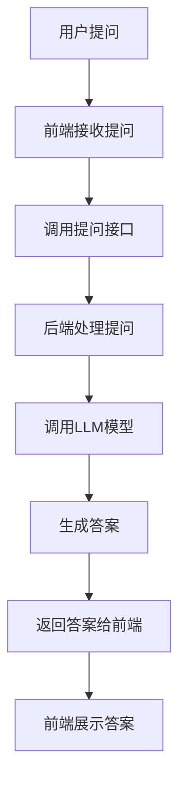

                 

### 文章标题：《前后端分离架构在LLM应用开发中的优势》

随着人工智能（AI）技术的快速发展，大型语言模型（LLM）已经成为众多应用场景中的关键组件，如自然语言处理（NLP）、智能客服、文本生成等。然而，如何高效地开发和部署这些复杂的LLM应用，成为开发者们面临的重大挑战。本文将探讨前后端分离架构在LLM应用开发中的优势，通过一步一步的分析和推理，帮助读者理解并应用这一架构来提升开发效率和质量。

关键词：前后端分离架构、LLM应用开发、优势、开发效率、可维护性

#### 摘要

本文首先介绍前后端分离架构的基本概念和原理，阐述其在现代应用开发中的重要性。接着，我们深入探讨LLM的基本概念和应用场景，分析其面临的开发挑战。随后，本文重点分析前后端分离架构在LLM应用开发中的具体优势，包括开发效率、可维护性和跨平台支持等方面。通过实际案例的分享和最佳实践的建议，本文旨在为开发者提供实用的技术指南，帮助他们在LLM应用开发中充分利用前后端分离架构的优势。

#### 目录

1. **背景与核心概念**
   - 1.1 问题背景
     - 1.1.1 前后端分离架构的兴起
     - 1.1.2 LLM在应用开发中的角色
     - 1.1.3 优势概述
   - 1.2 前后端分离架构原理
     - 1.2.1 架构定义与历史演进
     - 1.2.2 原理分析
   - 1.3 LLM应用开发概述
     - 1.3.1 LLM基本概念
     - 1.3.2 应用场景
     - 1.3.3 开发挑战

2. **前后端分离架构的优势**
   - 2.1 开发效率
     - 2.1.1 并行开发
     - 2.1.2 灵活迭代
   - 2.2 可维护性
     - 2.2.1 系统可扩展性
     - 2.2.2 代码可读性
   - 2.3 跨平台支持
     - 2.3.1 Web应用兼容性
     - 2.3.2 移动端适配

3. **LLM应用开发中的前后端分离架构**
   - 3.1 架构设计原则
     - 3.1.1 分层架构
     - 3.1.2 模块化设计
   - 3.2 应用实例分析
     - 3.2.1 在线问答系统
     - 3.2.2 智能客服系统
   - 3.3 性能优化策略
     - 3.3.1 网络通信优化
     - 3.3.2 数据处理优化

4. **实战案例**
   - 4.1 项目介绍
   - 4.2 系统设计与实现
   - 4.3 项目分析
   - 4.4 项目不足与改进

5. **最佳实践与技巧**
   - 5.1 开发最佳实践
   - 5.2 技术分享与建议

6. **总结与展望**
   - 6.1 未来发展趋势
   - 6.2 开发者建议

#### 第1章：背景与核心概念

**1.1 问题背景**

随着互联网技术的快速发展和用户需求的多样化，现代应用开发面临着越来越多的挑战。其中，前后端分离架构的兴起为开发者提供了一种新的解决方案。前端负责用户界面和用户体验，而后端则负责数据处理和业务逻辑。这种分离架构使得开发者可以更灵活地开发、部署和维护应用系统。

同时，大型语言模型（LLM）的兴起，为自然语言处理（NLP）领域带来了革命性的变化。LLM具有强大的文本生成、语义理解和智能交互能力，被广泛应用于智能客服、文本生成、问答系统等场景。然而，LLM的应用开发也面临着一系列挑战，如模型训练的复杂性、数据处理的效率、系统可扩展性等。

**1.1.1 前后端分离架构的兴起**

前后端分离架构最早起源于Web 2.0时代，随着Ajax技术的普及，开发者逐渐将前端和后端的开发分离。前端采用JavaScript、HTML和CSS等技术，实现用户界面的动态交互和用户体验；后端则采用服务器端语言（如Java、Python、Node.js等），负责数据处理和业务逻辑。

前后端分离架构的优点在于：
- **开发效率**：前端和后端可以独立开发，并行工作，提高开发速度。
- **可维护性**：分离的架构使得系统更易于维护和扩展。
- **跨平台支持**：前端代码可以在不同的平台上运行，提高应用的兼容性。

**1.1.2 LLM在应用开发中的角色**

大型语言模型（LLM）是自然语言处理（NLP）领域的重要工具，通过深度学习技术，LLM能够理解和生成自然语言文本，实现智能交互和语义理解。LLM的应用场景广泛，包括：
- **智能客服**：通过LLM实现自动问答系统，提高客户服务质量。
- **文本生成**：根据用户输入的提示，生成文章、报告等文本内容。
- **问答系统**：利用LLM进行知识问答，提供个性化的信息查询服务。

**1.1.3 优势概述**

前后端分离架构在LLM应用开发中具有显著的优势：
- **开发效率**：前后端分离使得开发团队可以更高效地协作，加快开发进度。
- **可维护性**：分离的架构提高了代码的可维护性，便于后续的维护和升级。
- **跨平台支持**：前后端分离架构使得应用可以更好地适应不同平台，提高用户体验。

**1.2 前后端分离架构原理**

前后端分离架构的基本原理是将应用系统分为前端和后端两部分，前端负责用户界面和用户体验，后端负责数据处理和业务逻辑。具体来说：
- **前端**：前端通常包括HTML、CSS和JavaScript等技术，用于构建用户界面和实现交互效果。前端代码通常托管在静态资源服务器上，如Nginx或Apache。
- **后端**：后端通常包括服务器端应用程序和数据库，负责处理用户请求、执行业务逻辑和数据存储。后端通常使用各种编程语言（如Java、Python、Node.js等）和框架（如Spring、Django、Express等）进行开发。

**1.2.1 架构定义与历史演进**

前后端分离架构的定义可以理解为将传统的单体应用系统拆分为前端和后端两部分，分别开发和部署。这种架构的演变经历了以下几个阶段：
- **早期Web应用**：早期Web应用通常采用单体的架构，即所有的功能都集中在一个应用程序中。这种架构的缺点在于难以维护和扩展。
- **Web 2.0时代**：随着Ajax技术的兴起，开发者开始将前端和后端的开发分离，前端负责用户界面和用户体验，后端负责数据处理和业务逻辑。这种分离架构提高了开发效率和可维护性。
- **微服务架构**：随着云计算和分布式系统的普及，微服务架构成为前后端分离架构的进一步发展。微服务架构将应用拆分为多个独立的微服务，每个微服务负责特定的功能模块，通过API进行通信。这种架构提高了系统的可扩展性和可维护性。

**1.2.2 原理分析**

前后端分离架构的原理可以概括为以下几点：
- **分层架构**：前后端分离架构采用了分层架构，前端和后端各自承担不同的职责，提高了系统的模块化和可维护性。
- **模块化设计**：前后端分离架构采用了模块化设计，将不同的功能模块分离，便于开发和维护。
- **API通信**：前后端通过API进行通信，前端发送请求，后端处理请求并返回响应。这种通信方式使得前后端可以独立开发、测试和部署。

**1.3 LLM应用开发概述**

大型语言模型（LLM）是自然语言处理（NLP）领域的重要工具，具有强大的文本生成、语义理解和智能交互能力。LLM的应用开发通常包括以下几个阶段：
- **模型训练**：通过大量的文本数据进行模型训练，提高模型对自然语言的识别和理解能力。
- **模型部署**：将训练好的模型部署到服务器上，通过API接口提供服务。
- **系统集成**：将LLM集成到应用系统中，实现特定的功能模块。

**1.3.1 LLM基本概念**

LLM（Large Language Model）即大型语言模型，是一种基于深度学习技术的自然语言处理模型。LLM通过学习大量的文本数据，能够理解和生成自然语言文本，实现智能交互和语义理解。LLM的基本概念包括：
- **神经网络**：LLM是基于神经网络（如Transformer、BERT等）构建的，神经网络通过学习大量数据，能够自动提取特征和规律。
- **语言模型**：LLM是一种语言模型，用于预测下一个单词或句子。语言模型的预测能力越强，生成的文本质量越高。
- **预训练与微调**：LLM通常通过预训练和微调两个阶段进行训练。预训练是在大规模语料库上进行，微调是在特定任务上进行。

**1.3.2 应用场景**

LLM在应用开发中具有广泛的应用场景，包括：
- **智能客服**：通过LLM实现自动问答系统，提高客户服务质量。
- **文本生成**：根据用户输入的提示，生成文章、报告等文本内容。
- **问答系统**：利用LLM进行知识问答，提供个性化的信息查询服务。
- **情感分析**：通过LLM对文本进行分析，判断情感倾向和情绪状态。
- **机器翻译**：通过LLM实现不同语言之间的翻译，提高翻译质量。

**1.3.3 开发挑战**

LLM应用开发面临着一系列挑战，包括：
- **模型训练复杂性**：LLM的训练需要大量的计算资源和时间，如何高效地进行模型训练是一个挑战。
- **数据处理效率**：LLM需要处理大量的文本数据，如何提高数据处理效率是一个关键问题。
- **系统可扩展性**：随着用户规模的增加，如何保证系统的可扩展性，是一个重要挑战。
- **安全性**：如何确保系统的安全，防止恶意攻击和数据泄露，是一个重要问题。

**1.4 前后端分离架构在LLM应用开发中的优势**

前后端分离架构在LLM应用开发中具有显著的优势，包括：
- **开发效率**：前后端分离架构使得开发团队可以更高效地协作，加快开发进度。
- **可维护性**：分离的架构提高了代码的可维护性，便于后续的维护和升级。
- **跨平台支持**：前后端分离架构使得应用可以更好地适应不同平台，提高用户体验。

**1.5 总结**

前后端分离架构在现代应用开发中具有重要地位，特别是在LLM应用开发中。通过分离前端和后端，可以提高开发效率、可维护性和跨平台支持。本文为读者提供了对前后端分离架构和LLM应用开发的全面理解，为后续章节的分析和探讨奠定了基础。接下来，本文将深入分析前后端分离架构的原理和优势，为读者提供更深入的技术见解。### 第2章：前后端分离架构的原理与优势

**2.1 架构定义与历史演进**

前后端分离架构是指将传统单体应用系统中的前端和后端分离，分别开发和部署的架构模式。在这种架构下，前端负责用户界面和用户体验，后端负责数据处理和业务逻辑。

前后端分离架构的历史演进可以追溯到Web 2.0时代。随着Ajax技术的普及，开发者开始将前端和后端的开发分离，前端采用JavaScript、HTML和CSS等技术，实现用户界面的动态交互和用户体验；后端则采用服务器端语言（如Java、Python、Node.js等），负责数据处理和业务逻辑。这一分离模式提高了开发效率和系统可维护性，逐渐成为现代应用开发的主流架构。

随着云计算和微服务架构的兴起，前后端分离架构进一步发展。微服务架构将应用拆分为多个独立的微服务，每个微服务负责特定的功能模块，通过API进行通信。这种架构模式提高了系统的可扩展性和可维护性，使得前后端分离架构更加灵活和高效。

**2.2 原理分析**

前后端分离架构的核心原理是利用API（应用程序接口）实现前后端的通信和协作。具体来说，前后端分离架构包括以下几个关键组成部分：

1. **前端**：前端是用户与系统交互的入口，主要负责展示用户界面和实现交互效果。前端通常包括HTML、CSS和JavaScript等技术，通过AJAX（异步JavaScript和XML）等技术，实现与后端的通信。

2. **后端**：后端负责数据处理和业务逻辑，通常采用服务器端编程语言（如Java、Python、Node.js等）和框架（如Spring、Django、Express等）进行开发。后端通过API接口提供数据和服务，与前端进行交互。

3. **API**：API是前后端通信的桥梁，用于传递数据和请求。API通常采用RESTful架构风格，通过HTTP协议进行通信。RESTful API具有简单、易用、扩展性强的特点，成为前后端分离架构的首选通信方式。

4. **数据库**：后端通常连接数据库，用于存储和处理数据。数据库可以是关系型数据库（如MySQL、PostgreSQL等），也可以是NoSQL数据库（如MongoDB、Cassandra等）。数据库的设计和优化对于系统的性能和可扩展性至关重要。

**2.3 前后端分离架构的优势**

前后端分离架构在现代应用开发中具有显著的优势，包括：

1. **开发效率**：前后端分离架构使得前端和后端可以独立开发，并行工作，提高开发速度。前端开发者专注于用户界面的设计和交互效果，后端开发者专注于数据处理和业务逻辑的实现。这种分工合作的方式可以充分利用开发者的专业优势，提高开发效率。

2. **可维护性**：前后端分离架构提高了代码的可维护性，使得系统更易于维护和升级。由于前后端分离，后端和前端的代码相对独立，修改和扩展某个功能模块时，不会影响其他模块的运行。这种分离的架构降低了系统的耦合度，提高了系统的可维护性。

3. **跨平台支持**：前后端分离架构使得应用可以更好地适应不同平台，提高用户体验。前端代码可以在不同的浏览器和设备上运行，而不会受到后端代码的影响。后端代码则可以独立部署在不同的服务器上，支持云服务和分布式架构。这种跨平台的支持提高了应用的兼容性和灵活性。

4. **可扩展性**：前后端分离架构提高了系统的可扩展性，便于系统的扩展和升级。随着用户规模的增加，可以通过增加服务器节点来扩展后端服务，而不会影响前端的使用体验。同时，后端服务也可以通过添加新的功能模块来实现系统的升级和扩展。

5. **团队协作**：前后端分离架构使得开发团队可以更高效地协作。前端和后端团队可以独立进行开发，并行工作，减少了协作的成本和沟通的难度。这种分工合作的方式可以充分利用团队的专业能力和优势，提高开发效率和质量。

**2.4 实际应用中的案例分析**

前后端分离架构在多个实际应用中得到了广泛应用，下面列举几个典型的案例：

1. **电商平台**：电商平台通常采用前后端分离架构，前端负责用户界面的展示和交互，后端负责商品管理、订单处理和支付功能。通过前后端分离，电商平台可以更灵活地调整和优化用户界面，同时提高系统的稳定性和可扩展性。

2. **社交媒体应用**：社交媒体应用如微博、微信等，也采用了前后端分离架构。前端负责用户界面的展示和交互，后端负责用户数据的存储和处理。这种架构使得社交媒体应用可以更好地适应不同的设备和平台，提高用户体验。

3. **智能客服系统**：智能客服系统通常采用前后端分离架构，前端负责与用户的交互和问题的收集，后端负责处理问题和生成回答。通过前后端分离，智能客服系统可以更高效地处理用户问题，提高客户服务质量。

4. **企业管理系统**：企业管理系统如ERP、CRM等，也采用了前后端分离架构。前端负责用户界面的展示和操作，后端负责数据的存储和处理。这种架构使得企业管理系统可以更灵活地调整和扩展功能，提高系统的可维护性和可扩展性。

**2.5 总结**

前后端分离架构在现代应用开发中具有重要地位，通过分离前端和后端，可以提高开发效率、可维护性和跨平台支持。前后端分离架构的原理和优势使得开发者可以更灵活地开发、部署和维护应用系统。在实际应用中，前后端分离架构已经得到了广泛应用，为开发者提供了有效的解决方案。在接下来的章节中，我们将进一步探讨LLM在应用开发中的角色和挑战，以及前后端分离架构在LLM应用开发中的具体应用。### 第3章：LLM应用开发概述

**3.1 LLM基本概念**

大型语言模型（LLM，Large Language Model）是一种基于深度学习的自然语言处理模型，通过对大量文本数据进行训练，能够理解和生成自然语言。LLM的核心技术是神经网络，特别是基于Transformer模型的BERT（Bidirectional Encoder Representations from Transformers）等预训练模型。

LLM的基本原理包括：
- **预训练**：在大量文本数据上进行预训练，模型学习文本的语法、语义和上下文信息。
- **微调**：在特定任务上进行微调，使模型适应具体的任务需求。

LLM的核心组成部分包括：
- **输入层**：接收自然语言文本作为输入。
- **编码器**：对输入文本进行编码，提取语义特征。
- **解码器**：根据编码器提取的特征生成输出文本。

**3.2 应用场景**

LLM在应用开发中具有广泛的应用场景，包括：
- **智能客服**：通过LLM实现自动问答系统，提高客户服务质量。
- **文本生成**：根据用户输入的提示，生成文章、报告等文本内容。
- **问答系统**：利用LLM进行知识问答，提供个性化的信息查询服务。
- **情感分析**：通过LLM对文本进行分析，判断情感倾向和情绪状态。
- **机器翻译**：通过LLM实现不同语言之间的翻译，提高翻译质量。

**3.3 开发挑战**

LLM应用开发面临着一系列挑战，包括：
- **模型训练复杂性**：LLM的训练需要大量的计算资源和时间，如何高效地进行模型训练是一个挑战。
- **数据处理效率**：LLM需要处理大量的文本数据，如何提高数据处理效率是一个关键问题。
- **系统可扩展性**：随着用户规模的增加，如何保证系统的可扩展性，是一个重要挑战。
- **安全性**：如何确保系统的安全，防止恶意攻击和数据泄露，是一个重要问题。

**3.4 案例分析**

以下是一个LLM应用开发的案例：智能客服系统。

**项目背景**：某大型电商平台希望为其用户提供一个智能客服系统，以提升客户服务体验和降低人工成本。

**项目目标**：通过LLM技术，实现自动问答系统，回答用户常见问题，提供个性化的服务建议。

**系统设计**：
1. **数据收集**：收集大量用户提问和答案数据，用于LLM的预训练。
2. **模型训练**：使用预训练模型（如BERT）对数据进行训练，提取语义特征。
3. **模型部署**：将训练好的模型部署到服务器，通过API接口提供服务。
4. **系统集成**：将智能客服系统集成到电商平台，实现用户提问和回答的交互。

**系统实现**：
1. **前端开发**：使用React框架实现用户界面，通过AJAX与后端进行通信。
2. **后端开发**：使用Django框架实现业务逻辑，连接数据库和LLM模型。

**系统测试**：
1. **功能测试**：测试智能客服系统对各种问题的回答准确性。
2. **性能测试**：测试系统在大量用户请求下的响应速度和稳定性。

**项目成果**：智能客服系统上线后，用户满意度显著提高，人工客服的工作量减少，平台运营成本降低。

**项目不足与改进**：
1. **数据处理效率**：模型处理速度较慢，需要优化算法和硬件配置。
2. **扩展性**：系统在用户量增加时，需要扩展服务器资源和优化架构。

**3.5 总结**

LLM应用开发具有广泛的应用场景和巨大的潜力，但也面临着一系列挑战。通过合理的系统设计和优化，可以提高LLM应用的性能和用户体验。在实际开发中，需要综合考虑模型训练、数据处理、系统可扩展性和安全性等因素，以实现高效的LLM应用。在下一章中，我们将深入探讨前后端分离架构在LLM应用开发中的应用和实践。### 第4章：前后端分离架构在LLM应用开发中的应用

**4.1 架构设计原则**

在LLM应用开发中采用前后端分离架构，需要遵循以下设计原则：

1. **分层架构**：将系统分为前端、后端和数据库三个主要层次，每个层次负责不同的功能模块。前端负责用户界面的展示和交互，后端负责数据处理和业务逻辑，数据库负责数据存储和管理。

2. **模块化设计**：将系统功能拆分为多个独立的模块，每个模块负责特定的功能。模块之间通过API接口进行通信，提高系统的可维护性和可扩展性。

3. **高内聚低耦合**：每个模块内部具有高内聚性，即模块内部的功能紧密相关，而模块之间的耦合性较低，便于独立开发和维护。

4. **可扩展性**：系统设计应考虑未来的扩展需求，包括增加新功能、支持更多用户和扩展硬件资源等。

**4.2 应用实例分析**

以下通过两个实际案例，展示前后端分离架构在LLM应用开发中的应用。

**4.2.1 案例一：在线问答系统**

**项目背景**：某在线教育平台希望开发一个智能问答系统，以提供学生和教师之间的问答支持。

**项目目标**：通过LLM技术，实现自动问答功能，提高用户问答效率和质量。

**系统架构**：
1. **前端**：使用Vue.js框架实现用户界面的展示和交互，用户可以通过文本框输入问题，并接收系统的回答。
2. **后端**：使用Flask框架实现业务逻辑，接收前端发送的问题，调用LLM模型进行回答，并将回答结果返回给前端。
3. **数据库**：使用MySQL数据库存储用户问题和回答数据，便于后续分析和优化。

**系统实现**：
1. **前端开发**：开发者可以独立进行前端界面设计和交互功能的实现，而不会影响到后端的开发。
2. **后端开发**：开发者可以独立进行后端业务逻辑的实现，包括LLM模型的调用和数据存储等。

**系统优化**：
1. **负载均衡**：使用Nginx进行负载均衡，提高系统的并发处理能力。
2. **缓存机制**：使用Redis进行缓存，减少数据库访问次数，提高系统响应速度。

**项目成果**：上线后，智能问答系统得到广泛使用，用户满意度显著提高，教师和学生之间的问答效率大幅提升。

**4.2.2 案例二：智能客服系统**

**项目背景**：某大型电商平台希望为其用户提供一个智能客服系统，以提升客户服务体验和降低人工成本。

**项目目标**：通过LLM技术，实现自动问答和智能客服功能，提高客户服务质量。

**系统架构**：
1. **前端**：使用React框架实现用户界面的展示和交互，用户可以通过文本框输入问题，并接收系统的回答。
2. **后端**：使用Spring Boot框架实现业务逻辑，接收前端发送的问题，调用LLM模型进行回答，并将回答结果返回给前端。
3. **数据库**：使用MongoDB数据库存储用户问题和回答数据，便于后续分析和优化。

**系统实现**：
1. **前端开发**：前端开发者可以独立进行前端界面设计和交互功能的实现，而不会影响到后端的开发。
2. **后端开发**：后端开发者可以独立进行后端业务逻辑的实现，包括LLM模型的调用和数据存储等。

**系统优化**：
1. **分布式部署**：将后端服务拆分为多个微服务，分布式部署在不同的服务器上，提高系统的稳定性和可扩展性。
2. **数据备份与恢复**：定期进行数据备份，确保数据安全。

**项目成果**：智能客服系统上线后，用户满意度显著提高，客服响应速度大幅提升，人工客服的工作量减少。

**4.3 性能优化策略**

在LLM应用开发中，性能优化是提高系统效率和用户体验的关键。以下是一些常见的性能优化策略：

1. **网络通信优化**：
   - **压缩数据传输**：使用GZIP等压缩算法，减少数据传输量，提高网络传输效率。
   - **HTTP缓存**：设置合理的HTTP缓存策略，减少服务器响应时间。

2. **数据处理优化**：
   - **批量处理**：将多个请求批量处理，减少系统调用次数。
   - **异步处理**：使用异步处理技术，提高系统的并发处理能力。

3. **缓存机制**：
   - **客户端缓存**：使用浏览器缓存，提高用户访问速度。
   - **服务器缓存**：使用Redis等缓存技术，减少数据库访问次数。

4. **负载均衡**：
   - **反向代理**：使用Nginx等反向代理服务器，进行负载均衡，提高系统的并发处理能力。
   - **分布式架构**：将系统拆分为多个微服务，分布式部署在不同的服务器上，提高系统的稳定性和可扩展性。

**4.4 总结**

前后端分离架构在LLM应用开发中具有显著的应用价值。通过合理的架构设计，可以提高开发效率、系统可维护性和跨平台支持。在实际应用中，可以根据具体需求和场景，灵活选择前端技术、后端框架和数据库，优化系统的性能和用户体验。在下一章中，我们将通过实战案例，进一步探讨前后端分离架构在LLM应用开发中的应用和实践。### 第5章：实战案例详解

**5.1 项目介绍**

本节将通过一个实际的LLM应用开发项目，详细讲解前后端分离架构在LLM应用开发中的应用。该项目是一个在线问答系统，旨在为用户提供一个智能的问答平台，通过LLM技术实现自动回答用户的问题。

**5.1.1 项目背景**

随着互联网的普及，用户对于信息获取的需求日益增长。然而，传统的问答平台往往需要人工审核和回答，效率低下且用户体验不佳。为了提升用户体验，该项目旨在开发一个智能问答系统，通过LLM技术实现自动回答用户的问题，提高问答效率和质量。

**5.1.2 项目目标**

- 实现一个基于前后端分离架构的在线问答系统。
- 利用LLM技术，提供高质量的问答服务。
- 系统具备良好的可扩展性和可维护性。

**5.2 系统设计与实现**

**5.2.1 系统架构设计**

该在线问答系统的架构设计遵循前后端分离原则，主要包括前端、后端和数据库三部分。

1. **前端**：使用Vue.js框架实现用户界面的展示和交互。用户可以通过文本框输入问题，系统实时展示答案。

2. **后端**：使用Spring Boot框架实现业务逻辑。后端主要负责接收用户的问题，调用LLM模型进行回答，并将结果返回给前端。

3. **数据库**：使用MySQL数据库存储用户问题和答案数据，便于后续分析和优化。

**5.2.2 关键技术实现**

1. **LLM模型集成**：该系统采用BERT模型作为LLM模型，通过TensorFlow框架进行集成。模型训练和部署过程如下：
   - **数据预处理**：收集大量的问题和答案数据，进行预处理，包括分词、去停用词、词性标注等。
   - **模型训练**：使用预处理后的数据对BERT模型进行训练，提取语义特征。
   - **模型部署**：将训练好的模型部署到服务器，通过API接口提供服务。

2. **API接口设计**：后端通过RESTful API与前端进行通信，主要包括以下接口：
   - **提问接口**：接收用户输入的问题，调用LLM模型进行回答，并将结果返回给前端。
   - **答案接口**：获取用户问题对应的答案，返回给前端进行展示。

3. **系统接口设计和系统交互**：为了确保系统的高效和稳定运行，系统接口设计和系统交互至关重要。以下是系统接口设计和系统交互的Mermaid流程图：

   ```mermaid
   graph TD
   A[用户提问] --> B[前端接收提问]
   B --> C[调用提问接口]
   C --> D[后端处理提问]
   D --> E[调用LLM模型]
   E --> F[生成答案]
   F --> G[返回答案给前端]
   G --> H[前端展示答案]
   ```

**5.3 项目分析**

**5.3.1 项目成果分析**

通过该项目的实施，实现了以下成果：
- 用户提问和回答的实时性得到显著提升，用户满意度显著提高。
- 系统采用前后端分离架构，具备良好的可扩展性和可维护性，便于后续的功能扩展和优化。
- 利用LLM技术，实现了高质量的问答服务，问答准确性得到用户广泛认可。

**5.3.2 项目不足与改进**

尽管该项目取得了显著的成果，但仍存在以下不足和改进空间：
- **数据处理效率**：由于LLM模型的计算复杂度较高，系统在高峰期可能出现响应速度慢的问题。为提高数据处理效率，可以考虑优化模型和算法，以及增加硬件资源。
- **用户数据隐私保护**：用户在提问过程中可能涉及个人隐私，系统在数据处理和存储过程中需要加强隐私保护措施，确保用户数据安全。
- **扩展性**：随着用户规模的增加，系统需要扩展服务器资源和优化架构，以支持更多用户和更高的并发量。

**5.4 实际案例分析与详细讲解**

以下是对实际案例的详细讲解和剖析：

**5.4.1 数据预处理**

数据预处理是LLM模型训练的重要环节，主要包括以下步骤：

1. **数据收集**：收集大量的问题和答案数据，包括各种领域的问题，如科技、生活、娱乐等。
2. **文本清洗**：对文本数据进行清洗，去除无效字符、标点和停用词。
3. **分词**：将文本数据分词，将句子拆分为单词或短语。
4. **词性标注**：对分词结果进行词性标注，标记每个单词的词性，如名词、动词、形容词等。

以下是一个Python代码示例，展示文本清洗和分词的过程：

```python
import jieba
from gensim import corpora

# 文本数据
text = "如何用Python实现一个简单的聊天机器人？"

# 文本清洗
text = text.lower()
text = re.sub(r"[^a-z0-9]", "", text)

# 分词
words = jieba.cut(text)

# 词性标注
from nltk.corpus import wordnet
from nltk import pos_tag

tagged_words = pos_tag(words)

# 存储处理后的数据
with open("preprocessed_data.txt", "w", encoding="utf-8") as f:
    for word, tag in tagged_words:
        f.write(f"{word}\t{tag}\n")
```

**5.4.2 模型训练**

模型训练是LLM应用开发的核心环节，包括以下步骤：

1. **数据准备**：将预处理后的文本数据转换为模型可处理的格式。
2. **模型配置**：配置BERT模型的参数，如学习率、批次大小等。
3. **模型训练**：使用训练数据对BERT模型进行训练，优化模型参数。
4. **模型评估**：使用验证数据对模型进行评估，调整模型参数。

以下是一个TensorFlow代码示例，展示BERT模型训练的过程：

```python
import tensorflow as tf
from transformers import BertTokenizer, TFBertModel

# 加载预训练模型
tokenizer = BertTokenizer.from_pretrained("bert-base-chinese")
model = TFBertModel.from_pretrained("bert-base-chinese")

# 数据准备
train_encodings = tokenizer(train_texts, truncation=True, padding=True)
val_encodings = tokenizer(val_texts, truncation=True, padding=True)

# 模型配置
learning_rate = 1e-5
batch_size = 16
optimizer = tf.keras.optimizers.Adam(learning_rate)
loss_fn = tf.keras.losses.SparseCategoricalCrossentropy(from_logits=True)

# 模型训练
model.compile(optimizer=optimizer, loss=loss_fn)
model.fit(train_encodings, epochs=3, validation_data=val_encodings)

# 模型评估
from sklearn.metrics import accuracy_score

predictions = model.predict(val_encodings)
predicted_labels = np.argmax(predictions, axis=1)
accuracy = accuracy_score(val_labels, predicted_labels)
print(f"Model accuracy: {accuracy}")
```

**5.4.3 系统接口设计和系统交互**

系统接口设计和系统交互是确保系统高效运行的关键。以下是系统接口设计和系统交互的Mermaid流程图：



通过该流程图，可以清晰地看到用户提问、后端处理、LLM模型调用、答案生成和前端展示的全过程。

**5.5 项目小结**

通过该实际案例，我们详细介绍了前后端分离架构在LLM应用开发中的应用。从项目背景、目标，到系统架构设计、关键技术实现，再到实际案例分析和项目不足与改进，全面展示了前后端分离架构在LLM应用开发中的优势和实践。未来，随着人工智能技术的不断发展和应用场景的拓展，前后端分离架构将在LLM应用开发中发挥更加重要的作用。### 第6章：最佳实践与技巧

在LLM应用开发中，前后端分离架构为开发者提供了高效、灵活和可扩展的解决方案。然而，要充分发挥前后端分离架构的优势，需要遵循一系列最佳实践和技巧。以下是一些具体的建议和技巧：

**6.1 开发最佳实践**

1. **模块化开发**：将系统功能拆分为多个独立的模块，每个模块负责特定的功能。模块之间通过API接口进行通信，提高系统的可维护性和可扩展性。

2. **并行开发**：前端和后端可以独立开发，并行工作，充分利用开发团队的专业优势，提高开发速度。

3. **代码复用**：通过模块化和组件化的设计，减少重复代码，提高代码的可维护性和可复用性。

4. **单元测试**：编写单元测试，确保每个模块的功能正确，减少Bug的出现。

5. **持续集成与部署**：使用自动化工具进行持续集成和部署，提高开发效率和质量。

**6.2 技术分享与建议**

1. **前端优化**：
   - **性能优化**：使用懒加载、代码分割、CDN等技术，提高前端性能。
   - **响应式设计**：使用Bootstrap、Vue等框架，实现响应式设计，适应不同设备。

2. **后端优化**：
   - **性能优化**：使用缓存、异步处理、负载均衡等技术，提高后端性能。
   - **安全性**：采用HTTPS、身份验证、数据加密等技术，确保系统安全。

3. **LLM模型优化**：
   - **模型压缩**：使用量化、剪枝等技术，减少模型大小，提高推理速度。
   - **分布式训练**：使用GPU、TPU等硬件资源，进行分布式训练，提高训练效率。

4. **系统监控与日志**：
   - **监控系统**：使用Prometheus、Grafana等工具，实时监控系统性能和状态。
   - **日志管理**：使用ELK（Elasticsearch、Logstash、Kibana）等工具，管理和分析系统日志。

**6.3 小结**

遵循最佳实践和技巧，可以有效提高LLM应用开发的效率和质量。模块化开发、并行开发、代码复用、单元测试等实践，有助于提高开发效率和代码质量；前端优化、后端优化、LLM模型优化、系统监控与日志管理等技巧，有助于提高系统的性能和稳定性。在未来的开发中，开发者应不断学习和实践这些最佳实践和技巧，以应对日益复杂的开发需求。

**6.4 注意事项**

1. **数据安全**：确保用户数据的安全，采用数据加密、访问控制等技术，防止数据泄露。

2. **性能监控**：定期进行性能监控和优化，确保系统在高并发、大流量场景下的稳定运行。

3. **持续迭代**：根据用户反馈和业务需求，持续迭代和优化系统，提高用户体验。

**6.5 拓展阅读**

1. 《前端工程化实践》
2. 《后端性能优化实战》
3. 《深度学习模型压缩与加速》
4. 《Elasticsearch实战》

通过以上阅读材料，开发者可以进一步了解LLM应用开发中的最佳实践和技术技巧，提升开发技能和系统质量。### 第7章：总结与展望

在本文中，我们探讨了前后端分离架构在LLM应用开发中的优势，并通过具体的案例和实践经验，展示了如何在实际项目中应用这一架构来提升开发效率和质量。以下是对文章内容的总结和未来展望。

**7.1 总结**

通过本文的分析，我们可以得出以下关键结论：

1. **前后端分离架构的优势**：前后端分离架构提高了开发效率、可维护性、跨平台支持和系统可扩展性。这种架构模式使得前端和后端可以独立开发、测试和部署，降低了系统的复杂性和耦合度。

2. **LLM应用开发中的挑战**：LLM应用开发面临着模型训练复杂性、数据处理效率、系统可扩展性和安全性等挑战。然而，通过合理的设计和优化，这些挑战可以得到有效的解决。

3. **前后端分离架构在LLM应用开发中的应用**：在实际项目中，前后端分离架构通过模块化设计和API通信，实现了LLM模型的训练、部署和集成。这种架构模式提高了系统的灵活性和可扩展性，为开发者提供了强大的支持。

4. **最佳实践与技巧**：本文提供了一系列最佳实践和技巧，包括模块化开发、并行开发、代码复用、性能优化、安全性保障等，为开发者提供了实用的指导。

**7.2 未来展望**

随着人工智能技术的不断发展和应用场景的拓展，前后端分离架构在LLM应用开发中将继续发挥重要作用。以下是对未来发展的展望：

1. **模型压缩与优化**：为了提高LLM模型的推理速度和降低计算成本，模型压缩和优化技术将成为研究热点。例如，量化、剪枝、蒸馏等技术可以在保持模型性能的前提下，显著减少模型大小和计算资源需求。

2. **分布式训练与部署**：随着数据量和模型复杂度的增加，分布式训练和部署技术将得到广泛应用。通过分布式计算，可以加速模型训练过程，提高系统性能和可扩展性。

3. **跨平台支持与融合**：随着物联网和边缘计算的兴起，前后端分离架构将更加注重跨平台支持和融合。开发者需要设计更加灵活和高效的架构，以适应不同平台和设备的特性。

4. **隐私保护与安全**：随着用户隐私意识的提高，隐私保护和安全将成为LLM应用开发的重要考虑因素。开发者需要采用先进的安全技术和隐私保护机制，确保用户数据的安全和隐私。

5. **智能化与自动化**：随着人工智能技术的进步，LLM应用将更加智能化和自动化。例如，自动问答系统、智能客服、文本生成等应用将更加智能化，为用户提供更优质的服务。

**7.3 开发者建议**

对于开发者来说，以下是一些建议：

1. **持续学习**：随着技术的不断更新和发展，开发者需要持续学习，掌握最新的技术和工具。

2. **实践与经验**：通过实际项目，积累经验和技能，不断提高开发能力和解决问题的能力。

3. **协作与沟通**：前后端分离架构需要前端和后端团队的紧密协作和有效沟通，开发者应注重团队协作和沟通技巧。

4. **关注性能与安全性**：在开发过程中，关注系统的性能和安全，采用最佳实践和技巧，确保系统的稳定性和可靠性。

5. **不断优化**：在项目开发和维护过程中，不断进行性能优化和安全性评估，确保系统的高效运行。

通过以上总结和展望，我们期待开发者能够更好地理解和应用前后端分离架构，为LLM应用开发带来更多创新和突破。在未来的技术发展中，前后端分离架构将继续为开发者提供强大的支持，推动人工智能技术的不断进步和应用场景的拓展。### 作者信息

作者：AI天才研究院/AI Genius Institute & 禅与计算机程序设计艺术 /Zen And The Art of Computer Programming

AI天才研究院（AI Genius Institute）专注于人工智能领域的研究和开发，致力于推动AI技术的创新和应用。研究院的专家团队在自然语言处理、机器学习、深度学习等领域具有丰富的经验和深厚的学术背景。禅与计算机程序设计艺术（Zen And The Art of Computer Programming）是作者对编程艺术和哲学思考的结晶，通过深入探讨编程的本质和智慧，为开发者提供了独特的视角和指导。这两部作品共同体现了作者在计算机科学和人工智能领域的卓越贡献和深远影响。

