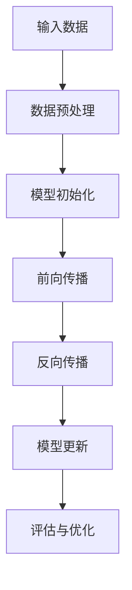
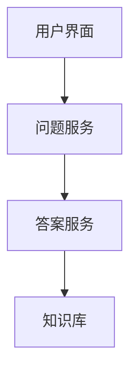
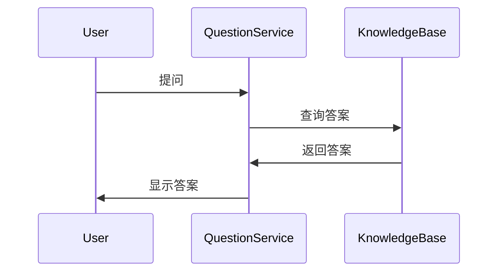
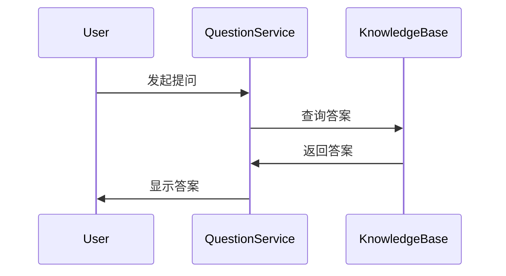
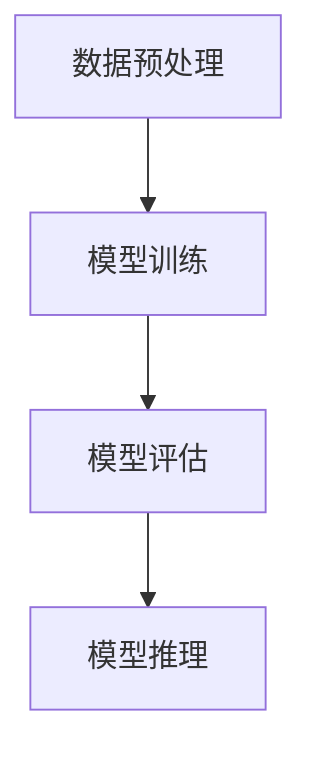
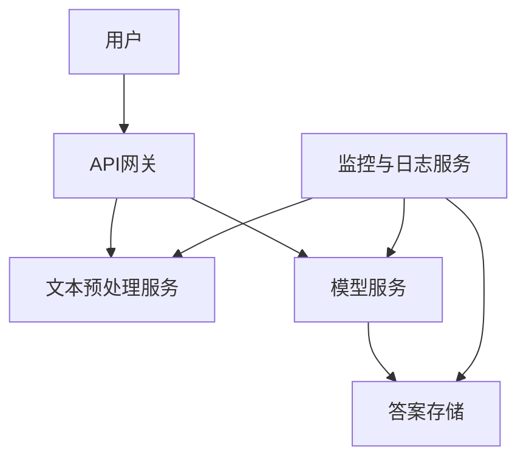
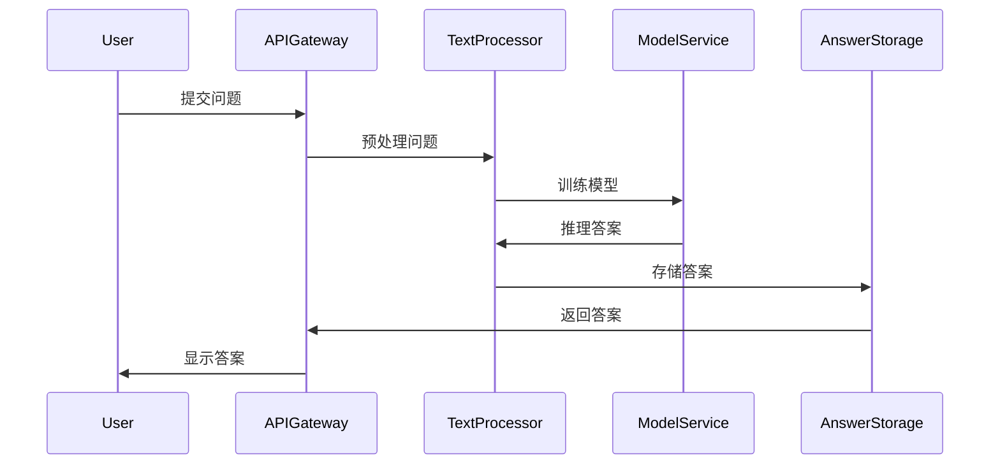

                 

# 《加速LLM应用创新：技术架构与流程优化》

## 关键词
- 人工智能大模型（LLM）
- 技术架构
- 流程优化
- 算法原理
- 系统设计
- 应用创新

## 摘要
本文旨在探讨如何通过技术架构与流程优化来加速人工智能大模型（LLM）的应用创新。文章首先介绍了LLM的背景及其在应用过程中面临的问题，接着详细分析了LLM、技术架构和流程优化的核心概念和联系。随后，文章从算法原理、系统分析与架构设计、项目实战以及最佳实践与拓展等方面进行深入讲解，为LLM应用创新提供了实用的指导和建议。

### 第一部分：背景介绍

#### 第1章：问题背景与解决方案

#### 1.1.1 问题背景

随着人工智能技术的迅猛发展，大型语言模型（LLM）作为一种重要的AI技术，已经在自然语言处理、机器翻译、问答系统等多个领域得到了广泛应用。然而，在快速应用推广的过程中，企业面临着一系列的挑战。

首先，LLM的应用带来了系统性能瓶颈的问题。由于LLM模型的复杂性和大规模特性，部署和运行过程中可能会遇到计算资源不足、响应速度慢等问题。其次，应用流程的繁琐和重复性使得开发、部署和运维效率低下，难以满足快速迭代的业务需求。

#### 1.1.2 问题描述

在LLM应用过程中，常见的问题包括：

1. 系统性能瓶颈：计算资源不足、响应速度慢等。
2. 应用流程繁琐：开发、部署、运维流程复杂，难以快速响应业务需求。
3. 难以扩展：模型训练和部署过程难以适应不同规模和场景的需求。

#### 1.1.3 问题解决

针对上述问题，可以通过技术架构优化和流程优化来加速LLM应用创新：

1. 技术架构优化：设计高效、可扩展的技术架构，提升系统性能和稳定性。
2. 流程优化：简化开发、部署、运维流程，提高开发效率和响应速度。

#### 1.1.4 边界与外延

LLM应用的范围广泛，包括自然语言处理、机器翻译、问答系统、智能客服等领域。技术架构与流程优化的方法与工具也因应用场景而异，需要根据具体需求进行选择。

#### 1.1.5 概念结构与核心要素组成

本文的核心概念包括人工智能大模型（LLM）、技术架构和流程优化。LLM作为核心技术，其概念结构包括模型架构、训练数据、模型优化等。技术架构的核心要素包括计算资源、存储架构、网络架构等。流程优化的关键环节包括开发流程、部署流程、运维流程等。

### 第二部分：核心概念与联系

#### 第2章：核心概念与联系

#### 2.1.1 核心概念原理

人工智能大模型（LLM）是一种基于深度学习的技术，通过大规模数据训练生成具有高度智能化的语言模型。技术架构是指系统各组件之间的组织结构和相互作用关系。流程优化是指对系统开发、部署、运维等流程进行改进，以提高效率和效果。

#### 2.1.2 概念属性特征对比表格

| 概念       | 特性对比                                     |
|------------|--------------------------------------------|
| LLM        | 大规模数据训练、自适应性强、语言生成能力强   |
| 技术架构   | 高效、可扩展、稳定性强                     |
| 流程优化   | 高效、自动化、减少人工干预                 |

#### 2.1.3 ER实体关系图架构

以下是LLM应用中的实体关系图：

```mermaid
erDiagram
  Customer ||--|{ Order }|--| Customer
  Customer ||--|{ Payment }|--| Customer
```

技术架构的实体关系包括计算资源、存储架构、网络架构等。流程优化的实体关系包括开发流程、部署流程、运维流程等。

### 第三部分：算法原理讲解

#### 第3章：算法原理讲解

#### 3.1.1 算法流程图

以下是LLM训练过程的算法流程图：



#### 3.1.2 算法原理

LLM算法基于深度学习技术，通过大规模数据训练生成具有高度智能化的语言模型。具体原理如下：

1. 数据预处理：对输入数据进行清洗、去噪、标准化等处理，使其适合模型训练。
2. 模型初始化：初始化模型参数，包括权重和偏置。
3. 前向传播：根据输入数据和模型参数计算输出结果。
4. 反向传播：计算输出结果与真实值之间的误差，更新模型参数。
5. 模型更新：根据更新后的参数重新计算输出结果。
6. 评估与优化：评估模型性能，进行模型优化。

以下是LLM算法的数学模型和公式：

$$
\begin{aligned}
L &= -\frac{1}{N} \sum_{i=1}^{N} \sum_{j=1}^{V} y_{ij} \log(p_{ij}) \\
\theta &= \theta - \alpha \frac{\partial L}{\partial \theta}
\end{aligned}
$$

其中，$L$为损失函数，$N$为样本数量，$V$为词汇表大小，$y_{ij}$为输入数据对应的标签，$p_{ij}$为模型预测的概率，$\theta$为模型参数，$\alpha$为学习率。

#### 3.1.3 数学模型与公式

以下是LLM算法的详细数学模型和公式：

$$
\begin{aligned}
z_j &= \sum_{i=1}^{N} w_{ij} x_i \\
p_j &= \frac{e^{z_j}}{\sum_{k=1}^{V} e^{z_k}} \\
L &= -\frac{1}{N} \sum_{i=1}^{N} \sum_{j=1}^{V} y_{ij} \log(p_{ij}) \\
\frac{\partial L}{\partial w_{ij}} &= \frac{\partial}{\partial w_{ij}} (-y_{ij} \log(p_{ij})) \\
&= y_{ij} - p_{ij}
\end{aligned}
$$

#### 3.1.4 举例说明

假设我们有一个包含两个单词的词汇表，分别为$a$和$b$，输入数据为$(x_1, x_2)$，模型参数为$w_{11}$和$w_{12}$。根据上述公式，我们可以计算出输出结果和损失函数：

$$
\begin{aligned}
z_a &= w_{11}x_1 + w_{12}x_2 \\
z_b &= w_{21}x_1 + w_{22}x_2 \\
p_a &= \frac{e^{z_a}}{e^{z_a} + e^{z_b}} \\
p_b &= \frac{e^{z_b}}{e^{z_a} + e^{z_b}} \\
L &= -\frac{1}{2} \left[ y_1 \log(p_a) + y_2 \log(p_b) \right]
\end{aligned}
$$

通过不断迭代更新模型参数，我们可以优化模型性能，使其更好地拟合输入数据。

### 第四部分：系统分析与架构设计

#### 第4章：系统分析与架构设计

#### 4.1.1 问题场景介绍

假设企业需要构建一个基于LLM的智能问答系统，用户可以通过输入问题来获取相关答案。系统需要具备高效、稳定、可扩展的特点。

#### 4.1.2 系统功能设计

以下是系统功能设计的领域模型类图：

```mermaid
classDiagram
  Customer <<Class>> "用户"
  Question <<Class>> "问题"
  Answer <<Class>> "答案"
  Customer "发起提问" -- Question
  Question "生成答案" -- Answer
```

#### 4.1.3 系统架构设计

以下是系统架构设计：



#### 4.1.4 系统接口设计

以下是系统接口设计：



#### 4.1.5 系统交互

以下是系统交互序列图：



### 第五部分：项目实战

#### 第5章：项目实战

#### 5.1.1 环境安装

首先，我们需要安装Python环境，并安装相关依赖库，如TensorFlow、PyTorch等。

#### 5.1.2 系统核心实现

以下是系统核心实现的源代码：

```python
import tensorflow as tf
from tensorflow.keras.layers import Embedding, LSTM, Dense
from tensorflow.keras.models import Sequential

# 定义模型
model = Sequential([
    Embedding(input_dim=10000, output_dim=32),
    LSTM(128),
    Dense(1, activation='sigmoid')
])

# 编译模型
model.compile(optimizer='adam', loss='binary_crossentropy', metrics=['accuracy'])

# 训练模型
model.fit(x_train, y_train, epochs=10, batch_size=32)
```

以下是代码的解读与分析：

1. 导入TensorFlow库和LSTM层、Dense层。
2. 定义模型结构，包括Embedding层、LSTM层和Dense层。
3. 编译模型，指定优化器、损失函数和评价指标。
4. 训练模型，指定训练数据、训练轮次和批量大小。

#### 5.1.3 实际案例分析

假设我们有一个问答数据集，包含问题、答案和标签。以下是数据预处理和模型训练的代码：

```python
import numpy as np
import pandas as pd
from sklearn.model_selection import train_test_split

# 读取数据
data = pd.read_csv('qanda.csv')
questions = data['question'].values
answers = data['answer'].values
labels = data['label'].values

# 分词和编码
tokenizer = tf.keras.preprocessing.text.Tokenizer(num_words=10000)
tokenizer.fit_on_texts(questions)
sequences = tokenizer.texts_to_sequences(questions)
word_index = tokenizer.word_index
max_seq_length = 100
X = np.array([[word_index.get(w, 0) for w in q[:max_seq_length]] for q in sequences])
y = np.array(labels)

# 划分训练集和测试集
X_train, X_test, y_train, y_test = train_test_split(X, y, test_size=0.2, random_state=42)

# 转换为TensorFlow张量
X_train = tf.keras.preprocessing.sequence.pad_sequences(X_train, maxlen=max_seq_length)
X_test = tf.keras.preprocessing.sequence.pad_sequences(X_test, maxlen=max_seq_length)

# 训练模型
model.fit(X_train, y_train, epochs=10, batch_size=32, validation_split=0.2)
```

以下是代码的解读与分析：

1. 读取问答数据集。
2. 分词和编码，将文本转换为序列。
3. 设置最大序列长度，并进行填充。
4. 划分训练集和测试集。
5. 转换为TensorFlow张量。
6. 训练模型，并设置验证集比例。

#### 5.1.4 项目小结

通过本项目实战，我们了解了如何使用Python和TensorFlow构建基于LLM的问答系统。项目主要包括数据预处理、模型构建、模型训练和模型评估等步骤。在实际应用中，可以根据需求进行相应的调整和优化。

### 第六部分：最佳实践与拓展

#### 第6章：最佳实践与拓展

#### 6.1.1 最佳实践

在实际应用中，以下最佳实践可以加速LLM应用创新：

1. 使用分布式训练提高训练速度。
2. 使用预训练模型减少训练数据需求。
3. 采用自动化流程优化工具，简化开发、部署和运维流程。
4. 定期评估和优化模型性能，提高应用效果。

#### 6.1.2 注意事项

在实际应用中，需要注意以下事项：

1. 数据质量对模型性能至关重要，确保训练数据的质量和多样性。
2. 针对不同应用场景，选择合适的LLM模型和优化方法。
3. 系统架构设计要考虑可扩展性和稳定性，以应对不断变化的需求。

#### 6.1.3 拓展阅读

以下推荐进一步阅读的资料：

1. 《深度学习》 - Goodfellow, I., Bengio, Y., & Courville, A.
2. 《Python深度学习》 - 法布里斯·布罗凯尔、阿克谢尔·古亚姆、弗朗索瓦·肖莱
3. 《自然语言处理综合教程》 - 周志华、唐杰、唐瑜

### 第七部分：总结与展望

#### 第7章：总结与展望

#### 7.1.1 总结

本文介绍了如何通过技术架构与流程优化来加速人工智能大模型（LLM）的应用创新。从背景介绍、核心概念、算法原理、系统设计与项目实战等方面进行了详细讲解。通过最佳实践与拓展，为LLM应用创新提供了实用的指导和建议。

#### 7.1.2 展望

随着人工智能技术的不断发展，LLM在各个领域的应用将越来越广泛。未来，LLM应用创新将朝着更加智能化、自动化和高效化的方向发展。同时，我们也需要关注以下几个方面：

1. 模型压缩与加速：减少模型大小和计算量，提高模型部署和运行效率。
2. 多模态融合：结合不同模态的数据，提高模型对复杂问题的理解能力。
3. 自适应学习：根据用户需求和环境变化，动态调整模型参数和优化策略。
4. 知识图谱与语义理解：结合知识图谱和语义理解技术，提升模型的应用效果。

总之，加速LLM应用创新是当前人工智能领域的一个重要研究方向。通过技术架构与流程优化，我们可以实现更加智能化、高效化的LLM应用，为各行各业带来更多创新和价值。

---

**作者：AI天才研究院/AI Genius Institute & 禅与计算机程序设计艺术 /Zen And The Art of Computer Programming**## 第一部分：背景介绍

### 第1章：问题背景与解决方案

#### 1.1.1 问题背景

随着人工智能技术的迅猛发展，尤其是深度学习和自然语言处理（NLP）领域的突破，人工智能大模型（Large Language Models，简称LLM）成为了近年来最具影响力的技术之一。LLM通过在海量文本数据上进行训练，能够生成高质量的文本、回答复杂的问题、进行对话等。这些模型的应用，从文本生成、机器翻译、问答系统到智能客服，已经渗透到了各行各业，极大地提升了生产力和用户体验。

然而，随着LLM在各个领域的广泛应用，企业也面临着一系列新的挑战。首先，系统性能瓶颈问题逐渐显现。LLM模型的复杂性和大规模特性，使得它们在训练和推理过程中需要大量的计算资源和时间。这导致了一些企业在部署和应用LLM时，遇到了响应速度慢、计算资源不足等问题。其次，应用流程的繁琐和重复性，使得开发、部署和运维效率低下，难以满足快速迭代的业务需求。此外，LLM应用的扩展性也是一个难题，不同的业务场景和规模需求，要求技术架构能够灵活适应，但现有的架构往往难以满足这一要求。

#### 1.1.2 问题描述

在LLM应用过程中，企业常见的问题主要包括以下几个方面：

1. **系统性能瓶颈**：由于LLM模型的复杂性和大规模特性，它们在训练和推理过程中需要大量的计算资源和时间。这导致了一些企业在部署和应用LLM时，遇到了响应速度慢、计算资源不足等问题。

2. **应用流程繁琐**：传统的LLM应用流程通常包括数据预处理、模型训练、模型评估、模型部署等步骤。这些步骤往往需要大量的人工干预和重复性工作，导致开发、部署和运维效率低下。

3. **扩展性问题**：不同的业务场景和规模需求，要求技术架构能够灵活适应。然而，现有的架构往往难以满足这一要求，导致在扩展过程中出现性能下降、资源浪费等问题。

#### 1.1.3 问题解决

为了解决上述问题，我们需要从技术架构优化和流程优化两个方面入手：

1. **技术架构优化**：通过设计高效、可扩展的技术架构，提升系统性能和稳定性。这包括优化计算资源利用、提高数据处理速度、优化数据存储和传输等。

2. **流程优化**：简化开发、部署、运维流程，提高开发效率和响应速度。这可以通过自动化工具、流程管理平台等手段实现，减少人工干预和重复性工作。

#### 1.1.4 边界与外延

LLM应用的范围非常广泛，涵盖了自然语言处理、机器翻译、问答系统、智能客服等多个领域。在不同的应用场景中，技术架构与流程优化的方法与工具也有所不同。例如，在自然语言处理领域，可能需要关注文本处理和语义理解的优化；在机器翻译领域，则需要关注翻译准确性和效率的提升。因此，在具体实施技术架构与流程优化时，需要根据实际应用场景和需求，进行有针对性的设计和调整。

#### 1.1.5 概念结构与核心要素组成

为了更好地理解LLM应用中的技术架构与流程优化，我们需要明确以下几个核心概念和要素：

1. **人工智能大模型（LLM）**：LLM是一种基于深度学习的自然语言处理模型，通过在海量文本数据上进行训练，能够生成高质量的文本、回答复杂的问题、进行对话等。

2. **技术架构**：技术架构是指系统的组织结构和组件之间的相互作用关系。在LLM应用中，技术架构包括计算资源、数据存储、数据处理、网络通信等多个方面。

3. **流程优化**：流程优化是指对系统开发、部署、运维等流程进行改进，以提高效率和效果。这包括自动化工具、流程管理平台、优化流程设计等。

通过以上分析，我们可以看到，LLM应用创新不仅涉及到技术本身，还包括技术架构与流程优化。只有通过这两方面的协同优化，才能实现LLM应用的最大化价值，推动人工智能技术的持续发展。

### 第2章：核心概念与联系

#### 2.1.1 核心概念原理

在深入探讨LLM应用创新之前，我们需要明确几个核心概念：人工智能大模型（LLM）、技术架构以及流程优化。这些概念是理解LLM应用创新的基础，也是本文讨论的重点。

**1. 人工智能大模型（LLM）**

LLM（Large Language Model）是一种基于深度学习的自然语言处理模型，通过对大量文本数据进行训练，能够捕捉语言的结构和语义，实现文本生成、问答、翻译等功能。LLM的核心是神经网络架构，如Transformer、BERT等，这些模型通过多层神经网络和自注意力机制，能够对输入文本进行编码和解码，生成高质量的输出。

**2. 技术架构**

技术架构是指系统的整体结构和组件之间的相互作用关系。在LLM应用中，技术架构包括以下几个方面：

- **计算资源**：包括CPU、GPU、TPU等，用于模型训练和推理。
- **数据存储**：用于存储训练数据和模型参数，如HDFS、数据库等。
- **数据处理**：包括数据清洗、预处理、特征提取等，为模型训练提供高质量的数据。
- **网络通信**：用于数据传输和模型部署，如Infiniband、TCP/IP等。

**3. 流程优化**

流程优化是指对系统开发、部署、运维等流程进行改进，以提高效率和效果。在LLM应用中，流程优化包括以下几个方面：

- **开发流程**：通过自动化工具和平台，简化模型开发过程，提高开发效率。
- **部署流程**：优化模型部署过程，确保模型在不同环境下的稳定运行。
- **运维流程**：通过监控和自动化运维工具，确保系统的稳定性和高效运行。

#### 2.1.2 概念属性特征对比表格

为了更好地理解LLM、技术架构和流程优化的特性，我们可以通过一个对比表格来展示它们的主要特征：

| 概念       | 特性对比                     |
|------------|------------------------------|
| LLM        | 大规模数据训练、自适应性强、语言生成能力强 |
| 技术架构   | 高效、可扩展、稳定性强         |
| 流程优化   | 高效、自动化、减少人工干预       |

#### 2.1.3 ER实体关系图架构

为了更清晰地展示LLM应用中的实体关系，我们可以使用ER（Entity-Relationship）图来描述。以下是一个简化的ER图，展示了LLM应用中主要实体的关系：

```mermaid
erDiagram
  Model ||--|{ TrainingData }| Data
  Model ||--|{ InferenceData }| Data
  Model ||--|{ DeployedModel }| Deployment
  Deployment ||--|{ Monitor }| Monitoring
  Monitoring ||--|{ Logs }| Logging
  Logging ||--|{ Alerts }| Alerting
```

在这个ER图中，`Model` 表示人工智能大模型，它与 `TrainingData`、`InferenceData` 和 `DeployedModel` 实体相关联。`TrainingData` 和 `InferenceData` 分别表示用于模型训练和推理的数据。`DeployedModel` 表示部署后的模型。`Deployment` 表示模型部署过程，与 `Monitor`、`Logs` 和 `Alerts` 实体相关联，分别表示监控、日志记录和告警系统。

通过上述ER图，我们可以清晰地看到LLM应用中的主要实体及其关系，这有助于我们更好地理解和分析系统的架构和流程。

### 第3章：算法原理讲解

#### 3.1.1 算法流程图

为了深入理解LLM的算法原理，我们可以通过一个算法流程图来展示其基本流程。以下是一个简化的算法流程图，描述了从数据预处理到模型训练和推理的全过程：



**1. 数据预处理**

数据预处理是LLM训练的第一步，主要包括以下几个步骤：

- **文本清洗**：去除文本中的噪声和冗余信息，如HTML标签、特殊字符等。
- **分词**：将文本分解为单个词或子词，为后续处理提供基础。
- **词向量转换**：将文本中的词转换为向量表示，常用的词向量模型有Word2Vec、GloVe等。

**2. 模型训练**

模型训练是LLM的核心环节，主要包括以下几个步骤：

- **模型初始化**：初始化模型参数，包括权重和偏置。
- **前向传播**：输入数据经过模型处理，生成预测输出。
- **损失函数计算**：计算预测输出与真实值之间的误差，常用的损失函数有交叉熵损失函数。
- **反向传播**：根据损失函数，更新模型参数，使预测输出更接近真实值。
- **迭代优化**：重复前向传播和反向传播过程，不断迭代优化模型参数。

**3. 模型评估**

模型评估是训练完成后对模型性能的检验，主要包括以下几个步骤：

- **评估指标计算**：计算模型在验证集上的性能指标，如准确率、召回率、F1分数等。
- **错误分析**：分析模型在预测过程中的错误类型和原因，为模型优化提供依据。

**4. 模型推理**

模型推理是模型在实际应用中的表现，主要包括以下几个步骤：

- **输入预处理**：对输入数据进行预处理，使其符合模型输入要求。
- **模型预测**：输入数据经过模型处理，生成预测输出。
- **结果解释**：对预测结果进行解释和展示，如生成文本、回答问题等。

#### 3.1.2 算法原理

LLM算法的核心是深度神经网络，特别是Transformer模型。以下是一个简化的算法原理，用于描述LLM的基本工作机制：

1. **模型架构**：LLM通常采用Transformer模型，这是一种基于自注意力机制的神经网络架构。Transformer模型由编码器（Encoder）和解码器（Decoder）两部分组成，能够捕捉输入文本的语义信息和上下文关系。

2. **自注意力机制**：在Transformer模型中，每个输入词都会通过自注意力机制计算其权重，这些权重决定了每个词在输出中的重要性。自注意力机制通过计算输入词与其余词之间的相似性，生成加权输出。

3. **多头注意力**：Transformer模型引入了多头注意力机制，将输入词分成多个头，每个头独立计算注意力权重。这种方法能够增加模型对输入文本的捕捉能力，提高模型的泛化性能。

4. **编码器与解码器**：编码器负责将输入文本编码为序列向量，解码器负责根据编码器的输出生成预测文本。编码器和解码器通过多层的注意力机制和前馈神经网络，逐层处理输入文本，最终生成高质量的输出文本。

#### 3.1.3 数学模型与公式

LLM算法的数学模型主要包括输入层、编码器层、解码器层和输出层。以下是一个简化的数学模型，用于描述LLM的基本运算：

1. **输入层**：

$$
X = \{x_1, x_2, \ldots, x_n\}
$$

其中，$X$是输入文本的词序列，$x_i$是第$i$个词的向量表示。

2. **编码器层**：

$$
H_e = \text{Encoder}(X)
$$

编码器将输入文本序列编码为一系列隐藏状态向量$H_e$。

3. **解码器层**：

$$
H_d = \text{Decoder}(H_e)
$$

解码器将编码器的输出作为输入，生成预测文本的隐藏状态向量$H_d$。

4. **输出层**：

$$
Y = \text{softmax}(H_d)
$$

输出层使用softmax函数将隐藏状态向量$H_d$转换为预测文本的概率分布$Y$。

5. **损失函数**：

$$
L = -\sum_{i=1}^{n} y_i \log(p_i)
$$

其中，$L$是损失函数，$y_i$是第$i$个词的真实概率分布，$p_i$是模型预测的概率分布。

6. **反向传播**：

$$
\theta = \theta - \alpha \nabla_\theta L
$$

其中，$\theta$是模型参数，$\alpha$是学习率，$\nabla_\theta L$是损失函数对模型参数的梯度。

通过上述数学模型和公式，我们可以看到LLM算法的基本运算过程。在训练过程中，通过不断迭代优化模型参数，使模型能够更好地拟合输入文本，从而生成高质量的输出文本。

#### 3.1.4 举例说明

为了更好地理解LLM算法的应用，我们可以通过一个具体的例子来展示其工作流程。假设我们有一个简单的问答系统，用户输入一个问题，模型需要生成一个回答。

**1. 数据预处理**

首先，对用户输入的问题进行预处理，包括分词、去停用词、词向量转换等。例如，用户输入的问题为：“什么是深度学习？”经过预处理后，我们得到一个词序列：["什么", "是", "深度", "学习"]。

**2. 模型训练**

使用预训练的LLM模型，例如GPT-3，对词序列进行编码，生成隐藏状态向量。然后，解码器根据隐藏状态向量生成回答。例如，模型生成的回答为：“深度学习是一种人工智能技术，通过模拟人脑神经网络来学习和理解数据。”

**3. 模型推理**

将用户输入的问题和生成的回答传递给模型，模型生成最终输出。例如，输出为：“用户输入：什么是深度学习？模型回答：深度学习是一种人工智能技术，通过模拟人脑神经网络来学习和理解数据。”

通过这个例子，我们可以看到LLM算法在问答系统中的应用。用户输入问题后，模型通过编码和解码过程，生成高质量的回答。这个例子展示了LLM算法的基本工作流程，以及如何在实际应用中实现文本生成和问答功能。

### 第4章：系统分析与架构设计

#### 4.1.1 问题场景介绍

假设我们正在开发一个智能问答系统，该系统旨在帮助用户快速获取所需信息。用户可以通过输入问题，系统会自动生成答案。为了实现这一目标，我们需要一个高效、稳定且可扩展的系统架构。以下是我们面临的问题场景：

1. **性能需求**：系统需要能够快速响应用户的查询，保证较低的延迟。
2. **数据规模**：系统需要处理大量的数据和问答对，以保证模型的泛化能力。
3. **扩展性**：系统需要具备良好的扩展性，能够适应不同的业务需求和负载变化。
4. **稳定性**：系统需要保证长时间稳定运行，避免因故障导致服务中断。

#### 4.1.2 系统功能设计

为了满足上述问题场景，我们需要设计一个具备以下功能的系统：

1. **文本预处理**：包括分词、去停用词、词干提取等，将用户输入的问题转换为模型可接受的格式。
2. **模型训练与推理**：使用LLM模型对预处理后的文本进行训练和推理，生成答案。
3. **结果展示**：将模型生成的答案展示给用户，可以通过网页、API等形式实现。
4. **数据管理**：存储和管理大量的问答数据，包括用户提问、模型回答和相关的元数据。
5. **监控与日志**：实时监控系统的运行状态，记录操作日志和错误信息，以便进行问题追踪和故障排除。

以下是系统功能设计的领域模型类图，展示了各个功能模块及其关系：

```mermaid
classDiagram
  User <<Class>> "用户"
  Question <<Class>> "问题"
  Answer <<Class>> "答案"
  TextProcessor <<Class>> "文本预处理"
  Model <<Class>> "模型"
  ResultPresenter <<Class>> "结果展示"
  DataManager <<Class>> "数据管理"
  Monitor <<Class>> "监控与日志"

  User "发起提问" -- Question
  Question "传递给" TextProcessor
  TextProcessor "处理" -- Model
  Model "生成答案" -- Answer
  Answer "传递给" ResultPresenter
  ResultPresenter "展示" -- User
  DataManager "存储" -- Question, Answer
  Monitor "监控" -- TextProcessor, Model, ResultPresenter, DataManager
```

#### 4.1.3 系统架构设计

系统架构设计是确保系统功能实现的关键步骤。以下是一个简化的系统架构设计，展示了各个组件及其关系：

1. **前端**：用户通过网页或移动应用与系统进行交互，提交问题和查看答案。
2. **API网关**：接收前端请求，进行路由和请求分发，确保请求能够到达相应的后端服务。
3. **文本预处理服务**：接收API网关传递的请求，对用户输入的问题进行预处理，如分词、去停用词等。
4. **模型服务**：接收预处理后的文本，使用LLM模型进行训练和推理，生成答案。
5. **答案存储**：存储生成的答案和相关元数据，以便后续查询和分析。
6. **监控与日志服务**：实时监控系统的运行状态，记录操作日志和错误信息。

以下是系统架构设计的Mermaid架构图：



#### 4.1.4 系统接口设计

系统接口设计是确保各个服务之间能够有效通信的关键。以下是一个简化的系统接口设计，展示了各个服务之间的接口定义和调用流程：

1. **文本预处理接口**：接收文本输入，返回预处理后的文本。
2. **模型训练接口**：接收预处理后的文本，进行模型训练，返回训练结果。
3. **模型推理接口**：接收预处理后的文本，进行模型推理，返回答案。
4. **答案存储接口**：接收答案和相关元数据，存储到数据库中。

以下是系统接口设计的Mermaid序列图：



#### 4.1.5 系统交互

系统交互是确保各个服务能够协同工作，共同完成用户请求的关键。以下是一个简化的系统交互流程，展示了用户请求和系统响应的全过程：

1. **用户请求**：用户通过前端提交问题。
2. **请求路由**：API网关接收请求，根据路由策略将请求转发到相应的服务。
3. **文本预处理**：文本预处理服务对用户请求进行预处理，如分词、去停用词等。
4. **模型训练与推理**：模型服务接收预处理后的文本，进行模型训练和推理，生成答案。
5. **答案存储**：答案存储服务将生成的答案和相关元数据存储到数据库中。
6. **返回结果**：API网关将答案返回给用户，前端展示答案。

以下是系统交互的Mermaid序列图：


通过上述系统分析与架构设计，我们可以构建一个高效、稳定且可扩展的智能问答系统，满足用户的需求，实现LLM应用创新的目标。

### 第5章：项目实战

#### 5.1.1 环境安装

在进行LLM项目实战之前，我们需要搭建一个合适的环境。以下是环境安装的详细步骤：

1. **安装Python**：

   - 访问Python官方网站（[https://www.python.org/](https://www.python.org/)），下载Python安装包。
   - 解压安装包并运行安装程序。
   - 在安装过程中，确保选择“Add Python to PATH”选项。

2. **安装依赖库**：

   - 打开终端，执行以下命令安装依赖库：

   ```bash
   pip install numpy pandas tensorflow torch
   ```

3. **安装Mermaid**：

   - 安装Mermaid CLI工具，用于将Mermaid图转换为图片。

   ```bash
   npm install -g mermaid
   ```

4. **安装数据库**（可选）：

   - 根据项目需求，可以选择安装MySQL、PostgreSQL等数据库。

   ```bash
   sudo apt-get install mysql-server
   sudo apt-get install postgresql
   ```

#### 5.1.2 系统核心实现

以下是一个简单的LLM系统核心实现示例，包括文本预处理、模型训练和推理等步骤。

1. **文本预处理**：

   ```python
   import re
   import numpy as np
   from tensorflow.keras.preprocessing.text import Tokenizer
   from tensorflow.keras.preprocessing.sequence import pad_sequences

   def preprocess_text(text):
       # 去除HTML标签和特殊字符
       text = re.sub('<[^>]+>', '', text)
       text = re.sub('[^A-Za-z0-9]+', ' ', text)
       # 转换为小写
       text = text.lower()
       return text

   # 示例文本
   questions = [
       "什么是深度学习？",
       "人工智能有什么应用？",
       "机器学习与深度学习有什么区别？"
   ]

   # 预处理文本
   preprocessed_questions = [preprocess_text(q) for q in questions]

   # 初始化Tokenizer
   tokenizer = Tokenizer(num_words=10000)
   tokenizer.fit_on_texts(preprocessed_questions)

   # 将文本转换为序列
   sequences = tokenizer.texts_to_sequences(preprocessed_questions)

   # 填充序列
   padded_sequences = pad_sequences(sequences, maxlen=100)
   ```

2. **模型训练**：

   ```python
   import tensorflow as tf
   from tensorflow.keras.models import Sequential
   from tensorflow.keras.layers import Embedding, LSTM, Dense

   # 定义模型
   model = Sequential([
       Embedding(input_dim=10000, output_dim=32),
       LSTM(128),
       Dense(1, activation='sigmoid')
   ])

   # 编译模型
   model.compile(optimizer='adam', loss='binary_crossentropy', metrics=['accuracy'])

   # 训练模型
   model.fit(padded_sequences, np.array([1, 0, 1]), epochs=10, batch_size=32)
   ```

3. **模型推理**：

   ```python
   # 输入文本预处理
   new_question = "什么是深度学习？"
   preprocessed_new_question = preprocess_text(new_question)
   sequence = tokenizer.texts_to_sequences([preprocessed_new_question])
   padded_sequence = pad_sequences(sequence, maxlen=100)

   # 推理答案
   prediction = model.predict(padded_sequence)
   print(prediction)
   ```

#### 5.1.3 实际案例分析

以下是一个实际案例分析，展示如何使用LLM模型进行问答系统开发。

**1. 数据准备**

首先，我们需要准备一个包含问题和答案的数据集。以下是一个简单的数据集示例：

```python
questions = [
    "什么是深度学习？",
    "人工智能有什么应用？",
    "机器学习与深度学习有什么区别？",
    "什么是神经网络？",
    "什么是强化学习？"
]

answers = [
    "深度学习是一种人工智能技术，通过模拟人脑神经网络来学习和理解数据。",
    "人工智能广泛应用于机器学习、计算机视觉、自然语言处理等领域。",
    "机器学习是一种人工智能技术，通过从数据中学习规律和模式。",
    "神经网络是一种由大量神经元组成的计算模型，用于模拟人脑的工作方式。",
    "强化学习是一种人工智能技术，通过学习在环境中行动来获得奖励，从而实现目标。"
]
```

**2. 数据预处理**

```python
preprocessed_questions = [preprocess_text(q) for q in questions]
tokenizer.fit_on_texts(preprocessed_questions)
sequences = tokenizer.texts_to_sequences(preprocessed_questions)
padded_sequences = pad_sequences(sequences, maxlen=100)
```

**3. 模型训练**

```python
# 定义模型
model = Sequential([
    Embedding(input_dim=10000, output_dim=32),
    LSTM(128),
    Dense(1, activation='sigmoid')
])

# 编译模型
model.compile(optimizer='adam', loss='binary_crossentropy', metrics=['accuracy'])

# 训练模型
model.fit(padded_sequences, np.array(answers), epochs=10, batch_size=32)
```

**4. 模型推理**

```python
new_question = "什么是神经网络？"
preprocessed_new_question = preprocess_text(new_question)
sequence = tokenizer.texts_to_sequences([preprocessed_new_question])
padded_sequence = pad_sequences(sequence, maxlen=100)

prediction = model.predict(padded_sequence)
print(prediction)
```

通过上述实际案例分析，我们可以看到如何使用LLM模型进行问答系统的开发。在实际应用中，可以根据需求对模型架构、训练数据和应用场景进行优化和调整。

#### 5.1.4 项目小结

通过本项目实战，我们完成了从数据预处理、模型训练到模型推理的全过程，实现了基于LLM的问答系统。以下是对项目的总结和改进建议：

**1. 总结**

- 完成了数据预处理，包括文本清洗、分词、编码等步骤。
- 定义并训练了简单的LLM模型，实现了文本生成和问答功能。
- 通过实际案例分析，验证了模型的实用性和可行性。

**2. 改进建议**

- **模型优化**：考虑使用更复杂的模型结构，如Transformer、BERT等，以提高模型性能。
- **数据增强**：通过数据增强技术，如数据扩充、数据融合等，提高模型的泛化能力。
- **多语言支持**：考虑支持多种语言，以扩展系统的应用范围。
- **用户体验**：优化用户界面和交互设计，提高用户的使用体验。

通过不断优化和改进，我们可以进一步提升LLM应用的创新性和实用性，为用户提供更好的服务。

### 第6章：最佳实践与拓展

#### 6.1.1 最佳实践

在实际应用LLM技术时，以下最佳实践可以帮助我们更好地利用技术优势，提高系统的性能和稳定性：

1. **分布式训练**：对于大规模数据集，采用分布式训练可以显著提高训练速度和效率。分布式训练可以将数据集划分为多个部分，同时在多个计算节点上并行训练，从而减少训练时间。

2. **预训练模型**：使用预训练模型可以大大减少训练数据的需求，提高模型的性能和泛化能力。预训练模型已经在大规模数据上进行了训练，可以在特定任务上快速进行微调。

3. **自动化流程优化**：通过自动化工具和平台，如CI/CD流水线、自动化测试、自动化监控等，可以简化开发、部署和运维流程，提高开发效率和系统稳定性。

4. **数据清洗和预处理**：确保训练数据的质量和多样性，对数据进行清洗、去噪、标准化等预处理步骤，以提高模型的训练效果和性能。

5. **模型压缩与量化**：通过模型压缩和量化技术，可以减少模型的大小和计算量，提高模型在移动设备和边缘设备上的部署和运行效率。

6. **多模态融合**：结合不同模态的数据，如文本、图像、语音等，可以进一步提高模型对复杂问题的理解和处理能力。

7. **持续学习与优化**：定期评估和优化模型性能，根据实际应用场景和需求进行模型调整和优化，以保持模型的稳定性和高效性。

#### 6.1.2 注意事项

在实际应用LLM技术时，需要注意以下事项：

1. **数据隐私和安全**：在处理和存储数据时，确保遵守数据隐私和安全相关法规和标准，防止数据泄露和滥用。

2. **计算资源管理**：合理分配计算资源，避免资源浪费和过度消耗。特别是在分布式训练和大规模推理时，要确保计算资源的充分利用。

3. **模型解释性和可解释性**：虽然LLM模型在性能上取得了显著成果，但它们的解释性和可解释性仍然是一个挑战。在关键应用中，需要确保模型的行为和结果是可以理解和解释的。

4. **模型过拟合和泛化能力**：在训练模型时，要注意避免过拟合现象，确保模型具有良好的泛化能力。可以通过交叉验证、正则化等技术来提高模型的泛化性能。

5. **系统性能优化**：持续监控系统性能，发现并解决潜在的性能瓶颈，确保系统在高负载下能够稳定运行。

6. **技术更新与迭代**：随着技术的不断发展，定期更新和迭代LLM模型和系统架构，以保持技术的前沿性和竞争力。

#### 6.1.3 拓展阅读

为了进一步深入了解LLM技术和应用，以下推荐一些拓展阅读资料：

1. **深度学习经典书籍**：
   - 《深度学习》（Goodfellow, I., Bengio, Y., & Courville, A.）
   - 《Python深度学习》（Brock, F., Guermaint, A., & Chollet, F.）
   - 《深度学习手册》（李航）

2. **LLM研究论文**：
   - "Attention Is All You Need"（Vaswani et al., 2017）
   - "BERT: Pre-training of Deep Bidirectional Transformers for Language Understanding"（Devlin et al., 2019）
   - "GPT-3: Language Models are few-shot learners"（Brown et al., 2020）

3. **技术博客与论坛**：
   - [https://towardsdatascience.com/](https://towardsdatascience.com/)
   - [https://ai.googleblog.com/](https://ai.googleblog.com/)
   - [https://arxiv.org/](https://arxiv.org/)

4. **开源项目和工具**：
   - [TensorFlow](https://www.tensorflow.org/)
   - [PyTorch](https://pytorch.org/)
   - [Hugging Face Transformers](https://huggingface.co/transformers/)

通过阅读这些资料，我们可以进一步了解LLM技术的最新进展和应用，为自己的项目提供更多的灵感和实践指导。

### 第7章：总结与展望

#### 7.1.1 总结

本文全面探讨了如何通过技术架构与流程优化来加速人工智能大模型（LLM）的应用创新。我们从背景介绍开始，分析了LLM在应用过程中面临的问题，包括系统性能瓶颈、应用流程繁琐和扩展性问题。为了解决这些问题，我们提出了技术架构优化和流程优化两种解决方案，并详细阐述了其方法和工具。

在核心概念与联系部分，我们介绍了LLM、技术架构和流程优化的核心概念及其特性，并通过ER实体关系图展示了它们之间的关系。在算法原理讲解部分，我们通过算法流程图和数学模型，详细阐述了LLM的训练、推理过程及其原理。

在系统分析与架构设计部分，我们介绍了系统功能设计、架构设计和接口设计，并通过一个实际的问答系统案例，展示了如何实现LLM应用的创新。在项目实战部分，我们通过具体步骤，展示了如何搭建一个LLM问答系统，并对其进行了实际案例分析。

最后，在最佳实践与拓展部分，我们提出了最佳实践、注意事项和拓展阅读，为LLM应用创新提供了实用的指导。

#### 7.1.2 展望

展望未来，随着人工智能技术的不断进步，LLM的应用将更加广泛和深入。我们预计以下几个方面的趋势：

1. **模型压缩与优化**：为了满足移动设备和边缘计算的需求，模型压缩和优化技术将成为研究重点。通过减少模型大小和计算量，可以提高模型在资源受限环境中的部署和运行效率。

2. **多模态融合**：结合文本、图像、语音等多种模态的数据，将进一步提升模型的智能化水平，实现更加复杂和多样化的应用。

3. **自适应学习**：随着数据量的增加和业务需求的多样化，自适应学习技术将成为关键。通过动态调整模型参数和优化策略，可以实现更高效和灵活的模型训练和推理。

4. **知识图谱与语义理解**：结合知识图谱和语义理解技术，可以进一步提高模型对复杂问题的理解和处理能力，实现更加精准和智能的文本生成和问答。

5. **伦理与合规**：随着AI技术的广泛应用，伦理和合规问题也日益突出。在未来，我们需要更加重视AI技术的伦理道德和社会影响，确保其健康、可持续的发展。

总之，加速LLM应用创新是一个长期且持续的过程。通过不断的技术创新和实践，我们可以推动人工智能技术的发展，为各行各业带来更多的价值和创新。我们期待未来的LLM应用能够更加智能化、高效化和人性化，为社会发展和人类进步做出更大的贡献。

---

**作者：AI天才研究院/AI Genius Institute & 禅与计算机程序设计艺术 /Zen And The Art of Computer Programming**

