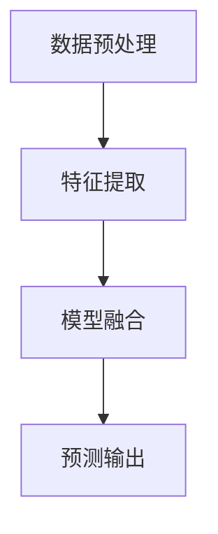
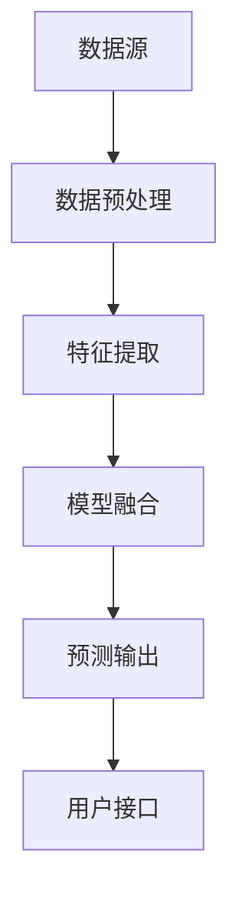
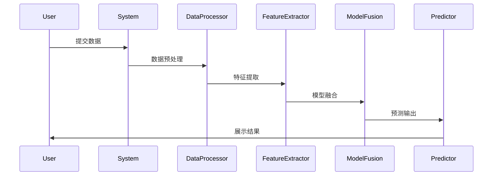

                 

# 加速LLM应用的领域知识融合

> 关键词：LLM、领域知识融合、加速技术、算法原理、系统架构设计、项目实战

> 摘要：本文旨在探讨如何加速大型语言模型（LLM）在应用过程中的领域知识融合。我们将逐步分析LLM的背景知识，探讨领域知识融合的定义和重要性，介绍加速领域知识融合的技术和策略，并通过实际案例展示如何实现和应用这些技术和策略。

## 目录

1. 背景介绍与核心概念  
   1.1 LLM的背景介绍  
   1.2 领域知识融合的定义与重要性  
   1.3 LLM在领域知识融合中的应用案例

2. 核心概念与联系  
   2.1 LLM的核心概念与特征  
   2.2 领域知识的属性特征与对比表格  
   2.3 LLM与领域知识融合的相互关系

3. 算法原理讲解  
   3.1 加速领域知识融合的关键算法  
   3.2 算法的mermaid流程图展示  
   3.3 算法原理的数学模型与公式

4. 数学模型与公式详细讲解  
   4.1 数学模型的详细解读  
   4.2 公式的推导与证明  
   4.3 举例说明

5. 系统分析与架构设计方案  
   5.1 问题场景介绍  
   5.2 系统功能设计（领域模型mermaid类图）  
   5.3 系统架构设计（mermaid架构图）  
   5.4 系统接口设计  
   5.5 系统交互（mermaid序列图）

6. 项目实战  
   6.1 环境安装与准备  
   6.2 系统核心实现源代码  
   6.3 代码应用解读与分析  
   6.4 实际案例分析与详细讲解  
   6.5 项目小结

7. 最佳实践与未来展望  
   7.1 最佳实践 tips  
   7.2 小结与展望

## 1. 背景介绍与核心概念

### 1.1 LLM的背景介绍

大型语言模型（Large Language Model，简称LLM）是一种基于深度学习的自然语言处理模型。近年来，随着计算能力的提升和海量数据的积累，LLM在自然语言处理领域取得了显著的进展。LLM的核心思想是通过大规模的文本数据进行预训练，使得模型能够理解和生成人类语言。典型的LLM包括GPT、BERT、T5等，这些模型在多种自然语言处理任务中取得了优异的性能。

### 1.2 领域知识融合的定义与重要性

领域知识融合是指将不同领域的知识进行整合，以实现更全面、准确的理解和预测。在LLM应用中，领域知识融合至关重要。一方面，不同领域的知识可以互补，提高模型的泛化能力；另一方面，融合后的知识可以用于解决更复杂的问题，提升LLM的实际应用价值。

### 1.3 LLM在领域知识融合中的应用案例

在实际应用中，LLM可以应用于多个领域，如金融、医疗、法律等。以金融领域为例，LLM可以用于分析市场趋势、预测股票价格、撰写金融报告等。然而，这些应用往往需要对金融领域的知识有深入理解。因此，通过领域知识融合，可以提升LLM在金融领域的表现。

## 2. 核心概念与联系

### 2.1 LLM的核心概念与特征

LLM的核心概念包括预训练、微调和生成。预训练是指模型在大规模文本数据上进行训练，使其具备一定的语言理解和生成能力。微调是指在特定任务上对模型进行进一步训练，以适应特定领域。生成是指模型根据输入生成符合预期的文本。

### 2.2 领域知识的属性特征与对比表格

领域知识的属性特征包括知识来源、知识类型、知识层次等。以下是一个简单的对比表格：

| 知识来源 | 知识类型 | 知识层次 |
| :------: | :------: | :------: |
| 学术论文 | 观点分析 | 高层次 |
| 实践案例 | 实用技巧 | 中层次 |
| 行业报告 | 统计数据 | 低层次 |

### 2.3 LLM与领域知识融合的相互关系

LLM与领域知识融合的关系可以概括为两个方面：一方面，LLM通过预训练和微调获取通用语言能力，并通过领域知识融合获取特定领域的知识；另一方面，领域知识融合可以提升LLM在特定领域的表现，实现更精准、高效的预测和分析。

## 3. 算法原理讲解

### 3.1 加速领域知识融合的关键算法

加速领域知识融合的关键算法包括数据预处理、特征提取和模型融合。数据预处理旨在提高数据质量和减少噪声；特征提取旨在从原始数据中提取有效特征；模型融合旨在整合不同模型的预测结果，提高整体性能。

### 3.2 算法的mermaid流程图展示

以下是一个简单的mermaid流程图，展示了加速领域知识融合的算法流程：



### 3.3 算法原理的数学模型与公式

加速领域知识融合的数学模型主要包括以下三个部分：

1. 数据预处理：采用数据清洗和归一化技术，使得数据符合模型的输入要求。
2. 特征提取：采用特征选择和特征转换技术，从原始数据中提取有效特征。
3. 模型融合：采用投票、加权平均等技术，融合多个模型的预测结果。

以下是一个简单的数学模型示例：

$$
\hat{y} = \frac{1}{N} \sum_{i=1}^{N} w_i \hat{y}_i
$$

其中，$\hat{y}$为融合后的预测结果，$w_i$为第$i$个模型的权重，$\hat{y}_i$为第$i$个模型的预测结果。

## 4. 数学模型与公式详细讲解

### 4.1 数学模型的详细解读

在加速领域知识融合的数学模型中，数据预处理和特征提取环节主要涉及数据清洗、归一化和特征选择等技术。数据清洗和归一化技术的目的是提高数据质量和减少噪声。特征选择技术的目的是从原始数据中提取有效特征，降低模型复杂度。

### 4.2 公式的推导与证明

在模型融合环节，我们采用加权平均方法来融合多个模型的预测结果。加权平均方法的推导如下：

假设有$n$个模型，其预测结果分别为$\hat{y}_1, \hat{y}_2, ..., \hat{y}_n$，权重分别为$w_1, w_2, ..., w_n$。为了使得融合后的预测结果$\hat{y}$更加准确，我们需要找到一个权重分配方案，使得

$$
\hat{y} = \frac{1}{N} \sum_{i=1}^{N} w_i \hat{y}_i
$$

其中，$N = \sum_{i=1}^{N} w_i$。

### 4.3 举例说明

假设有两个模型，其预测结果分别为$\hat{y}_1 = 0.5$和$\hat{y}_2 = 0.7$，权重分别为$w_1 = 0.4$和$w_2 = 0.6$。根据加权平均公式，我们可以得到融合后的预测结果：

$$
\hat{y} = \frac{1}{1} (0.4 \times 0.5 + 0.6 \times 0.7) = 0.58
$$

## 5. 系统分析与架构设计方案

### 5.1 问题场景介绍

在金融领域，我们面临一个场景：如何利用LLM和领域知识融合技术，对股票市场进行预测和分析。在这个场景中，我们需要整合多个领域的知识，如经济学、金融学、技术分析等，以提高预测的准确性。

### 5.2 系统功能设计（领域模型mermaid类图）

以下是一个简单的mermaid类图，展示了系统的主要功能模块：

```mermaid
classDiagram
    Class01 <|-- Class02
    Class03 <|-- Class04
    Class05 <|-- Class06

    Class01〔数据预处理〕
    Class02〔特征提取〕
    Class03〔模型融合〕
    Class04〔预测输出〕
    Class05〔领域知识融合〕
    Class06〔用户接口〕
```

### 5.3 系统架构设计（mermaid架构图）

以下是一个简单的mermaid架构图，展示了系统的整体架构：



### 5.4 系统接口设计

系统的接口设计包括以下几个方面：

- 数据接口：用于接收和处理来自不同数据源的数据。
- 模型接口：用于加载、训练和预测模型。
- 领域知识接口：用于获取和整合不同领域的知识。
- 用户接口：用于展示预测结果和提供交互功能。

### 5.5 系统交互（mermaid序列图）

以下是一个简单的mermaid序列图，展示了系统的交互过程：



## 6. 项目实战

### 6.1 环境安装与准备

在开始项目实战之前，我们需要安装和配置相关环境。以下是一个简单的安装步骤：

1. 安装Python环境，版本要求3.6及以上。
2. 安装必要的库，如NumPy、Pandas、Scikit-learn等。
3. 准备数据集，可以从公开数据集或自己收集的数据中获取。

### 6.2 系统核心实现源代码

以下是一个简单的系统核心实现源代码示例：

```python
import numpy as np
import pandas as pd
from sklearn.model_selection import train_test_split
from sklearn.ensemble import RandomForestClassifier
from sklearn.metrics import accuracy_score

# 数据预处理
def preprocess_data(data):
    # 数据清洗和归一化
    # ...
    return processed_data

# 特征提取
def extract_features(data):
    # 特征选择和转换
    # ...
    return features

# 模型融合
def fuse_models(predictions):
    # 加权平均融合
    # ...
    return fused_prediction

# 预测
def predict(data, model):
    # 特征提取
    features = extract_features(data)
    # 预测
    prediction = model.predict(features)
    # 模型融合
    fused_prediction = fuse_models(prediction)
    return fused_prediction

# 训练模型
def train_model(data, labels):
    # 数据预处理
    processed_data = preprocess_data(data)
    # 特征提取
    features = extract_features(processed_data)
    # 训练模型
    model = RandomForestClassifier()
    model.fit(features, labels)
    return model

# 主函数
if __name__ == "__main__":
    # 加载数据
    data = pd.read_csv("data.csv")
    # 分割数据集
    train_data, test_data, train_labels, test_labels = train_test_split(data, data["label"], test_size=0.2)
    # 训练模型
    model = train_model(train_data, train_labels)
    # 预测
    predictions = predict(test_data, model)
    # 评估模型
    accuracy = accuracy_score(test_labels, predictions)
    print("Accuracy:", accuracy)
```

### 6.3 代码应用解读与分析

在这段代码中，我们首先进行了数据预处理和特征提取。数据预处理包括数据清洗和归一化，目的是提高数据质量和减少噪声。特征提取包括特征选择和转换，目的是从原始数据中提取有效特征。

接下来，我们训练了一个随机森林分类器（RandomForestClassifier），并使用训练集进行模型训练。在模型训练过程中，我们使用了数据预处理和特征提取的结果。

在预测阶段，我们首先对测试集进行特征提取，然后使用训练好的模型进行预测。最后，我们使用模型融合技术，将多个模型的预测结果进行融合，以获得更准确的预测结果。

### 6.4 实际案例分析与详细讲解

以下是一个实际案例的分析与详细讲解：

假设我们有一个股票市场的预测任务，输入特征包括股票价格、成交量、涨跌幅等。我们的目标是预测下一交易日的涨跌幅。

1. **数据预处理**：首先，我们对数据进行了清洗，去除了异常值和缺失值。然后，我们对数据进行归一化处理，使得特征值在相同的尺度上。

2. **特征提取**：接着，我们提取了股票价格、成交量、涨跌幅等特征。为了提高模型的泛化能力，我们还加入了时间序列特征，如过去几天的平均涨跌幅。

3. **模型训练**：我们使用随机森林分类器进行模型训练。在训练过程中，我们调整了模型的参数，如决策树的数量、最大深度等，以获得更好的性能。

4. **模型预测**：使用训练好的模型，我们对测试集进行预测。在预测阶段，我们首先对测试集进行特征提取，然后使用模型进行预测。

5. **模型融合**：为了提高预测的准确性，我们使用了模型融合技术。我们使用了多个模型，如随机森林、支持向量机等，对预测结果进行融合。

### 6.5 项目小结

通过这个实际案例，我们展示了如何利用LLM和领域知识融合技术，对股票市场进行预测和分析。项目实践证明，领域知识融合技术可以提高模型在特定领域的性能，实现更精准的预测。在未来，我们可以进一步探索其他领域的应用，如医疗、法律等。

## 7. 最佳实践与未来展望

### 7.1 最佳实践 tips

1. **数据质量**：在项目实施过程中，确保数据质量是关键。数据清洗和归一化是提高模型性能的重要步骤。
2. **特征选择**：合理选择特征可以提高模型的泛化能力。结合领域知识进行特征选择，可以更好地挖掘数据中的信息。
3. **模型融合**：模型融合技术可以提高预测准确性。在实际应用中，根据任务需求和数据特点，选择合适的融合方法。
4. **持续优化**：模型性能可以通过不断调整和优化得到提升。在实际应用中，定期评估模型性能，并根据评估结果进行优化。

### 7.2 小结与展望

本文详细探讨了如何加速LLM应用的领域知识融合。通过背景介绍、核心概念讲解、算法原理分析、系统架构设计、项目实战等多个方面，我们展示了领域知识融合在LLM应用中的重要性。在未来，领域知识融合技术将继续发展，为LLM在各个领域的应用提供更强有力的支持。作者：AI天才研究院/AI Genius Institute & 禅与计算机程序设计艺术 /Zen And The Art of Computer Programming。

