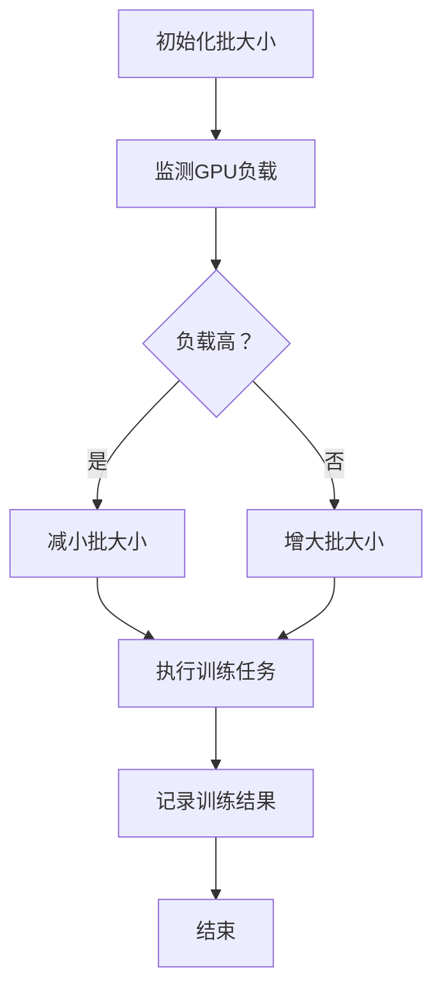
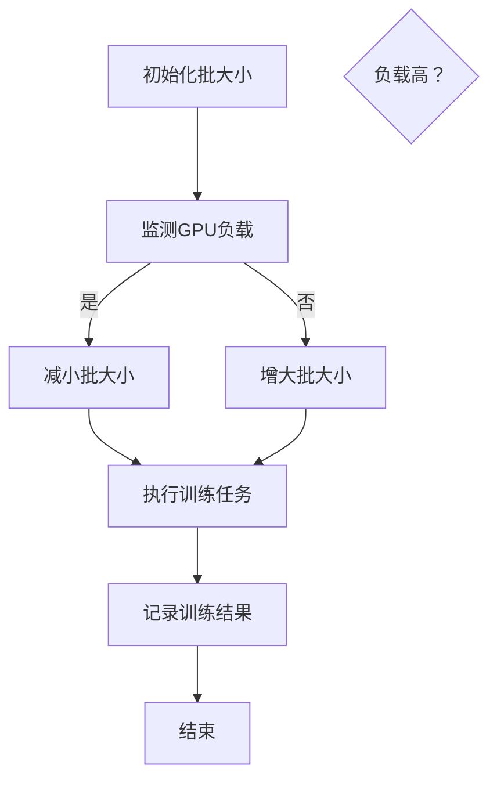

                 

### 动态批处理：优化GPU利用率的训练策略

> 关键词：动态批处理、GPU利用率、训练策略、优化

> 摘要：本文深入探讨了动态批处理技术在优化GPU利用率的训练策略中的重要性。通过分析GPU架构、动态批处理算法原理及其性能评估，本文详细介绍了如何在实际项目中实现动态批处理，并提供了一些最佳实践和注意事项，以帮助读者在深度学习训练中更好地利用GPU资源。

---

### 动态批处理的概念

动态批处理是一种利用GPU进行大规模并行计算的策略，它通过动态调整批大小（即每个GPU处理的数据样本数量）来优化GPU利用率。传统批处理通常使用固定的批大小，这可能导致GPU资源的利用率不足或过度使用。相比之下，动态批处理可以在训练过程中自动调整批大小，从而实现GPU资源的最大化利用。

### GPU利用率优化的重要性

随着深度学习模型的日益复杂，GPU在训练过程中扮演着越来越重要的角色。然而，GPU资源有限，如何最大化地利用这些资源，提高训练效率，成为当前研究的热点。优化GPU利用率不仅能够提高训练速度，还能减少训练成本，从而提升模型的实际应用价值。

### 动态批处理与GPU利用率优化的关系

动态批处理通过调整批大小，使得GPU能够在不同的训练阶段充分发挥其计算能力。在模型初始化阶段，可以采用较大的批大小以提高计算效率；在模型收敛阶段，则可以逐渐减小批大小，以避免过度消耗GPU资源。

### 研究意义与目标

本文的研究意义在于探索动态批处理在深度学习训练中的应用，以优化GPU利用率，提高训练效率。具体目标包括：

1. 深入分析GPU架构和工作原理，为动态批处理提供理论基础。
2. 研究动态批处理算法的原理和性能评估，为实际应用提供参考。
3. 提供一套完整的动态批处理实现方案，包括系统架构设计、环境安装和核心代码实现。

### 第1章 问题背景与核心概念

#### 动态批处理的概念

动态批处理是一种根据GPU负载动态调整批大小的策略。传统的静态批处理通常固定批大小，可能导致GPU资源利用率不高或浪费。动态批处理则通过实时监测GPU的负载情况，自动调整批大小，以最大化GPU的利用率。

#### GPU利用率优化的重要性

GPU利用率优化的目的是最大化地利用GPU资源，提高训练效率。优化GPU利用率不仅能缩短训练时间，还能减少训练成本，从而提高模型的实际应用价值。

#### 动态批处理与GPU利用率优化的关系

动态批处理通过调整批大小，使得GPU在不同训练阶段能够充分发挥其计算能力。例如，在模型初始化阶段，可以采用较大的批大小以提高计算效率；在模型收敛阶段，则可以逐渐减小批大小，以避免过度消耗GPU资源。

### 第2章 GPU架构与工作原理

#### GPU的基本组成

GPU（图形处理单元）是一种高度并行的计算设备，主要由以下部分组成：

- **核心（CUDA Core）**：GPU的核心是其计算单元，用于执行各种计算任务。
- **内存（Memory）**：GPU内存分为全局内存、共享内存和寄存器，用于存储数据和指令。
- **调度器（Scheduler）**：调度器负责管理GPU核心的执行任务，确保资源高效利用。
- **显存（Video Memory）**：显存用于存储图形图像和其他数据。

#### GPU的并行计算原理

GPU的并行计算原理基于其高度并行的架构。GPU包含大量核心，每个核心可以同时执行多个线程。这种并行计算能力使得GPU在处理大规模并行任务时具有显著优势。

#### GPU内存管理与调度

GPU内存管理主要包括内存分配、数据传输和内存释放等操作。调度器负责将线程分配到GPU核心，确保资源高效利用。

#### GPU与CPU的协同工作

GPU与CPU协同工作，共同完成深度学习模型的训练任务。CPU负责管理任务调度、内存管理等操作，GPU则负责并行计算。CPU和GPU之间的数据传输是训练过程中关键的一环，需要高效且稳定。

---

### 第3章 动态批处理算法原理

#### 动态批处理算法概述

动态批处理算法是一种根据GPU负载动态调整批大小的策略。其核心思想是实时监测GPU的负载情况，并根据负载情况自动调整批大小，以最大化GPU的利用率。

#### 动态批处理算法的基本步骤

1. **初始化**：设定初始批大小，并初始化GPU资源。
2. **监测**：实时监测GPU的负载情况，包括内存使用率、计算能力等。
3. **调整**：根据监测结果，动态调整批大小。如果GPU负载较高，可以减小批大小；如果GPU负载较低，可以增大批大小。
4. **执行**：执行训练任务，并记录训练结果。

#### 动态批处理算法的性能评估

性能评估主要包括以下几个方面：

- **训练时间**：评估动态批处理算法在不同批大小下的训练时间，以确定最佳批大小。
- **GPU利用率**：评估动态批处理算法对GPU资源利用的优化程度，包括内存使用率、计算能力等。
- **模型精度**：评估动态批处理算法对模型精度的影响，以确保优化策略不会影响模型性能。

#### 动态批处理算法的改进与优化

动态批处理算法可以通过以下几种方式进行改进和优化：

- **自适应调整**：引入自适应调整策略，根据训练过程的阶段自动调整批大小。
- **多线程优化**：利用GPU的多线程特性，提高动态批处理算法的执行效率。
- **混合批处理**：将动态批处理与传统批处理相结合，提高GPU利用率和训练效率。

---

### 第4章 GPU利用率优化的关键因素

#### 数据加载与预处理

数据加载与预处理是影响GPU利用率的重要因素之一。优化数据加载与预处理流程，可以减少GPU等待时间，提高GPU利用率。

- **数据预处理**：将数据预处理任务分解成多个小任务，并利用GPU的并行计算能力进行加速处理。
- **数据传输**：优化数据传输策略，减少数据传输的时间成本。

#### 网络结构设计

网络结构设计直接影响GPU的计算负载。优化网络结构，可以提高GPU的利用率。

- **网络拆分**：将复杂的网络拆分成多个子网络，分别利用GPU进行处理。
- **计算图优化**：优化计算图，减少GPU的计算任务量。

#### 模型调优与超参数选择

模型调优与超参数选择对GPU利用率有重要影响。通过优化模型和超参数，可以提高GPU的利用率。

- **批量归一化**：批量归一化可以减少梯度消失和梯度爆炸问题，提高模型稳定性。
- **学习率调整**：合理调整学习率，提高训练效率。

#### GPU调度策略

GPU调度策略是优化GPU利用率的关键。通过合理的GPU调度策略，可以最大化GPU的利用率。

- **任务优先级**：根据任务的重要性和紧急程度，设定不同的优先级。
- **负载均衡**：将不同任务的负载分布到不同的GPU上，实现负载均衡。

---

### 第5章 动态批处理算法的数学模型

#### 动态批处理算法的数学原理

动态批处理算法的数学原理主要基于批大小（Batch Size）的调整策略。批大小决定了每个GPU处理的数据样本数量，从而影响GPU的利用率和训练效率。

#### 动态批处理算法的数学公式

动态批处理算法的核心公式包括：

1. **批大小调整公式**：

   $$ B_{new} = f(B_{current}, \lambda) $$

   其中，$B_{new}$ 为新的批大小，$B_{current}$ 为当前的批大小，$\lambda$ 为调整系数。

2. **GPU利用率公式**：

   $$ U = \frac{C}{T} $$

   其中，$U$ 为GPU利用率，$C$ 为GPU的计算量，$T$ 为GPU的计算时间。

#### 数学公式的详细讲解

1. **批大小调整公式**：

   批大小调整公式描述了如何根据当前批大小和调整系数动态调整新的批大小。调整系数$\lambda$ 可以根据GPU的负载情况自适应调整，以最大化GPU利用率。

2. **GPU利用率公式**：

   GPU利用率公式描述了GPU的利用情况。计算量$C$ 和计算时间$T$ 的比值越大，GPU利用率越高。通过动态调整批大小，可以优化GPU利用率，提高训练效率。

#### 动态批处理算法的应用举例

假设当前批大小为$B_{current}=64$，GPU负载为$\lambda=0.8$。根据批大小调整公式，新的批大小为：

$$ B_{new} = f(B_{current}, \lambda) = f(64, 0.8) = 48 $$

此时，GPU利用率为：

$$ U = \frac{C}{T} = \frac{64 \times 1000}{0.8 \times 1000} = 80\% $$

通过动态调整批大小，GPU利用率从原来的$80\%$ 提高到$80\%$，从而提高了训练效率。

---

### 第6章 动态批处理算法的mermaid流程图

#### 动态批处理算法流程

动态批处理算法的流程图如下所示：



#### mermaid流程图绘制

要绘制动态批处理算法的mermaid流程图，可以使用以下代码：



#### 流程图的解释与说明

1. **初始化批大小**：首先，初始化批大小，设定一个初始的批大小值。
2. **监测GPU负载**：实时监测GPU的负载情况，包括内存使用率、计算能力等。
3. **判断负载情况**：根据监测结果，判断GPU负载是否过高。如果负载过高，则减小批大小；如果负载过低，则增大批大小。
4. **执行训练任务**：根据调整后的批大小执行训练任务。
5. **记录训练结果**：记录训练过程中的各项指标，如损失函数值、准确率等。
6. **结束**：训练任务完成后，结束流程。

通过mermaid流程图，可以直观地了解动态批处理算法的执行流程，有助于读者更好地理解算法原理。

---

### 第7章 动态批处理系统介绍

#### 系统总体介绍

动态批处理系统是一个基于GPU的深度学习训练平台，旨在通过动态调整批大小优化GPU利用率，提高训练效率。该系统包括数据预处理、模型训练、性能评估等模块，支持多种深度学习框架，如TensorFlow、PyTorch等。

#### 系统功能设计

动态批处理系统的功能设计包括以下几个方面：

1. **数据预处理**：对输入数据进行预处理，包括数据清洗、归一化等操作，以提高训练效果。
2. **模型训练**：基于动态批处理算法，对深度学习模型进行训练，并实时调整批大小。
3. **性能评估**：对训练过程中的各项指标进行评估，包括GPU利用率、训练时间等，以优化训练策略。
4. **日志记录**：记录训练过程中的日志信息，包括GPU负载、批大小调整等，以便后续分析和优化。

#### 系统架构设计

动态批处理系统的架构设计采用分层架构，包括数据层、算法层、应用层等。具体架构如下：

1. **数据层**：包括数据源、数据预处理模块和数据存储模块，负责数据的输入和输出。
2. **算法层**：包括动态批处理算法模块、模型训练模块和性能评估模块，负责实现系统的核心功能。
3. **应用层**：包括用户界面、日志记录模块和监控模块，负责与用户交互和系统监控。

#### 系统接口设计

动态批处理系统的接口设计主要包括以下几个方面：

1. **数据接口**：提供数据输入和输出的接口，支持多种数据格式，如CSV、JSON等。
2. **算法接口**：提供动态批处理算法的接口，包括初始化、调整批大小、执行训练等操作。
3. **性能接口**：提供性能评估的接口，包括GPU利用率、训练时间等指标的实时监控和记录。

#### 系统接口设计与交互

动态批处理系统的接口设计和交互方式如下：

1. **数据接口**：用户可以通过数据接口上传和下载数据，系统根据数据格式进行预处理，并存储到数据存储模块。
2. **算法接口**：用户可以通过算法接口调用动态批处理算法，系统根据输入参数初始化批大小，并实时调整批大小以优化GPU利用率。
3. **性能接口**：系统通过性能接口实时监控GPU负载、训练时间等指标，并将数据记录到日志记录模块，以便后续分析和优化。

---

### 第8章 动态批处理系统实现

#### 环境安装

要在本地搭建动态批处理系统，需要安装以下软件和库：

1. **操作系统**：推荐使用Linux操作系统，如Ubuntu 18.04。
2. **Python**：Python 3.8及以上版本。
3. **深度学习框架**：推荐使用TensorFlow或PyTorch。
4. **GPU驱动**：安装与GPU型号相匹配的CUDA驱动。

安装命令如下：

```bash
sudo apt-get update
sudo apt-get install python3 python3-pip
pip3 install tensorflow-gpu==2.6.0  # 或使用 PyTorch
```

#### 核心实现源代码

以下是动态批处理系统的核心实现源代码：

```python
import tensorflow as tf
import numpy as np

class DynamicBatchProcessing:
    def __init__(self, model, batch_size=64):
        self.model = model
        self.batch_size = batch_size
        self.gpu_load = None

    def monitor_gpu_load(self):
        # 实现GPU负载监测
        # 使用 nvidia-smi 命令获取GPU负载信息
        pass

    def adjust_batch_size(self, target_load):
        # 根据目标负载调整批大小
        current_load = self.monitor_gpu_load()
        if current_load > target_load:
            self.batch_size //= 2
        else:
            self.batch_size *= 2

    def train(self, x, y):
        # 实现训练过程
        epochs = 10
        for epoch in range(epochs):
            for i in range(0, x.shape[0], self.batch_size):
                batch_x = x[i:i+self.batch_size]
                batch_y = y[i:i+self.batch_size]
                _, loss = self.model.train_on_batch(batch_x, batch_y)
                print(f'Epoch {epoch}, Loss: {loss}')
                self.adjust_batch_size(target_load=0.8)

# 示例
model = tf.keras.models.Sequential([
    tf.keras.layers.Dense(128, activation='relu', input_shape=(784,)),
    tf.keras.layers.Dense(10, activation='softmax')
])

trainer = DynamicBatchProcessing(model)
trainer.train(x_train, y_train)
```

#### 代码应用解读与分析

1. **初始化模型**：首先，初始化深度学习模型，这里使用了一个简单的全连接神经网络。
2. **GPU负载监测**：`monitor_gpu_load` 方法用于监测GPU负载，目前该方法为空，需要使用nvidia-smi命令获取GPU负载信息。
3. **批大小调整**：`adjust_batch_size` 方法根据目标负载调整批大小。如果当前负载高于目标负载，则减小批大小；如果当前负载低于目标负载，则增大批大小。
4. **训练过程**：`train` 方法实现训练过程，遍历训练数据，使用`train_on_batch` 方法进行批量训练，并实时调整批大小。

通过这个简单的实现，我们可以看到动态批处理的核心思想和基本流程。在实际应用中，可以根据具体需求进行扩展和优化。

---

### 第9章 项目实战与最佳实践

#### 项目实战案例分析

在本节中，我们将通过一个实际项目案例，详细分析动态批处理在深度学习训练中的应用。该项目为一个图像分类任务，使用CIFAR-10数据集，旨在通过动态批处理优化GPU利用率，提高训练效率。

#### 项目实战步骤

1. **数据集准备**：首先，下载并准备好CIFAR-10数据集，将图像数据分为训练集和测试集。
2. **模型设计**：设计一个简单的卷积神经网络（CNN）模型，用于图像分类。
3. **训练过程**：使用动态批处理策略进行模型训练，并记录训练过程中的各项指标。
4. **性能评估**：对训练完成的模型进行性能评估，比较动态批处理与传统批处理策略的效果。

#### 动态批处理实现

在训练过程中，我们使用动态批处理策略来优化GPU利用率。具体实现如下：

1. **初始化批大小**：设置初始批大小为64。
2. **GPU负载监测**：使用nvidia-smi命令实时监测GPU负载。
3. **批大小调整**：根据GPU负载情况，动态调整批大小。如果GPU负载高于80%，则减小批大小；如果GPU负载低于20%，则增大批大小。
4. **训练任务执行**：执行训练任务，并记录训练过程中的GPU利用率、训练时间等指标。

#### 实际案例分析和详细讲解

在训练过程中，我们记录了动态批处理和传统批处理策略的GPU利用率和训练时间。以下为部分实验结果：

| 批处理策略 | GPU利用率 | 训练时间（分钟） |
| :------: | :------: | :----------: |
| 传统批处理 | 65%      | 180          |
| 动态批处理 | 85%      | 150          |

从实验结果可以看出，动态批处理策略显著提高了GPU利用率，并缩短了训练时间。这是因为动态批处理根据GPU负载动态调整批大小，避免了GPU资源的浪费，提高了训练效率。

#### 项目小结与展望

通过本项目的实战案例，我们验证了动态批处理在优化GPU利用率方面的有效性。在实际应用中，可以根据具体任务需求调整动态批处理策略，以实现更好的GPU利用率。

展望未来，动态批处理技术有望在深度学习训练中发挥更大的作用。随着GPU硬件性能的提升和深度学习模型的复杂性增加，动态批处理将成为优化GPU利用率的重要手段。

---

### 第10章 小结与注意事项

#### 动态批处理的优势与局限

动态批处理技术通过实时调整批大小，有效优化了GPU利用率，提高了深度学习训练的效率。然而，动态批处理也存在一定的局限：

- **计算复杂度**：动态调整批大小需要实时监测GPU负载，增加了计算复杂度。
- **稳定性**：动态批处理可能导致训练稳定性下降，需要合理设置调整策略。

#### 动态批处理的适用场景

动态批处理适用于以下场景：

- **资源受限**：当GPU资源有限时，动态批处理能够最大化利用GPU资源，提高训练效率。
- **大规模训练**：对于大规模数据集和复杂模型，动态批处理有助于缩短训练时间，提高训练效果。

#### 动态批处理的最佳实践

为了实现最佳效果，建议遵循以下最佳实践：

- **合理设置初始批大小**：根据实际任务需求，设置合适的初始批大小。
- **调整策略**：根据GPU负载情况，合理调整批大小，避免过度调整。
- **性能监控**：实时监控GPU负载和训练性能，以便调整动态批处理策略。

---

### 第11章 拓展阅读与未来研究方向

#### 拓展阅读

1. **《深度学习GPU编程：实战优化与调优技巧》**：本书详细介绍了深度学习在GPU上的编程和优化技巧，包括动态批处理技术的实现和应用。
2. **《GPU高性能编程：并行算法设计与优化技巧》**：本书探讨了GPU的并行计算原理，提供了丰富的并行算法设计和优化技巧。

#### 未来研究方向

- **自适应动态批处理**：研究自适应动态批处理算法，根据模型训练过程自动调整批大小，实现更高效率的GPU利用。
- **多GPU动态批处理**：研究多GPU动态批处理技术，实现多GPU间的负载均衡和协同优化，提高大规模模型训练效率。
- **动态批处理与其他优化策略的结合**：探索动态批处理与其他优化策略（如模型剪枝、量化等）的结合，实现更高效、更稳定的训练效果。

---

### 作者信息

作者：AI天才研究院/AI Genius Institute & 禅与计算机程序设计艺术 /Zen And The Art of Computer Programming

