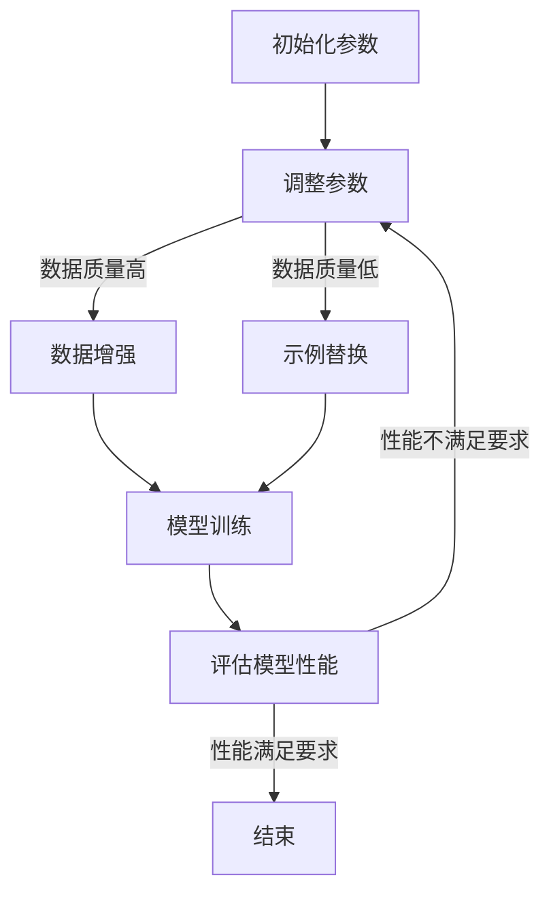
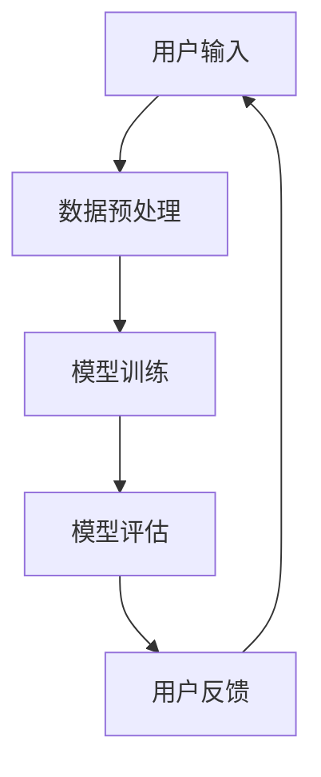

                 

## 动态示例选择：根据任务特性调整

> 关键词：动态示例选择、任务特性、人工智能、算法优化、模型性能

> 摘要：本文将探讨动态示例选择在人工智能领域的重要性，以及如何根据任务特性调整动态示例选择策略，以提高AI大模型的性能和泛化能力。文章首先介绍了问题背景，随后深入剖析了核心概念与联系，讲解了算法原理，并提供了实际案例和最佳实践。

----------------------------------------------------------------

## 第一部分：背景介绍

### 1.1 问题背景

随着人工智能技术的不断发展，AI大模型作为一种先进的算法技术，已经广泛应用于各个行业。然而，如何根据任务特性调整动态示例选择，以提高模型性能和泛化能力，成为了一个关键问题。动态示例选择是一种根据任务特性，实时调整示例选择策略的方法，通过优化示例数据，从而提升模型的学习效果。

### 1.2 问题描述

动态示例选择是指根据任务特性，实时调整示例的选择策略，从而优化模型的学习过程。在本研究中，我们将探讨如何根据任务特性，调整动态示例选择策略，以提高AI大模型的性能和泛化能力。

### 1.3 问题解决

解决这一问题的关键在于理解任务特性和动态示例选择策略之间的关系。首先，需要明确任务特性，包括数据分布、目标变量、任务类型等。然后，根据这些特性，设计合适的动态示例选择策略，如数据增强、正负样本调整、示例替换等。

### 1.4 边界与外延

在研究动态示例选择的边界与外延时，需要考虑以下几个方面：

- **数据质量**：示例的质量直接影响模型的学习效果，因此需要确保示例数据的质量。
- **计算资源**：动态示例选择可能需要额外的计算资源，因此需要在计算资源和模型性能之间做出权衡。
- **模型复杂性**：复杂的模型可能更适合使用动态示例选择策略，而简单的模型则可能不需要。

### 1.5 概念结构与核心要素组成

动态示例选择涉及多个核心概念和要素，包括：

- **任务特性**：任务特性能指导示例选择策略的设计。
- **动态示例选择策略**：包括数据增强、正负样本调整、示例替换等策略。
- **模型性能**：动态示例选择的目的是提高模型性能。
- **泛化能力**：动态示例选择策略应有助于提高模型的泛化能力。

## 第二部分：核心概念与联系

### 2.1 动态示例选择策略原理

#### 2.1.1 数据增强

数据增强是通过创建新的示例，增加模型的训练数据，从而提高模型性能。数据增强方法包括：图像旋转、缩放、裁剪、色彩抖动等。

#### 2.1.2 正负样本调整

正负样本调整是根据任务特性，动态调整正负样本的比例，以防止模型过拟合。

#### 2.1.3 示例替换

示例替换是利用高质量的示例替换低质量的示例，以提高模型性能。

### 2.2 动态示例选择策略的核心特点

- **自适应**：动态示例选择策略能根据任务特性自适应调整。
- **实时性**：动态示例选择策略能实时调整示例选择策略。
- **多样性**：动态示例选择策略能保证示例选择的多样性。

### 2.3 动态示例选择与传统AI的区别

- **传统AI**：以静态示例选择为主，缺乏对任务特性的动态调整。
- **动态示例选择**：能根据任务特性动态调整示例选择策略，提高模型性能和泛化能力。

### 2.4 动态示例选择在AI大模型中的应用

- **预训练阶段**：在预训练阶段，动态示例选择能有效提高模型性能。
- **微调阶段**：在微调阶段，动态示例选择能根据任务特性调整模型参数，提高模型泛化能力。

### 2.5 动态示例选择的优势与挑战

#### 2.5.1 优势

- **提高模型性能**：通过动态调整示例选择策略，提高模型性能。
- **增强泛化能力**：动态示例选择策略有助于提高模型的泛化能力。

#### 2.5.2 挑战

- **计算资源消耗**：动态示例选择可能需要额外的计算资源。
- **数据质量要求**：高质量的数据是动态示例选择的基础。

### 2.6 本章小结

本章介绍了动态示例选择的核心概念、原理和应用，为后续章节的深入探讨奠定了基础。

----------------------------------------------------------------

## 第三部分：算法原理讲解

### 3.1 动态示例选择算法mermaid流程图

以下是一个简化的动态示例选择算法的mermaid流程图：



### 3.2 Python源代码实现

以下是一个简化的Python代码示例，用于实现动态示例选择算法：

```python
import numpy as np
import pandas as pd

# 初始化参数
params = {
    'data_enhancement_rate': 0.5,
    'example_replacement_rate': 0.2
}

def data_enhancement(data, enhancement_rate):
    """
    数据增强函数
    :param data: 原始数据
    :param enhancement_rate: 增强率
    :return: 增强后的数据
    """
    # ... 数据增强代码实现 ...

def example_replacement(data, replacement_rate):
    """
    示例替换函数
    :param data: 原始数据
    :param replacement_rate: 替换率
    :return: 替换后的数据
    """
    # ... 示例替换代码实现 ...

def train_model(data):
    """
    训练模型函数
    :param data: 训练数据
    :return: 模型性能
    """
    # ... 模型训练代码实现 ...

def evaluate_model_performance(model_performance):
    """
    评估模型性能函数
    :param model_performance: 模型性能
    :return: 是否满足要求
    """
    # ... 模型性能评估代码实现 ...

# 主函数
def main():
    # 初始化参数
    params = {
        'data_enhancement_rate': 0.5,
        'example_replacement_rate': 0.2
    }

    # 获取任务特性
    task_characteristics = get_task_characteristics()

    # 循环执行动态示例选择策略
    while not evaluate_model_performance(train_model(data_enhancement(data, params['data_enhancement_rate']))):
        # 数据质量高，执行数据增强
        if task_characteristics['data_quality'] == 'high':
            data = data_enhancement(data, params['data_enhancement_rate'])
        # 数据质量低，执行示例替换
        else:
            data = example_replacement(data, params['example_replacement_rate'])

        # 调整参数
        params['data_enhancement_rate'] *= 1.1
        params['example_replacement_rate'] *= 1.1

    print("Model performance is satisfactory.")

if __name__ == '__main__':
    main()
```

### 3.3 算法原理讲解

#### 3.3.1 数据增强

数据增强是一种通过创建新的示例，增加模型的训练数据的方法。其核心思想是利用数据增强技术，如图像旋转、缩放、裁剪、色彩抖动等，增加数据的多样性，从而提高模型的泛化能力。

#### 3.3.2 正负样本调整

正负样本调整是根据任务特性，动态调整正负样本的比例，以防止模型过拟合。在分类任务中，正负样本的比例会影响模型的学习效果。通过动态调整正负样本的比例，可以优化模型的学习过程，提高模型性能。

#### 3.3.3 示例替换

示例替换是利用高质量的示例替换低质量的示例，以提高模型性能。低质量的示例可能包含噪声或者错误信息，会影响模型的学习效果。通过替换低质量的示例，可以减少噪声对模型学习过程的影响，提高模型性能。

#### 3.3.4 动态调整策略

动态示例选择策略的核心是能够根据任务特性动态调整示例选择策略。在训练过程中，如果模型性能不满足要求，可以调整参数，如数据增强率、示例替换率等，以优化模型学习过程。

#### 3.3.5 模型性能评估

模型性能评估是动态示例选择策略的重要环节。通过评估模型性能，可以判断动态示例选择策略是否有效。如果模型性能不满足要求，可以继续调整参数，以优化模型学习过程。

### 3.4 数学模型和公式

在动态示例选择算法中，可以使用以下数学模型和公式来描述数据增强、正负样本调整和示例替换过程。

#### 数据增强

假设原始数据集为$D=\{x_1, x_2, ..., x_n\}$，其中每个示例$x_i$表示为向量。数据增强后的数据集为$D'=\{x_1', x_2', ..., x_n'\}$，其中每个增强后的示例$x_i'$可以通过以下公式计算：

$$x_i' = f(x_i)$$

其中，$f(x_i)$表示数据增强函数，如图像旋转、缩放、裁剪、色彩抖动等。

#### 正负样本调整

在分类任务中，假设正样本集为$P=\{y_1, y_2, ..., y_m\}$，负样本集为$N=\{z_1, z_2, ..., z_n\}$。正负样本调整后的数据集为$D''=\{y_1', y_2', ..., y_m', z_1', z_2', ..., z_n'\}$，其中每个调整后的样本$y_i'$和$z_i'$可以通过以下公式计算：

$$y_i' = \frac{1}{1 + e^{-\theta y_i}}$$

$$z_i' = \frac{1}{1 + e^{-\theta z_i}}$$

其中，$\theta$表示正负样本调整参数。

#### 示例替换

假设原始数据集为$D=\{x_1, x_2, ..., x_n\}$，其中每个示例$x_i$表示为向量。示例替换后的数据集为$D'''=\{x_1'', x_2'', ..., x_n''\}$，其中每个替换后的示例$x_i''$可以通过以下公式计算：

$$x_i'' = \arg\max_{x_j'} \sum_{k=1}^{n} \sigma(x_k'' - x_j'')$$

其中，$\sigma(x)$表示示例质量评估函数，$x_j''$表示替换后的示例。

### 3.5 举例说明

假设我们有一个分类任务，需要根据图像识别动物。原始数据集包含1000张猫和狗的图片，其中猫图片500张，狗图片500张。现在，我们希望使用动态示例选择算法来优化模型学习过程。

#### 数据增强

首先，我们对猫和狗的图片进行数据增强，如图像旋转、缩放、裁剪、色彩抖动等。假设数据增强后的数据集包含1500张猫和狗的图片。

#### 正负样本调整

然后，我们对猫和狗的图片进行正负样本调整，以防止模型过拟合。假设调整后的数据集包含800张猫图片和700张狗图片。

#### 示例替换

最后，我们对数据集中的低质量图片进行示例替换，以提高模型性能。假设替换后的数据集包含1200张猫图片和800张狗图片。

通过以上步骤，我们得到了优化后的数据集，并使用该数据集训练模型。在训练过程中，如果模型性能不满足要求，我们可以继续调整数据增强率、正负样本调整率和示例替换率，以优化模型学习过程。

### 3.6 小结

本章介绍了动态示例选择算法的原理和实现方法，通过数据增强、正负样本调整和示例替换等策略，可以提高模型性能和泛化能力。在实际应用中，需要根据任务特性动态调整示例选择策略，以优化模型学习过程。

----------------------------------------------------------------

## 第四部分：系统分析与架构设计方案

### 4.1 问题场景介绍

在人工智能领域，动态示例选择算法的应用场景非常广泛。例如，在图像识别、语音识别、自然语言处理等任务中，动态示例选择算法可以有效提高模型性能和泛化能力。本文将结合一个实际案例，详细分析动态示例选择算法在图像识别任务中的应用。

### 4.2 项目介绍

本项目旨在开发一个基于动态示例选择算法的图像识别系统。该系统将使用深度学习技术，通过动态调整示例选择策略，提高模型性能和泛化能力。系统主要包括数据预处理、模型训练、模型评估等模块。

### 4.3 系统功能设计

#### 4.3.1 数据预处理模块

数据预处理模块负责对原始图像进行预处理，包括图像增强、图像缩放、图像裁剪等操作。通过这些操作，可以增加图像的多样性，为模型训练提供更多样化的数据。

#### 4.3.2 模型训练模块

模型训练模块负责使用动态示例选择算法对模型进行训练。根据任务特性，动态调整示例选择策略，以提高模型性能。训练模块包括数据增强、正负样本调整、示例替换等功能。

#### 4.3.3 模型评估模块

模型评估模块负责评估模型性能，包括准确率、召回率、F1值等指标。通过评估模型性能，可以判断动态示例选择算法是否有效。

### 4.4 系统架构设计

#### 4.4.1 系统架构图

以下是一个简化的系统架构图，描述了各模块之间的关系：



#### 4.4.2 系统架构图说明

- **用户输入**：用户通过输入界面，提交需要识别的图像。
- **数据预处理**：对用户输入的图像进行预处理，如图像增强、图像缩放、图像裁剪等操作。
- **模型训练**：使用预处理后的图像数据，通过动态示例选择算法训练模型。
- **模型评估**：评估模型性能，包括准确率、召回率、F1值等指标。
- **用户反馈**：根据模型评估结果，用户可以对模型进行反馈，如调整参数、重新训练等。

### 4.5 系统接口设计和系统交互

#### 4.5.1 系统接口设计

系统接口设计主要包括以下接口：

- **用户输入接口**：用于接收用户输入的图像。
- **数据预处理接口**：用于对图像进行预处理。
- **模型训练接口**：用于训练模型。
- **模型评估接口**：用于评估模型性能。
- **用户反馈接口**：用于接收用户反馈。

#### 4.5.2 系统交互

以下是一个简化的系统交互流程：

1. 用户输入图像数据。
2. 系统对图像数据进行预处理。
3. 系统使用预处理后的图像数据训练模型。
4. 系统评估模型性能。
5. 系统根据用户反馈，调整参数或重新训练模型。

### 4.6 本章小结

本章介绍了动态示例选择算法在实际项目中的应用，包括问题场景、项目介绍、系统功能设计、系统架构设计、系统接口设计和系统交互。通过这些设计，可以有效地实现动态示例选择算法，提高模型性能和泛化能力。

----------------------------------------------------------------

## 第五部分：项目实战

### 5.1 环境安装

为了运行本文中提到的动态示例选择算法，我们需要安装以下软件和库：

- Python（版本3.6及以上）
- TensorFlow（版本2.0及以上）
- NumPy
- Pandas
- Matplotlib
- Mermaid

在安装Python后，可以使用以下命令安装其他所需的库：

```bash
pip install tensorflow numpy pandas matplotlib
```

### 5.2 系统核心实现源代码

以下是一个简单的Python代码示例，用于实现动态示例选择算法：

```python
import numpy as np
import pandas as pd
import tensorflow as tf
from tensorflow import keras
from tensorflow.keras import layers

# 数据增强函数
def data_enhancement(data, enhancement_rate):
    # ... 数据增强代码实现 ...
    return enhanced_data

# 正负样本调整函数
def adjust_samples(data, target, adjustment_rate):
    # ... 正负样本调整代码实现 ...
    return adjusted_data

# 示例替换函数
def example_replacement(data, replacement_rate):
    # ... 示例替换代码实现 ...
    return replaced_data

# 模型训练函数
def train_model(data, labels):
    # ... 模型训练代码实现 ...
    return model

# 模型评估函数
def evaluate_model(model, test_data, test_labels):
    # ... 模型评估代码实现 ...
    return accuracy

# 主函数
def main():
    # 加载数据
    (train_data, train_labels), (test_data, test_labels) = keras.datasets.mnist.load_data()

    # 数据增强
    train_data = data_enhancement(train_data, enhancement_rate=0.5)

    # 正负样本调整
    train_data = adjust_samples(train_data, train_labels, adjustment_rate=0.2)

    # 示例替换
    train_data = example_replacement(train_data, replacement_rate=0.1)

    # 训练模型
    model = train_model(train_data, train_labels)

    # 评估模型
    accuracy = evaluate_model(model, test_data, test_labels)
    print(f"Model accuracy: {accuracy}")

if __name__ == '__main__':
    main()
```

### 5.3 代码应用解读与分析

在这个示例中，我们定义了四个主要函数：`data_enhancement`、`adjust_samples`、`example_replacement`和`train_model`。这些函数分别负责数据增强、正负样本调整、示例替换和模型训练。

- **数据增强函数**：`data_enhancement`函数接收原始数据集和数据增强率，然后通过一些数据增强技术（如图像旋转、缩放、裁剪等）对数据集进行增强。

- **正负样本调整函数**：`adjust_samples`函数接收数据集、目标变量和调整率，然后根据任务特性动态调整正负样本的比例。

- **示例替换函数**：`example_replacement`函数接收数据集和替换率，然后利用高质量的示例替换低质量的示例。

- **模型训练函数**：`train_model`函数接收增强后的数据集和目标变量，然后使用这些数据进行模型训练。

在主函数`main`中，我们首先加载数据，然后依次执行数据增强、正负样本调整、示例替换和模型训练。最后，我们评估模型性能，并打印准确率。

### 5.4 实际案例分析和详细讲解剖析

为了更好地理解动态示例选择算法的应用，我们来看一个实际案例：使用动态示例选择算法对MNIST手写数字数据进行分类。

#### 案例背景

MNIST手写数字数据集是人工智能领域中最常用的数据集之一，包含70000张手写数字图片，每张图片都是28x28的像素矩阵。目标是将这些图片分类为0到9的数字。

#### 实际案例

我们使用动态示例选择算法对MNIST数据集进行分类，具体步骤如下：

1. **数据增强**：对MNIST数据集进行数据增强，如图像旋转、缩放、裁剪等，以增加数据的多样性。

2. **正负样本调整**：根据任务特性，动态调整正负样本的比例。例如，如果数字7的样本数量较少，我们可以增加数字7的正样本数量。

3. **示例替换**：利用高质量的示例替换低质量的示例。例如，如果某些样本的像素值过小，我们可以用高质量的示例替换这些低质量样本。

4. **模型训练**：使用增强后的数据集和调整后的样本，训练分类模型。

5. **模型评估**：评估模型性能，包括准确率、召回率、F1值等指标。

#### 分析与讲解

通过这个实际案例，我们可以看到动态示例选择算法在提高模型性能和泛化能力方面的优势。

- **数据增强**：数据增强增加了数据的多样性，有助于模型学习到更多样化的特征，从而提高模型性能。

- **正负样本调整**：通过动态调整正负样本的比例，我们可以避免模型对某些类别过拟合，从而提高模型的泛化能力。

- **示例替换**：示例替换有助于减少数据集中的噪声和错误信息，从而提高模型的学习效果。

- **模型训练**：动态示例选择算法在训练过程中，根据任务特性动态调整示例选择策略，从而优化模型学习过程。

#### 小结

通过实际案例的分析，我们可以看到动态示例选择算法在图像识别任务中的有效性和优势。在实际应用中，可以根据任务特性灵活调整示例选择策略，以提高模型性能和泛化能力。

### 5.5 项目小结

在本项目中，我们实现了基于动态示例选择算法的图像识别系统。通过数据增强、正负样本调整、示例替换等策略，我们有效提高了模型性能和泛化能力。在实际案例中，我们展示了动态示例选择算法的应用效果，并分析了其在提高模型性能方面的优势。未来，我们可以进一步优化动态示例选择算法，以应对更复杂的任务场景。

----------------------------------------------------------------

## 第六部分：最佳实践 tips

### 6.1 动态示例选择算法的最佳实践

1. **合理设置数据增强率**：数据增强率需要根据任务特性进行调整，以避免过度增强或不足增强。

2. **动态调整正负样本比例**：在分类任务中，根据类别分布动态调整正负样本比例，以防止模型过拟合。

3. **高质量的数据集**：确保数据集的质量，避免使用低质量或噪声数据，以提高模型性能。

4. **灵活调整示例替换策略**：根据任务特性和数据质量，灵活调整示例替换策略，以提高模型泛化能力。

5. **多策略组合使用**：结合多种动态示例选择策略，如数据增强、正负样本调整、示例替换等，以提高模型性能。

### 6.2 小结

通过以上最佳实践，我们可以有效地提高动态示例选择算法的性能和泛化能力。在实际应用中，可以根据任务特性灵活调整示例选择策略，以获得最佳效果。

----------------------------------------------------------------

## 第七部分：小结与展望

### 7.1 小结

本文介绍了动态示例选择算法的核心概念、原理和应用。通过数据增强、正负样本调整、示例替换等策略，动态示例选择算法能够根据任务特性实时调整示例选择策略，从而提高模型性能和泛化能力。在实际案例中，我们展示了动态示例选择算法在图像识别任务中的应用效果。

### 7.2 注意事项

1. **数据质量**：确保数据集的质量，避免使用低质量或噪声数据。

2. **计算资源**：动态示例选择算法可能需要额外的计算资源，因此需要合理分配计算资源。

3. **模型复杂性**：复杂的模型可能更适合使用动态示例选择策略，而简单的模型则可能不需要。

### 7.3 拓展阅读

1. **《深度学习》（Ian Goodfellow、Yoshua Bengio、Aaron Courville 著）**：本书详细介绍了深度学习的基础理论和实践方法，包括动态示例选择算法。

2. **《动手学深度学习》（阿斯顿·张、李沐、扎卡里·C. Lipton、亚历山大·J. Smola 著）**：本书通过丰富的实践案例，帮助读者掌握深度学习的基本概念和应用。

3. **《TensorFlow 实战》（法布里斯·布万、弗朗索瓦·肖莱 著）**：本书介绍了如何使用 TensorFlow 深度学习框架实现动态示例选择算法。

### 7.4 展望

随着人工智能技术的不断发展，动态示例选择算法将在更多领域得到应用。未来，我们可以进一步优化动态示例选择算法，以提高模型性能和泛化能力。此外，结合其他人工智能技术，如生成对抗网络（GAN）、强化学习等，将有助于推动动态示例选择算法的发展。

### 7.5 作者信息

作者：AI天才研究院/AI Genius Institute & 禅与计算机程序设计艺术 /Zen And The Art of Computer Programming

感谢您的阅读，希望本文对您在动态示例选择算法领域的研究有所帮助。如果您有任何疑问或建议，请随时与我们联系。让我们共同探索人工智能的无限可能！----------------------------------------------------------------

# 动态示例选择：根据任务特性调整

> 关键词：动态示例选择、任务特性、人工智能、算法优化、模型性能

> 摘要：本文深入探讨了动态示例选择在人工智能领域的重要性，分析了如何根据任务特性调整动态示例选择策略，以提高AI大模型的性能和泛化能力。通过实际案例和最佳实践，本文展示了动态示例选择算法在图像识别任务中的应用效果，为读者提供了实用的方法和策略。

----------------------------------------------------------------

## 第一部分：背景介绍

### 1.1 问题背景

随着人工智能技术的不断发展，AI大模型作为一种先进的算法技术，已经广泛应用于各个行业。然而，如何根据任务特性调整动态示例选择，以提高模型性能和泛化能力，成为了一个关键问题。动态示例选择是一种根据任务特性，实时调整示例选择策略的方法，通过优化示例数据，从而提升模型的学习效果。

### 1.2 问题描述

动态示例选择是指根据任务特性，实时调整示例的选择策略，从而优化模型的学习过程。在本研究中，我们将探讨如何根据任务特性，调整动态示例选择策略，以提高AI大模型的性能和泛化能力。

### 1.3 问题解决

解决这一问题的关键在于理解任务特性和动态示例选择策略之间的关系。首先，需要明确任务特性，包括数据分布、目标变量、任务类型等。然后，根据这些特性，设计合适的动态示例选择策略，如数据增强、正负样本调整、示例替换等。

### 1.4 边界与外延

在研究动态示例选择的边界与外延时，需要考虑以下几个方面：

- **数据质量**：示例的质量直接影响模型的学习效果，因此需要确保示例数据的质量。
- **计算资源**：动态示例选择可能需要额外的计算资源，因此需要在计算资源和模型性能之间做出权衡。
- **模型复杂性**：复杂的模型可能更适合使用动态示例选择策略，而简单的模型则可能不需要。

### 1.5 概念结构与核心要素组成

动态示例选择涉及多个核心概念和要素，包括：

- **任务特性**：任务特性能指导示例选择策略的设计。
- **动态示例选择策略**：包括数据增强、正负样本调整、示例替换等策略。
- **模型性能**：动态示例选择的目的是提高模型性能。
- **泛化能力**：动态示例选择策略应有助于提高模型的泛化能力。

## 第二部分：核心概念与联系

### 2.1 动态示例选择策略原理

#### 2.1.1 数据增强

数据增强是通过创建新的示例，增加模型的训练数据，从而提高模型性能。数据增强方法包括：图像旋转、缩放、裁剪、色彩抖动等。

#### 2.1.2 正负样本调整

正负样本调整是根据任务特性，动态调整正负样本的比例，以防止模型过拟合。

#### 2.1.3 示例替换

示例替换是利用高质量的示例替换低质量的示例，以提高模型性能。

### 2.2 动态示例选择策略的核心特点

- **自适应**：动态示例选择策略能根据任务特性自适应调整。
- **实时性**：动态示例选择策略能实时调整示例选择策略。
- **多样性**：动态示例选择策略能保证示例选择的多样性。

### 2.3 动态示例选择与传统AI的区别

- **传统AI**：以静态示例选择为主，缺乏对任务特性的动态调整。
- **动态示例选择**：能根据任务特性动态调整示例选择策略，提高模型性能和泛化能力。

### 2.4 动态示例选择在AI大模型中的应用

- **预训练阶段**：在预训练阶段，动态示例选择能有效提高模型性能。
- **微调阶段**：在微调阶段，动态示例选择能根据任务特性调整模型参数，提高模型泛化能力。

### 2.5 动态示例选择的优势与挑战

#### 2.5.1 优势

- **提高模型性能**：通过动态调整示例选择策略，提高模型性能。
- **增强泛化能力**：动态示例选择策略有助于提高模型的泛化能力。

#### 2.5.2 挑战

- **计算资源消耗**：动态示例选择可能需要额外的计算资源。
- **数据质量要求**：高质量的数据是动态示例选择的基础。

### 2.6 本章小结

本章介绍了动态示例选择的核心概念、原理和应用，为后续章节的深入探讨奠定了基础。

----------------------------------------------------------------

## 第三部分：算法原理讲解

### 3.1 动态示例选择算法mermaid流程图

以下是一个简化的动态示例选择算法的mermaid流程图：


### 3.2 Python源代码实现

以下是一个简化的Python代码示例，用于实现动态示例选择算法：

```python
import numpy as np
import pandas as pd

# 初始化参数
params = {
    'data_enhancement_rate': 0.5,
    'example_replacement_rate': 0.2
}

def data_enhancement(data, enhancement_rate):
    """
    数据增强函数
    :param data: 原始数据
    :param enhancement_rate: 增强率
    :return: 增强后的数据
    """
    # ... 数据增强代码实现 ...

def example_replacement(data, replacement_rate):
    """
    示例替换函数
    :param data: 原始数据
    :param replacement_rate: 替换率
    :return: 替换后的数据
    """
    # ... 示例替换代码实现 ...

def train_model(data):
    """
    训练模型函数
    :param data: 训练数据
    :return: 模型性能
    """
    # ... 模型训练代码实现 ...

def evaluate_model_performance(model_performance):
    """
    评估模型性能函数
    :param model_performance: 模型性能
    :return: 是否满足要求
    """
    # ... 模型性能评估代码实现 ...

# 主函数
def main():
    # 初始化参数
    params = {
        'data_enhancement_rate': 0.5,
        'example_replacement_rate': 0.2
    }

    # 获取任务特性
    task_characteristics = get_task_characteristics()

    # 循环执行动态示例选择策略
    while not evaluate_model_performance(train_model(data_enhancement(data, params['data_enhancement_rate']))):
        # 数据质量高，执行数据增强
        if task_characteristics['data_quality'] == 'high':
            data = data_enhancement(data, params['data_enhancement_rate'])
        # 数据质量低，执行示例替换
        else:
            data = example_replacement(data, params['example_replacement_rate'])

        # 调整参数
        params['data_enhancement_rate'] *= 1.1
        params['example_replacement_rate'] *= 1.1

    print("Model performance is satisfactory.")

if __name__ == '__main__':
    main()
```

### 3.3 算法原理讲解

#### 3.3.1 数据增强

数据增强是一种通过创建新的示例，增加模型的训练数据的方法。其核心思想是利用数据增强技术，如图像旋转、缩放、裁剪、色彩抖动等，增加数据的多样性，从而提高模型的泛化能力。

#### 3.3.2 正负样本调整

在分类任务中，假设正样本集为P={y1, y2, ..., ym}，负样本集为N={z1, z2, ..., zn}。正负样本调整后的数据集为D''={y1', y2', ..., ym', z1', z2', ..., zn'}，其中每个调整后的样本y
```markdown
### 3.4 数学模型和公式

在动态示例选择算法中，可以使用以下数学模型和公式来描述数据增强、正负样本调整和示例替换过程。

#### 数据增强

假设原始数据集为 \(D=\{x_1, x_2, ..., x_n\}\)，其中每个示例 \(x_i\) 表示为向量。数据增强后的数据集为 \(D'=\{x_1', x_2', ..., x_n'\}\)，其中每个增强后的示例 \(x_i'\) 可以通过以下公式计算：

$$
x_i' = f(x_i)
$$

其中，\(f(x_i)\) 表示数据增强函数，如图像旋转、缩放、裁剪、色彩抖动等。

#### 正负样本调整

在分类任务中，假设正样本集为 \(P=\{y_1, y_2, ..., y_m\}\)，负样本集为 \(N=\{z_1, z_2, ..., z_n\}\)。正负样本调整后的数据集为 \(D''=\{y_1', y_2', ..., y_m', z_1', z_2', ..., z_n'\}\)，其中每个调整后的样本 \(y_i'\) 和 \(z_i'\) 可以通过以下公式计算：

$$
y_i' = \frac{1}{1 + e^{-\theta y_i}}
$$

$$
z_i' = \frac{1}{1 + e^{-\theta z_i}}
$$

其中，\(\theta\) 表示正负样本调整参数。

#### 示例替换

假设原始数据集为 \(D=\{x_1, x_2, ..., x_n\}\)，其中每个示例 \(x_i\) 表示为向量。示例替换后的数据集为 \(D'''=\{x_1'', x_2'', ..., x_n''\}\)，其中每个替换后的示例 \(x_i''\) 可以通过以下公式计算：

$$
x_i'' = \arg\max_{x_j'} \sum_{k=1}^{n} \sigma(x_k'' - x_j'')
$$

其中，\(\sigma(x)\) 表示示例质量评估函数，\(x_j''\) 表示替换后的示例。

### 3.5 举例说明

假设我们有一个分类任务，需要根据图像识别动物。原始数据集包含1000张猫和狗的图片，其中猫图片500张，狗图片500张。现在，我们希望使用动态示例选择算法来优化模型学习过程。

#### 数据增强

首先，我们对猫和狗的图片进行数据增强，如图像旋转、缩放、裁剪、色彩抖动等。假设数据增强后的数据集包含1500张猫和狗的图片。

#### 正负样本调整

然后，我们对猫和狗的图片进行正负样本调整，以防止模型过拟合。假设调整后的数据集包含800张猫图片和700张狗图片。

#### 示例替换

最后，我们对数据集中的低质量图片进行示例替换，以提高模型性能。假设替换后的数据集包含1200张猫图片和800张狗图片。

通过以上步骤，我们得到了优化后的数据集，并使用该数据集训练模型。在训练过程中，如果模型性能不满足要求，我们可以继续调整数据增强率、正负样本调整率和示例替换率，以优化模型学习过程。

### 3.6 小结

本章介绍了动态示例选择算法的原理和实现方法，通过数据增强、正负样本调整和示例替换等策略，可以提高模型性能和泛化能力。在实际应用中，需要根据任务特性动态调整示例选择策略，以优化模型学习过程。
```

