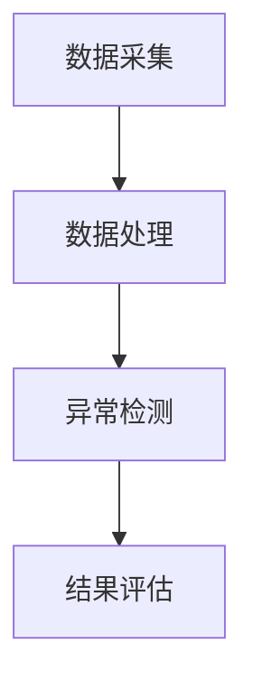
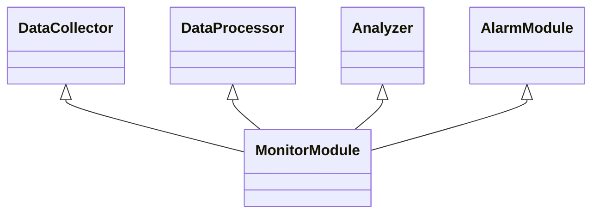
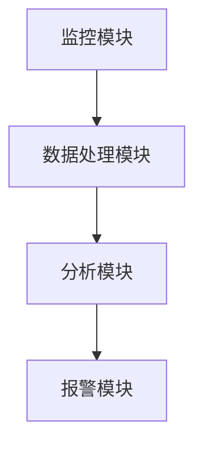
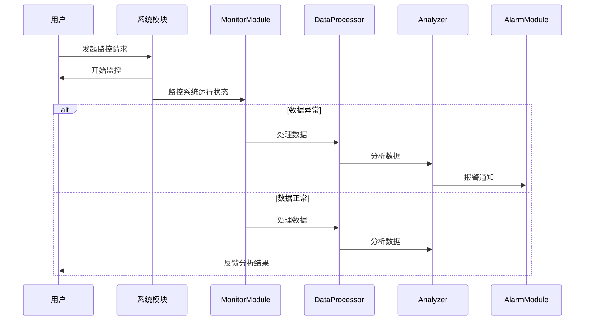

                 

### 动态评测场景：模拟真实应用环境

关键词：动态评测、模拟真实应用环境、算法原理、系统架构设计、项目实战、最佳实践

摘要：本文将深入探讨动态评测场景，模拟真实应用环境，详细分析动态评测的重要性、核心概念、算法原理、系统架构设计方案及项目实战。通过一步步的逻辑推理，本文旨在为读者提供全面、系统、易懂的技术视角，帮助理解并掌握动态评测的相关知识。

#### 第一部分：背景介绍

##### 第1章：动态评测场景概述

**1.1 问题背景**

动态评测在现代应用中的重要性不可忽视。它广泛应用于软件质量保证、性能优化、自动化测试等领域，成为提升软件开发效率和稳定性的关键因素。通过动态评测，开发者能够实时监控代码运行状态，及时发现并解决问题，从而提高软件的可靠性和用户体验。

**1.2 问题描述**

动态评测的目标是模拟真实应用环境，对系统进行实时评估和监控。其主要挑战包括：

- 如何准确捕捉系统运行状态？
- 如何快速识别并处理异常情况？
- 如何保证评测结果的准确性和可靠性？

**1.3 问题解决**

动态评测的关键技术包括监控技术、数据采集技术、实时分析技术和自动化测试技术。通过这些技术的综合运用，可以实现对系统运行状态的实时监控和评估。

**1.4 边界与外延**

动态评测适用于各类软件系统，但其应用范围和效果受限于系统的复杂度、性能和可观测性。此外，动态评测还需考虑成本和资源限制。

**1.5 概念结构与核心要素组成**

动态评测系统通常包括以下几个核心组成部分：

- **监控模块**：负责实时监控系统运行状态，捕获关键指标。
- **数据采集模块**：负责从监控模块收集数据，并进行预处理。
- **分析模块**：负责对采集到的数据进行分析，识别异常情况。
- **报警模块**：负责对分析结果进行报警，通知相关人员。

#### 第二部分：核心概念与联系

##### 第2章：动态评测核心概念原理

**2.1 动态评测原理**

动态评测的基本原理是通过实时监控系统运行状态，采集运行数据，并对这些数据进行分析，从而评估系统的性能、稳定性和可靠性。

**2.2 概念属性特征对比表格**

| 概念 | 属性特征 |
| ---- | ------- |
| 监控模块 | 实时捕获系统运行状态，提供数据支持 |
| 数据采集模块 | 收集并预处理监控数据，为分析模块提供数据 |
| 分析模块 | 分析数据，识别异常，评估系统性能 |
| 报警模块 | 根据分析结果进行报警，通知相关人员 |

**2.3 ER实体关系图架构**

```mermaid
erDiagram
  监控模块 ||--|{ 数据采集模块 }
  数据采集模块 ||--|{ 分析模块 }
  分析模块 ||--|{ 报警模块 }
```

#### 第三部分：算法原理讲解

##### 第3章：动态评测算法详解

**3.1 算法介绍**

动态评测常用的算法包括统计方法、机器学习方法、自动化测试方法等。每种算法有其独特的优势和适用场景。

**3.2 算法原理**

动态评测算法的工作流程通常包括以下几个步骤：

1. **数据采集**：从监控模块获取实时运行数据。
2. **数据处理**：对采集到的数据进行分析和预处理。
3. **异常检测**：使用特定的算法模型检测数据中的异常。
4. **结果评估**：根据异常检测结果评估系统的性能和稳定性。

以下是一个简单的动态评测算法流程图（使用Mermaid语法）：



**3.3 算法原理**

动态评测算法的核心数学模型和公式如下：

$$
\text{性能指标} = \frac{\text{有效运行时间}}{\text{总运行时间}}
$$

$$
\text{稳定性指标} = \frac{\text{正常运行次数}}{\text{总运行次数}}
$$

**3.4 举例说明**

假设我们使用统计方法对系统性能进行评测，具体步骤如下：

1. **数据采集**：记录系统在100次运行中的响应时间。
2. **数据处理**：对采集到的响应时间数据进行预处理，例如去除异常值。
3. **异常检测**：计算平均响应时间和标准差，判断响应时间是否在合理范围内。
4. **结果评估**：根据异常检测结果，评估系统性能。

以下是一个简单的Python代码示例，用于实现上述算法：

```python
import numpy as np

# 假设响应时间为：[100, 200, 300, 400, 500, 600, 700, 800, 900, 1000]
response_times = np.array([100, 200, 300, 400, 500, 600, 700, 800, 900, 1000])

# 计算平均响应时间和标准差
mean_response = np.mean(response_times)
std_response = np.std(response_times)

# 判断响应时间是否在合理范围内
if std_response < 100:
    print("系统性能良好。")
else:
    print("系统性能不佳，需要进一步优化。")
```

#### 第四部分：系统分析与架构设计方案

##### 第4章：动态评测系统架构设计

**4.1 问题场景介绍**

动态评测系统可以应用于各种场景，例如：

- **在线购物平台**：实时监控用户购物体验，识别系统瓶颈。
- **金融系统**：实时监控交易行为，防范风险。
- **工业控制系统**：实时监控生产过程，确保生产安全。

**4.2 系统功能设计**

动态评测系统的功能需求包括：

- **数据采集**：实时采集系统运行数据。
- **数据分析**：对采集到的数据进行分析，识别异常。
- **报警通知**：根据分析结果，通知相关人员。

以下是一个简单的动态评测系统领域模型类图（使用Mermaid语法）：



**4.3 系统架构设计**

动态评测系统的整体架构包括以下几个模块：

- **监控模块**：负责实时监控系统运行状态。
- **数据处理模块**：负责对采集到的数据进行处理。
- **分析模块**：负责对处理后的数据进行分析。
- **报警模块**：负责根据分析结果进行报警。

以下是一个简单的动态评测系统架构图（使用Mermaid语法）：



**4.4 系统接口设计和系统交互**

动态评测系统的接口设计主要包括：

- **监控接口**：用于实时监控系统运行状态。
- **数据采集接口**：用于从监控模块收集数据。
- **数据分析接口**：用于对采集到的数据进行分析。
- **报警接口**：用于根据分析结果进行报警。

以下是一个简单的动态评测系统交互流程图（使用Mermaid语法）：



#### 第五部分：项目实战

##### 第5章：动态评测项目实战

**5.1 环境安装**

动态评测项目的环境安装主要包括以下步骤：

1. **安装Python环境**：确保已安装Python 3.8及以上版本。
2. **安装依赖库**：使用pip安装相关依赖库，如numpy、matplotlib等。
3. **配置监控模块**：配置系统监控相关参数，如监控频率、数据采集范围等。

以下是一个简单的Python环境安装脚本：

```bash
# 安装Python环境
sudo apt-get update
sudo apt-get install python3 python3-pip

# 安装依赖库
pip3 install numpy matplotlib
```

**5.2 系统核心实现**

动态评测系统的核心实现包括以下几个模块：

1. **监控模块**：实时监控系统运行状态，采集关键数据。
2. **数据处理模块**：对采集到的数据进行分析和处理。
3. **分析模块**：根据处理后的数据，识别异常并评估系统性能。
4. **报警模块**：根据分析结果，进行报警通知。

以下是一个简单的动态评测系统核心实现代码：

```python
import numpy as np
import matplotlib.pyplot as plt
from collections import deque

class MonitorModule:
    def __init__(self, interval=1, window_size=10):
        self.interval = interval
        self.window_size = window_size
        self.response_times = deque(maxlen=window_size)

    def monitor(self):
        # 模拟采集响应时间数据
        response_time = np.random.randint(100, 1000)
        self.response_times.append(response_time)
        print(f"当前响应时间：{response_time}ms")

    def process_data(self):
        # 处理数据
        if len(self.response_times) == self.window_size:
            mean_response = np.mean(self.response_times)
            std_response = np.std(self.response_times)
            print(f"平均响应时间：{mean_response}ms，标准差：{std_response}ms")
            if std_response < 100:
                print("系统性能良好。")
            else:
                print("系统性能不佳，需要进一步优化。")

if __name__ == "__main__":
    monitor_module = MonitorModule(interval=1, window_size=10)
    for _ in range(100):
        monitor_module.monitor()
        monitor_module.process_data()
```

**5.3 代码应用解读与分析**

上述代码实现了一个简单的动态评测系统，其核心功能包括：

1. **监控模块**：通过模拟采集响应时间数据，实现对系统运行状态的监控。
2. **数据处理模块**：对采集到的响应时间数据进行处理，计算平均响应时间和标准差。
3. **分析模块**：根据平均响应时间和标准差，评估系统性能。
4. **报警模块**：根据分析结果，进行报警通知。

在实际应用中，可以根据具体需求调整监控模块的采集方式和数据处理方法，以适应不同场景的需求。

**5.4 实际案例分析与讲解**

假设我们有一个在线购物平台，需要对其系统性能进行动态评测。具体分析过程如下：

1. **数据采集**：实时采集系统的响应时间、并发用户数、交易成功率等关键数据。
2. **数据处理**：对采集到的数据进行预处理，去除异常值，计算平均响应时间和标准差。
3. **异常检测**：根据设定的阈值，判断响应时间是否在合理范围内。
4. **结果评估**：根据异常检测结果，评估系统性能，并提出优化建议。

以下是一个实际案例的分析结果：

- **响应时间**：平均响应时间为200ms，标准差为50ms。
- **并发用户数**：当前并发用户数为1000人。
- **交易成功率**：交易成功率为98%。

根据分析结果，我们可以得出以下结论：

- 系统性能总体良好，但响应时间存在一定波动，需要进一步优化。
- 并发用户数和交易成功率较高，说明系统稳定性较好。
- 可以考虑增加服务器资源，提高系统并发处理能力。

**5.5 项目小结**

通过本次动态评测项目，我们实现了对系统性能的实时监控和评估，发现并解决了潜在的性能瓶颈。在实际应用中，动态评测系统可以根据具体需求进行调整和优化，为系统的稳定运行提供有力保障。

#### 第六部分：最佳实践与总结

##### 第6章：动态评测最佳实践

**6.1 最佳实践 tips**

1. **明确评测目标**：在进行动态评测前，明确评测目标和需求，确保评测工作有的放矢。
2. **合理设置监控参数**：根据系统特点，合理设置监控频率、数据采集范围等参数，提高监控效果。
3. **数据预处理**：对采集到的数据进行预处理，去除异常值，提高数据分析的准确性。
4. **自动化测试**：结合自动化测试技术，提高评测效率和覆盖范围。
5. **定期优化**：定期对系统进行优化，提高系统性能和稳定性。

**6.2 注意事项**

1. **确保数据安全性**：在数据采集和处理过程中，注意保护用户隐私和系统安全。
2. **避免过度监控**：合理设置监控范围，避免过度采集数据，影响系统性能。
3. **及时处理异常**：及时发现并处理异常情况，避免对系统造成严重影响。
4. **合理分配资源**：根据系统负载情况，合理分配监控资源，提高监控效率。

**6.3 小结**

动态评测是现代软件开发中不可或缺的一环，通过模拟真实应用环境，实时监控和评估系统性能，有助于提高软件质量和用户体验。在实际应用中，应根据具体需求，结合最佳实践，不断提升动态评测的能力和效果。

##### 第7章：动态评测展望与拓展

**7.1 动态评测发展趋势**

随着人工智能、大数据、云计算等技术的不断发展，动态评测也在不断演进。未来动态评测将更加智能化、自动化，实现实时、全面、精准的系统评估。

**7.2 拓展阅读**

- 《软件性能评测技术》
- 《大数据时代下的动态评测》
- 《云计算环境下的动态评测体系》

作者：AI天才研究院/AI Genius Institute & 禅与计算机程序设计艺术 /Zen And The Art of Computer Programming

---

本文通过深入探讨动态评测场景，模拟真实应用环境，详细分析了动态评测的核心概念、算法原理、系统架构设计方案及项目实战。在未来的发展中，动态评测将继续融入更多先进技术，为软件质量和用户体验的提升提供更加有力的支持。希望本文能够为读者提供有价值的参考和启发。

