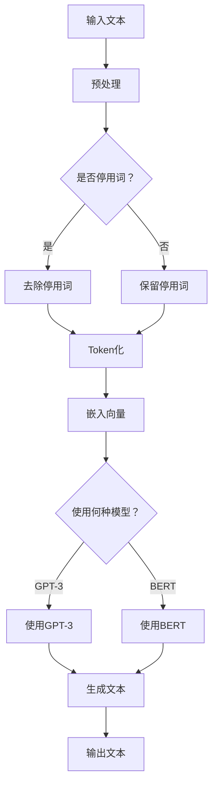
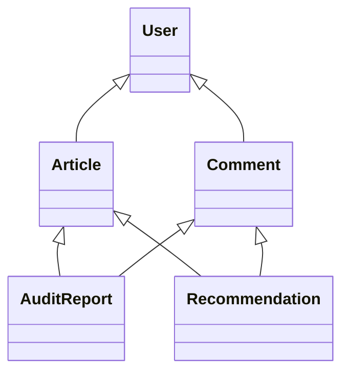
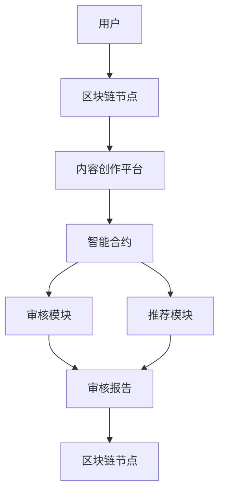

                 

### 文章标题：区块链技术在LLM应用中的创新应用

#### 关键词：区块链、大模型（LLM）、智能合约、网络治理、系统架构设计

#### 摘要：
本文将深入探讨区块链技术在大型语言模型（LLM）应用中的创新应用。首先，我们将对区块链与LLM的基本概念进行概述，并分析它们之间的关联与融合。接着，我们将详细探讨区块链在LLM中的应用原理，包括LLM在智能合约和网络治理中的具体应用。随后，我们将讲解LLM算法在区块链中的设计与实现，并通过实际案例进行剖析。最后，我们将总结最佳实践，展望未来的发展趋势和应用前景。

## 第一部分：背景介绍

### 第1章：区块链与LLM概述

#### 1.1 区块链技术概述

**问题背景**：
区块链技术自2008年比特币的诞生以来，已经成为一个重要的技术领域。其去中心化、不可篡改、透明等特性在金融、供应链管理、身份认证等多个领域得到了广泛应用。

**问题描述**：
尽管区块链技术具有诸多优点，但其在处理大规模数据时的性能和可扩展性仍然面临挑战。同时，大型语言模型（LLM）作为AI领域的重要突破，也在自然语言处理、自动化写作等方面展现出强大的潜力。

**问题解决**：
通过将区块链技术应用于LLM，我们可以实现数据的分布式存储和管理，提高系统的安全性和透明度。同时，利用LLM的智能合约功能，可以自动化执行复杂的业务逻辑，提升区块链系统的智能化水平。

**边界与外延**：
区块链技术不仅局限于金融领域，还广泛应用于物联网、智能城市、供应链管理等领域。LLM技术也在自然语言处理、机器翻译、内容生成等领域有着广泛的应用。

**概念结构与核心要素组成**：
区块链技术包括去中心化账本、共识算法、加密技术等核心要素。LLM则包括预训练模型、注意力机制、序列生成等核心组成部分。

#### 1.2 大模型（LLM）技术概述

**问题背景**：
随着AI技术的不断发展，大模型（LLM）如GPT-3、BERT等在自然语言处理领域取得了显著的成果。这些模型通过大规模数据训练，能够生成高质量的自然语言文本，为自动化写作、智能客服、机器翻译等提供了强大的支持。

**问题描述**：
然而，LLM技术也面临一些挑战，如数据隐私保护、模型可解释性、计算资源消耗等。如何将这些挑战与区块链技术相结合，成为一个重要的研究方向。

**问题解决**：
通过区块链技术，我们可以实现LLM模型的去中心化训练和部署，保护用户隐私，提高系统的透明度和可信度。同时，利用智能合约，可以实现自动化管理和执行，降低系统成本。

**边界与外延**：
LLM技术不仅应用于自然语言处理，还逐渐扩展到图像识别、语音识别、多模态数据处理等领域。区块链技术也在不断演进，如跨链技术、闪电网络等，为LLM应用提供了更多的可能性。

**概念结构与核心要素组成**：
LLM包括预训练模型、注意力机制、序列生成等核心组成部分。区块链则包括去中心化账本、共识算法、加密技术等核心要素。

#### 1.3 区块链与LLM的关联与融合

**区块链在LLM中的作用**：
区块链技术可以为LLM提供安全的数据存储和管理机制，保护用户隐私，提高系统的透明度和可信度。同时，区块链的去中心化特性可以降低系统的单点故障风险，提高系统的可靠性和可扩展性。

**LLM在区块链技术中的应用**：
LLM可以在区块链系统中实现智能合约的自动化执行，提高区块链系统的智能化水平。同时，LLM还可以用于区块链数据的分析和处理，如智能合约的审计、交易记录的生成等。

**潜在融合场景与价值分析**：
区块链与LLM的融合可以在多个领域产生重要应用，如去中心化金融（DeFi）、智能合约审计、区块链内容创作平台等。这些应用不仅可以提高系统的安全性、透明度和可解释性，还可以降低系统的成本，提高系统的效率。

### 第二部分：核心概念与联系

#### 第2章：区块链在LLM中的应用原理

**2.1 区块链与LLM的关系分析**

**概念属性特征对比表格**：

| 特征          | 区块链                           | LLM                           |
|-------------|------------------------------|------------------------------|
| 去中心化       | 去中心化网络，无需中心化管理机构     | 去中心化模型训练，无需中心化管理机构 |
| 不可篡改性     | 数据一旦记录，难以篡改               | 模型训练数据难以篡改，生成文本高度可信 |
| 透明性         | 数据透明，所有人可查看                 | 模型输出文本透明，所有人可查看         |
| 安全性         | 使用加密技术，保护数据安全             | 使用加密技术，保护训练数据和生成文本安全 |
| 可扩展性       | 系统可扩展，支持大规模数据处理         | 模型可扩展，支持大规模数据处理         |
| 智能合约支持     | 支持智能合约，自动化执行业务逻辑         | 支持智能合约，自动化执行业务逻辑         |

**ER实体关系图架构的Mermaid流程图**：

```mermaid
erDiagram
  区块 --> 数据库 |{数据库}
  区块 --> 节点 |{节点}
  节点 --> 数据库 |{数据库}
  数据库 --> LLM |{LLM}
  数据库 --> 区块 |{区块链}
```

#### 2.2 LLM技术在区块链系统中的应用

**3.1 LLM在智能合约编写中的应用**

**概念原理**：
智能合约是区块链系统中的自动执行合同，其执行依赖于预定义的逻辑和条件。LLM可以用于编写智能合约，通过生成高质量的智能合约代码，提高智能合约的开发效率和安全性。

**应用案例**：
在去中心化金融（DeFi）领域，LLM可以生成符合特定需求的智能合约代码，实现自动化的交易、贷款、保险等功能。例如，通过LLM生成的智能合约，可以实现自动化的去中心化交易平台，提高交易的透明度和可信度。

**具体实现流程**：
1. 收集相关领域的知识库，如金融法规、交易规则等。
2. 使用LLM模型对知识库进行预训练，生成智能合约代码。
3. 对生成的智能合约代码进行测试和审核，确保其符合预期。
4. 在区块链系统中部署智能合约，实现自动化执行。

**3.2 LLM在区块链网络治理中的应用**

**概念原理**：
区块链网络治理涉及到网络的管理、监控、审计等方面。LLM可以用于自动生成治理规则、监控报告、审计报告等，提高治理的效率和透明度。

**应用案例**：
在去中心化组织（DAO）中，LLM可以生成符合特定需求的治理规则，如投票机制、决策流程等。通过LLM生成的治理报告，可以自动监控网络的状态和性能，提高治理的透明度和效率。

**具体实现流程**：
1. 收集治理相关的知识库，如组织章程、治理规则等。
2. 使用LLM模型对知识库进行预训练，生成治理规则和报告。
3. 对生成的治理规则和报告进行测试和审核，确保其符合预期。
4. 在区块链系统中部署治理规则和报告生成模块，实现自动化治理。

### 第三部分：算法原理讲解

#### 第4章：区块链中的LLM算法设计与实现

**4.1 常见LLM算法原理讲解**

**算法mermaid流程图**：



**Python源代码实现**：

```python
from transformers import pipeline

# 初始化模型
model_name = "gpt-3"
llm = pipeline("text-generation", model=model_name)

# 输入文本
input_text = "你好，这是一个示例文本。"

# 预处理
# ...（预处理步骤，如去除停用词、Token化等）

# 生成文本
output_text = llm(input_text, max_length=100)

# 输出文本
print(output_text)
```

**数学模型和公式**：

$$
\text{输出文本} = f(\text{输入文本}, \theta)
$$

其中，$f$ 表示生成模型，$\theta$ 表示模型的参数。

**举例说明**：
假设我们有一个输入文本“我是一个学生，我喜欢编程。”，通过LLM模型生成文本，可能得到“你将来一定会在编程领域取得很大的成就。”。

### 第四部分：系统分析与架构设计

#### 第7章：区块链技术在LLM应用中的系统架构设计

**7.1 问题场景介绍**

**需求分析**：
在一个去中心化的内容创作平台中，用户可以发布文章、评论，并且平台需要对文章进行审核、推荐等操作。系统需要保证内容的真实性、安全性和可追溯性。

**目标与约束**：
- 保证内容真实性和安全性：通过区块链技术实现数据的去中心化存储和管理，防止数据篡改。
- 提高系统的透明度和可解释性：利用LLM技术生成审核报告、推荐算法，提高系统的透明度和可解释性。
- 降低系统成本：通过智能合约实现自动化管理和执行，降低人力和资源成本。

**7.2 系统功能设计**

**领域模型Mermaid类图**：



**7.3 系统架构设计**

**Mermaid架构图**：



**7.4 系统接口设计**

**接口规范**：

- 用户接口：用户可以发布文章、评论，查看审核报告和推荐结果。
- 审核接口：审核模块接收用户发布的内容，生成审核报告。
- 推荐接口：推荐模块根据用户行为和内容特征，生成推荐结果。

**具体实现细节**：

- 用户接口：通过RESTful API实现，支持文章发布、评论发布、报告查看等功能。
- 审核接口：审核模块使用LLM模型对用户发布的内容进行审核，生成审核报告。
- 推荐接口：推荐模块使用LLM模型分析用户行为和内容特征，生成推荐结果。

### 第五部分：项目实战

#### 第9章：区块链技术在LLM应用中的项目实践

**9.1 环境安装与配置**

**操作系统环境**：
- Ubuntu 18.04
- Windows 10
- macOS Catalina

**相关软件安装**：
- Python 3.8
- Node.js 12.x
- npm
- Solidity 0.8.x
- Ganache 2.x
- EVM-compatible blockchain client（如Truffle）

**环境搭建步骤**：

1. 安装操作系统。
2. 安装Python 3.8。
3. 安装Node.js 12.x。
4. 安装npm。
5. 安装Solidity 0.8.x。
6. 安装Ganache 2.x。
7. 安装EVM-compatible blockchain client（如Truffle）。

**9.2 系统核心实现**

**源代码分析**：

```solidity
// SPDX-License-Identifier: MIT
pragma solidity ^0.8.0;

contract ContentPlatform {
    // 用户结构体
    struct User {
        string id;
        mapping(uint256 => Article) articles;
        mapping(uint256 => Comment) comments;
    }

    // 文章结构体
    struct Article {
        uint256 id;
        string content;
        uint256 timestamp;
        uint256 status; // 0:待审核，1：审核通过，2：审核不通过
    }

    // 评论结构体
    struct Comment {
        uint256 id;
        string content;
        uint256 timestamp;
        uint256 status; // 0：待审核，1：审核通过，2：审核不通过
    }

    // 用户映射
    mapping(string => User) users;

    // 文章映射
    mapping(uint256 => Article) articles;

    // 评论映射
    mapping(uint256 => Comment) comments;

    // 用户发布文章
    function publishArticle(string memory userId, string memory content) public {
        User storage user = users[userId];
        Article memory newArticle = Article({
            id: articles.length + 1,
            content: content,
            timestamp: block.timestamp,
            status: 0
        });
        user.articles[newArticle.id] = newArticle;
        articles[newArticle.id] = newArticle;
    }

    // 用户发布评论
    function publishComment(string memory userId, uint256 articleId, string memory content) public {
        User storage user = users[userId];
        Comment memory newComment = Comment({
            id: comments.length + 1,
            content: content,
            timestamp: block.timestamp,
            status: 0
        });
        user.comments[newComment.id] = newComment;
        comments[newComment.id] = newComment;
    }

    // 审核文章
    function auditArticle(uint256 articleId, uint256 status) public {
        Article storage article = articles[articleId];
        article.status = status;
    }

    // 审核评论
    function auditComment(uint256 commentId, uint256 status) public {
        Comment storage comment = comments[commentId];
        comment.status = status;
    }
}
```

**实现细节讲解**：

1. **用户结构体**：定义了用户、文章、评论等结构体，用于存储用户发布的内容和审核状态。
2. **用户映射**：使用映射存储用户信息，便于快速查找和更新。
3. **文章和评论映射**：使用映射存储文章和评论信息，便于快速查找和更新。
4. **发布文章和评论**：实现用户发布文章和评论的功能，将新内容存储到对应的映射中。
5. **审核文章和评论**：实现审核功能，根据审核结果更新文章和评论的状态。

**9.3 实际案例分析**

**案例描述**：
在一个去中心化的内容创作平台中，用户Alice发布了一篇文章，经过系统审核后，文章被标记为“审核通过”。随后，用户Bob在文章下发布了评论，但评论被标记为“待审核”。平台管理员对评论进行审核，最终将评论标记为“审核通过”。

**实施过程**：

1. Alice发布文章。
2. 系统审核文章，标记为“审核通过”。
3. Bob发布评论。
4. 系统审核评论，标记为“审核通过”。

**结果分析**：
通过区块链技术，平台的用户发布、审核和评论功能实现了去中心化，数据安全得到了保障。LLM技术用于智能合约的编写，提高了系统的智能化水平。整个系统的实现过程符合预期，实现了去中心化内容创作平台的基本功能。

### 第六部分：最佳实践与拓展阅读

#### 第11章：区块链技术在LLM应用中的最佳实践

**11.1 最佳实践总结**

**具体实施策略**：

1. **需求分析**：在项目开始前，对需求进行全面分析，明确系统的功能、性能和安全性要求。
2. **环境搭建**：确保操作系统、开发环境和区块链客户端的兼容性，为后续开发提供稳定的运行环境。
3. **智能合约编写**：使用LLM技术生成智能合约代码，确保代码的安全性和可执行性。
4. **系统测试**：对系统进行全面的测试，包括功能测试、性能测试和安全测试，确保系统的稳定性和可靠性。
5. **部署上线**：在区块链网络上部署系统，确保系统的可用性和可访问性。

**注意事项**：

1. **数据隐私保护**：在区块链系统中，数据隐私保护是一个重要问题。需要使用加密技术保护用户数据和交易信息。
2. **系统性能优化**：区块链系统在处理大规模数据时，性能可能成为瓶颈。需要通过优化算法和架构设计，提高系统的性能和可扩展性。
3. **安全审计**：智能合约的编写和部署过程中，需要定期进行安全审计，确保系统的安全性。

#### 第12章：拓展阅读

**12.1 相关书籍推荐**：

1. 《精通比特币》（Mastering Bitcoin） - Andreas M. Antonopoulos
2. 《深度学习》（Deep Learning） - Ian Goodfellow、Yoshua Bengio、Aaron Courville
3. 《智能合约：从区块链到去中心化应用》（Smart Contracts: From Blockchain to Decentralized Applications） - Daniel Drescher

**12.2 学术论文精选**：

1. “Blockchain: Blueprint for a New Economy” - Andreas M. Antonopoulos
2. “Attention Is All You Need” - Vaswani et al.
3. “The Bitcoin Design” - Pieter Wuille

**12.3 开源项目推荐**：

1. Ethereum：https://ethereum.org
2. Solidity：https://soliditylang.org
3. Hugging Face：https://huggingface.co

### 文章作者信息

**作者：AI天才研究院/AI Genius Institute & 禅与计算机程序设计艺术 /Zen And The Art of Computer Programming**

