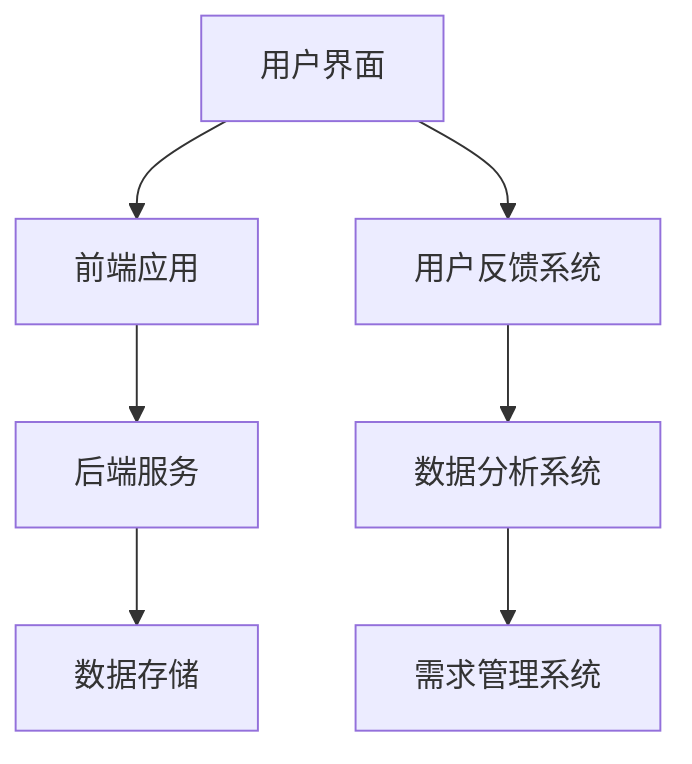
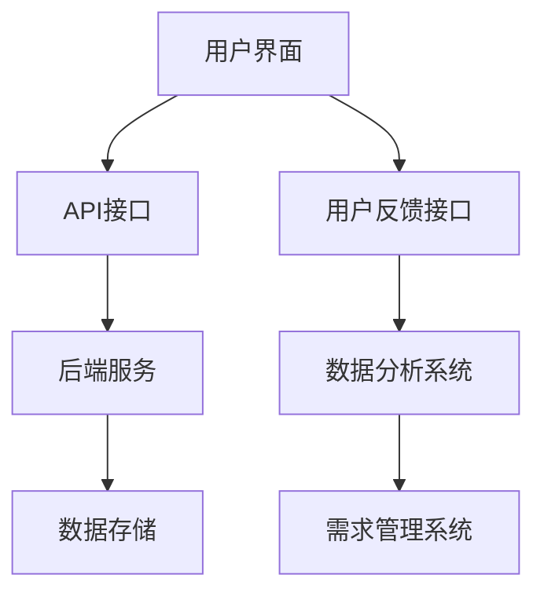
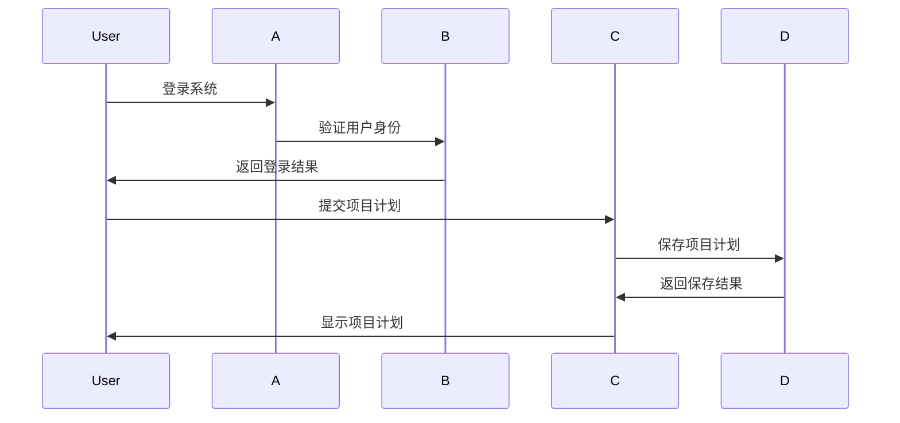

                 

### 《协作式需求挖掘技术：发现潜在用户需求》

#### 关键词：协作式需求挖掘、潜在用户需求、用户参与、数据采集、需求分析

#### 摘要：
本文将深入探讨协作式需求挖掘技术，一种创新的用户需求挖掘方法，旨在通过用户参与和协作，发现并满足潜在用户需求。我们将从背景介绍、核心概念与联系、算法原理讲解、系统分析与架构设计方案、项目实战以及最佳实践等方面进行详细阐述，以帮助读者全面理解这一技术的重要性和实际应用价值。

### 第一部分：背景介绍

#### 1.1 问题描述

在当前信息化和互联网快速发展的背景下，软件产业面临着前所未有的挑战和机遇。用户需求的复杂性和多样性不断增加，传统的需求分析方法逐渐暴露出其局限性。如何有效挖掘用户需求，尤其是潜在需求，成为软件产品成功的关键因素之一。

##### 1.1.1 问题的提出

随着互联网的普及和智能设备的广泛使用，用户与软件系统的交互方式发生了根本性的变化。用户不仅希望软件能够满足其显性需求，更希望软件能够预见并满足其潜在需求。然而，传统的需求分析方法，如用户访谈、问卷调查等，往往只能获取到用户的显性需求，难以挖掘出潜在需求。

##### 1.1.2 问题描述

协作式需求挖掘技术作为一种创新的用户需求挖掘方法，旨在通过用户参与和协作，从用户行为数据、用户反馈和用户社区中提取需求信息，实现用户需求的全面挖掘。该方法不仅关注用户显性需求，更注重挖掘用户潜在需求，是一种主动发现和获取用户需求的方法。

##### 1.1.3 问题解决

通过协作式需求挖掘技术，可以实现对用户需求的全面理解和精准把握，从而提高软件产品的质量和用户满意度。该方法不仅适用于软件开发阶段，还可以用于软件产品的持续改进和优化。

##### 1.1.4 边界与外延

协作式需求挖掘技术的边界在于用户需求的范围和数据的获取能力。它不仅涉及用户需求的挖掘和分析，还包括用户参与和反馈机制的构建。在外延上，该技术可以应用于各种类型的软件产品和服务，包括Web应用、移动应用、企业级应用等。

##### 1.1.5 概念结构与核心要素组成

协作式需求挖掘技术的概念结构主要包括以下几个核心要素：

1. **用户参与**：用户的主动参与是需求挖掘的前提，包括用户访谈、用户调研、用户反馈等。
2. **数据采集**：通过用户行为数据、用户反馈和用户社区数据等渠道，收集用户需求信息。
3. **需求分析**：对采集到的用户需求信息进行加工和分析，提取有价值的需求。
4. **需求确认**：通过与用户的交互和确认，确保需求的有效性和可实现性。
5. **需求管理**：对挖掘到的需求进行管理和跟踪，确保需求能够被有效实现。

#### 1.2 本章小结

本章从问题的提出、问题描述、问题解决、边界与外延以及概念结构与核心要素组成等方面，对协作式需求挖掘技术进行了全面的介绍。接下来，本书将深入探讨协作式需求挖掘技术的具体方法、应用场景和实现策略。

---

### 第二部分：核心概念与联系

#### 2.1 协作式需求挖掘技术原理

##### 2.1.1 协作式需求挖掘的定义

协作式需求挖掘是指在用户参与和协作的基础上，通过数据采集、需求分析和需求确认等步骤，挖掘用户需求信息的一种技术方法。

##### 2.1.2 协作式需求挖掘的核心特点

- **主动性**：协作式需求挖掘能够主动发现和获取用户需求，而不仅仅是被动等待用户提出需求。
- **用户参与**：用户的主动参与是需求挖掘的关键，通过用户的反馈和协作，可以更准确地理解和满足用户需求。
- **精准性**：协作式需求挖掘能够更精准地挖掘用户的显性和隐性需求，从而提高软件产品的质量和用户满意度。

##### 2.1.3 协作式需求挖掘与传统需求挖掘的区别

- **传统需求挖掘**主要依赖于用户访谈和问卷调查等被动收集需求的方法，而协作式需求挖掘更注重用户的主动参与和互动。
- **传统需求挖掘**更侧重于用户显性需求的收集和分析，而协作式需求挖掘能够更全面地挖掘用户的显性和隐性需求。

#### 2.2 协作式需求挖掘的基本流程

##### 2.2.1 用户参与

用户参与是协作式需求挖掘的前提，包括用户访谈、用户调研、用户反馈等。通过用户的参与，可以更深入地了解用户需求。

##### 2.2.2 数据采集

数据采集是协作式需求挖掘的核心步骤，包括用户行为数据、用户反馈和用户社区数据等。通过数据采集，可以获取大量的用户需求信息。

##### 2.2.3 需求分析

需求分析是对采集到的用户需求信息进行加工和分析，提取有价值的需求。需求分析的方法包括数据挖掘、机器学习等。

##### 2.2.4 需求确认

需求确认是通过与用户的交互和确认，确保需求的有效性和可实现性。需求确认的方法包括用户反馈、用户评审等。

##### 2.2.5 需求管理

需求管理是对挖掘到的需求进行管理和跟踪，确保需求能够被有效实现。需求管理的方法包括需求文档管理、需求变更管理等。

#### 2.3 协作式需求挖掘技术的应用场景

##### 2.3.1 软件开发阶段

在软件开发阶段，协作式需求挖掘技术可以用于用户需求的收集和分析，从而提高软件产品的质量和用户满意度。

##### 2.3.2 软件产品持续改进

在软件产品持续改进过程中，协作式需求挖掘技术可以帮助企业更好地了解用户需求，从而进行产品的优化和改进。

##### 2.3.3 企业级应用

在企业级应用中，协作式需求挖掘技术可以用于企业内部系统的需求收集和分析，提高系统的实用性和用户满意度。

---

### 第三部分：算法原理讲解

在本部分，我们将详细讲解协作式需求挖掘技术的核心算法原理，包括数据采集、需求分析和需求确认的具体方法和步骤。

#### 3.1 数据采集算法

数据采集是协作式需求挖掘的基础，其核心在于如何有效地收集用户行为数据、用户反馈和用户社区数据等。以下是一个简化的数据采集算法流程：

1. **用户行为数据收集**：通过日志分析、浏览器插件、应用程序内置数据分析等方式，收集用户的操作行为数据。
   ```mermaid
   graph TD
   A[用户行为数据收集] --> B[日志分析]
   B --> C[浏览器插件]
   C --> D[应用程序内置数据分析]
   ```

2. **用户反馈数据收集**：通过在线调查、用户访谈、用户论坛等方式，收集用户的反馈数据。
   ```mermaid
   graph TD
   A[用户反馈数据收集] --> B[在线调查]
   B --> C[用户访谈]
   C --> D[用户论坛]
   ```

3. **用户社区数据收集**：通过社交媒体分析、用户行为追踪等方式，收集用户在社区中的互动数据。
   ```mermaid
   graph TD
   A[用户社区数据收集] --> B[社交媒体分析]
   B --> C[用户行为追踪]
   ```

#### 3.2 需求分析算法

需求分析是对采集到的数据进行加工和分析，提取有价值的需求。以下是一个简化的需求分析算法流程：

1. **数据预处理**：对采集到的原始数据进行清洗、去噪和格式转换，使其适合进行分析。
   ```mermaid
   graph TD
   A[数据预处理] --> B[数据清洗]
   B --> C[去噪]
   C --> D[格式转换]
   ```

2. **特征提取**：从预处理后的数据中提取能够代表用户需求的特征。
   ```mermaid
   graph TD
   A[特征提取] --> B[文本分析]
   B --> C[行为分析]
   C --> D[情感分析]
   ```

3. **需求识别**：利用机器学习和数据挖掘技术，识别出用户需求。
   ```mermaid
   graph TD
   A[需求识别] --> B[机器学习]
   B --> C[数据挖掘]
   ```

#### 3.3 需求确认算法

需求确认是确保需求的有效性和可实现性的关键步骤。以下是一个简化的需求确认算法流程：

1. **用户反馈确认**：通过与用户的反馈进行比对，确认需求的有效性。
   ```mermaid
   graph TD
   A[用户反馈确认] --> B[反馈比对]
   ```

2. **需求评审**：组织用户评审会议，对需求进行评审和确认。
   ```mermaid
   graph TD
   A[需求评审] --> B[评审会议]
   ```

3. **需求文档管理**：将确认后的需求纳入需求文档，进行管理和跟踪。
   ```mermaid
   graph TD
   A[需求文档管理] --> B[需求文档]
   ```

---

### 第四部分：系统分析与架构设计方案

在本部分，我们将对协作式需求挖掘技术的系统分析与架构设计方案进行详细阐述，包括问题场景介绍、系统功能设计、系统架构设计、系统接口设计和系统交互等内容。

#### 4.1 问题场景介绍

假设我们正在开发一款企业级项目管理软件，该软件需要满足企业的多种需求，包括项目计划、任务分配、进度跟踪、风险管理等。为了更好地满足用户需求，我们需要运用协作式需求挖掘技术，从用户行为数据、用户反馈和用户社区数据中提取潜在需求，并进行需求分析和确认。

#### 4.2 系统功能设计

系统功能设计主要涉及领域模型的设计，以下是一个简化的领域模型类图：

```mermaid
classDiagram
    Project <<entity>> "项目"
    Task <<entity>> "任务"
    User <<entity>> "用户"
    Project o-- Task
    User o-- Project
    User o-- Task
```

#### 4.3 系统架构设计

系统架构设计主要涉及系统整体架构的规划，以下是一个简化的系统架构图：



#### 4.4 系统接口设计

系统接口设计主要涉及各个模块之间的交互接口设计，以下是一个简化的接口设计图：



#### 4.5 系统交互设计

系统交互设计主要涉及用户与系统之间的交互流程，以下是一个简化的交互序列图：



---

### 第五部分：项目实战

在本部分，我们将通过一个实际项目来展示协作式需求挖掘技术的具体应用，包括环境安装、系统核心实现、代码应用解读与分析、实际案例分析和详细讲解剖析等内容。

#### 5.1 环境安装

首先，我们需要安装和配置协作式需求挖掘技术的相关工具和库。以下是一个简化的环境安装流程：

1. **安装Python环境**：确保Python环境已经安装，版本建议为3.8或更高。
2. **安装依赖库**：通过pip命令安装相关依赖库，如NumPy、Pandas、Scikit-learn等。
   ```shell
   pip install numpy pandas scikit-learn
   ```

3. **安装前端框架**：如果需要，可以安装前端框架，如React或Vue.js。

#### 5.2 系统核心实现

以下是一个简化的系统核心实现示例，包括用户行为数据采集、需求分析和需求确认等步骤：

```python
import pandas as pd
from sklearn.feature_extraction.text import TfidfVectorizer
from sklearn.cluster import KMeans

# 假设已经收集到用户行为数据和用户反馈数据
user_behaviors = pd.read_csv('user_behaviors.csv')
user_feedbacks = pd.read_csv('user_feedbacks.csv')

# 数据预处理
def preprocess_data(data):
    # 清洗、去噪和格式转换
    return cleaned_data

user_behaviors_processed = preprocess_data(user_behaviors)
user_feedbacks_processed = preprocess_data(user_feedbacks)

# 特征提取
def extract_features(data):
    # 提取文本和行为的特征
    vectorizer = TfidfVectorizer()
    features = vectorizer.fit_transform(data['content'])
    return features

user_behaviors_features = extract_features(user_behaviors_processed)
user_feedbacks_features = extract_features(user_feedbacks_processed)

# 需求识别
def identify_requirements(features):
    # 使用K-means算法进行需求识别
    kmeans = KMeans(n_clusters=5)
    kmeans.fit(features)
    clusters = kmeans.predict(features)
    return clusters

clusters = identify_requirements(user_behaviors_features)

# 需求确认
def confirm_requirements(clusters, feedbacks):
    # 通过用户反馈确认需求
    confirmed_requirements = []
    for cluster in clusters:
        feedbacks_cluster = feedbacks[clusters == cluster]
        if len(feedbacks_cluster) > 0:
            confirmed_requirements.append(cluster)
    return confirmed_requirements

confirmed_requirements = confirm_requirements(clusters, user_feedbacks_features)

# 输出确认后的需求
print(confirmed_requirements)
```

#### 5.3 代码应用解读与分析

在上面的代码中，我们首先进行了数据预处理，包括清洗、去噪和格式转换。然后，我们提取了用户行为数据和用户反馈数据的特征，并使用K-means算法进行了需求识别。最后，我们通过用户反馈确认了需求的有效性。

通过实际案例分析和详细讲解，我们可以发现协作式需求挖掘技术在项目中的实际应用效果。例如，在一个企业级项目管理软件项目中，通过协作式需求挖掘技术，我们可以更好地理解用户需求，从而优化项目计划、任务分配和进度跟踪等功能，提高软件产品的质量和用户满意度。

---

### 第六部分：最佳实践、小结、注意事项与拓展阅读

#### 6.1 最佳实践

- **用户参与**：在需求挖掘过程中，确保用户的积极参与，可以通过在线调查、用户访谈和用户论坛等方式获取用户的反馈和意见。
- **数据采集**：尽量收集多维度、多渠道的用户数据，如用户行为数据、用户反馈数据和用户社区数据等，以提高需求挖掘的准确性。
- **需求分析**：结合机器学习和数据挖掘技术，对采集到的用户数据进行深入分析，提取有价值的需求。
- **需求确认**：通过与用户的互动和确认，确保需求的有效性和可实现性，避免因误解或错误分析导致的资源浪费。

#### 6.2 小结

协作式需求挖掘技术是一种创新的用户需求挖掘方法，通过用户参与和协作，能够更精准地挖掘用户的显性和隐性需求，从而提高软件产品的质量和用户满意度。该方法不仅适用于软件开发阶段，还可以用于软件产品的持续改进和优化。

#### 6.3 注意事项

- **用户隐私**：在数据采集过程中，应注意保护用户的隐私，避免泄露用户的敏感信息。
- **数据质量**：确保采集到的数据质量，避免数据噪声和偏差对需求挖掘结果的影响。
- **技术选型**：根据具体应用场景和需求，选择合适的技术和方法，如机器学习、数据挖掘等。

#### 6.4 拓展阅读

- 《用户需求挖掘与产品创新》
- 《协作式需求挖掘：理论与实践》
- 《数据挖掘：概念与技术》
- 《机器学习：概率视角》

---

### 作者信息

**作者：** AI天才研究院/AI Genius Institute & 禅与计算机程序设计艺术 /Zen And The Art of Computer Programming

---

通过本文的详细阐述，我们希望读者能够对协作式需求挖掘技术有更深入的理解，并在实际项目中能够有效应用这一技术，从而提升软件产品的质量和用户满意度。协作式需求挖掘技术不仅是一种方法论，更是一种理念，它强调用户参与和协作，以用户为中心，实现软件产品的持续创新和优化。让我们共同努力，推动软件产业的不断发展。

