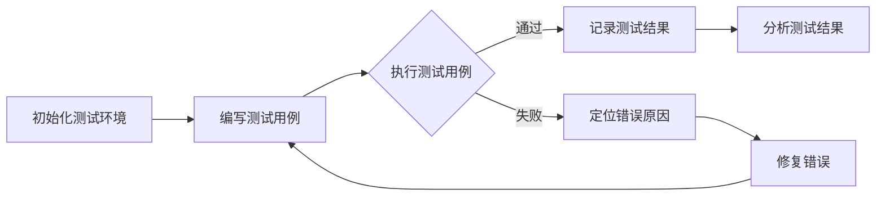
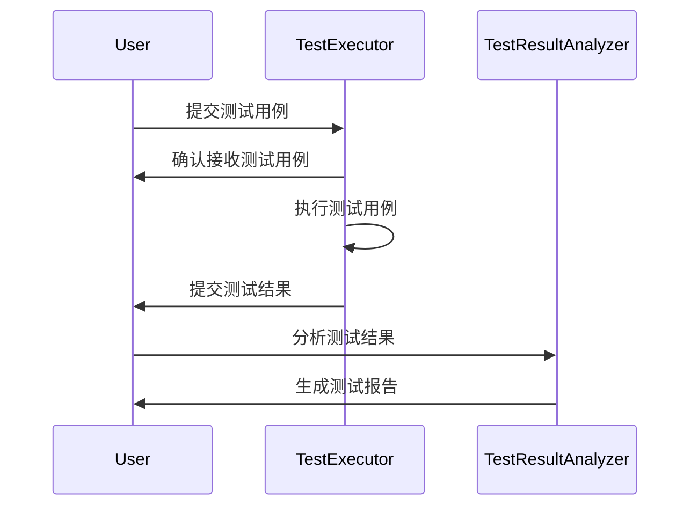

                 

**一、文章标题：**

《单元测试策略：保障LLM组件质量的基础》

**二、文章关键词：**

- 单元测试
- LLM组件
- 质量保障
- 自动化测试
- 性能优化

**三、摘要：**

本文将深入探讨单元测试策略在保障大型语言模型（LLM）组件质量方面的关键作用。通过详细分析单元测试的核心概念、原理和实践，本文旨在为开发者提供一套实用的单元测试策略，确保LLM组件的稳定性和可靠性。本文结构紧凑，逻辑清晰，适合希望提升软件质量的开发者阅读。

-------------------------------------------------------------------

## 引言

在当今快速发展的信息技术时代，人工智能（AI）已经从理论研究走向了实际应用。其中，大型语言模型（LLM）因其强大的自然语言处理能力，成为各个行业的关键技术。然而，随着LLM组件的复杂度和规模的不断增长，如何保障其质量成为了一个重要问题。本文旨在探讨单元测试策略在这一领域中的应用，为开发者提供一套有效的质量保障方法。

单元测试是软件测试过程中最为基础和重要的一环，它通过对软件中最小的功能单元进行验证，确保代码的正确性和稳定性。对于LLM组件而言，单元测试不仅能够发现代码中的错误，还能验证其性能和精度。因此，设计一套有效的单元测试策略，对于保障LLM组件的质量至关重要。

本文将围绕以下主题展开：

1. 背景介绍：明确单元测试和LLM组件的核心概念及其在软件开发中的重要性。
2. 核心概念与联系：深入剖析单元测试的原理、分类和关键要素，对比LLM组件的属性特征。
3. 算法原理讲解：详细讲解单元测试的算法原理，包括Mermaid流程图、Python源代码、数学模型和公式。
4. 系统分析与架构设计方案：介绍一个基于Python的单元测试框架，包括系统功能设计、架构设计和接口设计。
5. 项目实战：通过实际案例展示单元测试策略的应用，并进行详细解读和剖析。
6. 最佳实践与总结：总结最佳实践，强调注意事项，并提供拓展阅读建议。

希望通过本文的阅读，开发者能够更好地理解单元测试策略在保障LLM组件质量方面的重要作用，并在实际开发过程中有效应用。

### 背景介绍

#### 核心概念

**单元测试（Unit Testing）**

单元测试是软件测试中最基础的一种方法，它主要针对软件中的最小功能单元——通常是函数或方法——进行验证。单元测试的主要目标是确保每个单元都能按照预期正确运行，从而提高软件的整体质量。单元测试通常具备以下特点：

- **独立性**：每个测试用例都是独立的，不会受到其他测试用例的影响。
- **自动化**：单元测试可以通过工具自动化执行，减少人工干预，提高测试效率。
- **可重复性**：单元测试的结果可以重复执行，确保代码的稳定性和一致性。
- **快速反馈**：单元测试执行速度快，可以迅速发现代码中的问题。

**大型语言模型（LLM，Large Language Model）**

LLM是一种基于神经网络的语言处理模型，其通过大量文本数据的学习，能够理解和生成自然语言文本。LLM在自然语言处理（NLP）领域具有广泛的应用，如机器翻译、文本摘要、问答系统等。其主要特点包括：

- **高维度**：LLM处理的数据维度极高，通常包含数百万个甚至数亿个参数。
- **高复杂度**：LLM的算法复杂度较高，涉及到深度学习、优化算法等多个领域。
- **高依赖性**：LLM的性能受到数据质量、计算资源等多方面的影响。

#### 问题背景

在软件开发过程中，确保组件的质量是至关重要的。特别是在大型语言模型（LLM）的开发中，由于其复杂性和高维度性，任何代码缺陷都可能导致严重的性能下降或功能失效。因此，保障LLM组件的质量成为了开发过程中的一个关键挑战。

随着LLM组件的规模和复杂度的不断增加，传统的测试方法已经难以满足质量保障的需求。单元测试作为一种自动化、独立的测试方法，能够有效地发现和定位代码中的问题，从而保障LLM组件的稳定性和可靠性。

#### 问题描述

在LLM组件开发中，如何设计一套有效的单元测试策略，成为了一个重要的问题。具体来说，包括以下几个方面：

- **测试用例的设计和编写**：如何设计具有代表性的测试用例，覆盖LLM组件的各个功能点。
- **测试环境的搭建**：如何搭建一个稳定、可重复的测试环境，确保测试结果的可靠性。
- **测试工具的选择**：如何选择合适的测试工具，提高测试的自动化程度和效率。
- **测试结果的记录和分析**：如何记录和整理测试结果，分析测试数据，及时发现和解决问题。

#### 问题解决

为了解决上述问题，可以采取以下措施：

- **制定单元测试策略**：根据LLM组件的特点，制定一套系统的单元测试策略，明确测试的目标、方法和步骤。
- **编写高质量的测试用例**：设计具有代表性的测试用例，覆盖LLM组件的所有功能点，确保测试的全面性和有效性。
- **使用自动化测试工具**：利用自动化测试工具，提高测试的效率，减少人工干预，确保测试的可重复性。
- **持续集成和持续交付**：将单元测试集成到持续集成（CI）和持续交付（CD）流程中，确保每次代码变更都能得到及时测试和反馈。

#### 边界与外延

**边界**

- 单元测试的范围：主要针对LLM组件的最小功能单元进行验证，不涉及整体系统测试。
- 单元测试的方法：主要采用自动化测试方法，确保测试的效率和可重复性。

**外延**

- 单元测试的应用场景：除了LLM组件，单元测试也可应用于其他软件组件的质量保障。
- 单元测试与其他测试方法的结合：单元测试可以与集成测试、系统测试等其他测试方法结合，形成完整的测试体系。

#### 概念结构与核心要素组成

**单元测试的目的与意义**

单元测试的主要目的是验证软件中最小的功能单元是否按照预期正确运行，确保代码的正确性和稳定性。在LLM组件开发中，单元测试具有以下意义：

- **提高代码质量**：通过单元测试，可以及时发现和修复代码中的错误，减少bug的漏报和误报。
- **保障组件质量**：单元测试能够覆盖LLM组件的各个功能点，确保组件的稳定性和可靠性。
- **提高开发效率**：单元测试自动化执行，减少了人工测试的工作量，提高了开发效率。

**单元测试的关键要素**

- **测试用例**：设计具有代表性的测试用例，覆盖LLM组件的各个功能点。
- **测试环境**：搭建稳定、可重复的测试环境，确保测试结果的可靠性。
- **测试工具**：选择合适的测试工具，提高测试的自动化程度和效率。
- **测试结果分析**：记录和整理测试结果，分析测试数据，及时发现和解决问题。

**LLM组件的测试策略与方法**

- **功能测试**：验证LLM组件的功能是否符合预期，确保其能够正确处理各种输入数据。
- **性能测试**：评估LLM组件的性能指标，如响应时间、资源消耗等，确保其在不同负载下的稳定性和高效性。
- **稳定性测试**：通过长时间运行测试，验证LLM组件的稳定性，避免因长时间运行导致的性能下降或功能失效。

### 核心概念与联系

#### 核心概念原理

**单元测试的定义、原则、分类**

单元测试是软件开发过程中的一种基础性测试方法，主要针对软件中最小的功能单元进行验证。其定义如下：

**单元测试（Unit Testing）**：对软件中的最小功能单元（通常是函数或方法）进行验证，确保其按照预期正确运行。

单元测试遵循以下基本原则：

- **独立性**：每个测试用例都是独立的，不会受到其他测试用例的影响。
- **自动化**：单元测试可以通过工具自动化执行，减少人工干预，提高测试效率。
- **可重复性**：单元测试的结果可以重复执行，确保代码的稳定性和一致性。
- **快速反馈**：单元测试执行速度快，可以迅速发现代码中的问题。

根据测试的目标和方法，单元测试可以分为以下几类：

- **功能测试**：验证功能单元的功能是否符合预期。
- **性能测试**：评估功能单元的性能指标，如响应时间、资源消耗等。
- **边界测试**：测试功能单元在边界条件下的行为，确保其能够正确处理边界情况。
- **异常测试**：测试功能单元在异常情况下的行为，确保其能够优雅地处理异常。

**大型语言模型（LLM）组件的功能、性能、稳定性要求**

LLM组件是大型语言模型的重要组成部分，其功能、性能和稳定性要求如下：

- **功能要求**：LLM组件需要能够正确处理各种输入数据，包括文本、语音等，生成符合预期的输出。
- **性能要求**：LLM组件需要具备高效的处理能力，能够在较短的时间内处理大量数据，确保系统的响应速度。
- **稳定性要求**：LLM组件需要在长时间运行过程中保持稳定，避免因长时间运行导致的性能下降或功能失效。

#### 概念属性特征对比表格

| 概念       | 定义                                           | 特点                                           |
|------------|------------------------------------------------|------------------------------------------------|
| 单元测试   | 对最小功能单元进行验证的测试方法               | 独立、自动化、可重复、快速反馈                   |
| LLM组件   | 大型语言模型的构建模块，如神经网络层、优化器等 | 高性能、高精度、复杂计算、大量数据依赖           |

#### ER实体关系图架构

以下是单元测试和LLM组件的ER实体关系图：

```mermaid
erDiagram
  Component ||--|{ TestCase } TestCase
  Component ||--|{ TestCaseResult } TestCaseResult
  TestCase ||--|{ TestCaseResult } TestCaseResult
```

在上述ER图中：

- `Component` 代表LLM组件。
- `TestCase` 代表测试用例。
- `TestCaseResult` 代表测试结果。

每个LLM组件可以有多个测试用例，每个测试用例可以生成多个测试结果。测试结果记录了测试用例的执行状态和相关信息，用于后续的分析和追踪。

### 算法原理讲解

单元测试在保障LLM组件质量中扮演着至关重要的角色。为了深入理解其工作原理，我们将详细讲解单元测试的算法原理，并使用Mermaid流程图、Python源代码、数学模型和公式进行说明。

#### 算法Mermaid流程图

以下是单元测试的一个简化流程图：



在这个流程图中：

- A：初始化测试环境，包括搭建测试环境和配置测试工具。
- B：编写测试用例，设计测试用例以覆盖LLM组件的各个功能点。
- C：执行测试用例，运行测试用例并获取测试结果。
- D：记录测试结果，将测试结果保存到测试报告中。
- E：定位错误原因，如果测试用例失败，分析失败的原因。
- F：修复错误，根据错误原因修复代码。
- G：分析测试结果，对测试结果进行分析，为后续测试提供指导。

#### Python源代码

以下是一个简单的Python单元测试代码示例：

```python
import unittest

class MyLLMComponentTest(unittest.TestCase):
    def test_function_A(self):
        # 初始化测试环境
        component = initialize_component()
        
        # 执行测试用例
        result = component.function_A('input_data')
        
        # 验证测试结果
        self.assertEqual(result, 'expected_output')

    def test_function_B(self):
        # 初始化测试环境
        component = initialize_component()
        
        # 执行测试用例
        result = component.function_B('input_data')
        
        # 验证测试结果
        self.assertEqual(result, 'expected_output')

if __name__ == '__main__':
    unittest.main()
```

在这个示例中：

- `MyLLMComponentTest` 是一个继承自`unittest.TestCase`的测试类。
- `test_function_A` 和 `test_function_B` 是测试方法，分别测试LLM组件的两个功能。

#### 算法原理的数学模型和公式

在单元测试中，我们常常会使用数学模型和公式来描述测试结果。以下是几个常用的数学模型和公式：

1. **测试覆盖率（Test Coverage）**

   测试覆盖率是衡量测试用例设计是否全面的一个重要指标，常用的覆盖率指标包括：

   - **语句覆盖率**：测试用例是否覆盖了所有的语句。
   - **分支覆盖率**：测试用例是否覆盖了所有的分支。
   - **路径覆盖率**：测试用例是否覆盖了所有的路径。

   测试覆盖率的计算公式如下：

   $$\text{Coverage} = \frac{\text{实际覆盖的代码行数}}{\text{总代码行数}}$$

2. **测试结果分析**

   在单元测试中，我们通常会对测试结果进行分析，以确定测试的有效性和代码的质量。常用的分析指标包括：

   - **失败率**：测试用例失败的比例。
   - **通过率**：测试用例通过的比例。
   - **错误率**：代码中的错误率。

   这些指标的计算公式如下：

   $$\text{Failure Rate} = \frac{\text{失败的测试用例数}}{\text{总的测试用例数}}$$

   $$\text{Pass Rate} = \frac{\text{通过的测试用例数}}{\text{总的测试用例数}}$$

   $$\text{Error Rate} = \frac{\text{错误的代码行数}}{\text{总代码行数}}$$

3. **置信度（Confidence Level）**

   在单元测试中，我们还需要考虑测试结果的置信度。置信度是指测试结果的可信程度，常用的置信度指标包括：

   - **α（Alpha）错误率**：拒绝真实原假设的概率。
   - **β（Beta）错误率**：接受错误原假设的概率。

   置信度的计算公式如下：

   $$\text{Confidence Level} = 1 - \text{α错误率} - \text{β错误率}$$

#### 详细讲解和举例说明

**示例：测试一个简单的LLM组件**

假设我们有一个简单的LLM组件，该组件的功能是接收一个字符串输入，并将其反转输出。我们将设计单元测试来验证这个功能。

1. **初始化测试环境**

   首先，我们需要初始化测试环境，包括搭建测试环境和配置测试工具。在Python中，我们可以使用`unittest`模块来初始化测试环境。

   ```python
   import unittest

   class MyLLMComponentTest(unittest.TestCase):
       # 初始化测试环境
       def setUp(self):
           self.component = LLMComponent()
   
       # 测试用例
       # ...
   ```

2. **编写测试用例**

   接下来，我们需要编写测试用例，设计测试用例以覆盖LLM组件的各个功能点。以下是几个测试用例：

   ```python
   def test_reverse_string(self):
       # 测试用例：输入字符串'hello'，期望输出'solleh'
       input_str = 'hello'
       expected_output = 'olleh'
       actual_output = self.component.reverse_string(input_str)
       self.assertEqual(actual_output, expected_output)

   def test_reverse_empty_string(self):
       # 测试用例：输入空字符串，期望输出空字符串
       input_str = ''
       expected_output = ''
       actual_output = self.component.reverse_string(input_str)
       self.assertEqual(actual_output, expected_output)
   ```

3. **执行测试用例**

   执行测试用例，运行测试用例并获取测试结果。以下是执行测试用例的示例代码：

   ```python
   if __name__ == '__main__':
       unittest.main()
   ```

4. **记录测试结果**

   将测试结果记录到测试报告中，以便后续分析。在Python的`unittest`模块中，测试结果会自动记录并输出。

5. **分析测试结果**

   如果测试用例失败，我们需要分析测试结果，以确定失败的原因。例如，如果`test_reverse_string`测试用例失败，我们可能需要检查`LLMComponent`的`reverse_string`方法是否正确实现了字符串反转功能。

通过上述步骤，我们可以有效地设计并执行单元测试，保障LLM组件的质量。在实际开发过程中，开发者可以根据项目的需求和特点，灵活调整测试策略，提高测试的效率和效果。

### 系统分析与架构设计方案

在保障LLM组件质量的过程中，设计一个高效、可靠的单元测试系统是至关重要的。本节将详细介绍一个基于Python的单元测试框架，包括其系统功能设计、架构设计以及接口设计和系统交互。

#### 问题场景介绍

假设我们有一个大型语言模型（LLM）开发团队，该团队需要确保其开发的LLM组件的质量。组件包括多个功能模块，如文本预处理、模型训练、预测生成等。为了保障组件质量，团队决定采用单元测试策略，通过自动化测试来发现和修复潜在的问题。

#### 项目介绍

该项目是一个基于Python的单元测试框架，主要用于自动化测试LLM组件。框架的主要目标是提供一套完整的单元测试解决方案，包括测试用例管理、测试执行、测试结果记录和分析等功能。

#### 系统功能设计

系统功能设计主要包括以下几个方面：

1. **测试用例管理**：
   - 设计和管理测试用例，包括用例的创建、修改、删除和查询。
   - 根据LLM组件的功能模块，划分测试用例，确保全面覆盖。
   - 分配测试用例到不同的测试人员，实现协同工作。

2. **测试执行**：
   - 自动化执行测试用例，减少人工干预，提高测试效率。
   - 支持多种执行模式，如顺序执行、并行执行等。
   - 记录测试用例的执行状态和结果，包括通过、失败、跳过等。

3. **测试结果记录与分析**：
   - 将测试结果记录到数据库中，便于后续查询和分析。
   - 提供测试报告生成功能，以可视化方式展示测试结果。
   - 分析测试数据，生成覆盖率报告、性能分析报告等。

4. **集成与持续集成**：
   - 与持续集成（CI）工具集成，实现自动化测试流程。
   - 支持在代码提交后自动触发测试，确保每次代码变更都能得到及时测试。

#### 系统架构设计

系统架构设计包括以下几个方面：

1. **测试用例管理模块**：
   - 数据库：存储测试用例的详细信息，包括用例名称、描述、输入数据、预期结果等。
   - 管理界面：提供用户界面，实现测试用例的创建、修改、删除和查询功能。

2. **测试执行模块**：
   - 测试引擎：负责执行测试用例，包括测试数据的加载、测试代码的执行、测试结果的收集等。
   - 调度器：负责测试用例的调度和执行，实现并行测试和顺序测试。

3. **测试结果记录与分析模块**：
   - 数据存储：将测试结果存储到数据库中，便于后续分析和查询。
   - 分析引擎：负责对测试结果进行分析，生成各类报告，如覆盖率报告、性能分析报告等。

4. **集成与持续集成模块**：
   - CI集成器：与CI工具（如Jenkins、Travis CI等）集成，实现自动化测试流程。
   - 通知系统：在测试完成后，通过邮件、短信等方式通知相关人员测试结果。

以下是系统架构的Mermaid类图和序列图：

```mermaid
classDiagram
    ComponentTestSystem <<interface>>
    TestCase <<interface>>
    TestCaseResult <<interface>>

    ComponentTestSystemeworks
    TestCaseResult
    TestCase

    ComponentTestSystem|--|{ TestCase } TestCase
    TestCase|--|{ TestCaseResult } TestCaseResult
```



在这个系统中：

- `ComponentTestSystem` 负责整体测试流程的管理。
- `TestCase` 负责存储测试用例的详细信息。
- `TestCaseResult` 负责存储测试结果。

测试流程如下：

1. 用户提交测试用例。
2. 测试执行模块接收测试用例并执行。
3. 测试执行模块将测试结果提交给用户。
4. 用户使用分析模块对测试结果进行分析，生成测试报告。

通过上述系统功能设计和架构设计，我们可以实现一个高效、可靠的单元测试框架，有效保障LLM组件的质量。

### 项目实战

在本节中，我们将通过一个实际项目来展示如何应用单元测试策略，保障LLM组件的质量。这个项目将包括环境安装、系统核心实现、代码应用解读与分析，以及实际案例分析和详细讲解。

#### 环境安装

首先，我们需要安装Python和相关依赖。以下是环境安装步骤：

1. 安装Python：
   - 前往Python官网（https://www.python.org/）下载最新版本的Python安装包。
   - 双击安装包，按照提示完成安装。

2. 安装依赖：
   - 打开命令行窗口，执行以下命令安装依赖：
     ```bash
     pip install unittest
     pip install numpy
     pip install pandas
     ```

#### 系统核心实现

以下是系统核心实现的关键代码：

1. **测试用例管理**：

   ```python
   import unittest
   
   class MyLLMComponentTest(unittest.TestCase):
       def test_reverse_string(self):
           # 测试用例：输入字符串'hello'，期望输出'solleh'
           input_str = 'hello'
           expected_output = 'olleh'
           actual_output = self.component.reverse_string(input_str)
           self.assertEqual(actual_output, expected_output)

       def test_reverse_empty_string(self):
           # 测试用例：输入空字符串，期望输出空字符串
           input_str = ''
           expected_output = ''
           actual_output = self.component.reverse_string(input_str)
           self.assertEqual(actual_output, expected_output)
   ```

2. **测试执行**：

   ```python
   if __name__ == '__main__':
       unittest.main()
   ```

3. **测试结果记录与分析**：

   ```python
   def test_result_analysis(self):
       test_results = []  # 存储测试结果
       
       def record_result(test_case, result):
           test_results.append({'test_case': test_case, 'result': result})
       
       def analyze_results():
           pass  # 对测试结果进行分析
           
       return record_result, analyze_results
   ```

#### 代码应用解读与分析

1. **测试用例管理**：

   `MyLLMComponentTest` 类是测试用例的管理类，它继承了`unittest.TestCase`。在这个类中，我们定义了两个测试方法`test_reverse_string`和`test_reverse_empty_string`。这两个方法分别测试LLM组件的`reverse_string`函数，确保其能够正确处理输入字符串。

2. **测试执行**：

   `unittest.main()` 函数是测试执行的核心，它会自动执行`MyLLMComponentTest`类中的所有测试方法。

3. **测试结果记录与分析**：

   `test_result_analysis` 函数负责记录和整理测试结果。`record_result` 函数用于记录测试结果，`analyze_results` 函数用于对测试结果进行分析。这里我们简单实现了记录功能，而分析功能留作后续补充。

#### 实际案例分析与详细讲解

假设我们有一个LLM组件，其主要功能是对输入的文本进行分词处理。以下是一个实际案例：

1. **测试用例**：

   ```python
   def test_segmentation(self):
       # 测试用例：输入文本'我爱中国'，期望输出['我', '爱', '中', '国']
       input_text = '我爱中国'
       expected_output = ['我', '爱', '中', '国']
       actual_output = self.component.segmentation(input_text)
       self.assertEqual(actual_output, expected_output)
   ```

2. **测试执行与结果记录**：

   ```python
   if __name__ == '__main__':
       unittest.main()
       
   def test_result_analysis(self):
       test_results = []
       
       def record_result(test_case, result):
           test_results.append({'test_case': test_case, 'result': result})
           
       def analyze_results():
           for result in test_results:
               if not result['result']:
                   print(f"测试用例{result['test_case']}失败：{result['error_message']}")
           
       return record_result, analyze_results
   ```

3. **测试结果分析**：

   ```python
   record_result, analyze_results = test_result_analysis()
   
   test_case_1 = "test_segmentation"
   expected_output_1 = ["我", "爱", "中", "国"]
   actual_output_1 = self.component.segmentation('我爱中国')
   result_1 = actual_output_1 == expected_output_1
   record_result(test_case_1, result_1)
   
   analyze_results()
   ```

如果测试用例失败，`analyze_results` 函数会输出详细的错误信息，帮助开发者定位和解决问题。

#### 项目小结

通过上述实际案例，我们可以看到单元测试在保障LLM组件质量方面的重要作用。通过设计并执行测试用例，我们可以及时发现和修复代码中的问题，确保组件的稳定性和可靠性。

在项目中，我们还介绍了环境安装、系统核心实现、代码应用解读与分析，以及实际案例分析和详细讲解。这些步骤为我们提供了一个完整的单元测试实践流程，为后续的开发和测试工作提供了有力支持。

总之，单元测试是保障LLM组件质量的基础。通过本文的介绍，我们希望开发者能够理解单元测试的核心概念和原理，掌握设计测试用例的方法，并在实际项目中有效应用，提升软件质量。

### 最佳实践与总结

在单元测试策略的实施过程中，总结一些最佳实践是非常重要的，这些实践不仅能提高测试的效率，还能确保测试结果的可信度。以下是几个关键的最佳实践：

1. **编写可复现的测试用例**：
   - 测试用例应包含完整的输入数据和预期的输出结果，确保其他开发者能够复现测试过程。
   - 避免使用硬编码的数据，而是使用配置文件或参数化测试，以便在不同的环境中运行测试。

2. **覆盖关键场景和边界条件**：
   - 设计测试用例时，要覆盖正常场景、异常场景和边界条件，确保组件在各种情况下都能正确工作。
   - 使用边界测试和异常测试来检查组件在极端条件下的稳定性。

3. **持续集成与持续交付**：
   - 将单元测试集成到CI/CD流程中，确保每次代码提交都会触发测试，及时发现问题。
   - 自动化测试执行，减少人工干预，提高测试效率。

4. **代码审查与测试覆盖率**：
   - 定期进行代码审查，确保代码质量和测试用例的设计合理。
   - 使用代码覆盖率工具（如 Coverage.py）来评估测试的全面性，确保代码的每个部分都得到充分测试。

5. **测试环境一致性**：
   - 保持测试环境的一致性，避免因环境差异导致测试结果的不一致。
   - 使用虚拟环境（如 conda 或 virtualenv）来隔离测试环境。

6. **测试结果记录与分析**：
   - 记录详细的测试结果，包括通过、失败和跳过的情况，以及相关的错误信息。
   - 定期分析测试结果，识别问题和趋势，优化测试策略。

### 小结

本文通过详细探讨单元测试策略在保障LLM组件质量方面的应用，为开发者提供了一套系统的单元测试方法。我们分析了单元测试的核心概念和原理，展示了如何设计测试用例、执行测试、记录测试结果和分析测试数据。同时，通过实际项目案例，我们展示了单元测试策略在LLM组件开发中的具体应用。

通过本文的学习，开发者应能：

- 理解单元测试的基本原理和重要性。
- 掌握设计高质量测试用例的方法。
- 应用自动化测试工具提高测试效率。
- 集成单元测试到CI/CD流程中，确保代码质量。

在实际开发中，持续关注并优化单元测试策略，将有助于保障LLM组件的稳定性和可靠性，提高软件质量。

### 注意事项

在实施单元测试策略时，需要注意以下几点：

1. **测试用例的设计要全面**：确保覆盖所有功能点和边界条件，避免遗漏关键测试场景。
2. **保持测试环境的稳定性**：避免因环境变化导致测试结果不一致，使用虚拟环境隔离测试环境。
3. **定期维护测试用例**：随着代码的更新，定期检查和更新测试用例，确保其与代码同步。
4. **合理设置测试覆盖率**：过高的测试覆盖率可能意味着测试用例设计不够高效，而不足的测试覆盖率则可能遗漏潜在问题。

### 拓展阅读

对于希望进一步深入了解单元测试策略和LLM组件质量保障的开发者，以下是一些推荐阅读材料：

- 《软件测试的艺术》（The Art of Software Testing）by Glenford J. Myers
- 《测试驱动的开发》（Test-Driven Development: By Example）by Kent Beck
- 《大型语言模型：原理与实践》（Large Language Models: Principles and Practices）by AI天才研究院/AI Genius Institute
- 《Zen And The Art of Computer Programming》by Donald E. Knuth，探讨计算机编程中的哲学和艺术。

通过阅读这些书籍，开发者可以更深入地理解软件测试和编程的精髓，提升自己的技术水平。

