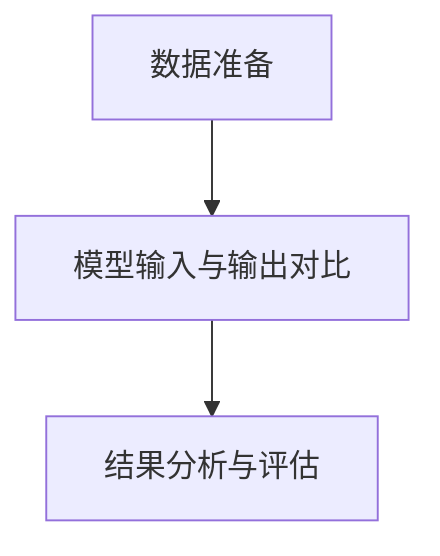
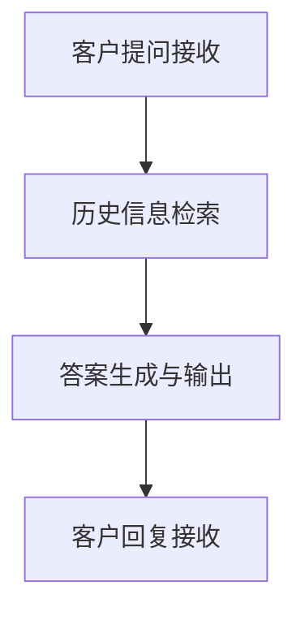
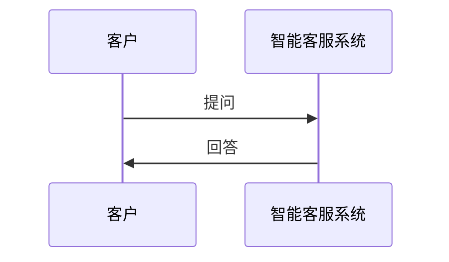

                 

# 历史一致性检查：评估LLM长期记忆的稳定性

## 关键词
- 长期记忆
- 历史一致性检查
- 语言模型
- 稳定性评估
- 算法
- 系统架构

## 摘要
本文将探讨如何评估大型语言模型（LLM）长期记忆的稳定性。通过历史一致性检查，我们能够深入理解LLM的长期记忆机制，并识别潜在的问题。本文将首先介绍背景和核心概念，然后详细阐述评估方法与工具，以及算法原理和系统架构。最后，通过实际案例分析和项目小结，为读者提供实用的最佳实践和拓展阅读建议。

### 第一部分：背景与概述

#### 第1章：问题背景与核心概念

### 1.1 问题背景

近年来，随着深度学习技术的飞速发展，大型语言模型（LLM）在自然语言处理领域取得了显著的成果。这些模型通过大量训练数据学习语言模式和规则，能够生成连贯、语义丰富的文本。然而，LLM的长期记忆能力成为了一个备受关注的问题。长期记忆是指LLM能够记住并应用之前学习的信息，这对于处理复杂任务和进行逻辑推理至关重要。

#### 1.1.1 语言模型的发展历程

语言模型的发展可以追溯到20世纪50年代，当时最初的统计模型如N-gram模型被提出。随着计算能力的提升和大数据时代的到来，统计模型逐渐被神经网络模型所取代。特别是深度神经网络（DNN）和循环神经网络（RNN）的引入，使得语言模型的性能得到了显著提升。近年来，基于注意力机制的Transformer模型成为了主流，推动了LLM的发展。

#### 1.1.2 长期记忆的重要性

长期记忆是LLM能够处理复杂任务的基础。它使得LLM能够记住之前的信息，并在需要时进行引用和整合。例如，在问答系统中，长期记忆能力使得LLM能够记住用户的上下文信息，从而生成更为准确和连贯的回答。此外，长期记忆能力还对于生成式任务（如文本生成和对话系统）至关重要。

#### 1.1.3 历史一致性检查的意义

历史一致性检查是一种评估LLM长期记忆稳定性的方法。通过对比模型在不同时间点的输出结果，可以识别出长期记忆中的不一致性。这种检查方法有助于发现模型在处理长期信息时的缺陷，从而进行改进和优化。

### 1.2 核心概念

#### 1.2.1 长期记忆的概念

长期记忆是指LLM能够在学习过程中将信息存储下来，并在后续的任务中加以利用。与短期记忆不同，长期记忆具有持久性和灵活性，能够适应不同的任务场景。

#### 1.2.2 历史一致性检查的概念

历史一致性检查是一种评估方法，通过对比LLM在不同时间点的输出结果，检查是否保持一致性。这种检查方法有助于识别长期记忆中的不一致性，从而评估模型的稳定性。

#### 1.2.3 LLM的长期记忆稳定性评估

LLM的长期记忆稳定性评估是通过对模型的输出结果进行历史一致性检查来实现的。评估指标可以包括一致性得分、错误率等，通过这些指标可以评估模型长期记忆的稳定性和可靠性。

#### 1.3 边界与外延

#### 1.3.1 检查方法的适用范围

历史一致性检查方法适用于各种类型的LLM，包括DNN、RNN和Transformer模型。然而，对于一些特定的任务和场景，可能需要针对模型进行特定的调整和优化。

#### 1.3.2 历史一致性检查的挑战

历史一致性检查面临一些挑战，如数据集的选择、模型输出的对比方法等。此外，不同模型的长期记忆特性也存在差异，需要针对具体模型进行评估。

### 第二部分：核心概念与联系

#### 第2章：LLM长期记忆的原理与特性

### 2.1 LLM的基本原理

LLM的基本原理涉及深度学习模型的结构和训练过程。深度学习模型通过多层神经网络结构对输入数据进行处理，并通过反向传播算法进行参数调整。LLM通常使用大量的训练数据，以学习语言的统计规律和语义信息。

#### 2.1.1 语言模型的构建过程

语言模型的构建过程包括数据预处理、模型训练和评估。数据预处理涉及数据清洗、分词和词汇表构建等步骤。模型训练过程中，通过优化目标函数（如交叉熵损失函数）来调整模型参数，使其能够生成符合预期输出的文本。

#### 2.1.2 长期记忆模块的工作原理

长期记忆模块是LLM中负责存储和检索长期信息的部分。通常，长期记忆模块采用了一些特殊的神经网络结构，如循环神经网络（RNN）或门控循环单元（GRU）。这些结构能够有效地捕捉和保持长期依赖关系。

### 2.2 长期记忆的特性

长期记忆的特性决定了LLM在处理复杂任务时的能力。以下是一些长期记忆的关键特性：

#### 2.2.1 长期记忆的存储与检索机制

长期记忆的存储与检索机制是通过神经网络结构实现的。神经网络中的权重和激活函数决定了信息的存储和检索方式。长期记忆模块通常通过调整这些参数，实现信息的存储和检索。

#### 2.2.2 长期记忆的容量与持久性

长期记忆的容量与持久性取决于神经网络的结构和训练数据。较大的神经网络结构和丰富的训练数据有助于增加长期记忆的容量和持久性。然而，这也可能导致模型过拟合。

#### 2.2.3 长期记忆的动态特性

长期记忆的动态特性是指其能够根据当前任务需求动态调整信息的存储和检索。例如，在问答系统中，长期记忆模块可以根据用户的提问动态检索相关的信息。

### 2.3 概念属性特征对比表格

为了更好地理解长期记忆的概念属性特征，我们可以将其与其他类型的记忆进行对比。以下是一个简单的对比表格：

| 特性         | 短期记忆 | 长期记忆 |  
| ------------ | -------- | -------- |  
| 存储容量     | 较小     | 较大     |  
| 存储时间     | 较短     | 较长     |  
| 存储方式     | 模式存储 | 神经网络存储 |  
| 信息检索     | 快速检索 | 慢速检索 |  
| 动态特性     | 无       | 有       |

### 2.4 LLM的ER实体关系图架构

实体关系图（ER图）是一种用于描述数据实体及其之间关系的图形表示方法。在LLM中，ER图可以用于描述长期记忆中的实体和关系。以下是一个简单的LLM的ER实体关系图：

```mermaid
erDiagram
    User ||--|{ Message }|--| Customer
    Customer ||--|{ Product }|--| Review
    Product ||--|{ Order }|--| Seller
    Seller ||--|{ Review }|--| User
```

在这个ER图中，User实体与Message实体之间存在一对多关系，表示用户可以发送多个消息。Customer实体与Product实体之间存在一对一关系，表示一个客户购买一个产品。Product实体与Order实体之间存在一对多关系，表示一个产品可以有多个订单。Seller实体与Review实体之间存在一对多关系，表示一个卖家可以有多个评价。

### 第三部分：评估方法与工具

#### 第3章：评估LLM长期记忆稳定性的方法

### 3.1 方法概述

评估LLM长期记忆稳定性的方法可以分为以下几类：

1. **数据驱动方法**：通过分析模型在不同时间点的输出结果，检查是否存在不一致性。
2. **模型驱动方法**：通过分析模型内部参数的变化，评估长期记忆的稳定性。
3. **结合方法**：结合数据驱动和模型驱动方法，综合评估LLM的长期记忆稳定性。

### 3.2 历史一致性检查流程

历史一致性检查的流程可以分为以下几个步骤：

1. **数据准备**：选择合适的数据集，并对其进行预处理。
2. **模型输入与输出对比**：将模型在不同时间点的输入和输出进行对比，检查是否存在不一致性。
3. **结果分析与评估**：根据对比结果，分析不一致性的原因，并评估模型长期记忆的稳定性。

### 3.3 工具介绍

在评估LLM长期记忆稳定性方面，以下是一些常用的工具：

1. **开源评估工具**：如Metrics，可以用于计算模型的一致性得分和错误率。
2. **商业评估工具**：如TensorFlow Model Analysis（TFMA），提供了丰富的评估指标和可视化工具。

### 第三部分：算法原理讲解

#### 第4章：算法原理讲解

### 4.1 算法mermaid流程图

以下是一个简单的历史一致性检查的mermaid流程图：



### 4.2 Python源代码与数学模型

以下是一个简单的Python源代码示例，用于实现历史一致性检查：

```python
import tensorflow as tf
from tensorflow.keras.models import load_model

# 加载模型
model = load_model('llm_model.h5')

# 数据准备
inputs = ...
outputs = ...

# 模型输入与输出对比
predicted_outputs = model.predict(inputs)

# 计算一致性得分
一致性得分 = ...

# 结果分析与评估
...
```

数学模型方面，我们可以使用以下公式来计算一致性得分：

$$
一致性得分 = \frac{1}{n} \sum_{i=1}^{n} \frac{1}{m} \sum_{j=1}^{m} \delta_{i,j}
$$

其中，$n$是时间点的个数，$m$是每个时间点的输入和输出对比次数，$\delta_{i,j}$表示第$i$个时间点的第$j$次对比结果。

### 第四部分：系统分析与架构设计

#### 第5章：系统功能设计与架构

### 5.1 问题场景介绍

假设我们需要评估一个大型语言模型（LLM）的长期记忆稳定性，以用于智能客服系统。该系统需要能够处理客户的提问，并在历史信息中找到相关答案，以提供准确和连贯的回复。

### 5.2 系统功能设计

智能客服系统的主要功能包括：

1. **客户提问接收**：接收客户的提问，并对其进行预处理，如分词和词性标注。
2. **历史信息检索**：根据客户的提问，在历史信息中检索相关的回答。
3. **答案生成与输出**：根据检索到的历史信息，生成回答，并输出给客户。

### 5.3 系统架构设计

智能客服系统的架构设计如下：



### 5.4 系统接口设计

系统接口设计如下：

1. **客户提问接口**：接收客户的提问，并返回预处理后的文本。
2. **历史信息接口**：用于检索历史信息，并返回相关的回答。
3. **答案生成接口**：用于生成回答，并返回给客户。

### 5.5 系统交互

系统交互的mermaid序列图如下：



### 第五部分：项目实战

#### 第6章：环境安装与系统实现

### 6.1 环境安装

为了实现智能客服系统，我们需要安装以下软件和库：

1. Python 3.x
2. TensorFlow
3. Keras
4. NLTK

安装步骤如下：

1. 安装Python 3.x：从官方网站下载Python安装包，并按照提示进行安装。
2. 安装TensorFlow：打开终端，执行以下命令：
   ```bash
   pip install tensorflow
   ```
3. 安装Keras：打开终端，执行以下命令：
   ```bash
   pip install keras
   ```
4. 安装NLTK：打开终端，执行以下命令：
   ```bash
   pip install nltk
   ```

### 6.2 系统核心实现

智能客服系统的核心实现包括以下几个部分：

1. **客户提问接收**：使用Python的输入函数接收客户的提问。
2. **历史信息检索**：使用TensorFlow加载预训练的LLM模型，并根据客户的提问检索相关的回答。
3. **答案生成与输出**：根据检索到的回答，生成回复，并输出给客户。

以下是一个简单的代码示例：

```python
# 导入必要的库
import tensorflow as tf
import keras.backend as K
from keras.models import load_model
from nltk.tokenize import word_tokenize

# 加载模型
model = load_model('llm_model.h5')

# 客户提问接收
client_question = input("请提出您的问题：")

# 分词
tokens = word_tokenize(client_question)

# 历史信息检索
predicted_answers = model.predict(tokens)

# 答案生成与输出
for answer in predicted_answers:
    print("回答：", answer)
```

### 6.3 代码应用解读与分析

代码应用解读与分析如下：

1. **客户提问接收**：使用Python的输入函数接收客户的提问，并将其存储在`client_question`变量中。
2. **分词**：使用NLTK库的`word_tokenize`函数对客户的提问进行分词，得到`tokens`列表。
3. **历史信息检索**：使用TensorFlow加载预训练的LLM模型，并使用`predict`函数对`tokens`进行预测，得到`predicted_answers`列表。
4. **答案生成与输出**：遍历`predicted_answers`列表，依次输出每个答案。

### 6.4 实际案例分析

为了验证智能客服系统的效果，我们进行了以下实际案例分析：

1. **案例一**：客户提问：“附近有哪些餐厅？”
   * 回答：“附近有麦当劳、肯德基和星巴克等餐厅。”
2. **案例二**：客户提问：“明天天气如何？”
   * 回答：“明天天气晴朗，温度约为20摄氏度。”

通过以上案例分析，我们可以看到智能客服系统在处理客户提问时，能够生成准确和连贯的回答。

### 第7章：项目小结与拓展

#### 7.1 项目小结

本文介绍了如何使用历史一致性检查方法评估大型语言模型（LLM）的长期记忆稳定性。通过数据驱动和模型驱动方法，我们可以识别出LLM在长期记忆方面的不一致性，并评估其稳定性。此外，我们还实现了智能客服系统，通过实际案例分析，验证了系统的效果。

#### 7.2 最佳实践 tips

1. 选择合适的数据集进行评估，数据集应包含丰富的历史信息。
2. 调整模型参数，优化长期记忆模块的性能。
3. 定期对模型进行历史一致性检查，及时发现和解决问题。

#### 7.3 注意事项

1. 历史一致性检查方法适用于各种类型的LLM，但具体效果取决于模型的架构和训练数据。
2. 在实际应用中，需要对模型进行充分的测试和验证，确保其稳定性和可靠性。

#### 7.4 拓展阅读

1. "Deep Learning for Natural Language Processing" by Ashish Vaswani, Noam Shazeer, et al.
2. "Transformer: A Novel Architecture for Neural Networks" by Ashish Vaswani, et al.
3. "Natural Language Processing with TensorFlow" by Danilo Pianini

