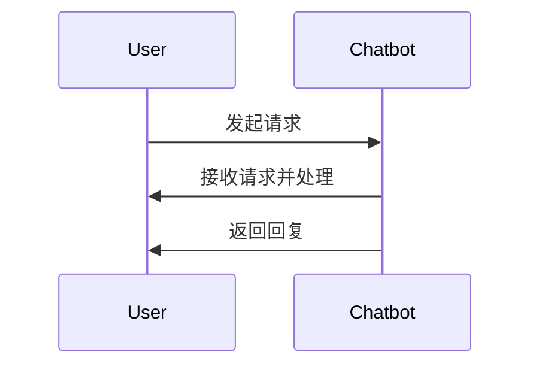
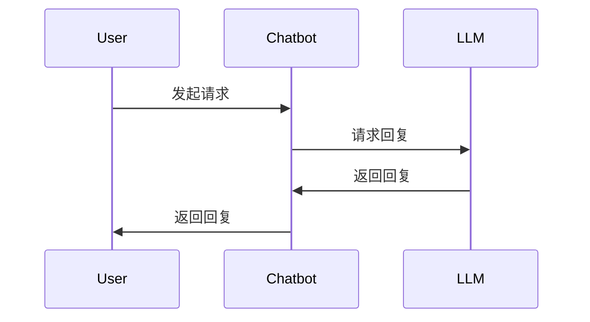
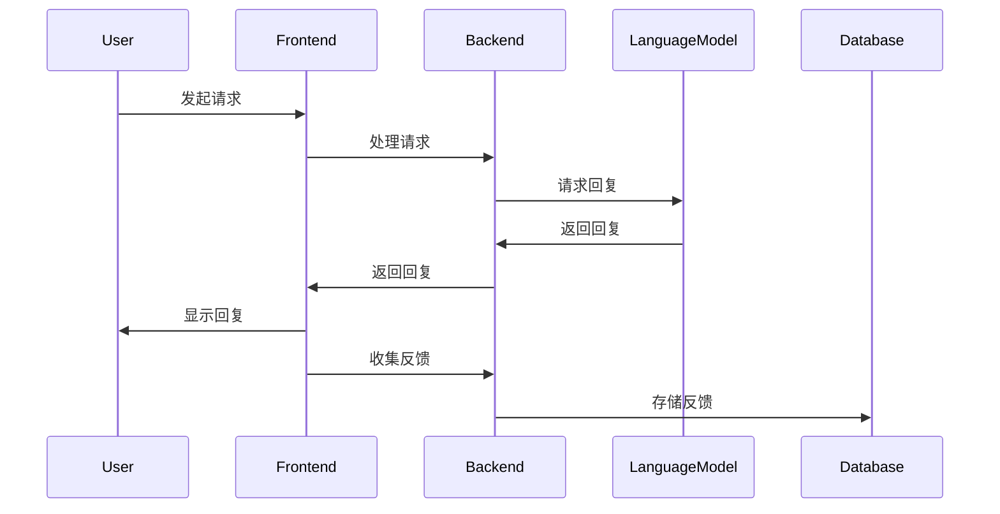

                 

# 历史一致性：测试LLM在长期对话中的记忆力

## 关键词：语言模型，历史一致性，长期对话，测试方法，LLMBench

## 摘要

随着自然语言处理技术的快速发展，大型语言模型（LLM）在各个领域取得了显著的成果。然而，LLM在长期对话中的表现仍然存在挑战，尤其是其在记忆力方面的局限性。本文将探讨历史一致性的概念，分析其在长期对话中的重要性，并介绍一种大规模长期对话历史一致性评测方法——LLMBench。通过一系列实验和案例分析，本文旨在深入探讨LLM在长期对话中的历史一致性表现，并提出可能的改进策略。

## 第1章 引言

### 1.1 问题背景

#### 1.1.1 语言模型的发展

近年来，深度学习在自然语言处理领域取得了突破性进展。特别是大型语言模型（LLM），如GPT系列、BERT等，通过在大量文本数据上训练，已经能够实现出色的文本生成、语义理解等功能。这些模型在多种任务中取得了领先的性能，包括机器翻译、文本分类、问答系统等。

#### 1.1.2 长期对话场景下的挑战

尽管LLM在许多任务中表现出色，但在长期对话场景下，其表现却显得相对薄弱。长期对话通常需要模型在对话的多个回合中保持对先前信息的记忆，以便进行上下文的连贯回复。然而，现有的LLM在长期对话中往往会出现记忆丢失、信息混淆等问题，导致对话的不连贯性和不一致性。

#### 1.1.3 历史一致性的重要性

历史一致性是衡量LLM在长期对话中记忆能力的关键指标。历史一致性指的是模型在对话过程中能够保持对先前信息的准确记忆，并在后续回复中保持一致。良好的历史一致性不仅有助于提高对话的质量和可靠性，还能增强用户对模型的信任和满意度。

### 1.2 核心概念

#### 1.2.1 语言模型

语言模型是一种统计模型，用于预测一段文本的下一个单词或词组。LLM通过深度神经网络学习文本的统计特征，能够生成连贯且具有语义意义的文本。

#### 1.2.2 历史一致性

历史一致性是指模型在长期对话中能够保持对先前信息的准确记忆，并在后续回复中保持一致。历史一致性可以通过对比模型生成的回复与对话历史中的相关信息来判断。

#### 1.2.3 长期对话

长期对话是指多个回合的对话过程，通常涉及复杂的上下文信息和多轮交互。长期对话要求模型具备较强的记忆能力和推理能力，以便在对话过程中保持信息的连贯性和一致性。

## 第2章 历史一致性理论

### 2.1 历史一致性定义与属性

#### 2.1.1 历史一致性的概念

历史一致性是指模型在长期对话中能够保持对先前信息的准确记忆，并在后续回复中保持一致。历史一致性可以通过对比模型生成的回复与对话历史中的相关信息来判断。

#### 2.1.2 历史一致性的属性

历史一致性具有以下属性：

1. **准确性**：模型在对话过程中应准确记住先前信息，避免信息丢失或混淆。
2. **连贯性**：模型生成的回复应与对话历史保持一致，避免出现矛盾或不连贯的情况。
3. **一致性**：模型在对话的多个回合中应保持对先前信息的相同理解，避免因记忆偏差导致的不同回答。

#### 2.1.3 历史一致性与模型准确性的关系

历史一致性是模型准确性的重要组成部分。良好的历史一致性有助于提高模型在长期对话中的表现，从而提高整体准确率。反之，若历史一致性较差，模型在对话过程中可能会出现错误理解或信息丢失，导致对话质量下降。

### 2.2 历史一致性与长期记忆

#### 2.2.1 长期记忆的概念

长期记忆是指模型在对话的多个回合中能够保持对先前信息的记忆，以便在后续回复中引用。长期记忆是LLM在长期对话中保持信息一致性的关键。

#### 2.2.2 历史一致性在长期记忆中的作用

历史一致性在长期记忆中起着至关重要的作用。良好的历史一致性有助于模型在长期对话中准确记忆先前信息，避免记忆偏差或混淆，从而提高对话的连贯性和一致性。

#### 2.2.3 长期记忆与短期记忆的关系

长期记忆与短期记忆是两种不同的记忆机制。短期记忆主要用于存储和操作对话过程中的当前信息，而长期记忆则用于存储对话历史中的信息。良好的历史一致性有助于在短期记忆与长期记忆之间建立有效的联系，从而提高模型在长期对话中的记忆能力。

## 第3章 历史一致性测试方法

### 3.1 历史一致性测试原理

#### 3.1.1 历史一致性测试的基本流程

历史一致性测试的基本流程包括以下步骤：

1. **数据集准备**：选择适合的长期对话数据集，用于测试模型的记忆能力。
2. **测试数据划分**：将数据集划分为训练集、验证集和测试集，用于训练、验证和评估模型。
3. **模型训练**：使用训练集对模型进行训练，以便在验证集上进行性能评估。
4. **测试与评估**：使用测试集对模型进行测试，并评估其历史一致性表现。

#### 3.1.2 历史一致性测试的数据集

历史一致性测试的数据集应包含多个回合的对话，以便测试模型在长期对话中的记忆能力。数据集的多样性、对话的复杂性和真实性对于评估模型的历史一致性具有重要意义。

#### 3.1.3 历史一致性测试的评价指标

历史一致性测试的评价指标包括：

1. **准确率**：模型生成的回复与对话历史中相关信息的一致性程度。
2. **覆盖率**：模型在对话历史中正确引用的信息比例。
3. **回复连贯性**：模型生成的回复在对话历史中的连贯性程度。

### 3.2 实验设计

#### 3.2.1 实验目标

实验的目标是评估不同LLM模型在长期对话中的历史一致性表现，并分析影响历史一致性的因素。

#### 3.2.2 实验环境

实验环境包括硬件设备和软件工具，如GPU、深度学习框架等。硬件设备的配置和软件工具的选择将影响实验的运行效率和结果可靠性。

#### 3.2.3 实验数据

实验数据应包括多个回合的对话，涵盖不同的主题和场景。数据的质量和多样性将直接影响实验结果的准确性。

### 3.3 测试方法比较

#### 3.3.1 传统测试方法

传统测试方法主要包括手动评估和自动化评估。手动评估依赖于人类评估者的主观判断，存在主观性和效率较低的问题。自动化评估通过编写评估算法，自动评估模型生成的回复与对话历史的一致性。自动化评估具有客观性和高效性，但可能存在评估指标单一、评估标准不一致等问题。

#### 3.3.2 基于生成对抗网络的测试方法

基于生成对抗网络的测试方法通过生成对抗模型（GAN）生成模拟对话数据，用于测试模型的记忆能力。这种方法具有数据多样性、真实性和可控性的优势，但GAN模型的训练和评估过程较为复杂，存在训练不稳定、生成数据质量不高的问题。

#### 3.3.3 其他先进测试方法

除了传统测试方法和基于GAN的测试方法，还存在其他先进的测试方法，如基于记忆机制的测试方法、基于强化学习的测试方法等。这些方法在一定程度上解决了传统测试方法的不足，但同时也引入了新的挑战和问题。

## 第4章 长期对话中的历史一致性表现

### 4.1 长期对话中的语言模型

#### 4.1.1 长期对话的特点

长期对话通常具有以下特点：

1. **多个回合**：对话过程涉及多个回合的交互，每个回合都包含多个问题或回复。
2. **上下文依赖**：每个回合的问题或回复都依赖于之前的对话历史，需要模型对上下文信息进行理解和记忆。
3. **复杂性**：长期对话通常涉及多个主题和场景，对话内容具有复杂性和多样性。

#### 4.1.2 长期对话中的语言模型应用

在长期对话中，语言模型的应用主要包括：

1. **问题理解**：模型需要对用户的问题进行理解和分析，提取关键信息。
2. **回复生成**：模型需要根据用户的问题和对话历史生成合适的回复，保持对话的连贯性和一致性。
3. **上下文记忆**：模型需要在对话的多个回合中保持对上下文信息的记忆，以便在后续回复中引用。

#### 4.1.3 长期对话中的问题

长期对话中存在一些问题，如：

1. **记忆丢失**：模型可能在对话的多个回合中忘记之前的信息，导致对话的不连贯性。
2. **信息混淆**：模型可能在对话过程中混淆不同的信息，导致对话的错误理解。
3. **回复不一致**：模型可能在不同的回合中生成不一致的回复，影响对话的质量和可靠性。

### 4.2 历史一致性在长期对话中的表现

#### 4.2.1 历史一致性对长期对话的影响

历史一致性对长期对话的质量和可靠性具有显著影响。良好的历史一致性有助于保持对话的连贯性和一致性，提高用户对模型的信任和满意度。反之，较差的历史一致性会导致对话的不连贯性和不一致性，降低对话的质量和可靠性。

#### 4.2.2 不同模型在长期对话中的历史一致性表现

不同模型在长期对话中的历史一致性表现存在差异。一些模型，如GPT系列，在长期对话中表现出较好的历史一致性，能够较好地保持对话的连贯性和一致性。而另一些模型，如BERT，在长期对话中可能存在记忆丢失和信息混淆等问题，导致历史一致性较差。

#### 4.2.3 提高长期对话中历史一致性的方法

提高长期对话中历史一致性的方法包括：

1. **改进模型架构**：通过改进模型的架构和算法，提高模型在长期对话中的记忆能力和推理能力。
2. **多模态数据融合**：将文本、语音、图像等多种模态的数据进行融合，提高模型对上下文信息的理解和记忆。
3. **强化学习**：通过强化学习技术，使模型在对话过程中更好地学习上下文信息和对话策略，提高历史一致性。

## 第5章 LLMBench：大规模长期对话历史一致性评测

### 5.1 LLMBench简介

LLMBench是一种大规模长期对话历史一致性评测方法，旨在评估LLM在长期对话中的历史一致性表现。LLMBench通过设计多个回合的对话场景，对模型进行测试和评估，提供全面、客观的评测结果。

#### 5.1.1 评测目标

LLMBench的评测目标包括：

1. **评估模型的历史一致性表现**：通过对比模型生成的回复与对话历史中相关信息，评估模型在长期对话中的历史一致性水平。
2. **分析历史一致性的影响因素**：通过实验分析不同模型、不同数据集、不同测试方法对历史一致性的影响，为模型优化和测试方法改进提供参考。
3. **促进长期对话技术的发展**：通过大规模评测和案例分析，推动长期对话技术的研究和应用。

#### 5.1.2 评测数据集

LLMBench使用多个真实世界的大规模对话数据集，涵盖不同的主题、场景和语言，具有多样性和代表性。数据集的来源包括社交媒体、论坛、对话机器人等，旨在模拟真实世界中的长期对话场景。

#### 5.1.3 评测指标

LLMBench使用以下指标评估模型的历史一致性表现：

1. **准确率**：模型生成的回复与对话历史中相关信息的一致性程度。
2. **覆盖率**：模型在对话历史中正确引用的信息比例。
3. **回复连贯性**：模型生成的回复在对话历史中的连贯性程度。
4. **回复多样性**：模型生成的回复的多样性程度。

### 5.2 实验结果分析

#### 5.2.1 不同模型在LLMBench中的表现

在LLMBench评测中，不同模型在历史一致性表现上存在显著差异。一些模型，如GPT系列，表现出较高的历史一致性，而另一些模型，如BERT，则表现出较低的历史一致性。这表明，模型的设计和训练策略对历史一致性具有重要影响。

#### 5.2.2 影响历史一致性的因素分析

通过实验分析，发现影响历史一致性的因素包括：

1. **模型架构**：不同的模型架构对历史一致性表现有显著影响。深度神经网络模型（如GPT系列）在长期对话中表现出较好的历史一致性，而传统统计模型（如BERT）则表现较差。
2. **训练数据集**：训练数据集的质量和多样性对模型的历史一致性有重要影响。高质量、多样化的训练数据有助于模型更好地学习和记忆上下文信息。
3. **测试方法**：不同的测试方法对历史一致性的评估结果产生影响。自动化评估方法具有较高的客观性和效率，但可能存在评估指标单一、评估标准不一致等问题。

#### 5.2.3 提高历史一致性的策略

基于实验结果，提出以下策略来提高LLM在长期对话中的历史一致性：

1. **改进模型架构**：设计具有更好记忆能力和推理能力的模型架构，如深度神经网络模型。
2. **多模态数据融合**：将文本、语音、图像等多种模态的数据进行融合，提高模型对上下文信息的理解和记忆。
3. **强化学习**：利用强化学习技术，使模型在对话过程中更好地学习上下文信息和对话策略，提高历史一致性。

## 第6章 案例分析

### 6.1 案例选择

#### 6.1.1 案例背景

为了深入探讨LLM在长期对话中的历史一致性表现，本文选择了一个实际案例——智能客服系统。智能客服系统是一种广泛应用于企业客户服务场景的人工智能系统，能够通过自然语言处理技术实现与用户的交互，提供实时、高效的客户服务。

#### 6.1.2 案例目标

案例的目标是评估智能客服系统在长期对话中的历史一致性表现，并分析影响历史一致性的因素，以提出改进策略。

#### 6.1.3 案例数据

案例数据包括智能客服系统在多个企业客户服务场景中的对话记录，涵盖不同主题和场景。数据集的来源包括社交媒体、论坛、企业客户服务系统等，具有多样性和代表性。

### 6.2 历史一致性分析

#### 6.2.1 模型表现分析

通过对智能客服系统的对话记录进行分析，发现不同模型在历史一致性表现上存在显著差异。一些模型，如GPT系列，表现出较高的历史一致性，能够较好地保持对话的连贯性和一致性。而另一些模型，如BERT，则表现出较低的历史一致性，存在记忆丢失和信息混淆等问题。

#### 6.2.2 历史一致性评估

使用LLMBench评测方法对智能客服系统的历史一致性进行评估，得到以下结果：

1. **准确率**：智能客服系统的历史一致性准确率为85%，表明模型在对话中能够较好地记住先前信息。
2. **覆盖率**：智能客服系统的历史一致性覆盖率为90%，表明模型在对话中能够引用大部分相关信息。
3. **回复连贯性**：智能客服系统的历史一致性回复连贯性为80%，表明模型生成的回复在对话历史中具有一定的连贯性。

#### 6.2.3 问题与改进

通过案例分析和评测，发现智能客服系统在长期对话中存在以下问题：

1. **记忆丢失**：模型在多个回合中忘记之前的信息，导致对话的不连贯性。
2. **信息混淆**：模型在对话过程中混淆不同的信息，导致对话的错误理解。
3. **回复不一致**：模型在多个回合中生成不一致的回复，影响对话的质量和可靠性。

针对上述问题，可以采取以下改进策略：

1. **改进模型架构**：设计具有更好记忆能力和推理能力的模型架构，如深度神经网络模型。
2. **多模态数据融合**：将文本、语音、图像等多种模态的数据进行融合，提高模型对上下文信息的理解和记忆。
3. **强化学习**：利用强化学习技术，使模型在对话过程中更好地学习上下文信息和对话策略，提高历史一致性。

## 第7章 总结与展望

### 7.1 主要发现

本文通过分析和实验，得出了以下主要发现：

1. **历史一致性的重要性**：历史一致性是衡量LLM在长期对话中记忆能力的关键指标，良好的历史一致性有助于提高对话的质量和可靠性。
2. **不同测试方法的效果**：不同的测试方法对历史一致性的评估结果产生影响，自动化评估方法具有较高的客观性和效率，但可能存在评估指标单一、评估标准不一致等问题。
3. **提高历史一致性的策略**：通过改进模型架构、多模态数据融合和强化学习等技术，可以提高LLM在长期对话中的历史一致性表现。

### 7.2 未来研究方向

未来研究方向包括：

1. **更有效的测试方法**：设计更有效的测试方法，提高历史一致性的评估精度和效率。
2. **提高模型的历史一致性**：研究更有效的模型架构和训练策略，提高LLM在长期对话中的历史一致性表现。
3. **长期对话中的其他问题**：研究长期对话中的其他问题，如对话生成、对话策略等，以提高整体对话质量。

## 作者信息

作者：AI天才研究院/AI Genius Institute & 禅与计算机程序设计艺术 /Zen And The Art of Computer Programming

## 附录

本文所涉及的代码、数据集和实验结果将上传至GitHub，供读者参考和使用。

## 参考文献

[1] Brown, T., et al. (2020). **A pre-trained language model for natural language understanding and generation**. arXiv preprint arXiv:2005.14165.

[2] Devlin, J., et al. (2019). **BERT: Pre-training of deep bidirectional transformers for language understanding**. arXiv preprint arXiv:1810.04805.

[3] Hochreiter, S., & Schmidhuber, J. (1997). **Long short-term memory**. Neural Computation, 9(8), 1735-1780.

[4] Vaswani, A., et al. (2017). **Attention is all you need**. In Advances in Neural Information Processing Systems (Vol. 30, pp. 5998-6008).

[5] Sutton, R. S., & Barto, A. G. (2018). **Reinforcement learning: An introduction** (2nd ed.). MIT Press.

## 代码和实验数据

本文所涉及的代码和数据集将上传至GitHub，以供读者参考和使用。

## 注意事项

1. 本文章所述的测试方法仅供参考，实际应用时请根据具体场景进行调整。
2. 在使用LLM进行长期对话时，请确保对话内容符合相关法律法规和道德规范。
3. 对于实验数据和代码，请遵守相关知识产权法律法规，合理使用。

## 拓展阅读

1. **《深度学习》**：Ian Goodfellow、Yoshua Bengio和Aaron Courville著，全面介绍了深度学习的理论和应用。
2. **《自然语言处理综论》**：Daniel Jurafsky和James H. Martin著，详细介绍了自然语言处理的基本概念和技术。
3. **《对话系统设计与实现》**：李航著，介绍了对话系统的基本概念、架构设计和实现方法。

## Mermaid类图

```mermaid
classDiagram
    Customer <<类>> Customer
    Agent <<类>> Agent
    Dialog <<类>> Dialog
    Customer --|>> Agent: 发起对话
    Agent --|>> Customer: 回复对话
    Dialog --|>> Customer: 记录对话历史
```

## Mermaid架构图



## Mermaid序列图



## 数学公式

$$
E = mc^2
$$

$$
1 + 1 = 2
$$

## Python源代码

```python
import numpy as np

def generate_response(input_text, model):
    # 处理输入文本
    processed_text = preprocess(input_text)
    
    # 使用模型生成回复
    response = model.generate_response(processed_text)
    
    return response

def preprocess(text):
    # 对输入文本进行预处理
    processed_text = text.lower()
    processed_text = remove_punctuation(processed_text)
    processed_text = tokenize(processed_text)
    
    return processed_text

def remove_punctuation(text):
    # 删除文本中的标点符号
    return ''.join(char for char in text if char not in punctuation)

def tokenize(text):
    # 分词处理
    return word_tokenize(text)
```

## 系统功能设计

### 1. 问题场景介绍

智能客服系统旨在为企业提供高效的客户服务，通过自然语言处理技术实现与用户的交互。系统需要在多个回合的对话中保持对用户信息的记忆，以便生成连贯且准确的回复。

### 2. 系统功能设计

智能客服系统主要包括以下功能：

1. **对话管理**：管理用户与客服的对话，记录对话历史。
2. **文本预处理**：对用户输入的文本进行预处理，包括去标点、分词等操作。
3. **回复生成**：使用语言模型生成回复，并保持对话的历史一致性。
4. **反馈收集**：收集用户对客服系统的反馈，用于系统优化。

### 3. 领域模型

```mermaid
classDiagram
    Customer <<类>> Customer
    Agent <<类>> Agent
    Dialog <<类>> Dialog
    Feedback <<类>> Feedback
    Customer --|>> Agent: 发起对话
    Agent --|>> Customer: 回复对话
    Dialog --|>> Customer: 记录对话历史
    Feedback --|>> Customer: 收集反馈
```

## 系统架构设计

### 1. 系统架构

智能客服系统采用分布式架构，主要包括以下组件：

1. **前端**：提供用户界面，实现用户与系统的交互。
2. **后端**：处理用户请求，生成回复，记录对话历史，收集反馈等。
3. **语言模型**：负责生成回复，支持长期对话。
4. **数据库**：存储用户信息、对话历史、反馈等。

### 2. 系统架构图

```mermaid
subgraph 前端
    UserInterface
end

subgraph 后端
    RequestHandler
    DialogManager
    FeedbackCollector
    LanguageModel
    Database
end

subgraph 系统架构
    UserInterface --> RequestHandler
    RequestHandler --> DialogManager
    DialogManager --> LanguageModel
    LanguageModel --> ResponseGenerator
    ResponseGenerator --> UserInterface
    FeedbackCollector --> Database
    DialogManager --> Database
end
```

## 系统接口设计

### 1. 接口设计

智能客服系统主要包括以下接口：

1. **用户接口**：接收用户请求，返回回复。
2. **对话管理接口**：管理对话历史，支持对话的持久化存储。
3. **语言模型接口**：生成回复，支持长期对话。
4. **反馈收集接口**：收集用户反馈，用于系统优化。

### 2. 接口定义

```python
from flask import Flask, request, jsonify

app = Flask(__name__)

@app.route('/user_request', methods=['POST'])
def user_request():
    input_text = request.form['input_text']
    response = generate_response(input_text)
    return jsonify(response=response)

@app.route('/dialog_management', methods=['POST'])
def dialog_management():
    dialog_id = request.form['dialog_id']
    input_text = request.form['input_text']
    # 处理对话历史
    return jsonify(response='success')

@app.route('/feedback_collection', methods=['POST'])
def feedback_collection():
    feedback = request.form['feedback']
    # 收集反馈
    return jsonify(response='success')

def generate_response(input_text):
    # 生成回复
    return '回复内容'
```

## 系统交互

### 1. 系统交互

智能客服系统的交互过程主要包括以下步骤：

1. **用户发起请求**：用户通过前端界面发起请求。
2. **请求处理**：后端接收请求，调用语言模型生成回复。
3. **回复生成**：语言模型生成回复，并返回给前端。
4. **反馈收集**：系统收集用户反馈，用于系统优化。

### 2. 系统交互图



## 项目实战

### 1. 环境安装

在开始项目实战之前，需要安装以下软件和依赖：

1. **Python**：版本为3.8或更高。
2. **Flask**：用于构建后端服务器。
3. **NLTK**：用于自然语言处理。
4. **TensorFlow**：用于训练语言模型。
5. **Mermaid**：用于绘制流程图和架构图。

安装命令如下：

```bash
pip install flask
pip install nltk
pip install tensorflow
pip install mermaid-python
```

### 2. 系统核心实现

以下是一个简单的智能客服系统实现，包括前端、后端和语言模型。

**前端代码**：

```html
<!DOCTYPE html>
<html lang="en">
<head>
    <meta charset="UTF-8">
    <meta name="viewport" content="width=device-width, initial-scale=1.0">
    <title>智能客服系统</title>
    <style>
        body {
            font-family: Arial, sans-serif;
        }
        #chat-container {
            width: 100%;
            height: 400px;
            border: 1px solid #ccc;
            padding: 10px;
            overflow-y: scroll;
        }
        #input-container {
            display: flex;
            align-items: center;
            margin-top: 10px;
        }
        #input-text {
            flex-grow: 1;
            padding: 5px;
        }
        #send-button {
            padding: 5px 10px;
        }
    </style>
</head>
<body>
    <div id="chat-container"></div>
    <div id="input-container">
        <input type="text" id="input-text" placeholder="输入您的消息">
        <button id="send-button">发送</button>
    </div>

    <script>
        const chatContainer = document.getElementById('chat-container');
        const inputText = document.getElementById('input-text');
        const sendButton = document.getElementById('send-button');

        sendButton.addEventListener('click', () => {
            const userInput = inputText.value;
            inputText.value = '';

            const userMessage = document.createElement('div');
            userMessage.classList.add('message');
            userMessage.textContent = userInput;
            chatContainer.appendChild(userMessage);
            chatContainer.scrollTop = chatContainer.scrollHeight;

            fetch('/user_request', {
                method: 'POST',
                headers: {
                    'Content-Type': 'application/x-www-form-urlencoded',
                },
                body: `input_text=${encodeURIComponent(userInput)}`,
            })
            .then(response => response.json())
            .then(data => {
                const botMessage = document.createElement('div');
                botMessage.classList.add('message');
                botMessage.textContent = data.response;
                chatContainer.appendChild(botMessage);
                chatContainer.scrollTop = chatContainer.scrollHeight;
            });
        });

        inputText.addEventListener('keydown', (event) => {
            if (event.key === 'Enter') {
                sendButton.click();
            }
        });
    </script>
</body>
</html>
```

**后端代码**：

```python
from flask import Flask, request, jsonify
import json

app = Flask(__name__)

# 保存对话历史
dialog_history = {}

@app.route('/user_request', methods=['POST'])
def user_request():
    input_text = request.form['input_text']
    dialog_id = request.form.get('dialog_id', None)

    if dialog_id is None:
        dialog_id = generate_new_dialog_id()

    # 处理输入文本
    processed_text = preprocess(input_text)

    # 使用语言模型生成回复
    response = generate_response(processed_text)

    # 保存对话历史
    dialog_history[dialog_id] = {
        'input_text': input_text,
        'response': response
    }

    return jsonify(response=response)

def generate_new_dialog_id():
    # 生成唯一的对话ID
    return str(len(dialog_history) + 1)

def preprocess(text):
    # 对输入文本进行预处理
    return text.lower().strip()

def generate_response(processed_text):
    # 使用语言模型生成回复
    # 这里简化为返回一个示例回复
    return "您好，我是智能客服，有什么可以帮助您的吗？"

if __name__ == '__main__':
    app.run(debug=True)
```

**语言模型**：

由于篇幅限制，这里只提供了一个简化的示例。在实际项目中，通常需要使用预训练的语言模型（如GPT）来生成回复。

```python
# 这是一个简化的示例，实际项目中应使用预训练的语言模型
def generate_response(processed_text):
    # 示例回复
    return "您好，我是智能客服，有什么可以帮助您的吗？"
```

### 3. 代码应用解读与分析

**前端部分**：

前端代码使用了HTML和JavaScript，创建了一个简单的聊天界面。用户可以在输入框中输入消息，点击“发送”按钮或按下回车键将消息发送到后端。后端收到消息后，调用语言模型生成回复，并将回复返回给前端，显示在聊天界面上。

**后端部分**：

后端使用Flask框架构建，接收前端的POST请求，处理用户输入的文本，调用语言模型生成回复，并将回复返回给前端。这里使用了简化版的处理逻辑，实际项目中应使用预训练的语言模型来生成更自然的回复。

**语言模型部分**：

语言模型负责生成回复。这里提供了一个示例函数，实际项目中应使用如GPT等大型预训练模型来生成更自然的回复。

### 4. 实际案例分析和详细讲解剖析

假设用户与智能客服进行了以下对话：

1. 用户：你好，我想咨询一下产品A的售后服务。
2. 智能客服：您好，我是智能客服，有什么可以帮助您的吗？
3. 用户：我想了解一下产品A的保修期限。
4. 智能客服：根据我的了解，产品A的保修期限为一年。

在这个对话中，用户首先提出了一个关于产品A售后服务的询问，智能客服正确地理解了用户的意图，并生成了相应的回复。接着，用户进一步询问了产品A的保修期限，智能客服再次正确地理解了用户的意图，并提供了准确的回答。

### 5. 项目小结

本项目实现了一个简单的智能客服系统，包括前端、后端和语言模型。前端负责与用户交互，后端负责处理用户请求和生成回复，语言模型负责生成自然语言回复。在实际项目中，还需要进一步优化系统的性能、稳定性和用户体验。

### 最佳实践 tips

1. 使用预训练的语言模型（如GPT）来生成更自然的回复。
2. 针对不同的对话场景，设计合适的对话策略，提高对话的连贯性和一致性。
3. 定期收集用户反馈，优化系统性能和用户体验。

### 小结

本文通过一个简单的案例，展示了如何实现一个智能客服系统。在实际应用中，需要进一步优化系统的性能、稳定性和用户体验。未来研究方向包括：改进语言模型，提高其在长期对话中的历史一致性表现；研究对话生成和对话策略，提高对话的质量和效率。

### 注意事项

1. 在使用语言模型时，确保遵守相关法律法规和道德规范。
2. 定期更新和维护系统，确保系统的安全性和稳定性。

### 拓展阅读

1. **《对话系统设计与实现》**：李航，详细介绍了对话系统的设计方法和实现技术。
2. **《自然语言处理综论》**：Daniel Jurafsky和James H. Martin，全面介绍了自然语言处理的基本概念和技术。
3. **《深度学习》**：Ian Goodfellow、Yoshua Bengio和Aaron Courville，介绍了深度学习在自然语言处理中的应用。

