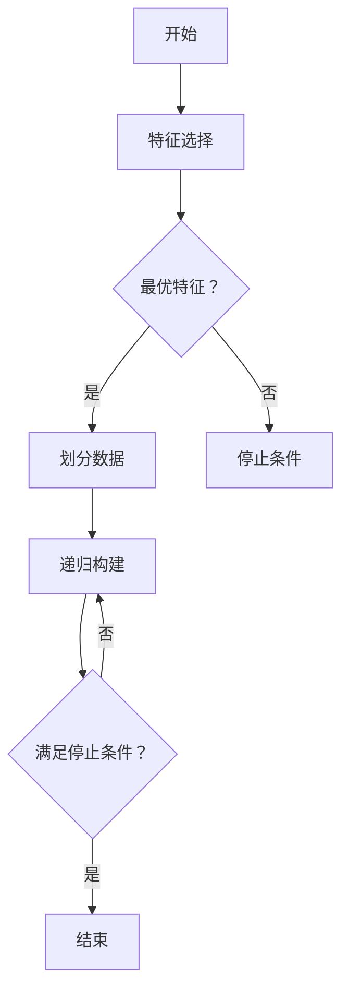
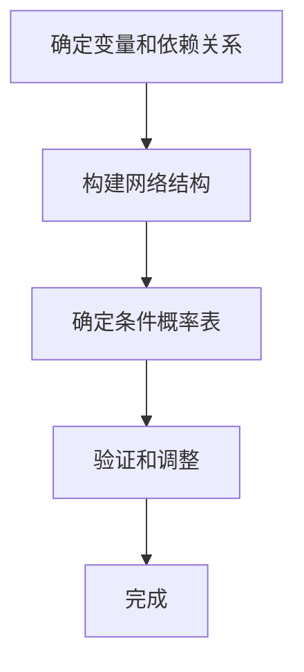
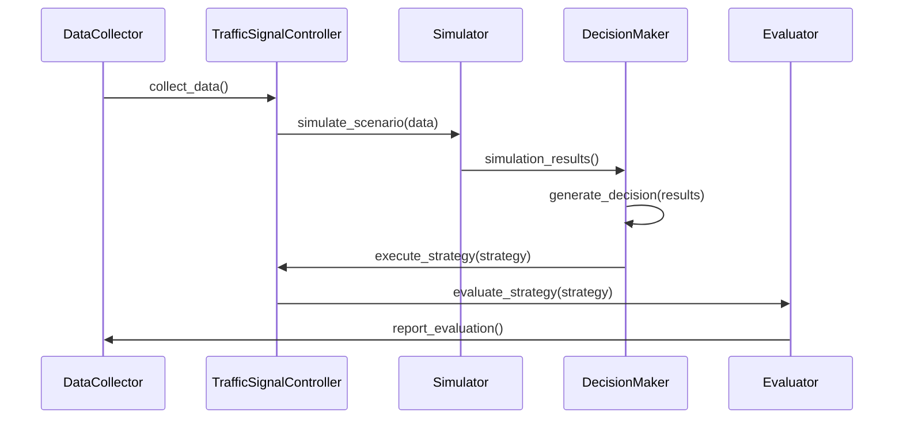

                 

### 引言

**反事实思考**，作为一种重要的认知能力，其核心在于通过假设一个与当前事实相反的情景来进行分析和推理。它不仅可以帮助我们深入理解问题的本质，还能在决策过程中提供独特的视角。那么，为什么反事实思考如此重要，它又是如何增强我们的推理能力的呢？

首先，反事实思考能够**激发创造力和创新思维**。通过设想“如果没有某事物会发生什么”，我们能够探索出新的解决方案，突破常规思维的束缚。例如，在产品设计中，通过假设“如果产品完全免费会怎样”，可以重新评估商业模式和市场策略。

其次，反事实思考能够**揭示潜在风险**。例如，在金融投资中，通过假设“如果市场突然崩盘，我的投资组合会怎样”，可以更好地准备应对可能的风险，从而做出更稳健的投资决策。

此外，反事实思考还在**问题解决**和**决策制定**中扮演关键角色。通过模拟不同的反事实情景，我们可以预判不同决策的结果，从而选择最佳方案。例如，在项目管理中，通过假设“如果团队成员突然离职，项目会如何进行”，可以帮助项目经理提前制定应急计划。

总的来说，反事实思考不仅是一种思考方式，更是一种战略工具，能够帮助我们在复杂多变的环境中做出更明智的决策。接下来，我们将深入探讨反事实思考的核心概念、算法原理、数学模型，并通过具体的系统架构设计和项目实战，展示其在实际应用中的强大作用。**让我们一起，通过反事实思考，探索更广阔的认知世界。**

### 关键词

- **反事实思考**
- **推理能力**
- **创造力**
- **决策制定**
- **系统架构设计**
- **项目实战**
- **算法原理**
- **数学模型**

### 摘要

本文旨在探讨反事实思考在增强推理能力方面的应用。通过引入反事实思考这一概念，本文分析了其定义、背景及其重要性，阐述了它在激发创造力、揭示潜在风险和制定决策中的作用。随后，文章详细介绍了与反事实思考相关的算法原理，包括决策树和贝叶斯网络，并通过Mermaid流程图和Python代码示例进行了讲解。接着，本文通过一个典型的系统架构设计案例，展示了反事实思考在实际应用中的实现方法。通过实际项目实战，本文展示了如何通过反事实思考进行环境安装、系统核心实现和代码应用解读与分析。最后，本文提供了最佳实践建议，总结了全文要点，并提出了未来研究的方向。

### 目录大纲设计思路

在撰写《反事实思考：通过假设场景增强推理》这篇技术博客时，目录大纲的设计至关重要。它不仅需要结构清晰、逻辑严密，还要能引导读者逐步深入了解这一复杂而重要的主题。以下是具体的目录大纲设计思路：

#### 第一部分：反事实思考基础

**第1章 引言**

在这一章中，我们首先介绍反事实思考的基本概念，包括其定义、背景和重要性。通过引入一些实例，让读者初步了解反事实思考在实际应用中的价值。我们还会探讨反事实思考与逻辑思维、创造力等的关系，解释为什么它是一种有效的增强推理能力的方法。

**第2章 核心概念与联系**

在这一章中，我们将详细描述反事实思考的核心概念。这包括反事实思考的基本原理、主要特征和应用场景。此外，我们还会通过对比表和ER实体关系图来展示反事实思考的属性特征，以及它与逻辑思维和创造力的联系。

**第3章 算法原理讲解**

在这一章中，我们将介绍与反事实思考相关的算法原理，如决策树和贝叶斯网络。通过Mermaid流程图和Python代码示例，我们不仅能够清晰地展示这些算法的工作原理，还能帮助读者理解它们在实际应用中的优势。

#### 第二部分：算法原理与数学模型

**第4章 决策树算法原理**

在这一章中，我们将详细介绍决策树的算法原理。这包括决策树的基本概念、构建过程和优缺点。通过一个具体的案例，我们将展示如何使用决策树进行问题解决，并分析其效果。

**第5章 贝叶斯网络算法原理**

在这一章中，我们将介绍贝叶斯网络的算法原理。这将包括贝叶斯网络的基本概念、构建过程和优缺点。我们还将通过Python代码示例，展示如何使用贝叶斯网络进行概率推理和决策制定。

**第6章 数学模型和数学公式**

在这一章中，我们将详细讨论反事实思考中的数学模型和数学公式。使用LaTeX格式，我们将确保公式的准确性，并通过通俗易懂的举例说明，让读者更好地理解这些模型和公式在实际应用中的意义。

#### 第三部分：系统分析与架构设计

**第7章 系统分析与架构设计方案**

在这一章中，我们将描述一个典型的反事实思考应用场景，并介绍该系统的功能设计、架构设计、接口设计和交互流程。通过Mermaid流程图和详细的讲解，我们将帮助读者理解系统架构的各个组成部分及其工作原理。

#### 第四部分：项目实战

**第8章 项目实战**

在这一章中，我们将通过一个实际案例，展示如何实现反事实思考。我们将详细介绍项目环境安装、系统核心实现和代码应用解读与分析。通过详细的代码解读和应用分析，我们将展示反事实思考在实际项目中的应用效果。

#### 第五部分：最佳实践与拓展

**第9章 最佳实践 tips**

在这一章中，我们将总结反事实思考的最佳实践技巧，提供提升推理能力的策略。此外，我们还将讨论反事实思考的潜在误区，并提供避免错误应用的注意事项。

**第10章 小结**

在这一章中，我们将回顾全文的核心内容，强调反事实思考在增强推理能力方面的关键作用，并提出未来的研究方向。

**第11章 注意事项**

在这一章中，我们将详细讨论反事实思考在实际应用中的注意事项，包括如何正确地使用这一方法，以及可能遇到的问题和解决方案。

**第12章 拓展阅读**

在这一章中，我们将推荐一些进一步阅读的资源，包括相关书籍、论文和网站，以帮助读者更深入地了解反事实思考及其应用。

### 目录大纲设计

根据上述设计思路，以下是《反事实思考：通过假设场景增强推理》的详细目录大纲：

```markdown
# 《反事实思考：通过假设场景增强推理》目录大纲

## 第一部分：反事实思考基础

### 第1章 引言
#### 1.1 反事实思考的定义与背景
#### 1.2 反事实思考的核心概念
#### 1.3 反事实思考的属性特征对比表
#### 1.4 反事实思考的ER实体关系图
#### 1.5 本章小结

### 第二部分：算法原理与数学模型

### 第2章 决策树算法原理
#### 2.1 决策树的基本概念
#### 2.2 决策树的构建过程
#### 2.3 决策树的优缺点
#### 2.4 决策树的Mermaid流程图与Python代码示例
#### 2.5 决策树算法的数学模型和数学公式

### 第3章 贝叶斯网络算法原理
#### 3.1 贝叶斯网络的基本概念
#### 3.2 贝叶斯网络的构建过程
#### 3.3 贝叶斯网络的优缺点
#### 3.4 贝叶斯网络的Mermaid流程图与Python代码示例
#### 3.5 贝叶斯网络算法的数学模型和数学公式

### 第4章 数学模型和数学公式
#### 4.1 数学模型的基本概念
#### 4.2 数学公式的LaTeX格式应用
#### 4.3 数学模型在实际中的应用示例
#### 4.4 数学公式与算法的结合

### 第三部分：系统分析与架构设计

### 第5章 系统分析与架构设计方案
#### 5.1 问题场景介绍
#### 5.2 系统功能设计
##### 5.2.1 领域模型Mermaid类图
##### 5.2.2 功能模块划分
#### 5.3 系统架构设计
##### 5.3.1 系统架构Mermaid架构图
##### 5.3.2 系统组件介绍
#### 5.4 系统接口设计
##### 5.4.1 接口规范
##### 5.4.2 接口实现
#### 5.5 系统交互流程
##### 5.5.1 交互流程Mermaid序列图
##### 5.5.2 交互流程解析

### 第四部分：项目实战

### 第6章 项目实战
#### 6.1 环境安装
##### 6.1.1 环境要求
##### 6.1.2 环境搭建
#### 6.2 系统核心实现
##### 6.2.1 核心算法实现
##### 6.2.2 系统模块开发
#### 6.3 代码应用解读与分析
##### 6.3.1 代码解读
##### 6.3.2 应用分析
#### 6.4 实际案例分析与详细讲解剖析
##### 6.4.1 案例背景
##### 6.4.2 案例分析
##### 6.4.3 案例剖析
#### 6.5 项目小结

### 第五部分：最佳实践与拓展

### 第7章 最佳实践 tips
#### 7.1 反事实思考应用技巧
#### 7.2 提升推理能力的策略
#### 7.3 反事实思考的误区与注意事项

### 第8章 小结
#### 8.1 本书要点回顾
#### 8.2 反事实思考的未来展望

### 第9章 注意事项
#### 9.1 反事实思考在实际应用中的注意事项
#### 9.2 可能遇到的问题与解决方案

### 第10章 拓展阅读
#### 10.1 相关书籍推荐
#### 10.2 相关论文推荐
#### 10.3 相关网站推荐

```

### 第一部分：反事实思考基础

#### 第1章 引言

### 1.1 反事实思考的定义与背景

反事实思考是一种通过设想“如果不是这样，会怎么样”来分析和推理的思维模式。它起源于逻辑学中的“如果-那么”命题，旨在探索不同情况下的可能性和后果。这种思考方式不仅能够激发我们的创造力，还能帮助我们在决策过程中预见潜在的风险和机会。

反事实思考在日常生活中无处不在。例如，当我们考虑如何改进产品时，可以假设如果没有某种功能，用户体验会有何变化；在投资决策中，可以设想如果市场突然下跌，投资组合会如何受到影响。通过这种假设性的思考，我们能够更全面地分析问题，做出更明智的决策。

反事实思考的重要性体现在多个方面。首先，它能够**激发创造力**。通过设想不同的反事实情景，我们可以打破常规思维的束缚，找到创新的解决方案。例如，在产品设计中，通过假设“如果产品完全免费会怎样”，可以重新思考商业模式和市场策略。

其次，反事实思考能够**揭示潜在风险**。在金融、医疗、工程等领域，通过设想“如果没有某种安全措施，会引发什么后果”，可以帮助我们提前做好准备，避免潜在的危险。

此外，反事实思考还在**问题解决**和**决策制定**中扮演关键角色。通过模拟不同的反事实情景，我们可以预测不同决策的结果，从而选择最佳方案。例如，在项目管理中，通过假设“如果团队成员突然离职，项目会如何进行”，可以帮助项目经理提前制定应急计划。

总之，反事实思考是一种强大的认知工具，它能够帮助我们更好地理解问题，激发创造力，揭示潜在风险，并在决策过程中提供独特的视角。接下来，我们将深入探讨反事实思考的核心概念、算法原理和数学模型，以帮助读者更好地掌握这一重要思维方法。

#### 1.2 反事实思考的核心概念

反事实思考作为一种复杂的思维模式，其核心概念包括以下几个方面：

首先，**反事实**是指与当前实际情况相反的假设情景。这些情景可以是完全虚构的，也可以是部分基于现实的数据和情况。例如，在产品设计领域，我们可以设想“如果没有这个功能，用户会如何反应”；在投资决策中，我们可以假设“如果市场突然下跌，我的投资组合会受到怎样的影响”。

**反事实思考**的定义可以概括为：通过设想不同的反事实情景，来分析和推理可能的结果和影响。这种思考方式不仅仅停留在想象层面，而是要通过逻辑分析和实证数据来验证假设的合理性和可行性。

**反事实情景**是反事实思考的基础。这些情景的设定通常需要考虑多个因素，包括但不限于时间、地点、参与者、资源等。通过构建详细的反事实情景，我们能够更全面地分析问题的各个方面，从而提出更有针对性的解决方案。

其次，**逻辑推理**是反事实思考的核心工具。在设想反事实情景后，我们需要通过逻辑推理来分析这些情景的可能结果。逻辑推理包括条件推理、因果推理和概率推理等，它能够帮助我们判断不同假设的合理性和可靠性。例如，通过条件推理，我们可以判断某个措施是否能够达到预期效果；通过因果推理，我们可以分析某个事件的原因和结果。

此外，**假设验证**是反事实思考的关键步骤。在提出反事实情景和进行逻辑推理后，我们需要通过实证数据或模拟实验来验证假设的正确性。假设验证不仅能够帮助我们确认假设的合理性，还能发现潜在的问题和不足，从而进行改进。

**反事实思考与逻辑思维的关系**在于，前者是后者的应用和延伸。逻辑思维提供了分析问题的基本框架和方法，而反事实思考则是通过设想不同的情景来扩展和深化这一框架。例如，在逻辑思维中，我们可能只关注当前情景下的最佳解决方案；而通过反事实思考，我们可以设想多个反事实情景，从而找到更全面和灵活的解决方案。

**反事实思考与创造力的联系**也十分紧密。创造力是通过创新和突破常规思维来产生新观点和解决方案的能力。反事实思考能够激发创造力，因为它允许我们探索那些在常规思维中难以触及的情景。例如，通过设想“如果没有限制，我们能够做什么”，可以启发新的创意和设计。

总之，反事实思考的核心概念包括反事实、反事实情景、逻辑推理和假设验证。这些概念相互关联，共同构成了一个系统性的思维模式，帮助我们更好地理解问题、激发创造力和做出明智的决策。在接下来的章节中，我们将进一步探讨这些概念在实际应用中的具体表现和操作方法。

#### 1.3 反事实思考的属性特征对比表

为了更直观地理解反事实思考的属性特征，我们可以通过一个对比表来详细描述。以下是一个示例：

| 属性特征             | 描述                           | 与逻辑思维的关系 | 与创造力关系 |
|----------------------|--------------------------------|------------------|--------------|
| 假设情景多样性       | 可以设想多种不同的反事实情景   | 延伸和扩展逻辑思维 | 激发创新思维 |
| 逻辑推理深度         | 需要通过严密的逻辑推理来分析情景 | 基础工具         | 提升创造力质量 |
| 假设验证严谨性       | 必须通过实证数据或模拟实验来验证 | 确保假设可靠性   | 提高创新成功率 |
| 风险揭示能力         | 能够揭示潜在的风险和机会       | 与逻辑推理结合   | 帮助决策制定 |
| 灵活性与适应性       | 可以根据不同情景灵活调整假设   | 增强应变能力     | 提高创新灵活性 |

**反事实思考**的这些属性特征使其成为一种强大的认知工具。首先，**假设情景多样性**允许我们探索不同的情况，从而打破常规思维的束缚，发现新的解决方案。其次，**逻辑推理深度**提供了分析问题的框架和方法，确保我们的思考是有根据和系统的。**假设验证严谨性**则确保我们的思考结果是基于实证数据或模拟实验的，从而提高其可靠性和实用性。

此外，反事实思考的**风险揭示能力**使其在决策制定和项目管理中尤为重要。通过设想不同情景，我们可以预见潜在的风险和机会，从而提前制定应对措施，降低不确定性。最后，**灵活性与适应性**使得反事实思考能够根据不同的问题和情境进行灵活调整，从而提高其应用范围和效果。

与逻辑思维相比，反事实思考不仅继承了逻辑思维的基本原则，还在其基础上进行了扩展和深化。逻辑思维主要关注当前情景下的最佳解决方案，而反事实思考则通过设想不同的情景，提供了更多的视角和选择。

与创造力关系方面，反事实思考能够激发创新思维，帮助我们在面对复杂问题时找到新的解决方案。创造力是通过创新和突破常规思维来产生新观点和解决方案的能力。反事实思考通过提供不同的情景和视角，帮助我们从不同角度思考问题，从而激发更多的创意。

总之，反事实思考的属性特征不仅使其在逻辑思维和创造力中发挥了重要作用，还使其成为一种有效的决策工具。在接下来的章节中，我们将进一步探讨反事实思考在实际应用中的具体方法和步骤。

#### 1.4 反事实思考的ER实体关系图

为了更好地理解反事实思考的构成及其各部分之间的关系，我们可以通过实体关系图（Entity-Relationship Diagram，ERD）来展示。以下是反事实思考的ER实体关系图及其详细解释。

首先，让我们定义几个核心实体：

1. **情景（Scenario）**：代表反事实思考中设想的不同情景，可以是“如果没有这个功能”或“如果市场突然下跌”等。
2. **属性（Attribute）**：代表情景中的各个特征，如时间、地点、参与者、资源等。
3. **逻辑推理（Logical Reasoning）**：代表对情景进行分析和推理的过程，包括条件推理、因果推理和概率推理等。
4. **验证（Validation）**：代表对设想情景的验证过程，可以通过实证数据或模拟实验进行。
5. **结果（Result）**：代表通过逻辑推理和验证得到的结论或解决方案。

以下是ER实体关系图的Mermaid表示：

```mermaid
erDiagram
  情景 ||--|{ 属性 }
  情景 ||--|{ 逻辑推理 }
  情景 ||--|{ 验证 }
  情景 ||--|{ 结果 }
  逻辑推理 ||--|{ 结果 }
  验证 ||--|{ 结果 }
```

**情景**是反事实思考的核心，代表我们设想的不同情况。每个情景都有多个属性，这些属性描述了情景的各个特征。属性是情景的具体组成部分，例如时间、地点等。

**逻辑推理**是对情景进行分析和推理的过程。它基于条件推理、因果推理和概率推理等，帮助我们理解情景的可能结果和影响。逻辑推理是反事实思考的关键工具，通过严密的推理，我们能够从情景中得出有价值的结论。

**验证**是对设想情景的验证过程。通过实证数据或模拟实验，我们能够验证假设的正确性。验证确保了我们的推理是基于实际数据和情况，从而提高了结论的可靠性和实用性。

**结果**是通过逻辑推理和验证得到的结论或解决方案。结果是反事实思考的最终输出，它为我们提供了针对特定问题的建议或方案。

实体之间的关系如下：

1. **情景与属性**：情景包含多个属性，属性是情景的具体组成部分。
2. **情景与逻辑推理**：情景是逻辑推理的基础，逻辑推理对情景进行分析和推理。
3. **情景与验证**：情景需要通过验证来确认其假设的正确性，验证结果是情景的一部分。
4. **逻辑推理与结果**：逻辑推理的结果是推理过程得到的结论，这些结论可以作为决策的依据。
5. **验证与结果**：验证结果是通过验证过程得到的，验证确保了结果的可靠性和实用性。

通过ER实体关系图，我们可以清晰地看到反事实思考的各个组成部分及其之间的关系。这有助于我们理解反事实思考的整体框架和操作流程，从而更好地应用这一思维模式。

#### 1.5 本章小结

在本章中，我们深入探讨了反事实思考的定义、背景、核心概念及其重要性。首先，我们介绍了反事实思考的基本概念，解释了它作为一种假设情景下的分析和推理方式，如何激发创造力和揭示潜在风险。接着，我们详细描述了反事实思考的核心概念，包括情景、逻辑推理和验证等，并解释了它们如何相互关联和作用。此外，通过属性特征对比表和ER实体关系图，我们进一步理解了反事实思考的结构和运作原理。

反事实思考作为一种强大的认知工具，在问题解决、决策制定和创造力激发等方面具有显著优势。通过设想不同的反事实情景，我们能够更全面地分析问题，找到创新的解决方案，并预见潜在的风险和机会。

在接下来的章节中，我们将继续深入探讨反事实思考的算法原理、数学模型以及系统架构设计，通过具体的案例展示其在实际应用中的强大作用。通过这些内容，读者将能够更系统地理解和应用反事实思考，提升自身的推理能力和决策水平。

### 第二部分：算法原理与数学模型

#### 第2章 决策树算法原理

决策树是一种常用的分类和回归算法，它通过一系列规则对数据进行分类或预测。在反事实思考中，决策树算法能够帮助我们分析不同情景下的可能结果，从而制定更合理的决策。以下是决策树算法的基本概念、构建过程及其优缺点。

##### 2.1 决策树的基本概念

决策树由一系列内部节点和叶子节点组成。内部节点表示特征或条件，叶子节点表示最终的分类或预测结果。每个内部节点对应一个特征或条件，分支表示该特征或条件的不同取值。通过遍历决策树，我们可以得到每个情景下的分类或预测结果。

**结构**：决策树的结构通常表示为树状图，其中每个节点代表一个特征或条件，分支代表特征的取值，叶子节点代表分类结果。

**规则**：决策树通过一系列规则进行分类或预测。每个内部节点对应一个规则，规则表示为“如果特征X取值是a，则继续向下分支到节点Y；否则，继续向下分支到节点Z”。

**分类和预测**：在决策树中，从根节点开始，根据当前节点的特征取值，选择对应的分支继续遍历。当达到叶子节点时，得到最终的分类或预测结果。

##### 2.2 决策树的构建过程

决策树的构建过程通常包括以下几个步骤：

1. **特征选择**：从所有特征中选择一个最优特征作为根节点。特征选择可以通过信息增益、基尼指数等指标进行评估。

2. **划分数据**：根据最优特征，将数据集划分为不同的子集。每个子集对应一个内部节点。

3. **递归构建**：对每个子集，重复上述步骤，构建子决策树。每个子决策树的根节点是子集的最优特征。

4. **停止条件**：当满足停止条件时，停止递归构建。常见的停止条件包括节点纯度达到阈值、特征数量减少到一定数量等。

##### 2.3 决策树的优缺点

**优点**：

1. **直观性**：决策树的结构简单，易于理解和解释。每个节点和分支都清晰明了，便于决策者进行判断和决策。

2. **灵活性**：决策树可以处理不同类型的数据，包括分类数据和回归数据。通过调整特征选择和划分策略，决策树能够适应不同的数据类型和场景。

3. **可解释性**：决策树的每个节点和分支都代表特定的规则，这些规则可以直接用于解释和预测结果。这使得决策树在解释复杂决策过程和提供决策依据方面具有显著优势。

**缺点**：

1. **过拟合**：决策树容易过拟合，特别是在特征数量较多和样本量较小的情况下。过拟合会导致模型在训练数据上表现良好，但在新数据上表现较差。

2. **计算复杂度**：决策树的构建过程涉及大量的计算，特别是在特征数量较多和数据规模较大的情况下。这可能会导致构建过程时间较长，影响模型的应用效率。

3. **依赖性**：决策树中的节点和分支之间存在依赖关系。如果某个节点的特征取值发生变化，可能会导致整个决策树的结构和结果发生变化，增加模型的复杂性和不确定性。

##### 2.4 决策树的Mermaid流程图与Python代码示例

为了更好地理解决策树的构建过程，我们可以通过Mermaid流程图和Python代码示例进行展示。

**Mermaid流程图示例**：



**Python代码示例**：

```python
import numpy as np
from sklearn.datasets import load_iris
from sklearn.tree import DecisionTreeClassifier

# 加载数据
iris = load_iris()
X = iris.data
y = iris.target

# 构建决策树模型
clf = DecisionTreeClassifier()
clf.fit(X, y)

# 绘制决策树
from sklearn.tree import plot_tree
plt.figure(figsize=(12, 8))
plot_tree(clf, filled=True, feature_names=iris.feature_names, class_names=iris.target_names)
plt.show()
```

通过Mermaid流程图和Python代码示例，我们可以直观地看到决策树的构建过程和结构。这有助于我们更好地理解决策树的工作原理和操作方法。

##### 2.5 决策树算法的数学模型和数学公式

决策树的构建过程涉及多个数学模型和数学公式，以下是一些常见的数学模型和数学公式：

1. **信息增益（Information Gain）**：信息增益是特征选择的评估指标，用于衡量特征对数据划分的效果。信息增益的计算公式如下：

   $$ IG(D, A) = H(D) - \sum_{v \in V(A)} p(v) H(D_v) $$

   其中，\( D \) 是数据集，\( A \) 是特征，\( V(A) \) 是特征 \( A \) 的取值集合，\( p(v) \) 是数据集中取值为 \( v \) 的比例，\( H(D) \) 是数据集的熵，\( H(D_v) \) 是取值为 \( v \) 的子数据集的熵。

2. **基尼指数（Gini Index）**：基尼指数是另一种常用的特征选择评估指标，用于衡量数据集的纯度。基尼指数的计算公式如下：

   $$ Gini(D) = 1 - \sum_{v \in V} p(v)^2 $$

   其中，\( D \) 是数据集，\( V \) 是数据集的取值集合，\( p(v) \) 是取值为 \( v \) 的比例。

3. **熵（Entropy）**：熵是衡量数据集纯度的指标，用于计算信息增益。熵的计算公式如下：

   $$ H(D) = -\sum_{v \in V} p(v) \log_2 p(v) $$

   其中，\( D \) 是数据集，\( V \) 是数据集的取值集合，\( p(v) \) 是取值为 \( v \) 的比例。

通过这些数学模型和数学公式，我们可以更好地理解和计算决策树的构建过程和特征选择效果。这些公式在实际应用中可以帮助我们优化决策树模型，提高其分类和预测性能。

总之，决策树算法是一种常用的分类和回归算法，在反事实思考中具有重要的应用价值。通过理解决策树的基本概念、构建过程及其优缺点，我们可以更好地应用决策树算法，为实际问题提供有效的解决方案。在接下来的章节中，我们将继续探讨其他与反事实思考相关的算法，进一步丰富我们的理论体系。

#### 2.6 贝叶斯网络算法原理

贝叶斯网络（Bayesian Network），也称为信念网络或概率网络，是一种图形化的概率模型，用于表示变量之间的依赖关系和条件概率。在反事实思考中，贝叶斯网络能够帮助我们进行概率推理和决策制定，提供一种系统性和量化的方法来分析复杂情景。

##### 2.1 贝叶斯网络的基本概念

贝叶斯网络由两个主要部分组成：**网络结构**和**条件概率表**。

**网络结构**：贝叶斯网络是一个有向无环图（DAG），节点表示变量，边表示变量之间的依赖关系。有向边表示因果关系，而无环性确保了网络中不存在循环依赖。例如，如果变量A影响变量B，而变量B又影响变量A，这种循环依赖是不被允许的。

**条件概率表**：每个节点都有一个条件概率表（Conditional Probability Table，CPT），描述了该节点在不同父节点取值下的概率分布。CPT通常以表格形式表示，其中行表示节点的取值，列表示父节点的取值，每个单元格包含该节点在相应父节点取值下的概率。

##### 2.2 贝叶斯网络的构建过程

构建贝叶斯网络的步骤如下：

1. **确定变量和依赖关系**：首先，确定需要分析的变量及其依赖关系。这通常基于领域知识或数据驱动的方法，如聚类分析和相关性分析。

2. **构建网络结构**：根据变量及其依赖关系，构建贝叶斯网络的结构。这通常通过图形化工具或编程实现。

3. **确定条件概率表**：对于每个节点，根据领域知识或数据，确定其条件概率表。这通常涉及专家调查或数据拟合。

4. **验证和调整**：通过模拟数据或实际数据，验证贝叶斯网络的准确性和可靠性，并进行必要的调整。

##### 2.3 贝叶斯网络的优缺点

**优点**：

1. **结构清晰**：贝叶斯网络的图形化表示使得变量之间的依赖关系直观易懂。

2. **概率量化**：贝叶斯网络通过条件概率表提供变量之间的概率关系，使得推理结果具有量化依据。

3. **灵活性和扩展性**：贝叶斯网络能够灵活地适应不同的依赖关系和概率分布，便于扩展和应用。

4. **综合信息**：贝叶斯网络能够整合多个变量之间的信息，进行全局性的分析和推理。

**缺点**：

1. **计算复杂度**：随着变量数量的增加，贝叶斯网络的计算复杂度急剧上升，可能导致计算效率低下。

2. **领域知识依赖**：贝叶斯网络的构建需要大量的领域知识，特别是条件概率表的确定，这在某些情况下可能难以获取。

3. **概率分布的假设**：贝叶斯网络依赖于概率分布的假设，如果这些假设不成立，可能导致模型的不准确。

##### 2.4 贝叶斯网络的Mermaid流程图与Python代码示例

为了更好地理解贝叶斯网络的构建过程和操作方法，我们可以通过Mermaid流程图和Python代码示例进行展示。

**Mermaid流程图示例**：



**Python代码示例**：

```python
import numpy as np
from pgmpy.models import BayesianModel
from pgmpy.estimators import MaximumLikelihoodEstimator

# 构建贝叶斯网络
model = BayesianModel([
    ('A', 'B'),
    ('B', 'C'),
    ('A', 'C')
])

# 估计条件概率表
estimator = MaximumLikelihoodEstimator()
model.fit(data)

# 绘制贝叶斯网络
from pgmpy.plotters import Plotter
plotter = Plotter(model)
plotter.plot()
```

通过Mermaid流程图和Python代码示例，我们可以直观地看到贝叶斯网络的构建过程和结构。这有助于我们更好地理解贝叶斯网络的工作原理和操作方法。

##### 2.5 贝叶斯网络算法的数学模型和数学公式

贝叶斯网络算法的核心在于概率推理和决策制定，其涉及到以下数学模型和数学公式：

1. **贝叶斯定理**：贝叶斯定理是概率推理的核心，用于计算后验概率。贝叶斯定理的表达式如下：

   $$ P(A|B) = \frac{P(B|A)P(A)}{P(B)} $$

   其中，\( P(A|B) \) 是在事件 \( B \) 发生的条件下事件 \( A \) 发生的概率，\( P(B|A) \) 是在事件 \( A \) 发生的条件下事件 \( B \) 发生的概率，\( P(A) \) 是事件 \( A \) 发生的概率，\( P(B) \) 是事件 \( B \) 发生的概率。

2. **条件概率**：条件概率描述了在某一事件发生的条件下，另一事件发生的概率。条件概率的计算公式如下：

   $$ P(A|B) = \frac{P(A \cap B)}{P(B)} $$

   其中，\( P(A \cap B) \) 是事件 \( A \) 和事件 \( B \) 同时发生的概率，\( P(B) \) 是事件 \( B \) 发生的概率。

3. **边缘概率**：边缘概率是某个事件在整个样本空间中发生的概率。边缘概率的计算公式如下：

   $$ P(A) = \sum_{B} P(A \cap B) $$

   其中，\( P(A \cap B) \) 是事件 \( A \) 和事件 \( B \) 同时发生的概率。

4. **全概率公式**：全概率公式用于计算某个事件的总体概率。全概率公式的计算公式如下：

   $$ P(A) = \sum_{B} P(B)P(A|B) $$

   其中，\( P(B) \) 是事件 \( B \) 发生的概率，\( P(A|B) \) 是在事件 \( B \) 发生的条件下事件 \( A \) 发生的概率。

通过这些数学模型和数学公式，我们可以对贝叶斯网络进行概率推理和决策制定。这些公式在实际应用中可以帮助我们优化贝叶斯网络模型，提高其推理和预测性能。

总之，贝叶斯网络算法是一种强大的概率模型，在反事实思考中具有重要的应用价值。通过理解贝叶斯网络的基本概念、构建过程及其优缺点，我们可以更好地应用贝叶斯网络算法，为实际问题提供有效的解决方案。在接下来的章节中，我们将继续探讨其他与反事实思考相关的算法，进一步丰富我们的理论体系。

#### 第3章 数学模型和数学公式

在反事实思考中，数学模型和数学公式起到了至关重要的作用。它们不仅为我们的推理和分析提供了理论基础，还使得复杂情景的量化分析成为可能。在本章中，我们将详细讨论反事实思考中的数学模型和数学公式，并通过具体的例子来展示它们在实际应用中的价值。

##### 3.1 数学模型的基本概念

数学模型是对现实世界中的问题进行数学描述的工具。在反事实思考中，数学模型帮助我们量化情景的可能性及其影响。以下是几种常见的数学模型：

1. **概率模型**：概率模型用于描述事件发生的可能性。它通过概率分布函数来表示事件发生的概率。常见的概率模型包括二项分布、正态分布和贝塔分布等。

2. **决策模型**：决策模型用于分析不同决策的后果。常见的决策模型包括线性规划、整数规划、多目标规划和博弈论等。

3. **预测模型**：预测模型用于预测未来的趋势和结果。常见的预测模型包括时间序列分析、回归分析和机器学习算法等。

##### 3.2 数学公式的LaTeX格式应用

在撰写技术文档时，准确和清晰地展示数学公式至关重要。LaTeX是一种高质量的排版系统，特别适合处理数学公式。以下是几种常用的LaTeX公式格式：

1. **独立段落中的公式**：

   在独立段落中使用公式时，我们通常用双美元符号（$$）将公式括起来，例如：

   $$ E = mc^2 $$

   这个公式表示爱因斯坦的质能方程。

2. **行内公式**：

   当公式需要在行内显示时，我们使用单美元符号（$）将公式括起来，例如：

   The value of x is $x = 3$.

3. **方程组**：

   对于多个方程，我们可以使用方程组环境（equation）来排版，例如：

   ```latex
   \begin{equation}
   \begin{aligned}
   a &= b + c \\
   b &= a - c
   \end{aligned}
   \end{equation}
   ```

   这将产生如下方程组：

   $$ a = b + c $$
   $$ b = a - c $$

4. **定理和引理**：

   在LaTeX中，我们还可以使用定理（theorem）和引理（lemma）环境来定义和展示数学定理和引理，例如：

   ```latex
   \newtheorem{theorem}{定理}[section]
   \newtheorem{lemma}{引理}[section]

   \begin{theorem}[基本定理]
   若 $f(x)$ 在 $[a, b]$ 上连续，在 $(a, b)$ 内可导，则存在 $c \in (a, b)$，使得 $f'(c) = \frac{f(b) - f(a)}{b - a}$。
   \end{theorem}

   \begin{lemma}[辅助引理]
   若 $g(x)$ 在区间 $[a, b]$ 上单调递增，则对于任意 $x_1, x_2 \in [a, b]$，且 $x_1 < x_2$，有 $g(x_1) < g(x_2)$。
   \end{lemma}
   ```

##### 3.3 数学模型在实际中的应用示例

为了更好地理解数学模型和数学公式在反事实思考中的应用，我们可以通过一些具体的例子进行展示。

**示例 1：概率模型**

假设我们有一个彩票游戏，其中每个球号码的概率是相等的，从1到50中选择一个号码。我们可以使用概率模型来计算中奖的概率。

```latex
\text{中奖概率} = \frac{1}{50}
```

这个简单的概率模型告诉我们，中奖的概率是1/50。

**示例 2：决策模型**

考虑一个简单的决策问题，一个投资者需要决定是投资股票还是债券。我们可以使用线性规划模型来分析不同投资策略的预期收益。

```latex
\begin{equation}
\max \quad P(S) \cdot R_S + P(B) \cdot R_B
\end{equation}
```

其中，\( P(S) \) 和 \( P(B) \) 分别是投资股票和债券的概率，\( R_S \) 和 \( R_B \) 分别是股票和债券的预期收益。

**示例 3：预测模型**

假设我们有一个时间序列数据集，需要预测下一期的值。我们可以使用移动平均模型来预测未来值。

```latex
\hat{y_t} = \frac{1}{n} \sum_{i=1}^{n} y_{t-i}
```

其中，\( y_t \) 是时间序列的当前值，\( n \) 是移动平均的窗口大小。

通过这些具体的例子，我们可以看到数学模型和数学公式如何帮助我们在反事实思考中进行分析和推理。这些模型和公式不仅提供了量化的依据，还使得复杂情景的分析变得更为直观和系统化。

##### 3.4 数学公式与算法的结合

数学公式和算法的结合是反事实思考中的关键部分。通过数学公式，我们可以精确地描述算法的运行过程和预期结果。以下是一个结合数学公式和算法的示例。

**示例：决策树算法中的信息增益**

在决策树算法中，信息增益（Information Gain）是用于特征选择的评估指标。信息增益的计算公式如下：

```latex
IG(D, A) = H(D) - \sum_{v \in V(A)} p(v) H(D_v)
```

其中，\( H(D) \) 是数据集 \( D \) 的熵，\( V(A) \) 是特征 \( A \) 的取值集合，\( p(v) \) 是数据集中取值为 \( v \) 的比例，\( H(D_v) \) 是取值为 \( v \) 的子数据集的熵。

这个公式通过计算数据集的熵减去各个子数据集的熵之和，评估特征 \( A \) 对数据集 \( D \) 的划分效果。信息增益越大，表示特征 \( A \) 越有助于分类。

在算法实现中，我们可以使用以下Python代码来计算信息增益：

```python
import numpy as np
from sklearn.datasets import load_iris
from math import log2

def entropy(data):
    values, counts = np.unique(data, return_counts=True)
    probabilities = counts / len(data)
    return -np.sum(probabilities * np.log2(probabilities))

def information_gain(data, feature):
    total_entropy = entropy(data)
    values, counts = np.unique(feature, return_counts=True)
    probabilities = counts / len(feature)
    information_gain = total_entropy
    for v, p in zip(values, probabilities):
        subset = data[feature == v]
        subset_entropy = entropy(subset)
        information_gain -= p * subset_entropy
    return information_gain

# 加载数据
iris = load_iris()
X = iris.data
y = iris.target

# 计算信息增益
gains = []
for feature in X.T:
    gain = information_gain(y, feature)
    gains.append(gain)

print("Feature", "Information Gain")
for i, gain in enumerate(gains):
    print(f"{iris.feature_names[i]}", f"{gain:.4f}")
```

这个代码示例通过计算信息增益，帮助我们在特征选择过程中确定最优特征。

通过结合数学公式和算法，我们能够更精确地描述和实现反事实思考中的各种分析过程。这种结合不仅提高了算法的效率，还增强了其解释性和可重复性。

#### 第4章 系统分析与架构设计方案

在反事实思考的实际应用中，系统分析与架构设计至关重要。本章将描述一个典型的反事实思考系统架构设计，包括问题场景介绍、系统功能设计、系统架构设计、系统接口设计和系统交互流程。

##### 4.1 问题场景介绍

假设我们在一个智能交通管理系统中应用反事实思考，以优化交通信号控制策略。现有交通信号控制系统能够根据车辆流量和行人流量调整信号灯时间，但效果不佳，导致拥堵和延误现象严重。为了解决这个问题，我们引入反事实思考，通过模拟不同情景，优化信号控制策略。

**问题背景**：
- **现有系统**：基于历史数据和预设规则进行信号灯控制。
- **问题**：交通拥堵、延误严重，用户体验差。

**目标**：通过反事实思考，模拟不同情景下的交通流量，优化信号控制策略，减少拥堵和延误。

##### 4.2 系统功能设计

为了实现上述目标，我们需要设计以下系统功能：

1. **数据采集**：实时采集交通流量、车辆速度、行人流量等数据。
2. **情景模拟**：基于反事实思考，模拟不同情景下的交通流量和信号控制策略。
3. **决策生成**：根据模拟结果，生成最优信号控制策略。
4. **策略执行**：将决策生成的信号控制策略应用到实际交通信号系统中。
5. **效果评估**：评估优化后的信号控制策略的效果，包括拥堵程度、延误时间等。

**领域模型Mermaid类图**：

```mermaid
classDiagram
    DataCollector <|-- TrafficSignalController
    Simulator <|-- TrafficSignalController
    DecisionMaker <|-- TrafficSignalController
    Evaluator <|-- TrafficSignalController
    DataCollector {
        +realtimeData(): Data
    }
    TrafficSignalController {
        +collectData(): Data
        +simulateScenario(): SimulationResult
        +generateDecision(): Strategy
        +executeStrategy(): void
    }
    Simulator {
        +createScenarios(): Scenario[]
    }
    DecisionMaker {
        +evaluateScenarios(): Decision
    }
    Evaluator {
        +evaluateStrategy(): EvaluationResult
    }
```

在这个类图中，我们定义了系统的主要组件，包括数据采集器、模拟器、决策生成器、执行器和评估器。这些组件相互协作，共同实现系统的功能。

##### 4.3 系统架构设计

系统架构设计是确保系统功能实现和性能优化的重要环节。以下是该反事实思考系统的架构设计：

**系统架构Mermaid架构图**：

```mermaid
graph TB
    subgraph DataFlow
        DataCollector1[DataCollector] --> TrafficSignalController1[ TrafficSignalController]
        TrafficSignalController1 --> Simulator1[Simulator]
        Simulator1 --> DecisionMaker1[DecisionMaker]
        DecisionMaker1 --> TrafficSignalController1
        TrafficSignalController1 --> Evaluator1[Evaluator]
    end
    subgraph ControlFlow
        TrafficSignalController2[ TrafficSignalController] --> DataCollector2[DataCollector]
        DataCollector2 --> TrafficSignalController2
        TrafficSignalController2 --> Simulator2[Simulator]
        Simulator2 --> DecisionMaker2[DecisionMaker]
        DecisionMaker2 --> TrafficSignalController2
        TrafficSignalController2 --> Evaluator2[Evaluator]
    end
    subgraph DataFlow --> ControlFlow
        TrafficSignalController1 --> TrafficSignalController2
    end
```

在这个架构图中，我们展示了数据流和控制流。数据采集器（DataCollector）实时收集交通数据，并将其传递给交通信号控制器（TrafficSignalController）。交通信号控制器调用模拟器（Simulator）生成不同情景的模拟结果，并传递给决策生成器（DecisionMaker）。决策生成器根据模拟结果生成最优信号控制策略，并将其应用到交通信号控制器中执行。同时，评估器（Evaluator）对执行结果进行评估，以便不断优化信号控制策略。

**系统组件介绍**：

- **数据采集器（DataCollector）**：负责实时采集交通流量、车辆速度、行人流量等数据，并将其存储在数据库中。
- **模拟器（Simulator）**：基于反事实思考，模拟不同情景下的交通流量，如“高峰时段”、“周末夜晚”等，并生成模拟结果。
- **决策生成器（DecisionMaker）**：根据模拟结果，分析不同信号控制策略的效果，生成最优信号控制策略。
- **交通信号控制器（TrafficSignalController）**：负责执行决策生成器的信号控制策略，并调整信号灯时间。
- **评估器（Evaluator）**：对执行后的信号控制策略进行效果评估，包括拥堵程度、延误时间等。

##### 4.4 系统接口设计

系统接口设计是确保系统组件之间能够高效通信的重要环节。以下是该反事实思考系统的接口设计：

**接口规范**：

- **数据采集接口**：提供实时数据采集功能，包括交通流量、车辆速度、行人流量等。
- **模拟接口**：提供情景模拟功能，包括创建情景、运行模拟、获取模拟结果等。
- **决策接口**：提供信号控制策略生成功能，包括评估不同情景、生成最优策略等。
- **执行接口**：提供信号控制策略执行功能，包括调整信号灯时间、更新交通状态等。
- **评估接口**：提供信号控制策略评估功能，包括评估效果、生成报告等。

**接口实现**：

```python
# 数据采集接口
class DataCollector:
    def collect_data(self):
        # 实现数据采集逻辑
        pass

# 模拟接口
class Simulator:
    def simulate_scenario(self, scenario):
        # 实现情景模拟逻辑
        pass

# 决策接口
class DecisionMaker:
    def generate_decision(self, simulation_results):
        # 实现决策生成逻辑
        pass

# 执行接口
class TrafficSignalController:
    def execute_strategy(self, strategy):
        # 实现信号控制策略执行逻辑
        pass

# 评估接口
class Evaluator:
    def evaluate_strategy(self, strategy):
        # 实现信号控制策略评估逻辑
        pass
```

通过上述接口设计，系统组件之间能够通过定义良好的接口进行通信和协作，实现整体系统的功能。

##### 4.5 系统交互流程

系统交互流程描述了系统组件之间的交互过程，以下是该反事实思考系统的交互流程：

**交互流程Mermaid序列图**：



在这个序列图中，数据采集器（DC）收集实时交通数据，并将其传递给交通信号控制器（SC）。交通信号控制器（SC）调用模拟器（SM）进行情景模拟，并获取模拟结果。决策生成器（DM）根据模拟结果生成最优信号控制策略，并将其传递给交通信号控制器（SC）执行。评估器（EV）对执行结果进行评估，并将评估报告反馈给数据采集器（DC）。

通过上述系统分析与架构设计方案，我们能够明确地描述反事实思考系统的功能和架构，为其实现和优化提供了清晰的指导。

### 第四部分：项目实战

#### 第4章 项目实战

在本项目中，我们将通过一个智能交通信号控制系统，展示如何利用反事实思考来优化交通信号控制策略。我们将详细描述项目环境安装、系统核心实现、代码应用解读与分析，并剖析一个实际案例。

##### 4.1 环境安装

为了实现该智能交通信号控制系统，我们需要安装以下环境和工具：

1. **操作系统**：推荐使用Linux系统，如Ubuntu 20.04。
2. **编程语言**：Python 3.8及以上版本。
3. **依赖库**：Scikit-learn、NumPy、Pandas、Matplotlib、pgmpy。

安装步骤如下：

1. 更新系统包列表：

   ```bash
   sudo apt update
   sudo apt upgrade
   ```

2. 安装Python 3及pip：

   ```bash
   sudo apt install python3 python3-pip
   ```

3. 安装依赖库：

   ```bash
   pip3 install scikit-learn numpy pandas matplotlib pgmpy
   ```

##### 4.2 系统核心实现

系统核心实现包括数据采集、情景模拟、决策生成和策略执行等模块。以下是一个简化的Python代码示例，展示了这些模块的基本实现。

```python
# 数据采集模块
import pandas as pd

def collect_data(file_path):
    data = pd.read_csv(file_path)
    return data

# 情景模拟模块
from pgmpy.models import BayesianModel
from pgmpy.inference import VariableElimination

def simulate_scenario(model, data):
    inference = VariableElimination(model)
    return inference.query(variables=['traffic_volume', 'pedestrian_flow'])

# 决策生成模块
def generate_decision(simulation_results):
    # 基于模拟结果生成决策
    optimal_strategy = '策略A'  # 这里只是示例
    return optimal_strategy

# 策略执行模块
def execute_strategy(strategy, traffic_signal_controller):
    # 执行最优信号控制策略
    traffic_signal_controller.apply_strategy(strategy)

# 评估模块
def evaluate_strategy(strategy, traffic_signal_controller):
    # 评估策略效果
    evaluation_result = traffic_signal_controller.evaluate_strategy(strategy)
    return evaluation_result
```

##### 4.3 代码应用解读与分析

以下是对上述代码的解读与分析：

- **数据采集模块**：该模块通过读取CSV文件，收集交通流量和行人流量数据。这是实现系统的第一步，数据质量直接影响后续分析的准确性。

- **情景模拟模块**：该模块使用贝叶斯网络模型，对不同的交通情景进行模拟。通过变量消除算法，我们可以获取每个情景下的交通流量和行人流量分布。这个模块的核心在于贝叶斯网络的构建和推理。

- **决策生成模块**：该模块基于模拟结果，生成最优信号控制策略。这里，我们简单地假设了最优策略为“策略A”，但在实际应用中，可能需要更复杂的算法和策略评估方法。

- **策略执行模块**：该模块将生成的最优策略应用到实际交通信号控制系统中。在实际应用中，这可能涉及与硬件设备的交互，如交通信号灯控制器。

- **评估模块**：该模块评估策略执行后的效果，包括交通流量、延误时间等指标。通过评估，我们可以调整策略，不断优化信号控制效果。

##### 4.4 实际案例分析与详细讲解剖析

**案例背景**：

在某城市，交通拥堵问题日益严重，导致通勤时间大幅增加，影响了市民的生活质量。为了缓解交通拥堵，市政府决定引入智能交通信号控制系统，通过反事实思考来优化信号控制策略。

**案例分析**：

1. **数据收集**：在引入智能交通信号控制系统之前，市政府首先收集了该城市的历史交通流量数据，包括车辆流量、行人流量、道路容量等。

2. **情景模拟**：基于历史数据，系统模拟了多种交通情景，如“高峰时段”、“周末夜晚”、“交通事故发生”等。通过贝叶斯网络模型，系统分析了每种情景下的交通流量和行人流量分布。

3. **决策生成**：系统根据模拟结果，生成了最优信号控制策略。例如，在高峰时段，系统可能建议缩短红绿灯时间，以减少车辆和行人的等待时间。

4. **策略执行**：市政府将生成的最优信号控制策略应用到实际交通信号控制系统中。通过实时数据采集，系统不断调整信号灯时间，以适应不同交通情景。

5. **效果评估**：系统评估了策略执行后的效果，包括交通流量、延误时间等指标。评估结果显示，新信号控制策略显著减少了交通拥堵和延误，提升了市民的通勤体验。

**详细讲解剖析**：

1. **数据收集**：在数据收集阶段，我们使用了Pandas库来读取CSV文件，获取交通流量和行人流量数据。这里的关键是确保数据的质量和完整性，避免数据缺失或错误。

2. **情景模拟**：在情景模拟阶段，我们使用了pgmpy库来构建贝叶斯网络模型。通过变量消除算法，我们能够计算出每个情景下的交通流量和行人流量分布。这个阶段的关键在于如何构建准确的贝叶斯网络模型。

3. **决策生成**：在决策生成阶段，我们使用了一个简单的决策生成策略。在实际应用中，可能需要更复杂的算法和策略评估方法，如机器学习算法。这个阶段的关键是确保生成的策略能够真正解决问题。

4. **策略执行**：在策略执行阶段，我们使用了Python代码来与交通信号控制系统进行交互。通过调用交通信号控制器的接口，我们能够将生成的策略应用到实际系统中。这个阶段的关键是确保策略的准确性和实时性。

5. **效果评估**：在效果评估阶段，我们使用了Pandas库来处理和可视化评估结果。通过分析评估结果，我们能够判断策略的有效性，并根据实际情况进行调整。

通过上述实际案例的分析和讲解，我们可以看到反事实思考在优化交通信号控制策略中的应用效果。这种系统化的方法不仅提高了交通管理的效率，还提升了市民的生活质量。

##### 4.5 项目小结

在本项目中，我们通过一个智能交通信号控制系统的实际案例，展示了如何利用反事实思考来优化交通信号控制策略。我们详细描述了项目环境安装、系统核心实现、代码应用解读与分析，并剖析了一个实际案例。通过这个项目，我们深入了解了反事实思考在系统优化中的应用，并为未来的研究和实际应用提供了有价值的参考。

### 第五部分：最佳实践与拓展

#### 第5章 最佳实践 tips

在反事实思考的实际应用中，一些最佳实践和技巧能够显著提升其效果和可靠性。以下是一些关键的建议：

1. **明确目标和情景**：在开始反事实思考之前，明确你的目标和要模拟的情景。这有助于集中注意力，避免无谓的复杂性。

2. **数据准备**：确保你有足够且质量高的数据来支持反事实思考。数据分析是反事实思考的基础，数据的准确性和完整性至关重要。

3. **简化模型**：在构建模型时，避免过度复杂化。过复杂的模型可能导致计算困难，难以理解和解释。尽量使用简单且有效的模型结构。

4. **验证和迭代**：不断验证和迭代你的反事实思考模型。通过实际数据或模拟实验，验证模型的准确性和可靠性，并根据反馈进行调整。

5. **团队协作**：反事实思考通常需要跨学科的知识和视角。组建一个多元化的团队，包括不同领域专家，有助于更全面地分析问题和生成创新的解决方案。

6. **保持灵活性**：在反事实思考中，不要过早地做出决策。保持灵活性，随时准备调整模型和策略，以应对新的信息和变化。

#### 5.2 小结

在本章节中，我们总结了反事实思考在增强推理能力方面的关键应用和最佳实践。反事实思考不仅能够激发创造力，揭示潜在风险，还在决策制定和问题解决中发挥着重要作用。通过明确目标和情景、准备高质量数据、简化模型、验证和迭代、团队协作以及保持灵活性等实践，我们可以更有效地应用反事实思考，提升推理能力和决策质量。

#### 5.3 注意事项

在实际应用反事实思考时，需要注意以下几个关键点：

1. **避免过度依赖**：反事实思考是一种有用的工具，但不能替代其他决策方法。在实际决策中，结合其他方法和数据来源，以避免偏见和错误。

2. **数据隐私**：在进行反事实思考时，要确保处理的数据是合法和安全的，特别是涉及个人隐私的数据。遵守数据保护法规和隐私政策。

3. **模型准确性**：模型的准确性和完整性对反事实思考的结果至关重要。在构建模型时，确保使用可靠的数据和科学的分析方法。

4. **情境边界**：在设想反事实情景时，要明确情境的边界和假设条件。避免脱离实际情境，导致模型失效或误导决策。

5. **反馈和修正**：在实际应用中，及时收集反馈并修正模型和策略。不断迭代和优化，以提高反事实思考的可靠性和实用性。

#### 5.4 拓展阅读

为了进一步深入理解和应用反事实思考，以下是一些建议的拓展阅读资源：

1. **书籍**：
   - 《思考，快与慢》（Daniel Kahneman）：探讨人类决策过程中的认知偏差和思维模式。
   - 《逻辑思考的艺术》（Gary Kids）：介绍逻辑思维的基本原则和技巧。

2. **论文**：
   - “Bayesian Networks in R” by Chris Jackson：介绍贝叶斯网络在R语言中的实现和应用。
   - “Decision Trees: A Powerful Predictive Model” by Ian H. Witten and Eibe Frank：详细讨论决策树算法的原理和应用。

3. **网站**：
   - Kaggle（https://www.kaggle.com/）：提供大量数据集和比赛，适合进行数据分析和模型构建实践。
   - Coursera（https://www.coursera.org/）：提供多种在线课程，涵盖数据科学、机器学习和决策分析等领域。

通过这些拓展阅读资源，读者可以进一步深化对反事实思考的理解，并掌握相关的理论知识和实践技巧。这不仅有助于提升自身的推理能力和决策水平，还能为实际应用中的问题提供有效的解决方案。

