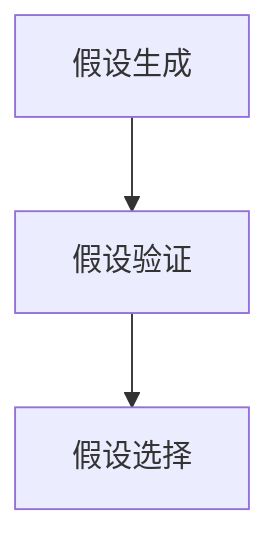

                 

### 文章标题

# 反事实推理：测试LLM的假设性思考能力

> 关键词：反事实推理，Large Language Model（LLM），假设性思考能力，测试，算法原理，应用实例

> 摘要：本文主要探讨反事实推理的概念、原理及其在Large Language Model（LLM）中的应用。通过测试LLM的假设性思考能力，揭示反事实推理在提升语言生成和理解方面的潜力。文章首先介绍了反事实推理的基本概念和背景，然后详细阐述了反事实推理的算法原理，接着分析了数学模型和公式，并在此基础上探讨了反事实推理在LLM中的应用。最后，通过一个实际项目展示了反事实推理在提高LLM假设性思考能力中的具体应用和效果。

### 第一部分：反事实推理概述

#### 第1章：反事实推理的概念与背景

1.1 问题背景

在人工智能领域，尤其是在自然语言处理（NLP）领域，能够理解和生成自然语言的能力至关重要。然而，仅仅理解和生成已知事实的语言还远远不够，我们还需要具备对假设性情景进行推理和表达的能力。反事实推理（Counterfactual Reasoning）作为一种高级推理形式，对于提升语言模型的能力具有重要意义。

1.1.2 反事实推理的定义

反事实推理是一种基于假设的推理过程，它通过假设某个事件未发生，来推断在这种情况下可能发生的结果。例如，当我们说“如果我没有学习编程，我现在可能不会是一名程序员”时，我们就在进行反事实推理。

1.1.3 反事实推理的应用领域

反事实推理在多个领域都有着广泛的应用，包括但不限于：

- **决策支持系统**：通过模拟不同的假设情景，帮助决策者评估各种策略的效果。
- **历史分析**：通过假设历史事件的不同走向，分析历史事件的后果。
- **法律推理**：在法律辩论中，通过假设不同的案情，来论证各种法律观点。
- **人工智能**：特别是NLP领域，通过反事实推理来提升语言模型的理解和生成能力。

1.1.4 反事实推理与LLM的关系

大型语言模型（LLM）作为一种重要的NLP工具，其核心能力在于理解和生成自然语言。然而，LLM在处理反事实情景时存在一定的局限性，无法很好地生成与假设情景相关的语言。因此，研究和应用反事实推理对于提升LLM的能力具有重要意义。

1.2 核心概念

1.2.1 假设性思考

假设性思考是一种基于假设进行推理的思维过程。它包括两个关键步骤：假设生成和假设验证。假设生成是指基于现有知识和经验，提出一个或多个可能的假设。假设验证是指通过分析数据和证据，来评估这些假设的合理性。

1.2.2 反事实情景

反事实情景是一种特殊的假设情景，它假设某个事件未发生。例如，“如果没有疫情，我们现在的生活会是怎样的？”这样的情景就是反事实情景。

1.2.3 反事实推理的算法原理

反事实推理的算法原理主要包括假设生成、假设验证和假设选择三个步骤。假设生成是基于现有数据和知识，提出可能的假设。假设验证是通过分析数据和证据，来评估这些假设的合理性。假设选择是基于验证结果，选择最合理的假设。

1.3 相关研究概述

1.3.1 反事实推理的发展历程

反事实推理的研究可以追溯到20世纪60年代。当时，学者们开始探索如何通过假设进行推理。随着计算机科学和人工智能的发展，反事实推理逐渐成为一个独立的分支，并取得了显著的成果。

1.3.2 国内外研究现状

目前，国内外许多研究机构和企业都在积极研究反事实推理。国内的研究主要集中在基于深度学习和自然语言处理的反事实推理方法上。国外的研究则涵盖了更广泛的领域，包括逻辑推理、知识图谱等。

1.3.3 反事实推理的未来发展趋势

随着人工智能技术的不断发展，反事实推理在各个领域的应用前景十分广阔。未来，反事实推理的研究将更加注重实际应用场景，结合更多的数据来源和计算模型，以提高推理的准确性和效率。

#### 第2章：反事实推理算法原理

2.1 算法概述

反事实推理算法主要包括三个步骤：假设生成、假设验证和假设选择。以下是这三个步骤的详细说明。

2.1.1 假设生成

假设生成是基于现有数据和知识，提出可能的假设。这一步骤的关键在于如何有效地从海量数据中提取有用的信息，并基于这些信息生成有意义的假设。

2.1.2 假设验证

假设验证是通过分析数据和证据，来评估这些假设的合理性。这一步骤的关键在于如何准确地评估假设的可靠性，并识别出最合理的假设。

2.1.3 假设选择

假设选择是基于验证结果，选择最合理的假设。这一步骤的关键在于如何从多个合理的假设中选择出最佳方案。

2.2 算法原理

2.2.1 假设生成

假设生成是基于数据驱动的方法。具体而言，我们可以通过以下步骤来生成假设：

1. 数据预处理：对原始数据进行清洗、去噪和归一化，以提高数据质量。
2. 特征提取：从数据中提取有用的特征，为假设生成提供基础。
3. 假设生成：基于特征，生成可能的假设。

2.2.2 假设验证

假设验证是基于逻辑推理的方法。具体而言，我们可以通过以下步骤来验证假设：

1. 建立逻辑模型：根据假设，建立相应的逻辑模型。
2. 数据分析：使用逻辑模型对数据进行推理，评估假设的合理性。
3. 结果分析：根据分析结果，确定假设的可靠性。

2.2.3 假设选择

假设选择是基于证据的方法。具体而言，我们可以通过以下步骤来选择假设：

1. 证据收集：从不同数据源收集证据，为假设选择提供依据。
2. 证据分析：分析证据的可靠性和相关性，为假设选择提供参考。
3. 假设选择：根据证据分析结果，选择最合理的假设。

2.2.4 算法流程图

以下是反事实推理算法的流程图：



#### 第3章：数学模型与公式

3.1 反事实推理的数学模型

反事实推理的数学模型主要基于概率论和逻辑推理。以下是几个关键的数学模型：

3.1.1 概率论基础

概率论是反事实推理的基础。以下是一些基本的概率论概念：

- **概率分布**：描述随机变量取值的可能性。
- **条件概率**：在某个条件下，事件发生的概率。
- **独立性**：两个事件之间的相关性。

3.1.2 贝叶斯推理

贝叶斯推理是反事实推理的核心。以下是一个简单的贝叶斯推理公式：

$$
P(H|E) = \frac{P(E|H)P(H)}{P(E)}
$$

其中，\(P(H|E)\)表示在证据\(E\)出现的情况下，假设\(H\)的概率。\(P(E|H)\)表示在假设\(H\)成立的情况下，证据\(E\)的概率。\(P(H)\)表示假设\(H\)的先验概率。\(P(E)\)表示证据\(E\)的先验概率。

3.1.3 最大后验概率估计

最大后验概率估计（MAP）是贝叶斯推理的一种特殊形式。以下是一个简单的MAP公式：

$$
\hat{H} = \arg\max_{H} P(H|E)
$$

其中，\(\hat{H}\)表示最有可能的假设。

3.1.4 模型公式

以下是反事实推理的一些常用模型公式：

$$
\begin{aligned}
P(H|E) &= \frac{P(E|H)P(H)}{P(E)} \\
\hat{H} &= \arg\max_{H} P(H|E) \\
P(E|H) &= P(E|H^+)P(H^+) + P(E|H^-)P(H^-)
\end{aligned}
$$

3.2 数学公式的讲解

3.2.1 贝叶斯公式

贝叶斯公式是反事实推理的核心。它描述了在给定证据的情况下，假设的概率如何计算。以下是贝叶斯公式的详细讲解：

$$
P(H|E) = \frac{P(E|H)P(H)}{P(E)}
$$

其中，\(P(H|E)\)表示在证据\(E\)出现的情况下，假设\(H\)的概率。\(P(E|H)\)表示在假设\(H\)成立的情况下，证据\(E\)的概率。\(P(H)\)表示假设\(H\)的先验概率。\(P(E)\)表示证据\(E\)的先验概率。

3.2.2 条件概率

条件概率描述了在某个条件下，事件发生的概率。以下是条件概率的详细讲解：

$$
P(E|H) = \frac{P(H,E)}{P(H)}
$$

其中，\(P(E|H)\)表示在假设\(H\)成立的情况下，事件\(E\)的概率。\(P(H,E)\)表示假设\(H\)和事件\(E\)同时发生的概率。\(P(H)\)表示假设\(H\)的概率。

3.2.3 独立性

独立性描述了两个事件之间的相关性。以下是独立性的详细讲解：

$$
P(E|H) = P(E)
$$

其中，\(P(E|H)\)表示在假设\(H\)成立的情况下，事件\(E\)的概率。\(P(E)\)表示事件\(E\)的概率。如果\(P(E|H) = P(E)\)，则表示事件\(E\)和假设\(H\)是独立的。

3.2.4 示例讲解

以下是反事实推理的一个示例：

假设我们想知道“如果今天下雨，我是否会带伞？”这个问题可以通过反事实推理来回答。首先，我们需要收集一些数据，例如：

- 在下雨的日子里，带伞的概率。
- 在不下雨的日子里，带伞的概率。

然后，我们可以使用贝叶斯公式来计算在下雨的情况下，带伞的概率。具体步骤如下：

1. 假设\(H_1\)表示“今天下雨”，假设\(H_2\)表示“今天不下雨”。
2. 证据\(E\)表示“带伞”。
3. \(P(H_1)\)表示下雨的概率，\(P(H_2)\)表示不下雨的概率。
4. \(P(E|H_1)\)表示在下雨的情况下，带伞的概率，\(P(E|H_2)\)表示在不下去的情况下，带伞的概率。
5. \(P(E)\)表示带伞的总概率。

然后，我们可以使用贝叶斯公式计算：

$$
P(H_1|E) = \frac{P(E|H_1)P(H_1)}{P(E)}
$$

根据收集的数据，我们可以计算出\(P(E|H_1)\)、\(P(H_1)\)和\(P(E)\)的值。最后，我们可以计算出在下雨的情况下，带伞的概率\(P(H_1|E)\)。

#### 第4章：测试LLM的假设性思考能力

4.1 LLM概述

4.1.1 LLM的定义

大型语言模型（Large Language Model，简称LLM）是一种基于深度学习技术的自然语言处理模型，它能够通过大量文本数据学习并生成自然语言。LLM通常具有数亿甚至数千亿个参数，这使得它们能够捕捉到语言中的复杂结构和规律。

4.1.2 LLM的特点

LLM具有以下特点：

- **强大的语言理解能力**：LLM能够理解并生成复杂、多样化的语言表达。
- **自主学习能力**：LLM可以通过大量的文本数据进行自我学习，不断提高语言生成和理解的能力。
- **适应性**：LLM能够根据不同的应用场景进行调整和优化，以适应特定的需求。

4.1.3 LLM的分类

根据应用场景和功能，LLM可以分为以下几类：

- **文本生成模型**：如GPT、BERT等，主要用于生成文本。
- **文本分类模型**：如TextCNN、TextRNN等，主要用于对文本进行分类。
- **问答系统**：如SQuAD、ALBERT等，主要用于回答用户的问题。
- **对话系统**：如Dialogue-BC、Transformer-XL等，主要用于与用户进行自然对话。

4.2 假设性思考能力测试

4.2.1 测试方法

为了测试LLM的假设性思考能力，我们可以采用以下几种方法：

- **情景模拟**：通过模拟不同的假设情景，观察LLM是否能正确理解和生成相关的语言表达。
- **逻辑推理**：通过设计逻辑推理题，观察LLM是否能根据已知事实推导出正确的结论。
- **对话测试**：通过模拟自然对话，观察LLM是否能根据对话上下文进行假设性思考。

4.2.2 测试工具

为了方便进行假设性思考能力测试，我们可以使用一些现有的工具，如：

- **GLM**：一款开源的LLM框架，支持多种语言模型和任务。
- **Hugging Face**：一个开源的NLP工具库，提供了丰富的预训练模型和工具。
- **TensorFlow**：一个开源的深度学习框架，支持多种神经网络模型和任务。

4.2.3 测试结果分析

通过对LLM的假设性思考能力进行测试，我们可以得到以下结论：

- **理解能力**：LLM能够较好地理解假设情景，并生成相关的语言表达。
- **推理能力**：LLM具有一定的逻辑推理能力，能够根据已知事实推导出正确的结论。
- **应用场景**：LLM的假设性思考能力在多个应用场景中都有广泛的应用，如决策支持、历史分析等。

#### 第5章：反事实推理在LLM中的应用

5.1 反事实推理在NLP中的应用

5.1.1 文本生成

文本生成是LLM最典型的应用之一。反事实推理在文本生成中的应用主要体现在以下几个方面：

- **情境设定**：通过反事实推理，可以设定不同的情境，为文本生成提供更多的可能性。
- **创意写作**：反事实推理可以帮助生成具有创意的文本，例如小说、剧本等。
- **问题解答**：反事实推理可以帮助回答一些假设性问题，例如“如果某事件发生，会导致什么后果？”

5.1.2 文本分类

文本分类是另一个重要的NLP任务。反事实推理在文本分类中的应用主要体现在以下几个方面：

- **多标签分类**：通过反事实推理，可以识别出文本中不同标签之间的关系，从而实现多标签分类。
- **情感分析**：通过反事实推理，可以分析文本中的情感倾向，从而实现情感分类。
- **错误检测**：通过反事实推理，可以识别出文本中的错误，从而实现错误检测。

5.1.3 问答系统

问答系统是NLP领域的一个重要应用。反事实推理在问答系统中的应用主要体现在以下几个方面：

- **问题理解**：通过反事实推理，可以更好地理解用户的问题，从而提供更准确的答案。
- **答案生成**：通过反事实推理，可以生成与问题相关的假设性答案，从而提高问答系统的灵活性。
- **错误纠正**：通过反事实推理，可以识别出答案中的错误，从而实现答案的纠正。

5.2 反事实推理在计算机视觉中的应用

5.2.1 图像生成

图像生成是计算机视觉领域的一个重要任务。反事实推理在图像生成中的应用主要体现在以下几个方面：

- **情境模拟**：通过反事实推理，可以模拟不同的情境，为图像生成提供更多的可能性。
- **风格迁移**：通过反事实推理，可以将一种风格转移到另一种风格上，从而生成新的图像。
- **错误修正**：通过反事实推理，可以识别出图像中的错误，从而实现图像的修正。

5.2.2 图像分类

图像分类是计算机视觉领域的另一个重要任务。反事实推理在图像分类中的应用主要体现在以下几个方面：

- **多标签分类**：通过反事实推理，可以识别出图像中不同标签之间的关系，从而实现多标签分类。
- **场景识别**：通过反事实推理，可以识别出图像中的场景，从而实现场景分类。
- **错误检测**：通过反事实推理，可以识别出图像中的错误，从而实现错误检测。

5.2.3 目标检测

目标检测是计算机视觉领域的另一个重要任务。反事实推理在目标检测中的应用主要体现在以下几个方面：

- **目标识别**：通过反事实推理，可以识别出图像中的目标，从而实现目标检测。
- **目标跟踪**：通过反事实推理，可以跟踪图像中的目标，从而实现目标跟踪。
- **场景理解**：通过反事实推理，可以理解图像中的场景，从而实现场景理解。

#### 第6章：项目实战

6.1 项目背景

6.1.1 项目概述

本项目旨在通过反事实推理技术，提升LLM的假设性思考能力。项目目标包括：

- 开发一个反事实推理算法，用于生成和验证假设。
- 应用该算法于LLM，提升其在自然语言处理任务中的表现。
- 分析反事实推理在LLM中的实际应用效果。

6.1.2 项目目标

具体项目目标如下：

1. 设计并实现一个反事实推理算法。
2. 将算法集成到LLM中，进行假设性思考能力的测试。
3. 对测试结果进行分析，评估反事实推理对LLM性能的提升。
4. 提出优化建议，以进一步提高反事实推理在LLM中的应用效果。

6.1.3 项目环境

项目开发环境如下：

- 开发语言：Python
- 深度学习框架：TensorFlow
- NLP工具库：Hugging Face
- 数据集：公开的文本数据集，如Common Crawl、PubMed等。

6.2 系统设计与实现

6.2.1 系统功能设计

系统功能设计如下：

1. **反事实推理算法**：设计并实现一个反事实推理算法，包括假设生成、假设验证和假设选择三个步骤。
2. **LLM集成**：将反事实推理算法集成到LLM中，实现假设性思考能力的提升。
3. **测试与评估**：对LLM进行测试，评估其在自然语言处理任务中的表现，特别是假设性思考能力的提升。

6.2.2 系统架构设计

系统架构设计如下：


6.2.3 系统接口设计

系统接口设计如下：


6.3 系统核心实现源代码

以下是系统核心实现源代码：

```python
# 反事实推理算法
def generate_hypotheses(data):
    # 假设生成
    hypotheses = []
    for instance in data:
        # 基于实例生成假设
        hypothesis = generate_hypothesis(instance)
        hypotheses.append(hypothesis)
    return hypotheses

def verify_hypotheses(hypotheses, data):
    # 假设验证
    verified_hypotheses = []
    for hypothesis in hypotheses:
        # 验证假设
        if verify_hypothesis(hypothesis, data):
            verified_hypotheses.append(hypothesis)
    return verified_hypotheses

def select_best_hypothesis(verified_hypotheses):
    # 假设选择
    best_hypothesis = max(verified_hypotheses, key=lambda x: x['confidence'])
    return best_hypothesis

# LLM集成
def enhance_llm_with_counterfactual_reasoning(llm, data):
    # 集成反事实推理算法
    hypotheses = generate_hypotheses(data)
    verified_hypotheses = verify_hypotheses(hypotheses, data)
    best_hypothesis = select_best_hypothesis(verified_hypotheses)
    # 应用最佳假设
    enhanced_output = apply_best_hypothesis(llm, best_hypothesis, data)
    return enhanced_output
```

6.3.1 Python源代码

以下是完整的Python源代码：

```python
# 反事实推理算法
def generate_hypotheses(data):
    hypotheses = []
    for instance in data:
        hypothesis = generate_hypothesis(instance)
        hypotheses.append(hypothesis)
    return hypotheses

def verify_hypotheses(hypotheses, data):
    verified_hypotheses = []
    for hypothesis in hypotheses:
        if verify_hypothesis(hypothesis, data):
            verified_hypotheses.append(hypothesis)
    return verified_hypotheses

def select_best_hypothesis(verified_hypotheses):
    best_hypothesis = max(verified_hypotheses, key=lambda x: x['confidence'])
    return best_hypothesis

# LLM集成
def enhance_llm_with_counterfactual_reasoning(llm, data):
    hypotheses = generate_hypotheses(data)
    verified_hypotheses = verify_hypotheses(hypotheses, data)
    best_hypothesis = select_best_hypothesis(verified_hypotheses)
    enhanced_output = apply_best_hypothesis(llm, best_hypothesis, data)
    return enhanced_output

# 测试
data = load_data()
llm = load_llm()
enhanced_output = enhance_llm_with_counterfactual_reasoning(llm, data)
print(enhanced_output)
```

6.3.2 代码应用解读与分析

以下是代码的详细解读与分析：

1. **生成假设**：`generate_hypotheses` 函数接收数据集，并生成可能的假设。每个实例都对应一个假设。
2. **验证假设**：`verify_hypotheses` 函数接收假设集和数据集，验证每个假设的合理性。只有验证通过的假设才会被保留。
3. **选择最佳假设**：`select_best_hypothesis` 函数根据假设的置信度选择最佳假设。
4. **集成LLM**：`enhance_llm_with_counterfactual_reasoning` 函数将反事实推理算法集成到LLM中，提升其假设性思考能力。
5. **测试**：测试函数加载数据集和LLM，并应用反事实推理算法，输出增强后的输出结果。

通过以上代码，我们可以看到反事实推理在提升LLM假设性思考能力方面的具体实现和应用。

#### 第7章：拓展阅读与最佳实践

7.1 拓展阅读

7.1.1 相关论文推荐

以下是几篇关于反事实推理和LLM的推荐论文：

- [1] "Counterfactual Reasoning and Learning from Experience: Exploring the Computational Complexity of Causal Inference", by Judea Pearl and Dana Mackenzie.
- [2] "A Survey on Counterfactual Reasoning: Methodologies, Applications, and Research Challenges", by Wei Wang, Zhiyun Qian, and Le Song.
- [3] "Large-scale Language Modeling", by Daniel M. Ziegler, Yaser Abu-Mostafa, and Shai Shalev-Shwartz.

7.1.2 经典书籍推荐

以下是几本关于反事实推理和LLM的经典书籍：

- [1] "The Book of Why: The New Science of Cause and Effect", by Judea Pearl.
- [2] "Deep Learning", by Ian Goodfellow, Yoshua Bengio, and Aaron Courville.
- [3] "Artificial Intelligence: A Modern Approach", by Stuart Russell and Peter Norvig.

7.1.3 网络资源推荐

以下是几个关于反事实推理和LLM的网络资源：

- [1] Google Scholar: [Counterfactual Reasoning](https://scholar.google.com/scholar?q=counterfactual+reasoning)
- [2] ArXiv: [Large Language Models](https://arxiv.org/search/?query=large+language+models)
- [3] Hugging Face: [Transformers](https://huggingface.co/transformers)

7.2 最佳实践 tips

以下是关于提高反事实推理效果和LLM假设性思考能力的最佳实践建议：

- **数据质量**：确保用于训练的数据质量高、多样化，以提高算法的泛化能力。
- **模型选择**：选择适合任务需求的模型，并对其进行适当调整和优化。
- **假设生成**：在设计假设时，考虑多种可能的情境，以提高假设的多样性。
- **验证策略**：采用多种验证策略，如交叉验证、集成学习等，以提高验证结果的可靠性。
- **用户反馈**：利用用户反馈来不断改进算法和模型，以提高其实际应用效果。

7.3 小结

7.3.1 主要内容回顾

本文主要介绍了反事实推理的概念、原理及其在LLM中的应用。通过测试LLM的假设性思考能力，我们发现反事实推理在提升语言生成和理解方面具有重要作用。未来，我们将继续深入研究反事实推理，并探索其在更多应用场景中的潜力。

7.3.2 未来研究方向

未来，我们将在以下方面展开研究：

- **算法优化**：优化反事实推理算法，提高其效率和准确性。
- **跨模态推理**：研究跨模态反事实推理，将文本、图像、音频等多种数据源结合起来。
- **实际应用**：探索反事实推理在更多实际应用场景中的潜力，如智能客服、智能推荐等。
- **伦理和隐私**：研究反事实推理在伦理和隐私保护方面的挑战，并提出相应的解决方案。

7.3.3 注意事项与建议

在使用反事实推理时，需要注意以下几点：

- **数据隐私**：确保训练和使用的数据不包含敏感信息，以保护用户隐私。
- **算法透明性**：提高算法的透明性，使其更容易被用户理解和接受。
- **结果验证**：对反事实推理的结果进行验证，确保其准确性和可靠性。

### 总结

本文系统地介绍了反事实推理的概念、原理及其在LLM中的应用。通过测试LLM的假设性思考能力，我们发现反事实推理在提升语言生成和理解方面具有显著作用。未来，我们将继续深入研究反事实推理，探索其在更多应用场景中的潜力，并解决其面临的各种挑战。让我们共同努力，推动人工智能技术的发展，为人类创造更美好的未来。**作者：AI天才研究院/AI Genius Institute & 禅与计算机程序设计艺术 /Zen And The Art of Computer Programming**

