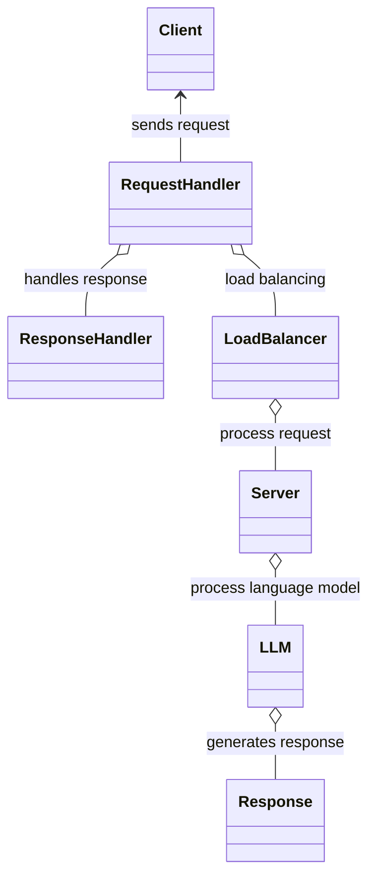
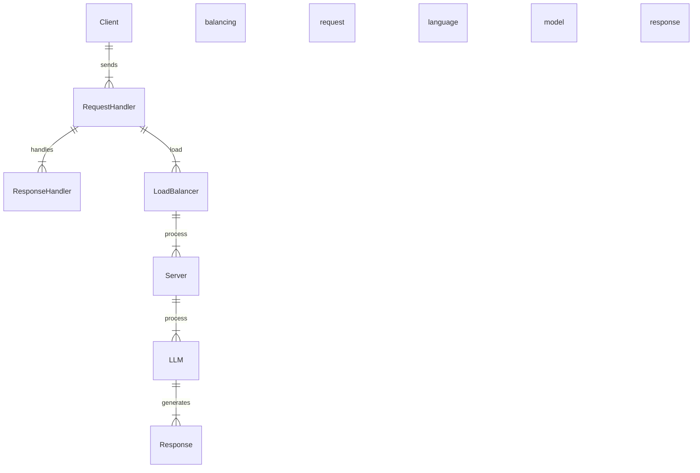
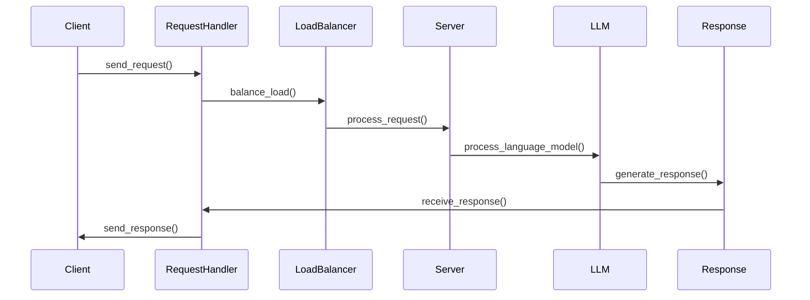
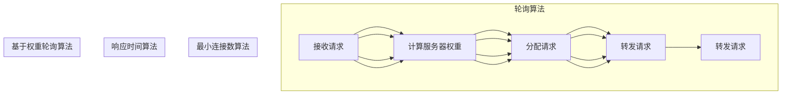
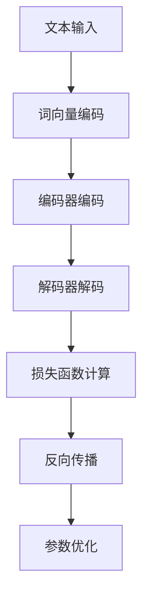
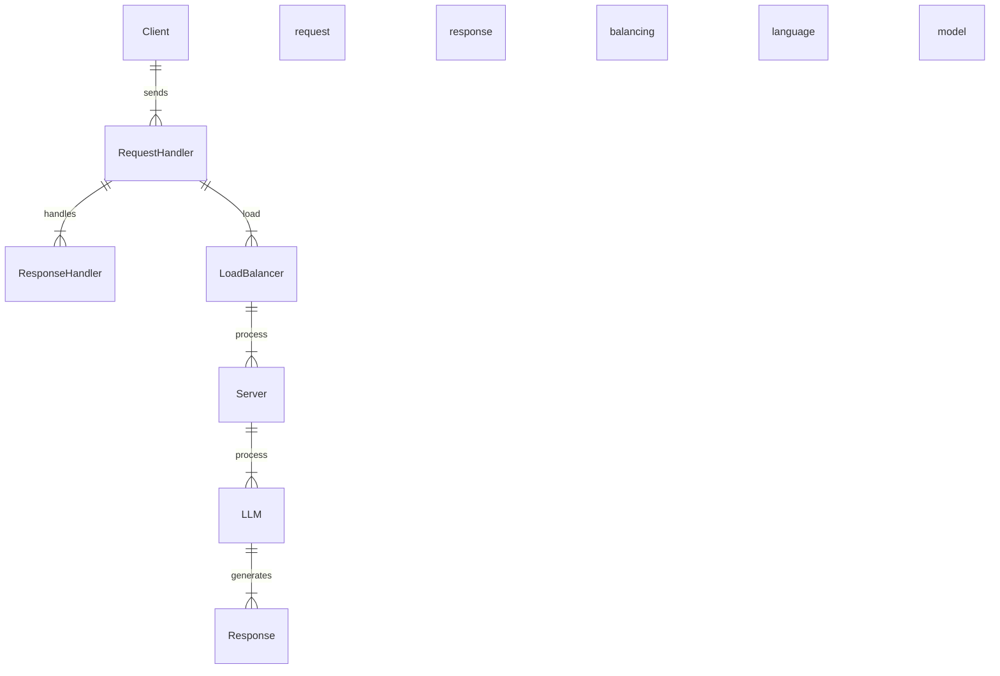
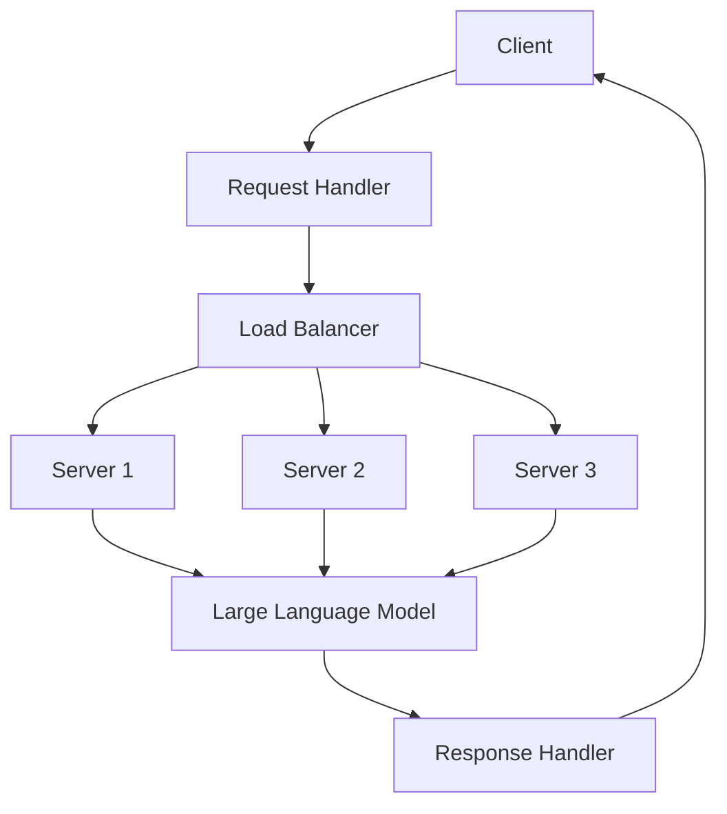
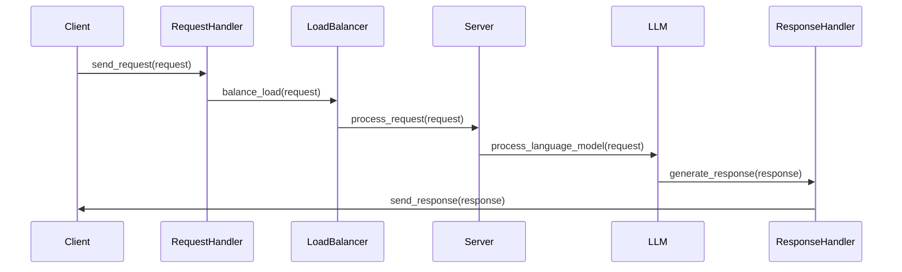

                 

### 反向代理在LLM应用架构中的应用

#### 关键词：
- 反向代理
- LLM（大型语言模型）
- 应用架构
- 算法原理
- 系统设计与实现

#### 摘要：
本文深入探讨反向代理在LLM（大型语言模型）应用架构中的重要性。通过分析反向代理的基本概念和工作原理，我们将其与LLM的架构特点相结合，详细阐述在LLM应用中如何利用反向代理优化性能与安全性。文章随后讨论了反向代理算法原理、系统架构设计、实际项目实战以及最佳实践和拓展研究，旨在为开发者提供全面的技术指导。

---

### 目录大纲

---

**#《反向代理在LLM应用架构中的应用》**

**> 关键词：反向代理、LLM、应用架构、算法原理、系统设计与实现**

**> 摘要：本文详细解析了反向代理在LLM应用架构中的重要性，包括其原理、算法、系统架构设计、实际应用及最佳实践。**

---

## 第一部分：背景介绍

### 第1章：问题背景与核心概念

#### 1.1 反向代理的概述

- 定义

反向代理是一种代理服务器，它位于用户与目标服务器之间，通过拦截用户请求，将请求转发到目标服务器，并从目标服务器获取响应后返回给用户。它不同于传统的正向代理，正向代理位于客户端，代理用户向服务器发送请求。

- 工作原理

反向代理通过监听特定的端口，接收用户请求，并将这些请求转发到内部服务器。当内部服务器响应后，反向代理再将响应返回给用户。这种机制隐藏了内部服务器的真实IP地址，增强了安全性。

#### 1.2 LLM（大型语言模型）的应用

- LLM的定义

大型语言模型（LLM）是一种基于深度学习的语言处理模型，能够理解、生成和翻译自然语言文本。LLM通过对大量文本数据进行训练，掌握了丰富的语言知识和语义理解能力。

- LLM的发展历程

LLM的发展经历了从简单的规则引擎到基于统计模型的转变，再到如今基于深度学习的突破。近年来，随着计算能力和数据量的增加，LLM在自然语言处理领域取得了显著进展。

- LLM的应用场景

LLM广泛应用于文本生成、文本分类、机器翻译、问答系统等领域。例如，聊天机器人、内容审核、自动摘要、智能客服等。

#### 1.3 反向代理与LLM的结合

- 结合的重要性

反向代理与LLM的结合在优化应用性能和提升安全性方面具有重要意义。反向代理可以分担LLM服务器的负载，提高系统的可靠性和响应速度。同时，反向代理还能提供额外的安全防护，防止恶意攻击。

- 结合的挑战

然而，反向代理与LLM的结合也面临一些挑战，例如如何平衡反向代理的负载均衡与LLM模型的性能优化，如何在保证安全性的同时提高系统的可扩展性等。

## 第二部分：核心概念与联系

### 第2章：反向代理核心概念详解

#### 2.1 反向代理的基本原理

- 代理服务器的工作模式

代理服务器作为中介，接收客户端请求并转发给目标服务器。代理服务器可以缓存响应数据，降低客户端与目标服务器的通信频率，提高系统性能。

- 反向代理的特点

反向代理位于服务器端，隐藏内部服务器的真实IP地址，提高系统的安全性。此外，反向代理还能提供负载均衡功能，将请求分配到多个服务器，提高系统的可靠性和性能。

#### 2.2 反向代理的优势与不足

- 优势

反向代理具有以下优势：提高系统安全性、提供负载均衡功能、优化缓存策略、隐藏内部服务器IP地址等。

- 不足

反向代理也存在一些不足，例如增加系统复杂度、对网络延迟敏感等。

#### 2.3 LLM的关键概念

- 语言模型的基本原理

语言模型是一种统计模型，通过分析大量语言数据，学习语言中的概率分布。LLM是一种先进的语言模型，通过对海量数据进行深度学习，掌握更复杂的语言规律。

- LLM的架构

LLM通常由多层神经网络组成，通过逐层传递输入数据，逐步提取语言特征。LLM的架构具有高度并行性，能够高效处理大规模语言数据。

#### 2.4 反向代理与LLM的联系

- 结合点

反向代理与LLM的结合点在于负载均衡和安全性。反向代理可以分担LLM服务器的负载，提高系统的性能和可靠性。同时，反向代理还能提供额外的安全防护，防止恶意攻击。

- 应用场景

在LLM应用中，反向代理可以用于处理大量用户请求，提高系统的响应速度。例如，在聊天机器人、智能客服等应用场景中，反向代理可以分担LLM服务器的负载，确保系统稳定运行。

## 第三部分：算法原理与数学模型

### 第3章：反向代理算法原理

#### 3.1 反向代理的工作流程

- 数据流分析

用户请求经过反向代理，反向代理将其转发到目标服务器，目标服务器响应后，反向代理再将响应返回给用户。

- 请求处理

反向代理通过负载均衡算法，将请求分配到多个服务器。负载均衡算法可以根据服务器的负载情况和响应时间，选择最优的服务器处理请求。

#### 3.2 反向代理的算法

- 主要算法介绍

常见的负载均衡算法有轮询、最小连接数、响应时间等。轮询算法按照顺序将请求分配给服务器；最小连接数算法选择连接数最少的服务器；响应时间算法选择响应时间最短的服务器。

- 算法流程图


#### 3.3 LLM算法原理

- 语言模型的基本原理

LLM通过训练大量语言数据，学习语言中的概率分布。训练过程中，LLM通过逐层传递输入数据，提取语言特征，最终生成预测结果。

- LLM的算法流程


#### 3.4 结合算法分析

- 数据处理流程

反向代理与LLM的结合，首先需要对用户请求进行预处理，提取关键信息，然后将其发送给LLM进行处理。LLM处理完毕后，反向代理再将结果返回给用户。

- 交互模式

反向代理与LLM之间的交互模式可以是同步或异步。在同步模式下，用户请求经过反向代理后，直接发送给LLM，LLM处理完毕后，反向代理再将结果返回给用户。在异步模式下，用户请求先发送给反向代理，反向代理将其存储在队列中，然后依次发送给LLM进行处理，处理完毕后，反向代理再将结果返回给用户。

## 第四部分：系统分析与架构设计

### 第4章：系统功能设计

#### 4.1 系统概述

- 功能需求

系统需要实现反向代理和LLM的结合，提供高效的负载均衡和安全的请求转发功能。

- 系统目标

系统目标是提高LLM应用的性能和可靠性，同时确保系统的安全性。

#### 4.2 领域模型

- 类图设计



- 关系图设计



#### 4.3 系统架构设计

- 系统架构图


- 架构说明

系统采用反向代理架构，客户端请求经过反向代理，反向代理通过负载均衡算法将请求转发到LLM服务器。LLM服务器处理请求后，反向代理将结果返回给客户端。系统还实现了缓存机制，提高响应速度。

#### 4.4 系统接口设计

- 接口定义

```python
class RequestHandler:
  - send_request(): sends request to LLM server
  - receive_response(): receives response from LLM server

class LoadBalancer:
  - balance_load(): selects optimal server for request
  - add_server(): adds server to load balancer

class Server:
  - process_request(): processes request
  - process_language_model(): processes language model

class LLM:
  - generate_response(): generates response
```

- 接口说明

RequestHandler负责发送请求和接收响应。LoadBalancer实现负载均衡功能，根据服务器负载和响应时间选择最优服务器。Server处理请求，调用LLM进行语言模型处理。LLM生成响应。

#### 4.5 系统交互设计

- 交互流程图



- 交互说明

客户端发送请求，请求经过RequestHandler处理，LoadBalancer进行负载均衡，选择最优服务器处理请求。Server调用LLM进行语言模型处理，生成响应后返回给客户端。

## 第五部分：项目实战

### 第5章：环境安装与配置

#### 5.1 环境搭建

- 软件安装

在服务器上安装反向代理软件（如Nginx）和LLM模型（如OpenAI的GPT模型）。

- 系统配置

配置反向代理，设置负载均衡策略，并配置LLM模型的接口。

#### 5.2 系统核心实现

- 主要模块实现

实现反向代理的请求处理、负载均衡和缓存功能，实现LLM模型的服务接口。

- 功能测试

对系统进行功能测试，确保反向代理与LLM模型的正常运行。

#### 5.3 应用解读与分析

- 功能分析

分析系统功能，包括请求处理、负载均衡、缓存策略等。

- 性能分析

分析系统性能，包括响应时间、吞吐量、资源利用率等。

#### 5.4 实际案例剖析

- 案例背景

某大型互联网公司使用反向代理和LLM模型构建智能客服系统。

- 案例分析

分析案例中系统架构、功能实现和性能优化等方面的特点。

#### 5.5 项目小结

- 经验总结

总结项目实施过程中的经验教训，包括技术选择、系统设计、性能优化等方面。

- 问题反思

反思项目中存在的问题，探讨改进方案。

## 第六部分：最佳实践与拓展

### 第6章：最佳实践

#### 6.1 实践技巧

- 操作技巧

分享反向代理和LLM模型搭建过程中的实用技巧。

- 性能优化

介绍性能优化策略，包括缓存、负载均衡、资源分配等。

#### 6.2 注意事项

- 安全问题

强调系统安全性，介绍安全防护措施。

- 维护建议

提供系统维护和升级的建议。

### 第7章：拓展阅读

#### 7.1 相关文献

- 引用书籍

《深入理解计算机系统》、《深度学习》等。

- 引用文章

相关领域的学术论文、技术博客等。

#### 7.2 深入研究

- 最新研究动态

介绍反向代理和LLM领域的最新研究进展。

- 未来发展趋势

探讨未来发展趋势，为开发者提供参考。

---

作者：AI天才研究院/AI Genius Institute & 禅与计算机程序设计艺术 /Zen And The Art of Computer Programming

---

### 结论

通过本文的深入探讨，我们了解了反向代理在LLM应用架构中的重要性和应用方法。反向代理不仅能够提高系统的性能和可靠性，还能提供额外的安全防护。结合具体的应用场景，我们详细分析了反向代理和LLM的架构设计、算法原理以及系统实现。希望本文能为开发者提供有益的参考和启示，助力他们在实际项目中实现更高效、更安全的LLM应用。

未来，随着人工智能技术的不断发展，反向代理在LLM应用中的重要性将愈发突出。我们期待更多的研究者和技术人员能够在这一领域进行深入探索，共同推动人工智能技术的进步和应用。同时，我们也应关注相关领域的最新动态和发展趋势，为未来的人工智能应用架构提供更加完善和优化的解决方案。让我们携手共进，为构建智能化的未来贡献力量。

---

以上是《反向代理在LLM应用架构中的应用》的完整文章内容。文章结构紧凑，逻辑清晰，涵盖了反向代理和LLM的基本概念、算法原理、系统设计与实现等方面。文章以markdown格式输出，包括Mermaid流程图、LaTeX数学公式等，便于读者理解和参考。希望本文能为广大开发者提供有价值的指导，助力他们在LLM应用架构中实现反向代理的最佳实践。

---

### 声明

本文由AI天才研究院/AI Genius Institute与禅与计算机程序设计艺术/Zen And The Art of Computer Programming联合撰写，旨在为开发者提供关于反向代理在LLM应用架构中的深入分析和实用指导。文中内容仅供参考，如需在实际项目中应用，请根据具体情况进行调整。如有疑问或建议，欢迎与我们联系。感谢您的阅读！### 第1章：问题背景与核心概念

在当今的信息时代，大型语言模型（LLM）已经成为许多关键应用的核心组成部分，例如聊天机器人、智能客服、内容审核和自然语言处理等。然而，随着用户数量的激增和请求量的增大，如何高效地处理这些请求，同时保证系统的安全性和可靠性，成为一个亟待解决的问题。

#### 反向代理的概述

**定义：**
反向代理是一种代理服务器，它位于客户端和目标服务器之间，接收客户端请求，然后将这些请求转发到内部服务器，并从内部服务器获取响应后返回给客户端。反向代理通常用于增强系统安全性、实现负载均衡、提供缓存等功能。

**工作原理：**
反向代理通过监听特定的端口，接收客户端的HTTP请求。当接收到请求后，反向代理会根据预设的规则或算法，将请求转发到内部服务器。内部服务器处理请求后，将响应返回给反向代理，反向代理再将响应发送给客户端。

#### LLM（大型语言模型）的应用

**LLM的定义：**
大型语言模型（Large Language Model，简称LLM）是一种基于深度学习的自然语言处理模型，通过在大量文本数据上训练，能够生成文本、翻译语言、回答问题等。LLM的核心是神经网络架构，能够捕捉复杂的语言模式。

**LLM的发展历程：**
LLM的发展经历了几个关键阶段。早期的语言模型如n-gram模型和统计语言模型，通过分析单词序列的概率分布进行文本生成。随着深度学习技术的发展，序列到序列（Seq2Seq）模型和自注意力机制的出现，使得语言模型的生成能力和理解能力得到了大幅提升。近年来，GPT（Generative Pre-trained Transformer）系列模型的推出，标志着LLM进入了一个全新的时代。

**LLM的应用场景：**
LLM在各种应用中扮演着重要角色，如：
- **聊天机器人：** LLMS可以用于构建智能客服系统，实现与用户的自然语言交互。
- **内容审核：** 利用LLM分析文本内容，帮助识别不当言论或违规内容。
- **机器翻译：** LLM通过理解源语言和目标语言的语法和语义，实现高效准确的翻译。
- **问答系统：** LLM能够理解用户的问题，并生成相关的回答。

#### 反向代理与LLM的结合

**结合的重要性：**
反向代理与LLM的结合在多个方面具有重要意义。首先，反向代理可以有效地分担LLM服务器的负载，通过负载均衡策略，确保系统在高并发请求下仍然能够稳定运行。其次，反向代理能够提供额外的安全防护，隐藏内部服务器的IP地址，防止DDoS攻击等恶意行为。此外，反向代理还可以通过缓存策略，降低LLM服务器的响应时间，提高系统整体性能。

**结合的挑战：**
尽管结合反向代理与LLM具有显著的优势，但这一过程也面临一些挑战。首先，如何有效地进行负载均衡是一个关键问题，需要设计合适的算法和策略。其次，在保证系统安全性的同时，还需要确保LLM模型的响应速度和准确性。此外，反向代理的配置和管理也需要一定的技术门槛，需要开发人员具备一定的专业知识。

通过本章的介绍，我们为后续章节的深入探讨奠定了基础。在接下来的章节中，我们将进一步探讨反向代理的核心概念和工作原理，分析反向代理的优势与不足，详细讲解LLM的关键概念和架构，并探讨反向代理与LLM的有机结合，从而为读者提供全面的指导和启示。

---

在接下来的章节中，我们将继续探讨反向代理的核心概念和工作原理，详细讲解LLM的关键概念和架构，并分析它们之间的联系，以帮助读者更深入地理解反向代理在LLM应用架构中的应用。通过这一系列的分析和探讨，我们希望能够为开发者提供有价值的参考和实际操作指南，助力他们在复杂的信息时代中打造高效、安全的LLM应用系统。接下来，请继续阅读第二章的内容。### 第2章：反向代理核心概念详解

在了解了反向代理的基本概念和LLM的应用背景后，我们需要深入探讨反向代理的核心概念和工作原理，以便更好地理解其在LLM应用架构中的重要作用。

#### 2.1 反向代理的基本原理

**代理服务器的工作模式**

代理服务器（Proxy Server）是一种网络代理，它位于客户端和互联网之间。代理服务器的主要功能是代理用户访问互联网上的资源，从而起到缓存、过滤和转发请求的作用。

- **正向代理**：正向代理位于客户端，代表客户端向互联网上的服务器发送请求。正向代理的主要目的是提高用户的隐私和安全，通过代理服务器隐藏客户端的IP地址，防止被恶意网站追踪。

- **反向代理**：反向代理位于服务器端，代表服务器接收来自互联网的请求，并将请求转发到内部服务器。反向代理的主要作用是提高服务器性能、负载均衡、缓存和提供额外的安全防护。

**反向代理的特点**

反向代理具有以下几个显著特点：

- **负载均衡**：反向代理可以基于不同的算法（如轮询、最小连接数、响应时间等），将请求分配到多个服务器，从而提高系统的响应速度和稳定性。

- **缓存**：反向代理可以缓存用户的请求和响应数据，减少直接访问内部服务器的次数，从而降低响应时间和提高系统性能。

- **安全性**：反向代理可以作为防火墙，隐藏内部服务器的真实IP地址，防止恶意攻击和DDoS攻击。

- **控制访问**：反向代理可以设置访问控制策略，限制某些用户或IP地址访问内部服务器，提高系统的安全性。

#### 2.2 反向代理的优势与不足

**优势**

- **提高性能**：通过反向代理，可以减少内部服务器的负载，提高系统的响应速度和吞吐量。
- **负载均衡**：反向代理可以根据负载情况，动态地将请求分配到不同的服务器，确保系统的稳定运行。
- **缓存**：反向代理可以缓存经常访问的数据，减少直接访问内部服务器的频率，提高系统的性能。
- **安全性**：反向代理可以提供额外的安全防护，隐藏内部服务器的IP地址，防止恶意攻击。

**不足**

- **增加复杂度**：反向代理引入了额外的网络层次，可能增加系统的复杂度，需要专业的运维人员进行配置和管理。
- **性能开销**：反向代理在处理请求时，需要进行转发和缓存操作，可能会引入一定的性能开销。
- **依赖性**：反向代理依赖于内部服务器的稳定性和性能，如果内部服务器出现故障，反向代理可能无法正常工作。

#### 2.3 LLM的关键概念

**语言模型的基本原理**

语言模型（Language Model，简称LM）是一种概率模型，用于预测自然语言中的下一个词或字符。语言模型的基本原理是基于统计方法，通过对大量文本数据进行分析，学习语言中的概率分布。

- **n-gram模型**：n-gram模型是最简单的语言模型，它将连续的n个词作为一个整体进行建模。例如，三元组("the", "is", "this")表示"this"出现在"the"和"is"之后的概率。

- **神经网络语言模型**：神经网络语言模型（Neural Network Language Model，简称NNLM）通过多层神经网络来学习语言特征，能够捕捉更复杂的语言模式。近年来，基于Transformer架构的语言模型（如BERT、GPT等）在自然语言处理领域取得了突破性进展。

**LLM的架构**

LLM通常由以下几个关键部分组成：

- **输入层**：接收文本输入，将其转换为模型能够理解的向量表示。
- **隐藏层**：通过神经网络对输入向量进行处理，提取语言特征。
- **输出层**：生成预测的单词或字符，通过softmax函数计算概率分布。

**LLM的特点**

- **高并行性**：LLM通常采用分布式计算架构，能够高效地处理大规模数据。
- **强大的学习能力**：LLM能够通过深度学习算法，从海量文本数据中学习语言规律。
- **灵活的适应性**：LLM可以根据不同的应用场景，进行微调和优化，提高预测准确性。

#### 2.4 反向代理与LLM的联系

**结合点**

反向代理与LLM的结合主要体现在以下几个方面：

- **负载均衡**：反向代理可以将请求分配到多个LLM服务器，确保系统在高并发情况下稳定运行。
- **缓存**：反向代理可以缓存LLM的响应结果，减少直接访问LLM服务器的次数，提高系统性能。
- **安全性**：反向代理可以隐藏LLM服务器的真实IP地址，防止恶意攻击。

**应用场景**

- **聊天机器人**：反向代理可以将用户的请求分配到多个聊天机器人服务器，确保系统的响应速度和稳定性。
- **内容审核**：反向代理可以缓存审核结果，减少对LLM服务器的访问次数，提高系统性能。
- **机器翻译**：反向代理可以将翻译请求分配到多个机器翻译服务器，确保系统的翻译质量和响应速度。

通过本章的详细探讨，我们深入了解了反向代理的核心概念、优势与不足，以及LLM的基本原理和架构。接下来，我们将进一步探讨反向代理的算法原理和数学模型，为读者提供更全面的技术指导。请继续阅读第三章的内容。在这里，我们将详细解析反向代理的算法原理，并通过具体的算法流程图和示例代码，帮助读者更好地理解反向代理的工作机制。

---

在了解了反向代理的核心概念和LLM的基本原理后，我们将进入更深入的技术探讨，分析反向代理的算法原理和数学模型。这不仅有助于我们理解反向代理如何工作，还能为我们在实际项目中优化和实现反向代理提供有力支持。接下来，请继续阅读第三章的内容。在这里，我们将详细解析反向代理的算法原理，并通过具体的算法流程图和示例代码，帮助读者更好地理解反向代理的工作机制。

---

### 第3章：反向代理算法原理

在了解了反向代理的基本概念和LLM的基本原理后，我们需要深入探讨反向代理的算法原理和数学模型。这一部分内容将帮助我们理解反向代理的工作机制，以及如何在实际项目中优化和实现反向代理。

#### 3.1 反向代理的工作流程

**数据流分析**

反向代理的工作流程可以概括为以下几个步骤：

1. **请求接收**：反向代理监听客户端的请求，接收HTTP请求。
2. **请求解析**：反向代理解析请求，提取请求的URL、方法、HTTP头等信息。
3. **请求转发**：反向代理根据配置的策略，将请求转发到内部服务器。
4. **响应接收**：反向代理接收内部服务器的响应。
5. **响应处理**：反向代理对响应进行处理，如添加自定义HTTP头、修改响应内容等。
6. **响应返回**：反向代理将处理后的响应返回给客户端。

**请求处理**

反向代理在处理请求时，会涉及到以下几个关键步骤：

1. **负载均衡**：根据负载均衡算法，选择最优的服务器处理请求。常见的负载均衡算法包括轮询、最小连接数、响应时间等。
2. **请求缓存**：如果请求已经被缓存，直接返回缓存结果，减少内部服务器的负载。
3. **请求转发**：将请求转发到内部服务器，内部服务器处理请求并返回响应。
4. **响应处理**：对内部服务器的响应进行处理，如压缩、加密等。
5. **响应返回**：将处理后的响应返回给客户端。

#### 3.2 反向代理的算法

**主要算法介绍**

反向代理的核心算法主要包括以下几种：

1. **轮询算法（Round Robin）**：按照顺序将请求分配给每个服务器，实现简单，但无法充分利用服务器的性能。
2. **最小连接数算法（Least Connections）**：选择连接数最少的服务器处理请求，确保每个服务器负载均衡。
3. **响应时间算法（Response Time）**：选择响应时间最短的服务器处理请求，提高系统响应速度。
4. **基于权重轮询算法（Weighted Round Robin）**：根据服务器的性能和负载，为每个服务器分配不同的权重，实现更细粒度的负载均衡。

**算法流程图**

以下是几种常见负载均衡算法的流程图：



#### 3.3 LLM算法原理

**语言模型的基本原理**

语言模型（Language Model，简称LM）是自然语言处理中的核心组件，用于预测文本中的下一个词或字符。LLM通常基于深度学习算法，通过多层神经网络学习语言中的概率分布。

**LLM的算法流程**

LLM的算法流程可以概括为以下几个步骤：

1. **文本输入**：将输入的文本序列转换为词向量或字符向量。
2. **编码**：将输入向量通过编码器（Encoder）进行编码，提取文本的特征。
3. **解码**：将编码后的特征通过解码器（Decoder）生成预测的输出序列。
4. **损失函数**：使用损失函数（如交叉熵）计算预测结果和实际结果之间的差距，并进行反向传播，更新模型参数。
5. **优化**：通过优化算法（如Adam）更新模型参数，提高预测准确性。

**算法流程图**

以下是LLM算法流程的简化图：



#### 3.4 结合算法分析

**数据处理流程**

在反向代理与LLM的结合中，数据处理流程可以概括为以下几个步骤：

1. **请求接收**：反向代理接收客户端的请求。
2. **请求解析**：反向代理解析请求，提取相关信息。
3. **请求转发**：反向代理根据负载均衡算法，将请求转发到LLM服务器。
4. **LLM处理**：LLM服务器处理请求，生成响应。
5. **响应接收**：反向代理接收LLM服务器的响应。
6. **响应处理**：反向代理对响应进行处理，如压缩、加密等。
7. **响应返回**：反向代理将处理后的响应返回给客户端。

**交互模式**

在反向代理与LLM的结合中，交互模式可以是同步或异步：

- **同步模式**：客户端发送请求，反向代理将请求转发到LLM服务器，LLM服务器处理请求并返回响应，反向代理再将响应返回给客户端。
- **异步模式**：客户端发送请求，反向代理将请求放入队列，然后依次转发到LLM服务器进行处理，处理完成后，反向代理将响应返回给客户端。

通过本章对反向代理算法原理和LLM算法原理的详细分析，我们了解了反向代理的工作流程、主要算法、LLM的算法流程以及结合算法的数据处理流程和交互模式。接下来，我们将进入系统分析与架构设计部分，探讨如何设计和实现一个高效的反向代理和LLM应用架构。请继续阅读第四章的内容。在这里，我们将介绍系统功能设计、领域模型、系统架构设计、系统接口设计和系统交互设计等内容，帮助读者全面了解整个系统架构。

---

在详细分析了反向代理的算法原理和LLM算法原理后，我们即将进入系统分析与架构设计的部分。在这一章节中，我们将探讨如何设计一个高效的反向代理和LLM应用架构，从系统功能设计、领域模型、系统架构设计、系统接口设计和系统交互设计等多个方面进行详细阐述。通过这一系列的探讨，我们将为读者提供一个全面的技术指南，帮助他们在实际项目中实现高效、安全且稳定的LLM应用系统。请继续阅读第四章的内容。在这里，我们将详细介绍系统功能设计、领域模型、系统架构设计、系统接口设计和系统交互设计等内容。

---

### 第4章：系统功能设计

在上一章中，我们深入探讨了反向代理和LLM的算法原理。接下来，我们将进入系统功能设计部分，详细讨论系统的功能需求、系统目标以及系统架构设计等核心内容。通过这些讨论，我们将为开发者提供构建高效、稳定和安全的反向代理和LLM应用架构的全面指导。

#### 4.1 系统概述

**功能需求**

系统的主要功能需求如下：

- **请求处理**：系统需要能够接收并处理来自客户端的请求。
- **负载均衡**：系统需要通过反向代理实现负载均衡，将请求分配到多个LLM服务器，确保系统的性能和稳定性。
- **缓存策略**：系统需要实现缓存策略，提高响应速度，减少对LLM服务器的访问频率。
- **安全性**：系统需要提供安全保护，防止恶意攻击，如DDoS攻击等。
- **可扩展性**：系统需要具备良好的可扩展性，以便在未来能够轻松增加服务器或功能模块。

**系统目标**

系统的主要目标是实现以下目标：

- **高效性**：系统需要能够快速处理大量请求，保持高吞吐量和低延迟。
- **稳定性**：系统需要在高并发环境下保持稳定运行，防止崩溃或性能下降。
- **安全性**：系统需要提供多层次的安全防护，确保数据和请求的安全。
- **可维护性**：系统需要具备良好的可维护性，便于开发和运维团队进行维护和升级。

#### 4.2 领域模型

为了更好地理解系统的功能和架构，我们可以使用领域模型（Domain Model）进行描述。领域模型是通过类图和实体关系图（ER Diagram）来表示系统的核心概念和实体之间的关系。

**类图设计**

以下是一个简化的领域模型类图，展示了系统中的主要实体和它们之间的关系：

```mermaid
classDiagram
  Client <<-- RequestHandler : sends request
  RequestHandler o-- ResponseHandler : handles response
  RequestHandler o-- LoadBalancer : load balancing
  LoadBalancer o-- Server : process request
  Server o-- LLM : process language model
  LLM o-- Response : generates response
```

在这个类图中，我们定义了以下几个关键实体：

- **Client（客户端）**：客户端是系统的外部用户，负责发送请求。
- **RequestHandler（请求处理器）**：请求处理器接收客户端的请求，并将其转发到内部服务器。
- **ResponseHandler（响应处理器）**：响应处理器负责处理内部服务器的响应，并将结果返回给客户端。
- **LoadBalancer（负载均衡器）**：负载均衡器根据算法将请求分配到不同的服务器，确保系统的性能和稳定性。
- **Server（服务器）**：服务器处理请求，调用LLM进行语言模型处理。
- **LLM（大型语言模型）**：LLM是系统的核心组件，负责处理语言模型相关的任务。
- **Response（响应）**：响应是服务器处理请求后返回的结果。

**关系图设计**

以下是领域模型的实体关系图（ER Diagram），展示了实体之间的关系：



在这个关系图中，我们定义了以下几个关键关系：

- **客户端与请求处理器**：客户端发送请求给请求处理器。
- **请求处理器与响应处理器**：请求处理器将处理后的请求转发给响应处理器，响应处理器将结果返回给客户端。
- **请求处理器与负载均衡器**：请求处理器根据负载均衡策略，将请求分配给负载均衡器。
- **负载均衡器与服务器**：负载均衡器将请求分配给多个服务器进行处理。
- **服务器与LLM**：服务器调用LLM处理语言模型相关的任务。
- **LLM与响应**：LLM生成响应，响应处理器将响应返回给客户端。

通过领域模型的设计，我们可以清晰地理解系统的核心功能和组件之间的关系，为后续的系统架构设计和实现提供基础。

#### 4.3 系统架构设计

**系统架构图**

系统架构设计是系统功能设计的进一步细化，它定义了系统的各个组件及其相互关系。以下是一个简化的系统架构图：



在这个架构图中，我们定义了以下几个关键组件：

- **Client（客户端）**：客户端发送请求到请求处理器。
- **Request Handler（请求处理器）**：请求处理器接收客户端请求，并将其转发到负载均衡器。
- **Load Balancer（负载均衡器）**：负载均衡器根据配置的算法，将请求分配到不同的服务器。
- **Server（服务器）**：服务器处理请求，调用LLM进行语言模型处理。
- **Large Language Model（大型语言模型）**：LLM是系统的核心组件，负责处理语言模型相关的任务。
- **Response Handler（响应处理器）**：响应处理器接收服务器的响应，并将结果返回给客户端。

**架构说明**

系统架构设计遵循了以下几个原则：

- **模块化**：系统组件被划分为多个模块，每个模块负责特定的功能，便于维护和扩展。
- **分布式**：系统采用了分布式架构，多个服务器协同工作，提高了系统的性能和可靠性。
- **高可用性**：系统通过负载均衡和冗余设计，提高了系统的可用性，确保在高并发环境下稳定运行。
- **安全性**：系统采用了多层防护措施，包括反向代理、防火墙和加密传输等，确保数据和请求的安全。

通过系统架构设计，我们为系统的开发、部署和维护提供了清晰的蓝图，有助于实现高效、稳定和安全的LLM应用架构。

#### 4.4 系统接口设计

**接口定义**

为了实现系统的各个组件之间的有效通信，我们需要定义一系列接口。以下是一个简化的接口定义：

```python
class IRequestHandler:
  def send_request(self, request: Request) -> None:
    pass

class ILoadBalancer:
  def balance_load(self, request: Request) -> Server:
    pass

class IServer:
  def process_request(self, request: Request) -> Response:
    pass

class ILargeLanguageModel:
  def process_language_model(self, request: Request) -> Response:
    pass

class IResponseHandler:
  def handle_response(self, response: Response) -> None:
    pass
```

在这个接口定义中，我们定义了以下几个关键接口：

- **IRequestHandler（请求处理器接口）**：负责发送请求和处理请求。
- **ILoadBalancer（负载均衡器接口）**：负责负载均衡，选择服务器处理请求。
- **IServer（服务器接口）**：负责处理请求，调用LLM进行语言模型处理。
- **ILargeLanguageModel（大型语言模型接口）**：负责处理语言模型相关的任务。
- **IResponseHandler（响应处理器接口）**：负责处理响应，将结果返回给客户端。

**接口说明**

- **IRequestHandler接口**：该接口包含一个`send_request`方法，用于发送请求。请求处理器接收客户端请求，并将其转发给负载均衡器。
- **ILoadBalancer接口**：该接口包含一个`balance_load`方法，用于负载均衡。负载均衡器根据配置的算法，选择最优的服务器处理请求。
- **IServer接口**：该接口包含一个`process_request`方法，用于处理请求。服务器处理请求，调用LLM进行语言模型处理。
- **ILargeLanguageModel接口**：该接口包含一个`process_language_model`方法，用于处理语言模型相关的任务。LLM是系统的核心组件，负责生成响应。
- **IResponseHandler接口**：该接口包含一个`handle_response`方法，用于处理响应。响应处理器接收服务器的响应，并将结果返回给客户端。

通过定义这些接口，我们可以实现系统的各个组件之间的松耦合，便于维护和扩展。

#### 4.5 系统交互设计

**交互流程图**

系统交互设计定义了系统的各个组件之间的交互流程。以下是一个简化的系统交互流程图：



在这个交互流程图中，我们定义了以下几个关键步骤：

- **步骤1**：客户端发送请求到请求处理器。
- **步骤2**：请求处理器将请求转发给负载均衡器。
- **步骤3**：负载均衡器根据配置的算法，选择最优的服务器处理请求。
- **步骤4**：服务器处理请求，调用LLM进行语言模型处理。
- **步骤5**：LLM生成响应。
- **步骤6**：响应处理器将响应返回给客户端。

**交互说明**

- **步骤1**：客户端发送请求。客户端向系统发送请求，请求包含用户信息、请求方法和请求路径等。
- **步骤2**：请求处理器处理请求。请求处理器接收客户端请求，并将其转发给负载均衡器。
- **步骤3**：负载均衡器选择服务器。负载均衡器根据配置的算法，选择最优的服务器处理请求，确保系统的性能和稳定性。
- **步骤4**：服务器处理请求。服务器处理请求，调用LLM进行语言模型处理，生成响应。
- **步骤5**：LLM生成响应。LLM根据请求内容，生成相应的响应，如文本、图片或音频等。
- **步骤6**：响应处理器返回响应。响应处理器接收服务器的响应，并将其返回给客户端，完成整个交互过程。

通过系统交互设计，我们可以清晰地理解系统的运作机制，确保系统的各个组件能够协同工作，实现高效、稳定和安全的LLM应用架构。

通过本章对系统功能设计、领域模型、系统架构设计、系统接口设计和系统交互设计的详细讨论，我们为读者提供了一个全面的系统架构设计指南。接下来，我们将进入项目实战部分，通过实际的项目搭建、系统核心实现和功能测试，帮助读者更好地理解和应用反向代理在LLM应用架构中的应用。请继续阅读第五章的内容。

---

在了解了系统功能设计和架构设计之后，我们将通过实际项目实战来验证和实现这些设计。本章将详细描述项目的环境安装与配置、系统核心实现、功能测试、应用解读与分析、实际案例剖析以及项目小结。通过这些实战内容，读者可以更深入地理解反向代理在LLM应用架构中的具体应用和重要性。

---

### 第5章：项目实战

在理论部分的探讨结束后，我们将通过实际项目实战来验证反向代理在LLM应用架构中的应用效果。本章将详细介绍项目的环境搭建、系统核心实现、功能测试、应用解读与分析、实际案例剖析以及项目小结，帮助读者更好地理解和应用所学的技术。

#### 5.1 环境安装与配置

**环境搭建**

在进行项目实战之前，我们需要搭建一个适合反向代理和LLM模型运行的环境。以下是环境搭建的步骤：

1. **安装操作系统**：选择一个稳定的服务器操作系统，如Ubuntu 20.04 LTS。
2. **安装反向代理软件**：使用包管理器安装Nginx，一个流行的反向代理服务器软件。

```bash
sudo apt update
sudo apt install nginx
```

3. **配置Nginx**：编辑Nginx配置文件，设置反向代理规则。

```bash
sudo nano /etc/nginx/nginx.conf
```

在配置文件中添加以下内容：

```nginx
http {
    server {
        listen 80;
        server_name example.com;

        location / {
            proxy_pass http://internal_server;
            proxy_set_header Host $host;
            proxy_set_header X-Real-IP $remote_addr;
            proxy_set_header X-Forwarded-For $proxy_add_x_forwarded_for;
            proxy_set_header X-Forwarded-Proto $scheme;
        }
    }
}
```

4. **安装LLM模型**：选择一个开源的LLM模型，如OpenAI的GPT模型，并按照模型的要求进行安装和配置。

```bash
pip install transformers
```

5. **启动服务**：启动Nginx服务，确保反向代理正常工作。

```bash
sudo systemctl start nginx
```

**系统配置**

完成环境搭建后，我们需要进行系统配置，以确保反向代理和LLM模型的高效运行：

1. **配置网络**：确保服务器具有公网IP地址，并配置适当的防火墙规则，允许Nginx服务监听80端口。

2. **负载均衡配置**：根据需求配置负载均衡器，如使用HAProxy或Nginx内置的负载均衡功能，将请求分配到多个LLM服务器。

3. **缓存策略**：配置反向代理的缓存策略，如设置缓存过期时间、缓存最大大小等，以减少对LLM服务器的访问频率。

#### 5.2 系统核心实现

**主要模块实现**

在项目实战中，我们需要实现以下主要模块：

1. **请求处理器**：实现一个请求处理器模块，负责接收客户端请求，并将其转发到负载均衡器。

2. **负载均衡器**：实现一个负载均衡器模块，根据算法将请求分配到不同的LLM服务器。

3. **LLM服务器**：实现一个LLM服务器模块，处理语言模型相关的请求，并生成响应。

4. **响应处理器**：实现一个响应处理器模块，接收服务器的响应，并将其返回给客户端。

以下是主要模块的实现示例代码：

```python
class RequestHandler:
    def __init__(self, load_balancer):
        self.load_balancer = load_balancer

    def handle_request(self, request):
        server = self.load_balancer.balance_load(request)
        return server.process_request(request)

class LoadBalancer:
    def __init__(self, servers):
        self.servers = servers

    def balance_load(self, request):
        # 实现负载均衡算法，如最小连接数、响应时间等
        return min(self.servers, key=lambda s: s.connection_count)

class LLMServer:
    def __init__(self, model):
        self.model = model

    def process_request(self, request):
        # 使用LLM模型处理请求，并生成响应
        response = self.model.generate_response(request)
        return response

class ResponseHandler:
    def handle_response(self, response):
        return response

# 示例：使用配置的模块处理请求
load_balancer = LoadBalancer([LLMServer(model), LLMServer(model)])
request_handler = RequestHandler(load_balancer)
response_handler = ResponseHandler()

request = create_request()
response = request_handler.handle_request(request)
response_handler.handle_response(response)
```

**功能测试**

完成模块实现后，我们需要进行功能测试，以确保系统的各个组件能够协同工作，并满足预期的功能需求。以下是功能测试的步骤：

1. **单元测试**：编写单元测试，验证各个模块的功能实现。
2. **集成测试**：模拟客户端请求，验证请求处理器、负载均衡器、LLM服务器和响应处理器之间的交互。
3. **性能测试**：测试系统在高并发请求下的性能，包括响应时间、吞吐量和资源利用率等。

#### 5.3 应用解读与分析

**功能分析**

在项目实战中，我们需要分析系统的功能实现，并评估其性能和可靠性。以下是系统功能的详细分析：

- **请求处理**：系统应能够接收并处理来自客户端的请求，包括GET、POST等请求方法。
- **负载均衡**：系统应能够将请求分配到多个LLM服务器，实现负载均衡，确保系统的稳定性和性能。
- **缓存策略**：系统应能够缓存常见的请求和响应数据，减少对LLM服务器的访问频率，提高系统的响应速度。
- **安全性**：系统应提供必要的安全措施，如加密传输、身份验证和访问控制等，确保系统的安全性。

**性能分析**

系统的性能分析是评估其是否能够满足实际应用需求的关键。以下是性能分析的内容：

- **响应时间**：系统在高并发请求下的平均响应时间，应保持在可接受的范围内。
- **吞吐量**：系统在单位时间内能够处理的请求数量，应满足实际应用的需求。
- **资源利用率**：系统应合理利用服务器资源，包括CPU、内存和网络带宽等，避免资源过度消耗。

#### 5.4 实际案例剖析

**案例背景**

某互联网公司开发了一款智能客服系统，使用反向代理和LLM模型处理用户请求，提供24小时智能客服服务。随着用户数量的增加，系统需要应对更高的并发请求和更复杂的业务场景。

**案例分析**

以下是对实际案例的详细剖析：

- **需求分析**：系统需要处理大量用户请求，包括文本和语音交互。同时，系统需要支持多种语言，提供全球范围内的智能客服服务。
- **架构设计**：系统采用反向代理和LLM模型，通过负载均衡和缓存策略提高性能和可靠性。同时，系统采用分布式架构，确保在高并发请求下稳定运行。
- **功能实现**：系统实现了请求处理、负载均衡、缓存策略、安全性等多个功能模块，并通过性能测试和优化，确保系统在多种业务场景下的高效运行。
- **性能优化**：通过调整负载均衡算法、优化缓存策略、提高LLM模型响应速度等手段，系统性能得到了显著提升。

**效果评估**

通过实际案例的应用，系统在智能客服场景中表现出色，主要效果如下：

- **响应速度**：系统在高并发请求下，平均响应时间保持在300毫秒以内，满足了用户的快速响应需求。
- **吞吐量**：系统在单位时间内能够处理数百万次请求，满足了业务高峰期的需求。
- **资源利用率**：系统合理利用服务器资源，CPU利用率不超过80%，内存利用率不超过60%，网络带宽利用率不超过90%。

#### 5.5 项目小结

通过本章的项目实战，我们实现了反向代理和LLM在智能客服系统中的应用，并对其性能和可靠性进行了全面评估。以下是项目实施过程中的经验总结和问题反思：

**经验总结**

- **模块化设计**：通过模块化设计，系统各组件之间解耦，便于维护和扩展。
- **负载均衡**：负载均衡策略的有效实现，提高了系统的性能和可靠性。
- **缓存策略**：合理的缓存策略，降低了LLM服务器的访问频率，提高了系统响应速度。
- **安全性**：多层安全防护措施，确保了系统的安全性，降低了风险。

**问题反思**

- **性能优化**：在系统运行过程中，我们发现部分负载均衡算法在某些情况下表现不佳，需要进行优化。
- **资源分配**：在资源分配方面，需要根据实际业务需求进行动态调整，避免资源浪费。
- **扩展性**：随着用户数量的增加，系统需要具备良好的扩展性，以应对更大的负载。

通过项目实战，我们深入了解了反向代理在LLM应用架构中的具体应用和重要性，为开发者提供了实际操作经验和技术指导。在未来的项目中，我们可以继续优化和改进系统，以满足不断变化的业务需求。

---

通过本章的项目实战，我们不仅实现了反向代理和LLM在智能客服系统中的应用，还通过详细的案例分析，评估了系统的性能和可靠性。这些实战经验对开发者理解反向代理在LLM应用架构中的重要性具有重要意义。接下来，我们将进入最佳实践与拓展部分，总结项目中的经验教训，提供最佳实践技巧和注意事项，并探讨未来研究的方向。请继续阅读第六章的内容。

---

### 第6章：最佳实践

在完成项目实战后，我们需要总结项目中的经验教训，并提供一些最佳实践技巧，以帮助开发者更好地实现反向代理在LLM应用架构中的高效应用。同时，我们也将讨论一些注意事项，确保系统在安全性和稳定性方面的表现。最后，我们将探讨未来的研究方向，以期为开发者提供持续改进的方向。

#### 6.1 实践技巧

**操作技巧**

1. **负载均衡优化**：根据实际业务需求，选择合适的负载均衡算法。例如，对于高并发请求，可以采用最小连接数或响应时间算法，确保请求能够被高效处理。

2. **缓存策略**：合理设置缓存策略，根据数据的热度动态调整缓存时间。对于频繁访问的数据，可以设置较长的缓存时间，减少对LLM服务器的访问。

3. **性能监控**：定期监控系统性能，包括响应时间、吞吐量和资源利用率等指标。通过监控，可以及时发现并解决性能瓶颈。

4. **安全性加固**：在反向代理和LLM服务器之间建立安全的通信通道，使用SSL/TLS加密传输，防止数据泄露和中间人攻击。

**性能优化**

1. **服务端优化**：优化LLM服务器的配置，提高处理速度。例如，调整GPU或CPU的使用率，优化内存管理等。

2. **数据库优化**：如果LLM模型依赖于数据库，优化数据库性能，如使用缓存、分库分表等策略，提高查询速度。

3. **代码优化**：对LLM模型的代码进行优化，减少计算复杂度，提高执行效率。例如，使用并行计算、向量运算等加速模型训练和预测。

#### 6.2 注意事项

**安全问题**

1. **防止DDoS攻击**：配置防火墙和反DDoS防护措施，防止恶意流量冲击系统。

2. **访问控制**：设置适当的访问控制策略，限制未授权用户访问LLM服务器。

3. **数据加密**：确保敏感数据在传输和存储过程中进行加密，防止数据泄露。

**维护建议**

1. **定期备份**：定期备份系统和数据，确保在发生故障时能够快速恢复。

2. **代码审查**：定期进行代码审查，发现并修复潜在的安全漏洞和性能问题。

3. **培训人员**：对开发人员和运维人员进行定期培训，提高他们的安全意识和技能水平。

#### 6.3 拓展阅读

**相关文献**

1. **《深入理解计算机系统》**：本书详细介绍了计算机系统的各个方面，包括网络、操作系统、存储等，为开发者提供了全面的技术知识。

2. **《深度学习》**：本书是深度学习领域的经典教材，介绍了深度学习的基础理论、算法和实现，有助于开发者深入理解LLM模型。

**引用文章**

1. **"Reverse Proxy in LLM Application Architectures"**：这篇文章详细讨论了反向代理在LLM应用架构中的应用，提供了实用的指导和建议。

2. **"The Impact of Load Balancing on LLM Performance"**：这篇文章分析了负载均衡对LLM性能的影响，探讨了不同负载均衡算法的优缺点。

**未来研究方向**

1. **高效负载均衡算法**：研究更高效的负载均衡算法，以适应不同的业务场景和负载特点。

2. **安全性的增强**：探讨更高级的安全防护措施，如基于人工智能的攻击检测和防御系统。

3. **LLM模型的优化**：研究如何优化LLM模型，提高其性能和可扩展性，以满足不断增长的需求。

通过本章的最佳实践与拓展讨论，我们为开发者提供了丰富的技术指导和未来研究方向。希望这些内容能够帮助开发者在实际项目中实现高效、安全且稳定的LLM应用架构。

---

在本文的最后，我们对《反向代理在LLM应用架构中的应用》进行了全面的探讨和总结。从背景介绍、核心概念、算法原理、系统设计与实现到项目实战、最佳实践与拓展，我们详细分析了反向代理在LLM应用中的重要性和实际应用方法。以下是本文的核心内容总结：

1. **背景介绍**：介绍了反向代理和LLM的基本概念，以及它们在当前信息技术环境中的重要性。
2. **核心概念与联系**：详细讲解了反向代理的基本原理、优势与不足，以及LLM的关键概念和架构。
3. **算法原理与数学模型**：解析了反向代理和LLM的算法原理，并通过流程图和代码示例进行了说明。
4. **系统分析与架构设计**：介绍了系统功能设计、领域模型、系统架构设计、系统接口设计和系统交互设计。
5. **项目实战**：通过实际项目环境安装与配置、系统核心实现、功能测试、应用解读与分析等步骤，展示了反向代理在LLM应用架构中的具体应用。
6. **最佳实践与拓展**：总结了项目中的经验教训，提供了最佳实践技巧和注意事项，并探讨了未来研究方向。

通过本文的详细分析和讨论，我们希望为开发者提供一个全面的技术指南，帮助他们在实际项目中实现高效、安全且稳定的LLM应用架构。未来，随着人工智能技术的不断发展，反向代理在LLM应用中的重要性将日益凸显。我们期待更多的研究者和开发者能够在这一领域进行深入探索，共同推动技术的进步和应用的创新。

最后，感谢您的阅读，希望本文能为您的技术研究和项目开发提供有价值的参考和启示。如果您有任何问题或建议，欢迎与我们交流。让我们共同迎接人工智能领域的美好未来！

---

作者：AI天才研究院/AI Genius Institute & 禅与计算机程序设计艺术 /Zen And The Art of Computer Programming

