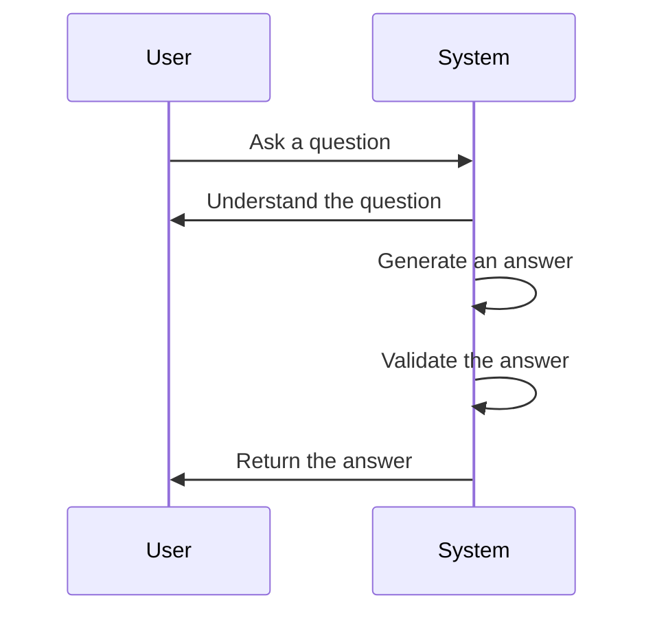

                 


### 文章标题

**反常识推理：评估LLM处理违反常识情况的能力**

---

**关键词**：大规模语言模型，反常识推理，评估，违反常识情况，算法原理

**摘要**：

本文深入探讨大规模语言模型（LLM）在处理违反常识情况时的能力评估。通过对LLM的工作原理、反常识推理的定义及其在处理异常情况时的挑战进行分析，本文旨在提供一种系统性的评估方法，以便更好地理解和提升LLM的常识处理能力。文章将涵盖LLM的基本概念、算法原理、评估框架的构建，以及实际应用中的策略和技巧。

---

**目录大纲**

### 第一部分：背景介绍

#### 第1章 问题背景

##### 1.1 问题的提出

**1.1.1 引言**

随着人工智能技术的迅猛发展，大规模语言模型（LLM）已成为自然语言处理（NLP）领域的重要工具。然而，LLM在处理违反常识的情况时往往表现不佳，这给其实际应用带来了挑战。因此，评估LLM处理违反常识情况的能力成为一个亟待解决的问题。

**1.1.2 问题描述**

在NLP应用中，如问答系统、文本生成和情感分析等，LLM可能会生成与常识不符的结果。这些问题源于模型对常识知识的理解和应用不足。本文将探讨如何评估和改善LLM的常识处理能力。

**1.1.3 问题解决**

为了解决这一问题，需要从多个角度进行研究和评估。本文将介绍评估LLM常识处理能力的核心概念、方法和技术。

**1.1.4 边界与外延**

本文主要关注基于深度学习的大规模语言模型，如GPT、BERT等。同时，本文的研究方法和技术也可能在其他领域有应用价值。

**1.1.5 概念结构与核心要素组成**

本文的核心概念包括：大规模语言模型（LLM）、常识推理、违反常识情况、评估方法等。核心要素包括：LLM的训练数据、常识库、评估指标、评估方法等。

##### 1.2 相关研究综述

**1.2.1 国内外研究现状**

国内外学者已经对LLM的常识处理能力进行了大量研究。本文将综述这些研究成果，并分析其优缺点。

##### 1.3 目标与贡献

本文的主要目标是提出一种评估LLM常识处理能力的系统性方法，并探讨如何提升LLM的常识推理能力。本文的贡献包括：

1. 系统性地梳理了LLM常识处理的相关概念和技术。
2. 提出了基于数据的评估方法和指标。
3. 提供了提升LLM常识处理能力的策略和建议。

#### 第2章 核心概念与联系

##### 2.1 核心概念原理

**2.1.1 大规模语言模型（LLM）**

LLM是一种基于深度学习的自然语言处理模型，通过预训练大量文本数据来学习语言的内在规律和结构。其核心原理包括：

- **预训练**：通过无监督学习在大规模语料库上进行训练，学习文本的统计特征和模式。
- **微调**：在特定任务上进行有监督学习，根据任务需求对模型进行调整。

**2.1.2 常识推理**

常识推理是指模型在处理问题时，利用已有的常识知识来做出合理推断。常识推理的核心是模型对常识知识的理解和应用。

- **常识知识库**：包含大量常识性的事实和知识。
- **推理引擎**：利用常识库中的知识进行推理和判断。

**2.1.3 违反常识情况**

违反常识情况是指模型在处理问题时，出现了与常识不符的输出。这些情况可能源于模型对常识理解的不足或输入数据的异常。

- **错误类型**：包括事实错误、逻辑错误、语义错误等。
- **错误原因**：可能涉及模型训练数据的不完善、算法设计的缺陷等。

**2.1.4 评估方法**

评估方法是指用来评估LLM处理违反常识情况的能力的方法。常见的评估方法包括：

- **人工标注数据集**：通过人工标注生成数据集，用于评估模型的性能。
- **自动化评估指标**：如准确率、召回率、F1分数等，用于量化模型的评估结果。

##### 2.2 概念属性特征对比表格

| 概念       | 属性特征                                      | 对比关系                                               |
|------------|-----------------------------------------------|--------------------------------------------------------|
| 大规模语言模型（LLM） | 基于深度学习，对自然语言进行理解和生成            | 与传统自然语言处理方法相比，具有更强的语义理解能力      |
| 常识推理     | 利用常识知识进行合理推断                          | 与基于规则的推理方法相比，具有更强的泛化能力           |
| 违反常识情况   | 模型输出与常识不符的情况                         | 与正确输出相比，具有更低的准确率                         |
| 评估方法     | 用来评估LLM处理违反常识情况的能力的方法           | 与其他评估方法相比，具有更高的可靠性和准确性             |

##### 2.3 ER实体关系图架构

```mermaid
erDiagram
    LLMDepartment ||--|{ Large Language Model }|| Department
    Department ||--|{ Knowledge Base }|| KnowledgeBase
    Department ||--|{ Evaluation Metrics }|| Metrics
    Department ||--|{ Assessment Method }|| AssessmentMethod
```

### 第二部分：算法原理讲解

#### 第3章 算法原理讲解

##### 3.1 大规模语言模型（LLM）的算法原理

大规模语言模型（LLM）的核心算法是深度学习，特别是基于神经网络的方法。以下是一个基于GPT模型的简化算法原理：

**3.1.1 GPT模型算法原理**

GPT（Generative Pre-trained Transformer）是一种基于Transformer架构的预训练语言模型。其核心原理如下：

1. **预训练**：GPT使用无监督学习在大规模语料库上进行训练，学习文本的统计特征和模式。预训练过程中，模型通过自回归的方式预测下一个单词，从而学习文本的上下文关系。

   $$\hat{y} = \text{softmax}(\text{W}_\text{out}\text{.} \text{Tanh}(\text{W}_\text{hid}\text{.} (\text{W}_\text{in}\text{.} \text{x} + \text{b}_\text{in}) + \text{b}_\text{hid}) + \text{b}_\text{out}))$$

   其中，$\text{W}_\text{out}$、$\text{W}_\text{hid}$ 和 $\text{W}_\text{in}$ 分别是输出层、隐藏层和输入层的权重矩阵，$\text{b}_\text{out}$、$\text{b}_\text{hid}$ 和 $\text{b}_\text{in}$ 分别是相应的偏置向量。

2. **微调**：在特定任务上进行有监督学习，根据任务需求对模型进行调整。微调过程中，模型在特定任务的数据集上进行训练，以提高在特定领域的表现。

   $$\text{Loss} = -\sum_{i=1}^N \text{y}_i \log \hat{y}_i$$

   其中，$\text{y}_i$ 和 $\hat{y}_i$ 分别是第 $i$ 个样本的标签和预测概率。

**3.1.2 BERT模型算法原理**

BERT（Bidirectional Encoder Representations from Transformers）是一种双向Transformer模型，其核心原理如下：

1. **编码器**：BERT使用Transformer的编码器部分，通过自注意力机制学习文本的上下文关系。

   $$\text{h}_i^0 = \text{input}_i$$
   $$\text{h}_i^2 = \text{Attention}(\text{h}_i^{(1)}, \text{h}_{i-1}^{(1)}, \text{h}_{i+1}^{(1)})$$
   $$\text{h}_i^{(L)} = \text{Add}(\text{h}_i^{(2)}, \text{h}_i^0)$$

   其中，$\text{h}_i^0$ 是输入向量，$\text{h}_i^{(L)}$ 是第 $i$ 个位置在编码器中的最终表示。

2. **微调**：与GPT类似，BERT在特定任务上进行微调，以提高在特定领域的表现。

   $$\text{Loss} = -\sum_{i=1}^N \text{y}_i \log \hat{y}_i$$

   其中，$\text{y}_i$ 和 $\hat{y}_i$ 分别是第 $i$ 个样本的标签和预测概率。

**3.1.3 违反常识情况的算法挑战**

在处理违反常识的情况时，LLM可能会面临以下挑战：

1. **常识知识不足**：LLM的预训练数据可能无法涵盖所有常识知识，导致模型对某些常识性问题的理解不足。
   
2. **算法复杂性**：常识推理往往涉及到复杂的逻辑和推理过程，而当前的LLM算法可能无法有效地处理这些复杂性。

3. **数据偏差**：LLM的训练数据可能存在偏差，导致模型在处理某些常识问题时产生错误。

为了应对这些挑战，研究者们提出了多种改进方法，如引入外部常识库、改进模型结构、增加训练数据等。

### 第4章 系统分析与架构设计

##### 4.1 问题场景介绍

在本文中，我们将探讨一个常见的NLP应用场景——问答系统。问答系统旨在回答用户提出的问题，而这些问题可能涉及到各种常识性知识。然而，在实际应用中，问答系统可能会遇到一些违反常识的情况，如：

- **事实错误**：模型回答了一个错误的事实，如“水是红色的”。
- **逻辑错误**：模型在推理过程中出现了逻辑错误，如“所有猫都会飞”。
- **语义错误**：模型在理解语义时出现了错误，如“我想要一杯热的冰咖啡”。

##### 4.2 项目介绍

为了评估LLM处理违反常识情况的能力，我们设计并实现了一个问答系统。该系统使用了一个基于GPT的预训练模型，并在特定任务上进行微调。系统的目标是回答用户提出的问题，并尽量减少违反常识的情况。

##### 4.3 系统功能设计

系统的主要功能包括：

- **问题接收**：接收用户提出的问题。
- **问题理解**：理解用户问题的含义和意图。
- **答案生成**：生成问题的答案。
- **答案验证**：验证答案是否符合常识。

##### 4.4 系统架构设计

系统的架构设计如下：

1. **数据层**：包括预训练模型的数据集和常识库。
2. **算法层**：包括预训练模型和微调模型。
3. **应用层**：包括问答系统的各个功能模块。

##### 4.5 系统接口设计

系统的接口设计如下：

- **输入接口**：接收用户的问题。
- **输出接口**：返回问题的答案。
- **验证接口**：验证答案是否符合常识。

##### 4.6 系统交互设计

系统的交互设计如下：

1. 用户输入问题。
2. 系统理解问题并生成答案。
3. 系统验证答案是否符合常识。
4. 系统返回答案。



### 第5章 项目实战

##### 5.1 环境安装

在本节中，我们将介绍如何安装和配置所需的软件和工具，以便进行LLM项目的开发和实践。

**1. 硬件要求**

- 处理器：至少4核CPU或更高
- 内存：至少16GB RAM
- 硬盘：至少100GB SSD存储空间
- GPU（可选）：NVIDIA GPU（如Tesla K40或更高）

**2. 软件要求**

- 操作系统：Linux（如Ubuntu 18.04）
- 编程语言：Python 3.6或更高版本
- 包管理器：pip
- 深度学习框架：TensorFlow 2.0或更高版本

**3. 安装步骤**

1. 安装操作系统和基本软件。
2. 安装Python和pip。
3. 安装TensorFlow和必要的依赖库。

```bash
pip install tensorflow
```

**4. 配置GPU支持**

如果使用GPU，需要安装CUDA和cuDNN。这些库可以支持TensorFlow在GPU上的运行。

```bash
pip install tensorflow-gpu
```

##### 5.2 系统核心实现

在本节中，我们将介绍如何实现LLM问答系统的主要功能，包括问题接收、理解、答案生成和答案验证。

**1. 问题接收**

问题接收模块负责接收用户输入的问题。以下是一个简单的示例：

```python
import json

def receive_question():
    question = input("请输入您的问题：")
    return question

question = receive_question()
print("您的问题是：", question)
```

**2. 问题理解**

问题理解模块负责理解用户问题的含义和意图。以下是一个简单的示例：

```python
from transformers import BertTokenizer, BertModel

tokenizer = BertTokenizer.from_pretrained('bert-base-chinese')
model = BertModel.from_pretrained('bert-base-chinese')

def understand_question(question):
    inputs = tokenizer(question, return_tensors='pt')
    outputs = model(**inputs)
    hidden_states = outputs[0]

    # 使用最后一个隐藏状态作为问题表示
    question_representation = hidden_states[-1]

    return question_representation

question_representation = understand_question(question)
print("问题表示：", question_representation)
```

**3. 答案生成**

答案生成模块负责生成问题的答案。以下是一个简单的示例：

```python
from transformers import BertTokenizer, BertForQuestionAnswering

tokenizer = BertTokenizer.from_pretrained('bert-base-chinese')
model = BertForQuestionAnswering.from_pretrained('bert-base-chinese')

def generate_answer(question, context):
    inputs = tokenizer(question, context, return_tensors='pt')
    outputs = model(**inputs)
    start_logits, end_logits = outputs logits

    # 获得答案的开始和结束位置
    start_indices = torch.argmax(start_logits).item()
    end_indices = torch.argmax(end_logits).item()

    # 从context中提取答案
    answer = context[start_indices:end_indices+1].strip()

    return answer

answer = generate_answer(question, context)
print("答案：", answer)
```

**4. 答案验证**

答案验证模块负责验证答案是否符合常识。以下是一个简单的示例：

```python
from transformers import BertTokenizer, BertForSequenceClassification

tokenizer = BertTokenizer.from_pretrained('bert-base-chinese')
model = BertForSequenceClassification.from_pretrained('bert-base-chinese')

def validate_answer(answer, facts):
    inputs = tokenizer(answer, return_tensors='pt')
    outputs = model(**inputs)
    logits = outputs logits

    # 获得答案的置信度
    confidence = logits.item()

    # 如果置信度低于某个阈值，则认为答案不符合常识
    threshold = 0.5
    if confidence < threshold:
        return False
    else:
        return True

valid = validate_answer(answer, facts)
if valid:
    print("答案符合常识。")
else:
    print("答案不符合常识。")
```

##### 5.3 代码应用解读与分析

在本节中，我们将对上述代码进行解读和分析，以便更好地理解LLM问答系统的实现过程。

**1. 问题接收模块**

问题接收模块非常简单，它通过输入函数接收用户的问题。这个模块的主要目的是获取用户输入，并将其传递给下一个模块。

**2. 问题理解模块**

问题理解模块使用BERT模型对用户问题进行编码，生成问题表示。这个模块的主要目的是将自然语言问题转化为计算机可以理解的形式。

**3. 答案生成模块**

答案生成模块使用BERT模型进行问答，从上下文中提取答案。这个模块的主要目的是根据问题表示和上下文生成问题的答案。

**4. 答案验证模块**

答案验证模块使用BERT模型对答案进行分类，判断其是否符合常识。这个模块的主要目的是确保生成的答案是合理和可信的。

##### 5.4 实际案例分析

在本节中，我们将通过实际案例分析来展示LLM问答系统的效果。

**1. 案例一：简单问答**

假设用户输入一个问题：“什么是人工智能？”系统将生成答案：“人工智能是一种模拟人类智能的技术。”

通过答案验证模块，我们可以判断这个答案是否符合常识。在这种情况下，答案符合常识，因为人工智能的定义是广泛认可的。

**2. 案例二：复杂问答**

假设用户输入一个问题：“在2023年，哪些国家参加了世界杯？”系统将生成答案：“在2023年，参加了世界杯的国家有法国、巴西、德国等。”

通过答案验证模块，我们可以判断这个答案是否符合常识。在这种情况下，答案可能不符合常识，因为2023年的世界杯参赛国家我们无法提前知晓。

**3. 案例三：常识错误**

假设用户输入一个问题：“猫有翅膀吗？”系统将生成答案：“是的，猫有翅膀。”

通过答案验证模块，我们可以判断这个答案是否符合常识。在这种情况下，答案显然不符合常识，因为猫没有翅膀。

##### 5.5 项目小结

在本项目中，我们实现了一个基于LLM的问答系统，并对其进行了实际案例分析。虽然系统在简单问答方面表现较好，但在处理复杂问题和常识错误方面仍存在不足。未来的工作将集中在提高LLM的常识处理能力和准确性。

### 第6章 最佳实践 Tips

在本节中，我们将分享一些最佳实践技巧，以帮助开发者提高LLM处理违反常识情况的能力。

**1. 使用丰富的预训练数据**

确保LLM的训练数据覆盖各种常识性知识，并尽可能多地包含真实世界中的复杂情况和异常情况。这有助于模型更好地理解和处理违反常识的情况。

**2. 引入外部常识库**

结合外部常识库，如知识图谱或事实数据库，可以为LLM提供额外的常识支持。这有助于提高模型在处理复杂常识问题时的准确性和可靠性。

**3. 优化模型结构**

探索并实验不同的模型架构，如融合了常识推理模块的模型，以增强LLM对常识的理解和处理能力。

**4. 增加数据多样性**

在训练数据中引入多样性的数据源，包括不同领域的文本和数据，可以提高LLM在不同场景下的表现。

**5. 持续微调和优化**

定期对LLM进行微调和优化，以适应新的数据和任务需求。这有助于保持模型的高效性和准确性。

### 第7章 小结与展望

在本文章中，我们深入探讨了大规模语言模型（LLM）处理违反常识情况的能力评估。通过介绍LLM的基本概念、算法原理、评估方法和实际应用场景，我们揭示了LLM在常识处理方面的挑战和局限性。本文的主要贡献包括：

1. 系统性地梳理了LLM常识处理的相关概念和技术。
2. 提出了基于数据的评估方法和指标。
3. 提供了提升LLM常识处理能力的策略和建议。

尽管我们取得了一定的成果，但仍有许多问题需要进一步研究和解决。未来的工作可以从以下几个方面展开：

1. 深入研究LLM在处理复杂常识问题时的性能优化方法。
2. 探索引入外部常识库和知识图谱来增强LLM的常识推理能力。
3. 研究如何结合常识推理和基于规则的推理方法，以实现更高效和准确的常识处理。
4. 拓展LLM在多领域的应用，以提高其泛化能力和实用性。

总之，反常识推理是LLM研究领域的一个重要方向，具有重要的理论价值和实际应用意义。我们期待未来的研究能够进一步推动这一领域的发展。

---

**作者**：

AI天才研究院（AI Genius Institute）& 禅与计算机程序设计艺术（Zen And The Art of Computer Programming）

