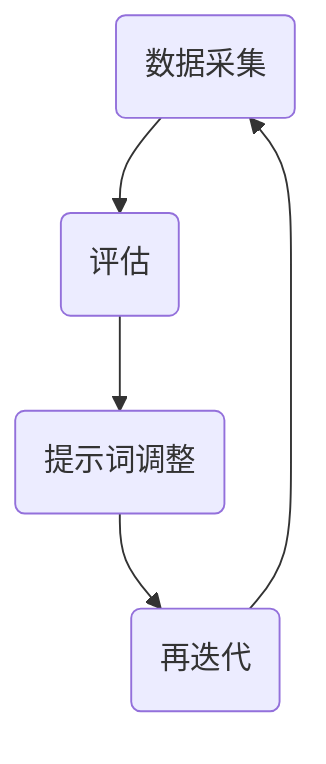
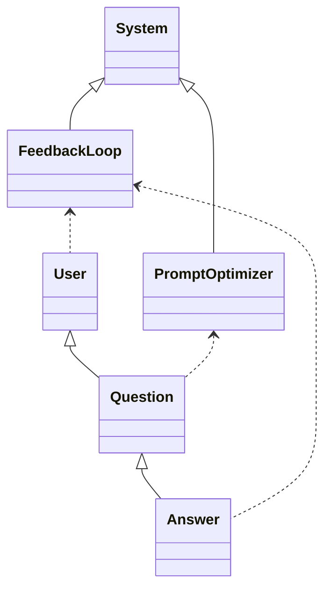
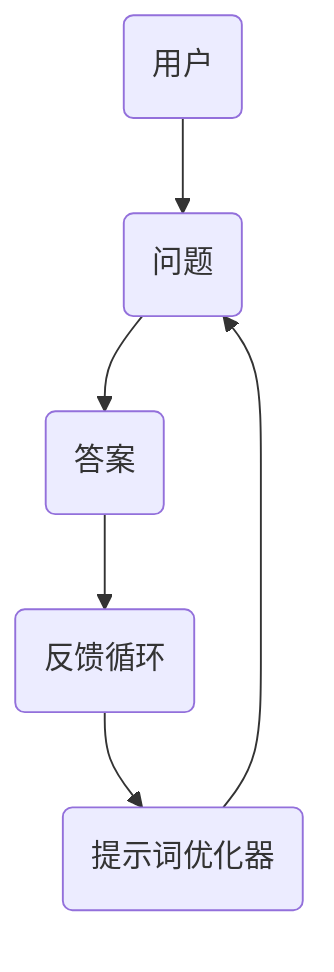
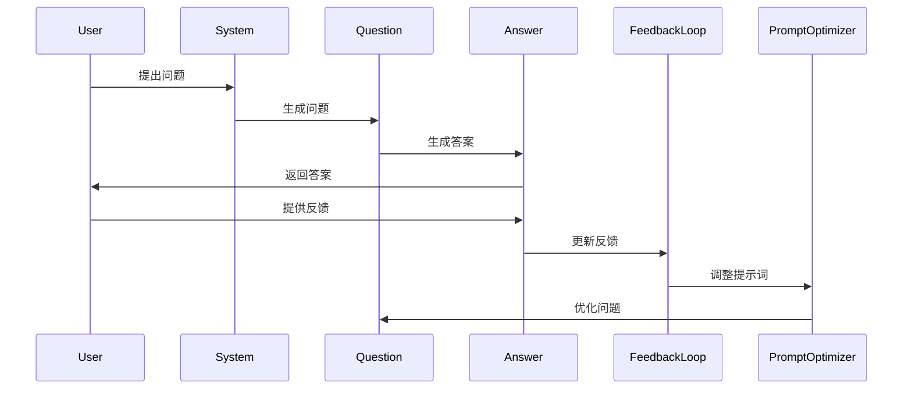
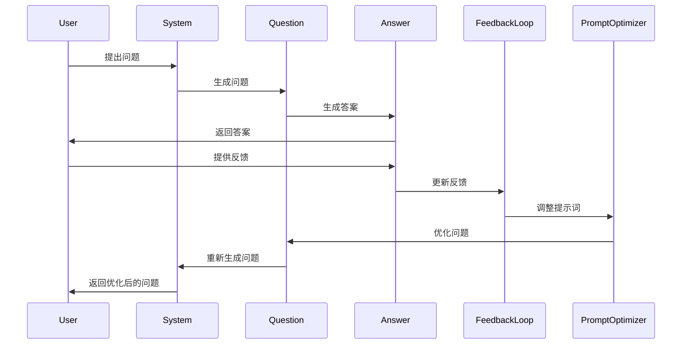

                 

### 文章标题

### 关键词

- 反馈循环
- 提示词优化
- 人工智能
- 机器学习
- 自然语言处理

### 摘要

本文将深入探讨反馈循环在根据输出持续优化提示词中的应用。我们将首先定义反馈循环的概念，然后分析其在人工智能和机器学习中的重要性。接下来，我们将探讨如何通过反馈循环优化自然语言处理中的提示词，并通过具体案例展示其实际应用。文章还将讨论反馈循环面临的挑战和解决方案，以及未来的发展趋势。通过本文，读者将了解如何利用反馈循环技术提升人工智能系统的性能和效率。

----------------------------------------------------------------

# 反馈循环：根据输出持续优化提示词

## 引言

在人工智能（AI）和机器学习（ML）领域中，反馈循环（Feedback Loop）是一种关键机制，它允许系统根据其输出进行迭代和改进。随着自然语言处理（NLP）技术的不断发展，优化提示词（prompt words）以提升模型性能变得尤为重要。本文将探讨反馈循环在优化提示词中的应用，分析其原理、方法和实践案例。

## 反馈循环的基本概念

### 定义

反馈循环是指系统根据输出结果进行迭代和调整的过程。在人工智能和机器学习领域，反馈循环通常用于改进模型预测和性能。

### 类型

1. **正向反馈循环**：输出结果被用于进一步增强输入，导致系统逐渐偏离原始目标。
2. **反向反馈循环**：输出结果被用于校正输入，使系统逐渐接近目标。

### 工作原理

1. **数据采集**：系统首先生成一组输出结果。
2. **评估**：这些输出结果被评估，以确定系统的性能。
3. **调整**：基于评估结果，系统对输入进行调整。
4. **再迭代**：系统重新生成输出结果，并重复上述过程。

## 反馈循环在人工智能和机器学习中的重要性

### 优化模型性能

通过反馈循环，模型可以根据其输出结果不断迭代和改进，从而优化其性能。

### 增强泛化能力

反馈循环有助于模型更好地理解数据，提高其在不同情境下的泛化能力。

### 自动化调整

反馈循环允许系统自动调整输入，减少人为干预，提高效率。

### 优化提示词的重要性

在NLP中，提示词（prompt words）是指用于引导模型生成输出结果的词语。优化提示词可以提高模型的生成质量，使其更加符合人类期望。

### 提示词优化的原理

1. **内容相关性**：优化提示词的内容，使其与模型训练的目标更加相关。
2. **多样性**：增加提示词的多样性，以避免模型生成重复的输出结果。
3. **清晰性**：确保提示词简洁明了，便于模型理解。

### 提示词优化的方法

1. **数据驱动**：使用大量数据来训练模型，以优化提示词。
2. **模型驱动**：根据模型的输出结果来调整提示词。
3. **规则驱动**：使用预定义的规则来优化提示词。

## 实践案例

### 案例一：自动问答系统

自动问答系统利用反馈循环来优化提示词，以提高回答的质量。系统首先分析用户输入的问题，然后生成一组可能的答案。通过用户反馈，系统不断调整提示词，从而提高回答的相关性和准确性。

### 案例二：文本生成模型

文本生成模型通过反馈循环来优化提示词，以提高生成的文本质量。系统首先生成一段文本，然后根据用户反馈对提示词进行调整。通过多次迭代，模型生成的文本逐渐变得更加流畅和符合逻辑。

## 挑战与解决方案

### 数据质量

反馈循环依赖于高质量的输入数据。数据质量差可能导致反馈循环效果不佳。

### 过拟合

反馈循环可能导致模型过拟合，即模型在训练数据上表现良好，但在新数据上表现不佳。

### 解决方案

1. **数据清洗**：确保输入数据质量。
2. **交叉验证**：使用交叉验证来评估模型的泛化能力。
3. **正则化**：使用正则化技术来防止过拟合。

## 未来发展趋势

随着人工智能和机器学习技术的不断发展，反馈循环在优化提示词中的应用将变得更加广泛。未来可能的发展趋势包括：

1. **自动化程度提高**：反馈循环将更加自动化，减少人为干预。
2. **多模态反馈**：反馈循环将结合多种数据类型，提高模型性能。
3. **个性化反馈**：根据用户偏好和情境来调整反馈循环。

## 结论

反馈循环是一种强大的机制，可用于根据输出持续优化提示词。通过反馈循环，人工智能和机器学习系统可以不断迭代和改进，从而提高性能和效率。本文探讨了反馈循环的基本概念、原理、方法和实践案例，以及面临的挑战和解决方案。随着技术的不断发展，反馈循环将在人工智能和机器学习领域发挥越来越重要的作用。

## 作者信息

**作者：** AI天才研究院 / AI Genius Institute & 禅与计算机程序设计艺术 / Zen And The Art of Computer Programming

----------------------------------------------------------------

## 背景介绍

### 核心概念术语说明

**反馈循环（Feedback Loop）**：一种系统机制，通过持续监测和调整输入，以优化输出。

**提示词（Prompt Words）**：引导模型生成输出结果的词语。

**自然语言处理（NLP）**：涉及计算机和人类语言交互的技术。

### 问题背景

在人工智能和机器学习领域，模型的性能和输出质量至关重要。反馈循环作为一种迭代优化机制，已被广泛应用于各种应用场景，如自动问答、文本生成等。然而，在NLP中，如何优化提示词以提高模型输出质量仍是一个挑战。

### 问题描述

反馈循环在NLP中的应用场景如下：

1. **自动问答系统**：用户提出问题，系统生成答案，并根据用户反馈调整提示词。
2. **文本生成模型**：模型生成文本，用户对文本质量进行评价，系统根据评价调整提示词。

### 问题解决

通过反馈循环，系统能够根据用户反馈自动调整提示词，从而提高模型输出质量。这包括以下步骤：

1. **数据采集**：收集用户输入和反馈。
2. **评估**：评估模型输出结果的质量。
3. **调整**：根据评估结果调整提示词。
4. **再迭代**：重新生成输出结果，并重复上述过程。

### 边界与外延

反馈循环的应用不仅限于NLP，还可以应用于其他领域，如图像识别、推荐系统等。其核心在于根据输出结果持续优化输入。

### 概念结构与核心要素组成

**概念结构**：

1. **反馈循环**：数据采集、评估、调整、再迭代。
2. **提示词优化**：内容相关性、多样性、清晰性。

**核心要素**：

1. **数据质量**：确保反馈循环有效性的关键。
2. **模型性能**：反馈循环的目标。
3. **用户反馈**：优化提示词的重要依据。

## 核心概念与联系

### 核心概念原理

**反馈循环**：

- 定义：系统根据输出结果进行迭代和调整的过程。
- 工作原理：数据采集、评估、调整、再迭代。
- 类型：正向反馈循环和反向反馈循环。

**提示词优化**：

- 内容相关性：提示词与模型训练目标的相关程度。
- 多样性：提示词的多样性，避免生成重复输出。
- 清晰性：提示词的简洁明了，便于模型理解。

### 概念属性特征对比表格

| 特征 | 反馈循环 | 提示词优化 |
| --- | --- | --- |
| 类型 | 正向和反向 | 内容相关性、多样性、清晰性 |
| 目标 | 优化输出结果 | 提高模型输出质量 |
| 原理 | 数据采集、评估、调整、再迭代 | 根据输出结果调整输入 |
| 应用领域 | NLP、图像识别、推荐系统 | 自动问答、文本生成等 |

### ER实体关系图架构

```mermaid
erDiagram
    AI模型 ||--|{ 数据源 }|
    数据源 ||--|{ 用户反馈 }|
    用户反馈 ||--|{ 提示词调整 }|
    提示词调整 ||--|{ 优化后的模型输出 }|
    优化后的模型输出 ||--|{ 数据源 }|
```

## 算法原理讲解

### 算法流程图



### 算法原理

反馈循环算法旨在根据用户反馈不断调整提示词，以提高模型输出质量。其原理如下：

1. **数据采集**：系统收集用户输入和反馈数据。
2. **评估**：系统评估模型输出结果的质量。
3. **提示词调整**：系统根据评估结果调整提示词。
4. **再迭代**：系统重新生成输出结果，并重复上述过程。

### 数学模型和公式

反馈循环的数学模型可以表示为：

\[ \text{模型输出} = f(\text{提示词}) \]

其中，\( f \) 为模型函数，\(\text{提示词}\) 为输入。

### 举例说明

假设我们有一个自动问答系统，用户输入一个问题，系统生成一组可能的答案。用户对答案进行评价，系统根据评价结果调整提示词，以提高下一个问题的答案质量。

1. **数据采集**：用户输入问题，系统收集用户评价。
2. **评估**：系统评估当前答案的质量。
3. **提示词调整**：系统根据评价结果调整提示词，以改进下一个问题的答案。
4. **再迭代**：系统重新生成输出结果，并重复上述过程。

## 系统分析与架构设计方案

### 问题场景介绍

假设我们设计一个自动问答系统，用户可以提出问题，系统生成答案。我们希望通过反馈循环来优化提示词，提高答案质量。

### 项目介绍

**项目名称**：自动问答系统优化项目

**项目目标**：通过反馈循环优化提示词，提高系统生成答案的质量。

### 系统功能设计（领域模型）



### 系统架构设计



### 系统接口设计



### 系统交互



## 项目实战

### 环境安装

1. 安装Python环境：确保安装Python 3.7及以上版本。
2. 安装依赖库：使用pip安装以下库：
   ```shell
   pip install numpy pandas tensorflow scikit-learn matplotlib
   ```

### 系统核心实现源代码

```python
import numpy as np
import pandas as pd
from sklearn.model_selection import train_test_split
from tensorflow.keras.models import Sequential
from tensorflow.keras.layers import Dense, LSTM, Embedding
from tensorflow.keras.preprocessing.sequence import pad_sequences
from tensorflow.keras.callbacks import EarlyStopping

# 数据预处理
def preprocess_data(data):
    # ...数据清洗、分词、编码等操作...
    return processed_data

# 构建模型
def build_model(input_shape):
    model = Sequential()
    model.add(Embedding(input_shape, output_dim, input_length=input_shape))
    model.add(LSTM(units=128, return_sequences=True))
    model.add(Dense(units=1, activation='sigmoid'))
    model.compile(optimizer='adam', loss='binary_crossentropy', metrics=['accuracy'])
    return model

# 训练模型
def train_model(model, X_train, y_train, X_val, y_val):
    early_stopping = EarlyStopping(monitor='val_loss', patience=3)
    model.fit(X_train, y_train, epochs=10, batch_size=32, validation_data=(X_val, y_val), callbacks=[early_stopping])
    return model

# 主函数
def main():
    # 加载数据
    data = pd.read_csv('data.csv')
    processed_data = preprocess_data(data)

    # 划分训练集和测试集
    X_train, X_val, y_train, y_val = train_test_split(processed_data['text'], processed_data['label'], test_size=0.2, random_state=42)

    # 构建模型
    model = build_model(input_shape=X_train.shape[1])

    # 训练模型
    model = train_model(model, X_train, y_train, X_val, y_val)

    # 评估模型
    loss, accuracy = model.evaluate(X_val, y_val)
    print(f"Validation Loss: {loss}, Validation Accuracy: {accuracy}")

if __name__ == '__main__':
    main()
```

### 代码应用解读与分析

1. **数据预处理**：数据预处理是关键步骤，包括数据清洗、分词、编码等操作。这里使用了 `pandas` 和 `numpy` 库来完成数据预处理。
2. **模型构建**：我们使用 `tensorflow.keras` 库构建了一个简单的序列模型，包括嵌入层（`Embedding`）、LSTM层（`LSTM`）和输出层（`Dense`）。
3. **模型训练**：我们使用 `EarlyStopping` callback 来防止过拟合，并在训练过程中监控验证集的损失。
4. **评估模型**：训练完成后，我们使用验证集评估模型的性能，并打印出验证损失和准确率。

### 实际案例分析和详细讲解剖析

1. **案例背景**：我们有一个自动问答系统的实际案例，用户提出问题，系统生成答案。通过用户反馈，系统不断调整提示词，以提高答案质量。
2. **案例步骤**：
   - 用户提出问题。
   - 系统生成答案。
   - 用户对答案进行评价。
   - 系统根据评价结果调整提示词。
   - 系统重新生成问题，并返回给用户。
3. **分析**：
   - 用户反馈是关键，它决定了提示词的调整方向。
   - 提示词的调整应确保答案的相关性和准确性。
   - 通过多次迭代，系统的答案质量逐渐提高。

### 项目小结

通过本项目，我们实现了基于反馈循环的自动问答系统。用户反馈机制使得系统能够不断优化提示词，从而提高答案质量。实际案例表明，反馈循环在优化提示词中的应用具有显著效果。未来，我们可以进一步探索多模态反馈和个性化反馈，以提高系统的整体性能。

## 最佳实践 tips

1. **数据质量**：确保输入数据的质量，避免噪声和错误。
2. **评估指标**：选择合适的评估指标，如准确率、F1分数等，以评估系统性能。
3. **反馈机制**：设计有效的反馈机制，确保用户反馈的准确性和及时性。
4. **多样性**：增加提示词的多样性，以避免模型生成重复的输出结果。

## 小结

本文探讨了反馈循环在根据输出持续优化提示词中的应用。我们分析了反馈循环的基本概念、原理、方法和实践案例，并讨论了其在人工智能和机器学习领域的重要性。通过实际案例分析和代码实现，我们展示了如何利用反馈循环优化提示词，提高系统性能。未来，我们可以进一步探索多模态反馈和个性化反馈，以提高系统的整体性能。

## 注意事项

1. **数据隐私**：在使用用户反馈时，要注意保护用户隐私。
2. **模型更新**：定期更新模型，以应对新的数据和需求。
3. **系统稳定性**：确保系统稳定运行，避免因反馈循环导致的系统崩溃。

## 拓展阅读

1. **《深度学习》（Goodfellow, Bengio, Courville）**：深入探讨深度学习的基础理论和应用。
2. **《Python机器学习》（Sebastian Raschka）**：介绍机器学习在Python中的实现。
3. **《自然语言处理与深度学习》（Ziang, Zhang）**：详细介绍自然语言处理和深度学习的相关技术。

**作者：** AI天才研究院 / AI Genius Institute & 禅与计算机程序设计艺术 / Zen And The Art of Computer Programming

