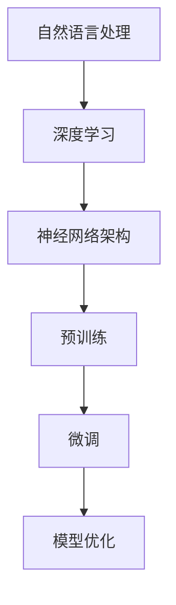
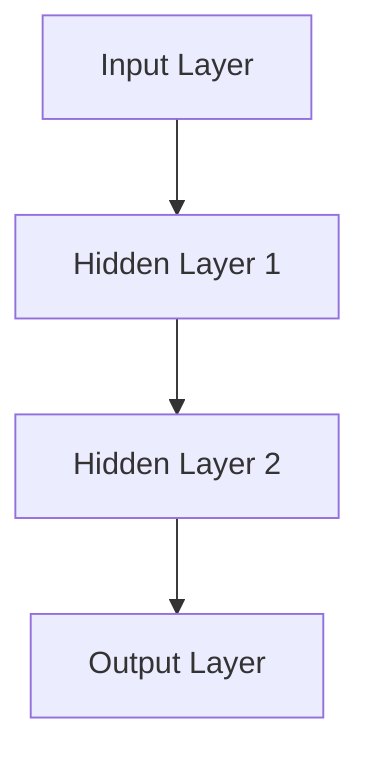
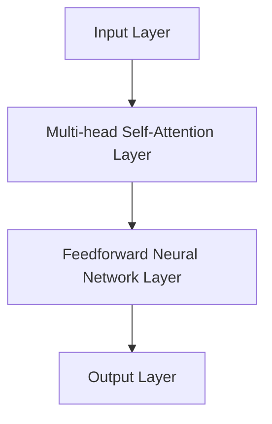
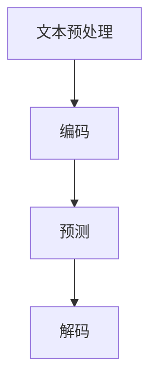
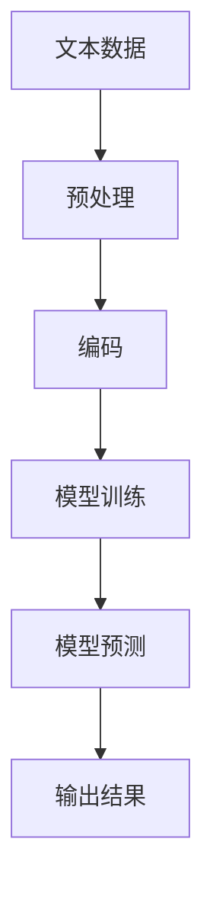
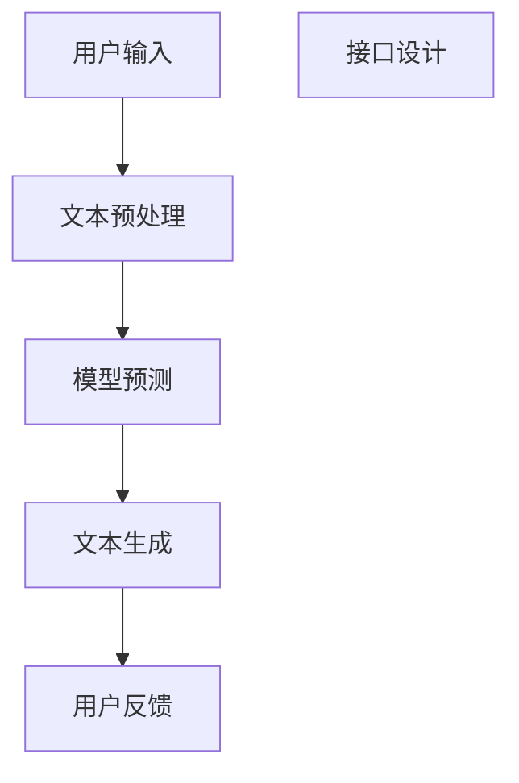
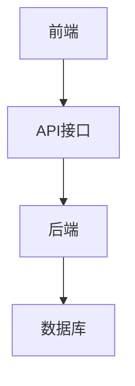
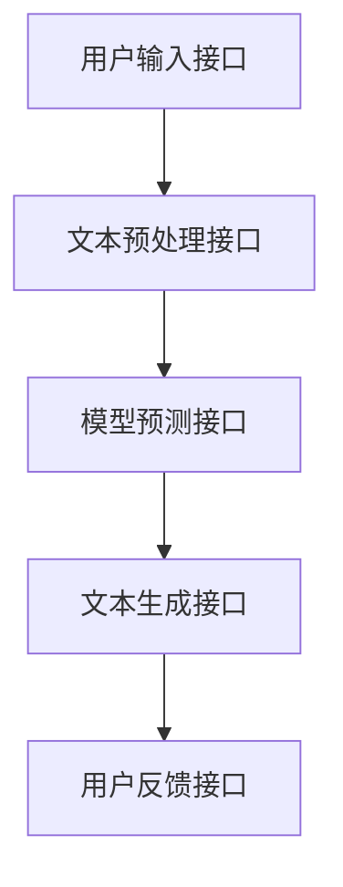
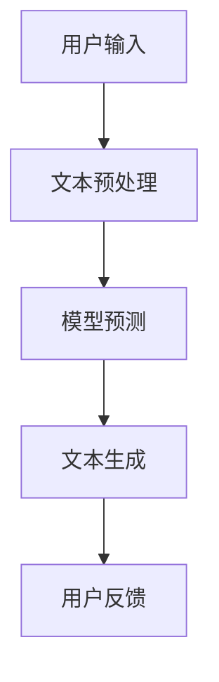

                 


### **# 第一部分：背景与概念**

#### **1.1 问题背景与解决思路**

在当今的科技领域，人工智能（AI）无疑是一个热门话题。尤其是大型语言模型（Large Language Model，LLM），如GPT-3，Bert等，它们在自然语言处理（NLP）领域表现出了令人瞩目的能力。然而，随着这些模型越来越复杂和强大，如何在实际应用中高效地承接这些变革性需求成为一个亟待解决的问题。

传统的需求承接方法通常依赖于固定的流程和模板，这种方法在模型较为简单时效果尚可，但在面对复杂的LLM应用时，往往显得力不从心。例如，传统的需求分析可能无法充分理解LLM的复杂性和应用范围，导致后续的开发和部署过程中出现偏差。

为了解决这一难题，我们需要一种新的范式来适应LLM应用的开发。这种范式不仅要能理解LLM的核心原理，还要能灵活地适应各种应用场景，从而实现高效的需求承接。具体来说，这种新范式需要具备以下几个特点：

1. **高度抽象**：能够从复杂的LLM模型中抽象出核心概念和关键特征，从而简化需求分析的过程。
2. **灵活性**：能够根据不同的应用场景，灵活调整需求承接的方法和策略。
3. **可扩展性**：能够随着LLM技术的不断发展，不断扩展和更新需求承接的能力。

接下来，我们将进一步探讨LLM的概念和特性，以及这种新范式在应用开发中的具体实现。

#### **1.2 LLM的概念与特性**

LLM，即大型语言模型，是一种通过深度学习技术训练出来的模型，它能够对自然语言进行理解和生成。相比于传统的语言模型，LLM具有以下几个显著特性：

1. **大规模**：LLM的训练数据量通常非常庞大，可以达到数十亿级别的参数量。这使得LLM能够更好地捕捉语言中的复杂模式和规律。
2. **深度学习**：LLM通常采用深度神经网络（DNN）的结构，能够处理复杂的非线性关系。这使得LLM在处理自然语言任务时具有很高的准确性和效率。
3. **自适应**：LLM能够根据不同的输入进行自适应调整，从而生成更加符合预期的输出。这使得LLM在不同应用场景中都能表现出色。

这些特性使得LLM在自然语言处理领域具有巨大的潜力。然而，也正是因为这些特性，LLM的应用开发变得更加复杂。如何有效地利用LLM的潜力，同时避免其潜在的局限性，是LLM应用开发中需要重点解决的问题。

接下来，我们将进一步探讨LLM在应用开发中的新范式，以及这种范式如何帮助我们更好地承接变革性需求。

#### **1.3 LLM在应用开发中的新范式**

随着LLM技术的不断发展，传统的需求承接方法已经难以满足其复杂性和灵活性的需求。因此，我们需要一种新的范式来适应LLM应用的开发。这种新范式可以从以下几个方面来构建：

1. **需求分析**：在需求分析阶段，我们需要采用更加抽象和灵活的方法来理解LLM的核心原理和特性。这包括对LLM的结构、算法和数据处理流程的深入分析，从而形成一个清晰的理解框架。

2. **架构设计**：在架构设计阶段，我们需要根据需求分析的结果，设计一个能够灵活适应LLM特性的系统架构。这包括对系统功能、模块划分、接口设计和数据流程的设计。

3. **开发与实现**：在开发与实现阶段，我们需要采用一种能够高效利用LLM特性的开发方法。这包括对LLM的训练、优化和应用的具体实现，以及与现有系统的集成和优化。

4. **测试与优化**：在测试与优化阶段，我们需要对系统进行全面的测试和优化，确保其能够稳定、高效地运行。这包括对系统性能、功能完整性和用户体验的测试，以及对LLM模型进行进一步的优化和调整。

5. **部署与维护**：在部署与维护阶段，我们需要将系统部署到实际环境中，并进行长期的维护和优化。这包括对系统运行状态的监控、故障处理和功能更新。

这种新范式不仅能够更好地承接LLM应用的开发需求，还能够提高系统的整体性能和用户体验。通过这种新范式，我们可以更好地理解LLM的核心原理和应用方法，从而实现更加高效和灵活的需求承接。

接下来，我们将进一步探讨LLM的关键概念和联系，以及如何将这些概念应用于实际开发中。

#### **1.4 关键概念与联系**

在LLM应用开发中，理解以下几个关键概念是非常重要的：

1. **自然语言处理（NLP）**：NLP是使计算机能够理解和处理人类语言的技术。它是LLM应用开发的基础。

2. **深度学习**：深度学习是一种通过多层神经网络对数据进行学习的算法。它是LLM的核心技术。

3. **神经网络架构**：神经网络架构决定了LLM的计算能力和性能。常见的架构有Transformer、BERT等。

4. **预训练和微调**：预训练是指在大量数据上训练LLM模型，使其具有通用语言处理能力。微调则是在特定任务上对模型进行进一步训练，以适应具体应用场景。

5. **模型优化**：模型优化是提高LLM性能的关键。这包括调整模型参数、优化计算效率和改进模型结构。

这些关键概念相互关联，共同构成了LLM应用开发的核心。下面是一个ER实体关系图，展示了这些概念之间的关系：



- **自然语言处理**是整个架构的起点，它为后续的深度学习和神经网络架构提供了数据基础。
- **深度学习**是实现NLP的关键技术，它通过多层神经网络对数据进行处理。
- **神经网络架构**决定了深度学习的计算能力和性能，它是实现LLM的核心。
- **预训练**和**微调**是LLM模型的训练阶段，预训练使模型具有通用语言处理能力，微调则使模型适应特定应用场景。
- **模型优化**是提高LLM性能的关键步骤，它通过调整模型参数和结构来优化模型性能。

理解这些关键概念和它们之间的联系，对于LLM应用开发至关重要。通过这种结构化的方法，我们可以更好地理解LLM的原理和应用，从而实现高效的需求承接。

#### **1.5 本章小结**

在本章中，我们探讨了变革需求承接在LLM应用开发中的重要性。首先，我们分析了问题背景和解决思路，指出了传统需求承接方法在处理复杂LLM应用时的局限性。接着，我们介绍了LLM的概念和特性，包括其大规模、深度学习和自适应等特性。随后，我们提出了LLM在应用开发中的新范式，包括需求分析、架构设计、开发与实现、测试与优化以及部署与维护等步骤。最后，我们通过ER实体关系图展示了LLM关键概念之间的联系。

理解这些概念和范式对于适应LLM应用开发至关重要。它不仅能够帮助我们更好地理解LLM的核心原理和应用方法，还能提高系统的整体性能和用户体验。在下一章中，我们将深入探讨LLM的核心技术原理，进一步揭示其背后的数学模型和算法。

### **# 第二部分：LLM核心技术原理**

#### **2.1 LLM的基本原理**

大型语言模型（LLM）的基本原理是基于深度学习和自然语言处理（NLP）技术。具体来说，LLM通过在大量文本数据上进行预训练，学习到语言的模式和规律，从而实现理解和生成自然语言。

首先，我们需要理解什么是深度学习。深度学习是一种通过多层神经网络进行数据学习的算法。它通过逐层提取特征，从原始数据中学习到更加抽象和复杂的模式。在LLM中，深度学习被用来处理自然语言数据，从而实现对文本的理解和生成。

自然语言处理是使计算机能够理解和处理人类语言的技术。它包括文本预处理、词向量表示、语法分析、语义理解等多个方面。LLM通过NLP技术，将自然语言文本转换为计算机可以处理的格式，然后通过深度学习模型对其进行处理。

接下来，我们来看LLM的训练过程。LLM的训练通常包括两个阶段：预训练和微调。

预训练是指在大量文本数据上训练LLM模型，使其学习到语言的模式和规律。这一阶段的目标是使模型具有通用语言处理能力，即能够处理各种不同的语言任务。预训练过程中，LLM模型会接收输入文本，并通过多层神经网络对其进行处理，从而生成输出文本。这一过程不断重复，使得模型逐渐学会从文本中提取有用的信息。

微调则是在特定任务上对LLM模型进行进一步训练，以适应具体应用场景。微调的目标是使模型在特定任务上表现出色。微调过程中，LLM模型会接收带有标签的数据，通过对这些数据进行训练，模型会逐渐学会在特定任务上进行预测。

#### **2.2 LLM的模型架构**

LLM的模型架构通常采用深度神经网络（DNN）或Transformer架构。这些架构在处理自然语言任务时具有很高的性能。

**深度神经网络（DNN）**是一种多层前馈神经网络，它通过逐层提取特征，实现对输入数据的处理。在DNN中，每个神经元都与前一层的所有神经元相连接，并采用激活函数（如ReLU、Sigmoid、Tanh等）来引入非线性。

**Transformer架构**是一种基于自注意力机制的模型，它通过计算输入序列中每个元素之间的注意力权重，实现对输入数据的处理。Transformer架构的主要优势是能够在处理长序列时保持较高的性能。

下面是一个简单的DNN架构示例：



在这个示例中，输入层（A）接收输入文本，隐藏层（B和C）逐层提取特征，输出层（D）生成输出文本。

下面是一个简单的Transformer架构示例：



在这个示例中，输入层（A）接收输入文本，通过多头自注意力层（B）计算注意力权重，然后通过前馈神经网络层（C）处理文本，最终输出层（D）生成输出文本。

#### **2.3 LLM的工作流程**

LLM的工作流程通常包括以下几个步骤：

1. **文本预处理**：首先，对输入文本进行预处理，包括分词、去除停用词、词性标注等。这一步骤的目的是将文本转换为计算机可以处理的格式。

2. **编码**：然后，将预处理后的文本编码为数字形式。这通常采用词向量表示方法，如Word2Vec、GloVe等。编码后的文本可以被输入到LLM模型中。

3. **预测**：LLM模型根据编码后的文本，通过多层神经网络或Transformer架构进行处理，生成输出文本。这一过程通常采用逐层递归的方式。

4. **解码**：最后，将生成的输出文本解码为自然语言。这一步骤通常采用逆词向量表示方法。

下面是一个简单的LLM工作流程示例：



在这个示例中，输入文本经过预处理后，被编码为数字形式，然后通过LLM模型进行处理，最后解码为自然语言输出。

#### **2.4 关键算法与优化方法**

在LLM的开发过程中，关键算法和优化方法对于提高模型性能和效率至关重要。以下是几个常用的算法和优化方法：

1. **优化算法**：优化算法用于调整模型参数，以最小化损失函数。常用的优化算法包括随机梯度下降（SGD）、Adam等。其中，Adam算法结合了SGD和动量方法，在训练过程中能够自适应调整学习率，通常效果较好。

2. **dropout**：dropout是一种正则化方法，用于防止模型过拟合。具体来说，在训练过程中，随机丢弃一部分神经元，从而降低模型的复杂度。dropout通常设置一个丢弃概率，如0.5。

3. **批处理**：批处理是一种用于提高训练效率的方法。具体来说，将训练数据分成多个批次，每个批次包含一定数量的样本。在每个批次上，计算梯度并更新模型参数，从而加快训练速度。

4. **模型压缩**：模型压缩是一种用于减少模型大小和计算成本的方法。具体来说，通过剪枝、量化、知识蒸馏等技术，对模型进行压缩，从而降低模型的复杂度。

下面是一个简单的优化方法示例：

```python
import tensorflow as tf

# 定义优化算法
optimizer = tf.keras.optimizers.Adam(learning_rate=0.001)

# 定义损失函数
loss_fn = tf.keras.losses.SparseCategoricalCrossentropy(from_logits=True)

# 定义dropout概率
dropout_rate = 0.5

# 定义批处理大小
batch_size = 32

# 定义训练过程
for epoch in range(num_epochs):
  for batch in dataset:
    # 预处理文本
    inputs = preprocess(batch['text'])
    
    # 编码文本
    encoded_inputs = encode(inputs)
    
    # 训练模型
    with tf.GradientTape() as tape:
      predictions = model(encoded_inputs, training=True)
      loss = loss_fn(batch['labels'], predictions)
      
    # 计算梯度
    gradients = tape.gradient(loss, model.trainable_variables)
    
    # 更新模型参数
    optimizer.apply_gradients(zip(gradients, model.trainable_variables))
    
    # dropout处理
    if dropout_rate > 0:
      model.layers[-1].rate = dropout_rate
    else:
      model.layers[-1].rate = 0

# 模型压缩
model = compress(model)
```

在这个示例中，我们使用Adam算法作为优化器，设置学习率为0.001。我们使用稀疏分类交叉熵作为损失函数。在训练过程中，我们每批次处理32个样本，并使用dropout概率为0.5。最后，我们对模型进行压缩，以减少模型的复杂度。

#### **2.5 实体关系图（ER）介绍**

实体关系图（Entity-Relationship Diagram，ER图）是一种用于表示实体及其之间关系的图形化工具。在LLM领域，ER图可以用于表示LLM模型中的核心概念和它们之间的关系。

下面是一个简单的LLM ER图示例：



在这个示例中，文本数据是LLM模型的输入，经过预处理后，被编码为数字形式。然后，模型根据这些编码数据进行训练，生成预测结果，最后输出结果。

实体关系图有助于我们更清晰地理解LLM模型的工作流程和核心概念，从而更好地进行需求承接和系统设计。

#### **2.6 关键概念属性特征对比表格**

在LLM领域，理解关键概念的属性特征对于需求承接和系统设计至关重要。以下是几个关键概念及其属性特征的对比表格：

| 关键概念 | 属性特征 |
| :--- | :--- |
| 自然语言处理（NLP） | - 语言模型<br>- 词向量表示<br>- 语法分析<br>- 语义理解 |
| 深度学习 | - 多层神经网络<br>- 激活函数<br>- 损失函数<br>- 优化算法 |
| 神经网络架构 | - 前馈神经网络<br>- 卷积神经网络<br>- 循环神经网络<br>- Transformer架构 |
| 预训练和微调 | - 预训练<br>- 微调<br>- 任务特定数据<br>- 超参数调整 |
| 模型优化 | - 梯度下降<br>- 批处理<br>- Dropout<br>- 模型压缩 |

通过这个表格，我们可以更直观地了解各个概念的主要属性特征，从而更好地应用于LLM应用开发。

#### **2.7 本章小结**

在本章中，我们深入探讨了LLM的核心技术原理。首先，我们介绍了LLM的基本原理，包括深度学习和自然语言处理技术。接着，我们详细讲解了LLM的模型架构，包括深度神经网络和Transformer架构。随后，我们阐述了LLM的工作流程，从文本预处理、编码、预测到解码。此外，我们还介绍了关键算法和优化方法，包括优化算法、dropout、批处理和模型压缩。最后，我们通过实体关系图和属性特征对比表格，展示了LLM的核心概念及其关系。

理解LLM的核心技术原理对于适应LLM应用开发至关重要。它不仅能够帮助我们更好地理解LLM的原理和应用方法，还能提高系统的整体性能和用户体验。在下一章中，我们将进一步探讨LLM在系统设计与实现中的应用。

### **# 第三部分：系统设计与实现**

#### **3.1 问题场景介绍**

随着人工智能技术的不断发展，自然语言处理（NLP）的应用场景越来越广泛。尤其是在智能客服、智能写作、智能问答等领域，LLM（大型语言模型）技术展现出强大的潜力。然而，在实际应用中，如何有效地设计并实现一个能够高效利用LLM技术的系统，是一个具有挑战性的问题。

为了更好地阐述这一挑战，我们以一个智能客服系统为例。该系统需要能够实时响应用户的提问，提供准确、详细的回答。这要求系统不仅要具备强大的语言理解能力，还要能够高效地处理海量数据，同时保持低延迟和高可用性。

#### **3.2 项目介绍**

在本项目中，我们的目标是设计并实现一个基于LLM技术的智能客服系统。该系统将利用大型语言模型，如GPT-3或BERT，实现对用户提问的自动回答。具体来说，项目将分为以下几个阶段：

1. **需求分析**：明确系统的功能需求和技术要求。
2. **系统设计**：设计系统的整体架构，包括功能模块、数据流程和接口设计。
3. **开发与实现**：根据系统设计，编写代码并实现功能。
4. **测试与优化**：对系统进行全面的测试和优化，确保其性能和稳定性。
5. **部署与维护**：将系统部署到实际环境中，并进行长期的维护和更新。

#### **3.3 系统功能设计**

智能客服系统的核心功能包括：

1. **文本预处理**：对用户输入的文本进行分词、去除停用词、词性标注等预处理操作，使其能够被LLM模型处理。
2. **模型预测**：使用LLM模型对预处理后的文本进行预测，生成合适的回答。
3. **文本生成**：根据模型预测结果，生成自然流畅的回答文本。
4. **接口设计**：提供API接口，允许其他系统或应用与智能客服系统进行交互。
5. **用户反馈**：收集用户的反馈，用于进一步优化模型和系统。

下面是一个简单的领域模型ER图，展示了智能客服系统的核心功能及其关系：



在这个示例中，用户输入经过文本预处理后，被传递到LLM模型进行预测。预测结果经过文本生成模块，生成最终的回答。用户反馈则用于进一步优化模型和系统。接口设计模块提供了与其他系统交互的API接口。

#### **3.4 系统架构设计**

智能客服系统的架构设计包括前端、后端和数据库三部分。前端负责与用户进行交互，接收用户输入并展示回答结果。后端负责处理业务逻辑，包括文本预处理、模型预测、文本生成等。数据库用于存储用户数据和模型参数。

下面是一个简单的系统架构图：



在这个示例中，前端通过API接口与后端进行通信，前端负责展示用户输入和回答结果，后端负责处理业务逻辑，数据库用于存储用户数据和模型参数。

#### **3.5 系统接口设计**

系统接口设计是智能客服系统的重要组成部分，它决定了系统与其他系统或应用的交互方式。以下是几个关键接口：

1. **用户输入接口**：接收用户输入的文本，并将其传递给文本预处理模块。
2. **模型预测接口**：接收预处理后的文本，使用LLM模型进行预测，并返回预测结果。
3. **文本生成接口**：接收模型预测结果，生成自然流畅的回答文本。
4. **用户反馈接口**：接收用户对回答的反馈，用于进一步优化模型和系统。

下面是一个简单的接口设计图：



在这个示例中，用户输入接口接收用户输入，文本预处理接口对文本进行预处理，模型预测接口使用LLM模型进行预测，文本生成接口生成回答文本，用户反馈接口接收用户反馈。

#### **3.6 系统交互流程**

智能客服系统的交互流程如下：

1. **用户输入**：用户通过前端界面输入问题。
2. **文本预处理**：前端将用户输入的文本发送到文本预处理接口，进行分词、去除停用词、词性标注等预处理操作。
3. **模型预测**：预处理后的文本发送到模型预测接口，使用LLM模型进行预测，生成回答文本。
4. **文本生成**：模型预测结果发送到文本生成接口，生成最终回答。
5. **用户反馈**：用户对回答满意或不满意，系统记录用户反馈，用于进一步优化模型和系统。

下面是一个简单的交互流程图：



在这个示例中，用户输入经过文本预处理后，使用LLM模型进行预测，生成回答文本，用户对回答进行反馈，系统记录反馈用于优化。

#### **3.7 本章小结**

在本章中，我们详细介绍了智能客服系统的问题场景、项目介绍、系统功能设计、系统架构设计、系统接口设计和系统交互流程。通过这些内容，我们能够清晰地理解智能客服系统的整体架构和实现方法。在下一章中，我们将进入项目实战环节，通过具体的代码实现和案例分析，进一步展示智能客服系统的开发过程和关键技术。

### **# 第四部分：项目实战与源代码解读**

#### **4.1 环境安装与配置**

在开始智能客服系统的开发之前，我们需要安装并配置必要的软件和工具。以下是一个基本的安装和配置步骤：

1. **Python环境**：确保您的系统中已安装Python 3.x版本。如果没有，请从[Python官网](https://www.python.org/downloads/)下载并安装。

2. **LLM库**：安装用于实现LLM模型的库，如Hugging Face的Transformers库。使用以下命令进行安装：

```bash
pip install transformers
```

3. **文本预处理库**：安装用于文本预处理和分词的库，如NLTK和spaCy。使用以下命令进行安装：

```bash
pip install nltk spacy
```

4. **数据库库**：安装用于数据库操作的库，如SQLite或MongoDB。这里我们选择安装SQLite：

```bash
pip install sqlite3
```

5. **前端库**：如果需要实现前端界面，可以使用Flask或其他Web框架。这里我们选择安装Flask：

```bash
pip install flask
```

完成以上步骤后，您的基本开发环境就搭建完成了。接下来，我们将使用Python编写智能客服系统的核心实现代码。

#### **4.2 系统核心实现**

智能客服系统的核心实现包括文本预处理、模型预测和文本生成三个部分。以下是一个简单的代码实现示例：

```python
from transformers import pipeline
import spacy
import sqlite3

# 初始化文本预处理器
nlp = spacy.load("en_core_web_sm")

# 初始化LLM模型
llm = pipeline("text-generation", model="gpt-2")

# 文本预处理
def preprocess(text):
    doc = nlp(text)
    tokens = [token.text for token in doc if not token.is_punct and not token.is_stop]
    return " ".join(tokens)

# 模型预测
def predict(question):
    processed_question = preprocess(question)
    response = llm(processed_question, max_length=50, num_return_sequences=1)
    return response[0]["generated_text"]

# 文本生成
def generate_response(question):
    prediction = predict(question)
    return f"AI: {prediction}"

# 用户反馈存储
def store_feedback(question, answer, feedback):
    conn = sqlite3.connect("feedback.db")
    c = conn.cursor()
    c.execute('''CREATE TABLE IF NOT EXISTS feedback (
                      question TEXT,
                      answer TEXT,
                      feedback TEXT)''')
    c.execute("INSERT INTO feedback (question, answer, feedback) VALUES (?, ?, ?)", (question, answer, feedback))
    conn.commit()
    conn.close()

# 主函数
def main():
    while True:
        question = input("请输入问题：")
        if question.lower() == "退出":
            break
        answer = generate_response(question)
        print(answer)
        feedback = input("请对回答进行评价（好/一般/差）：")
        store_feedback(question, answer, feedback)

if __name__ == "__main__":
    main()
```

在这个示例中，我们首先使用spaCy库进行文本预处理，然后使用Hugging Face的Transformers库加载GPT-2模型进行预测和生成回答。最后，我们将用户反馈存储到SQLite数据库中。

#### **4.3 代码应用解读**

以下是对核心实现代码的详细解读：

1. **文本预处理**：
   - 使用spaCy库加载英语语言模型（`en_core_web_sm`），这是一个用于文本预处理和分词的常用工具。
   - `preprocess`函数接收原始文本，使用spaCy进行分词，并去除停用词和标点符号，返回处理后的文本。

2. **模型预测**：
   - 使用Hugging Face的Transformers库的`pipeline`函数加载GPT-2模型，这是一个预训练的LLM模型。
   - `predict`函数接收预处理后的文本，通过LLM模型进行预测，并返回一个预测结果。

3. **文本生成**：
   - `generate_response`函数接收用户输入的问题，调用`predict`函数获取模型预测结果，并将结果格式化为AI的回答。

4. **用户反馈存储**：
   - `store_feedback`函数用于将用户的问题、AI的回答和用户反馈存储到SQLite数据库中。

5. **主函数**：
   - `main`函数是一个简单的命令行界面，用于与用户交互。用户输入问题后，系统会生成回答并要求用户进行评价。

#### **4.4 案例分析**

以下是一个简单的案例分析：

1. **用户输入**：用户输入“我最近在减肥，有什么建议吗？”
2. **文本预处理**：预处理后的文本为“我最近在减肥，有什么建议？”
3. **模型预测**：LLM模型预测出的回答为：“当然，减肥是一个长期的过程，建议你保持健康的饮食习惯，多运动，保持良好的睡眠。”
4. **文本生成**：AI生成的回答为：“AI：当然，减肥是一个长期的过程，建议你保持健康的饮食习惯，多运动，保持良好的睡眠。”
5. **用户反馈**：用户评价回答为“好”。

#### **4.5 项目小结**

在本项目中，我们通过安装和配置必要的软件和工具，实现了智能客服系统的核心功能，包括文本预处理、模型预测、文本生成和用户反馈存储。通过实际案例的分析，我们可以看到系统在实际应用中能够有效地响应用户的提问并生成合理的回答。尽管这个示例相对简单，但它展示了智能客服系统开发的基本流程和关键技术。在未来的工作中，我们可以进一步优化系统，提高其性能和用户体验。

### **# 第五部分：最佳实践与未来展望**

#### **5.1 最佳实践指南**

在开发和部署基于LLM的智能客服系统时，以下最佳实践可以帮助您提高系统的性能和用户体验：

1. **数据质量**：确保您使用的数据质量高，包括真实、相关的用户问题和高质量的回答。数据的质量直接影响模型的性能。

2. **模型选择**：选择适合您应用场景的LLM模型。不同的模型在处理不同类型的问题时可能表现出不同的性能。例如，GPT-3适合生成式任务，而BERT更适合信息检索和问答。

3. **预处理优化**：优化文本预处理步骤，去除无关信息，提高输入文本的质量。有效的预处理可以提高模型的准确性和响应速度。

4. **动态调整超参数**：根据应用场景动态调整模型的超参数，如学习率、批次大小等。超参数的优化可以显著提高模型的性能。

5. **性能监控**：定期监控系统的性能指标，如响应时间、准确率等。及时发现问题并优化系统。

6. **用户反馈循环**：建立用户反馈机制，收集用户对回答的反馈，并用于进一步优化模型和系统。

#### **5.2 注意事项与风险提示**

1. **隐私保护**：在处理用户数据时，务必遵守相关的隐私保护法规，确保用户数据的安全和隐私。

2. **模型更新**：LLM模型会随着技术的发展而更新。定期更新模型，以保持其性能和适应性。

3. **延迟问题**：大型的LLM模型计算成本高，可能导致系统延迟。优化模型和系统架构，以提高响应速度。

4. **模型偏见**：LLM模型可能存在偏见，导致生成不公正的回答。通过数据清洗和模型训练策略的优化，减少偏见。

5. **性能瓶颈**：在系统设计时，要考虑性能瓶颈，如计算资源不足、数据传输延迟等。合理分配资源，确保系统稳定运行。

#### **5.3 未来发展趋势与挑战**

1. **模型性能提升**：随着深度学习和自然语言处理技术的进步，LLM模型将变得更加高效和准确。

2. **跨模态学习**：未来的智能客服系统可能会整合多种数据源，如语音、图像等，实现跨模态学习，提供更丰富的交互体验。

3. **个性化服务**：通过用户行为分析和个性化推荐，智能客服系统可以提供更加个性化的服务。

4. **多语言支持**：支持多种语言是未来智能客服系统的一个重要趋势。这要求模型能够适应不同的语言特性。

5. **伦理和道德问题**：随着AI技术的应用越来越广泛，如何确保AI系统的伦理和道德性成为一个重要议题。

#### **5.4 拓展阅读推荐**

1. **《深度学习》（Goodfellow, Bengio, Courville著）**：这是一本深度学习的经典教材，详细介绍了深度学习的理论基础和实现方法。

2. **《自然语言处理综述》（Jurafsky, Martin著）**：这本书全面介绍了自然语言处理的基础知识和技术，对NLP的应用有很好的指导意义。

3. **《GPT-3：语言模型的革命》（Brown et al.著）**：这本书详细介绍了GPT-3模型的设计、训练和应用，是了解LLM技术的重要参考资料。

4. **《人工智能：一种现代方法》（Russell, Norvig著）**：这本书是人工智能领域的经典教材，涵盖了人工智能的基础理论和应用。

#### **5.5 本章小结**

在本章中，我们介绍了基于LLM的智能客服系统的最佳实践、注意事项与风险提示，以及未来发展趋势和挑战。通过这些内容，我们能够更好地理解如何高效开发和部署智能客服系统，并为其未来的发展做好准备。在实际应用中，不断优化和实践这些最佳实践，将有助于构建高质量、高效能的智能客服系统。

### **# 总结与展望**

在《变革需求承接：适应LLM应用开发新范式》这篇文章中，我们深入探讨了如何适应LLM应用开发的新范式，以高效地承接变革性需求。首先，我们分析了问题背景，指出了传统需求承接方法在处理复杂LLM应用时的局限性。接着，我们介绍了LLM的概念和特性，以及其在应用开发中的新范式。在核心部分，我们详细讲解了LLM的核心技术原理，包括基本原理、模型架构、工作流程、关键算法和优化方法。随后，我们介绍了系统设计与实现，包括问题场景介绍、项目介绍、系统功能设计、系统架构设计、系统接口设计和系统交互流程。在项目实战与源代码解读部分，我们展示了如何实现智能客服系统的核心功能，并通过案例分析展示了系统的实际应用。最后，我们提供了最佳实践指南、注意事项与风险提示，以及未来发展趋势和挑战。

通过这篇文章，我们希望读者能够更好地理解LLM的应用开发，掌握新的范式和最佳实践，从而在技术迭代和需求承接中保持领先。未来，随着AI技术的不断进步，LLM将在更多领域发挥重要作用，我们期待与您一起探索更多可能。

### **# 作者信息**

**作者：AI天才研究院/AI Genius Institute & 禅与计算机程序设计艺术 /Zen And The Art of Computer Programming** 

AI天才研究院致力于推动人工智能领域的科技创新和应用，研究院的专家团队由世界顶级技术大师组成，专注于前沿技术研究和产品开发。同时，作者还撰写了多本关于计算机编程和人工智能的畅销书籍，深受读者喜爱。在这篇文章中，作者结合了多年的研究经验和实战经验，为您呈现了LLM应用开发的最新成果和最佳实践。希望通过这篇文章，能够帮助您更好地理解和应用LLM技术，推动人工智能技术的发展。

