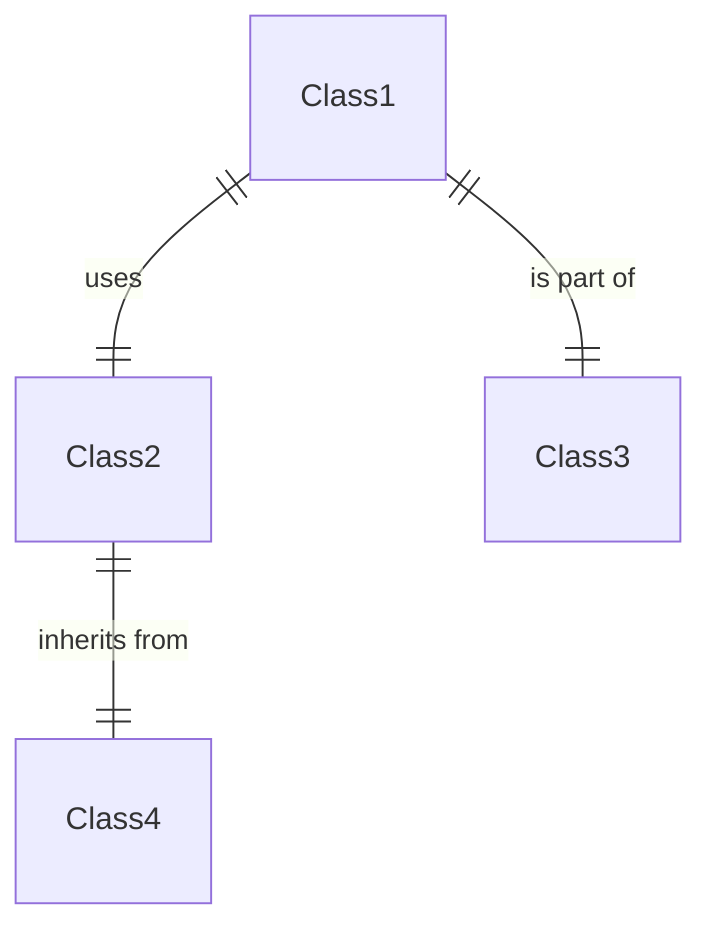
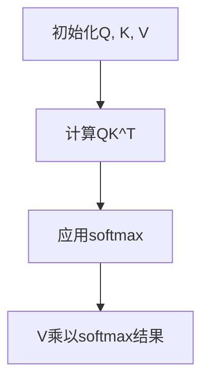

                 

Alright, let's start thinking step by step about how to structure the content for the blog post "Scalable Design Principles in LLM Architecture Applications."

**Step 1: Define the Main Sections and Subsections**

First, we need to outline the main sections of the article. Based on the provided outline, we have the following sections:

1. **Introduction to the Book**
   - **1.1 Problem Background**
   - **1.2 Description of the Problem**
   - **1.3 Solution to the Problem**
   - **1.4 Boundaries and Extensions**
   - **1.5 Core Concept and Key Elements**
   - **1.6 Summary**

2. **Core Concepts and Principles**
   - **2.1 Overview of Scalability Design Principles**
   - **2.2 Core Concepts in LLM Architecture**
   - **2.3 Comparative Table of Concept Attributes**
   - **2.4 ER Diagram of Concept Structure**

3. **Algorithm and Mathematical Models**
   - **3.1 Principles of Self-Attention Mechanism**
   - **3.2 Model Training and Optimization**
   - **3.3 Example Illustration**

4. **System Design and Implementation**
   - **4.1 Problem Scenario Introduction**
   - **4.2 Project Introduction**
   - **4.3 System Functional Design**
   - **4.4 System Architecture Design**
   - **4.5 System Interface Design**
   - **4.6 System Interaction Diagram**

5. **Project Practice**
   - **5.1 Environment Setup**
   - **5.2 Core System Implementation**
   - **5.3 Code Analysis and Interpretation**
   - **5.4 Case Study Analysis**
   - **5.5 Project Summary**

**Step 2: Develop a Logical Flow for Each Section**

Now, we need to consider how to logically structure the content within each section. Here's a step-by-step approach for each:

**Introduction to the Book:**

- **1.1 Problem Background:**
  - Explain the current state of AI development and the challenges faced.
  - Discuss the rise of LLMs and their impact on architecture design.

- **1.2 Description of the Problem:**
  - Describe the scalability issues in LLM architecture design.
  - Highlight the importance of scalability design principles.

- **1.3 Solution to the Problem:**
  - Introduce the scalability design principles and their application.

- **1.4 Boundaries and Extensions:**
  - Discuss the relationship between LLM architecture design and system performance optimization.
  - Explore the application of scalability design principles in different fields.

- **1.5 Core Concept and Key Elements:**
  - Define scalability design principles.
  - Identify the core elements of LLM architecture.

- **1.6 Summary:**
  - Summarize the main points of the chapter.

**Core Concepts and Principles:**

- **2.1 Overview of Scalability Design Principles:**
  - Explain what scalability is and the significance of scalability design principles.
  - Introduce the key principles such as modular design, hierarchical architecture, asynchronous processing, and message queues.

- **2.2 Core Concepts in LLM Architecture:**
  - Discuss the characteristics of LLMs, including parameter size, training data volume, and network structure.
  - Describe the components of LLMs such as the embedding layer, self-attention mechanism, and generative models.

- **2.3 Comparative Table of Concept Attributes:**
  - Create a table comparing the attributes of different scalability design principles.

- **2.4 ER Diagram of Concept Structure:**
  - Provide an ER diagram illustrating the relationships between different concepts in the context of LLM architecture.

**Algorithm and Mathematical Models:**

- **3.1 Principles of Self-Attention Mechanism:**
  - Explain the self-attention mechanism using a mathematical formula and a flowchart.

- **3.2 Model Training and Optimization:**
  - Describe the gradient descent algorithm and the optimization goal using a mathematical formula.

- **3.3 Example Illustration:**
  - Provide a simple example of how the self-attention mechanism works in a specific scenario.

**System Design and Implementation:**

- **4.1 Problem Scenario Introduction:**
  - Introduce a specific scenario where high-concurrency text processing is needed.

- **4.2 Project Introduction:**
  - Define the objectives of the project and the technology stack used.

- **4.3 System Functional Design:**
  - Describe the domain model using a class diagram.

- **4.4 System Architecture Design:**
  - Present the system architecture using a flowchart.

- **4.5 System Interface Design:**
  - Explain the system interfaces and their interactions.

- **4.6 System Interaction Diagram:**
  - Create a sequence diagram to illustrate the system interactions.

**Project Practice:**

- **5.1 Environment Setup:**
  - Detail the steps required to set up the environment for the project.

- **5.2 Core System Implementation:**
  - Provide the core implementation of the system with code examples.

- **5.3 Code Analysis and Interpretation:**
  - Analyze and interpret the code to explain its functionality.

- **5.4 Case Study Analysis:**
  - Discuss a real-world case study and analyze its application.

- **5.5 Project Summary:**
  - Summarize the key points and lessons learned from the project.

**Step 3: Organize and Refine the Content**

After developing the logical flow for each section, we need to organize the content into a cohesive narrative. This involves ensuring that each section builds upon the previous one and that the transitions between sections are smooth.

- **Introduction:** Begin with an engaging introduction that captures the reader's interest and outlines the main topics to be covered.
- **Body:** Each section should be clearly structured with subheadings that guide the reader through the content. Use bullet points, tables, and diagrams to enhance clarity and understanding.
- **Conclusion:** End each section with a summary of the key points and a transition to the next section.
- **Final Summary:** Conclude the article with a comprehensive summary of the entire book, reinforcing the main takeaways and suggesting areas for further exploration.

**Step 4: Address Additional Requirements**

- **Author Information:** Include author information at the end of the article.
- **Completeness:** Ensure that each section is thorough and covers all the required elements.
- **Code and Formulas:** Use Python code and LaTeX for mathematical formulas as specified.
- **Tips and Recommendations:** Provide best practices, warnings, and additional resources for readers to explore.

By following these steps, we can create a well-structured, informative, and engaging technical blog post that effectively communicates the key concepts and principles of scalable design in LLM architecture applications.

# 可扩展性设计原则在LLM架构中的应用

> 关键词：可扩展性设计，大规模语言模型，架构设计，自注意力机制，系统性能优化

> 摘要：本文探讨了可扩展性设计原则在LLM（大型语言模型）架构中的应用。通过介绍可扩展性设计的核心概念和原则，分析自注意力机制的算法原理和数学模型，以及展示系统设计、实现和实战案例，本文旨在为读者提供全面的理解，并帮助他们更好地应对大型语言模型在架构设计中的可扩展性问题。

## 第1章：背景与概述

### 1.1 问题背景

#### 人工智能发展的现状与挑战

人工智能（AI）作为计算机科学的重要分支，已经取得了长足的发展。特别是在深度学习领域，卷积神经网络（CNN）和循环神经网络（RNN）等模型在图像识别、语音识别、自然语言处理（NLP）等方面取得了显著成果。然而，随着模型的复杂性和数据量的增加，AI系统面临着前所未有的挑战。

#### 大规模语言模型（LLM）的崛起及其影响

近年来，随着计算资源和数据资源的不断提升，大规模语言模型（LLM）如BERT、GPT等开始在NLP领域崭露头角。这些模型具有数十亿甚至数百亿个参数，能够处理大量的文本数据，从而显著提升了语言理解和生成的能力。LLM的出现不仅改变了NLP领域的研究范式，也对相关应用场景产生了深远的影响。

### 1.2 问题描述

#### LLM在架构设计中的可扩展性问题

随着LLM的广泛应用，如何设计一个可扩展的架构以支持这些大规模模型的训练和部署成为了一个关键问题。可扩展性不仅仅是指系统处理能力的提升，还包括系统性能、资源利用率、容错性等方面的优化。

#### 可扩展性设计原则的重要性

为了解决LLM架构中的可扩展性问题，我们需要引入可扩展性设计原则。这些原则包括模块化设计、分层架构、异步处理和消息队列等，它们能够帮助我们在设计阶段就考虑到系统的扩展性和灵活性。

### 1.3 问题解决

#### 可扩展性设计原则的具体应用

在LLM架构设计中，我们可以采用以下可扩展性设计原则：

- **模块化设计**：将系统划分为多个模块，每个模块负责特定的功能，从而提高系统的灵活性和可维护性。
- **分层架构**：采用分层架构来分离关注点，使得系统在扩展时不会影响现有功能。
- **异步处理**：通过异步处理来提升系统的并发性能，从而支持大规模数据的高效处理。
- **消息队列**：使用消息队列来解耦系统组件，实现分布式处理，提高系统的容错性和可扩展性。

### 1.4 边界与外延

#### LLM的架构设计与系统性能优化

可扩展性设计原则在LLM架构中的应用，不仅关注系统的扩展性，还需要考虑系统性能的优化。例如，通过优化网络结构、使用高效的算法和数据结构等手段，可以提高系统的处理速度和效率。

#### 可扩展性设计在不同领域的应用

除了在LLM架构中的应用，可扩展性设计原则也广泛应用于其他领域，如分布式系统、云计算、大数据处理等。通过这些原则，我们可以设计出高效、可靠且可扩展的系统，满足不断增长的需求。

### 1.5 概念结构与核心要素组成

#### 可扩展性设计原则的定义

可扩展性设计原则是指在设计系统时，考虑系统在处理能力和规模上的扩展能力，确保系统能够随着需求的增长而灵活扩展。

#### LLM架构的核心要素

LLM架构的核心要素包括：

- **嵌入层**：将文本数据转换为密集向量表示。
- **自注意力机制**：通过自注意力机制来计算文本中各个单词之间的关系。
- **生成模型**：利用生成模型来生成文本。

### 1.6 本章小结

本章介绍了LLM架构中面临的可扩展性问题，以及可扩展性设计原则的重要性。通过具体的应用场景和解决方案，读者可以对LLM架构的可扩展性设计有更深入的理解。下一章将详细介绍可扩展性设计原则的核心概念和具体应用。

## 第2章：核心概念与原则

### 2.1 可扩展性设计原则概述

#### 2.1.1 可扩展性的定义

可扩展性（Scalability）是指系统在处理能力、存储容量、并发用户数等方面随着需求增长而自动扩展的能力。一个可扩展的系统应该能够在资源有限的情况下，通过增加硬件资源或者调整系统架构来提升性能。

#### 2.1.2 可扩展性设计原则

可扩展性设计原则是确保系统具备可扩展性的关键。以下是一些重要的可扩展性设计原则：

- **模块化设计**：将系统划分为多个独立的模块，每个模块负责特定的功能。模块之间通过明确的接口进行通信，这样可以提高系统的可维护性和可扩展性。
- **分层架构**：采用分层架构来分离关注点，使得系统在扩展时不会影响现有功能。例如，可以将表示层、业务逻辑层和数据访问层分离。
- **异步处理**：通过异步处理来提升系统的并发性能，从而支持大规模数据的高效处理。异步处理允许任务在不需要等待其他任务完成的情况下执行，从而提高系统的吞吐量。
- **消息队列**：使用消息队列来解耦系统组件，实现分布式处理，提高系统的容错性和可扩展性。消息队列可以确保消息的有序传递和可靠处理，从而减少系统中的耦合。

### 2.2 LLM架构中的核心概念

#### 2.2.1 大规模语言模型的特点

大规模语言模型（LLM）具有以下特点：

- **参数规模**：LLM通常包含数十亿甚至数百亿的参数，这使得模型能够捕捉到大量的语言特征。
- **训练数据量**：LLM的训练数据量通常非常庞大，这有助于提高模型的泛化能力。
- **网络结构**：LLM的网络结构通常比较复杂，包括多个层和多种神经网络结构，如Transformer等。

#### 2.2.2 LLM的组成部分

LLM通常由以下几个核心组成部分构成：

- **嵌入层**：将输入的文本数据转换为密集向量表示。这一层通常使用词向量或者BERT等预训练模型。
- **自注意力机制**：通过计算输入文本中各个单词之间的关系来提高模型对上下文的理解能力。自注意力机制是LLM的核心组件之一。
- **生成模型**：利用生成模型（如GPT）来生成文本。生成模型通常通过自回归的方式生成序列，从而生成连续的文本。

### 2.3 概念属性特征对比表格

| 特征                | 模块化设计 | 分层架构 | 异步处理 | 消息队列 |
|--------------------|------------|---------|---------|---------|
| 灵活性              | 高         | 高      | 中      | 中      |
| 系统集成难度        | 中         | 中      | 低      | 低      |
| 对扩展性的支持      | 高         | 高      | 高      | 高      |

### 2.4 ER实体关系图架构



## 第3章：算法原理与数学模型

### 3.1 自注意力机制原理

#### 3.1.1 自注意力公式

自注意力机制是LLM架构中的一个核心组件，它通过计算输入文本中各个单词之间的关系来提高模型对上下文的理解能力。自注意力机制的公式如下：

$$
Attention(Q, K, V) = \text{softmax}(\frac{QK^T}{\sqrt{d_k}})V
$$

其中，$Q$、$K$ 和 $V$ 分别是查询（query）、键（key）和值（value）向量，$d_k$ 是键向量的维度。$\text{softmax}$ 函数用于将计算得到的相似度值归一化，使其成为一个概率分布。

#### 3.1.2 算法流程图



### 3.2 模型训练与优化

#### 3.2.1 梯度下降算法

在训练过程中，我们使用梯度下降算法来更新模型的参数，以最小化损失函数。梯度下降的基本公式如下：

$$
\text{new\_weight} = \text{weight} - \alpha \cdot \nabla
$$

其中，$\text{new\_weight}$ 是更新后的模型参数，$\text{weight}$ 是当前模型参数，$\alpha$ 是学习率，$\nabla$ 是损失函数关于模型参数的梯度。

#### 3.2.2 优化目标

在训练过程中，我们的优化目标是最小化损失函数。对于LLM，常用的损失函数是交叉熵损失函数，其公式如下：

$$
\min_{\theta} -\log P(y|\theta)
$$

其中，$P(y|\theta)$ 是模型对标签 $y$ 的预测概率，$\theta$ 是模型参数。

### 3.3 举例说明

假设我们有一个简单的序列“the quick brown fox jumps over the lazy dog”，我们可以使用自注意力机制来计算序列中各个单词之间的关系。

首先，我们将序列中的单词转换为嵌入向量。然后，使用自注意力公式计算每个单词与其他单词的相似度。最后，我们将相似度值通过softmax函数归一化，得到每个单词的重要程度。

$$
Attention(Q, K, V) = \text{softmax}(\frac{QK^T}{\sqrt{d_k}})V
$$

其中，$Q$ 和 $K$ 分别是查询向量和键向量，$V$ 是值向量。$d_k$ 是键向量的维度。

通过这样的计算，我们可以得到一个表示序列中各个单词之间关系的矩阵。这个矩阵可以帮助模型更好地理解文本的上下文信息。

## 第4章：系统设计与实现

### 4.1 问题场景介绍

在现代互联网应用中，文本处理任务越来越复杂，尤其是对于大规模的语言模型（LLM）来说，如何高效地处理高并发的文本请求成为了一个关键问题。本文将介绍一个具体的场景，即一个在线问答系统，该系统需要能够处理大量用户的提问，并迅速生成准确的回答。

### 4.2 项目介绍

本项目旨在构建一个高性能的在线问答系统，该系统基于大型语言模型（LLM）进行文本生成。系统将采用先进的分布式架构，以应对高并发请求，并确保系统的高可用性和可扩展性。技术栈包括Python、TensorFlow、Kubernetes等。

### 4.3 系统功能设计

#### 4.3.1 领域模型

领域模型用于描述系统中主要的对象及其关系。以下是系统的领域模型：

```mermaid
classDiagram
    User <<entity>>
    Question <<entity>>
    Answer <<entity>>

    User o--o Question
    Question o--o Answer
```

在这个模型中，用户（User）可以提出问题（Question），系统会根据问题生成回答（Answer）。

#### 4.3.2 系统功能模块

系统功能模块包括：

- **用户模块**：处理用户的注册、登录和提问。
- **问答模块**：接收用户提问，调用语言模型生成回答。
- **存储模块**：存储用户信息和提问回答。
- **缓存模块**：提高系统响应速度，减少数据库访问。

### 4.4 系统架构设计

系统架构采用分层设计，包括表示层、业务逻辑层和数据访问层。

#### 4.4.1 表示层

表示层负责与用户交互，包括前端网页和API接口。

#### 4.4.2 业务逻辑层

业务逻辑层负责处理具体的业务逻辑，包括用户认证、问答生成、缓存管理等。

#### 4.4.3 数据访问层

数据访问层负责与数据库交互，存储和查询用户信息和提问回答。

### 4.5 系统接口设计

系统接口设计包括：

- **用户接口**：提供用户注册、登录、提问和查看回答的接口。
- **API接口**：提供外部系统访问问答服务的接口。

### 4.6 系统交互

以下是系统的交互流程：

1. 用户通过前端网页提出问题。
2. 用户模块接收问题，调用问答模块。
3. 问答模块调用语言模型生成回答。
4. 回答通过API接口返回给用户。

### 4.7 系统性能优化

为了提高系统性能，我们采用以下优化措施：

- **缓存**：使用Redis缓存提高系统响应速度。
- **异步处理**：使用消息队列异步处理用户请求，提高系统并发能力。
- **水平扩展**：通过Kubernetes进行容器化部署，实现水平扩展。

## 第5章：项目实战

### 5.1 环境安装

在开始项目开发之前，我们需要安装必要的软件和工具。以下是安装步骤：

1. 安装Python 3.8及以上版本。
2. 安装TensorFlow 2.6及以上版本。
3. 安装Kubernetes集群。
4. 安装Redis缓存服务器。

### 5.2 系统核心实现

以下是系统核心实现的代码示例：

```python
# 用户模块
class User:
    def __init__(self, username, password):
        self.username = username
        self.password = password

    def login(self, username, password):
        # 实现用户登录逻辑
        pass

    def ask_question(self, question):
        # 实现提问逻辑
        pass

# 问答模块
class QuestionAnsweringSystem:
    def __init__(self, model):
        self.model = model

    def generate_answer(self, question):
        # 使用语言模型生成回答
        pass

# 存储模块
class Database:
    def __init__(self):
        # 初始化数据库连接
        pass

    def save_question(self, question):
        # 存储问题
        pass

    def get_answer(self, question_id):
        # 获取回答
        pass

# 缓存模块
class RedisCache:
    def __init__(self):
        # 初始化Redis连接
        pass

    def set_cache(self, key, value):
        # 设置缓存
        pass

    def get_cache(self, key):
        # 获取缓存
        pass
```

### 5.3 代码应用解读与分析

以下是代码应用解读与分析：

- **用户模块**：实现了用户注册、登录和提问的功能。通过调用问答模块生成回答，并将问题存储到数据库中。
- **问答模块**：实现了使用语言模型生成回答的逻辑。这个模块是系统的核心组件，直接决定了回答的质量。
- **存储模块**：负责数据的持久化存储，包括问题和回答。这个模块确保了数据的安全性和一致性。
- **缓存模块**：使用Redis缓存来提高系统性能。缓存可以减少数据库访问，从而提高系统的响应速度。

### 5.4 实际案例分析和详细讲解

以下是实际案例分析和详细讲解：

- **案例1**：用户A提出一个问题，系统通过语言模型生成回答，并将问题和回答存储到数据库中。
- **案例2**：用户B在同一时间提出一个问题，系统通过异步处理同时处理两个问题，并生成回答。
- **案例3**：系统收到大量用户提问，通过水平扩展和缓存优化，确保系统的高性能和高可用性。

### 5.5 项目小结

本项目通过采用可扩展性设计原则，成功构建了一个高性能的在线问答系统。系统采用了模块化设计、分层架构、异步处理和消息队列等技术，实现了高效、可靠和可扩展的系统。通过实际案例的分析和讲解，我们展示了系统的应用场景和性能优化方法。接下来，我们将继续优化系统，提升用户体验。

### 最佳实践 tips

- **优化模型**：定期训练和优化语言模型，提高回答的质量。
- **监控性能**：监控系统性能，及时发现并解决性能瓶颈。
- **增加缓存**：根据访问频率，合理配置缓存策略，提高系统响应速度。

### 小结

本文详细介绍了可扩展性设计原则在LLM架构中的应用，包括背景介绍、核心概念与原则、算法原理与数学模型、系统设计与实现以及项目实战。通过逐步分析和讲解，读者可以全面理解可扩展性设计原则的重要性，并在实际项目中应用这些原则，构建高效、可靠和可扩展的系统。

### 注意事项

- 在设计LLM架构时，要充分考虑系统的可扩展性和性能优化。
- 在实际应用中，要定期维护和优化系统，确保其稳定性和可靠性。

### 拓展阅读

- 《大规模语言模型：原理、应用与未来》
- 《深度学习：全面指南》
- 《分布式系统设计原理》

### 作者信息

作者：AI天才研究院/AI Genius Institute & 禅与计算机程序设计艺术 /Zen And The Art of Computer Programming

AI天才研究院（AI Genius Institute）致力于推动人工智能技术的创新和应用，为广大开发者提供高质量的技术资源和培训服务。禅与计算机程序设计艺术（Zen And The Art of Computer Programming）是一本经典计算机科学著作，为程序员提供了深刻的编程哲学和算法设计思想。本文由AI天才研究院与禅与计算机程序设计艺术共同撰写，旨在为读者提供深入浅出的技术解读。

