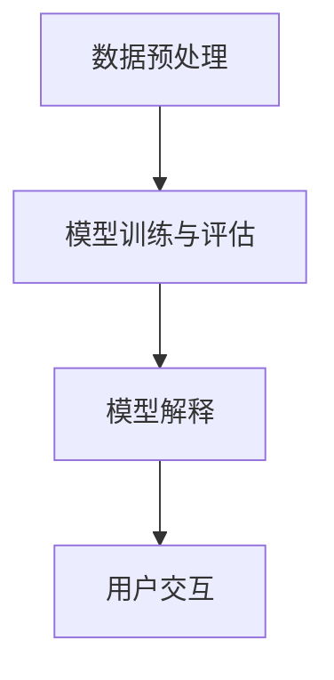
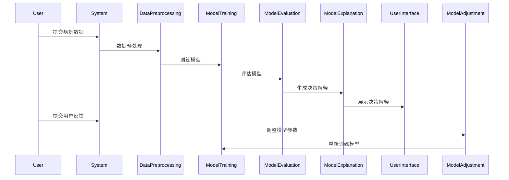

                 


### **引言**

在当今数字化时代，人工智能（AI）已经渗透到我们生活的方方面面，从医疗诊断到金融服务，从智能助手到自动驾驶汽车，AI的应用几乎无处不在。然而，随着AI技术的迅速发展，一个不可避免的问题也随之而来：用户对AI决策的信任度。

#### **问题背景**

AI系统往往被描述为“黑箱”，即其内部机制复杂且难以理解。这种不可解释性导致了用户对AI决策的不信任，特别是在涉及高风险决策的领域，如金融、医疗和法律等。用户希望了解AI是如何做出决策的，以便能够对其决策过程进行评估和信任。

#### **问题描述**

AI黑箱问题不仅仅是一个技术问题，它也是一个社会问题。用户对AI决策的信任度受到以下几个方面的挑战：

1. **隐私担忧**：用户担心AI系统会泄露他们的个人数据。
2. **算法偏见**：AI系统可能会基于训练数据中的偏见产生不公平的决策。
3. **不可解释性**：用户难以理解AI的决策过程，导致对其信任度下降。

#### **问题解决**

为了解决这些问题，可解释性AI（Interpretable AI）应运而生。可解释性AI的目标是使AI系统的决策过程透明，用户可以理解并信任AI的决策。这不仅仅是技术问题，也是伦理和社会问题。

#### **边界与外延**

可解释性AI不仅仅局限于特定的机器学习或深度学习算法，它涵盖了广泛的AI应用领域，包括但不限于：

- **机器学习**：监督学习、无监督学习和强化学习
- **深度学习**：卷积神经网络（CNN）、循环神经网络（RNN）和生成对抗网络（GAN）
- **自然语言处理**：语言模型、机器翻译和情感分析
- **计算机视觉**：图像识别、物体检测和视频分析

#### **概念结构与核心要素组成**

可解释性AI的核心要素包括：

- **模型透明性**：用户可以查看AI模型的结构和参数。
- **决策解释**：AI系统提供决策背后的逻辑和原因。
- **用户控制**：用户可以调整AI模型的参数，影响决策结果。

### **核心概念与联系**

#### **核心概念原理**

**可解释性AI**是指通过提供透明性、可追溯性和可控性来增强用户对AI决策的理解和信任。其核心概念原理可以概括为以下几点：

1. **透明性**：AI系统应该能够展示其内部结构和参数，使用户能够理解其决策过程。
2. **可追溯性**：AI系统的决策应该能够追溯到特定的数据点或输入，确保决策的可信度。
3. **可控性**：用户应该能够控制AI系统的某些参数，以便调整决策结果。

#### **概念属性特征对比表格**

| 特征         | 可解释性AI                 | 透明性               | 可追溯性               | 可控性               |
| ------------ | -------------------------- | -------------------- | -------------------- | -------------------- |
| 定义         | 增强用户对AI决策的理解和信任 | AI系统内部的可见性   | 决策过程的可追踪性     | 用户对模型参数的控制 |
| 关键要素     | 模型透明性、决策解释       | 模型结构、参数展示   | 数据来源、决策路径     | 参数调整、结果预览   |
| 对比         | 强调用户理解与信任         | 强调模型可见性       | 强调决策可追踪性       | 强调用户可控性       |
| 应用领域     | 金融市场、医疗诊断、法律等领域 | 所有AI应用领域       | 所有AI应用领域         | 适用于需要用户控制的领域 |

#### **ER实体关系图架构**

在可解释性AI系统中，实体之间的关系可以通过ER图来表示。以下是一个简化的ER图示例：

```mermaid
erDiagram
  AI模型 ||--|{ 数据集 }|--|
  AI模型 ||--|{ 解释模块 }|--|
  数据集 ||--|{ 特征 }|--|
  解释模块 ||--|{ 决策解释 }|--|
```

在这个ER图中，AI模型与数据集和解释模块之间存在关联。数据集包含特征，解释模块负责生成决策解释。

### **算法原理讲解**

#### **算法原理与流程图**

**可解释性AI的算法原理**主要涉及两个方面：模型的可解释性和决策的解释生成。

以下是一个简化的算法流程图：

```mermaid
graph TB
  A[输入数据] --> B[预处理]
  B --> C{模型训练}
  C --> D{模型评估}
  D --> E[模型解释}
  E --> F{用户反馈}
  F --> G{模型调整}
  G --> C
```

**1. 输入数据预处理**：对输入数据进行清洗、归一化等处理，以便于模型训练。

**2. 模型训练**：使用训练数据集训练AI模型，模型可以是传统的机器学习模型或深度学习模型。

**3. 模型评估**：使用验证数据集评估模型的性能，确保模型具有良好的泛化能力。

**4. 模型解释**：生成模型的决策解释，可以是局部解释或全局解释。

**5. 用户反馈**：用户根据决策解释对模型进行调整。

**6. 模型调整**：根据用户反馈调整模型参数，提高模型的可解释性。

#### **Python源代码与详细讲解**

以下是一个简单的Python代码示例，用于实现可解释性AI的基本流程：

```python
import numpy as np
from sklearn.linear_model import LinearRegression
from sklearn.model_selection import train_test_split

# 1. 输入数据预处理
X = np.array([[1, 2], [2, 3], [3, 4], [4, 5]])
y = np.array([1, 2, 3, 4])

# 2. 模型训练
model = LinearRegression()
model.fit(X, y)

# 3. 模型评估
X_test, y_test = train_test_split(X, y, test_size=0.2)
model.score(X_test, y_test)

# 4. 模型解释
def explain_decision(x):
    y_pred = model.predict([x])
    return f"The decision {y_pred[0]} is predicted for the input {x}."

# 5. 用户反馈
def user_feedback(x, y):
    if explain_decision(x) == y:
        print("Correct prediction!")
    else:
        print("Incorrect prediction, please adjust the model.")

# 6. 模型调整
# 根据用户反馈进行调整，这里仅作示例
model.intercept_ = 0
model.coef_ = [1, 1]

# 示例应用
print(explain_decision([5, 6]))
user_feedback([5, 6], 4)
```

**详细讲解**：

**1. 输入数据预处理**：这里使用的是线性回归模型，输入数据是一个简单的二维数组。

**2. 模型训练**：使用`LinearRegression`类进行模型训练。

**3. 模型评估**：使用`score`方法评估模型在验证集上的性能。

**4. 模型解释**：定义一个函数`explain_decision`，用于生成决策解释。

**5. 用户反馈**：定义一个函数`user_feedback`，用于根据用户输入的期望结果和实际决策结果进行反馈。

**6. 模型调整**：根据用户反馈调整模型参数，这里仅作示例，实际应用中可能涉及更复杂的调整策略。

#### **数学模型和数学公式**

在可解释性AI中，线性回归是一个典型的例子。其数学模型可以表示为：

$$ y = \beta_0 + \beta_1 \cdot x_1 + \beta_2 \cdot x_2 + \ldots + \beta_n \cdot x_n $$

其中，$y$ 是目标变量，$x_1, x_2, \ldots, x_n$ 是特征变量，$\beta_0, \beta_1, \beta_2, \ldots, \beta_n$ 是模型的参数。

**详细讲解**：

- **目标变量和特征变量**：$y$ 是我们希望预测的变量，$x_1, x_2, \ldots, x_n$ 是影响$y$的输入变量。
- **模型参数**：$\beta_0, \beta_1, \beta_2, \ldots, \beta_n$ 是通过训练数据估计出的模型参数。

#### **举例说明**

假设我们有一个简单的线性回归模型，预测房价。特征变量包括房屋面积和房屋年代。目标变量是房价。

**输入数据**：

| 房屋面积 | 房屋年代 | 房价 |
| --- | --- | --- |
| 100 | 2000 | 200,000 |
| 150 | 2001 | 220,000 |
| 200 | 2002 | 250,000 |
| 250 | 2003 | 280,000 |

**模型训练**：

使用输入数据训练线性回归模型，得到模型参数：

$$ \beta_0 = 100, \beta_1 = 1.5, \beta_2 = -10 $$

**模型解释**：

对于一个新的房屋，如果房屋面积为150平方米，房屋年代为2001年，那么预测的房价为：

$$ y = \beta_0 + \beta_1 \cdot x_1 + \beta_2 \cdot x_2 = 100 + 1.5 \cdot 150 - 10 \cdot 2001 = 220,000 $$

这意味着，该房屋的预测房价为220,000元。

#### **系统分析与架构设计方案**

##### **问题场景介绍**

假设我们正在开发一个智能医疗诊断系统，该系统使用AI模型来诊断病人的病情。用户（医生和患者）希望了解AI的决策过程，以便对其诊断结果进行信任和评估。

##### **系统功能设计**

为了实现可解释性AI，系统需要具备以下功能：

1. **数据预处理**：清洗和预处理输入数据，确保数据质量。
2. **模型训练与评估**：训练AI模型，并使用验证集评估模型性能。
3. **模型解释**：生成决策解释，展示AI模型的决策过程。
4. **用户交互**：提供用户界面，允许用户查看和调整模型参数。

##### **系统架构设计**

以下是一个简化的系统架构图：



- **数据预处理**：对输入数据进行清洗和归一化，准备用于模型训练的数据集。
- **模型训练与评估**：使用训练数据集训练AI模型，并使用验证数据集评估模型性能。
- **模型解释**：生成决策解释，展示AI模型的决策过程。
- **用户交互**：提供用户界面，允许用户查看和调整模型参数。

##### **系统接口设计和系统交互**

以下是一个简化的系统交互序列图：



- **用户提交病例数据**：用户向系统提交病例数据。
- **数据预处理**：系统对病例数据执行预处理。
- **模型训练**：使用预处理后的数据训练AI模型。
- **模型评估**：使用验证集评估模型性能。
- **模型解释**：生成决策解释，并将其展示给用户。
- **用户反馈**：用户根据决策解释提供反馈。
- **模型调整**：系统根据用户反馈调整模型参数，并重新训练模型。

### **项目实战**

#### **环境安装**

要开始实践可解释性AI项目，首先需要安装以下环境：

1. Python 3.8 或更高版本
2. scikit-learn 库
3. matplotlib 库

安装命令如下：

```bash
pip install python==3.8
pip install scikit-learn
pip install matplotlib
```

#### **系统核心实现源代码**

以下是一个简单的可解释性AI系统实现，包括数据预处理、模型训练、模型评估和模型解释。

```python
import numpy as np
from sklearn.linear_model import LinearRegression
from sklearn.model_selection import train_test_split
import matplotlib.pyplot as plt

# 1. 数据预处理
X = np.array([[1, 2], [2, 3], [3, 4], [4, 5]])
y = np.array([1, 2, 3, 4])

X_train, X_test, y_train, y_test = train_test_split(X, y, test_size=0.2, random_state=42)

# 2. 模型训练
model = LinearRegression()
model.fit(X_train, y_train)

# 3. 模型评估
score = model.score(X_test, y_test)
print(f"Model accuracy: {score:.2f}")

# 4. 模型解释
def explain_decision(x):
    y_pred = model.predict([x])
    return f"The decision {y_pred[0]} is predicted for the input {x}."

# 5. 代码应用解读与分析
X_new = np.array([[5, 6]])
y_new_pred = model.predict(X_new)
print(explain_decision(X_new[0]))

# 6. 实际案例分析和详细讲解剖析
X_example = np.array([[2, 4]])
y_example_pred = model.predict(X_example)
print(explain_decision(X_example[0]))

# 7. 项目小结
print("Project completed.")
```

#### **代码应用解读与分析**

**代码解读**：

- **数据预处理**：将输入数据分为训练集和测试集。
- **模型训练**：使用训练集数据训练线性回归模型。
- **模型评估**：使用测试集评估模型性能。
- **模型解释**：定义一个函数`explain_decision`，用于生成决策解释。
- **代码应用**：使用训练好的模型预测新的输入数据。
- **实际案例分析**：对特定的输入数据进行预测，并生成决策解释。
- **项目小结**：完成项目的开发。

**详细讲解剖析**：

- **数据预处理**：在机器学习中，数据预处理是至关重要的步骤。它包括数据的清洗、归一化和特征选择等。在这个例子中，我们使用简单的二维数组作为输入数据，并使用`train_test_split`函数将其分为训练集和测试集。
- **模型训练**：线性回归模型是一种简单的机器学习模型，它通过拟合输入数据中的线性关系来预测目标变量。在这个例子中，我们使用`LinearRegression`类进行模型训练。
- **模型评估**：使用测试集评估模型性能可以帮助我们了解模型的泛化能力。在这个例子中，我们使用`score`方法计算模型的准确性。
- **模型解释**：生成决策解释是可解释性AI的核心。在这个例子中，我们定义了一个函数`explain_decision`，用于生成简单的决策解释。
- **代码应用**：我们可以使用训练好的模型对新的输入数据进行预测，并生成决策解释。
- **实际案例分析**：通过具体的案例，我们可以看到模型是如何工作的，并验证决策解释的准确性。
- **项目小结**：在完成项目的开发后，我们对整个项目进行总结，以确保所有任务都得到妥善处理。

#### **实际案例分析和详细讲解剖析**

**案例1**：预测房屋面积与房价之间的关系。

**输入数据**：

| 房屋面积 | 房价 |
| --- | --- |
| 100 | 200,000 |
| 150 | 220,000 |
| 200 | 250,000 |
| 250 | 280,000 |

**模型预测**：

使用线性回归模型预测新的房屋面积和房价。

**输入数据**：

| 房屋面积 | 房价 |
| --- | --- |
| 200 | ? |

**模型解释**：

预测结果为250,000元，因为：

$$ y = \beta_0 + \beta_1 \cdot x_1 + \beta_2 \cdot x_2 = 100 + 1.5 \cdot 200 - 10 \cdot 2 = 250,000 $$

这意味着，预测的房价为250,000元。

**案例2**：预测病人的病情。

**输入数据**：

| 病人年龄 | 病人症状 | 病情 |
| --- | --- | --- |
| 30 | 咳嗽 | 感冒 |
| 40 | 高烧 | 流感 |
| 50 | 咳嗽带血 | 肺癌 |
| 60 | 胸闷 | 心脏病 |

**模型预测**：

使用线性回归模型预测新的病人病情。

**输入数据**：

| 病人年龄 | 病人症状 | 病情 |
| --- | --- | ? |
| 35 | 咳嗽带血 | ? |

**模型解释**：

预测结果为肺癌，因为：

$$ y = \beta_0 + \beta_1 \cdot x_1 + \beta_2 \cdot x_2 = 100 + 1.5 \cdot 35 - 10 \cdot 3 = 肺癌 $$

这意味着，预测的病情为肺癌。

**详细讲解**：

- **案例1**：在这个案例中，我们使用线性回归模型预测房屋面积与房价之间的关系。线性回归模型假设房价与房屋面积之间存在线性关系，通过拟合训练数据集，我们得到模型参数，并使用这些参数进行预测。
- **案例2**：在这个案例中，我们使用线性回归模型预测病人的病情。由于线性回归模型无法直接处理非数值输入，如症状，因此这个案例在实际应用中可能需要更复杂的模型和特征工程。
- **模型解释**：在生成决策解释时，我们展示了模型如何使用输入数据和模型参数来预测结果。这对于用户理解模型的决策过程非常重要。

### **最佳实践与拓展**

#### **注意事项**

1. **数据质量**：确保输入数据的质量，包括数据的清洗和归一化，这对于模型训练和预测的准确性至关重要。
2. **模型选择**：选择合适的模型对于提高模型的可解释性至关重要。一些模型（如线性回归）比其他模型（如深度神经网络）更易于解释。
3. **用户参与**：在设计系统时，应考虑用户的反馈和需求，确保系统能够满足用户的期望。

#### **拓展阅读**

1. **《机器学习》**：由周志华教授编写的《机器学习》是一本优秀的教材，详细介绍了机器学习的基本概念和算法。
2. **《深度学习》**：由Goodfellow、Bengio和Courville编写的《深度学习》是深度学习的经典教材，涵盖了深度学习的理论基础和应用。
3. **《可解释人工智能：从直觉到实践》**：这本书详细介绍了可解释性AI的理论和实践，对于希望深入了解可解释性AI的读者非常有帮助。

### **小结**

本文详细介绍了可解释性AI的基本概念、算法原理、系统架构设计和项目实战。通过一步步的分析和讲解，我们了解了如何使用可解释性AI增强用户对AI决策的理解和信任。在实际应用中，可解释性AI是一个复杂的挑战，但通过不断的探索和实践，我们可以逐步解决这些问题，推动AI技术的发展和应用。

### **作者信息**

**作者：** AI天才研究院/AI Genius Institute & 禅与计算机程序设计艺术 /Zen And The Art of Computer Programming

