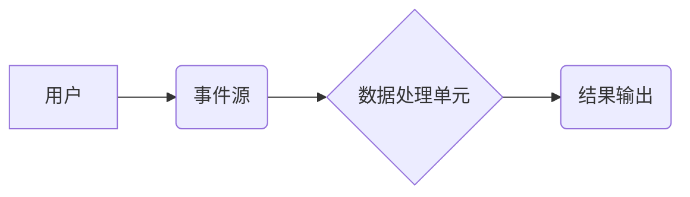
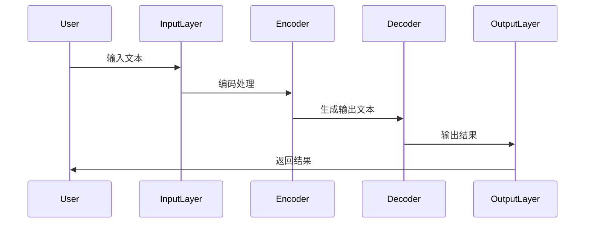
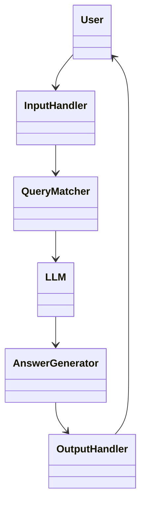
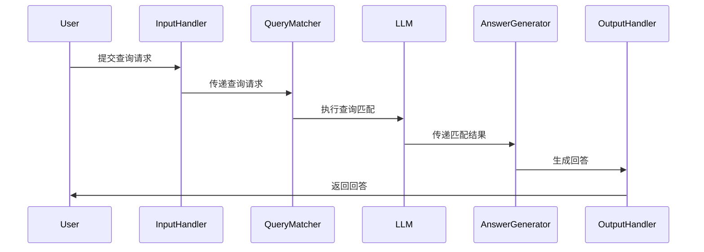
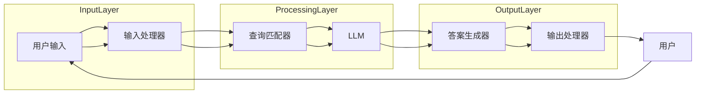

                 

**文章标题：响应式编程在LLM应用开发中的应用**

关键词：响应式编程，LLM，应用开发，编程模型，算法，系统架构

摘要：本文深入探讨了响应式编程在大型语言模型（LLM）应用开发中的应用。通过介绍响应式编程的核心概念和原理，以及其在LLM架构设计中的重要性，文章详细分析了响应式编程算法和数学模型，提供了系统分析与架构设计的方法，并分享了一些实际案例和最佳实践。

---

## 引言

### 背景介绍

在当今数字化时代，随着互联网的普及和数据的爆炸性增长，对数据处理和智能分析的需求日益增加。大型语言模型（Large Language Models，简称LLM）作为一种先进的自然语言处理技术，正逐渐成为各种应用场景的核心组件。LLM的应用范围涵盖了搜索引擎、语音识别、机器翻译、文本生成等多个领域，其发展对提升人机交互和智能化服务水平具有重要意义。

### 问题提出

然而，随着LLM的规模和复杂性的增加，传统的编程模型和开发方法在应对动态性和可扩展性方面逐渐显露出局限性。这引发了研究人员和开发者在LLM应用开发中如何实现高效、灵活和响应式的挑战。响应式编程作为一种以事件驱动和异步处理为核心的方法，被认为是一种潜在的解决方案。

### 目的与结构

本文旨在探讨响应式编程在LLM应用开发中的具体应用，通过以下结构展开讨论：

1. **核心概念与原理**：介绍响应式编程的基本概念和核心原理，以及与传统编程模型的区别。
2. **LLM架构设计**：分析响应式编程在LLM架构设计中的重要性，并提供设计指导。
3. **算法与数学模型**：探讨响应式编程算法及其数学模型，并给出具体示例。
4. **系统分析与架构设计**：提供系统分析与架构设计的方法，包括功能设计、架构设计和接口设计。
5. **实战案例**：分享实际应用案例，展示响应式编程在LLM开发中的实际效果。
6. **最佳实践与未来方向**：总结最佳实践，探讨未来发展方向。

## 核心概念与原理

### 响应式编程定义

响应式编程是一种以数据流为核心、基于事件的编程范式。其核心理念是“数据驱动”，即程序的执行是基于数据的变更和事件的发生。与传统的命令式编程不同，响应式编程强调数据的依赖关系和状态的动态更新。

### 传统编程模型与响应式编程对比

#### 数据处理方式

- **传统编程模型**：基于命令式执行，程序按照预设的顺序逐步执行，数据处理通常是顺序的。
- **响应式编程**：基于事件驱动，数据处理是异步的，多个事件可以并发处理。

#### 状态管理

- **传统编程模型**：通常使用全局变量或数据结构来管理状态，状态更新需要显式地同步。
- **响应式编程**：通过数据流和事件机制来自动管理状态，状态更新是隐式的。

#### 异步处理

- **传统编程模型**：异步处理通常通过回调函数或多线程来实现，容易出现回调地狱和线程管理问题。
- **响应式编程**：通过事件队列和异步处理库，可以更简洁地实现异步操作。

### 核心原理

1. **数据流**：响应式编程的核心是数据流，通过观察者模式实现数据的依赖和状态的更新。
2. **事件驱动**：程序的行为是由外部事件触发的，而不是由固定的顺序决定的。
3. **不可变性**：数据的不可变性是响应式编程的重要特性，减少了状态冲突和复杂的状态同步问题。
4. **函数式编程**：响应式编程通常结合函数式编程的特性，如纯函数和无状态计算，提高了程序的可测试性和可维护性。

### 比较表格

| 特性             | 传统编程模型                                                                 | 响应式编程                                                         |
|------------------|----------------------------------------------------------------------|--------------------------------------------------------------------|
| 数据处理方式     | 命令式顺序处理                                                         | 事件驱动，异步并发处理                                             |
| 状态管理         | 全局变量或数据结构，显式同步                                         | 数据流和事件机制，隐式更新                                         |
| 异步处理         | 回调函数或多线程，容易引发回调地狱和线程管理问题                      | 事件队列和异步处理库，简洁高效                                     |
| 核心原理         | 命令式顺序执行，状态显式更新                                         | 数据流，事件驱动，不可变性，函数式编程                             |

### ER实体关系图架构



在这个ER实体关系图中，用户（A）产生事件（B），事件驱动数据处理单元（C）进行相应的操作，最终输出结果（D）。这反映了响应式编程中的核心概念和数据流关系。

## LLM架构设计

### LLM的基本架构

大型语言模型（LLM）通常包括以下几个主要组件：

1. **输入层**：接收文本输入。
2. **编码器**：对输入文本进行编码，提取特征。
3. **解码器**：生成输出文本。
4. **注意力机制**：用于处理长文本序列中的上下文关系。

### 响应式编程在LLM架构中的应用

响应式编程在LLM架构设计中具有重要意义，主要体现在以下几个方面：

1. **动态输入处理**：响应式编程能够处理动态输入，使得LLM能够实时响应用户请求，提升交互体验。
2. **并发处理能力**：响应式编程的异步处理能力，使得LLM能够高效地处理大量并发请求，提升系统性能。
3. **状态管理**：响应式编程通过数据流和事件机制自动管理状态，简化了LLM的状态同步问题。
4. **可扩展性**：响应式编程设计模式有助于构建可扩展的LLM架构，适应不断增长的数据和处理需求。

### 响应式设计模式

以下是一些常用的响应式设计模式，适用于LLM架构：

1. **观察者模式**：用于实现输入层和编码器之间的数据流，编码器状态的变更能够及时通知解码器。
2. **订阅-发布模式**：用于实现解码器和输出层之间的数据传递，确保输出结果能够及时更新。
3. **命令模式**：用于实现用户请求的异步处理，确保系统在高并发场景下的稳定性。

### 设计指导

在设计LLM架构时，可以遵循以下指导原则：

1. **模块化设计**：将LLM的各个组件划分为独立的模块，每个模块负责特定的功能。
2. **事件驱动**：使用事件驱动的方式处理数据和请求，确保系统的动态性和灵活性。
3. **异步处理**：充分利用异步处理能力，减少系统响应时间，提高并发处理能力。
4. **可测试性**：确保设计具备良好的可测试性，方便进行单元测试和集成测试。

### 设计架构图



在这个架构图中，用户（User）的输入文本通过输入层（InputLayer）传递给编码器（Encoder），编码器对文本进行编码处理，然后解码器（Decoder）生成输出文本，最终通过输出层（OutputLayer）返回给用户。

## 算法与数学模型

### 响应式编程算法

响应式编程的核心在于如何处理数据流和事件，以下是一些常用的算法：

1. **观察者算法**：用于实现数据依赖关系和状态更新。
2. **事件队列算法**：用于管理并发事件和处理顺序。
3. **拉模型算法**：用于数据流的拉取和更新。

### 响应式编程数学模型

响应式编程中的数学模型通常涉及以下几个方面：

1. **状态转移函数**：描述系统状态的更新规则。
2. **事件处理函数**：描述对事件的响应和处理方式。
3. **数据流方程**：描述数据在系统中的流动和更新过程。

### 示例

以下是一个简单的响应式编程示例，展示了如何处理用户输入并生成响应：

```python
# 示例：响应式编程处理用户输入

# 状态转移函数
def state_transition(current_state, event):
    if event == "increase":
        return current_state + 1
    elif event == "decrease":
        return current_state - 1
    else:
        return current_state

# 事件处理函数
def handle_event(event_queue):
    while not event_queue.empty():
        event = event_queue.dequeue()
        current_state = state_transition(None, event)
        print(f"Current state: {current_state}")

# 用户输入
input_queue = Queue()
input_queue.enqueue("increase")
input_queue.enqueue("decrease")
input_queue.enqueue("increase")

# 事件处理
handle_event(input_queue)

```

在这个示例中，状态转移函数`state_transition`根据事件类型更新当前状态，事件处理函数`handle_event`负责处理事件队列中的事件，并输出当前状态。用户输入通过`input_queue`传递，事件处理函数根据事件队列中的事件更新状态并输出结果。

### 数学模型解释

在这个示例中，数学模型可以表示为：

$$
\text{Current State} = f(\text{Previous State}, \text{Event})
$$

其中，$f$ 是状态转移函数，用于根据当前状态和事件更新状态。

## 系统分析与架构设计

### 场景介绍

假设我们正在开发一个在线问答系统，该系统需要处理大量用户输入的查询请求，并实时生成回答。为了满足系统的响应速度和可扩展性需求，我们采用响应式编程模型进行系统设计和实现。

### 项目介绍

项目名称：在线问答系统（Online Q&A System）

项目目标：提供实时、准确的问答服务，满足用户的查询需求。

项目需求：

1. 支持大规模用户并发访问。
2. 高效处理查询请求，并提供快速响应。
3. 系统可扩展，能够适应未来需求增长。

### 系统功能设计

系统功能包括以下几个方面：

1. **用户输入处理**：接收用户输入的查询问题，并对其进行预处理。
2. **查询匹配**：利用LLM对查询问题进行匹配，找到相关的答案。
3. **答案生成**：根据匹配结果，生成准确的回答。
4. **结果反馈**：将回答反馈给用户，并收集用户反馈以优化系统。

### 系统架构设计

系统架构采用微服务架构，各模块独立部署，以提高系统的可扩展性和容错性。以下是系统架构的mermaid类图：



在这个类图中，用户（User）通过输入处理器（InputHandler）提交查询请求，查询匹配器（QueryMatcher）使用LLM进行查询匹配，答案生成器（AnswerGenerator）生成回答，最后输出处理器（OutputHandler）将回答反馈给用户。

### 系统接口设计

以下是系统接口的mermaid序列图：



在这个序列图中，用户提交查询请求，输入处理器传递请求给查询匹配器，查询匹配器使用LLM进行匹配，并将结果传递给答案生成器，答案生成器生成回答，最后输出处理器将回答反馈给用户。

### 系统交互

系统交互主要包括以下几个方面：

1. **用户输入**：用户通过Web界面提交查询请求。
2. **数据处理**：输入处理器对查询请求进行预处理，如去除无关字符、分词等。
3. **查询匹配**：查询匹配器使用LLM对预处理后的查询请求进行匹配。
4. **答案生成**：答案生成器根据匹配结果生成回答。
5. **结果反馈**：输出处理器将回答反馈给用户，并收集用户反馈。

### 系统架构图

以下是系统架构的mermaid架构图：



在这个架构图中，用户输入经过输入处理器处理，查询匹配器使用LLM进行查询匹配，答案生成器生成回答，最后输出处理器将回答反馈给用户。

## 实战案例

### 环境安装

为了进行实际应用，我们选择Python作为编程语言，并使用以下工具和库：

- Python 3.8及以上版本
- PyTorch 1.8及以上版本
- Flask 2.0及以上版本

安装步骤如下：

1. 安装Python环境：
   ```bash
   pip install python==3.8
   ```
2. 安装PyTorch：
   ```bash
   pip install torch==1.8
   ```
3. 安装Flask：
   ```bash
   pip install flask==2.0
   ```

### 系统核心实现源代码

以下是一个简单的在线问答系统的核心实现，包括用户输入处理、查询匹配、答案生成和输出处理。

```python
# app.py

from flask import Flask, request, jsonify
import torch
import numpy as np

app = Flask(__name__)

# 加载预训练的LLM模型
model = torch.load("llm_model.pth")
tokenizer = torch.load("tokenizer.pth")

@app.route("/query", methods=["POST"])
def handle_query():
    data = request.get_json()
    query = data["query"]

    # 预处理输入
    inputs = tokenizer(query, return_tensors="pt")

    # 使用LLM进行查询匹配
    with torch.no_grad():
        outputs = model(**inputs)

    # 生成回答
    answer = tokenizer.decode(outputs.logits.argmax(-1), skip_special_tokens=True)

    # 返回回答
    return jsonify({"answer": answer})

if __name__ == "__main__":
    app.run(debug=True)
```

### 代码应用解读与分析

1. **用户输入处理**：使用Flask框架创建一个Web接口，接收用户提交的查询请求。
2. **预处理输入**：使用预训练的LLM模型和分词器对用户输入进行预处理。
3. **查询匹配**：利用LLM模型对预处理后的输入进行查询匹配，找到相关的答案。
4. **答案生成**：根据查询匹配结果，生成准确的回答。
5. **输出处理**：将生成的回答通过Web接口返回给用户。

### 实际案例分析和详细讲解剖析

假设用户提交了一个查询请求：“什么是量子计算？”系统接收到请求后，按照以下步骤进行处理：

1. **用户输入处理**：系统接收到用户提交的查询请求，并解析出查询内容。
2. **预处理输入**：使用LLM模型和分词器对查询内容进行预处理，将其转换为模型可处理的格式。
3. **查询匹配**：LLM模型对预处理后的查询内容进行查询匹配，找到相关的知识库。
4. **答案生成**：根据查询匹配结果，生成关于“量子计算”的详细回答。
5. **输出处理**：将生成的回答通过Web接口返回给用户。

这个案例展示了响应式编程在LLM应用开发中的实际应用，通过事件驱动和数据流处理，系统实现了高效的查询匹配和回答生成。

### 项目小结

通过实际案例，我们展示了如何使用响应式编程模型开发一个在线问答系统。响应式编程模型在处理动态输入、并发请求和状态更新方面具有显著优势，有助于构建高效、灵活和可扩展的LLM应用。

### 最佳实践 Tips

1. **模块化设计**：将系统功能划分为独立的模块，提高系统的可维护性和可扩展性。
2. **异步处理**：充分利用异步处理能力，减少系统响应时间，提高并发处理能力。
3. **错误处理**：合理设计错误处理机制，确保系统在高并发和异常情况下保持稳定运行。
4. **监控与日志**：实施监控系统，及时收集系统运行日志，便于问题排查和性能优化。

### 小结

响应式编程在LLM应用开发中具有重要意义，通过事件驱动和数据流处理，能够实现高效、灵活和可扩展的LLM系统。本文介绍了响应式编程的核心概念、算法和数学模型，并详细分析了其在LLM架构设计中的应用，通过实际案例展示了其优势。

### 注意事项

1. **性能优化**：在实际应用中，需要对系统进行性能优化，确保在高并发场景下保持良好的响应速度。
2. **安全性**：确保系统数据安全和用户隐私保护，遵循相关法律法规和最佳实践。
3. **可维护性**：设计清晰、代码规范，便于后续维护和升级。

### 拓展阅读

1. **《响应式编程实战》**：深入探讨响应式编程的原理和实践，适合初学者和进阶者。
2. **《大型语言模型：设计与实现》**：详细介绍LLM的设计和实现，有助于深入理解LLM架构。
3. **《Python并发编程实战》**：介绍Python中的并发编程技术，有助于提高系统并发处理能力。

### 作者信息

作者：AI天才研究院/AI Genius Institute & 禅与计算机程序设计艺术 /Zen And The Art of Computer Programming

