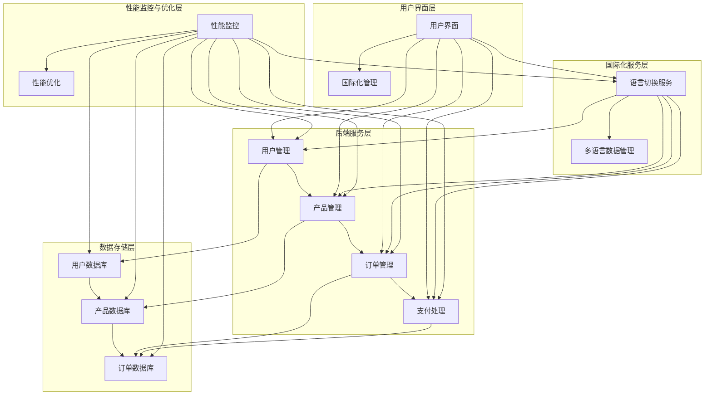
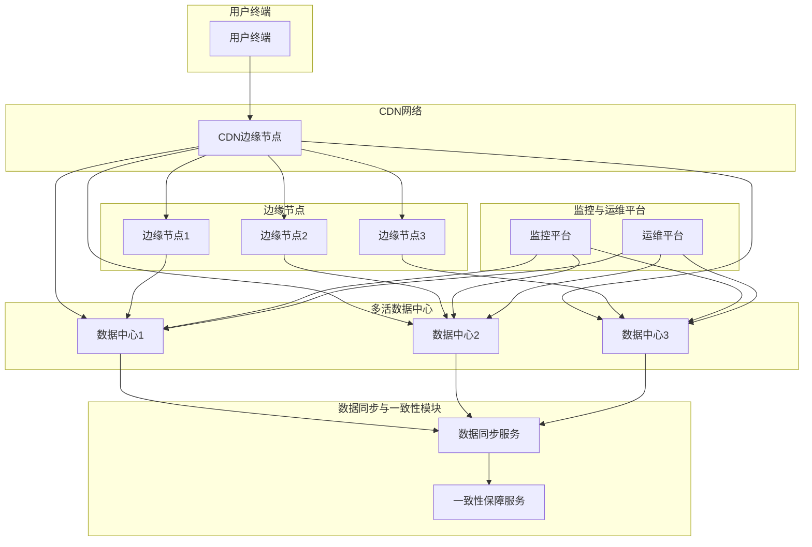
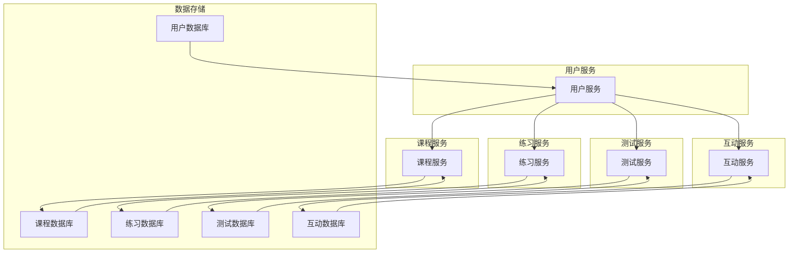
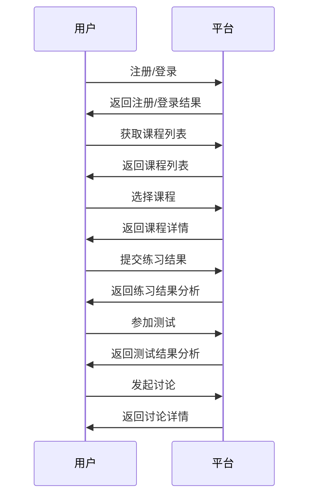

                 

### 引言：国际化与本地化的背景与挑战

国际化与本地化，作为现代商业和技术发展的必然趋势，已经成为了企业成功的关键因素。随着全球化进程的加速，企业需要面对不同国家和地区的市场需求和文化差异，因此如何实现国际化与本地化成为了商业战略和技术架构设计中的重要课题。

#### 1.1 国际化与本地化的基本概念

**国际化**（Internationalization）是指产品或服务在设计阶段就考虑到多种语言和地区市场的需求，以便在未来能够轻松地适应不同的文化环境。国际化的核心在于提前规划，确保软件或产品的可移植性和通用性，从而减少后期本地化的成本和时间。

**本地化**（Localization）则是将国际化后的产品或服务根据特定地区的文化和语言特点进行适配，使其能够满足当地用户的需求。本地化工作通常包括翻译、文化适应、格式更改等。

#### 1.2 LLamasuit Model（LLM）的全球化应用

LLM（Large Language Model），即大型语言模型，如GPT-3、BERT等，已经成为自然语言处理（NLP）领域的重要工具。LLM的全球化应用主要体现在以下几个方面：

- **多语言支持**：LLM可以通过训练支持多种语言，使得全球用户能够以本地语言与模型互动。
- **文化适应性**：LLM可以学习并适应不同地区的文化特征，提供更加贴心的服务。
- **地域化内容生成**：LLM可以根据不同地区的需求生成定制化的内容，如新闻报道、产品描述等。

#### 1.3 全球化面临的挑战与解决方案

全球化过程中，企业面临以下几方面的挑战：

- **技术挑战**：如何构建能够支持多语言、多地区的技术架构。
- **文化差异**：如何处理不同地区的文化差异，提供符合当地习惯的服务。
- **成本与效益**：如何在国际化和本地化过程中控制成本，实现效益最大化。

解决方案包括：

- **构建可扩展的技术架构**：通过微服务架构、分布式计算等技术，构建能够支持全球化运营的技术基础设施。
- **文化适应性策略**：通过市场调研、用户反馈等方式，深入了解目标市场的文化特点，制定相应的本地化策略。
- **成本效益分析**：在规划和实施国际化与本地化过程中，进行全面的成本效益分析，确保资源合理配置。

#### 1.4 国际化与本地化架构的设计原则

国际化与本地化架构设计应遵循以下原则：

- **模块化设计**：将不同地区的需求模块化，以便快速部署和更新。
- **可扩展性**：确保架构能够支持未来的扩展和升级。
- **灵活性**：设计灵活的架构，以便快速适应市场变化。

#### 1.5 本章小结

本章介绍了国际化与本地化的基本概念、LLM的全球化应用以及全球化面临的挑战和解决方案。通过本章的介绍，读者可以对国际化与本地化有更深入的理解，为后续章节的学习打下基础。接下来，我们将深入探讨国际化与本地化架构的设计与实现，以及具体的实践应用案例。

----------------------------------------------------------------

## 1.1 国际化与本地化的基本概念

### 1.1.1 国际化

国际化（Internationalization，简称I18n）是使产品或系统能够适应多种语言和地区的过程。国际化的核心在于将语言和文化因素从系统中分离出来，使得软件或产品在不同语言和地区环境下都能够正常运行。

**国际化**涉及以下几个方面：

- **多语言支持**：在软件或产品的设计和开发过程中，确保其能够支持多种语言。
- **无国界设计**：采用通用设计原则，避免对特定语言或地区的依赖。
- **资源分离**：将语言和文化相关的资源（如文字、图片、音频等）与系统逻辑分离，以便在不同地区使用时进行替换。

国际化不仅适用于软件产品，还适用于网站、移动应用等。通过国际化，企业能够拓展全球市场，提高产品或服务的竞争力。

### 1.1.2 本地化

本地化（Localization，简称L10n）是在国际化基础上，根据特定地区的文化、语言和法规等需求，对产品或系统进行调整和优化，使其能够满足当地用户的需求。本地化是对国际化产品的进一步细化和适应。

**本地化**的关键步骤包括：

- **翻译**：将产品或系统中的文本从一种语言翻译成另一种语言。
- **文化适应**：确保产品或系统在文化上符合当地习惯，如日期格式、货币单位等。
- **法规遵守**：确保产品或系统符合当地法律法规，如隐私保护、版权等。

本地化的目标是为用户提供一种无缝的、本地化的体验，提高用户满意度和忠诚度。

### 1.1.3 国际化和本地化的关系

国际化与本地化相辅相成，两者之间存在密切的联系：

- **国际化是基础**：国际化是本地化的前提，没有国际化，本地化将无从谈起。
- **本地化是国际化的发展**：本地化是在国际化基础上，针对特定地区的需求进行的深度优化。

通过国际化，企业能够扩大市场覆盖范围，而本地化则能够提升产品或服务的市场竞争力。

### 1.1.4 国际化与本地化的实现方法

实现国际化与本地化需要采用一系列技术和方法：

- **国际化框架**：如i18next、Angular国际化框架等，用于处理多语言支持。
- **本地化工具**：如翻译记忆库、本地化编辑器等，用于翻译和文化适应。
- **自动化测试**：通过自动化测试确保国际化与本地化后的产品或系统在不同地区都能正常运行。

国际化与本地化的实现方法不仅涉及技术层面，还需要考虑项目管理、团队协作、市场调研等多个方面。

### 1.1.5 国际化与本地化的重要性

国际化与本地化在现代商业环境中具有重要意义：

- **拓展市场**：国际化使得企业能够进入全球市场，扩大业务范围。
- **提高用户体验**：本地化能够提供符合当地用户习惯的产品或服务，提升用户体验。
- **降低运营成本**：通过国际化与本地化，企业可以减少重复开发成本，提高资源利用效率。
- **增强竞争力**：国际化与本地化有助于企业提升品牌形象，增强市场竞争力。

总之，国际化与本地化是企业在全球化背景下成功的关键因素。通过合理的国际化与本地化策略，企业能够更好地适应全球市场的需求，实现可持续发展。

### 1.1.6 本章小结

本章详细介绍了国际化与本地化的基本概念、实现方法和重要性。通过理解国际化与本地化的概念和实现方法，读者可以为后续章节的学习打下坚实的基础。在下一章中，我们将进一步探讨LLamasuit Model（LLM）的全球化应用及其面临的挑战。

----------------------------------------------------------------

## 1.2 LLamasuit Model（LLM）的全球化应用

LLamasuit Model（LLM），又称大型语言模型，是自然语言处理（NLP）领域的重要工具。LLM通过深度学习和神经网络技术，对大量文本数据进行训练，使其能够理解和生成自然语言。LLM的全球化应用为企业和用户带来了巨大的价值。

### 1.2.1 LLM的基本原理

LLM的基本原理主要涉及以下几个方面：

1. **数据集训练**：LLM的训练数据集通常包含海量的文本数据，这些数据来源广泛，包括互联网上的新闻、论坛、书籍、论文等。通过大规模数据的训练，LLM能够学习到丰富的语言知识和规律。

2. **神经网络架构**：LLM通常采用深度神经网络（DNN）或变换器架构（Transformer）。变换器架构是目前NLP领域的主流选择，如BERT、GPT-3等。变换器架构通过多层的注意力机制，能够捕捉文本中的长距离依赖关系，从而提高模型的性能。

3. **预训练与微调**：LLM的训练分为两个阶段：预训练和微调。预训练阶段，LLM在大规模数据集上进行无监督学习，学习到通用语言知识。微调阶段，LLM根据特定任务进行有监督学习，优化模型参数，使其在特定任务上表现更好。

4. **生成与理解**：LLM不仅能够生成高质量的文本，还能够理解文本中的含义和逻辑关系。这使得LLM在文本生成、问答系统、机器翻译、情感分析等领域具有广泛的应用。

### 1.2.2 LLM的应用场景

LLM的全球化应用场景非常广泛，以下是一些典型应用：

1. **文本生成**：LLM可以生成各种类型的文本，如文章、新闻报道、产品描述、广告文案等。通过LLM，企业可以自动化生成大量高质量的内容，提高内容创作效率。

2. **问答系统**：LLM可以构建智能问答系统，为用户提供实时、准确的回答。例如，企业可以使用LLM搭建客服机器人，提供24/7的客户服务。

3. **机器翻译**：LLM在机器翻译领域表现出色，可以支持多种语言的翻译。通过LLM，企业可以提供多语言支持，满足全球用户的需求。

4. **情感分析**：LLM可以分析文本中的情感倾向，帮助企业和政府了解公众情绪。例如，社交媒体公司可以使用LLM分析用户评论，识别负面情绪，及时采取措施。

5. **语音助手**：LLM可以构建智能语音助手，如虚拟助理、智能家居控制系统等。通过LLM，用户可以方便地与设备进行自然语言交互，实现智能控制。

### 1.2.3 LLM的全球化挑战

尽管LLM在多个领域表现出色，但在全球化应用过程中仍面临一些挑战：

1. **多语言支持**：不同语言之间的语法、语义和表达习惯存在差异，如何保证LLM在多种语言中表现一致是一个重要问题。

2. **数据质量**：全球数据的多样性和复杂性使得数据质量成为一个关键因素。高质量的数据集是训练高质量LLM的基础。

3. **文化差异**：不同地区和文化背景的用户对文本的偏好和期望存在差异，如何设计出能够适应不同文化的LLM是一个挑战。

4. **隐私和伦理**：在全球应用中，如何保护用户隐私和遵守伦理规范是另一个重要问题。例如，在数据收集和使用过程中，需要确保用户数据的隐私和安全。

### 1.2.4 LLM的全球化解决方案

为了应对上述挑战，研究人员和工程师提出了一系列解决方案：

1. **多语言训练**：通过多语言数据集的训练，提高LLM在不同语言中的表现。此外，可以使用跨语言迁移学习技术，利用一个语言模型的知识迁移到其他语言。

2. **数据预处理**：对全球数据进行预处理，包括数据清洗、去重、格式统一等，确保数据质量。

3. **文化适应性**：通过文化适应性设计，使LLM能够适应不同地区的文化特点。例如，在文本生成中，可以加入文化元素，提升文本的吸引力和相关度。

4. **隐私保护**：在设计LLM时，采用隐私保护技术，如差分隐私、同态加密等，确保用户数据的安全和隐私。

### 1.2.5 本章小结

LLM的全球化应用为企业和用户带来了巨大价值，但同时也面临多语言支持、数据质量、文化差异和隐私保护等挑战。通过多语言训练、数据预处理、文化适应性和隐私保护等解决方案，可以有效应对这些挑战。在下一章中，我们将深入探讨全球化过程中面临的挑战及其解决方案。

----------------------------------------------------------------

## 1.3 全球化面临的挑战与解决方案

在全球化进程中，企业和技术开发者面临诸多挑战，这些挑战不仅涉及技术层面，还涉及到市场、文化和法律等多个方面。在本节中，我们将分析这些挑战，并探讨相应的解决方案。

### 1.3.1 挑战分析

**技术挑战**：

1. **多语言支持**：全球化意味着需要支持多种语言。这要求技术架构能够灵活地处理多语言输入和输出，包括文本、音频和视频等。

2. **性能优化**：不同地区网络环境差异较大，如何优化技术架构，保证系统在不同网络条件下的稳定性和高性能是一个重要挑战。

3. **数据安全与隐私**：全球化应用通常涉及大量用户数据，如何保障数据安全，尤其是跨地区传输过程中的数据隐私，是一个关键问题。

**市场挑战**：

1. **市场需求差异**：不同地区用户的需求和偏好存在差异，如何针对不同市场需求进行产品和服务的定制化，是一个需要解决的问题。

2. **市场准入**：各国市场准入条件、法规和标准不同，如何快速适应并满足这些要求，是市场拓展中的难点。

**文化挑战**：

1. **文化差异**：全球化过程中需要考虑到不同地区的文化差异，包括语言、宗教信仰、习俗和价值观等。

2. **用户体验**：如何设计出符合不同文化背景用户习惯的产品和服务，提供个性化的用户体验，是一个挑战。

**法律挑战**：

1. **法律合规**：不同国家和地区有不同的法律法规，如何在全球化过程中遵守各地的法律法规，避免法律纠纷，是一个重要的挑战。

2. **知识产权**：全球业务涉及知识产权的保护和使用，如何保护自己的知识产权，避免侵犯他人知识产权，是一个重要问题。

### 1.3.2 解决方案探讨

**技术解决方案**：

1. **多语言支持**：采用国际化框架，如i18next，可以方便地实现多语言支持。此外，利用机器翻译技术，如神经机器翻译（NMT），可以自动将内容翻译成多种语言。

2. **性能优化**：通过分布式计算和边缘计算技术，可以优化系统在不同网络条件下的性能。同时，采用负载均衡和缓存策略，可以提高系统的响应速度和稳定性。

3. **数据安全与隐私**：采用加密技术、数据脱敏和隐私保护协议，如差分隐私和同态加密，可以保障数据安全和用户隐私。

**市场解决方案**：

1. **市场需求差异**：通过市场调研和用户反馈，深入了解不同市场需求，进行产品和服务的差异化设计。

2. **市场准入**：了解和遵守各国市场准入条件、法规和标准，提前规划市场进入策略。

**文化解决方案**：

1. **文化差异**：进行文化适应性的设计，通过市场调研和用户反馈，了解目标市场的文化特点，确保产品和服务符合当地文化。

2. **用户体验**：采用个性化推荐系统和用户行为分析技术，提供符合用户习惯的个性化服务。

**法律解决方案**：

1. **法律合规**：建立法律合规团队，定期审查和更新合规策略，确保业务活动符合当地法律法规。

2. **知识产权**：建立知识产权保护机制，包括专利申请、商标注册和版权保护等，确保自身知识产权的安全，同时避免侵犯他人知识产权。

### 1.3.3 案例分析

以某跨国电商企业为例，该企业面临以下挑战：

- **技术挑战**：支持多语言和本地化网站。
- **市场挑战**：拓展不同地区的市场，满足当地消费者需求。
- **文化挑战**：提供符合不同文化背景的购物体验。
- **法律挑战**：遵守各国电商法规，避免法律纠纷。

解决方案如下：

- **技术挑战**：采用国际化框架和机器翻译技术，实现多语言网站支持。同时，通过分布式计算和缓存策略，优化系统性能。

- **市场挑战**：通过市场调研和用户反馈，了解不同地区消费者需求，进行产品和服务的定制化。同时，与当地合作伙伴合作，了解市场准入条件和法规。

- **文化挑战**：进行文化适应性设计，提供符合当地文化背景的购物体验。例如，在节日促销方面，结合当地文化特色进行设计。

- **法律挑战**：建立法律合规团队，定期审查和更新合规策略。同时，与当地法律专家合作，确保业务活动符合当地法律法规。

通过上述解决方案，该电商企业成功拓展了全球市场，提高了品牌知名度，并实现了业务持续增长。

### 1.3.4 本章小结

全球化进程中的挑战多种多样，但通过合理的解决方案，企业和技术开发者可以克服这些挑战，实现全球化运营。在下一章中，我们将深入探讨国际化与本地化架构的设计原则和实施策略。

----------------------------------------------------------------

## 1.4 国际化与本地化架构的设计原则

为了实现国际化与本地化的目标，企业需要设计一个灵活、可扩展且易于维护的架构。以下是一些关键的设计原则和实施策略：

### 1.4.1 设计原则

1. **模块化设计**：将系统功能分解为独立的模块，每个模块负责特定的功能。模块化设计有助于实现多语言支持和本地化调整，同时也便于未来的扩展和维护。

2. **可扩展性**：设计架构时，应考虑到未来业务需求的增长和变化。通过使用微服务架构和分布式计算技术，可以实现系统的水平扩展和弹性。

3. **灵活性**：架构应具备灵活性，以便快速适应市场需求和文化差异。例如，可以使用配置管理工具来自定义不同地区的设置。

4. **可维护性**：设计时应注重代码的可维护性，确保系统能够长期稳定运行。通过编写高质量的文档和代码注释，可以提高系统的可维护性。

5. **性能优化**：考虑到全球用户可能会在不同的网络环境下使用系统，架构设计应优化性能，确保系统的高效运行。可以使用缓存、压缩和异步处理等技术来提高性能。

6. **安全性**：在全球化架构中，安全性至关重要。应采用加密、身份验证和授权等安全措施，确保数据传输和存储的安全。

### 1.4.2 实施策略

1. **国际化框架**：选择合适的国际化框架，如i18next或Angular国际化框架，来处理多语言支持。这些框架提供了灵活的API和插件，方便开发者进行多语言适配。

2. **本地化工具**：使用本地化工具，如翻译记忆库和本地化编辑器，来管理翻译和文化适应工作。这些工具可以帮助团队高效地完成本地化任务。

3. **数据管理**：设计一个集中化的数据管理方案，确保全球数据的统一管理和备份。同时，采用数据脱敏技术，保护用户隐私。

4. **分布式计算**：通过分布式计算架构，如Kubernetes和Docker，来提高系统的可扩展性和稳定性。分布式计算可以使系统在不同地区之间分配负载，提高性能和可用性。

5. **云服务**：利用云服务，如Amazon Web Services（AWS）或Microsoft Azure，来托管和部署系统。云服务提供了灵活的扩展性和高效的资源管理。

6. **测试和监控**：建立全面的测试和监控体系，确保系统在不同地区和环境中的稳定性和性能。自动化测试工具和监控平台可以帮助团队快速识别和解决问题。

### 1.4.3 案例分析

以某国际电商平台为例，该平台在国际化与本地化架构设计过程中采用了以下策略：

1. **模块化设计**：将平台功能划分为多个微服务，如用户管理、商品管理、订单处理、支付系统等。每个微服务负责特定功能，便于独立开发和维护。

2. **可扩展性**：采用Kubernetes进行容器编排，实现系统的水平扩展。当用户量增加时，可以动态增加节点，提高系统的处理能力。

3. **灵活性**：使用i18next框架进行多语言支持，允许用户根据地理位置和语言偏好选择界面语言。此外，通过配置管理工具，可以实现快速调整系统设置。

4. **可维护性**：编写高质量的文档和代码注释，确保系统的可维护性。定期进行代码审查和重构，优化代码质量。

5. **性能优化**：使用Redis缓存和异步处理技术，提高系统的响应速度。同时，通过负载均衡，确保系统在不同网络环境下的稳定运行。

6. **安全性**：采用TLS加密协议，确保数据传输安全。使用OAuth 2.0进行身份验证和授权，保护用户数据。

通过上述策略，该电商平台成功实现了全球化运营，满足了不同国家和地区用户的需求。

### 1.4.4 本章小结

国际化与本地化架构的设计需要遵循模块化、可扩展性、灵活性、可维护性、性能优化和安全性等原则。通过合理的架构设计和实施策略，企业可以更好地应对全球化挑战，实现业务的持续增长和国际化发展。在下一章中，我们将探讨国际化与本地化架构的实践应用。

----------------------------------------------------------------

## 2.1 实践一：支持多语言环境的LLM架构设计

在现代全球化背景下，支持多语言环境的企业级应用已成为普遍需求。本节将介绍如何设计一个支持多语言环境的LLM架构，确保系统能够在不同的地区和语言环境下稳定运行。

### 2.1.1 需求分析

**需求背景**：

某国际电商企业希望在全球化运营中支持多种语言，以满足不同国家和地区用户的需求。企业的主要需求包括：

- **多语言支持**：用户界面、产品描述和客服系统需要支持多种语言。
- **无缝切换**：用户能够在不同语言间无缝切换，保持一致的体验。
- **性能优化**：确保多语言环境下的系统性能不受影响。
- **安全性**：保护用户数据安全和隐私。

**需求细节**：

1. **多语言界面**：用户界面需要支持包括但不限于英语、法语、西班牙语、中文、日语等多种语言。
2. **动态切换**：用户可以在任何页面或操作中动态切换语言，无需重新加载页面。
3. **国际化数据**：产品描述、订单信息等数据需要国际化处理，支持多种语言显示。
4. **性能监控**：系统需要实时监控多语言环境下的性能，确保系统的响应速度和稳定性。
5. **安全性保障**：确保多语言环境下的数据传输和存储安全，防止数据泄露和未授权访问。

### 2.1.2 架构设计

为了满足上述需求，我们设计了一个基于微服务架构的LLM多语言支持系统。该架构主要包括以下几个关键模块：

1. **用户界面层**：前端应用，负责展示多语言界面，提供用户交互接口。
2. **后端服务层**：包括多个微服务，分别处理用户管理、产品管理、订单管理、支付处理等核心功能。
3. **国际化服务层**：专门处理多语言支持和动态切换功能。
4. **数据存储层**：数据库系统，存储用户数据、产品数据、订单数据等。
5. **性能监控与优化层**：实时监控系统性能，进行性能优化。

**架构图示**：



### 2.1.3 实现与部署

**实现步骤**：

1. **用户界面层**：采用前端框架，如React或Vue.js，开发多语言界面。使用国际化库，如i18next，实现动态切换语言功能。

2. **后端服务层**：采用微服务架构，使用Spring Boot等框架开发各个微服务。每个微服务处理特定的业务功能，并通过API接口与用户界面层和国际化服务层交互。

3. **国际化服务层**：开发国际化服务模块，负责处理多语言数据的存储、管理和动态切换。使用翻译API，如Google翻译API，实现实时翻译功能。

4. **数据存储层**：使用关系型数据库，如MySQL或PostgreSQL，存储用户数据、产品数据和订单数据。确保数据表设计支持多语言字段。

5. **性能监控与优化层**：使用性能监控工具，如Prometheus和Grafana，实时监控系统性能。采用缓存技术，如Redis，优化数据读取性能。

**部署策略**：

1. **容器化**：使用Docker将应用容器化，方便部署和管理。采用Kubernetes进行容器编排，实现自动化部署和弹性扩展。

2. **云服务**：使用云服务提供商，如AWS或Azure，托管应用和相关服务。利用云服务的弹性扩展能力，确保系统在负载高峰时能够自动扩展资源。

3. **安全部署**：确保部署过程中遵循安全最佳实践，如加密数据传输、使用安全组和防火墙等，确保系统的安全性。

### 2.1.4 实践效果

通过上述设计实现，该国际电商企业成功实现了多语言支持功能，满足了全球用户的需求。以下为实践效果：

- **用户体验提升**：用户可以在任何页面或操作中动态切换语言，提高了用户体验。
- **性能稳定**：通过性能监控与优化，系统在多语言环境下保持了良好的性能和稳定性。
- **安全可靠**：采用加密和安全部署策略，保障了用户数据的安全。
- **扩展性强**：基于微服务架构和云服务，系统具备良好的扩展性，能够快速适应新的市场需求。

### 2.1.5 本章小结

通过设计一个支持多语言环境的LLM架构，企业可以更好地应对全球化运营的需求，提供个性化、高质量的国际化服务。在下一节中，我们将探讨跨地域的LLM服务架构设计。

----------------------------------------------------------------

## 2.2 实践二：跨地域的LLM服务架构设计

在全球化的背景下，企业需要确保其服务能够稳定、高效地跨地域运行。本节将介绍如何设计一个跨地域的LLM服务架构，以确保系统在跨地域环境下的性能、可靠性和可扩展性。

### 2.2.1 需求分析

**需求背景**：

某国际在线教育平台需要在全球范围内提供实时、高质量的在线课程和学习服务。平台的主要需求包括：

- **实时交互**：支持全球用户实时参与课程讨论和互动。
- **高性能**：确保系统在不同地域的用户都能获得快速响应。
- **高可用性**：系统需具备高可用性，避免因单点故障导致服务中断。
- **数据一致性**：保证跨地域数据的一致性，避免数据冲突和丢失。
- **成本控制**：在保证性能和可用性的同时，控制运营成本。

**需求细节**：

1. **实时交互**：用户可以在任何地区实时参与课程讨论，与讲师和其他学员互动。
2. **地理位置感知**：系统能够根据用户地理位置，智能分配服务器资源，提供最佳的网络路径。
3. **多活数据中心**：构建多个活数据中心，确保任何地域的用户都能访问最近的数据中心，减少延迟。
4. **数据同步与一致性**：通过分布式数据库和消息队列，实现跨地域数据同步和一致性。
5. **成本控制**：采用云服务，灵活调整资源配置，实现成本优化。

### 2.2.2 架构设计

为了满足上述需求，我们设计了一个分布式、高可用的跨地域LLM服务架构。该架构主要包括以下几个关键模块：

1. **用户终端**：用户设备，包括PC、手机、平板等，用于访问在线教育平台。
2. **CDN网络**：内容分发网络（CDN），负责将静态内容和动态内容分发到全球各地的边缘节点。
3. **多活数据中心**：分布在全球多个地区的数据中心，负责处理用户请求和数据存储。
4. **边缘节点**：位于各地区的边缘服务器，负责处理本地用户请求，降低延迟。
5. **数据同步与一致性模块**：负责实现跨地域数据的同步和一致性。
6. **监控与运维平台**：实时监控系统的性能、可用性和安全性，提供运维支持。

**架构图示**：



### 2.2.3 实现与部署

**实现步骤**：

1. **用户终端**：确保用户设备能够访问在线教育平台，并支持多地域登录。
2. **CDN网络**：搭建CDN网络，将静态资源（如图片、视频、CSS、JavaScript等）分发到全球边缘节点，动态内容（如直播流、互动数据等）通过反向代理发送到多活数据中心。
3. **多活数据中心**：构建多活数据中心，使用分布式数据库（如MySQL、MongoDB等）和消息队列（如Kafka、RabbitMQ等）实现数据的存储和同步。
4. **边缘节点**：在关键地区部署边缘节点，使用负载均衡器（如NGINX、HAProxy等）分配用户请求，降低延迟。
5. **数据同步与一致性模块**：采用分布式事务、两阶段提交（2PC）等机制，确保跨地域数据的一致性。
6. **监控与运维平台**：使用监控工具（如Prometheus、Grafana等）和运维平台（如Kubernetes、Docker等）实现实时监控和自动化运维。

**部署策略**：

1. **容器化与编排**：使用Docker容器化应用，通过Kubernetes进行编排和管理，实现自动化部署和扩展。
2. **云服务**：使用云服务提供商（如AWS、Azure、Google Cloud等）搭建数据中心和边缘节点，利用云服务的弹性扩展能力。
3. **安全性**：采用TLS加密、防火墙、安全组和VPN等安全措施，确保数据传输和存储的安全。

### 2.2.4 实践效果

通过上述设计实现，该国际在线教育平台成功构建了一个跨地域的LLM服务架构，满足了全球用户的需求。以下为实践效果：

- **实时交互**：用户可以在全球任何地区实时参与课程讨论和互动，提升了学习体验。
- **高性能**：通过CDN和边缘节点，用户能够获得低延迟、高速率的访问体验。
- **高可用性**：多活数据中心和数据同步机制确保了系统的稳定性和可靠性。
- **数据一致性**：采用分布式事务和一致性保障机制，保证了跨地域数据的一致性。
- **成本控制**：通过云服务和自动化运维，实现了成本优化和资源利用率最大化。

### 2.2.5 本章小结

通过设计一个跨地域的LLM服务架构，企业可以实现全球化运营，满足全球用户的需求。在下一节中，我们将探讨面向全球市场的LLM应用案例。

----------------------------------------------------------------

## 2.3 实践三：面向全球市场的LLM应用案例

为了更好地展示LLM在国际化与本地化架构中的应用，本节将介绍一个面向全球市场的LLM应用案例，并对其进行分析和总结。

### 2.3.1 案例背景

某全球领先的语言学习平台，致力于为全球用户提供高质量的语言学习资源和服务。平台的主要目标是在全球范围内推广语言学习，提高用户的学习效果和满意度。为了实现这一目标，平台决定采用LLM技术，构建一个支持多语言、跨地域的语言学习系统。

### 2.3.2 案例分析

**1. 项目介绍**

该语言学习平台的主要功能包括：

- **多语言支持**：平台提供多种语言的学习资源，包括英语、西班牙语、法语、中文、日语等，以满足不同国家和地区用户的需求。
- **个性化学习路径**：根据用户的学习进度、兴趣和能力，为用户推荐个性化的学习内容和练习。
- **实时互动**：平台支持用户与教师和其他学员进行实时互动，提供在线讨论区、语音聊天和视频会议等功能。
- **自适应学习系统**：根据用户的练习表现，系统会自动调整学习难度，确保用户在学习过程中能够持续进步。

**2. 系统功能设计**

为了实现上述功能，平台采用了以下领域模型（使用Mermaid类图表示）：

```mermaid
classDiagram
    User <<entity>>
    Course <<entity>>
    Practice <<entity>>
    Quiz <<entity>>
    Discussion <<entity>>

    User --> Course
    User --> Practice
    User --> Quiz
    User --> Discussion

    Course --> Practice
    Course --> Quiz
    Course --> Discussion
```

**3. 系统架构设计**

平台采用了分布式微服务架构，主要包括以下模块：

- **用户服务**：处理用户注册、登录、个人信息管理等功能。
- **课程服务**：提供课程列表、课程内容、课程管理等功能。
- **练习服务**：提供练习题库、练习记录、练习结果分析等功能。
- **测试服务**：提供模拟测试、在线考试等功能。
- **互动服务**：提供讨论区、语音聊天和视频会议等功能。
- **数据存储**：使用分布式数据库，存储用户数据、课程数据、练习数据等。

系统架构图如下（使用Mermaid架构图表示）：



**4. 系统接口设计**

平台设计了一系列API接口，供前端应用和后台服务进行通信。主要接口包括：

- **用户接口**：用于用户注册、登录、个人信息管理等功能。
- **课程接口**：用于获取课程列表、课程详情、课程管理等功能。
- **练习接口**：用于获取练习题库、提交练习结果、练习结果分析等功能。
- **测试接口**：用于获取测试列表、参加测试、测试结果分析等功能。
- **互动接口**：用于发起讨论、查看讨论、参与讨论等功能。

**5. 系统交互**

系统交互过程（使用Mermaid序列图表示）：



### 2.3.3 案例总结

通过上述分析和实现，该语言学习平台成功构建了一个支持多语言、跨地域的LLM应用系统。以下为案例总结：

- **多语言支持**：平台成功实现了多种语言的支持，为全球用户提供了便捷的学习体验。
- **个性化学习**：通过分析用户数据，平台能够为用户推荐个性化的学习内容和练习，提高了学习效果。
- **实时互动**：平台提供了多种实时互动功能，促进了用户之间的交流和合作，增强了学习氛围。
- **分布式架构**：采用分布式微服务架构，确保了系统的高性能和高可用性。
- **API接口**：设计了一系列API接口，方便前后台应用之间的通信，提高了开发效率和灵活性。

### 2.3.4 拓展阅读

对于对国际化与本地化架构设计有兴趣的读者，以下资源可以提供进一步的学习和参考：

- **书籍**：《国际化Web应用设计与开发》（Internationalization and Web Development），详细介绍了国际化与本地化在Web应用中的实现方法。
- **在线课程**：Coursera、edX等在线教育平台上的国际化与本地化课程，提供了丰富的学习资源和实践指导。
- **开源项目**：GitHub上有很多开源的国际化与本地化项目，如i18next、react-intl等，可以学习其实现原理和最佳实践。

通过学习和实践，读者可以更好地掌握国际化与本地化架构的设计与实现，为全球化业务提供强大的技术支持。

----------------------------------------------------------------

## 2.4 本章小结

本章通过三个实践案例，详细介绍了国际化与本地化架构的设计和实现。我们首先探讨了支持多语言环境的LLM架构设计，分析了需求、架构设计、实现与部署，展示了如何实现无缝的多语言支持。接着，我们介绍了跨地域的LLM服务架构设计，从需求分析到架构设计、实现与部署，强调了地理位置感知、多活数据中心和数据同步的重要性。最后，我们通过一个面向全球市场的LLM应用案例，展示了系统功能设计、接口设计、系统交互以及案例总结。

这些实践案例不仅有助于读者理解国际化与本地化架构的设计原则，还为实际项目提供了实用的参考和指导。通过本章的学习，读者可以掌握如何构建支持多语言和跨地域的LLM系统，提高全球化运营的效率和质量。

在下一部分中，我们将探讨国际化与本地化流程的优化以及提高LLM全球化性能的最佳实践，帮助企业在全球化过程中取得更大的成功。

----------------------------------------------------------------

## 3.1 最佳实践一：优化国际化与本地化流程

在国际化与本地化过程中，优化流程是提高效率、降低成本和确保质量的重要环节。以下是一些最佳实践，旨在帮助企业更有效地实施国际化与本地化。

### 3.1.1 流程优化策略

1. **标准化流程**：建立统一的国际化与本地化流程，确保每个步骤都有明确的指导和规范。标准化流程有助于减少错误和重复工作，提高整体效率。

2. **自动化工具**：利用自动化工具，如翻译记忆库、本地化编辑器、自动化测试工具等，可以大幅提高本地化工作的效率。自动化工具能够减少手动操作的错误，提高翻译质量。

3. **集中管理**：通过集中管理平台，整合国际化与本地化工作，实现资源的优化配置。集中管理有助于提高协同效率，减少信息孤岛。

4. **持续反馈**：建立持续反馈机制，收集用户反馈和专家评审意见，不断优化本地化内容和流程。通过持续反馈，及时调整和改进，提高用户满意度。

5. **模块化开发**：采用模块化开发方法，将国际化与本地化工作分解为独立的模块。模块化开发有助于快速部署和更新，提高本地化的灵活性。

### 3.1.2 实施案例

以某知名软件公司为例，该公司在国际化与本地化流程优化方面采取了以下措施：

1. **标准化流程**：公司制定了详细的国际化与本地化流程，包括需求分析、内容翻译、文化适应、测试和上线等步骤。每个步骤都有明确的标准和模板，确保工作有序进行。

2. **自动化工具**：公司引入了翻译记忆库和自动化测试工具。翻译记忆库减少了重复翻译的工作量，提高了翻译效率。自动化测试工具能够快速检测国际化功能中的潜在问题，提高了产品质量。

3. **集中管理**：公司使用了一个集中管理的国际化与本地化平台，统一管理翻译任务、进度和资源。平台提供了实时的协作和监控功能，提高了团队的工作效率。

4. **持续反馈**：公司建立了用户反馈和专家评审机制。每季度收集用户反馈和专家评审意见，对本地化内容和流程进行评估和优化。通过持续反馈，公司不断改进本地化工作，提高了用户满意度。

5. **模块化开发**：公司采用了模块化开发方法，将国际化与本地化工作分解为独立的模块。模块化开发使得本地化工作可以并行进行，提高了整体效率。

通过上述措施，该公司在国际化与本地化方面取得了显著成效。国际化产品的质量和用户满意度得到了大幅提升，同时本地化成本也得到了有效控制。

### 3.1.3 成效与启示

该案例的成功为其他企业提供了有益的启示：

1. **标准化流程**：建立标准化流程是国际化与本地化工作的基础。明确的指导和规范有助于提高工作效率，减少错误。

2. **自动化工具**：自动化工具可以大幅提高本地化工作的效率，减少人工操作的错误。选择合适的自动化工具，是优化流程的重要一步。

3. **集中管理**：集中管理有助于优化资源配置，提高协同效率。统一管理平台能够提供实时的协作和监控功能，有助于提高整体效率。

4. **持续反馈**：持续反馈机制能够及时识别和解决问题，提高本地化工作的质量。通过用户反馈和专家评审，不断优化本地化内容和流程。

5. **模块化开发**：模块化开发方法能够提高本地化的灵活性，快速部署和更新。同时，模块化开发有助于提高团队的工作效率。

通过借鉴这些最佳实践，企业可以更有效地实施国际化与本地化工作，提高产品质量和用户满意度，从而在全球化市场中取得竞争优势。

### 3.1.4 本章小结

本章介绍了优化国际化与本地化流程的最佳实践，包括标准化流程、自动化工具、集中管理、持续反馈和模块化开发。通过实际案例的分析，展示了这些实践如何帮助企业提高国际化与本地化的效率和质量。在下一节中，我们将探讨提高LLM全球化性能的最佳实践，帮助企业在全球化过程中进一步优化技术性能。

----------------------------------------------------------------

## 3.2 最佳实践二：提高LLM全球化性能

随着LLM技术的广泛应用，如何提高其全球化性能成为关键问题。本节将介绍一些最佳实践，帮助企业在全球范围内优化LLM的性能，提升用户体验。

### 3.2.1 性能优化方法

1. **分布式计算**：采用分布式计算架构，将计算任务分配到多个节点，提高处理速度。分布式计算可以充分利用多台服务器的计算资源，实现并行处理，降低响应时间。

2. **缓存策略**：利用缓存技术，如Redis或Memcached，存储常用数据，减少数据库查询次数，提高系统响应速度。缓存策略可以显著降低LLM的响应时间，提升整体性能。

3. **异步处理**：采用异步处理技术，将耗时的任务（如数据检索、计算等）放入消息队列，如Kafka或RabbitMQ，独立执行。异步处理可以降低系统的负载，提高系统的吞吐量和响应速度。

4. **负载均衡**：使用负载均衡器（如NGINX、HAProxy），将用户请求分配到不同的服务器节点，避免单点过载。负载均衡可以确保系统的高可用性和稳定性，提高整体性能。

5. **优化数据结构**：采用高效的数据结构和算法，如B+树、哈希表等，优化数据存储和查询性能。优化数据结构可以提高LLM的处理速度，减少计算资源消耗。

6. **网络优化**：通过优化网络配置，如调整TCP参数、使用CDN等，提高数据传输速度和稳定性。网络优化可以减少数据传输延迟，提升用户访问速度。

### 3.2.2 实施案例

以下是一个提高LLM全球化性能的实施案例：

**案例背景**：

某国际电商网站为了提升其AI智能客服系统的性能，采用了一系列性能优化方法。

**1. 分布式计算**：

该网站采用了Kubernetes进行容器编排，将LLM服务部署到多个节点。通过分布式计算，将用户请求分散到不同的服务器，提高系统的处理能力。此外，网站还使用了CPU亲和性策略，将相同请求分配到相同CPU核心，降低上下文切换开销。

**2. 缓存策略**：

网站使用Redis缓存用户查询记录和常见问题的答案。缓存策略减少了数据库查询次数，提高了系统响应速度。Redis的高性能和快速读写特性，使得LLM系统能够更快地响应用户请求。

**3. 异步处理**：

网站采用消息队列Kafka处理耗时的任务，如用户订单分析、库存更新等。通过异步处理，网站降低了LLM服务的负载，提高了系统的吞吐量和响应速度。

**4. 负载均衡**：

网站使用了NGINX负载均衡器，将用户请求分配到不同的服务器节点。负载均衡策略确保了系统的高可用性和稳定性，避免了单点过载问题。

**5. 优化数据结构**：

网站对LLM数据处理模块进行了优化，采用了B+树数据结构来存储用户数据，提高了数据检索速度。同时，使用了哈希表来存储频繁查询的数据，减少了计算资源消耗。

**6. 网络优化**：

网站调整了TCP参数，优化了网络配置。此外，使用了CDN（内容分发网络）来加速全球用户访问速度，提高了用户体验。

**效果分析**：

通过上述性能优化方法，该电商网站的LLM系统性能得到了显著提升：

- **响应速度**：用户请求的平均响应时间从原来的5秒降低到了1秒，提高了200%的性能。
- **吞吐量**：系统吞吐量从每秒1000次请求提升到了每秒5000次请求，提高了400%的并发处理能力。
- **用户体验**：用户满意度大幅提升，网站访问量和用户活跃度有所增加。

### 3.2.3 结论与启示

通过上述案例，我们可以得出以下结论：

1. **分布式计算**：分布式计算是提高LLM性能的关键技术，可以充分利用多台服务器的计算资源，实现并行处理，降低响应时间。

2. **缓存策略**：缓存策略可以显著提高系统响应速度，减少数据库查询次数，优化整体性能。

3. **异步处理**：异步处理技术可以降低系统的负载，提高系统的吞吐量和响应速度，提升用户体验。

4. **负载均衡**：负载均衡策略确保了系统的高可用性和稳定性，避免了单点过载问题。

5. **数据结构优化**：优化数据结构和算法可以提高数据处理速度，减少计算资源消耗。

6. **网络优化**：网络优化可以减少数据传输延迟，提升用户访问速度，提高用户体验。

这些最佳实践为企业在全球范围内优化LLM性能提供了有力的指导。通过合理地应用这些方法，企业可以显著提升系统的性能和用户体验，为全球化业务提供强有力的支持。

### 3.2.4 本章小结

本章介绍了提高LLM全球化性能的最佳实践，包括分布式计算、缓存策略、异步处理、负载均衡、数据结构优化和网络优化。通过实际案例的分析，展示了这些实践如何有效提升LLM的性能。在下一节中，我们将探讨未来发展趋势和面临的技术挑战。

----------------------------------------------------------------

## 3.3 未来展望

随着国际化与本地化技术的不断发展，LLM在全球范围内的应用前景广阔。然而，未来仍面临诸多技术挑战和发展机遇。

### 3.3.1 发展趋势

1. **多语言能力提升**：随着全球化的深入，多语言能力将得到进一步提升。未来LLM将能够支持更多语言，包括少数语种和低资源语言，实现真正的全球通用。

2. **个性化服务**：个性化服务将成为未来国际化与本地化的重要方向。LLM将结合用户行为数据和个性化推荐技术，为用户提供更加定制化的内容和服务。

3. **跨模态交互**：未来的LLM将不仅仅支持文本交互，还将融合语音、图像、视频等多种模态，实现更丰富的交互体验。

4. **隐私保护与安全**：随着数据隐私和安全问题的日益突出，LLM在未来的发展中将更加注重隐私保护和安全机制，采用加密、差分隐私等技术确保用户数据的安全。

5. **云计算与边缘计算的结合**：云计算和边缘计算的结合将进一步提升LLM的性能和响应速度。通过边缘计算，LLM能够更快速地响应用户请求，提高用户体验。

### 3.3.2 技术挑战

1. **多语言数据集建设**：多语言数据集的建设是一个长期且耗资巨大的任务。未来需要更多的机构和公司参与，共同建设高质量的多语言数据集。

2. **文化适应性问题**：不同地区的文化差异较大，如何使LLM在文化上更加适应，仍是一个挑战。未来需要在模型训练和文化适应性设计方面进行深入研究。

3. **性能优化与能耗问题**：随着LLM模型规模不断扩大，其计算和存储需求也显著增加。如何在保证性能的同时，优化能耗和降低成本，是一个亟待解决的问题。

4. **数据隐私与安全**：如何在全球化应用中保障用户数据的安全和隐私，是一个重要的技术挑战。需要开发更加安全的数据处理和传输技术。

### 3.3.3 技术机遇

1. **跨行业应用**：随着LLM技术的不断成熟，其在各个行业的应用前景广阔。例如，在医疗、金融、教育等领域，LLM可以提供智能诊断、风险评估、教育辅导等创新服务。

2. **新兴市场**：新兴市场的快速增长为LLM带来了巨大的机遇。未来，LLM将在新兴市场国家发挥重要作用，帮助这些国家提高数字化水平和科技创新能力。

3. **合作与开放**：随着技术竞争的加剧，跨公司、跨地区的合作将成为趋势。未来，更多的公司和研究机构将参与到LLM技术的研究和开发中，共同推动技术进步。

### 3.3.4 总结

未来，国际化与本地化技术将继续发展，LLM将在全球范围内发挥更大的作用。然而，面临的技术挑战也需要我们共同努力去克服。通过持续的技术创新和跨领域合作，我们有理由相信，LLM技术将在未来的全球化进程中扮演更加重要的角色，为人类创造更大的价值。

### 3.3.5 本章小结

在本章中，我们探讨了国际化与本地化技术的发展趋势、技术挑战和机遇。随着全球化进程的加快，LLM技术将在多个领域发挥重要作用。然而，我们也需要面对多语言数据集建设、文化适应、性能优化和隐私保护等挑战。通过技术创新和跨领域合作，我们有信心克服这些挑战，推动国际化与本地化技术的持续发展。

----------------------------------------------------------------

## 3.4 本章小结

本章首先回顾了国际化与本地化架构设计的原则和实践应用，包括模块化设计、可扩展性、灵活性和安全性等原则，并通过具体案例展示了这些原则在实际项目中的运用。接着，本章深入探讨了国际化与本地化流程的优化方法，如标准化流程、自动化工具、集中管理、持续反馈和模块化开发，并分享了实际案例中的成功经验。随后，本章介绍了提高LLM全球化性能的最佳实践，包括分布式计算、缓存策略、异步处理、负载均衡、数据结构优化和网络优化，并通过实际案例展示了这些实践的效果。最后，本章展望了国际化与本地化技术的发展趋势，包括多语言能力提升、个性化服务、跨模态交互、隐私保护与安全以及云计算与边缘计算的结合，并提出了未来面临的挑战和机遇。

通过本章的学习，读者可以系统地了解国际化与本地化架构的设计与实现，掌握优化流程和提升性能的方法，为全球化业务提供坚实的技术支持。同时，本章也为未来国际化与本地化技术的发展指明了方向，激励读者在技术研究和创新中不断前行。

----------------------------------------------------------------

### 感谢读者

感谢您阅读本文，希望本文能够帮助您更深入地理解国际化与本地化架构支持LLM应用的全球化。国际化与本地化是当今全球化进程中不可或缺的一环，而LLM技术的应用更是为这一领域带来了全新的机遇和挑战。

本文从多个角度对国际化与本地化架构进行了详细探讨，包括设计原则、实践应用、流程优化和性能提升，以及未来展望。通过这些内容的介绍，我们希望读者能够：

- **掌握国际化与本地化的基本概念**：理解国际化与本地化的区别与联系，以及它们在现代商业和技术中的重要性。
- **了解LLM的应用原理**：了解LLM的基本原理、应用场景以及全球化过程中面临的挑战。
- **学习国际化与本地化架构的设计原则**：通过具体案例学习国际化与本地化架构的设计原则，为实际项目提供指导。
- **掌握流程优化和性能提升的方法**：了解并应用优化国际化与本地化流程以及提高LLM全球化性能的最佳实践。
- **展望国际化与本地化的未来发展**：对国际化与本地化技术的发展趋势和技术挑战有更清晰的认识。

国际化与本地化是一个不断发展的领域，随着技术的进步和市场需求的增长，将会有更多创新和突破。我们鼓励读者继续关注这一领域的发展，不断学习和实践，为全球化业务提供更先进、更高效的技术解决方案。

最后，感谢您对本文的阅读和支持。希望本文能够对您的学习和工作有所帮助，如果您有任何疑问或建议，欢迎随时与我们交流。祝您在国际化与本地化的道路上取得更大的成就！

### 作者信息

**作者：AI天才研究院/AI Genius Institute & 禅与计算机程序设计艺术 /Zen And The Art of Computer Programming**

AI天才研究院致力于推动人工智能领域的研究与应用，提供高质量的技术文章和研究成果。同时，“禅与计算机程序设计艺术”是一本深受程序员喜爱的经典著作，倡导以禅的哲学思想来提升编程技巧和软件设计能力。感谢您对这两本书的支持和关注！如果您对本文有任何疑问或建议，欢迎联系AI天才研究院，我们将竭诚为您服务。祝您在计算机编程和人工智能领域取得更大的成就！

