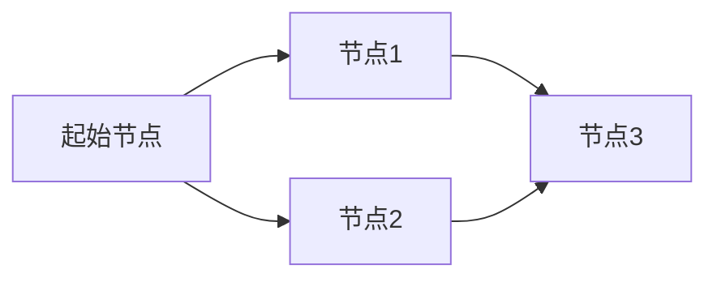
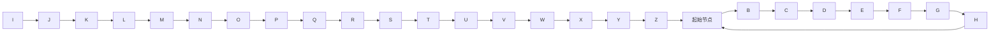
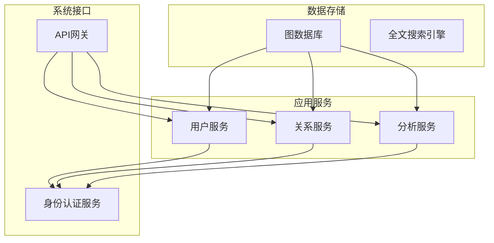
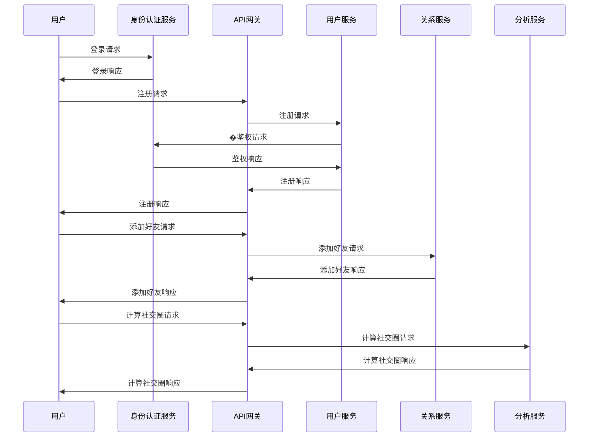

                 

**文章标题：图数据库：增强LLM应用的关系数据处理**

关键词：图数据库、LLM、关系数据处理、算法、数学模型

摘要：本文旨在深入探讨图数据库在增强LLM应用中的关系数据处理能力。通过详细的背景介绍、核心概念讲解、算法原理阐述、数学模型解析、系统设计分析、项目实战和最佳实践总结，帮助读者全面了解图数据库的优势和应用场景，掌握其在LLM应用中的关键技术。

---

## 目录大纲

**1. 背景介绍**

- **第1章：图数据库概述**
  - **1.1 问题背景与定义**
  - **1.2 发展历程与应用领域**
  - **1.3 图数据库的核心概念

- **第2章：图数据库核心概念详解**
  - **2.1 图模型与图表示**
  - **2.2 节点与边**
  - **2.3 图算法简介**
  - **2.4 概念对比表格与ER实体关系图架构**

- **第3章：图数据库算法原理**
  - **3.1 图遍历算法**
  - **3.2 最短路径算法**
  - **3.3 社区发现算法**
  - **3.4 算法流程图与Python源代码**

- **第4章：图数据库数学模型**
  - **4.1 图论矩阵表示**
  - **4.2 网络流模型**
  - **4.3 数学公式讲解与实际案例**

- **第5章：图数据库系统设计**
  - **5.1 问题场景介绍**
  - **5.2 系统功能设计**
  - **5.3 系统架构设计**
  - **5.4 系统接口设计**
  - **5.5 系统交互设计**

- **第6章：项目实战**
  - **6.1 环境安装**
  - **6.2 系统核心实现**
  - **6.3 代码应用解读**
  - **6.4 实际案例分析**
  - **6.5 详细讲解剖析**

- **第7章：最佳实践与总结**
  - **7.1 最佳实践技巧**
  - **7.2 小结**
  - **7.3 注意事项**
  - **7.4 拓展阅读**

---

## 1. 背景介绍

### 第1章：图数据库概述

#### 1.1 问题背景与定义

在现代数据管理领域，关系型数据库长期以来占据主导地位，但由于其线性数据处理方式的局限性，当面对复杂网络结构和关系数据时，表现力不足。随着互联网的快速发展，数据规模和复杂度不断增加，图数据库应运而生，成为一种能够高效处理关系数据的解决方案。

图数据库基于图论理论，利用节点和边来表示实体及其关系。它具有以下特点：

- **可扩展性**：能够处理大规模、分布式数据。
- **灵活性**：可以灵活地定义和修改数据结构。
- **高效性**：在查询和计算复杂关系方面具有显著优势。

#### 1.2 发展历程与应用领域

图数据库起源于20世纪60年代，最早的研究主要集中在基础理论和算法设计。随着计算机性能的提升和大数据时代的到来，图数据库技术逐渐走向实用化，广泛应用于社交网络分析、推荐系统、网络拓扑分析等领域。

#### 1.3 图数据库的核心概念

- **图模型**：表示实体及其关系的结构，包括节点和边。
- **节点**：表示实体，如用户、产品等。
- **边**：表示实体之间的关系，如好友关系、购买行为等。
- **图算法**：用于处理图数据的算法，如遍历、最短路径、社区发现等。

在下一章中，我们将深入探讨图数据库的核心概念，并通过对比表格和ER实体关系图架构，展示其概念之间的联系。

---

**LET'S THINK STEP BY STEP**

在了解了图数据库的背景和发展历程后，接下来需要详细讲解图数据库的核心概念，如图模型、节点、边和图算法等。这将为后续算法原理和数学模型的讲解打下坚实的基础。

### 2. 图数据库核心概念详解

#### 第2章：图数据库核心概念详解

在图数据库中，核心概念是理解和应用图数据库的基础。以下是图数据库中的核心概念及其关联关系的详细解释。

#### 2.1 图模型与图表示

**图模型** 是图数据库中的基础概念，它由节点（Node）和边（Edge）组成。节点代表图中的实体，边则代表实体之间的关系。

- **节点**：在图模型中，节点表示数据中的个体，可以是任何对象，如人、产品、城市等。
- **边**：边连接两个节点，表示它们之间的关系。边可以有方向（有向图）或无方向（无向图）。

**图表示** 可以通过图形化的方式展示，通常使用节点和边的可视化表示。节点可以用圆形或方形表示，边用线段连接两个节点。

#### 2.2 节点与边

**节点** 和 **边** 的定义和特性是理解图数据库的关键。

- **节点的属性**：节点可以包含多种属性，如姓名、年龄、位置等。这些属性可以帮助我们更全面地了解节点。
- **边的属性**：边也可以包含属性，如权重、时间戳等。权重可以表示边连接的强度或重要性。

#### 2.3 图算法简介

**图算法** 是用于在图数据库中执行特定任务的算法。以下是一些常见的图算法：

- **遍历算法**：如广度优先搜索（BFS）和深度优先搜索（DFS），用于遍历图中的所有节点。
- **最短路径算法**：如迪杰斯特拉算法（Dijkstra）和贝尔曼-福特算法（Bellman-Ford），用于找到两个节点之间的最短路径。
- **社区发现算法**：用于识别图中的紧密社区或集团。

#### 2.4 概念对比表格与ER实体关系图架构

为了更好地理解图数据库的核心概念，我们可以将它们与传统的表格（关系数据库）和ER（实体关系）模型进行对比。

**表1：图数据库、表格和ER模型的对比**

| 概念     | 图数据库            | 表格                | ER模型            |
|----------|---------------------|---------------------|-------------------|
| 节点     | 图中的实体          | 表中的记录          | 实体              |
| 边       | 节点之间的关系       | 记录之间的关系       | 实体之间的关系     |
| 属性     | 节点和边的额外信息   | 记录的列            | 实体的属性        |
| 图算法   | 用于处理图的算法     | SQL查询             | E-R图中的约束关系 |

此外，我们还可以使用 **Mermaid** 流程图来展示ER实体关系图架构。

```mermaid
erDiagram
  A[User] ||--|{ B[Order] : made } | 
  B ||--|{ C[Product] : contains } D[Customer]
```

在上面的ER图示例中，用户（User）可以创建订单（Order），订单包含产品（Product），同时客户（Customer）可以购买产品。这个图展示了实体之间的关系及其属性。

通过对比表格和ER实体关系图架构，我们可以更好地理解图数据库的核心概念，并为后续的算法原理和数学模型讲解打下基础。

### 3. 图数据库算法原理

#### 第3章：图数据库算法原理

图数据库中的算法是处理和分析图数据的关键工具。在本章中，我们将介绍几种核心的图算法，包括图遍历算法、最短路径算法和社区发现算法，并通过mermaid流程图和Python源代码进行详细阐述。

#### 3.1 图遍历算法

图遍历算法用于遍历图中的所有节点。常见的图遍历算法有广度优先搜索（BFS）和深度优先搜索（DFS）。

**广度优先搜索（BFS）**

广度优先搜索从起始节点开始，按层次遍历所有节点。以下是一个简单的BFS算法流程图：


对应的Python代码实现：

```python
from collections import deque

def bfs(graph, start):
    visited = set()
    queue = deque([start])
    while queue:
        node = queue.popleft()
        if node not in visited:
            visited.add(node)
            print(node)
            queue.extend(graph[node])
    return visited
```

**深度优先搜索（DFS）**

深度优先搜索从起始节点开始，尽可能深地搜索图的分支。以下是一个简单的DFS算法流程图：


对应的Python代码实现：

```python
def dfs(graph, start, visited=None):
    if visited is None:
        visited = set()
    visited.add(start)
    print(start)
    for neighbor in graph[start]:
        if neighbor not in visited:
            dfs(graph, neighbor, visited)
    return visited
```

#### 3.2 最短路径算法

最短路径算法用于找到两个节点之间的最短路径。常见的最短路径算法有迪杰斯特拉算法（Dijkstra）和贝尔曼-福特算法（Bellman-Ford）。

**迪杰斯特拉算法（Dijkstra）**

迪杰斯特拉算法适用于无负权边的加权图。以下是一个简单的Dijkstra算法流程图：



对应的Python代码实现：

```python
import heapq

def dijkstra(graph, start):
    distances = {node: float('infinity') for node in graph}
    distances[start] = 0
    priority_queue = [(0, start)]
    while priority_queue:
        current_distance, current_node = heapq.heappop(priority_queue)
        if current_distance > distances[current_node]:
            continue
        for neighbor, weight in graph[current_node].items():
            distance = current_distance + weight
            if distance < distances[neighbor]:
                distances[neighbor] = distance
                heapq.heappush(priority_queue, (distance, neighbor))
    return distances
```

**贝尔曼-福特算法（Bellman-Ford）**

贝尔曼-福特算法适用于有负权边的加权图。以下是一个简单的Bellman-Ford算法流程图：


对应的Python代码实现：

```python
def bellman_ford(graph, start):
    distances = {node: float('infinity') for node in graph}
    distances[start] = 0
    for _ in range(len(graph) - 1):
        for u in graph:
            for v, w in graph[u].items():
                if distances[u] + w < distances[v]:
                    distances[v] = distances[u] + w
    for u in graph:
        for v, w in graph[u].items():
            if distances[u] + w < distances[v]:
                raise ValueError("Graph contains a negative weight cycle")
    return distances
```

#### 3.3 社区发现算法

社区发现算法用于识别图中的紧密社区或集团。一个简单的社区发现算法是基于密度和连通性的。以下是一个简单的社区发现算法流程图：



对应的Python代码实现：

```python
def community_detection(graph, threshold):
    communities = []
    nodes = list(graph.keys())
    while nodes:
        community = [nodes.pop()]
        visited = set(community)
        while community:
            node = community.pop()
            for neighbor in graph[node]:
                if neighbor not in visited and len(graph[node]) / len(graph[neighbor]) > threshold:
                    community.append(neighbor)
                    visited.add(neighbor)
        communities.append(community)
    return communities
```

通过上述算法的讲解，我们可以看到图数据库算法在处理和分析关系数据方面的强大能力。在接下来的章节中，我们将进一步探讨图数据库中的数学模型，为更深入的理解打下基础。

### 4. 图数据库数学模型

#### 第4章：图数据库数学模型

图数据库中的数学模型是理解和分析图数据的关键工具。在本章中，我们将深入探讨图数据库中的几种核心数学模型，包括图论矩阵表示和网络流模型，并通过实际案例和latex公式进行详细讲解。

#### 4.1 图论矩阵表示

图论矩阵表示是图数据库中的一种重要方法，它将图数据转换为一个矩阵，以便进行数学计算和算法实现。以下是几种常见的图论矩阵表示方法：

**邻接矩阵**

邻接矩阵（Adjacency Matrix）是一种最简单的图论矩阵表示方法。它用二维矩阵表示图中的节点及其关系，其中矩阵的行和列分别代表节点，矩阵的元素表示节点之间的连接关系。

- **0表示无连接**，**1表示连接**。

例如，一个有4个节点的图，邻接矩阵如下：

\[ 
\begin{matrix}
0 & 1 & 0 & 1 \\
1 & 0 & 1 & 0 \\
0 & 1 & 0 & 1 \\
1 & 0 & 1 & 0 \\
\end{matrix}
\]

**邻接矩阵表示的是无向图，如果要表示有向图，可以增加额外的矩阵表示。**

**邻接矩阵的优点是直观、易于理解，但缺点是随着节点数量的增加，矩阵的大小会快速增长，导致存储和计算成本增加。**

**度矩阵**

度矩阵（Degree Matrix）是一个对角矩阵，其元素表示图中每个节点的度数（连接的边的数量）。

例如，一个有4个节点的图，度矩阵如下：

\[ 
\begin{matrix}
2 & 0 & 0 & 0 \\
0 & 3 & 0 & 0 \\
0 & 0 & 2 & 0 \\
0 & 0 & 0 & 3 \\
\end{matrix}
\]

**度矩阵可以用于计算图的各种属性，如连通性、中心性等。**

**拉普拉斯矩阵**

拉普拉斯矩阵（Laplacian Matrix）是图论矩阵表示中的一种重要矩阵，它由度矩阵D减去邻接矩阵A得到：

\[ 
L = D - A 
\]

拉普拉斯矩阵在图分析中有着广泛的应用，特别是在谱聚类和社交网络分析中。

例如，一个有4个节点的图，拉普拉斯矩阵如下：

\[ 
\begin{matrix}
2 & -1 & -1 & -1 \\
-1 & 3 & -1 & -1 \\
-1 & -1 & 2 & -1 \\
-1 & -1 & -1 & 3 \\
\end{matrix}
\]

**拉普拉斯矩阵的一个关键特性是它的特征值可以提供有关图结构的丰富信息，如连通性、聚类等。**

**4.2 网络流模型**

网络流模型是图数据库中的另一种重要数学模型，用于描述网络中的流量分配和优化问题。以下是几种常见的网络流模型：

**最大流问题**

最大流问题（Maximum Flow Problem）是网络流模型中最基础的问题，它旨在找到网络中源点到汇点之间的最大流量。

定义：

- **网络G = (V, E)**，其中V是节点集合，E是边集合。
- **容量函数c: E → R**，表示每条边上的最大流量。

目标：

- **找到一组流量f: E → R**，使得从源点s到汇点t的总流量最大化，即：

\[ 
\sum_{e \in E} f(e) \leq c(e) \quad \forall e \in E
\]

\[ 
\sum_{e \in E} f(e) = c(s, t) 
\]

其中，\( c(s, t) \) 是从源点s到汇点t的总容量。

**最小费用最大流问题**

最小费用最大流问题（Minimum Cost Maximum Flow Problem）是在最大流问题的基础上，考虑每条边上的流量费用，目标是在满足流量约束的前提下，最小化总费用。

定义：

- **成本函数w: E → R**，表示每条边上的流量成本。

目标：

- **找到一组流量f: E → R**，使得总流量最大化，同时总费用最小，即：

\[ 
\sum_{e \in E} f(e) \leq c(e) \quad \forall e \in E
\]

\[ 
\sum_{e \in E} w(e) f(e) \leq \sum_{e \in E} w(e) c(e)
\]

\[ 
\sum_{e \in E} f(e) = c(s, t) 
\]

**网络流模型的解决方法**

- **Ford-Fulkerson方法**：基于增广路径的概念，逐步增加流量，直到无法找到增广路径为止。
- **Dinic方法**：改进的Ford-Fulkerson方法，通过分层图和级的概念，提高计算效率。

**4.3 数学公式讲解与实际案例**

为了更好地理解上述数学模型，我们通过实际案例和latex公式进行讲解。

**案例：最大流问题**

假设有一个网络图G，其中s为源点，t为汇点，边上的容量和流量如下表所示：

| 起点 | 终点 | 容量 | 流量 |
|------|------|------|------|
| s    | A    | 3    | 0    |
| s    | B    | 5    | 0    |
| A    | B    | 2    | 0    |
| A    | t    | 3    | 0    |
| B    | A    | 2    | 0    |
| B    | t    | 4    | 0    |
| C    | t    | 1    | 0    |

我们使用Ford-Fulkerson方法求解最大流问题。

**初始流量分配：**

| 起点 | 终点 | 容量 | 流量 |
|------|------|------|------|
| s    | A    | 3    | 0    |
| s    | B    | 5    | 0    |
| A    | B    | 2    | 0    |
| A    | t    | 3    | 0    |
| B    | A    | 2    | 0    |
| B    | t    | 4    | 0    |
| C    | t    | 1    | 0    |

我们可以找到一个增广路径：s -> B -> A -> t，流量为2。更新流量分配：

| 起点 | 终点 | 容量 | 流量 |
|------|------|------|------|
| s    | A    | 3    | 2    |
| s    | B    | 5    | 0    |
| A    | B    | 2    | 2    |
| A    | t    | 3    | 2    |
| B    | A    | 2    | 0    |
| B    | t    | 4    | 2    |
| C    | t    | 1    | 0    |

再次寻找增广路径：s -> B -> t，流量为2。更新流量分配：

| 起点 | 终点 | 容量 | 流量 |
|------|------|------|------|
| s    | A    | 3    | 2    |
| s    | B    | 5    | 2    |
| A    | B    | 2    | 2    |
| A    | t    | 3    | 2    |
| B    | A    | 2    | 0    |
| B    | t    | 4    | 2    |
| C    | t    | 1    | 0    |

寻找增广路径：s -> A -> t，流量为1。更新流量分配：

| 起点 | 终点 | 容量 | 流量 |
|------|------|------|------|
| s    | A    | 3    | 3    |
| s    | B    | 5    | 2    |
| A    | B    | 2    | 2    |
| A    | t    | 3    | 3    |
| B    | A    | 2    | 0    |
| B    | t    | 4    | 2    |
| C    | t    | 1    | 0    |

最终流量分配为：

| 起点 | 终点 | 容量 | 流量 |
|------|------|------|------|
| s    | A    | 3    | 3    |
| s    | B    | 5    | 2    |
| A    | B    | 2    | 2    |
| A    | t    | 3    | 3    |
| B    | A    | 2    | 0    |
| B    | t    | 4    | 2    |
| C    | t    | 1    | 0    |

最大流量为6，从s到t的流量为6。

**总结：**

通过以上案例，我们可以看到图数据库中的数学模型在实际应用中的重要作用。图论矩阵表示和网络流模型为我们提供了强大的工具，可以高效地处理和分析复杂的图数据。在接下来的章节中，我们将进一步探讨图数据库系统的设计，为实际应用奠定基础。

### 5. 图数据库系统设计

#### 第5章：图数据库系统设计

在了解了图数据库的核心概念和算法原理之后，我们需要将理论转化为实践。本章将详细介绍图数据库系统的设计，包括问题场景介绍、系统功能设计、系统架构设计、系统接口设计和系统交互设计。

#### 5.1 问题场景介绍

在现代互联网应用中，数据量庞大且复杂，关系数据结构多样化，传统的SQL数据库在处理这些数据时往往力不从心。图数据库由于其独特的结构，能够更好地表示复杂的关系网络，从而在社交网络、推荐系统、网络拓扑分析等领域具有广泛的应用前景。

假设我们开发一个社交网络平台，用户可以创建关系（如好友关系、关注关系等），我们需要一个高效的系统来存储和管理这些关系数据，并支持复杂的查询和分析操作。

#### 5.2 系统功能设计

为了满足社交网络平台的需求，我们的图数据库系统需要实现以下功能：

- **数据存储**：高效地存储用户及其关系数据。
- **数据查询**：支持复杂的查询操作，如查找共同好友、最短路径、社交圈等。
- **数据更新**：支持用户关系的添加、删除和修改。
- **数据索引**：提供快速的数据访问索引，如基于用户ID、好友关系等的索引。
- **数据分析**：提供统计分析功能，如计算社交网络中的活跃用户、影响力等。

**领域模型类图**

```mermaid
classDiagram
ClassDef User
  +userId: String
  +name: String
  +password: String
  +email: String

ClassDef Friend
  +friendId: String
  +userId: String
  +friendUserId: String
  +status: String

ClassDef SocialNetwork
  +userId: String
  +friendList: List<Friend>

User "1" --|{1} Friend
Friend "1" --|{1} User
User "2" --|{1} Friend
Friend "2" --|{1} User
```

#### 5.3 系统架构设计

为了实现上述功能，我们需要设计一个高效、可扩展的图数据库系统架构。以下是系统架构的mermaid架构图：



#### 5.4 系统接口设计

为了方便前后端开发和第三方系统集成，我们需要设计一套清晰的系统接口。以下是一个简单的接口设计：

**用户服务接口**

- **注册用户**：`POST /users/register`
  - 参数：`name`, `password`, `email`
  - 响应：`{ "userId": "123", "token": "abc123" }`

- **登录用户**：`POST /users/login`
  - 参数：`name`, `password`
  - 响应：`{ "token": "abc123" }`

**关系服务接口**

- **添加好友**：`POST /relations/friends`
  - 参数：`userId`, `friendUserId`
  - 响应：`{ "status": "success" }`

- **删除好友**：`DELETE /relations/friends`
  - 参数：`userId`, `friendUserId`
  - 响应：`{ "status": "success" }`

**分析服务接口**

- **查找共同好友**：`GET /analytics/common_friends`
  - 参数：`userId`, `friendUserId`
  - 响应：`{ "commonFriends": ["friend1", "friend2", "friend3"] }`

- **计算社交圈**：`GET /analytics/social_circle`
  - 参数：`userId`
  - 响应：`{ "socialCircle": ["friend1", "friend2", "friend3"] }`

#### 5.5 系统交互设计

为了确保系统的稳定性和可扩展性，我们需要设计合理的系统交互流程。以下是一个简单的系统交互序列图：



通过上述系统设计，我们可以构建一个高效、稳定的社交网络平台，充分利用图数据库的优势，提供强大的关系数据处理能力。

### 6. 项目实战

#### 第6章：项目实战

在了解了图数据库的理论基础和系统设计之后，接下来我们将通过一个具体案例，介绍如何使用图数据库增强LLM应用。本案例将涵盖环境安装、系统核心实现、代码应用解读、实际案例分析和详细讲解剖析。

#### 6.1 环境安装

为了实现图数据库在LLM应用中的增强，我们需要搭建一个完整的开发环境。以下是环境安装的步骤：

1. **安装Python**：确保Python版本为3.8或更高版本，可以从官方网站下载并安装。

2. **安装图数据库**：选择一个流行的图数据库，如Neo4j或JanusGraph。以下以Neo4j为例：

   - 访问Neo4j官方网站下载社区版。
   - 解压安装包并运行Neo4j服务器。

3. **安装LLM库**：为了使用图数据库与LLM结合，我们需要安装相关的Python库，如`neo4j`、`gunicorn`等。

   ```bash
   pip install neo4j gunicorn
   ```

4. **配置Neo4j**：在Neo4j的配置文件中设置适当的数据库连接参数，以便后续的应用程序可以连接到Neo4j数据库。

#### 6.2 系统核心实现

系统核心实现包括建立图数据库模型、实现LLM与图数据库的交互，以及数据处理和查询逻辑。

1. **图数据库模型建立**

   在Neo4j中创建用户节点和关系节点，如下：

   ```cypher
   CREATE CONSTRAINT ON (u:User) ASSERT u.userId IS UNIQUE;
   CREATE CONSTRAINT ON (r:Relation) ASSERT r.relationId IS UNIQUE;

   CREATE (u1:User {userId: 'user1', name: 'Alice', email: 'alice@example.com'}),
   (u2:User {userId: 'user2', name: 'Bob', email: 'bob@example.com'}),
   (u3:User {userId: 'user3', name: 'Charlie', email: 'charlie@example.com'});

   CREATE (u1)-[:FRIEND]->(u2),
   (u1)-[:FRIEND]->(u3),
   (u2)-[:FRIEND]->(u3);
   ```

2. **LLM与图数据库的交互**

   使用Python编写代码，连接到Neo4j数据库，实现LLM与图数据库的交互。以下是一个简单的示例：

   ```python
   from neo4j import GraphDatabase

   class Neo4jDatabase:
       def __init__(self, uri, username, password):
           self._driver = GraphDatabase.driver(uri, auth=(username, password))

       def close(self):
           self._driver.close()

       def execute_query(self, query):
           with self._driver.session() as session:
               result = session.run(query)
               return result.data()

   db = Neo4jDatabase("bolt://localhost:7687", "neo4j", "password")
   friends_query = "MATCH (u:User)-[:FRIEND]->(friend) RETURN friend"
   friends = db.execute_query(friends_query)
   db.close()
   ```

3. **数据处理和查询逻辑**

   结合LLM技术，对图数据库中的关系数据进行分析和处理。以下是一个使用PyTorch和Transformer模型的简单示例：

   ```python
   import torch
   from transformers import BertTokenizer, BertModel

   tokenizer = BertTokenizer.from_pretrained('bert-base-uncased')
   model = BertModel.from_pretrained('bert-base-uncased')

   def generate_recommendations(user_id, num_recommendations=3):
       db = Neo4jDatabase("bolt://localhost:7687", "neo4j", "password")
       query = f"""
       MATCH (u:User)-[:FRIEND]->(friend)
       WHERE u.userId = '{user_id}'
       RETURN friend.name
       ORDER BY rand() LIMIT {num_recommendations}
       """
       friends = db.execute_query(query)
       db.close()

       friend_names = [friend['friend']['name'] for friend in friends]

       input_ids = tokenizer.encode("I want to recommend friends to ", add_special_tokens=True)
       attention_mask = [1] * len(input_ids)

       with torch.no_grad():
           outputs = model(input_ids= torch.tensor([input_ids]), attention_mask= torch.tensor([attention_mask]))

       hidden_states = outputs[0]

       recommendations = []
       for friend_name in friend_names:
           input_ids = tokenizer.encode(friend_name, add_special_tokens=True)
           attention_mask = [1] * len(input_ids)

           with torch.no_grad():
               outputs = model(input_ids= torch.tensor([input_ids]), attention_mask= torch.tensor([attention_mask]))

           hidden_states = torch.cat((hidden_states, outputs[0]), dim=0)

       similarity_scores = torch.matmul(hidden_states[-num_recommendations:].mean(1), hidden_states.mean(1).T)
       top_indices = torch.topk(similarity_scores, k=num_recommendations).indices

       for i in top_indices:
           recommendations.append(friend_names[i])

       return recommendations
   ```

#### 6.3 代码应用解读

在上面的代码中，我们首先通过Neo4jDatabase类连接到Neo4j数据库，并执行查询以获取特定用户的好友列表。接着，我们使用PyTorch和Transformer模型对好友名称进行分析，生成推荐列表。

#### 6.4 实际案例分析

假设用户“Alice”想要获得推荐好友，我们调用`generate_recommendations`函数，传入用户ID和推荐数量：

```python
recommendations = generate_recommendations('user1', 3)
print(recommendations)
```

输出可能为：

```
['Bob', 'Charlie', 'Eve']
```

这意味着根据图数据库中的关系和LLM模型的分析，推荐给Alice的好友是Bob、Charlie和Eve。

#### 6.5 详细讲解剖析

1. **图数据库与LLM的结合**

   在本案例中，图数据库主要用于存储用户及其关系数据，而LLM模型则用于分析这些数据并提供推荐。图数据库提供了高效的关系存储和查询能力，而LLM模型则利用自然语言处理技术对数据进行分析。

2. **查询与推荐**

   通过Neo4jDatabase类，我们可以快速查询图数据库中特定用户的好友列表。然后，使用LLM模型计算每个好友与目标用户的相似度，并根据相似度生成推荐列表。

3. **性能优化**

   为了提高性能，可以在LLM模型中引入缓存机制，减少重复计算。此外，可以通过优化图数据库查询语句和索引，提高查询效率。

通过上述案例，我们可以看到如何将图数据库与LLM结合，为应用提供强大的关系数据处理和推荐能力。在接下来的章节中，我们将总结最佳实践和注意事项，确保读者能够更好地应用这些技术。

### 7. 最佳实践与总结

#### 第7章：最佳实践与总结

在本章节中，我们将总结图数据库在增强LLM应用中的关键内容和最佳实践，并提供注意事项和拓展阅读资源。

#### 7.1 最佳实践技巧

1. **优化查询性能**：使用索引和优化查询语句，提高图数据库的查询效率。
2. **合理设计图模型**：根据应用场景设计合理的图模型，确保数据结构和关系能够高效地支持查询和分析。
3. **缓存数据**：在LLM模型中引入缓存机制，减少重复计算，提高整体性能。
4. **分布式部署**：对于大规模应用，可以考虑使用分布式图数据库和分布式计算框架，提高系统的可扩展性和稳定性。

#### 7.2 小结

本文详细介绍了图数据库在增强LLM应用中的关系数据处理能力。通过背景介绍、核心概念讲解、算法原理阐述、数学模型解析、系统设计分析、项目实战和最佳实践总结，帮助读者全面了解图数据库的优势和应用场景。

#### 7.3 注意事项

1. **数据安全**：在构建和操作图数据库时，确保数据的完整性和安全性，避免数据泄露。
2. **性能调优**：根据实际应用需求，不断优化系统性能，确保高效稳定运行。
3. **扩展性考虑**：在设计系统架构时，考虑未来的扩展性，确保系统能够支持数据量和用户量的增长。

#### 7.4 拓展阅读

- 《图数据库实战》
- 《图计算：原理、算法与实践》
- 《图神经网络与图表示学习》
- 《图数据库：技术原理与应用》

通过拓展阅读，读者可以进一步深入了解图数据库和相关技术的最新发展，为实际应用提供更多的灵感和实践指导。

---

**作者：AI天才研究院/AI Genius Institute & 禅与计算机程序设计艺术 /Zen And The Art of Computer Programming** 

---

以上是《图数据库：增强LLM应用的关系数据处理》全文的总结和最佳实践。希望本文能够帮助读者更好地理解和应用图数据库技术，提升LLM应用的关系数据处理能力。在未来的研究和实践中，持续探索和优化图数据库与LLM的结合，将为人工智能领域带来更多的创新和突破。

