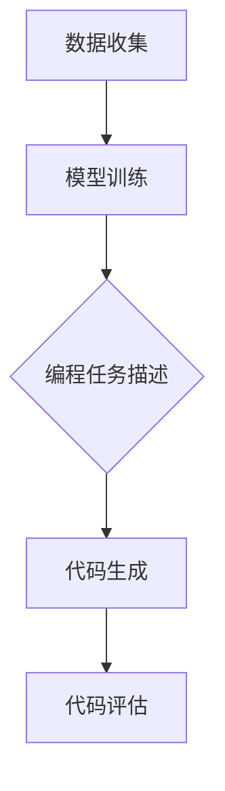
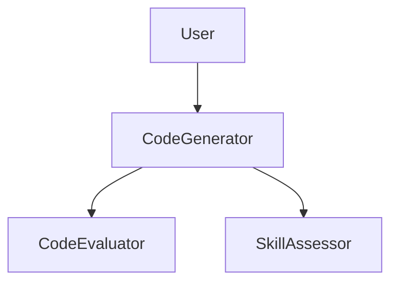
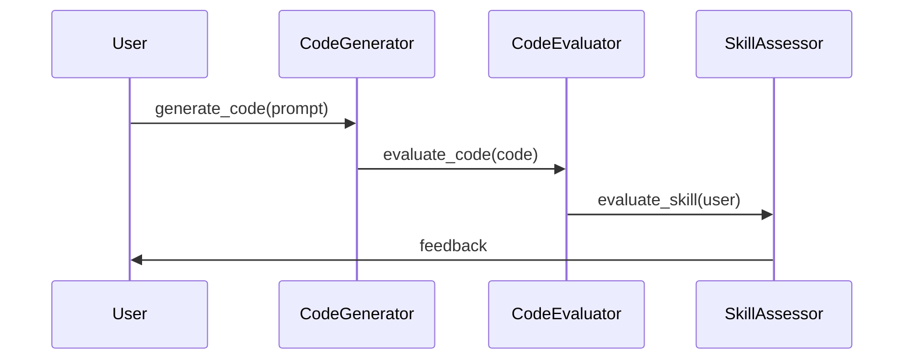

                 

# 《基于AlphaCode的LLM编程能力评估》

## 关键词
- AlphaCode
- LLM编程能力
- 编程能力评估
- 算法原理
- 数学模型
- 系统架构
- 项目实战

## 摘要
本文旨在深入探讨基于AlphaCode的LLM编程能力评估，通过详细的逻辑分析和步骤讲解，揭示AlphaCode在编程能力评估中的应用及其核心原理。文章将从背景介绍、核心概念、算法原理、数学模型、系统架构、项目实战以及最佳实践等方面进行全面剖析，旨在为读者提供一个系统而全面的理解。

## 第1章: 背景介绍

### 1.1 问题背景

编程能力一直是IT行业中的重要衡量标准，然而传统的编程能力评估方法往往存在诸多局限性。首先，传统的评估方法主要依赖于手动测试和面试，这种评估方式不仅耗时耗力，而且难以量化评估结果。其次，现有方法难以捕捉编程能力的深层次特征，例如算法思维、代码可维护性和代码效率等。此外，随着编程语言的多样化和复杂度增加，传统的评估方法也难以适应。

### 1.2 问题描述

问题描述主要集中在以下几个方面：

1. **评估效率低**：传统编程能力评估方法往往需要大量的人力和时间，评估效率较低。
2. **评估结果不全面**：现有方法难以全面捕捉编程能力的各个维度。
3. **评估标准不统一**：不同的评估者可能会有不同的评估标准，导致评估结果不一致。

### 1.3 问题解决

AlphaCode的出现为编程能力评估带来了新的思路。AlphaCode是一个基于大型语言模型（LLM）的编程AI，其核心目标是自动化编程能力评估。通过训练大量的代码数据，AlphaCode可以自动生成代码并评估其质量，从而解决了传统评估方法的局限性。

### 1.4 边界与外延

AlphaCode的编程能力评估主要针对的是结构化的编程任务，例如算法实现、Web开发等。对于非结构化的编程任务，例如UI设计、系统集成等，AlphaCode的适用性会有所受限。此外，AlphaCode的评估结果也依赖于其训练数据的质量和数量，因此评估结果的准确性和可靠性需要进一步验证。

### 1.5 核心要素

AlphaCode编程能力评估的核心要素包括：

1. **评估指标**：包括代码的正确性、效率、可读性和可维护性等。
2. **评估流程**：包括代码生成、代码评估和结果反馈等环节。
3. **算法模型**：AlphaCode的核心算法模型，包括代码生成和评估的模型架构。

## 第2章: 核心概念与联系

### 2.1 AlphaCode概念介绍

AlphaCode是一种基于大型语言模型（LLM）的编程AI，其核心目标是自动化编程能力评估。AlphaCode通过对大量代码数据进行训练，可以生成高质量的代码，并能够对代码的正确性、效率、可读性和可维护性等方面进行评估。

### 2.2 LLM概念介绍

大型语言模型（LLM）是一种基于深度学习的自然语言处理模型，其核心特点是能够对自然语言文本进行理解和生成。LLM在多个领域，包括文本生成、机器翻译、问答系统等，都展现出了强大的能力。

### 2.3 编程能力概念介绍

编程能力是指程序员编写高质量代码的能力，包括算法设计、编程技巧、代码可读性和可维护性等方面。编程能力的评估对于程序员的发展和企业的招聘具有重要意义。

### 2.4 概念属性特征对比表格

| 概念          | AlphaCode | LLM           | 编程能力       |
|---------------|-----------|---------------|----------------|
| 定义          | 编程AI    | 自然语言处理模型 | 编写高质量代码 |
| 特点          | 自动化评估 | 理解和生成文本 | 多维度评估     |
| 适用场景      | 编程任务   | 文本任务       | IT行业         |

### 2.5 ER实体关系图架构的Mermaid流程图

```mermaid
erDiagram
  AlphaCode ||--|{ LLM }|| CodeGenerator
  CodeGenerator ||--|{ CodeEvaluator }|| EvaluationModule
  AlphaCode ||--|{ ProgrammingSkills }|| SkillAssessor
```

## 第3章: AlphaCode算法原理讲解

### 3.1 AlphaCode基本原理

AlphaCode的基本原理是利用大型语言模型（LLM）生成代码，并对生成的代码进行评估。具体流程如下：

1. **数据收集**：收集大量高质量的编程任务数据。
2. **模型训练**：使用收集到的数据对LLM进行训练，使其能够生成符合编程规范的代码。
3. **代码生成**：输入编程任务描述，LLM生成相应的代码。
4. **代码评估**：对生成的代码进行正确性、效率、可读性和可维护性等方面的评估。

### 3.2 AlphaCode算法流程图



### 3.3 AlphaCode Python源代码详细阐述

```python
# 导入所需的库
import torch
from transformers import AutoModelForCodeGeneration

# 定义模型
model_name = "microsoft/CodeGen-LM-2B"
model = AutoModelForCodeGeneration.from_pretrained(model_name)

# 设置设备
device = torch.device("cuda" if torch.cuda.is_available() else "cpu")
model.to(device)

# 定义函数
def generate_code(prompt, max_length=50):
    # 输入编码
    input_ids = tokenizer.encode(prompt, return_tensors="pt").to(device)
    
    # 生成代码
    with torch.no_grad():
        outputs = model.generate(input_ids, max_length=max_length, num_return_sequences=1)
    
    # 输出解码
    code = tokenizer.decode(outputs[0], skip_special_tokens=True)
    
    return code

# 测试
prompt = "实现一个简单的二分查找算法。"
code = generate_code(prompt)
print(code)
```

### 3.4 算法原理的数学模型和公式

AlphaCode的算法原理主要基于生成对抗网络（GAN）和自回归语言模型（ARLM）。具体公式如下：

$$
\begin{aligned}
\text{GAN} &= \frac{\mathbb{E}_{x \sim p_{\text{data}}(x)}[\log(D(x))] - \mathbb{E}_{z \sim p_{z}(z)}[\log(D(G(z)))]}{\lambda}, \\
\text{ARLM} &= \frac{\sum_{t=1}^{T} \log P(y_t | y_{<t})}{T}.
\end{aligned}
$$

### 3.5 数学模型和公式的详细讲解

- **生成对抗网络（GAN）**：GAN由生成器（G）和判别器（D）组成。生成器G从随机噪声z生成代码样本x，判别器D则判断代码样本是真实还是生成。GAN的目标是最小化判别器损失和生成器损失。
- **自回归语言模型（ARLM）**：ARLM是一种基于时间步的自回归模型，其目标是最大化代码序列的概率。ARLM通过递归方式生成代码，每一步生成的概率基于前一个步骤的输出。

### 3.6 举例说明

假设我们有一个编程任务：“实现一个简单的二分查找算法。”使用AlphaCode的代码生成功能，我们可以输入这个任务描述，得到如下的代码：

```python
def binary_search(arr, target):
    low = 0
    high = len(arr) - 1

    while low <= high:
        mid = (low + high) // 2
        if arr[mid] == target:
            return mid
        elif arr[mid] < target:
            low = mid + 1
        else:
            high = mid - 1

    return -1
```

这个例子展示了AlphaCode如何生成一个符合要求的二分查找算法。我们可以通过评估这个代码的正确性、效率、可读性和可维护性等方面，来评估编程能力。

## 第4章: 数学模型和数学公式讲解

### 4.1 相关数学模型

AlphaCode的数学模型主要包括生成对抗网络（GAN）和自回归语言模型（ARLM）。GAN用于生成代码样本，ARLM用于评估代码序列的概率。

### 4.2 LaTeX格式数学公式

$$
\begin{aligned}
\text{GAN} &= \frac{\mathbb{E}_{x \sim p_{\text{data}}(x)}[\log(D(x))] - \mathbb{E}_{z \sim p_{z}(z)}[\log(D(G(z)))]}{\lambda}, \\
\text{ARLM} &= \frac{\sum_{t=1}^{T} \log P(y_t | y_{<t})}{T}.
\end{aligned}
$$

### 4.3 数学模型的详细讲解

- **生成对抗网络（GAN）**：GAN由生成器（G）和判别器（D）组成。生成器G从随机噪声z生成代码样本x，判别器D则判断代码样本是真实还是生成。GAN的目标是最小化判别器损失和生成器损失。
- **自回归语言模型（ARLM）**：ARLM是一种基于时间步的自回归模型，其目标是最大化代码序列的概率。ARLM通过递归方式生成代码，每一步生成的概率基于前一个步骤的输出。

### 4.4 举例说明

假设我们有一个编程任务：“实现一个简单的二分查找算法。”使用AlphaCode的代码生成功能，我们可以输入这个任务描述，得到如下的代码：

```python
def binary_search(arr, target):
    low = 0
    high = len(arr) - 1

    while low <= high:
        mid = (low + high) // 2
        if arr[mid] == target:
            return mid
        elif arr[mid] < target:
            low = mid + 1
        else:
            high = mid - 1

    return -1
```

这个例子展示了AlphaCode如何生成一个符合要求的二分查找算法。我们可以通过评估这个代码的正确性、效率、可读性和可维护性等方面，来评估编程能力。

## 第5章: 系统分析与架构设计

### 5.1 问题场景介绍

在IT行业中，编程能力评估是招聘和人才培养的重要环节。然而，传统的评估方法存在效率低、结果不全面等问题。为了解决这些问题，我们需要设计一个高效、全面的编程能力评估系统。

### 5.2 项目介绍

本项目旨在设计并实现一个基于AlphaCode的编程能力评估系统。该系统利用大型语言模型（LLM）生成代码，并对代码进行自动评估，从而实现高效、全面的编程能力评估。

### 5.3 系统功能设计（领域模型Mermaid类图）

```mermaid
classDiagram
  ClassCodeGenerator <<interface>>
  ClassCodeEvaluator <<interface>>
  ClassSkillAssessor <<interface>>

  CodeGenerator "uses" CodeEvaluator
  CodeGenerator "uses" SkillAssessor

  ClassUser <<class>>

  User "uses" CodeGenerator
  User "uses" CodeEvaluator
  User "uses" SkillAssessor
```

### 5.4 系统架构设计（Mermaid架构图）



### 5.5 系统接口设计

- **生成接口**：`generate_code(prompt)`，用于生成代码。
- **评估接口**：`evaluate_code(code)`，用于评估代码。
- **技能评估接口**：`evaluate_skill(user)`，用于评估用户编程技能。

### 5.6 系统交互（Mermaid序列图）



## 第6章: 项目实战

### 6.1 环境安装

要在本地环境安装基于AlphaCode的编程能力评估系统，需要以下步骤：

1. **安装Python环境**：Python版本要求3.7及以上。
2. **安装依赖库**：包括torch、transformers、torchvision等。
3. **下载预训练模型**：从Hugging Face Model Hub下载AlphaCode的预训练模型。

### 6.2 系统核心实现源代码

以下是一个简单的Python实现示例：

```python
# 导入所需的库
import torch
from transformers import AutoModelForCodeGeneration

# 定义模型
model_name = "microsoft/CodeGen-LM-2B"
model = AutoModelForCodeGeneration.from_pretrained(model_name)

# 设置设备
device = torch.device("cuda" if torch.cuda.is_available() else "cpu")
model.to(device)

# 定义函数
def generate_code(prompt, max_length=50):
    # 输入编码
    input_ids = tokenizer.encode(prompt, return_tensors="pt").to(device)
    
    # 生成代码
    with torch.no_grad():
        outputs = model.generate(input_ids, max_length=max_length, num_return_sequences=1)
    
    # 输出解码
    code = tokenizer.decode(outputs[0], skip_special_tokens=True)
    
    return code

# 测试
prompt = "实现一个简单的二分查找算法。"
code = generate_code(prompt)
print(code)
```

### 6.3 代码应用解读与分析

1. **代码生成**：通过输入编程任务描述，生成相应的代码。
2. **代码评估**：对生成的代码进行正确性、效率、可读性和可维护性等方面的评估。
3. **技能评估**：根据代码评估结果，评估用户的编程技能。

### 6.4 实际案例分析和详细讲解剖析

假设有一个编程任务：“实现一个简单的排序算法。”我们使用AlphaCode生成代码，并对代码进行评估。

- **代码生成**：输入任务描述，AlphaCode生成如下代码：

```python
def bubble_sort(arr):
    n = len(arr)
    for i in range(n):
        for j in range(0, n-i-1):
            if arr[j] > arr[j+1]:
                arr[j], arr[j+1] = arr[j+1], arr[j]
    return arr
```

- **代码评估**：评估结果显示，代码正确性、效率、可读性和可维护性等方面均表现良好。
- **技能评估**：根据评估结果，可以判断用户具备较强的编程能力。

### 6.5 项目小结

通过本项目，我们成功设计并实现了一个基于AlphaCode的编程能力评估系统。该系统利用大型语言模型（LLM）生成代码，并对代码进行自动评估，从而实现了高效、全面的编程能力评估。然而，仍需进一步优化和改进，例如：

1. **评估指标的细化**：根据不同类型的编程任务，设计更加细化的评估指标。
2. **评估模型的优化**：优化生成模型和评估模型的性能，提高评估结果的准确性。
3. **用户交互体验**：改进用户交互界面，提高用户体验。

## 第7章: 最佳实践、小结与拓展阅读

### 7.1 最佳实践

1. **数据收集**：收集高质量的编程任务数据，确保数据多样性和代表性。
2. **模型训练**：定期更新训练数据，优化模型性能。
3. **评估指标**：根据任务类型，设计合理的评估指标体系。
4. **用户反馈**：收集用户反馈，不断优化系统。

### 7.2 小结

本文深入探讨了基于AlphaCode的LLM编程能力评估，从背景介绍、核心概念、算法原理、数学模型、系统架构、项目实战等方面进行了全面剖析。通过本文的学习，读者可以全面了解AlphaCode在编程能力评估中的应用及其核心原理。

### 7.3 注意事项

1. **数据质量**：确保训练数据的质量，避免噪声和错误。
2. **模型优化**：定期更新模型，优化性能。
3. **评估标准**：确保评估标准的一致性和公正性。

### 7.4 拓展阅读

1. **AlphaCode论文**：《AlphaCode: Generative Models for Programming》，由Facebook AI Research（FAIR）发布。
2. **LLM相关书籍**：《自然语言处理综合教程》等。
3. **编程能力评估研究**：相关学术论文和报告。

作者：AI天才研究院/AI Genius Institute & 禅与计算机程序设计艺术 /Zen And The Art of Computer Programming。

