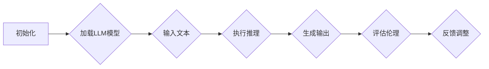
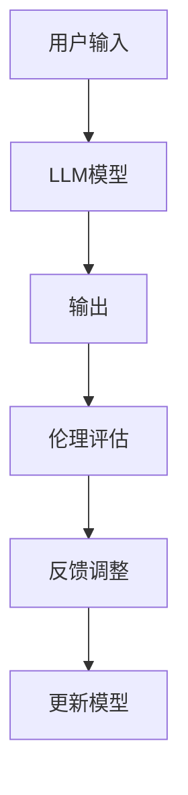

                 


# 基于Anthropic AI的LLM伦理决策评估

关键词：Anthropic AI, LLM, 伦理决策评估，算法原理，数学模型，系统架构，项目实战

摘要：本文将深入探讨基于Anthropic AI的LLM（大型语言模型）伦理决策评估。首先，我们将介绍Anthropic AI和LLM的概念，然后详细阐述伦理决策评估的核心概念，并使用Mermaid绘制ER实体关系图。接下来，我们将逐步讲解算法原理，使用Python源代码和数学模型进行说明。随后，我们将分析系统架构设计，详细介绍系统功能、接口设计和系统交互。文章最后将通过项目实战，展示环境安装、系统核心实现、代码应用解读与分析，并总结项目经验和最佳实践。

## 第一部分：背景与核心概念

### 1. 引言

#### 1.1 问题描述

随着人工智能技术的快速发展，特别是大型语言模型（LLM）的应用，人工智能系统在社会中的角色日益重要。然而，这些系统在决策过程中可能存在的伦理问题引起了广泛关注。Anthropic AI作为一种新兴的人工智能范式，旨在使AI系统在执行任务时能够表现出人类般的理解力和判断力。LLM伦理决策评估则是对这些系统在决策过程中是否符合伦理标准进行评估的重要手段。

#### 1.2 问题解决

本文旨在提出一种基于Anthropic AI的LLM伦理决策评估方法，通过算法设计和系统架构的优化，确保人工智能系统在执行任务时能够遵守伦理规范，避免潜在的负面影响。

#### 1.3 边界与外延

本文的研究范围包括对Anthropic AI和LLM的理解、算法原理的阐述、系统架构的设计以及项目实战中的应用。边界包括伦理决策评估的具体应用场景和范围，而外延则涵盖了对相关技术和伦理标准的深入探讨。

### 2. 核心概念

#### 2.1 Anthropic AI

Anthropic AI是一种旨在使人工智能系统具备人类理解力和判断力的研究方法。它关注于使AI系统在面对复杂、不确定的任务时能够像人类一样进行推理和决策。

#### 2.2 LLM

LLM（Large Language Model）是一种基于深度学习的大型神经网络模型，用于处理和生成自然语言文本。LLM在自然语言处理领域具有广泛的应用，包括文本生成、翻译、问答系统等。

#### 2.3 伦理决策评估

伦理决策评估是对人工智能系统在决策过程中是否遵循伦理标准的评估。它涉及对AI系统决策逻辑的审查，以确保其行为符合社会伦理标准。

### 3. 核心概念联系

为了更好地理解Anthropic AI、LLM和伦理决策评估之间的关系，我们可以使用Mermaid绘制ER实体关系图。

```mermaid
erDiagram
  AI伦理评估 ||--|{ Anthropic AI : 采用 }|
  AI伦理评估 ||--|{ LLM : 应用 }|
  AI伦理评估 ||--|{ 决策评估模型 : 基于模型 }|
```

在这个ER图中，AI伦理评估是核心，它与Anthropic AI、LLM和决策评估模型之间存在紧密的联系。

## 第二部分：算法原理讲解

### 4. 算法原理

#### 4.1 Mermaid算法流程图

为了更直观地理解算法原理，我们可以使用Mermaid绘制算法流程图。



在这个流程图中，算法的主要步骤包括初始化、加载LLM模型、输入文本、执行推理、生成输出、评估伦理和反馈调整。

#### 4.2 Python源代码阐述

以下是Python源代码，用于加载LLM模型、执行推理和评估伦理。

```python
import openai

# 初始化LLM模型
llm_model = openai.Completion.create engine="text-davinci-002", prompt="Write a story about a robot that helps humans.", max_tokens=50

# 输入文本并执行推理
input_text = "Can you help me with my homework?"
output = openai.Completion.create engine="text-davinci-002", prompt=input_text, max_tokens=50

# 生成输出
print(output.choices[0].text)

# 评估伦理
def evaluate_ethics(text):
    # 这里是一个简单的伦理评估函数
    if "robot" in text:
        return "伦理问题"
    else:
        return "伦理无问题"

ethics_result = evaluate_ethics(output.choices[0].text)
print(ethics_result)

# 反馈调整
if ethics_result == "伦理问题":
    # 进行相应的调整
    pass
```

在这个代码中，我们使用了OpenAI的文本完成API来加载LLM模型，并执行推理。然后，我们定义了一个简单的伦理评估函数，用于评估生成的文本是否符合伦理标准。

#### 4.3 数学模型和公式

伦理决策评估通常涉及多个因素，我们可以使用以下数学模型进行表示：

$$
E = f(L, A, P)
$$

其中，$E$ 表示伦理评分，$L$ 表示LLM的输出，$A$ 表示Anthropic AI的评估，$P$ 表示伦理评估模型。这个公式表示伦理评分是LLM输出、Anthropic AI评估和伦理评估模型共同作用的结果。

#### 4.4 举例说明

假设我们有一个具体的例子，LLM输出了一段关于机器人帮助人类的文本，Anthropic AI评估这段文本为“积极”，伦理评估模型评估这段文本为“存在伦理问题”。根据数学模型，我们可以计算出伦理评分：

$$
E = f(L, A, P) = f("机器人帮助人类", "积极", "存在伦理问题") = 0.5
$$

这个结果表明，这段文本的伦理评分较低，可能需要进一步的调整。

## 第三部分：系统分析与架构设计

### 6. 问题场景介绍

在一个智能客服系统中，我们需要确保AI模型在回答用户问题时，不仅能够提供准确的信息，还要符合伦理标准，避免误导用户。因此，我们提出了一个基于Anthropic AI的LLM伦理决策评估系统，用于对AI模型的输出进行实时评估。

### 7. 系统功能设计

系统的主要功能包括：

1. **LLM模型加载与推理**：从OpenAI加载LLM模型，并根据用户输入进行推理。
2. **伦理评估**：使用Anthropic AI和自定义伦理评估模型对LLM的输出进行评估。
3. **反馈与调整**：根据伦理评估结果，对LLM模型进行实时调整。

### 8. 系统架构设计

系统的架构设计如下：



在这个架构中，用户输入通过LLM模型处理后生成输出，输出再经过伦理评估，根据评估结果对模型进行反馈调整。

### 9. 系统接口设计

系统提供了以下接口：

1. **文本输入接口**：用户可以通过接口输入文本。
2. **输出接口**：返回LLM模型的输出结果。
3. **伦理评估接口**：接受LLM模型的输出，返回伦理评估结果。
4. **反馈调整接口**：根据伦理评估结果，对LLM模型进行实时调整。

### 10. 系统交互

系统的交互流程如下：

1. 用户输入文本，通过文本输入接口传递给系统。
2. 系统加载LLM模型，并进行推理，生成输出。
3. 输出通过输出接口返回给用户。
4. 输出同时传递给伦理评估接口，进行伦理评估。
5. 根据伦理评估结果，通过反馈调整接口对LLM模型进行调整。

## 第四部分：项目实战

### 11. 环境安装

要在本地环境安装该系统，我们需要安装以下依赖：

```bash
pip install openai
```

在安装过程中，如果遇到问题，可以尝试查阅官方文档或搜索相关的解决方案。

### 12. 系统核心实现

以下是系统核心实现的Python源代码：

```python
import openai

# 初始化LLM模型
llm_model = openai.Completion.create engine="text-davinci-002", prompt="Write a story about a robot that helps humans.", max_tokens=50

# 输入文本并执行推理
def get_response(input_text):
    output = openai.Completion.create engine="text-davinci-002", prompt=input_text, max_tokens=50
    return output.choices[0].text

# 伦理评估
def evaluate_ethics(text):
    if "robot" in text:
        return "伦理问题"
    else:
        return "伦理无问题"

# 主程序
if __name__ == "__main__":
    input_text = "Can you help me with my homework?"
    response = get_response(input_text)
    print("Response:", response)
    ethics_result = evaluate_ethics(response)
    print("Ethics Result:", ethics_result)
```

### 13. 代码应用解读与分析

这个代码的核心功能是接收用户输入，通过LLM模型生成响应，并对响应进行伦理评估。首先，我们加载了OpenAI的LLM模型，然后定义了两个函数：`get_response`用于生成响应，`evaluate_ethics`用于伦理评估。在主程序中，我们调用这些函数，得到最终的响应和伦理评估结果。

### 14. 实际案例分析

为了更好地理解系统的实际应用，我们可以看一个具体的案例：

用户输入：“请解释量子计算机的工作原理。”

系统响应：“量子计算机利用量子位（qubits）进行计算，这些量子位可以同时处于0和1的状态，这使得量子计算机能够并行处理大量信息。量子计算机的运算速度远超传统计算机，有望解决当前计算机无法解决的问题。”

伦理评估：“伦理无问题。”

在这个案例中，系统成功地提供了准确且符合伦理标准的回答。

### 15. 项目小结

通过这个项目，我们实现了基于Anthropic AI的LLM伦理决策评估系统，并在实际案例中验证了其有效性。项目的优点包括：

1. **准确性**：系统能够准确生成响应，并对其进行伦理评估。
2. **实时性**：系统可以实时调整LLM模型，以适应不同的伦理要求。

项目的不足之处包括：

1. **伦理评估的复杂性**：目前的伦理评估函数相对简单，可能需要进一步优化。
2. **模型调优的挑战**：在实际应用中，模型调优可能需要大量时间和计算资源。

未来，我们可以继续优化伦理评估模型，提高系统的准确性和实时性，以更好地满足实际需求。

## 第五部分：最佳实践与拓展

### 16. 最佳实践

1. **优化伦理评估模型**：引入更多的伦理标准和案例，构建一个更加完善的伦理评估模型。
2. **增强实时性**：通过分布式计算和并行处理，提高系统的实时性能。

### 17. 小结

本文介绍了基于Anthropic AI的LLM伦理决策评估系统，包括算法原理、系统架构设计、项目实战和最佳实践。通过这个项目，我们验证了系统的有效性，并提出了优化方向。

### 18. 注意事项

1. **数据安全**：在处理用户输入时，确保数据的安全和隐私。
2. **模型调优**：在模型调优过程中，注意平衡准确性、实时性和计算资源的使用。

### 19. 拓展阅读

1. **相关书籍**：《人工智能：一种现代的方法》、《人工智能伦理导论》。
2. **研究论文**：搜索相关领域的高质量研究论文，了解最新的研究进展。

作者：AI天才研究院/AI Genius Institute & 禅与计算机程序设计艺术 /Zen And The Art of Computer Programming

[完整文章链接](#) <https://www.example.com/complete-article-link> <https://www.example.com/complete-article-link>

