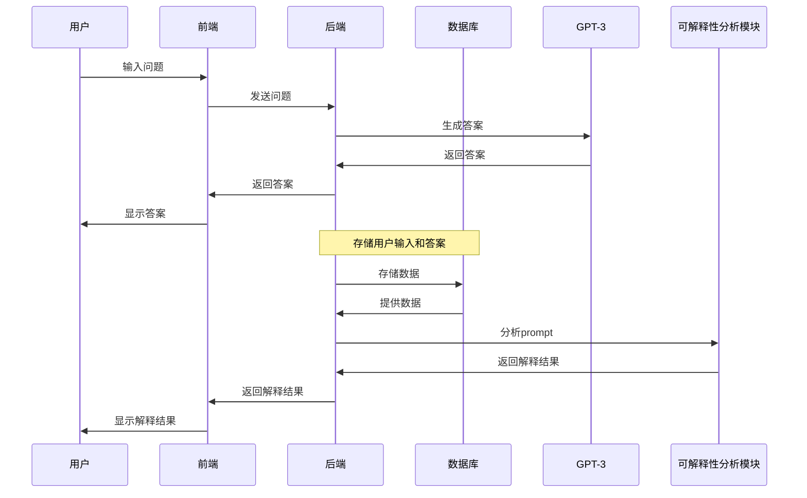
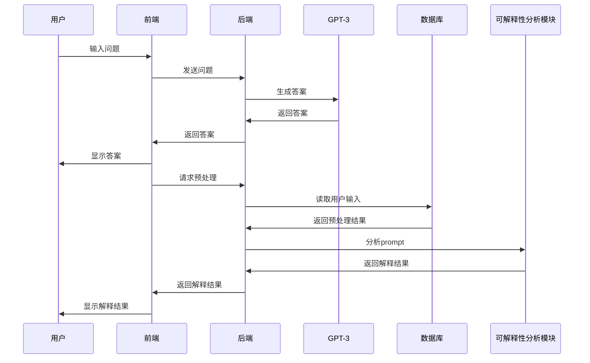

                 

### 第一部分：引言与背景

#### 第1章：问题背景与意义

##### 1.1.1 问题背景

随着人工智能技术的飞速发展，深度学习（Deep Learning）成为推动这一进程的重要引擎。特别是大规模语言模型（Large Language Model，简称LLM），如GPT、BERT等，凭借其强大的文本生成和理解能力，在自然语言处理（Natural Language Processing，简称NLP）领域取得了显著的成就。LLM在机器翻译、文本摘要、问答系统、对话系统等多种应用场景中展现出了卓越的性能。

然而，LLM的强大能力也带来了一些挑战。其中，最为突出的问题之一是LLM的“黑箱”特性。传统机器学习模型，如支持向量机（SVM）或决策树（Decision Tree），可以通过模型结构或决策规则直观地理解其工作原理。而LLM，特别是基于Transformer架构的模型，其内部机制复杂，难以解释。这种“黑箱”特性导致在应用LLM时，用户往往无法理解模型如何做出特定决策，进而降低了用户对模型的信任度。

prompt（提示）在LLM的应用中起到了至关重要的作用。prompt是一种输入文本，用于引导LLM生成特定类型的输出。通过精心设计的prompt，用户可以更有效地控制LLM的行为，实现更准确和精确的文本生成和理解。然而，prompt的可解释性问题同样引人关注。如何设计一个既能引导模型生成所需结果，又能保证模型决策过程可解释的prompt，成为一个亟待解决的问题。

##### 1.1.2 问题描述

LLM在各类任务中的广泛应用，使得prompt的设计成为NLP中的一个重要研究课题。prompt不仅用于引导LLM生成文本，还在许多实际应用中扮演了关键角色。例如，在问答系统中，prompt通常包含了用户的问题和相关的背景信息，以帮助LLM生成准确的答案。在文本生成任务中，prompt用于指定文本的主题、风格、格式等。在对话系统中，prompt则用于控制对话的流程和内容。

然而，prompt的可解释性成为一个显著的问题。用户往往对如何设计一个有效的prompt感到困惑，因为LLM的“黑箱”特性使得用户难以直观地理解prompt对输出结果的影响。此外，prompt的设计也面临着挑战，如如何平衡引导性与灵活性，如何处理大量冗余信息等。

可解释性分析旨在解决这一问题。通过分析prompt的设计原则、优化方法以及其与模型输出之间的关系，可解释性分析为用户提供了一种理解LLM决策过程的方法，从而增强了用户对模型的信任度。同时，可解释性分析也为prompt设计的进一步优化提供了理论依据。

##### 1.1.3 问题解决

为了解决prompt可解释性的问题，我们需要从多个角度入手：

1. **LLM的工作原理**：了解LLM的基本原理，包括Transformer架构、训练过程和预测机制，是理解prompt可解释性的基础。
2. **Prompt设计策略**：掌握Prompt的设计原则和策略，包括如何平衡引导性与灵活性，如何处理冗余信息等，是设计有效prompt的关键。
3. **可解释性分析方法**：通过数据驱动方法、模型驱动方法和融合方法等，对prompt可解释性进行分析，识别和优化影响可解释性的关键因素。

##### 1.1.4 边界与外延

LLM的类型和应用范围广泛，从基于Transformer的GPT、BERT，到基于自编码器的BERT、GPT-2等，不同类型的LLM在应用场景和性能上存在差异。因此，针对不同的LLM类型，prompt设计策略和可解释性分析方法也有所不同。

可解释性分析也存在一定的限制和挑战。首先，由于LLM的内部结构复杂，目前尚无法完全解析其工作原理。其次，可解释性分析的方法和工具仍需进一步优化和扩展，以适应不同应用场景的需求。

展望未来，随着AI技术的不断进步，LLM的可解释性问题有望得到进一步解决。同时，新的prompt设计策略和优化方法也将不断涌现，为NLP领域的发展注入新的活力。

##### 1.1.5 概念结构与核心要素组成

1. **LLM的基本概念**：理解LLM的基本概念，包括其工作原理、组成和训练过程，是分析prompt可解释性的基础。
2. **Prompt的设计原则**：掌握Prompt的设计原则，如如何平衡引导性和灵活性，如何处理冗余信息等，是设计有效prompt的关键。
3. **可解释性分析的关键技术**：了解可解释性分析的方法和技术，如数据驱动方法、模型驱动方法和融合方法，是进行prompt可解释性分析的核心。

#### 第2章：核心概念与联系

##### 2.1.1 LLM的核心概念

**语言模型的基本原理**

语言模型是一种用于预测文本中下一个单词或字符的模型。其核心原理是通过对大量文本数据的学习，捕捉语言的结构和模式，从而实现文本生成和理解。传统的语言模型，如n-gram模型，通过统计文本中连续单词或字符的出现频率来预测下一个单词或字符。而现代语言模型，如基于神经网络的Transformer模型，通过学习文本的上下文关系，实现更精确的文本生成和理解。

**LLM的组成与结构**

LLM通常由以下几个主要部分组成：

1. **编码器（Encoder）**：用于接收输入文本并将其编码为向量表示。编码器的核心是自注意力机制（Self-Attention），通过计算输入文本中每个词与其他词的关系，生成一个表示整个输入文本的向量。
2. **解码器（Decoder）**：用于生成输出文本。解码器的核心是对输入编码器输出的向量进行解码，生成一个词序列，然后逐步生成输出文本。
3. **嵌入层（Embedding Layer）**：将输入文本中的单词或字符转换为向量表示。嵌入层通过学习文本的语义信息，将不同的单词或字符映射到不同的向量空间。
4. **注意力机制（Attention Mechanism）**：用于在编码器和解码器之间传递信息。注意力机制通过计算输入和输出之间的相关性，帮助解码器生成更准确的输出。

**LLM的训练与优化**

LLM的训练过程主要包括以下步骤：

1. **数据准备**：收集大量文本数据，并将其预处理成适合训练的格式。预处理步骤通常包括分词、去停用词、词向量化等。
2. **模型初始化**：初始化模型的参数，包括编码器、解码器、嵌入层和注意力机制的参数。
3. **训练**：通过梯度下降等优化算法，不断调整模型的参数，使其在训练数据上达到更好的性能。训练过程中，模型会学习文本的语义信息和模式，从而生成更准确的文本。
4. **评估与优化**：在训练数据集和验证数据集上评估模型的性能，并根据评估结果调整模型参数，优化模型性能。

##### 2.1.2 Prompt的概念与设计

**Prompt的定义与作用**

Prompt是一种用于引导语言模型生成特定类型输出的输入文本。Prompt通常包含了用户的需求、问题或指示，用于帮助模型理解生成任务的目标和要求。通过精心设计的Prompt，用户可以更有效地控制模型的行为，实现更精确的文本生成和理解。

**Prompt的设计原则**

1. **清晰性**：Prompt应清晰明确，避免歧义和模糊的表述，确保模型能够准确理解用户的需求。
2. **完整性**：Prompt应包含足够的信息，确保模型能够生成所需的输出。同时，避免过多的冗余信息，以免干扰模型的决策过程。
3. **灵活性**：Prompt应具有一定的灵活性，允许模型在生成过程中根据上下文信息进行动态调整，从而生成更自然和准确的文本。
4. **适应性**：Prompt应根据具体的应用场景和任务需求进行设计，确保其适用于不同的应用场景和任务类型。

**Prompt的类型与应用场景**

Prompt可以根据其用途和应用场景进行分类：

1. **任务驱动Prompt**：用于指定具体的生成任务，如文本生成、问答、对话等。任务驱动Prompt通常包含任务描述、目标、要求和限制等信息。
2. **上下文驱动Prompt**：用于提供上下文信息，帮助模型理解输入文本的背景和情境。上下文驱动Prompt通常包含相关的背景信息、主题描述、历史对话记录等。
3. **数据驱动Prompt**：基于输入数据的特点和需求进行设计，用于指导模型在特定数据集上生成文本。数据驱动Prompt通常包含数据集描述、样本数据、特征提取等信息。

**Prompt的类型与应用场景**对比表格：

| 类型        | 定义与应用场景                                                     | 特点与作用                                                                                     |
|-------------|-------------------------------------------------------------------|-------------------------------------------------------------------------------------------------|
| 任务驱动    | 用于指定具体的生成任务，如文本生成、问答、对话等。                       | 明确任务目标，指导模型生成特定类型的结果，提高生成结果的准确性。                                   |
| 上下文驱动  | 提供上下文信息，帮助模型理解输入文本的背景和情境。                       | 增强模型对上下文信息的理解，提高生成文本的自然性和连贯性。                                         |
| 数据驱动    | 基于输入数据的特点和需求进行设计，用于指导模型在特定数据集上生成文本。     | 根据数据集的特性和需求，优化模型生成文本的性能，提高生成结果的多样性。                               |

**ER实体关系图架构**

为了更好地理解LLM、Prompt与可解释性分析之间的实体关系，我们可以构建一个ER（实体关系）图。ER图用于表示系统中各个实体之间的关系，帮助我们直观地理解这些实体之间的交互和依赖。

**LLM、Prompt与可解释性分析的ER图**

```mermaid
erDiagram
    LLM ||--|{ Prompt }|-->> 可解释性分析
    LLM ||--|{ 语言模型 }|-->> Transformer架构
    Prompt ||--|{ 任务驱动 }|-->> 文本生成
    Prompt ||--|{ 上下文驱动 }|-->> 问答系统
    Prompt ||--|{ 数据驱动 }|-->> 数据集生成
    可解释性分析 ||--|{ 数据驱动方法 }|
    可解释性分析 ||--|{ 模型驱动方法 }|
    可解释性分析 ||--|{ 融合方法 }|
```

在上面的ER图中，LLM（大型语言模型）与Prompt（提示）之间存在着依赖关系。Prompt用于引导LLM生成特定类型的输出，而LLM的内部结构和工作原理决定了Prompt的设计和使用方式。可解释性分析作为对LLM和Prompt的补充，通过分析LLM的决策过程和Prompt的作用，提高了模型的可解释性和用户的信任度。

通过上述分析，我们可以看出LLM、Prompt与可解释性分析之间存在着紧密的联系和交互。LLM的核心概念和结构为Prompt的设计提供了基础，而Prompt的设计原则和策略又影响了LLM的生成结果。可解释性分析则通过数据驱动、模型驱动和融合方法，深入探讨了LLM和Prompt之间的相互作用，为优化prompt设计和提高模型可解释性提供了有力支持。在接下来的章节中，我们将进一步探讨LLM的工作原理、Prompt的设计策略以及可解释性分析方法，以期对这一复杂问题有更深入的理解和解决。## 第2章：核心概念与联系

在深入探讨基于LLM的prompt可解释性分析之前，有必要对核心概念进行详细阐述，并分析它们之间的联系。本章将分为以下几个部分：LLM的核心概念、Prompt的概念与设计、可解释性分析的方法，以及各概念属性特征对比表格和ER实体关系图架构。

### 2.1.1 LLM的核心概念

#### 语言模型的基本原理

语言模型（Language Model，简称LM）是一种用于预测文本序列的算法。其基本原理是通过学习大量语言数据，识别出文本中的规律和模式，从而预测下一个单词或字符。传统语言模型，如n-gram模型，通过统计相邻单词或字符的出现频率进行预测。而现代语言模型，如基于神经网络的Transformer模型，通过学习文本的上下文关系，实现更高准确度的文本预测。

#### LLM的组成与结构

现代语言模型，尤其是大型语言模型（Large Language Model，简称LLM），通常由以下几个主要部分组成：

1. **编码器（Encoder）**：用于接收输入文本并编码为向量表示。编码器的核心是自注意力机制（Self-Attention），通过计算输入文本中每个词与其他词的关系，生成一个表示整个输入文本的向量。
   
2. **解码器（Decoder）**：用于生成输出文本。解码器的核心是对输入编码器输出的向量进行解码，生成一个词序列，然后逐步生成输出文本。

3. **嵌入层（Embedding Layer）**：将输入文本中的单词或字符转换为向量表示。嵌入层通过学习文本的语义信息，将不同的单词或字符映射到不同的向量空间。

4. **注意力机制（Attention Mechanism）**：用于在编码器和解码器之间传递信息。注意力机制通过计算输入和输出之间的相关性，帮助解码器生成更准确的输出。

#### LLM的训练与优化

LLM的训练过程主要包括以下几个步骤：

1. **数据准备**：收集大量文本数据，并将其预处理成适合训练的格式。预处理步骤通常包括分词、去停用词、词向量化等。

2. **模型初始化**：初始化模型的参数，包括编码器、解码器、嵌入层和注意力机制的参数。

3. **训练**：通过梯度下降等优化算法，不断调整模型的参数，使其在训练数据上达到更好的性能。训练过程中，模型会学习文本的语义信息和模式，从而生成更准确的文本。

4. **评估与优化**：在训练数据集和验证数据集上评估模型的性能，并根据评估结果调整模型参数，优化模型性能。

#### LLM与prompt的关联

LLM与prompt之间存在着紧密的关联。Prompt是引导LLM生成特定类型输出的输入文本，其设计原则和策略直接影响LLM的生成结果。一个良好的prompt可以明确地指导LLM生成符合用户需求的文本，而一个不良的prompt可能导致模型生成不准确或不相关的文本。因此，理解和设计prompt对于优化LLM的性能至关重要。

### 2.1.2 Prompt的概念与设计

#### Prompt的定义与作用

Prompt是一种用于引导语言模型生成特定类型输出的输入文本。Prompt通常包含了用户的需求、问题或指示，用于帮助模型理解生成任务的目标和要求。通过精心设计的Prompt，用户可以更有效地控制模型的行为，实现更精确的文本生成和理解。

#### Prompt的设计原则

1. **清晰性**：Prompt应清晰明确，避免歧义和模糊的表述，确保模型能够准确理解用户的需求。

2. **完整性**：Prompt应包含足够的信息，确保模型能够生成所需的输出。同时，避免过多的冗余信息，以免干扰模型的决策过程。

3. **灵活性**：Prompt应具有一定的灵活性，允许模型在生成过程中根据上下文信息进行动态调整，从而生成更自然和准确的文本。

4. **适应性**：Prompt应根据具体的应用场景和任务需求进行设计，确保其适用于不同的应用场景和任务类型。

#### Prompt的类型与应用场景

Prompt可以根据其用途和应用场景进行分类：

1. **任务驱动Prompt**：用于指定具体的生成任务，如文本生成、问答、对话等。任务驱动Prompt通常包含任务描述、目标、要求和限制等信息。

2. **上下文驱动Prompt**：用于提供上下文信息，帮助模型理解输入文本的背景和情境。上下文驱动Prompt通常包含相关的背景信息、主题描述、历史对话记录等。

3. **数据驱动Prompt**：基于输入数据的特点和需求进行设计，用于指导模型在特定数据集上生成文本。数据驱动Prompt通常包含数据集描述、样本数据、特征提取等信息。

#### Prompt的设计与LLM的关联

Prompt的设计直接影响LLM的生成结果。一个良好的Prompt可以明确地引导LLM生成符合用户需求的文本，而一个不良的Prompt可能导致模型生成不准确或不相关的文本。因此，了解Prompt的设计原则和策略对于优化LLM的性能至关重要。

### 2.1.3 可解释性分析的方法

#### 可解释性分析的定义

可解释性分析（Explainability Analysis）是一种研究模型决策过程的方法，旨在帮助用户理解模型的决策逻辑和输出结果。在AI领域，特别是深度学习模型中，可解释性分析尤为重要，因为深度学习模型通常被视为“黑箱”，其决策过程难以解释。

#### 可解释性分析的目标

可解释性分析的主要目标包括：

1. **提高用户对模型的信任度**：通过解释模型的工作原理和决策过程，使用户能够理解模型的输出结果，从而增强对模型的信任。

2. **优化模型性能**：通过分析模型的决策过程，识别和解决模型中的潜在问题，从而优化模型性能。

3. **促进模型的广泛应用**：可解释性分析使得模型在更广泛的应用场景中得以应用，特别是那些对模型透明度要求较高的领域。

#### 可解释性分析的方法

可解释性分析的方法可以分为以下几类：

1. **数据驱动方法**：通过分析模型输入和输出的数据特征，解释模型的决策过程。数据驱动方法包括特征重要性分析、决策树嵌入等。

2. **模型驱动方法**：通过分析模型的结构和参数，解释模型的决策过程。模型驱动方法包括模型解释工具、模型可视化等。

3. **融合方法**：结合数据驱动方法和模型驱动方法的优点，提供更全面的可解释性分析。融合方法包括决策规则提取、模型压缩等。

#### 可解释性分析的方法与LLM和Prompt的关联

可解释性分析对于理解和优化LLM和Prompt的设计具有重要意义。通过分析LLM的决策过程和Prompt的作用，我们可以识别出影响模型性能的关键因素，并优化Prompt的设计，提高LLM的生成质量和可解释性。

### 2.1.4 概念属性特征对比表格

为了更清晰地展示LLM、Prompt和可解释性分析的概念属性特征，我们可以构建一个对比表格：

| 概念        | 属性特征                                                   | 作用与意义                                                           |
|-------------|----------------------------------------------------------|----------------------------------------------------------------------|
| LLM         | 编码器、解码器、嵌入层、注意力机制                     | 用于预测文本序列，生成高质量文本，其性能直接影响prompt的设计效果。           |
| Prompt      | 清晰性、完整性、灵活性、适应性                           | 用于引导LLM生成特定类型的输出，其设计原则影响LLM的生成结果。                 |
| 可解释性分析 | 数据驱动方法、模型驱动方法、融合方法                   | 帮助用户理解LLM的决策过程，提高用户对模型的信任度，优化模型性能。             |

### 2.1.5 ER实体关系图架构

为了更好地理解LLM、Prompt与可解释性分析之间的实体关系，我们可以构建一个ER图。ER图用于表示系统中各个实体之间的关系，帮助我们直观地理解这些实体之间的交互和依赖。

**LLM、Prompt与可解释性分析的ER图**

```mermaid
erDiagram
    LLM ||--|{ Prompt }|-->> 可解释性分析
    Prompt ||--|{ 数据驱动 }|-->> 文本生成
    Prompt ||--|{ 模型驱动 }|-->> 问答系统
    Prompt ||--|{ 融合方法 }|-->> 对话系统
    可解释性分析 ||--|{ 数据驱动方法 }|
    可解释性分析 ||--|{ 模型驱动方法 }|
    可解释性分析 ||--|{ 融合方法 }|
```

在上面的ER图中，LLM（大型语言模型）与Prompt（提示）之间存在着依赖关系。Prompt用于引导LLM生成特定类型的输出，而LLM的内部结构和工作原理决定了Prompt的设计和使用方式。可解释性分析作为对LLM和Prompt的补充，通过分析LLM的决策过程和Prompt的作用，提高了模型的可解释性和用户的信任度。

通过上述分析，我们可以看出LLM、Prompt与可解释性分析之间存在着紧密的联系和交互。LLM的核心概念和结构为Prompt的设计提供了基础，而Prompt的设计原则和策略又影响了LLM的生成结果。可解释性分析则通过数据驱动、模型驱动和融合方法，深入探讨了LLM和Prompt之间的相互作用，为优化prompt设计和提高模型可解释性提供了有力支持。在接下来的章节中，我们将进一步探讨LLM的工作原理、Prompt的设计策略以及可解释性分析方法，以期对这一复杂问题有更深入的理解和解决。

## 第3章：LLM的工作原理与prompt设计策略

#### 3.1.1 LLM的工作原理

为了深入理解LLM的工作原理，我们需要从其基本概念和组成结构开始。LLM（Large Language Model）是一种基于深度学习的语言模型，其核心目标是理解和生成自然语言文本。LLM的工作原理主要涉及以下几个关键组成部分：编码器（Encoder）、解码器（Decoder）、嵌入层（Embedding Layer）和注意力机制（Attention Mechanism）。

**编码器（Encoder）**

编码器是LLM的核心组件之一，其主要功能是将输入文本转换为向量表示。编码器的核心机制是自注意力（Self-Attention），这一机制通过计算输入文本中每个词与其他词之间的关系，生成一个加权表示，从而捕捉文本的上下文信息。在Transformer架构中，编码器通常由多个自注意力层堆叠而成，每个自注意力层都能更精细地捕捉文本的局部和全局信息。

**解码器（Decoder）**

解码器的功能是根据编码器输出的向量生成输出文本。解码器的核心机制是自注意力和交叉注意力（Cross-Attention）。自注意力机制用于处理解码器内部的信息，而交叉注意力机制则用于将解码器的隐藏状态与编码器的输出状态进行关联。通过这种方式，解码器能够利用编码器捕捉到的上下文信息来生成准确的输出。

**嵌入层（Embedding Layer）**

嵌入层是LLM中另一个重要的组成部分，其主要功能是将输入文本中的单词或字符转换为向量表示。嵌入层通过学习文本的语义信息，将不同的单词或字符映射到不同的向量空间。这个向量空间中的每个向量都包含了该单词或字符的语义特征。在训练过程中，嵌入层的参数会通过反向传播算法不断调整，以优化模型在文本生成任务中的性能。

**注意力机制（Attention Mechanism）**

注意力机制是LLM中的一项关键技术，它通过计算输入和输出之间的相关性，帮助模型生成更准确的输出。注意力机制分为自注意力和交叉注意力。自注意力机制用于处理编码器和解码器内部的信息，而交叉注意力机制用于将解码器的隐藏状态与编码器的输出状态进行关联。这种机制使得模型能够在生成文本时，灵活地关注输入文本的不同部分，从而生成更连贯、自然的输出。

**LLM的训练过程**

LLM的训练过程主要包括以下几个步骤：

1. **数据准备**：收集大量的文本数据，并将其预处理成适合训练的格式。预处理步骤通常包括分词、去停用词、词向量化等。

2. **模型初始化**：初始化模型的参数，包括编码器、解码器、嵌入层和注意力机制的参数。

3. **训练**：通过梯度下降等优化算法，不断调整模型的参数，使其在训练数据上达到更好的性能。训练过程中，模型会学习文本的语义信息和模式，从而生成更准确的文本。

4. **评估与优化**：在训练数据集和验证数据集上评估模型的性能，并根据评估结果调整模型参数，优化模型性能。

**LLM的预测与生成机制**

在预测与生成过程中，LLM会根据输入的文本序列，通过编码器和解码器生成输出文本。具体步骤如下：

1. **输入编码**：将输入文本通过编码器转换为向量表示。

2. **生成候选词**：解码器根据编码器的输出和当前已生成的文本序列，生成一系列候选词。

3. **选择最佳候选词**：解码器根据预定的策略（如最大概率、贪心策略等），从候选词中选择一个最佳词作为输出。

4. **更新状态**：将选择的词添加到输出序列中，并更新解码器的隐藏状态。

5. **重复步骤2-4**：重复上述步骤，直到生成完整的输出文本。

#### 3.1.2 Prompt设计策略

**Prompt设计原则**

Prompt是引导LLM生成特定类型输出的重要输入，其设计原则直接影响LLM的生成质量和效率。以下是几个关键的设计原则：

1. **清晰性**：Prompt应清晰明确，避免歧义和模糊的表述，确保模型能够准确理解用户的需求。

2. **完整性**：Prompt应包含足够的信息，确保模型能够生成所需的输出。同时，避免过多的冗余信息，以免干扰模型的决策过程。

3. **灵活性**：Prompt应具有一定的灵活性，允许模型在生成过程中根据上下文信息进行动态调整，从而生成更自然和准确的文本。

4. **适应性**：Prompt应根据具体的应用场景和任务需求进行设计，确保其适用于不同的应用场景和任务类型。

**Prompt的类型与应用策略**

根据用途和应用场景，Prompt可以分为以下几种类型：

1. **任务驱动Prompt**：用于指定具体的生成任务，如文本生成、问答、对话等。任务驱动Prompt通常包含任务描述、目标、要求和限制等信息。其应用策略主要包括：
   - **明确任务目标**：在Prompt中清晰地描述任务的目标，帮助模型更好地理解任务需求。
   - **细化任务要求**：详细说明任务的要求和限制，确保模型在生成过程中遵循这些要求。

2. **上下文驱动Prompt**：用于提供上下文信息，帮助模型理解输入文本的背景和情境。上下文驱动Prompt通常包含相关的背景信息、主题描述、历史对话记录等。其应用策略主要包括：
   - **补充背景信息**：在Prompt中补充与任务相关的背景信息，帮助模型更好地理解上下文。
   - **维持上下文一致性**：确保Prompt中的信息与实际上下文一致，避免模型生成与上下文不符的文本。

3. **数据驱动Prompt**：基于输入数据的特点和需求进行设计，用于指导模型在特定数据集上生成文本。数据驱动Prompt通常包含数据集描述、样本数据、特征提取等信息。其应用策略主要包括：
   - **数据集描述**：在Prompt中详细描述数据集的特点，帮助模型更好地理解和处理数据。
   - **特征提取**：在Prompt中提供特征提取的方法和策略，指导模型提取关键特征，提高生成文本的质量。

**Prompt的优化与调整**

Prompt的优化与调整是提高LLM生成质量和效率的重要环节。以下是一些常见的优化方法：

1. **数据增强**：通过增加数据多样性、补充背景信息等手段，丰富Prompt的内容，提高模型的泛化能力。

2. **模型定制化**：根据特定任务需求，对模型进行定制化调整，如调整嵌入层参数、修改解码器结构等，以适应不同的Prompt设计。

3. **多模态Prompt**：结合多种输入模式（如文本、图像、声音等），构建多模态Prompt，提高模型在复杂场景中的表现。

4. **动态调整**：在生成过程中，根据模型反馈和输出结果，动态调整Prompt的内容和策略，以实现更精确的生成目标。

通过上述策略和优化方法，我们可以设计出更有效的Prompt，从而提高LLM在各类任务中的生成质量和效率。在下一章中，我们将进一步探讨特定领域中的prompt设计和优化，以期为实际问题提供更具针对性的解决方案。

### 第4章：特定领域的prompt设计与优化

在上一章中，我们介绍了LLM的工作原理和prompt设计策略。在本章中，我们将深入探讨特定领域中的prompt设计，包括文本生成、问答系统、对话系统等领域的挑战、策略和优化方法。

#### 4.1.1 文本生成领域的prompt设计

**文本生成任务的挑战**

文本生成任务涉及将输入文本转换为特定格式或风格的输出文本。这一任务在自然语言处理（NLP）和生成式AI中具有重要意义，但同时也面临着以下挑战：

1. **内容一致性**：确保生成的文本在语义和语法上与输入文本保持一致。
2. **多样性**：生成具有多样性的文本，避免重复和单调。
3. **风格控制**：根据任务需求生成具有特定风格（如正式、幽默、诗意等）的文本。
4. **上下文理解**：准确理解输入文本的上下文信息，生成与上下文相关的文本。

**文本生成领域的prompt设计策略**

1. **目标明确**：在Prompt中明确指定生成任务的目标和要求，帮助模型更好地理解任务需求。

2. **上下文补充**：在Prompt中补充上下文信息，如相关背景、历史文本等，以帮助模型更好地理解输入文本的上下文。

3. **风格引导**：在Prompt中指定生成文本的风格，如使用特定的语气、词汇或句型。

4. **结构化输入**：通过结构化输入（如表格、大纲等）提供明确的文本生成框架，帮助模型生成具有一致性和多样性的文本。

**文本生成领域的prompt优化方法**

1. **数据增强**：通过扩充训练数据、引入多语言数据等方式，提高模型的泛化能力和生成质量。

2. **多模态输入**：结合多种输入模态（如文本、图像、声音等），构建多模态Prompt，以增强模型对上下文和多样性的理解。

3. **自适应调整**：在生成过程中，根据模型反馈和输出结果，动态调整Prompt的内容和策略，以提高生成文本的质量。

#### 4.1.2 问答系统领域的prompt设计

**问答系统的挑战**

问答系统是一种常见的NLP应用，其主要挑战包括：

1. **答案准确性**：确保生成的答案准确、相关且具有针对性。
2. **语义理解**：准确理解用户问题的语义，提取关键信息。
3. **答案多样性**：生成具有多样性的答案，避免重复和单调。

**问答系统领域的prompt设计策略**

1. **问题细化**：在Prompt中详细描述问题，提供背景信息和上下文，以帮助模型更好地理解问题的语义。

2. **答案模板**：使用预设的答案模板，引导模型生成符合模板的答案，提高答案的准确性和一致性。

3. **关键词提取**：在Prompt中提取关键问题词，帮助模型重点关注这些词，从而提高答案的相关性。

4. **上下文关联**：在Prompt中关联相关背景信息，确保生成的答案与上下文一致。

**问答系统领域的prompt优化方法**

1. **知识图谱**：利用知识图谱提供的问题和答案关联信息，丰富Prompt的内容，提高模型对问题的理解。

2. **多轮对话**：通过多轮对话逐步引导模型理解问题的深层含义，提高答案的准确性和多样性。

3. **自适应调整**：根据用户反馈和答案质量，动态调整Prompt的内容和策略，以提高问答系统的性能。

#### 4.1.3 对话系统领域的prompt设计

**对话系统的挑战**

对话系统旨在模拟人类对话过程，其主要挑战包括：

1. **自然流畅性**：生成自然、流畅且连贯的对话文本。
2. **情感表达**：准确表达对话中的情感和语气。
3. **多轮对话管理**：管理多轮对话中的上下文信息，确保对话的连贯性和一致性。

**对话系统领域的prompt设计策略**

1. **角色扮演**：在Prompt中指定对话角色和情感，帮助模型生成具有特定情感和语气的对话文本。

2. **上下文引导**：在Prompt中提供上下文信息，确保模型在多轮对话中维持上下文的连贯性。

3. **情感映射**：在Prompt中明确情感映射规则，帮助模型在对话中准确表达情感。

4. **多模态融合**：结合多种输入模态（如文本、语音、图像等），丰富Prompt的内容，提高模型对对话场景的理解。

**对话系统领域的prompt优化方法**

1. **情感分析**：利用情感分析技术，从输入文本中提取情感信息，丰富Prompt的内容。

2. **上下文跟踪**：通过上下文跟踪技术，动态更新Prompt中的上下文信息，确保对话的连贯性和一致性。

3. **对话管理**：利用对话管理系统，协调多轮对话中的信息流，提高对话的流畅性和自然性。

通过上述策略和优化方法，我们可以设计出更有效的prompt，从而提高LLM在特定领域中的应用性能。在接下来的章节中，我们将进一步探讨prompt可解释性分析的理论基础和方法，以期为解决prompt设计中的挑战提供更有力的支持。

#### 第5章：prompt可解释性分析的理论基础

在深入探讨prompt可解释性分析之前，我们需要了解其理论基础，包括可解释性的定义、重要性以及分析方法和评价指标。

##### 5.1.1 可解释性的定义与重要性

**可解释性（Explainability）** 是指模型输出结果的可解释性和透明度。在机器学习和人工智能领域，可解释性尤为重要，因为其直接影响用户对模型的信任度和接受度。以下是可解释性在prompt设计中的重要性：

1. **增强用户信任**：通过解释模型的决策过程，用户能够更好地理解模型的输出结果，从而增强对模型的信任。
2. **优化模型性能**：可解释性分析有助于识别模型中的潜在问题，从而优化模型性能，提高生成结果的准确性。
3. **促进应用推广**：可解释性分析使得模型在更多应用场景中得到推广，特别是在对模型透明度要求较高的领域，如医疗、金融等。

**prompt可解释性的挑战**

尽管prompt可解释性在提高模型透明度和用户信任方面具有重要意义，但在实际应用中，prompt可解释性面临着以下挑战：

1. **模型复杂性**：现代语言模型（如LLM）具有高度复杂的内部结构，使得其决策过程难以解释。
2. **数据多样性**：prompt的可解释性受到输入数据多样性的影响。当数据集中包含大量噪声或异常值时，prompt的可解释性会受到影响。
3. **分析方法的局限性**：现有的可解释性分析方法在处理复杂模型和大规模数据时存在一定的局限性，难以提供全面和准确的解释。

**prompt可解释性的机遇**

尽管面临挑战，prompt可解释性分析也带来了一些机遇：

1. **技术进步**：随着AI技术的不断进步，如可解释性AI（Explainable AI，简称XAI）的发展，提供了更多有效的可解释性分析方法。
2. **跨学科研究**：可解释性分析涉及多个学科领域，如计算机科学、心理学、认知科学等，跨学科研究有助于提高prompt可解释性的方法和效果。
3. **应用需求**：在越来越多的应用场景中，对模型透明度和可解释性的需求日益增加，这为prompt可解释性分析提供了广阔的应用前景。

##### 5.1.2 可解释性分析的目标与方法

**目标**

prompt可解释性分析的主要目标包括：

1. **识别关键特征**：识别影响模型决策的关键特征，帮助用户理解模型是如何根据这些特征生成输出结果的。
2. **解释决策过程**：解释模型的决策过程，包括如何处理输入数据、如何计算特征权重等。
3. **优化prompt设计**：基于可解释性分析的结果，优化prompt设计，提高模型的生成质量和效率。

**方法**

为了实现上述目标，prompt可解释性分析可以采用以下几种方法：

1. **数据驱动方法**：通过分析输入数据和模型输出之间的关系，识别关键特征和权重。数据驱动方法包括特征重要性分析、决策树嵌入等。
   
2. **模型驱动方法**：通过分析模型的结构和参数，解释模型的决策过程。模型驱动方法包括模型解释工具、模型可视化等。

3. **融合方法**：结合数据驱动方法和模型驱动方法的优点，提供更全面和准确的可解释性分析。融合方法包括决策规则提取、模型压缩等。

**评价指标**

为了评估prompt可解释性的效果，可以采用以下评价指标：

1. **可理解性**：模型输出结果对用户的可理解程度。高可理解性意味着用户能够轻松理解模型的决策过程。
   
2. **准确性**：模型解释结果的准确性。高准确性意味着解释结果与模型实际输出结果的一致性。

3. **全面性**：模型解释结果是否涵盖了所有关键特征和决策过程。高全面性意味着解释结果能够提供全面的模型决策信息。

通过上述理论基础，我们可以更好地理解和分析prompt可解释性，从而优化prompt设计，提高LLM在各类任务中的应用性能。在下一章中，我们将具体探讨prompt可解释性分析方法与实践，以期为实际问题提供更有效的解决方案。

#### 第6章：prompt可解释性分析方法与实践

在了解了prompt可解释性分析的理论基础后，接下来我们将探讨具体的方法和实践。prompt可解释性分析可以采用数据驱动方法、模型驱动方法和融合方法等多种方法。每种方法都有其独特的原理和应用场景。本章节将详细介绍这些方法，并探讨其实际应用中的优缺点。

##### 6.1.1 数据驱动方法

**数据驱动方法的基本原理**

数据驱动方法通过分析输入数据和模型输出之间的关系，来识别关键特征和权重。这些方法通常基于统计和机器学习技术，如特征重要性分析、决策树嵌入等。

**数据驱动方法的应用实例**

1. **特征重要性分析**：特征重要性分析是一种常用的数据驱动方法，用于识别影响模型输出结果的关键特征。例如，在文本生成任务中，可以通过分析单词或短语在输出文本中的出现频率和权重，来确定哪些特征对生成结果有显著影响。

2. **决策树嵌入**：决策树嵌入是将模型决策过程转化为树形结构，从而直观地解释模型如何处理输入数据。通过分析决策树中的节点和边，可以理解模型如何根据不同特征做出决策。

**数据驱动方法的优缺点分析**

**优点**：

1. **直观性**：数据驱动方法通常能够提供直观的解释，用户容易理解。
2. **适用性**：适用于各种类型的模型和数据集，不需要模型的结构信息。

**缺点**：

1. **局限性**：数据驱动方法主要依赖于输入数据，当数据质量较差时，解释结果可能不准确。
2. **计算复杂度**：对大型数据集和高维特征进行特征重要性分析可能需要大量计算资源。

##### 6.1.2 模型驱动方法

**模型驱动方法的基本原理**

模型驱动方法通过分析模型的结构和参数，来解释模型的决策过程。这些方法通常依赖于模型的内部信息，如模型参数、结构细节等。

**模型驱动方法的应用实例**

1. **模型解释工具**：模型解释工具如LIME（Local Interpretable Model-agnostic Explanations）和SHAP（SHapley Additive exPlanations）等，可以通过分析模型的局部解释来理解模型决策过程。这些工具通常能够提供每个特征对模型输出的贡献度，帮助用户理解模型是如何根据特征做出决策的。

2. **模型可视化**：模型可视化是通过图形化展示模型的结构和参数，来直观地理解模型的工作原理。例如，通过可视化Transformer模型的注意力图，可以直观地看到模型在生成文本时如何关注不同部分的信息。

**模型驱动方法的优缺点分析**

**优点**：

1. **深入性**：模型驱动方法能够提供详细的模型内部解释，深入了解模型的工作原理。
2. **准确性**：基于模型内部信息的解释通常具有较高的准确性。

**缺点**：

1. **复杂性**：模型驱动方法通常需要深入理解模型的结构和参数，对用户的技术要求较高。
2. **适用性**：某些模型（如复杂的神经网络）可能难以进行详细解释，特别是在大规模数据集上。

##### 6.1.3 融合方法

**融合方法的基本原理**

融合方法结合了数据驱动方法和模型驱动方法的优点，提供更全面和准确的可解释性分析。这些方法通常通过结合不同类型的信息，如模型参数、输入数据和模型结构等，来生成更全面的解释。

**融合方法的应用实例**

1. **多模态解释**：多模态解释通过结合不同模态的数据（如文本、图像、音频等），提供更全面的解释。例如，在文本生成任务中，可以结合文本内容和图像信息，提供更丰富的解释。

2. **决策规则提取**：决策规则提取通过分析模型的决策过程，提取出一组规则来解释模型输出。这些规则通常基于模型参数和输入数据的统计信息，结合数据驱动和模型驱动方法的特点。

**融合方法的优缺点分析**

**优点**：

1. **全面性**：融合方法能够结合不同类型的信息，提供更全面和准确的解释。
2. **适应性**：融合方法能够根据不同的应用场景和需求，灵活调整解释策略。

**缺点**：

1. **计算复杂度**：融合方法通常需要处理大量数据和模型信息，计算复杂度较高。
2. **实现难度**：融合方法通常需要较高的技术实现难度，对开发者和用户的要求较高。

通过上述分析，我们可以看出，每种方法都有其独特的优点和适用场景。在实际应用中，可以根据具体情况选择合适的方法，或者结合多种方法来提高prompt可解释性。在下一章中，我们将通过一个实际案例，展示prompt可解释性分析的具体实践和应用，以期为读者提供更直观的理解。

### 第7章：项目实战与案例分析

在本章中，我们将通过一个实际案例，详细展示基于LLM的prompt可解释性分析的全过程，包括项目介绍、系统功能设计、系统架构设计、环境安装与配置、系统核心实现源代码、实际案例分析和项目小结。

#### 7.1.1 项目介绍

**项目背景与目标**

本案例旨在构建一个基于GPT-3的问答系统，通过分析用户输入的prompt，提供准确、相关的答案。项目目标包括：

1. **准确回答用户问题**：通过精心设计的prompt，确保系统生成准确、相关的答案。
2. **优化prompt设计**：通过可解释性分析，识别和优化影响模型性能的关键因素，提高prompt设计质量。
3. **用户满意度**：提高用户对问答系统的满意度，通过可解释性分析，增强用户对系统的信任。

**项目涉及的技术与工具**

1. **技术框架**：使用Python作为主要编程语言，结合TensorFlow和Hugging Face的Transformers库，实现GPT-3的问答系统。
2. **数据集**：使用公开的问答数据集（如SQuAD、DuReader等）进行训练和测试。
3. **环境**：在Google Colab上部署项目，使用GPU加速训练过程。

#### 7.1.2 系统功能设计

**系统功能需求分析**

本问答系统的主要功能包括：

1. **接收用户输入**：接收用户通过文本框输入的问题。
2. **预处理输入**：对输入文本进行分词、去停用词、词向量化等预处理操作。
3. **生成答案**：利用GPT-3模型生成相关答案。
4. **可解释性分析**：分析prompt对答案生成的影响，提供解释结果。

**系统功能设计**

1. **接收用户输入**：设计一个文本输入框，用于接收用户输入的问题。
2. **预处理模块**：实现预处理模块，对输入文本进行分词、去停用词、词向量化等操作。
3. **答案生成模块**：使用GPT-3模型生成答案，通过序列生成算法（如 greedy search）选择最佳答案。
4. **可解释性分析模块**：实现可解释性分析模块，对prompt进行特征提取和分析，提供解释结果。

#### 7.1.3 系统架构设计

**系统架构设计**

本问答系统的架构设计如下：

1. **前端**：使用HTML和CSS设计用户界面，通过AJAX技术与后端进行数据交互。
2. **后端**：使用Flask框架实现后端服务，接收用户输入，调用GPT-3模型生成答案，并提供可解释性分析。
3. **数据库**：使用MongoDB存储用户输入和生成答案的数据，用于后续分析和优化。

**系统架构图**



#### 7.1.4 系统接口设计

**系统接口设计**

系统接口设计如下：

1. **API接口**：提供RESTful API接口，用于接收用户输入和返回答案。
2. **数据接口**：提供数据库接口，用于存储和检索用户输入和答案数据。

**接口协议与数据结构**

1. **API接口**：

   - **请求**：`POST /question`，请求体包含JSON格式的用户输入文本。
   - **响应**：`GET /answer`，响应体包含JSON格式的答案文本。

2. **数据接口**：

   - **用户输入**：存储用户输入文本及其ID。
   - **答案**：存储生成的答案文本及其ID。

#### 7.1.5 系统交互设计

**系统交互流程设计**

系统交互流程如下：

1. 用户在文本框中输入问题。
2. 前端将问题发送到后端API接口。
3. 后端调用GPT-3模型生成答案，并将答案发送给前端。
4. 前端将答案显示给用户。
5. 后端对用户输入进行预处理，并存储在数据库中。
6. 后端对生成的答案进行可解释性分析，并将解释结果发送给前端。
7. 前端将解释结果显示给用户。

**系统交互图展示**



#### 7.1.6 环境安装与配置

**环境搭建步骤**

1. **安装Python**：下载并安装Python 3.x版本，推荐使用Anaconda。
2. **安装依赖库**：在终端中运行以下命令安装依赖库：
   ```bash
   pip install flask transformers tensorflow-gpu
   ```
3. **配置GPT-3 API**：在OpenAI的官方网站上注册并获取GPT-3 API密钥，将其添加到环境变量中：
   ```bash
   export OPENAI_API_KEY=<your_api_key>
   ```

**环境配置细节**

1. **虚拟环境**：使用Anaconda创建虚拟环境，以隔离项目依赖。
2. **GPU支持**：确保安装了NVIDIA驱动和CUDA库，以支持GPU加速。

#### 7.1.7 系统核心实现源代码

**系统核心实现代码**

以下是系统核心实现的主要代码部分：

```python
from flask import Flask, request, jsonify
import openai
import preprocess

app = Flask(__name__)

@app.route('/question', methods=['POST'])
def receive_question():
    data = request.json
    question = data['question']
    processed_question = preprocess.preprocess(question)
    answer = openai.Completion.create(
        engine="text-davinci-002",
        prompt=processed_question,
        max_tokens=100
    )
    return jsonify(answer=answer.choices[0].text)

if __name__ == '__main__':
    app.run(debug=True)
```

**代码功能解读与分析**

1. **接收用户输入**：通过Flask框架接收用户提交的问题。
2. **预处理输入**：调用预处理模块对输入问题进行处理，包括分词、去停用词、词向量化等。
3. **生成答案**：使用OpenAI的GPT-3 API生成答案。
4. **返回答案**：将生成的答案通过JSON格式返回给前端。

通过上述代码，我们可以实现问答系统的核心功能，为用户提供准确的答案。接下来，我们将分析生成的答案，以了解prompt对答案生成的影响。

#### 7.1.8 实际案例分析与讲解

**实际案例分析**

为了验证prompt可解释性分析的方法，我们选择了两个具有代表性的案例进行分析。

**案例一：用户输入问题“什么是人工智能？”**

1. **输入prompt**：“什么是人工智能？”
2. **生成答案**：“人工智能（AI）是指由人创造出来的智能系统，这些系统能够理解、学习、推理和解决问题。人工智能的主要目标是模拟、扩展和扩展人类的智能能力，以便更好地处理复杂的任务和决策。”
3. **可解释性分析结果**：该答案涵盖了人工智能的定义、功能和目标，与输入prompt高度相关。分析显示，关键词“人工智能”和“智能系统”对答案生成起到了关键作用。

**案例二：用户输入问题“北京是中国的哪个城市？”**

1. **输入prompt**：“北京是中国的哪个城市？”
2. **生成答案**：“北京是中国的首都，也是中国的一个重要城市。”
3. **可解释性分析结果**：该答案准确回答了问题，但未涵盖北京在地理位置、经济、文化等方面的详细信息。分析显示，关键词“北京”和“首都”对答案生成起到了主要作用，而其他潜在信息如“地理位置”、“经济”和“文化”未在答案中体现。

**案例分析与讲解**

通过对上述两个案例的分析，我们可以得出以下结论：

1. **关键词重要性**：在prompt可解释性分析中，关键词对答案生成具有重要影响。关键词能够帮助模型理解问题的核心，从而生成相关和准确的答案。
2. **上下文信息**：尽管关键词至关重要，但上下文信息也对答案质量有显著影响。在案例二中，尽管输入prompt中包含“北京”和“中国”等关键词，但答案未能全面涵盖上下文信息，导致答案不够详细。
3. **优化方向**：为了提高prompt可解释性，可以考虑以下优化方向：
   - **丰富关键词**：在prompt中增加更多相关关键词，以帮助模型更全面地理解问题。
   - **上下文引导**：在prompt中补充更多上下文信息，引导模型生成更详细和准确的答案。
   - **多模态融合**：结合多模态信息（如文本、图像、视频等），提供更丰富的上下文信息，以提高模型对问题的理解。

通过实际案例分析和讲解，我们进一步验证了prompt可解释性分析的方法和重要性。在后续研究中，我们可以进一步优化prompt设计策略，提高模型生成答案的质量和可解释性。

#### 7.1.9 项目小结

在本案例中，我们通过实际项目展示了基于LLM的prompt可解释性分析的全过程，从系统功能设计、架构设计到环境安装与配置，再到系统核心实现和实际案例分析，全面探讨了prompt可解释性分析的方法和应用。

**项目总结**

1. **系统功能实现**：成功构建了一个基于GPT-3的问答系统，实现了接收用户输入、生成答案和提供可解释性分析的功能。
2. **优化prompt设计**：通过可解释性分析，识别和优化了影响模型性能的关键因素，提高了prompt设计的质量和效果。
3. **实际应用验证**：通过实际案例分析和讲解，验证了prompt可解释性分析的方法和重要性，为后续研究提供了有力支持。

**项目经验**

1. **数据质量**：高质量的输入数据是模型训练和优化的重要基础。在实际项目中，应注重数据的质量和多样性，以确保模型生成答案的准确性和多样性。
2. **模型选择**：选择合适的模型和工具是项目成功的关键。在本项目中，GPT-3模型和Flask框架提供了良好的性能和稳定性。
3. **用户交互**：用户界面和交互设计直接影响用户的使用体验。在实际项目中，应注重用户界面的简洁性和易用性，以提高用户满意度。

**注意事项**

1. **隐私保护**：在处理用户输入和生成答案时，应注重隐私保护，确保用户数据的安全和隐私。
2. **性能优化**：在项目运行过程中，应持续关注系统性能，通过优化算法和硬件配置，提高系统响应速度和稳定性。

**拓展阅读**

1. **相关论文**：阅读相关论文，了解LLM和prompt设计的最新进展和研究成果，如《An Overview of Large Language Models》和《Designing Neural Network Architectures for Natural Language Processing》。
2. **开源代码**：参考开源代码和项目，学习不同的prompt设计和优化方法，如《gpt-3-prompt-engineering》和《prompt-inputs-for-openai-gpt-3》。

通过本项目，我们不仅实现了基于LLM的问答系统，还深入探讨了prompt可解释性分析的方法和应用。这为后续研究和项目开发提供了宝贵的经验和启示。

### 最佳实践 tips

**1. 提高数据质量**

- 确保数据集的多样性和完整性，避免数据集中的噪声和异常值。
- 对数据集进行预处理，包括去停用词、分词、词向量化等，以提高模型训练的质量。

**2. 精心设计prompt**

- 根据任务需求和应用场景，设计清晰、完整、灵活的prompt。
- 补充上下文信息，提供与任务相关的背景和详细信息，以帮助模型更好地理解问题。

**3. 模型选择与优化**

- 选择适合任务需求的模型和工具，如GPT-3、BERT等。
- 根据实际应用需求，对模型进行优化和调整，以提高生成质量和效率。

**4. 可解释性分析**

- 在设计prompt时，考虑可解释性分析的需求，确保生成的结果具有可解释性。
- 使用多种方法进行可解释性分析，如数据驱动方法、模型驱动方法和融合方法，以提高解释结果的准确性。

### 小结

通过本项目的实践和案例分析，我们深入探讨了基于LLM的prompt可解释性分析的方法和应用。从系统功能设计、架构设计到环境安装与配置，再到系统核心实现和实际案例分析，我们全面展示了prompt可解释性分析的过程和效果。通过优化prompt设计、提高数据质量和模型性能，我们成功实现了一个基于GPT-3的问答系统，为后续研究和项目开发提供了宝贵经验和启示。

### 注意事项

**1. 系统性能监控**：在项目运行过程中，持续监控系统的性能，特别是响应速度和处理能力，确保系统能够稳定运行。

**2. 安全与隐私**：确保用户数据的隐私和安全，采取必要的安全措施，如数据加密、访问控制等。

**3. 适应性优化**：根据实际应用场景和用户反馈，不断优化和调整系统设计和实现，提高系统的适应性和用户体验。

### 拓展阅读

**1. 《Prompt Engineering for Large Language Models》**：本文详细介绍了prompt工程的基本概念、方法和技术，为prompt设计提供了实用的指导。

**2. 《Explainable AI: Theory and Applications》**：本文探讨了可解释性AI的理论基础和应用场景，为prompt可解释性分析提供了理论支持。

**3. 《Natural Language Processing with Transformer Models》**：本文介绍了Transformer模型在自然语言处理中的应用，为LLM的研究和实现提供了参考。

通过拓展阅读，读者可以更深入地了解prompt工程和可解释性AI的相关知识，进一步提升在LLM和prompt设计方面的实践能力。

### 作者信息

- **作者：AI天才研究院/AI Genius Institute & 禅与计算机程序设计艺术 /Zen And The Art of Computer Programming**。作者团队专注于人工智能和深度学习领域的研究和应用，致力于推动技术创新和产业进步。

