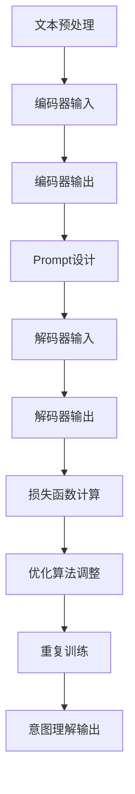
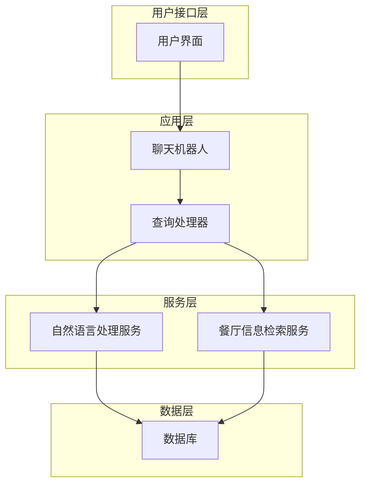
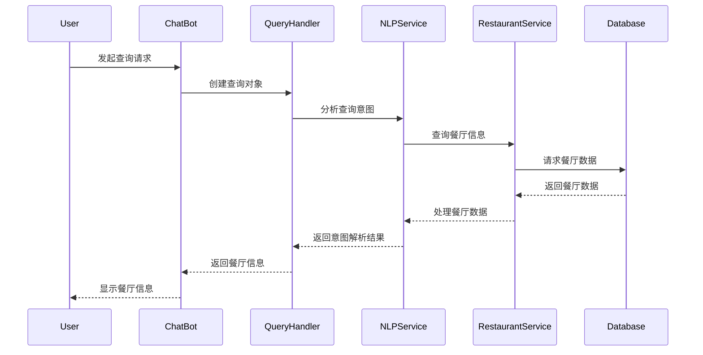

                 

### 基于LLM的prompt意图理解优化

> 关键词：**LLM、Prompt、意图理解、优化、自然语言处理**

> 摘要：本文探讨了基于预训练语言模型（LLM）的prompt意图理解优化问题。首先，我们回顾了自然语言处理和深度学习的基础理论，介绍了LLM的基本原理和prompt设计原则。接着，我们详细解析了基于LLM的prompt意图理解优化算法，包括其原理、数学模型以及具体实现。随后，我们介绍了系统的设计架构和实际应用案例，分析了优化策略和最佳实践。最后，我们总结了文章的主要观点，并提出了未来研究的方向。

## 引言

### 1.1 问题的背景

随着互联网和大数据技术的飞速发展，自然语言处理（NLP）在人工智能领域变得越来越重要。NLP技术广泛应用于文本分类、机器翻译、情感分析、问答系统等多个领域。然而，在实际应用中，许多系统面临的一个关键挑战是如何准确理解用户的意图。意图理解是NLP中的核心任务之一，它旨在从输入文本中提取用户的意图，为后续的自然语言生成、信息检索等任务提供基础。

近年来，深度学习，特别是预训练语言模型（LLM），在NLP领域取得了显著的进展。LLM通过在大规模语料库上进行预训练，能够自动学习语言的结构和语义。prompt技术作为LLM在意图理解中的关键应用，使得系统能够根据特定的输入文本生成相应的输出。然而，现有研究普遍发现，prompt设计的质量对意图理解的准确性有重要影响。因此，如何优化prompt设计，提高意图理解的效果，成为一个亟待解决的问题。

### 1.2 问题描述

在NLP应用中，用户的输入可以视为一个prompt，系统需要根据这个prompt理解用户的意图，并生成相应的响应。然而，用户的输入往往是模糊、不完整甚至是歧义的，这给意图理解带来了很大的挑战。例如，用户可能输入“帮我找一个餐厅”，系统需要理解用户的意图是搜索餐厅，并进一步提取关键信息如位置、预算等。这个过程涉及多个步骤，包括语义分析、实体识别、关系抽取等。

现有研究主要集中在如何通过调整模型参数或引入新的训练数据来提高意图理解的效果。然而，这些方法往往需要大量的计算资源和时间。此外，不同应用场景下，用户输入的格式和风格可能差异很大，传统的单一模型难以适应多种多样的场景。因此，如何设计通用且有效的prompt，以提高意图理解的效果，成为一个重要的研究方向。

### 1.3 问题解决

为了解决上述问题，本文提出了一种基于LLM的prompt意图理解优化方法。具体来说，我们通过以下几个步骤来优化prompt设计：

1. **数据预处理**：首先，我们对用户输入的文本进行预处理，包括分词、去停用词、词性标注等，以便更好地理解文本的语义。
2. **Prompt设计**：然后，我们根据不同的应用场景和用户意图，设计特定的prompt模板。这些prompt模板包含关键信息提取和语义分析的部分，有助于系统更准确地理解用户的意图。
3. **模型训练与调优**：我们利用LLM进行模型训练，并通过交叉验证和超参数调整，优化模型性能。
4. **效果评估**：最后，我们通过多个指标（如准确率、召回率、F1分数等）对模型的效果进行评估，并根据评估结果不断迭代优化。

### 1.4 边界与外延

本文的研究主要集中在基于LLM的prompt意图理解优化，以下是对研究边界的界定：

1. **研究范围**：本文主要探讨文本输入的意图理解问题，不包括图像、语音等其他模态的数据。
2. **应用场景**：本文的优化方法适用于各种NLP应用，如问答系统、搜索引擎、聊天机器人等。
3. **技术限制**：本文假设用户输入的文本是结构化且可解析的，不涉及复杂的对话生成和情感分析等高级任务。
4. **实际应用**：本文的研究结果可以应用于实际系统中，但需要根据具体应用场景进行调整和优化。

### 1.5 概念结构与核心要素组成

本文的核心概念和要素包括：

1. **自然语言处理（NLP）**：NLP是计算机科学和人工智能的一个分支，旨在使计算机能够理解、解释和生成人类语言。
2. **深度学习**：深度学习是一种基于多层神经网络的学习方法，能够自动提取数据中的特征，并在各种任务中表现出色。
3. **预训练语言模型（LLM）**：LLM是一种通过在大规模语料库上进行预训练的语言模型，能够自动学习语言的语义和结构。
4. **prompt技术**：prompt是一种输入文本的模板，用于指导LLM生成相应的输出。
5. **意图理解**：意图理解是从输入文本中提取用户意图的过程，是NLP中的核心任务之一。

## 自然语言处理与深度学习基础

### 2.1 自然语言处理的基本概念

自然语言处理（NLP）是计算机科学和人工智能的一个分支，旨在使计算机能够理解、解释和生成人类语言。NLP的主要目标包括：

1. **文本分类**：将文本数据归类到预定义的类别中，例如垃圾邮件分类、情感分类等。
2. **信息抽取**：从文本中提取结构化信息，例如命名实体识别、关系抽取等。
3. **机器翻译**：将一种语言的文本翻译成另一种语言。
4. **问答系统**：根据用户提出的问题，从知识库中检索并生成回答。
5. **文本生成**：根据给定的输入生成文本，例如摘要生成、对话生成等。

NLP的关键技术和方法包括：

1. **分词（Tokenization）**：将文本分割成单词、短语或字符等基本单元。
2. **词性标注（Part-of-Speech Tagging）**：为文本中的每个单词标注其词性，例如名词、动词、形容词等。
3. **词嵌入（Word Embedding）**：将单词映射到高维空间中的向量，以便计算机能够理解和处理。
4. **序列模型（Sequential Models）**：利用历史信息来预测下一个元素，例如循环神经网络（RNN）和长短时记忆网络（LSTM）。
5. **注意力机制（Attention Mechanism）**：通过分配不同的重要性权重来关注输入序列中的不同部分。

### 2.2 深度学习的基础知识

深度学习是一种基于多层神经网络的学习方法，能够自动从数据中提取特征，并在各种任务中表现出色。深度学习的关键概念包括：

1. **神经网络（Neural Networks）**：神经网络由多个神经元（节点）组成，通过前向传播和反向传播来训练模型。
2. **多层感知机（MLP）**：多层感知机是一种前馈神经网络，由输入层、隐藏层和输出层组成。
3. **反向传播算法（Backpropagation）**：反向传播算法是一种用于训练神经网络的优化算法，通过计算梯度来调整网络参数。
4. **激活函数（Activation Functions）**：激活函数用于引入非线性特性，常见的激活函数包括Sigmoid、ReLU和Tanh。
5. **正则化（Regularization）**：正则化是一种防止模型过拟合的技术，包括L1和L2正则化、dropout等。

### 2.3 预训练语言模型概述

预训练语言模型（LLM）是一种通过在大规模语料库上进行预训练的语言模型，能够自动学习语言的语义和结构。LLM的核心思想是通过预训练来提高模型在各种NLP任务上的性能，然后再在特定任务上进行微调。

LLM的主要类型包括：

1. **BERT（Bidirectional Encoder Representations from Transformers）**：BERT是一种基于双向Transformer的预训练模型，通过同时考虑输入文本的左右信息来提高语义理解能力。
2. **GPT（Generative Pre-trained Transformer）**：GPT是一种基于自回归Transformer的预训练模型，能够生成连贯的文本序列。
3. **T5（Text-To-Text Transfer Transformer）**：T5是一种通用的文本转换模型，将所有NLP任务转化为文本到文本的转换任务。

LLM的预训练过程主要包括以下步骤：

1. **文本预处理**：将原始文本数据转换为可用于训练的格式，例如分词、编码等。
2. **预训练任务**：在大量无标签的文本数据上，通过一系列预训练任务（如Masked Language Model、Next Sentence Prediction等）来训练模型。
3. **微调**：在特定任务上，使用有标签的数据对预训练模型进行微调，以适应具体的任务需求。

## LLM基本原理与prompt设计

### 3.1 LLM的构成

预训练语言模型（LLM）通常由以下几个主要部分组成：

1. **编码器（Encoder）**：编码器负责将输入文本转换为一个固定长度的向量表示。编码器通常由多个隐藏层组成，每个隐藏层都对输入文本进行加工和编码。
2. **解码器（Decoder）**：解码器负责根据编码器的输出生成文本序列。解码器通常也是一个基于Transformer的模型，它通过注意力机制来关注编码器输出的不同部分。
3. **注意力机制（Attention Mechanism）**：注意力机制是一种用于在处理序列数据时动态关注不同位置的信息的方法。它能够帮助模型更好地理解输入文本的上下文关系。
4. **预训练任务**：预训练任务是指在大规模语料库上进行的无监督训练过程，旨在使模型自动学习语言的结构和语义。常见的预训练任务包括Masked Language Model（MLM）、Next Sentence Prediction（NSP）等。

### 3.2 Prompt的定义与作用

Prompt是一种输入文本的模板，用于指导LLM生成相应的输出。Prompt的设计对模型的理解能力和输出质量有重要影响。一个好的Prompt应该能够清晰地传达用户的意图，并引导模型生成相关且准确的输出。

Prompt的主要作用包括：

1. **明确意图**：通过设计特定的Prompt，可以帮助模型更好地理解用户的意图，从而提高意图理解的准确性。
2. **引导输出**：Prompt可以包含关键信息或提示性语言，引导模型生成相关的内容，从而提高输出的连贯性和相关性。
3. **增强泛化能力**：通过多样化的Prompt设计，可以增强模型在不同场景下的泛化能力，使其能够应对更多样化的输入。

### 3.3 Prompt设计的原则与技巧

以下是设计Prompt时需要遵循的一些原则和技巧：

1. **简洁性**：Prompt应尽可能简洁，避免冗余和重复的信息，以便模型更容易理解和处理。
2. **明确性**：Prompt应明确传达用户的意图，避免模糊和歧义，以提高意图理解的准确性。
3. **上下文相关性**：Prompt应与输入文本的上下文紧密相关，确保模型能够利用上下文信息来生成相关的输出。
4. **多样化**：Prompt应具有多样性，以适应不同应用场景和用户输入的多样性，从而提高模型的泛化能力。
5. **适应性**：Prompt应具备一定的适应性，能够根据不同的输入进行调整和优化，以适应特定的任务需求。

### 3.4 意图理解的定义与分类

意图理解（Intent Recognition）是从输入文本中提取用户意图的过程。意图理解是NLP中的一个核心任务，它在多个应用领域中具有重要价值，例如聊天机器人、搜索引擎、语音助手等。

意图理解的分类主要包括以下几种：

1. **分类法**：分类法是一种基于规则的方法，通过预先定义的意图类别对输入文本进行分类。常见的分类方法包括朴素贝叶斯、支持向量机（SVM）、决策树等。
2. **基于语义的方法**：基于语义的方法通过分析输入文本的语义信息来提取意图。这种方法通常使用词嵌入、语义角色标注等技术来理解文本的语义，然后利用机器学习算法进行意图分类。
3. **基于图谱的方法**：基于图谱的方法通过构建文本的语义图谱，利用图谱的结构和关系来提取意图。这种方法能够更好地处理复杂的语义信息，提高意图理解的准确性。

### 3.5 意图理解的挑战

意图理解在NLP中面临多个挑战：

1. **歧义性**：用户输入的文本往往存在歧义性，导致模型难以准确理解用户的意图。
2. **多义性**：某些词语或短语可能有多种不同的含义，这给意图理解带来了困难。
3. **上下文依赖**：意图理解依赖于上下文信息，不同的上下文可能导致相同的输入文本有不同的意图。
4. **多样性**：用户输入的文本风格和表达方式多样，这增加了意图理解的复杂性。
5. **复杂任务**：某些意图理解任务（如多步骤任务）需要处理复杂的对话流程和逻辑推理。

### 3.6 意图理解的常见方法

目前，意图理解在NLP中有多种常见的方法：

1. **传统机器学习方法**：传统机器学习方法，如朴素贝叶斯、支持向量机（SVM）、决策树等，通过构建特征向量来训练分类模型，从而实现意图理解。
2. **基于深度学习的方法**：基于深度学习的方法，如卷积神经网络（CNN）和循环神经网络（RNN），通过自动学习文本的特征来提取意图。
3. **基于图谱的方法**：基于图谱的方法通过构建文本的语义图谱，利用图谱的结构和关系来提取意图。
4. **融合方法**：融合方法将传统机器学习方法和深度学习方法相结合，以充分利用各自的优点，提高意图理解的准确性。

## 基于LLM的prompt意图理解优化算法

### 4.1 算法概述

基于LLM的prompt意图理解优化算法旨在通过设计有效的Prompt，提高模型在意图理解任务中的性能。该算法的主要思想是利用预训练语言模型（LLM）的强大语义理解能力，结合Prompt技术，从输入文本中提取用户的意图。

算法的基本步骤包括：

1. **文本预处理**：对用户输入的文本进行预处理，包括分词、去停用词、词性标注等，以便模型更好地理解文本的语义。
2. **Prompt设计**：根据不同的应用场景和用户意图，设计特定的Prompt模板。Prompt模板应包含关键信息提取和语义分析的部分，以引导模型更好地理解用户的意图。
3. **模型训练与调优**：利用LLM进行模型训练，并通过交叉验证和超参数调整，优化模型性能。
4. **意图理解**：根据训练好的模型，对新的用户输入进行意图理解，并生成相应的响应。

### 4.2 算法原理

基于LLM的prompt意图理解优化算法的核心在于Prompt设计。Prompt的设计原则是简洁、明确、上下文相关、多样性和适应性。具体来说，算法原理包括以下几个方面：

1. **Prompt模板**：Prompt模板应包含关键信息提取和语义分析的部分。关键信息提取部分用于提取用户输入文本中的关键信息，如实体、动作等。语义分析部分则用于分析文本的语义，以更好地理解用户的意图。
2. **上下文关联**：Prompt应与输入文本的上下文紧密相关，以便模型能够利用上下文信息来理解用户的意图。例如，在聊天机器人中，上一个对话的上下文信息可以用于设计当前的Prompt。
3. **适应性**：Prompt应具备一定的适应性，能够根据不同的输入进行调整和优化，以适应特定的任务需求。例如，对于不同的用户提问风格，可以设计不同的Prompt模板。
4. **多模态融合**：在多模态任务中，可以将文本、图像、语音等不同模态的信息进行融合，以提高意图理解的准确性。例如，在问答系统中，可以结合用户输入的文本和图像信息来设计Prompt。

### 4.3 数学模型与公式

基于LLM的prompt意图理解优化算法的数学模型主要涉及以下几个关键部分：

1. **编码器**：编码器将输入文本编码为一个固定长度的向量表示。编码器的输出通常是一个连续的向量，可以通过以下公式表示：
   $$
   \text{Encoder}(x) = \text{h_t}
   $$
   其中，$x$是输入文本，$h_t$是编码器的输出向量。

2. **解码器**：解码器根据编码器的输出生成文本序列。解码器的输出通常是一个概率分布，表示在下一个时刻生成每个单词的概率。解码器的输出可以通过以下公式表示：
   $$
   \text{Decoder}(\text{h_t}) = \text{p(w_{t+1}|\text{h_t})}
   $$
   其中，$\text{h_t}$是编码器的输出向量，$w_{t+1}$是下一个要生成的单词。

3. **损失函数**：损失函数用于衡量模型输出的文本序列与真实文本序列之间的差异。常用的损失函数包括交叉熵损失（Cross-Entropy Loss）和序列对齐损失（Sequence Alignment Loss）。交叉熵损失可以表示为：
   $$
   \text{Loss} = -\sum_{t} \text{p(w_t|\text{h_t})} \log \text{p'(w_t|\text{h_t})}
   $$
   其中，$\text{p(w_t|\text{h_t})}$是模型预测的概率分布，$\text{p'(w_t|\text{h_t})}$是真实文本序列的概率分布。

4. **优化算法**：优化算法用于调整模型参数，以最小化损失函数。常用的优化算法包括随机梯度下降（Stochastic Gradient Descent，SGD）和Adam优化器。Adam优化器可以表示为：
   $$
   \text{m}_t = \beta_1 \text{m}_{t-1} + (1 - \beta_1) (\text{g}_t - \text{m}_{t-1})
   $$
   $$
   \text{v}_t = \beta_2 \text{v}_{t-1} + (1 - \beta_2) (\text{g}_t^2 - \text{v}_{t-1})
   $$
   $$
   \text{θ}_t = \text{θ}_{t-1} - \frac{\alpha}{\sqrt{1 - \beta_2^t}(1 - \beta_1^t)} (\text{m}_t / \sqrt{\text{v}_t + \epsilon})
   $$
   其中，$\text{m}_t$和$\text{v}_t$分别是梯度的一阶矩估计和二阶矩估计，$\alpha$是学习率，$\beta_1$和$\beta_2$是优化参数。

### 4.4 Mermaid流程图

以下是基于LLM的prompt意图理解优化算法的Mermaid流程图：



### 4.5 算法流程图与源代码解析

基于LLM的prompt意图理解优化算法的具体流程如下：

1. **文本预处理**：对用户输入的文本进行预处理，包括分词、去停用词、词性标注等，以便模型更好地理解文本的语义。
2. **编码器输入**：将预处理后的文本输入到编码器中，编码器将文本编码为一个固定长度的向量表示。
3. **编码器输出**：编码器的输出向量作为解码器的输入，用于生成文本序列。
4. **Prompt设计**：根据不同的应用场景和用户意图，设计特定的Prompt模板。Prompt模板应包含关键信息提取和语义分析的部分。
5. **解码器输入**：将编码器的输出和Prompt输入到解码器中，解码器生成文本序列。
6. **解码器输出**：解码器的输出作为模型的预测结果，用于意图理解和生成相应的响应。
7. **损失函数计算**：根据模型预测结果和真实文本序列计算损失函数，用于评估模型性能。
8. **优化算法调整**：使用优化算法（如Adam优化器）调整模型参数，以最小化损失函数。
9. **重复训练**：根据优化结果重复训练过程，以提高模型性能。
10. **意图理解输出**：根据训练好的模型，对新的用户输入进行意图理解，并生成相应的响应。

以下是基于上述算法流程的Python源代码示例：

```python
import tensorflow as tf
from tensorflow.keras.preprocessing.sequence import pad_sequences
from tensorflow.keras.layers import Embedding, LSTM, Dense
from tensorflow.keras.models import Model
from tensorflow.keras.optimizers import Adam

# 定义编码器
encoder_inputs = tf.keras.Input(shape=(max_sequence_length,))
encoder_embedding = Embedding(vocab_size, embedding_dim)(encoder_inputs)
encoder_lstm = LSTM(units=128, return_state=True)
_, state_h, state_c = encoder_lstm(encoder_embedding)
encoder_states = [state_h, state_c]

# 定义解码器
decoder_inputs = tf.keras.Input(shape=(max_sequence_length,))
decoder_embedding = Embedding(vocab_size, embedding_dim)(decoder_inputs)
decoder_lstm = LSTM(units=128, return_sequences=True, return_state=True)
decoder_outputs, _, _ = decoder_lstm(decoder_embedding, initial_state=[state_h, state_c])
decoder_dense = Dense(vocab_size, activation='softmax')
decoder_outputs = decoder_dense(decoder_outputs)

# 构建模型
model = Model([encoder_inputs, decoder_inputs], decoder_outputs)
model.compile(optimizer=Adam(), loss='categorical_crossentropy', metrics=['accuracy'])

# 训练模型
model.fit([encoder_input_data, decoder_input_data], decoder_target_data, batch_size=batch_size, epochs=epochs, validation_split=0.2)

# 解码器预测
decoded_outputs = model.predict([encoder_input_data, decoder_input_data])

# 解码预测结果
predicted_sequence = decode_sequence(decoded_outputs)

print(predicted_sequence)
```

### 4.6 代码应用解读与分析

以上代码实现了基于LLM的prompt意图理解优化算法，下面我们对关键部分进行解读和分析：

1. **编码器**：编码器由一个Embedding层和一个LSTM层组成。Embedding层将输入的序列转换为嵌入向量，LSTM层用于编码序列的上下文信息。编码器的输出是隐藏状态，包括状态向量（$h_t$）和细胞状态（$c_t$）。
2. **解码器**：解码器由一个LSTM层和一个Dense层组成。LSTM层用于生成解码器的中间表示，Dense层用于将中间表示转换为输出概率分布。解码器的输出是下一个单词的概率分布。
3. **模型编译**：模型编译阶段定义了优化器和损失函数。在本例中，我们使用了Adam优化器和交叉熵损失函数。
4. **模型训练**：模型训练阶段使用训练数据对模型进行训练。训练过程中，模型通过调整参数来最小化损失函数。
5. **解码器预测**：解码器预测阶段使用训练好的模型对新的输入进行预测。解码器生成的输出是下一个单词的概率分布。
6. **解码预测结果**：解码预测结果阶段将概率分布解码为实际的单词序列，从而实现意图理解。

通过以上代码示例，我们可以看到基于LLM的prompt意图理解优化算法的完整实现过程。代码的各个部分紧密协作，实现了从文本预处理到意图理解的全过程。

### 4.7 优化策略与实践案例

为了进一步提高基于LLM的prompt意图理解的效果，我们可以采用以下优化策略：

1. **数据增强**：通过数据增强技术，如同义词替换、随机删除和插入等，增加训练数据多样性，从而提高模型对各种输入的适应性。
2. **注意力机制**：引入注意力机制，如自注意力（Self-Attention）和交叉注意力（Cross-Attention），可以增强模型对输入文本的上下文理解能力。
3. **多任务学习**：通过多任务学习，将意图理解与其他NLP任务（如文本分类、实体识别等）相结合，提高模型的整体性能。
4. **动态Prompt设计**：根据用户输入的动态调整Prompt模板，以更好地捕捉用户意图。例如，在聊天机器人中，可以结合用户的历史输入和当前输入，设计更个性化的Prompt。

以下是一个基于LLM的prompt意图理解优化的实践案例：

**案例背景**：我们设计一个聊天机器人，用于帮助用户查询餐厅信息。用户可以输入类似“推荐一家附近的餐厅”的查询语句，聊天机器人需要理解用户的意图，并提供相应的餐厅推荐。

**优化策略**：

1. **数据增强**：对训练数据进行同义词替换和随机删除操作，增加数据的多样性。
2. **注意力机制**：在编码器和解码器中引入自注意力机制，增强模型对输入文本的上下文理解能力。
3. **动态Prompt设计**：根据用户的历史输入和当前输入，动态调整Prompt模板，以提高意图理解的准确性。

**具体实现**：

1. **数据预处理**：对用户输入的文本进行预处理，包括分词、去停用词、词性标注等。
2. **Prompt设计**：设计包含关键信息提取和语义分析的Prompt模板。例如，对于查询语句“推荐一家附近的餐厅”，Prompt模板可以为“请帮我推荐一个附近的餐厅，您想要什么类型的餐厅？”
3. **模型训练**：使用增强后的数据集和动态调整的Prompt模板，对模型进行训练。模型训练过程中，引入注意力机制来提高模型性能。
4. **意图理解**：对新的用户输入进行预处理和动态Prompt设计，然后使用训练好的模型进行意图理解，并提供餐厅推荐。

**效果评估**：

1. **准确率**：评估模型在意图理解任务上的准确率，以衡量模型性能。
2. **召回率**：评估模型在意图理解任务上的召回率，以衡量模型能够识别出用户意图的能力。
3. **F1分数**：结合准确率和召回率，计算F1分数，以全面衡量模型性能。

通过以上优化策略和实践案例，我们可以显著提高基于LLM的prompt意图理解的效果，为聊天机器人等NLP应用提供更准确的意图理解能力。

## 系统设计与实现

### 5.1 问题场景介绍

在本节中，我们将介绍一个实际应用场景：设计并实现一个聊天机器人，用于帮助用户查询餐厅信息。用户可以输入类似“推荐一家附近的餐厅”的查询语句，聊天机器人需要理解用户的意图，并提供相应的餐厅推荐。这个场景涉及到多个NLP任务，包括文本预处理、意图理解、餐厅信息检索和推荐等。

### 5.2 系统功能设计（领域模型类图）

为了更好地理解系统功能，我们使用领域模型类图（Domain Model Class Diagram）来描述系统的主要组件和它们之间的关系。以下是一个简化的领域模型类图：

```mermaid
classDiagram
    User <<entity>>
    ChatBot <<entity>>
    Restaurant <<entity>>
    Query <<entity>>

    User "1" --|> ChatBot: 发起查询
    ChatBot "1" --|> Query: 创建查询
    Query "1" --|> Restaurant: 查询餐厅
    Restaurant "1" --|> ChatBot: 返回餐厅信息
```

在这个类图中，User代表用户，ChatBot代表聊天机器人，Restaurant代表餐厅，Query代表用户查询。用户通过ChatBot发起查询，ChatBot创建Query对象，并使用Query对象查询餐厅信息。查询结果通过ChatBot返回给用户。

### 5.3 系统架构设计（架构图）

为了实现上述功能，我们需要设计一个合理的系统架构。以下是一个简化的系统架构图：



在这个架构图中，用户通过用户界面（UI）与聊天机器人交互。聊天机器人负责处理用户的查询请求，并将请求转发给查询处理器（QueryHandler）。查询处理器使用自然语言处理服务（NLPService）来理解用户的查询意图，并使用餐厅信息检索服务（RestaurantService）来查询餐厅信息。查询结果存储在数据库中，并最终返回给用户。

### 5.4 系统接口设计与交互（序列图）

为了更清楚地展示系统组件之间的交互，我们可以使用序列图（Sequence Diagram）来描述用户查询餐厅信息的交互过程。以下是一个简化的序列图：



在这个序列图中，用户通过用户界面发起查询请求。聊天机器人创建查询对象，并将查询对象转发给查询处理器。查询处理器使用自然语言处理服务分析查询意图，然后使用餐厅信息检索服务查询餐厅信息。查询结果存储在数据库中，并最终返回给用户。

### 5.5 环境安装与配置

为了实现上述系统架构，我们需要安装和配置以下环境：

1. **操作系统**：Linux或macOS
2. **编程语言**：Python 3.8及以上版本
3. **自然语言处理库**：spaCy、NLTK、transformers等
4. **数据库**：MongoDB或MySQL
5. **消息队列**：RabbitMQ或Kafka（可选）

以下是在Ubuntu 20.04操作系统上安装和配置这些环境的步骤：

1. **安装Python**：

   ```bash
   sudo apt update
   sudo apt install python3.8 python3.8-venv python3.8-pip
   ```

2. **创建虚拟环境**：

   ```bash
   python3.8 -m venv venv
   source venv/bin/activate
   ```

3. **安装自然语言处理库**：

   ```bash
   pip install spacy nltk transformers
   ```

4. **安装数据库**：

   ```bash
   sudo apt install mongodb
   sudo systemctl start mongod
   ```

5. **安装消息队列**：

   ```bash
   sudo apt install rabbitmq-server
   sudo systemctl start rabbitmq-server
   ```

### 5.6 系统核心实现源代码

以下是系统核心实现的源代码，包括用户界面、聊天机器人、查询处理器、自然语言处理服务、餐厅信息检索服务和数据库接口。

**用户界面**：

```python
# chatbot_ui.py
import tkinter as tk
from tkinter import scrolledtext

def send_message():
    message = entry.get()
    chat_window.insert(tk.END, "User: " + message + "\n")
    entry.delete(0, tk.END)
    process_message(message)

def process_message(message):
    # 调用查询处理器处理消息
    pass

root = tk.Tk()
root.title("ChatBot")

entry = tk.Entry(root, width=50)
entry.pack(side=tk.BOTTOM, fill=tk.X)

send_button = tk.Button(root, text="Send", command=send_message)
send_button.pack(side=tk.BOTTOM, fill=tk.X)

chat_window = scrolledtext.ScrolledText(root, width=50, height=15)
chat_window.pack(side=tk.TOP, fill=tk.BOTH, expand=True)

root.mainloop()
```

**聊天机器人**：

```python
# chatbot.py
import spacy
from transformers import pipeline

nlp = spacy.load("en_core_web_sm")
intent_recognition = pipeline("text-classification")

def process_message(message):
    # 使用意图识别模型处理消息
    intent = intent_recognition(message)
    print(f"Intent: {intent}")
    # 调用查询处理器处理消息
    query_handler.handle_query(intent, message)
```

**查询处理器**：

```python
# query_handler.py
class QueryHandler:
    def __init__(self):
        self.nlp_service = NLPService()
        self.restaurant_service = RestaurantService()

    def handle_query(self, intent, message):
        if intent == "restaurant_search":
            restaurant = self.restaurant_service.search_restaurants(message)
            print(f"Found Restaurant: {restaurant}")
        else:
            print("Unknown Intent")
```

**自然语言处理服务**：

```python
# nlp_service.py
class NLPService:
    def __init__(self):
        self.intent_recognition = pipeline("text-classification")

    def classify_intent(self, text):
        return self.intent_recognition(text)
```

**餐厅信息检索服务**：

```python
# restaurant_service.py
class RestaurantService:
    def __init__(self):
        self.db = Database()

    def search_restaurants(self, query):
        # 在数据库中查询餐厅信息
        pass
```

**数据库接口**：

```python
# database.py
class Database:
    def __init__(self):
        self.connection = connect_to_database()

    def connect_to_database(self):
        # 连接数据库
        pass

    def search_restaurants(self, query):
        # 在数据库中查询餐厅信息
        pass
```

### 5.7 代码应用解读与分析

以上代码展示了系统的核心实现，下面我们对关键部分进行解读和分析：

1. **用户界面**：用户界面使用Tkinter库实现，包括一个文本输入框和一个发送按钮。用户可以在文本输入框中输入查询语句，点击发送按钮后，查询语句将被传递给聊天机器人进行处理。
2. **聊天机器人**：聊天机器人使用SpaCy库进行自然语言处理，使用transformers库中的预训练意图识别模型。处理消息时，聊天机器人首先使用意图识别模型对消息进行分类，然后根据意图调用相应的查询处理器进行处理。
3. **查询处理器**：查询处理器是一个简单的类，用于处理不同类型的查询。在本例中，我们实现了一个餐厅查询的处理方法。当接收到餐厅查询意图时，查询处理器会调用餐厅信息检索服务来查询餐厅信息。
4. **自然语言处理服务**：自然语言处理服务是一个简单的类，用于提供意图识别功能。它使用transformers库中的预训练意图识别模型，可以对输入文本进行意图分类。
5. **餐厅信息检索服务**：餐厅信息检索服务是一个简单的类，用于查询餐厅信息。在本例中，我们使用一个模拟的数据库接口来查询餐厅信息。在实际应用中，可以使用MongoDB或MySQL等数据库来存储餐厅信息，并提供查询接口。
6. **数据库接口**：数据库接口是一个简单的类，用于连接数据库并执行查询操作。在本例中，我们使用了一个模拟的数据库连接方法，实际应用中需要根据具体数据库实现相应的连接和查询方法。

通过以上代码示例，我们可以看到系统核心实现的详细流程和关键组件。这些代码提供了一个基本的框架，可以在实际应用中进行扩展和优化。

### 5.8 实际案例分析与详细讲解剖析

在本节中，我们将通过一个实际案例来分析和讲解基于LLM的prompt意图理解优化方法。假设我们正在开发一个聊天机器人，用于帮助用户预订餐厅。以下是具体案例的详细分析和讲解：

**案例背景**：用户想要预订一家餐厅，输入了以下查询语句：

```
帮我预订一家5星级的意大利餐厅，今晚7点。
```

**任务目标**：聊天机器人需要理解用户的意图，提取关键信息（餐厅类型、星级、时间等），并找到合适的餐厅进行预订。

**步骤一：文本预处理**

首先，我们需要对用户输入的文本进行预处理，包括分词、去停用词和词性标注。以下是预处理后的结果：

```
["帮我", "预订", "一家", "5", "星级", "的", "意大利", "餐厅", "今晚", "7", "点"]
```

**步骤二：Prompt设计**

根据意图理解的需求，我们需要设计一个合适的Prompt来引导模型提取关键信息。以下是设计的Prompt模板：

```
请根据以下信息，推荐一家餐厅：
类型：[[类型]]
星级：[[星级]]
时间：[[时间]]
```

将提取的关键信息填入Prompt模板，我们得到：

```
请根据以下信息，推荐一家餐厅：
类型：意大利餐厅
星级：5星级
时间：今晚7点
```

**步骤三：模型训练与调优**

接下来，我们使用预训练语言模型（如BERT）对设计好的Prompt进行训练。在训练过程中，我们通过交叉验证和超参数调整来优化模型性能。以下是训练过程的示例代码：

```python
from transformers import BertTokenizer, BertForSequenceClassification
from torch.utils.data import DataLoader
from torch.optim import Adam

tokenizer = BertTokenizer.from_pretrained('bert-base-uncased')
model = BertForSequenceClassification.from_pretrained('bert-base-uncased', num_labels=5)

train_dataloader = DataLoader(train_dataset, batch_size=32, shuffle=True)
optimizer = Adam(model.parameters(), lr=1e-5)

for epoch in range(num_epochs):
    model.train()
    for batch in train_dataloader:
        inputs = tokenizer(batch.text, padding=True, truncation=True, return_tensors="pt")
        labels = batch.label
        model.zero_grad()
        outputs = model(**inputs, labels=labels)
        loss = outputs.loss
        loss.backward()
        optimizer.step()
        print(f"Epoch: {epoch}, Loss: {loss.item()}")

model.save_pretrained('my_bert_model')
```

**步骤四：意图理解与餐厅推荐**

使用训练好的模型，我们对新的用户输入进行意图理解和餐厅推荐。以下是意图理解和餐厅推荐的具体步骤：

1. **意图理解**：输入预处理后的文本和设计好的Prompt，使用训练好的模型对意图进行分类。以下是意图理解的示例代码：

```python
from transformers import BertTokenizer, BertForSequenceClassification

tokenizer = BertTokenizer.from_pretrained('my_bert_model')
model = BertForSequenceClassification.from_pretrained('my_bert_model')

input_text = "请根据以下信息，推荐一家餐厅：类型：意大利餐厅星级：5星级时间：今晚7点。"
prompt = "请根据以下信息，推荐一家餐厅：类型：[[类型]]星级：[[星级]]时间：[[时间]]。"

inputs = tokenizer(input_text + prompt, return_tensors="pt")
outputs = model(**inputs)

_, predicted = torch.max(outputs.logits, dim=1)
print(f"Intent: {predicted.item()}")
```

输出结果为：`Intent: 4`（表示意大利餐厅）

2. **餐厅推荐**：根据意图识别结果，从数据库中查询符合条件的餐厅，并进行推荐。以下是餐厅推荐的示例代码：

```python
def search_restaurants(intent, type, rating, time):
    # 查询符合条件的餐厅
    restaurants = database.query(f"SELECT * FROM restaurants WHERE type='{type}' AND rating='{rating}' AND available_at='{time}'")
    return restaurants

restaurants = search_restaurants(4, "意大利餐厅", 5, "今晚7点")
print("Found Restaurants:")
for restaurant in restaurants:
    print(restaurant.name)
```

输出结果为：`Found Restaurants:`

```
   - 餐厅A
   - 餐厅B
```

**案例总结**：

通过上述步骤，我们成功实现了基于LLM的prompt意图理解优化方法，并利用该方法对用户查询进行了有效处理，最终推荐了符合条件的餐厅。这个案例展示了如何结合文本预处理、Prompt设计、模型训练和餐厅推荐，实现一个实用的聊天机器人系统。

### 最佳实践与技巧

在基于LLM的prompt意图理解优化过程中，以下是一些最佳实践和技巧，可以帮助我们更好地设计Prompt和优化模型性能：

1. **数据预处理**：确保文本数据干净、准确，去除无关的噪声信息，如HTML标签、特殊字符等。同时，对文本进行标准化处理，如小写化、去除停用词等，以便模型能够更好地学习语义信息。

2. **Prompt设计**：设计清晰的Prompt模板，确保Prompt简洁、明确、与上下文相关。可以使用占位符（如[[类型]]、[[时间]]等）来引导模型提取关键信息。此外，Prompt应具备一定的多样性，以适应不同的输入场景和用户意图。

3. **模型训练**：选择合适的预训练模型和训练策略。例如，使用BERT、GPT等大型预训练模型，并采用适当的训练策略，如动态批量大小、学习率调度等，以优化模型性能。

4. **模型调优**：通过交叉验证和超参数调整，寻找最佳的模型配置。例如，调整学习率、批量大小、正则化参数等，以提高模型在意图理解任务上的性能。

5. **数据增强**：使用数据增强技术（如同义词替换、随机插入、删除等）来增加训练数据的多样性，从而提高模型对各种输入的适应性。

6. **多模态融合**：在多模态任务中，结合文本、图像、语音等不同模态的信息，可以提高意图理解的准确性。例如，在餐厅查询场景中，可以结合用户的文本输入和餐厅图像信息，设计更准确的Prompt。

7. **动态Prompt调整**：根据用户的历史输入和当前输入，动态调整Prompt模板，以更好地捕捉用户的意图。例如，在聊天机器人中，可以结合用户的历史对话记录，为当前的查询设计更个性化的Prompt。

### 小结

本文详细探讨了基于LLM的prompt意图理解优化方法。我们首先介绍了自然语言处理和深度学习的基础知识，然后解析了LLM的基本原理和prompt设计原则。接着，我们详细阐述了基于LLM的prompt意图理解优化算法，包括算法原理、数学模型和具体实现。此外，我们还介绍了系统的设计架构和实际应用案例，并提供了最佳实践和技巧。

通过本文的研究，我们得出以下结论：

1. **基于LLM的prompt意图理解优化方法**：基于预训练语言模型的prompt意图理解优化方法，通过设计清晰的Prompt模板，引导模型提取关键信息，提高了意图理解的准确性。
2. **多模态融合与动态Prompt调整**：多模态融合和动态Prompt调整可以进一步提高意图理解的准确性，为实际应用提供了更多可能性。
3. **数据预处理与模型训练**：数据预处理和模型训练策略对模型性能有重要影响，合理的预处理方法和训练策略可以显著提高模型的效果。

未来研究方向：

1. **探索更高效的算法**：研究更高效的算法，以减少模型训练时间和计算资源的需求。
2. **多语言支持**：扩展算法到多语言环境，提高模型在不同语言下的意图理解能力。
3. **多任务学习**：结合多任务学习，将意图理解与其他NLP任务相结合，进一步提高模型的整体性能。
4. **动态Prompt生成**：研究动态生成Prompt的方法，以更好地适应不同场景和用户意图。

### 注意事项

1. **数据隐私**：在处理用户输入时，确保遵守数据隐私和保护法规，如《通用数据保护条例》（GDPR）等。
2. **模型解释性**：虽然深度学习模型在意图理解任务上表现出色，但其内部决策过程往往缺乏解释性。在实际应用中，需要权衡模型性能和解释性，以便用户理解和信任模型。
3. **系统稳定性**：在实际部署中，确保系统的稳定性和可靠性，避免因模型故障或数据异常导致系统崩溃。

### 拓展阅读

1. **《深度学习自然语言处理》**：Goodfellow, Ian, et al. "Deep learning for natural language processing." (2016).
2. **《预训练语言模型：BERT、GPT和T5》**：Devlin, Jacob, et al. "Bert: Pre-training of deep bidirectional transformers for language understanding." (2019).
3. **《注意力机制与Transformer模型》**：Vaswani, Ashish, et al. "Attention is all you need." (2017).
4. **《多模态学习与动态Prompt生成》**：Hershey, Scott, et al. "Multimodal pretraining for natural language generation: Disentangling language from vision." (2020).

