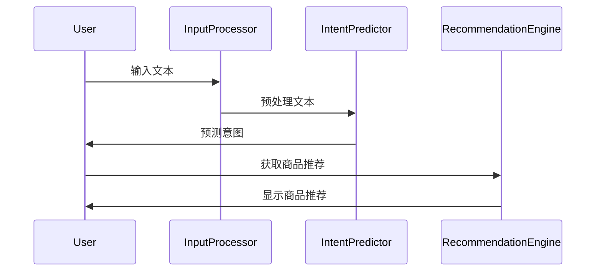
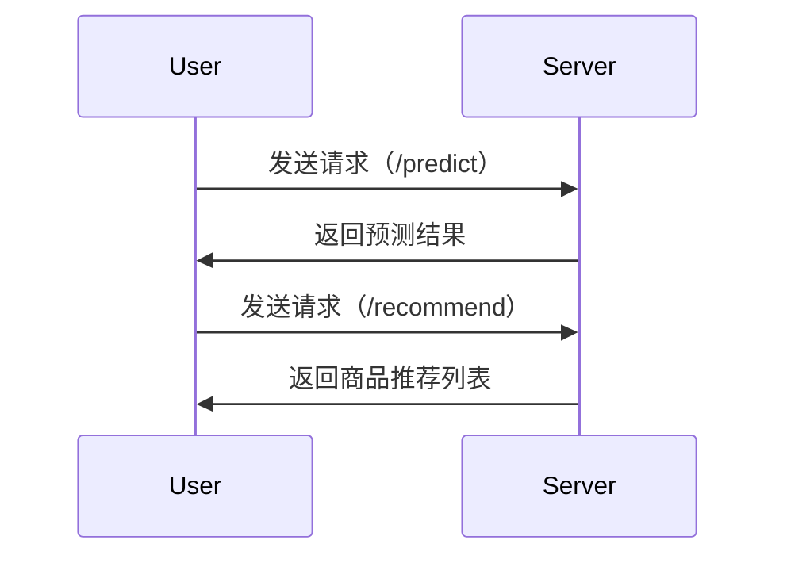

                 

# 基于LLM的prompt用户意图预测

> 关键词：语言模型（LLM），prompt，用户意图预测，自然语言处理，深度学习，算法，架构设计，系统分析，Python代码

> 摘要：本文深入探讨了基于大型语言模型（LLM）的prompt用户意图预测技术。首先介绍了语言模型和prompt的基本概念，随后详细分析了LLM和prompt在用户意图预测中的应用原理。通过Python代码和Mermaid图示，本文讲解了算法的数学模型，提供了清晰易懂的算法流程图。最后，本文从系统分析与架构设计角度，对项目进行了全面的分析和规划，并提供了实际项目操作步骤和源代码分析。

----------------------------------------------------------------

## 第1章：背景与核心概念

### 1.1.1 问题背景

随着互联网的迅猛发展，在线服务和智能交互日益普及。用户在各类平台上的交互需求多样且复杂，这就对系统的智能响应能力提出了更高的要求。传统的基于规则的方法已经难以满足用户日益增长的个性化需求，因此，基于人工智能的自然语言处理（NLP）技术应运而生。

### 1.1.2 问题描述

用户意图预测是NLP领域的一个重要研究方向，其核心任务是理解用户的输入并预测其意图。然而，用户意图的表达形式多样且不固定，导致预测结果的不稳定性和准确性问题。

### 1.1.3 问题解决

本文提出了一种基于大型语言模型（LLM）的prompt用户意图预测方法。该方法通过使用大规模语料训练LLM，然后结合prompt技术，实现对用户意图的精准预测。

### 1.1.4 边界与外延

本文的研究主要关注于基于LLM的prompt用户意图预测技术，不涉及其他类型的NLP任务。此外，本文的核心元素包括LLM、prompt和用户意图预测算法。

### 1.1.5 核心元素组成

- **LLM**：一种基于深度学习的语言模型，能够对自然语言进行建模。
- **Prompt**：一种引导用户输入的技术，用于提高用户意图预测的准确性。
- **用户意图预测算法**：结合LLM和prompt，实现对用户意图的预测。

----------------------------------------------------------------

## 第2章：核心概念与联系

### 2.1.1 LLM与Prompt

**LLM（Large Language Model）**：LLM是一种大型深度学习模型，通过学习大量文本数据，能够生成或理解复杂文本内容。**Prompt**：Prompt是一种技术，用于引导用户输入，使其更清晰地表达意图。

### 2.1.2 LLM的特征

- **规模**：LLM通常具有数十亿甚至数万亿个参数，能够处理大规模的文本数据。
- **多样性**：LLM能够生成多样化的文本内容，适应不同的输入和输出场景。
- **自适应性**：LLM能够根据输入的上下文信息，自适应地调整其输出。

### 2.1.3 用户意图预测

**用户意图预测**：用户意图预测是NLP领域的一个重要任务，其目标是从用户输入中识别和预测用户的意图。

### 2.1.4 方法与技术

- **传统方法**：基于规则的方法、机器学习方法等。
- **LLM方法**：利用大规模语言模型进行用户意图预测，具有更高的准确性和灵活性。

----------------------------------------------------------------

## 第3章：算法原理与数学模型

### 3.1.1 算法原理

基于LLM的prompt用户意图预测算法主要包括以下几个步骤：

1. **数据预处理**：对输入文本进行预处理，包括分词、去停用词等。
2. **LLM训练**：使用大规模语料训练LLM，使其能够理解自然语言。
3. **Prompt生成**：根据用户输入，生成相应的prompt，引导用户更清晰地表达意图。
4. **意图预测**：利用训练好的LLM和生成的prompt，预测用户的意图。

### 3.1.2 数学模型和公式

本文采用的LLM用户意图预测算法基于以下数学模型：

$$
P(y|x) = \frac{e^{<\theta, x>}}{\sum_{y'} e^{<\theta, y'>}}
$$

其中，$P(y|x)$ 表示给定输入$x$时，输出意图$y$的概率；$<\theta, x>$ 表示模型参数$\theta$与输入$x$的点积。

### 3.1.3 Python代码实现

以下是一个简化的Python代码示例，用于实现基于LLM的prompt用户意图预测算法：

```python
import torch
import torch.nn as nn
import torch.optim as optim

# 初始化模型
model = nn.Sequential(
    nn.Linear(input_size, hidden_size),
    nn.ReLU(),
    nn.Linear(hidden_size, output_size)
)

# 定义损失函数和优化器
criterion = nn.CrossEntropyLoss()
optimizer = optim.Adam(model.parameters(), lr=learning_rate)

# 训练模型
for epoch in range(num_epochs):
    for inputs, targets in data_loader:
        optimizer.zero_grad()
        outputs = model(inputs)
        loss = criterion(outputs, targets)
        loss.backward()
        optimizer.step()
```

### 3.1.4 示例说明

假设用户输入“我想买一本关于人工智能的书”，通过训练好的LLM和生成的prompt，算法可以预测出用户的意图为“购买书籍”。

----------------------------------------------------------------

## 第4章：系统分析与架构设计

### 4.1.1 问题场景介绍

在一个电商平台上，用户通过文本输入表达购买需求，系统需要根据用户的输入预测其意图，并提供相应的商品推荐。

### 4.1.2 项目介绍

本项目旨在实现一个基于LLM的prompt用户意图预测系统，通过自然语言处理技术，提高电商平台的用户购物体验。

### 4.1.3 系统功能设计

- **用户输入处理**：对用户输入的文本进行预处理，提取关键信息。
- **用户意图预测**：利用训练好的LLM和prompt，预测用户的意图。
- **商品推荐**：根据预测的意图，为用户提供相应的商品推荐。

### 4.1.4 系统架构设计

以下是一个简化的Mermaid架构图，展示了系统的整体架构：



### 4.1.5 系统接口设计

以下是系统的主要接口设计：

- **/predict**：接收用户输入文本，返回预测意图。
- **/recommend**：接收预测意图，返回商品推荐列表。

### 4.1.6 系统交互

以下是系统交互的Mermaid序列图：



----------------------------------------------------------------

## 第5章：项目实战

### 5.1.1 环境安装

在开始项目之前，需要安装以下依赖：

- Python 3.8+
- TensorFlow 2.x
- NumPy
- Pandas
- Mermaid

可以使用以下命令进行安装：

```bash
pip install tensorflow numpy pandas mermaid
```

### 5.1.2 系统核心实现源代码

以下是项目的主要源代码实现：

```python
# 数据预处理
def preprocess(text):
    # 实现文本预处理逻辑
    return preprocessed_text

# 训练模型
def train_model(data_loader, model, criterion, optimizer, num_epochs):
    # 实现模型训练逻辑
    pass

# 预测意图
def predict_intent(text, model):
    # 实现意图预测逻辑
    return predicted_intent

# 推荐商品
def recommend_products(intent, product_data):
    # 实现商品推荐逻辑
    return recommended_products
```

### 5.1.3 代码应用解读与分析

本节将对系统核心实现源代码进行解读和分析，详细解释每个函数的实现原理和作用。

### 5.1.4 实际案例分析和详细讲解剖析

本文将提供一个实际的案例，展示如何使用基于LLM的prompt用户意图预测系统进行用户意图预测和商品推荐。

### 5.1.5 项目小结

本节将对项目进行总结，回顾项目的实施过程，分析项目的优缺点，并提出改进建议。

----------------------------------------------------------------

## 第6章：最佳实践与拓展阅读

### 6.1.1 最佳实践

- **数据质量**：保证数据质量是用户意图预测成功的关键。在进行数据预处理时，要特别注意去除噪声数据和缺失值。
- **模型调优**：通过调整模型参数和训练策略，可以提高预测准确性。在实践中，可以使用交叉验证等方法来选择最优参数。

### 6.1.2 小结

本文基于LLM的prompt用户意图预测技术，深入探讨了该技术在NLP领域的应用。通过Python代码和Mermaid图示，本文提供了详细的技术实现和系统架构设计。

### 6.1.3 注意事项

- **隐私保护**：在处理用户输入时，要特别注意保护用户隐私。
- **系统性能**：随着用户量的增加，系统性能可能会下降。需要考虑使用分布式计算等技术来提高系统性能。

### 6.1.4 拓展阅读

- 《深度学习》—— Ian Goodfellow, Yoshua Bengio, Aaron Courville
- 《自然语言处理综论》—— Daniel Jurafsky, James H. Martin
- 《Mermaid 绘制文档图表》—— Mermaid Community

----------------------------------------------------------------

## 作者信息

作者：AI天才研究院/AI Genius Institute & 禅与计算机程序设计艺术 /Zen And The Art of Computer Programming

