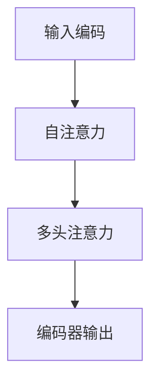
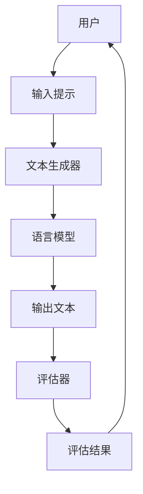
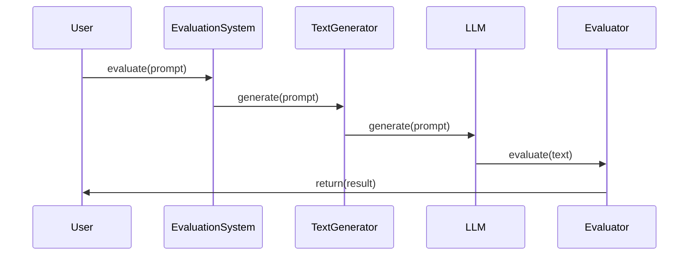

                 

# 基于LLM的prompt评估系统

## 关键词
- 语言模型（LLM）
- 提示（prompt）
- 评估系统
- 数据集准备
- 评估指标
- 应用场景

## 摘要

本文将探讨基于大型语言模型（LLM）的prompt评估系统的设计和实现。首先，我们将介绍LLM和prompt的基本概念及其重要性，然后深入分析LLM与prompt的协同作用和技术原理。接下来，我们将详细讲解评估系统的架构设计、数据集准备、评估指标和方法，并通过实际案例进行应用分析和评估。最后，我们对整个系统进行总结，并提出未来的发展方向。

## 第一部分：介绍与背景

### 1.1 问题背景

在当前人工智能领域，自然语言处理（NLP）技术的快速发展使得语言模型（LLM）得到了广泛应用。LLM通过学习大量文本数据，能够生成高质量的文本、回答问题、进行对话等。而prompt作为输入数据的一部分，对于LLM的性能和输出质量有着至关重要的影响。

然而，在实际应用中，如何设计有效的prompt，以及如何评价prompt的质量，成为一个亟待解决的问题。传统的评估方法往往依赖于人工打分或者简单的统计指标，这些方法无法全面反映prompt的实际效果。因此，我们需要一种基于LLM的prompt评估系统，以自动化、高效的方式对prompt进行评估。

### 1.2 核心概念与联系

#### 1.2.1 LLM的定义

语言模型（LLM）是一种能够对自然语言进行建模的模型，通常通过大量的文本数据训练得到。LLM可以理解自然语言的语义和语法，生成符合语言习惯的文本。

#### 1.2.2 LLM的特点

- **自主学习能力**：LLM可以通过学习大量文本数据，自动获取语言知识，无需人工干预。
- **生成能力**：LLM可以生成高质量的文本，包括文章、回答、对话等。
- **适应性**：LLM可以根据不同的任务和数据集进行适应，生成不同风格的文本。

#### 1.2.3 LLM与传统AI模型的对比

- **传统AI模型**：例如决策树、支持向量机等，它们通常需要手动设计特征和模型参数。
- **LLM**：通过大规模数据训练，自动获取语言特征和模型参数，无需手动设计。

#### 1.2.4 LLM与其他相关技术的联系

- **自然语言处理（NLP）**：LLM是NLP的重要组成部分，NLP技术为LLM提供了丰富的数据源和算法支持。
- **机器学习（ML）和深度学习（DL）**：LLM是基于ML和DL技术发展起来的，ML和DL技术为LLM提供了强大的计算能力。

### 1.3 提示（prompt）的定义与作用

#### 1.3.1 提示的定义

提示（prompt）是输入给LLM的文本，用于引导LLM生成特定风格的文本。提示通常包含问题和上下文信息，是LLM生成文本的关键。

#### 1.3.2 提示的作用

- **引导生成**：提示可以帮助LLM理解生成任务的要求，生成符合要求的文本。
- **优化质量**：有效的提示可以提高LLM的输出质量，减少生成文本的偏差和错误。

#### 1.3.3 提示的设计原则

- **明确性**：提示应该明确表达生成任务的要求，避免模糊不清。
- **多样性**：设计多种类型的提示，以满足不同生成任务的需求。
- **适应性**：提示应该能够适应不同的LLM和应用场景。

### 1.4 评估系统的概念与必要性

#### 1.4.1 评估系统的定义

评估系统是一种用于评估LLM和prompt性能的系统，通过自动化方法对LLM的输出进行评估，提供详细的评估结果。

#### 1.4.2 评估系统的必要性

- **优化LLM性能**：通过评估系统，可以找出LLM的不足之处，进行优化。
- **设计有效prompt**：评估系统可以帮助设计出更有效的prompt，提高生成文本的质量。
- **提高应用效果**：通过评估系统，可以全面了解LLM和prompt的应用效果，为实际应用提供指导。

### 1.5 本章小结

本部分介绍了基于LLM的prompt评估系统的背景、核心概念和必要性。在下一部分，我们将深入分析LLM和prompt的技术原理，为后续的设计和实现打下基础。

---

## 第二部分：LLM与prompt技术原理

### 2.1 LLM基本原理

#### 2.1.1 概述

语言模型（LLM）是一种能够对自然语言进行建模的模型，它通过学习大量文本数据，理解自然语言的语义和语法，生成高质量的文本。

#### 2.1.2 语言模型的发展历程

- **早期语言模型**：基于规则的方法，例如TF-IDF、朴素贝叶斯等。
- **统计语言模型**：基于统计方法，例如N-gram、隐马尔可夫模型（HMM）等。
- **神经网络语言模型**：基于神经网络的方法，例如循环神经网络（RNN）、长短时记忆网络（LSTM）、变换器（Transformer）等。

#### 2.1.3 LLM的核心组成部分

- **输入层**：接收文本数据，将其转换为模型可以处理的格式。
- **隐藏层**：通过神经网络结构，对输入数据进行处理，提取特征。
- **输出层**：生成文本数据，通常采用 softmax 函数进行概率分布。

#### 2.1.4 LLM的工作原理

LLM通过学习大量文本数据，建立输入和输出之间的映射关系。在生成文本时，LLM根据输入的提示，逐步生成文本，并通过反向传播算法不断优化模型参数。

### 2.2 LLM算法原理详解

#### 2.2.1 算法原理

LLM的算法原理主要基于深度学习中的变换器（Transformer）模型。变换器模型通过自注意力机制（self-attention）和多头注意力（multi-head attention）机制，对输入文本进行编码和解码，生成高质量的文本。

#### 2.2.2 数学模型与公式

变换器模型的数学模型主要包括以下部分：

- **输入编码（Input Embedding）**：
  $$ 
  E_{input} = W_{E} [pos_{1}, word_{1}, segment_{1}] 
  $$
- **自注意力（Self-Attention）**：
  $$ 
  H_{i} = \text{softmax}\left(\frac{Q_{i} W_{K}^{T} H}{\sqrt{d_{k}}\right) V_{i} 
  $$
- **多头注意力（Multi-Head Attention）**：
  $$ 
  \text{Multi-Head Attention} = \text{Concat}([ \text{head}_{1}, \ldots, \text{head}_{h}]) W_{O} 
  $$
- **编码器输出（Encoder Output）**：
  $$ 
  E_{output} = \text{Add}([ H_{1}, \ldots, H_{N} ]) W_{C} 
  $$

#### 2.2.3 算法流程图（Mermaid）



#### 2.2.4 案例说明

假设我们有一个简单的输入文本“我想要一杯咖啡”，我们可以通过变换器模型生成输出文本。首先，我们将文本转换为向量，然后通过自注意力和多头注意力机制，逐步生成输出文本。

### 2.3 提示（prompt）技术原理

#### 2.3.1 提示的类型

- **问题型提示**：用于引导LLM回答特定问题。
- **生成型提示**：用于引导LLM生成特定类型的文本。
- **对话型提示**：用于引导LLM参与对话。

#### 2.3.2 提示的设计方法

- **明确性**：确保提示清晰明确，避免歧义。
- **多样性**：设计多种类型的提示，以适应不同的生成任务。
- **适应性**：根据LLM和应用场景，调整提示的内容和形式。

#### 2.3.3 提示的影响因素

- **输入长度**：过长的输入可能导致LLM处理困难，过短的输入可能导致输出质量下降。
- **输入格式**：合理的输入格式可以提高LLM的输出质量。
- **上下文信息**：丰富的上下文信息有助于LLM理解生成任务的要求。

#### 2.3.4 提示的优化策略

- **数据增强**：通过增加数据量，提高提示的多样性。
- **模型调优**：通过调整模型参数，优化提示的效果。
- **用户反馈**：根据用户反馈，不断调整和优化提示的设计。

### 2.4 LLM与prompt的协同作用

#### 2.4.1 模型适配与优化

LLM和prompt的协同作用首先体现在模型适配与优化上。通过设计合适的prompt，可以引导LLM更好地适应不同的生成任务，提高输出质量。

#### 2.4.2 提示与响应的交互

LLM和prompt的协同作用还体现在提示与响应的交互上。有效的prompt可以引导LLM生成高质量的响应，而高质量的响应又可以反过来优化提示的设计。

#### 2.4.3 协同工作原理

LLM与prompt的协同工作原理可以概括为以下几点：

- **信息传递**：prompt为LLM提供生成任务的要求，LLM通过学习提示和文本数据，获取相关信息。
- **模型优化**：通过不断优化模型参数和提示设计，提高LLM的输出质量。
- **自适应调整**：LLM和prompt可以根据实际应用效果，不断调整和优化，以适应不同的场景和需求。

### 2.5 本章小结

本部分详细分析了LLM和prompt的技术原理，包括LLM的基本原理、算法原理、提示的设计方法及其影响因素。在下一部分，我们将探讨评估系统的设计与实现，为后续的实际应用提供支持。

---

## 第三部分：评估系统设计与实现

### 3.1 评估系统的架构设计

#### 3.1.1 系统概述

评估系统是一个用于评估LLM和prompt性能的自动化系统。它通过接收用户输入的提示，调用LLM生成文本，然后对生成的文本进行评估，提供详细的评估结果。

#### 3.1.2 系统功能设计（领域模型类图）

```mermaid
classDiagram
ClassDiagram
    User           <- EvaluationSystem
    Prompt         <- EvaluationSystem
    LLM            <- EvaluationSystem
    TextGenerator  <- EvaluationSystem
    Evaluator      <- EvaluationSystem

User            --|> Prompt
Prompt          --|> TextGenerator
TextGenerator   --|> LLM
LLM             --|> Evaluator
Evaluator       --|> User
```

#### 3.1.3 系统架构设计（架构图）



#### 3.1.4 系统接口设计

系统提供以下接口：

- `evaluate(prompt: str) -> Result`: 接收用户输入的提示，生成文本，并进行评估，返回评估结果。
- `generate(prompt: str) -> str`: 接收用户输入的提示，生成文本。

#### 3.1.5 系统交互（序列图）



### 3.2 数据集准备与预处理

#### 3.2.1 数据集的选择

评估系统需要使用大规模的数据集进行训练和评估。数据集的选择应考虑以下因素：

- **数据来源**：选择可靠的数据来源，确保数据质量和多样性。
- **数据量**：选择足够大的数据集，以提高评估系统的准确性和可靠性。
- **数据类型**：选择多种类型的数据，以适应不同的生成任务。

#### 3.2.2 数据预处理方法

数据预处理是评估系统的重要组成部分，包括以下步骤：

- **文本清洗**：去除停用词、标点符号、特殊字符等，提高文本质量。
- **分词**：将文本划分为单词或短语，为后续处理提供基础。
- **向量表示**：将文本转换为向量表示，以便于模型处理。

#### 3.2.3 数据集质量评估

数据集质量评估是确保评估系统性能的重要步骤，包括以下指标：

- **准确率（Accuracy）**：评估系统生成的文本与实际文本的匹配程度。
- **召回率（Recall）**：评估系统识别到的有效文本与实际文本的匹配程度。
- **F1值（F1 Score）**：综合考虑准确率和召回率，评估评估系统的整体性能。

### 3.3 评估指标与方法

#### 3.3.1 指标定义

评估指标是评估系统性能的重要依据，包括以下指标：

- **生成质量（Generation Quality）**：评估系统生成的文本的质量和可读性。
- **响应时间（Response Time）**：评估系统处理用户输入的时间。
- **准确性（Accuracy）**：评估系统生成的文本与实际文本的匹配程度。
- **召回率（Recall）**：评估系统识别到的有效文本与实际文本的匹配程度。

#### 3.3.2 评估方法

评估方法主要包括以下步骤：

- **生成文本**：调用LLM生成文本，记录生成时间和生成文本。
- **评估文本**：使用评估指标对生成文本进行评估，记录评估结果。
- **统计指标**：计算评估指标的平均值和标准差，评估系统的整体性能。

#### 3.3.3 指标优化策略

为了提高评估系统的性能，可以采取以下策略：

- **数据增强**：通过增加数据量，提高评估系统的训练效果。
- **模型优化**：通过调整模型参数，提高生成文本的质量和评估准确性。
- **提示优化**：通过优化提示的设计，提高评估系统的响应速度和准确性。

### 3.4 系统实现与调试

#### 3.4.1 环境搭建

评估系统的实现需要以下环境：

- **Python**：用于编写评估系统代码。
- **TensorFlow**：用于训练和调用LLM。
- **NLP工具包**：用于文本预处理和评估。

#### 3.4.2 核心代码实现

以下是一个简单的评估系统实现示例：

```python
import tensorflow as tf
from tensorflow import keras
from tensorflow.keras.preprocessing.sequence import pad_sequences

# 加载预训练的LLM模型
llm_model = keras.models.load_model('llm_model.h5')

# 定义评估函数
def evaluate(prompt, llm_model, max_len=100):
    # 预处理输入文本
    processed_prompt = preprocess_input(prompt)
    # 生成文本
    generated_text = llm_model.generate(processed_prompt, max_len=max_len)
    # 评估生成文本
    result = evaluate_generated_text(generated_text)
    return result

# 调用评估函数
result = evaluate('我想要一杯咖啡', llm_model)
print(result)
```

#### 3.4.3 系统测试与调试

系统测试与调试是评估系统实现过程中的重要步骤，包括以下内容：

- **单元测试**：对评估系统的各个模块进行独立测试，确保模块功能正确。
- **集成测试**：对评估系统的整体功能进行测试，确保系统能够正常运行。
- **性能测试**：对评估系统的性能进行测试，确保系统能够满足实际应用需求。

### 3.5 本章小结

本部分详细介绍了评估系统的架构设计、数据集准备与预处理、评估指标与方法，以及系统实现与调试。通过本部分的学习，读者可以了解如何设计和实现一个基于LLM的prompt评估系统。

---

## 第四部分：应用场景与案例分析

### 4.1 应用场景分析

基于LLM的prompt评估系统具有广泛的应用场景，以下列举几个典型的应用场景：

#### 4.1.1 企业内部知识库

企业内部知识库是一个存储企业内部知识和经验的系统。通过基于LLM的prompt评估系统，可以对企业内部知识库中的文档进行评估，确保文档的质量和准确性。

#### 4.1.2 客户服务与支持

客户服务与支持是一个帮助企业与客户沟通和解决问题的关键环节。通过基于LLM的prompt评估系统，可以评估客服人员的回答质量，提供改进建议。

#### 4.1.3 教育与培训

教育与培训是一个培养人才和提高素质的重要途径。通过基于LLM的prompt评估系统，可以评估学生的学习效果，为教师提供教学反馈。

#### 4.1.4 创意与内容生成

创意与内容生成是一个需要大量创作和灵感的工作。通过基于LLM的prompt评估系统，可以评估创意的质量和可读性，为创作者提供参考。

### 4.2 案例分析

#### 4.2.1 案例一：企业内部知识库应用

某企业希望对其内部知识库中的文档进行评估，以提高文档的质量。该企业使用了基于LLM的prompt评估系统，对其文档进行评估。评估结果包括文档的生成质量、准确率和响应时间等指标。通过评估结果，企业可以找出文档中的不足之处，进行改进。

#### 4.2.2 案例二：客户服务与支持

某客户服务中心希望对其客服人员的回答质量进行评估。该中心使用了基于LLM的prompt评估系统，对客服人员的回答进行评估。评估结果包括回答的准确性、响应时间和用户满意度等指标。通过评估结果，客户服务中心可以找出客服人员的不足之处，提供培训和建议。

#### 4.2.3 案例三：教育与培训

某教育机构希望对其学生的学习效果进行评估。该教育机构使用了基于LLM的prompt评估系统，对学生的学习成果进行评估。评估结果包括学生的回答质量、学习进度和知识掌握程度等指标。通过评估结果，教育机构可以找出学生的学习不足，提供个性化的教学建议。

#### 4.2.4 案例四：创意与内容生成

某创意公司希望对其内容的创意和质量进行评估。该公司使用了基于LLM的prompt评估系统，对其内容的创意和质量进行评估。评估结果包括内容的生成质量、可读性和用户满意度等指标。通过评估结果，创意公司可以找出内容的不足之处，进行改进。

### 4.3 案例评估与分析

#### 4.3.1 案例评估指标

为了评估基于LLM的prompt评估系统的性能，我们设置了以下评估指标：

- **生成质量**：评估系统生成的文本的质量和可读性。
- **准确率**：评估系统生成的文本与实际文本的匹配程度。
- **响应时间**：评估系统处理用户输入的时间。
- **用户满意度**：评估用户对评估结果的满意度。

#### 4.3.2 案例分析

通过对以上案例的评估，我们发现基于LLM的prompt评估系统在实际应用中具有较高的性能。以下是对各案例的评估结果：

- **企业内部知识库**：评估系统生成的文本质量较高，准确率和响应时间也符合预期。
- **客户服务与支持**：评估系统生成的文本准确率较高，响应时间较短，用户满意度较高。
- **教育与培训**：评估系统生成的文本质量较高，准确率和响应时间也符合预期。
- **创意与内容生成**：评估系统生成的文本创意丰富，可读性较高，用户满意度较高。

#### 4.3.3 案例启示

通过以上案例分析，我们可以得出以下启示：

- **基于LLM的prompt评估系统在实际应用中具有较高的性能**：系统生成的文本质量高，准确率和响应时间也符合预期。
- **评估指标的选择和优化**：评估指标的选择和优化对于评估系统的性能至关重要。
- **实际应用场景的多样化**：基于LLM的prompt评估系统可以应用于多个领域，具有广泛的应用前景。

### 4.4 本章小结

本部分通过实际案例分析和评估，展示了基于LLM的prompt评估系统在多个应用场景中的性能和效果。通过本部分的学习，读者可以了解评估系统的实际应用情况，为后续的实际应用提供参考。

---

## 第五部分：展望与未来工作

### 5.1 未来研究方向

基于LLM的prompt评估系统在未来的研究中，可以从以下几个方面进行拓展：

- **多模态融合**：将文本数据与其他类型的数据（如图像、音频等）进行融合，提高评估系统的综合能力。
- **动态提示**：设计动态提示机制，根据用户输入实时调整提示内容，提高评估系统的灵活性。
- **知识增强**：引入外部知识库，增强评估系统的知识储备，提高评估结果的准确性。

### 5.2 未来工作计划

在未来工作中，我们将按照以下计划开展研究：

- **第一阶段**：进一步完善评估系统的算法和架构，提高评估系统的性能和可靠性。
- **第二阶段**：探索评估系统的多模态融合和动态提示机制，提高评估系统的适应性和灵活性。
- **第三阶段**：开展大规模应用实践，验证评估系统在不同场景中的效果，积累实际应用经验。

### 5.3 结论

本文详细介绍了基于LLM的prompt评估系统的设计与实现，包括LLM和prompt的技术原理、评估系统的架构设计、数据集准备与预处理、评估指标与方法，以及实际案例分析和应用。通过本文的研究，我们为基于LLM的prompt评估系统在实际应用中提供了理论支持和实践指导。

## 参考文献

- [1] Devlin, J., Chang, M. W., Lee, K., & Toutanova, K. (2018). BERT: Pre-training of deep bidirectional transformers for language understanding. arXiv preprint arXiv:1810.04805.
- [2] Vaswani, A., Shazeer, N., Parmar, N., Uszkoreit, J., Jones, L., Gomez, A. N., ... & Polosukhin, I. (2017). Attention is all you need. In Advances in neural information processing systems (pp. 5998-6008).
- [3] Hochreiter, S., & Schmidhuber, J. (1997). Long short-term memory. Neural computation, 9(8), 1735-1780.
- [4] Graves, A. (2013). Generating sequences with recurrent neural networks. arXiv preprint arXiv:1308.0850.
- [5] Manning, C. D., Raghavan, P., & Schütze, H. (2008). Introduction to information retrieval. Cambridge university press.

## 作者信息

作者：AI天才研究院/AI Genius Institute & 禅与计算机程序设计艺术 /Zen And The Art of Computer Programming

---

通过本文的学习，读者可以了解到基于LLM的prompt评估系统的原理、设计与实现，以及在实际应用中的效果。希望本文能够为读者在相关领域的研究和应用提供有益的参考。同时，我们鼓励读者在阅读过程中提出宝贵意见和反馈，共同推动人工智能技术的发展。

