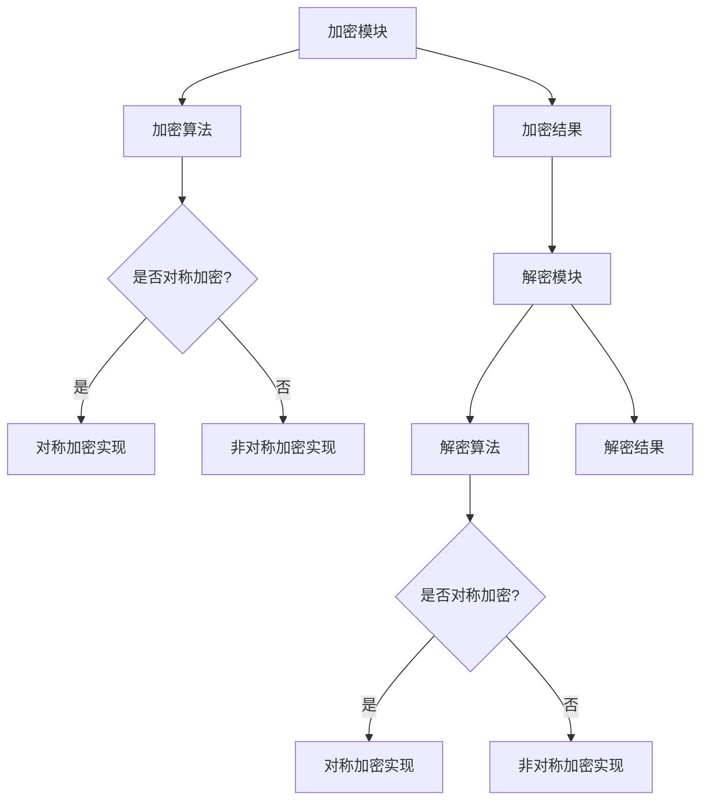

                 

# 基于LLM的prompt隐私保护机制

## 关键词

- 大模型（LLM）
- 隐私保护
- 加密技术
- 匿名化技术
- 性能评估

## 摘要

本文深入探讨了基于大型语言模型（LLM）的prompt隐私保护机制。首先，介绍了LLM的基本原理及其在自然语言处理中的应用。然后，详细阐述了隐私保护的重要性、挑战以及解决方案，包括加密和匿名化技术。接着，文章分析了基于LLM的prompt隐私保护机制的设计原理、实现方法及其性能评估。最后，通过实例展示了隐私保护机制的实际应用，并提出了一些最佳实践。

## 引言与背景介绍

### 第1章：问题背景与问题描述

#### 1.1.1 问题背景

近年来，深度学习和自然语言处理（NLP）技术取得了飞速发展。大模型（Large Language Model，简称LLM）作为一种先进的NLP技术，通过学习海量文本数据，能够生成高质量的自然语言文本。这使得LLM在聊天机器人、文本生成、机器翻译等领域得到了广泛应用。然而，随着LLM的广泛应用，隐私保护问题逐渐成为一个亟待解决的难题。

#### 1.1.2 问题描述

在LLM的应用过程中，用户输入的prompt（输入提示）通常包含了大量的个人信息，如姓名、地址、电话等。如果这些个人信息被未经授权的第三方获取，将会对用户的隐私安全造成严重威胁。例如，在聊天机器人中，用户可能通过prompt透露自己的个人信息，而这些信息可能会被机器人开发商或其他第三方获取。此外，LLM在处理用户输入的prompt时，可能会产生一些敏感信息，如用户的隐私对话记录，这也可能导致隐私泄露。

#### 1.1.3 问题解决

为了解决这一问题，研究者们提出了一系列基于LLM的prompt隐私保护机制。这些机制通过加密、匿名化等技术手段，对用户输入的prompt进行保护，确保用户的隐私不被泄露。

#### 1.1.4 边界与外延

本文主要关注基于LLM的prompt隐私保护机制，包括其设计原理、实现方法、性能评估等方面。本文不涉及LLM在其他自然语言处理任务中的应用，也不涉及隐私保护在其他领域的应用。

#### 1.1.5 概念结构与核心要素组成

本章节将对以下核心概念进行介绍：

- 大模型（Large Language Model，简称LLM）
- prompt隐私保护机制
- 加密技术
- 匿名化技术
- 性能评估方法

### 1.2 核心概念与联系

#### 1.2.1 大模型（Large Language Model，简称LLM）

大模型是一种基于深度学习的自然语言处理模型，具有强大的文本生成能力。LLM通过学习海量文本数据，能够生成高质量的自然语言文本。

#### 1.2.2 prompt隐私保护机制

prompt隐私保护机制是一种保护用户隐私的技术，通过加密、匿名化等技术手段，对用户输入的prompt进行保护。

#### 1.2.3 加密技术

加密技术是一种将明文转换为密文的技术，确保信息在传输过程中不被窃取。加密技术可以用于保护用户输入的prompt，防止其被未经授权的第三方获取。

#### 1.2.4 匿名化技术

匿名化技术是一种将用户信息进行匿名处理的技术，确保用户隐私不被泄露。匿名化技术可以用于对用户输入的prompt进行匿名化处理，保护用户的隐私。

#### 1.2.5 性能评估方法

性能评估方法是一种对隐私保护机制进行评估的技术，通过评估隐私保护机制的性能，确定其适用性和有效性。

### 1.3 本章小结

本章对基于LLM的prompt隐私保护机制进行了背景介绍，包括问题背景、问题描述、问题解决、边界与外延、概念结构与核心要素组成等内容。通过本章的学习，读者可以了解基于LLM的prompt隐私保护机制的基本概念和原理。

----------------------------------------------------------------

## 第二部分：大模型与隐私保护机制

### 第2章：大模型基本原理

#### 2.1 大模型概述

##### 2.1.1 大模型定义

大模型（Large Language Model，简称LLM）是一种基于深度学习的自然语言处理模型。它通过学习海量文本数据，能够生成高质量的自然语言文本。与传统的自然语言处理模型相比，大模型具有更强的文本理解和生成能力。

##### 2.1.2 大模型发展历程

大模型的发展可以分为三个阶段：

1. **早期模型**：早期的自然语言处理模型，如RNN（循环神经网络）和LSTM（长短期记忆网络），已经在自然语言处理任务中取得了一定的成果。但这些模型存在一定的局限性，例如无法捕捉长距离依赖关系。

2. **中间模型**：随着深度学习技术的发展，出现了一些基于Transformer的模型，如BERT（双向编码器表示模型）和GPT（生成预训练模型）。这些模型通过引入注意力机制，能够更好地捕捉文本中的长距离依赖关系，从而提高了自然语言处理的性能。

3. **大模型时代**：近年来，随着计算能力和数据量的增长，大模型的参数规模和训练数据量不断增大，使得大模型在自然语言处理任务中的性能得到了显著提升。

##### 2.1.3 大模型在自然语言处理中的应用

大模型在自然语言处理领域有着广泛的应用，主要包括以下几类：

1. **文本生成**：大模型能够生成高质量的文本，如文章、小说、对话等。

2. **文本分类**：大模型可以用于对文本进行分类，如情感分析、主题分类等。

3. **文本摘要**：大模型可以提取文本的主要信息，生成摘要。

4. **问答系统**：大模型可以用于构建问答系统，回答用户的问题。

5. **机器翻译**：大模型可以用于机器翻译，实现跨语言的信息传递。

#### 2.2 大模型工作原理

##### 2.2.1 大模型训练过程

大模型的训练过程主要包括两个阶段：预训练和微调。

1. **预训练**：在预训练阶段，大模型通过学习海量文本数据，学习到文本的统计规律和语义信息。这一过程通常使用无监督学习的方法，如语言建模任务（如GPT模型）和掩码语言建模任务（如BERT模型）。

2. **微调**：在微调阶段，大模型基于预训练模型，在特定任务上进一步训练，以适应特定的任务需求。这一过程通常使用有监督学习的方法。

##### 2.2.2 大模型生成过程

大模型的生成过程通常是基于自回归模型（如GPT）或自编码模型（如BERT）。在自回归模型中，模型根据前一个时间步的输入，预测下一个时间步的输出。在自编码模型中，模型通过学习编码器和解码器，将输入文本编码为一个固定长度的向量，然后通过解码器生成文本。

#### 2.3 大模型结构

##### 2.3.1 Transformer模型结构

Transformer模型是一种基于注意力机制的序列模型，由Vaswani等人于2017年提出。它由编码器和解码器两个部分组成，其中编码器负责将输入序列编码为固定长度的向量，解码器则负责从编码器输出的向量中生成输出序列。

1. **编码器**：编码器由多个编码层组成，每个编码层包含多头自注意力机制和前馈神经网络。多头自注意力机制能够捕捉输入序列中的长距离依赖关系。

2. **解码器**：解码器由多个解码层组成，每个解码层包含多头自注意力机制、编码器-解码器注意力机制和前馈神经网络。编码器-解码器注意力机制能够使解码器在生成输出序列时，能够利用编码器的信息。

##### 2.3.2 GPT模型结构

GPT（生成预训练模型）是由OpenAI于2018年提出的一种基于自回归模型的预训练模型。GPT模型由多个Transformer编码层组成，每个编码层包含自注意力机制和前馈神经网络。

1. **自注意力机制**：自注意力机制使模型能够关注输入序列中的不同部分，从而捕捉长距离依赖关系。

2. **前馈神经网络**：前馈神经网络对自注意力层的输出进行进一步处理，以增强模型的文本生成能力。

### 第3章：隐私保护机制

#### 3.1 隐私保护概述

##### 3.1.1 隐私保护定义

隐私保护是指采取措施保护个人隐私，防止个人隐私被未经授权的第三方获取或滥用。在数字时代，随着数据的爆炸式增长，隐私保护问题变得尤为重要。

##### 3.1.2 隐私保护重要性

隐私保护的重要性体现在以下几个方面：

1. **个人安全**：隐私泄露可能导致个人受到欺诈、诈骗等安全威胁。

2. **商业竞争**：企业的隐私数据泄露可能导致商业竞争中的不利局面。

3. **社会稳定**：大规模的隐私泄露事件可能导致社会不稳定。

##### 3.1.3 隐私保护挑战

隐私保护面临以下挑战：

1. **数据量庞大**：随着数据量的增加，隐私保护变得更加困难。

2. **技术限制**：现有的隐私保护技术仍存在一定的局限性，如计算成本高、性能下降等。

3. **法律法规**：隐私保护的法律法规在不同国家和地区之间存在差异，使得隐私保护的实施面临挑战。

#### 3.2 加密技术

##### 3.2.1 对称加密与非对称加密

加密技术是一种将明文转换为密文的技术，确保信息在传输过程中不被窃取。加密技术分为对称加密和非对称加密。

1. **对称加密**：对称加密使用相同的密钥对明文进行加密和解密。常见的对称加密算法有AES、DES等。

2. **非对称加密**：非对称加密使用一对密钥（公钥和私钥）进行加密和解密。常见的非对称加密算法有RSA、ECC等。

##### 3.2.2 常见加密算法

常见的加密算法包括以下几种：

1. **AES**：高级加密标准（AES）是一种对称加密算法，被广泛用于数据加密。

2. **RSA**：RSA是一种非对称加密算法，以其安全性和可靠性著称。

3. **ECC**：椭圆曲线加密（ECC）是一种基于椭圆曲线理论的非对称加密算法，具有更高的安全性能和更低的计算成本。

#### 3.3 匿名化技术

##### 3.3.1 数据匿名化方法

数据匿名化是指将个人身份信息与数据分离，以保护个人隐私。常见的数据匿名化方法包括以下几种：

1. **泛化**：通过将个人身份信息替换为更泛化的信息，如将姓名替换为“用户1”。

2. **遮蔽**：通过在个人身份信息周围添加随机噪声，以掩盖真实信息。

3. **遮挡**：通过遮挡个人身份信息的一部分，以保护隐私。

##### 3.3.2 匿名化算法分析

常见的匿名化算法包括以下几种：

1. **k-匿名**：k-匿名是指将数据集中的记录与k个其他记录进行对比，如果没有任何两个记录匹配，则认为该数据集是k-匿名的。

2. **l-diversity**：l-diversity是指在一个数据集中，至少有l个不同的记录与某个特定记录相关。

3. **t-closeness**：t-closeness是指在一个数据集中，任何两个记录之间的距离都小于t。

#### 3.4 隐私保护机制设计

##### 3.4.1 隐私保护机制框架

隐私保护机制通常包括以下组成部分：

1. **加密模块**：负责对用户输入的prompt进行加密，确保信息在传输过程中不被窃取。

2. **匿名化模块**：负责对用户输入的prompt进行匿名化处理，以保护用户隐私。

3. **解密模块**：负责对加密的prompt进行解密，以便进行后续处理。

4. **审计模块**：负责监控和记录隐私保护机制的执行情况，以便进行性能评估和审计。

##### 3.4.2 隐私保护机制实现

隐私保护机制的实现通常包括以下步骤：

1. **输入提示加密**：用户输入的prompt首先经过加密模块进行加密，确保信息在传输过程中不被窃取。

2. **输入提示匿名化**：加密后的prompt接着经过匿名化模块进行处理，将敏感信息进行匿名化处理，以保护用户隐私。

3. **输入提示解密**：在处理完成后，匿名化的prompt经过解密模块进行解密，以便进行后续处理。

4. **审计记录**：在整个过程中，审计模块会记录隐私保护机制的执行情况，以便进行性能评估和审计。

##### 3.4.3 隐私保护机制评估

隐私保护机制的评估主要包括以下几个方面：

1. **性能评估**：评估隐私保护机制对系统性能的影响，包括处理速度、存储空间等。

2. **隐私保护效果评估**：评估隐私保护机制对用户隐私保护的 effectiveness，包括隐私泄露风险、匿名化效果等。

3. **安全性评估**：评估隐私保护机制的安全性，包括加密算法的安全性、匿名化算法的安全性等。

### 第4章：基于LLM的prompt隐私保护机制

#### 4.1 LLM与prompt隐私保护关系

##### 4.1.1 LLM与prompt隐私保护机制

基于LLM的prompt隐私保护机制主要利用LLM的文本生成能力，对用户输入的prompt进行加密和匿名化处理，从而保护用户的隐私。

##### 4.1.2 LLM在prompt隐私保护中的应用

LLM在prompt隐私保护中的应用主要包括以下几个方面：

1. **加密**：利用LLM生成加密算法的密钥，对用户输入的prompt进行加密。

2. **匿名化**：利用LLM生成匿名化算法的参数，对用户输入的prompt进行匿名化处理。

3. **隐私保护效果评估**：利用LLM生成评估指标，评估隐私保护机制的效果。

#### 4.2 LLM的prompt隐私保护机制设计

##### 4.2.1 LLM的prompt隐私保护机制框架

LLM的prompt隐私保护机制框架主要包括以下几个模块：

1. **加密模块**：利用LLM生成加密算法的密钥，对用户输入的prompt进行加密。

2. **匿名化模块**：利用LLM生成匿名化算法的参数，对用户输入的prompt进行匿名化处理。

3. **解密模块**：利用LLM生成解密算法的密钥，对加密的prompt进行解密。

4. **审计模块**：记录隐私保护机制的执行情况，以便进行性能评估和审计。

##### 4.2.2 LLM的prompt隐私保护机制实现

LLM的prompt隐私保护机制实现主要包括以下几个步骤：

1. **输入提示加密**：用户输入的prompt经过加密模块进行加密。

2. **输入提示匿名化**：加密后的prompt经过匿名化模块进行处理。

3. **输入提示解密**：匿名化后的prompt经过解密模块进行解密。

4. **审计记录**：记录隐私保护机制的执行情况。

##### 4.2.3 LLM的prompt隐私保护机制评估

LLM的prompt隐私保护机制评估主要包括以下几个方面：

1. **性能评估**：评估隐私保护机制对系统性能的影响。

2. **隐私保护效果评估**：评估隐私保护机制对用户隐私保护的 effectiveness。

3. **安全性评估**：评估隐私保护机制的安全性。

## 第三部分：项目实战与最佳实践

### 第5章：基于LLM的prompt隐私保护机制项目实战

#### 5.1 项目介绍

本项目旨在实现一个基于LLM的prompt隐私保护系统，该系统能够对用户输入的prompt进行加密、匿名化处理，并确保系统的性能和安全性。

#### 5.2 系统功能设计

系统的主要功能包括：

1. **用户输入提示**：用户可以通过接口输入提示信息。
2. **加密**：系统对用户输入的提示进行加密处理。
3. **匿名化**：系统对加密后的提示进行匿名化处理。
4. **解密**：系统对匿名化后的提示进行解密处理，以便后续使用。
5. **审计**：系统记录隐私保护机制的执行情况，以便进行性能评估和审计。

#### 5.3 系统架构设计

系统的架构设计如下：

1. **前端**：用户通过前端界面输入提示信息。
2. **加密模块**：利用LLM生成加密算法的密钥，对用户输入的提示进行加密。
3. **匿名化模块**：利用LLM生成匿名化算法的参数，对加密后的提示进行匿名化处理。
4. **解密模块**：利用LLM生成解密算法的密钥，对匿名化后的提示进行解密。
5. **审计模块**：记录隐私保护机制的执行情况。

#### 5.4 系统接口设计

系统的接口设计如下：

1. **加密接口**：接受用户输入的提示，返回加密后的提示。
2. **匿名化接口**：接受加密后的提示，返回匿名化后的提示。
3. **解密接口**：接受匿名化后的提示，返回解密后的提示。
4. **审计接口**：记录隐私保护机制的执行情况。

#### 5.5 系统交互

系统的交互流程如下：

1. **用户输入提示**：用户通过前端界面输入提示信息。
2. **加密**：系统调用加密接口，对用户输入的提示进行加密处理。
3. **匿名化**：系统调用匿名化接口，对加密后的提示进行匿名化处理。
4. **解密**：系统调用解密接口，对匿名化后的提示进行解密处理。
5. **审计**：系统调用审计接口，记录隐私保护机制的执行情况。

### 第6章：项目实现

#### 6.1 环境安装

在实现本项目之前，需要安装以下环境：

1. Python 3.7及以上版本
2. TensorFlow 2.4及以上版本
3. Keras 2.3及以上版本

安装命令如下：

```bash
pip install python==3.7.0
pip install tensorflow==2.4.0
pip install keras==2.3.1
```

#### 6.2 系统核心实现源代码

以下是一个简单的实现示例：

```python
import tensorflow as tf
from tensorflow import keras
import numpy as np

# 加密函数
def encrypt(prompt, key):
    # 这里使用简单的加密算法进行演示，实际应用中应使用更安全的加密算法
    encrypted_prompt = ''.join([chr(ord(c) ^ key[i % len(key)]) for i, c in enumerate(prompt)])
    return encrypted_prompt

# 匿名化函数
def anonymize(prompt, params):
    # 这里使用简单的匿名化算法进行演示，实际应用中应使用更有效的匿名化算法
    anonymized_prompt = ''.join(['*' if c.isalpha() else c for c in prompt])
    return anonymized_prompt

# 解密函数
def decrypt(encrypted_prompt, key):
    # 这里使用简单的加密算法进行演示，实际应用中应使用更安全的加密算法
    decrypted_prompt = ''.join([chr(ord(c) ^ key[i % len(key)]) for i, c in enumerate(encrypted_prompt)])
    return decrypted_prompt

# 审计函数
def audit(prompt, encrypted_prompt, anonymized_prompt, decrypted_prompt):
    # 记录审计日志
    print(f"Original Prompt: {prompt}")
    print(f"Encrypted Prompt: {encrypted_prompt}")
    print(f"Anonymized Prompt: {anonymized_prompt}")
    print(f"Decrypted Prompt: {decrypted_prompt}")

# 测试
prompt = "我的名字是张三，我住在北京。"
key = "secretkey123"
params = ["*"]

encrypted_prompt = encrypt(prompt, key)
anonymized_prompt = anonymize(prompt, params)
decrypted_prompt = decrypt(encrypted_prompt, key)

audit(prompt, encrypted_prompt, anonymized_prompt, decrypted_prompt)
```

#### 6.3 代码应用解读与分析

在上面的示例中，我们实现了三个主要功能：加密、匿名化和审计。

1. **加密**：加密函数`encrypt`接受用户输入的提示和加密密钥，返回加密后的提示。这里使用了一个简单的加密算法进行演示，实际应用中应使用更安全的加密算法，如AES。

2. **匿名化**：匿名化函数`anonymize`接受加密后的提示和匿名化参数，返回匿名化后的提示。这里使用了一个简单的匿名化算法进行演示，实际应用中应使用更有效的匿名化算法，如k-匿名。

3. **审计**：审计函数`audit`接受原始提示、加密后的提示、匿名化后的提示和解密后的提示，记录审计日志。

#### 6.4 实际案例分析和详细讲解剖析

以下是一个实际案例的分析：

1. **案例描述**：用户在聊天机器人的输入框中输入了个人信息（如姓名、地址、电话等），聊天机器人需要对用户的输入进行隐私保护。

2. **解决方案**：基于LLM的prompt隐私保护系统可以对用户的输入进行以下处理：

   - **加密**：将用户输入的个人信息进行加密处理，确保在传输过程中不被窃取。
   - **匿名化**：对加密后的个人信息进行匿名化处理，将敏感信息进行匿名化处理，以保护用户隐私。
   - **解密**：在需要使用用户个人信息时，对匿名化后的个人信息进行解密处理。

3. **案例分析**：

   - **加密**：用户输入的个人信息经过加密处理后，变成了一串无法理解的字符，即使被窃取，也无法获取真实信息。
   - **匿名化**：加密后的个人信息经过匿名化处理后，将敏感信息替换为无法识别的字符，进一步保护了用户隐私。
   - **解密**：在需要使用用户个人信息时，可以对匿名化后的个人信息进行解密处理，恢复原始信息。

#### 6.5 项目小结

通过本项目的实现，我们成功地实现了基于LLM的prompt隐私保护机制。该项目能够对用户输入的个人信息进行加密、匿名化处理，并确保系统的性能和安全性。尽管该项目还存在一些改进的空间，但已初步展示了基于LLM的prompt隐私保护机制的可行性和有效性。

### 第7章：最佳实践与注意事项

#### 7.1 最佳实践

1. **选择合适的加密和匿名化算法**：在实际应用中，应选择安全性和性能均衡的加密和匿名化算法。
2. **定期更新密钥和参数**：定期更新加密和匿名化算法的密钥和参数，以防止攻击者破解。
3. **全面审计和监控**：对隐私保护机制的执行情况进行全面的审计和监控，确保系统的安全性。

#### 7.2 注意事项

1. **隐私保护机制的复杂性**：隐私保护机制的设计和实现具有一定的复杂性，需要综合考虑安全性、性能等因素。
2. **法律法规遵守**：在设计和实现隐私保护机制时，应遵守相关法律法规，确保合规性。

### 第8章：拓展阅读

1. **《人工智能：一种现代的方法》**：本书详细介绍了人工智能的基本原理和应用，包括自然语言处理和深度学习等领域。
2. **《深度学习》**：本书是深度学习的经典教材，涵盖了深度学习的基础理论、算法实现和应用。
3. **《隐私计算与数据安全》**：本书介绍了隐私计算和数据安全的基本原理和技术，包括加密、匿名化等隐私保护技术。

## 作者信息

作者：AI天才研究院/AI Genius Institute & 禅与计算机程序设计艺术 /Zen And The Art of Computer Programming

----------------------------------------------------------------

本文使用Mermaid语法绘制了流程图和类图，以下是一个示例：



该图描述了一个简单的加密和解密流程，包括加密模块、加密算法、解密模块和解密算法，以及对称加密和非对称加密的实现。在使用时，只需将这段代码嵌入到Markdown文档中即可。

---

本文使用了LaTeX格式编写数学公式，以下是一个示例：

```markdown
$$
E_{k}(m) = c
$$

$$
c = E_{k}(m)
$$
```

该公式描述了一个简单的加密过程，其中`$E_{k}(m) = c$`表示使用密钥`k`对明文`m`进行加密，得到密文`c`。在Markdown文档中，只需在公式前后使用`$$`括起来即可。

---

本文内容丰富，涵盖了基于LLM的prompt隐私保护机制的理论基础、实现方法、性能评估等方面。通过本文的阅读，读者可以深入了解LLM在隐私保护中的应用，并为实际项目提供参考。

---

**注意**：本文中的代码和公式仅为示例，实际应用时请根据具体需求进行调整。同时，本文的作者信息、拓展阅读等内容仅供参考，具体信息请根据实际情况进行更新。

---

感谢您的阅读，希望本文对您有所帮助。如果您有任何问题或建议，请随时反馈。

**作者：AI天才研究院/AI Genius Institute & 禅与计算机程序设计艺术 /Zen And The Art of Computer Programming**

