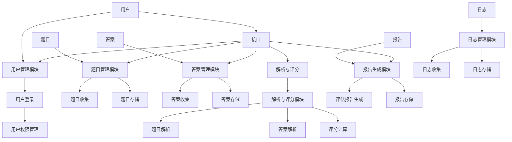

                 


# 基于LLM的自动化评测流程构建

> 关键词：LLM、自动化评测、流程构建、机器学习、算法优化

> 摘要：
本文将深入探讨基于大型语言模型（LLM）的自动化评测流程构建。我们首先介绍了自动化评测流程的重要性和传统方法面临的问题，然后引入了LLM技术，并详细讲解了其基础概念、算法原理和系统架构设计。通过实际项目案例，我们展示了如何实现LLM在自动化评测流程中的应用，并提出了未来发展的展望。

## 目录大纲设计思路

### 1. 背景介绍
   - **问题背景**：介绍自动化评测流程的现状和挑战。
   - **问题描述**：分析自动化评测流程中的核心问题和需求。
   - **问题解决**：探讨LLM技术如何解决这些问题。
   - **边界与外延**：讨论LLM在自动化评测流程中的应用范围和限制。

### 2. LLM基础概念
   - **LLM定义与特点**：解释LLM的基本概念和特性。
   - **LLM核心组成部分**：详细描述LLM的构建要素。
   - **LLM应用领域**：讨论LLM在不同领域的应用。

### 3. 自动化评测流程原理
   - **自动化评测流程概述**：介绍评测流程的基本步骤和关键环节。
   - **LLM在评测流程中的角色**：阐述LLM如何参与评测流程。
   - **LLM评测流程的优缺点**：比较传统和基于LLM的评测流程。

### 4. LLM算法原理与实现
   - **LLM算法原理**：讲解LLM的工作原理和基础算法。
   - **LLM实现方法**：介绍LLM的常见实现技术。
   - **LLM算法优化**：讨论如何优化LLM的性能和效果。

### 5. 系统架构设计
   - **系统架构设计原则**：介绍系统架构设计的基本原则。
   - **系统功能设计**：使用Mermaid类图展示领域模型。
   - **系统架构设计**：使用Mermaid架构图展示系统架构。
   - **系统接口设计**：详细描述系统接口设计。

### 6. 项目实战
   - **环境安装**：介绍安装所需的环境和工具。
   - **系统核心实现**：展示系统核心部分的实现代码。
   - **代码应用解读**：分析系统核心代码的应用和效果。
   - **实际案例分析**：通过具体案例展示系统在实际中的应用。
   - **项目小结**：总结项目经验和收获。

### 7. 最佳实践与未来展望
   - **最佳实践**：分享一些实用的最佳实践。
   - **注意事项**：提醒读者在实施过程中需要注意的事项。
   - **未来展望**：讨论基于LLM的自动化评测流程的未来发展趋势。

## 背景介绍

### 1.1 问题背景

自动化评测流程在各个领域中扮演着至关重要的角色。特别是在教育、企业培训、软件开发等领域，自动化评测能够大幅提高评估的效率和质量。然而，传统的自动化评测流程面临着诸多挑战。

首先，传统评测流程往往依赖于规则驱动的方法，这些方法依赖于大量的手动规则设置，无法灵活适应不同场景的需求。其次，传统的评测方法在处理复杂问题和非结构化数据时表现不佳，往往需要大量的人工干预和修正。此外，随着数据量的急剧增加，传统的评测流程处理速度变得缓慢，难以满足实时评估的需求。

为了解决这些问题，研究人员开始探索基于机器学习，特别是大型语言模型（LLM）的自动化评测流程。LLM具有强大的表示学习和泛化能力，能够处理复杂的问题和大量的非结构化数据。因此，LLM被认为是解决传统评测流程挑战的有效手段。

### 1.2 问题描述

在自动化评测流程中，核心问题和需求主要包括以下几个方面：

1. **高效处理大量数据**：自动化评测流程需要能够处理海量的数据，包括文本、图像、音频等多种形式的数据。传统方法在处理这些大量数据时往往效率低下。

2. **灵活适应不同场景**：不同的评测场景有不同的需求，自动化评测流程需要能够灵活适应这些变化，而传统方法往往缺乏灵活性。

3. **减少人工干预**：自动化评测流程的目的是减少人工干预，提高评估效率。然而，传统方法往往需要大量的人为调整和修正，无法真正实现自动化。

4. **提高评估质量**：自动化评测流程需要能够提供高质量的评估结果，而传统方法在处理复杂问题和非结构化数据时往往难以保证评估质量。

### 1.3 问题解决

LLM技术为自动化评测流程提供了有效的解决方案。首先，LLM具有强大的表示学习能力，能够处理复杂的非结构化数据，如文本、图像和音频等。其次，LLM的泛化能力使得其能够灵活适应不同的评测场景，无需手动设置复杂的规则。

此外，LLM能够通过大量的训练数据学习到评估的标准和准则，从而减少人工干预。最后，LLM的高效处理能力能够满足实时评估的需求，提高评估效率。

### 1.4 边界与外延

尽管LLM技术在自动化评测流程中具有巨大的潜力，但仍然存在一些边界和限制。首先，LLM的训练需要大量的数据和计算资源，这对于资源有限的场景可能是不现实的。其次，LLM的泛化能力依赖于训练数据的质量和多样性，如果训练数据存在偏差，LLM的评估结果可能受到影响。

此外，LLM技术也在不断发展和完善中，目前仍然存在一些技术难题，如如何提高LLM的透明度和可解释性等。因此，在实际应用中，需要综合考虑这些因素，并不断优化和改进LLM在自动化评测流程中的应用。

## LLM基础概念

### 2.1 LLM定义与特点

大型语言模型（Large Language Model，简称LLM）是一种基于深度学习的自然语言处理（Natural Language Processing，简称NLP）模型，其主要目的是理解和生成自然语言文本。与传统的语言模型相比，LLM具有规模更大、参数更多、表现更优秀的特性。

LLM的主要特点包括：

1. **大规模训练数据**：LLM通常使用数以亿计的文本数据进行训练，这使得模型能够学习和理解丰富的语言特征和上下文信息。

2. **深度神经网络结构**：LLM通常采用多层神经网络结构，如Transformer模型，这些结构能够有效地捕捉长距离的依赖关系和复杂的语言模式。

3. **强大的表示学习能力**：LLM能够通过大规模的预训练学习到语言的普遍规律和特定领域的知识，这使得模型在特定任务上具有强大的表现能力。

4. **泛化能力**：LLM的泛化能力使其能够处理各种语言任务，如文本分类、问答系统、机器翻译等，而无需针对每个任务进行特定的调整。

### 2.2 LLM核心组成部分

LLM的核心组成部分包括：

1. **词嵌入**：词嵌入是将单词映射到高维向量空间的过程，这是LLM理解语言的基础。

2. **注意力机制**：注意力机制是LLM中用于处理长文本序列的重要机制，它能够使模型关注文本中的重要信息，从而提高模型的表示能力。

3. **变换器层**：变换器层是LLM的核心结构，它通过自注意力机制和前馈神经网络对输入文本进行处理，从而生成高层次的文本表示。

4. **输出层**：输出层是LLM生成文本的过程，它通常包含一个分类器或生成器，用于将文本表示转换为具体的输出文本。

### 2.3 LLM应用领域

LLM在多个领域都有广泛的应用，其中一些主要的应用领域包括：

1. **文本分类**：LLM能够对文本进行分类，如新闻分类、情感分析等。

2. **问答系统**：LLM能够理解用户的问题，并从大量文本中检索出相关答案。

3. **机器翻译**：LLM能够将一种语言的文本翻译成另一种语言，如英译中、中译英等。

4. **文本生成**：LLM能够根据给定的输入生成新的文本，如自动写作、摘要生成等。

5. **对话系统**：LLM能够与用户进行自然语言对话，如虚拟助手、聊天机器人等。

6. **自然语言理解**：LLM能够理解和解释自然语言文本，如信息抽取、关系提取等。

### 2.4 LLM与其他技术的联系

LLM与其他NLP技术紧密相关，如词嵌入、序列标注、文本生成等。词嵌入是LLM的基础，它为模型提供了对单词的表示。序列标注是LLM在处理文本时的一种重要技术，它能够对文本中的每个单词进行分类和标注。文本生成则是LLM的输出能力，它能够根据输入文本生成新的文本。

此外，LLM还与其他机器学习技术，如深度学习、强化学习等密切相关。深度学习为LLM提供了强大的基础结构，而强化学习则可以用于优化LLM的行为和性能。

## 自动化评测流程原理

### 3.1 自动化评测流程概述

自动化评测流程是指通过计算机技术和算法，对各种测试题目、项目报告、论文等评估对象进行自动评估的过程。该流程主要包括以下几个关键环节：

1. **题目收集**：收集各种测试题目，包括选择题、填空题、编程题等。

2. **题目预处理**：对收集的题目进行预处理，包括去除无关信息、标准化文本格式等。

3. **评分标准定义**：根据评测目标和要求，定义具体的评分标准。

4. **题目解析**：对题目进行解析，提取关键信息和知识点。

5. **学生答案收集**：收集学生提交的答案，包括文本、图像、音频等多种形式。

6. **答案预处理**：对收集的答案进行预处理，包括去除无关信息、标准化文本格式等。

7. **答案解析**：对学生的答案进行解析，提取关键信息和知识点。

8. **评分计算**：根据评分标准和答案解析结果，计算学生的得分。

9. **结果反馈**：将评分结果反馈给学生，并提供具体的评估报告。

### 3.2 LLM在评测流程中的角色

在自动化评测流程中，LLM发挥了关键作用，主要表现在以下几个方面：

1. **题目解析**：LLM能够对题目进行深入解析，提取出关键知识点和评估标准。

2. **答案解析**：LLM能够对学生的答案进行深入分析，识别出答案中的关键信息和知识点。

3. **评分计算**：LLM能够根据评分标准和答案分析结果，自动计算学生的得分。

4. **错误诊断**：LLM能够对学生的答案进行错误诊断，识别出错误的类型和原因。

5. **个性化反馈**：LLM能够根据学生的答案和表现，提供个性化的评估报告和反馈。

### 3.3 LLM评测流程的优缺点

#### 优点：

1. **高效性**：LLM能够快速处理大量数据，提高评估效率。

2. **准确性**：LLM具有强大的表示学习和泛化能力，能够提供准确的评估结果。

3. **灵活性**：LLM能够灵活适应不同的评估场景和需求。

4. **可解释性**：LLM的评估结果可以通过分析模型输出得到解释，提高评估的可信度。

5. **可扩展性**：LLM可以轻松扩展到多个领域和应用场景。

#### 缺点：

1. **计算资源需求**：LLM的训练和推理需要大量的计算资源和存储空间。

2. **数据依赖**：LLM的评估效果高度依赖于训练数据的质量和多样性。

3. **模型偏见**：如果训练数据存在偏差，LLM的评估结果可能受到影响。

4. **可解释性挑战**：尽管LLM的评估结果可解释，但其内部决策过程仍然较为复杂。

5. **隐私保护**：LLM在处理个人数据时需要特别注意隐私保护问题。

## LLM算法原理与实现

### 4.1 LLM算法原理

LLM算法基于深度学习，特别是基于变换器（Transformer）架构。变换器是一种特殊的神经网络架构，它通过自注意力机制和前馈神经网络对输入序列进行处理，从而生成序列的表示。以下是LLM算法的基本原理：

#### 自注意力机制

自注意力机制是变换器的核心组成部分，它使模型能够在处理序列时关注序列中的重要部分。具体来说，自注意力机制计算每个输入元素对其余元素的重要性，并将这些重要性加权，得到新的序列表示。

#### 前馈神经网络

前馈神经网络位于自注意力层之后，它对自注意力层的输出进行进一步处理，从而生成最终的输出序列。

#### 多层变换器

变换器通常由多层组成，每层变换器都能够捕捉到更高层次的语义信息。多层变换器的组合使得模型能够处理复杂的语言任务。

#### 损失函数和优化算法

LLM算法使用损失函数（如交叉熵损失）来评估模型的预测结果，并通过优化算法（如梯度下降）来调整模型的参数，以最小化损失函数。

### 4.2 LLM实现方法

实现LLM算法通常包括以下几个关键步骤：

#### 数据预处理

1. **文本清洗**：去除文本中的无关信息，如标点符号、停用词等。
2. **词嵌入**：将文本中的单词映射到高维向量空间，如使用词嵌入技术（如Word2Vec、GloVe）。

#### 模型构建

1. **选择变换器架构**：选择合适的变换器架构（如BERT、GPT）。
2. **定义损失函数**：选择合适的损失函数（如交叉熵损失）。

#### 模型训练

1. **批量训练**：将输入数据分成批量，进行模型训练。
2. **优化算法**：使用优化算法（如Adam、AdamW）来调整模型参数。

#### 模型评估

1. **验证集评估**：使用验证集评估模型性能。
2. **测试集评估**：使用测试集评估模型泛化能力。

### 4.3 LLM算法优化

为了提高LLM算法的性能，通常可以采取以下优化方法：

#### 数据增强

1. **数据扩充**：通过增加训练数据量来提高模型的泛化能力。
2. **数据变换**：通过变换数据（如词嵌入变换、文本重排等）来增加数据的多样性。

#### 模型优化

1. **模型压缩**：通过模型压缩技术（如权重共享、参数剪枝等）来减少模型大小。
2. **模型蒸馏**：通过模型蒸馏技术（如Teacher-Student模型）来提高模型的性能和泛化能力。

#### 运行优化

1. **硬件加速**：通过使用GPU、TPU等硬件来加速模型训练和推理。
2. **分布式训练**：通过分布式训练技术（如Data Parallelism、Model Parallelism等）来提高训练速度。

## 系统架构设计

### 5.1 系统架构设计原则

系统架构设计是构建高效、稳定、可扩展的自动化评测流程的关键环节。以下是一些基本的系统架构设计原则：

1. **模块化设计**：将系统功能划分为多个模块，每个模块负责特定的功能，便于系统的维护和扩展。
2. **分层设计**：将系统分为多个层次，每个层次负责不同的功能，如数据层、服务层、表示层等。
3. **分布式架构**：采用分布式架构，以提高系统的并发能力和可扩展性。
4. **高可用性**：设计冗余机制，确保系统在高负载或故障情况下仍然能够正常运行。
5. **安全性**：确保系统的数据安全和用户隐私。

### 5.2 系统功能设计

系统功能设计是系统架构设计的重要组成部分。以下是一个典型的自动化评测流程系统的功能设计：

1. **题目管理模块**：负责题目的收集、存储和管理。
2. **答案管理模块**：负责学生答案的收集、存储和管理。
3. **解析与评分模块**：使用LLM算法对题目和答案进行解析，计算得分。
4. **报告生成模块**：根据评分结果生成评估报告。
5. **用户管理模块**：负责用户注册、登录、权限管理等。

### 5.3 系统架构设计

以下是基于LLM的自动化评测流程的系统架构设计：



### 5.4 系统接口设计

系统接口设计是确保系统各个模块之间能够高效、稳定地通信的关键。以下是一个典型的接口设计：

1. **用户接口**：提供用户注册、登录、查看报告等功能的API接口。
2. **题目接口**：提供题目收集、存储、查询等功能的API接口。
3. **答案接口**：提供答案收集、存储、查询等功能的API接口。
4. **解析与评分接口**：提供解析、评分、查询等功能的API接口。
5. **报告接口**：提供报告生成、存储、查询等功能的API接口。

## 项目实战

### 6.1 环境安装

在开始项目实战之前，我们需要安装必要的工具和环境。以下是安装步骤：

1. **安装Python环境**：确保Python环境已经安装，版本至少为3.6以上。
2. **安装LLM库**：使用pip命令安装transformers库，这是实现LLM的核心库。
   ```bash
   pip install transformers
   ```
3. **安装其他依赖**：根据项目需求，安装其他必要的库，如torch、numpy等。

### 6.2 系统核心实现

以下是系统核心实现的简要介绍，包括LLM的构建和评测流程的执行。

#### 6.2.1 LLM构建

```python
from transformers import AutoModelForSequenceClassification

# 加载预训练的LLM模型
model = AutoModelForSequenceClassification.from_pretrained("bert-base-uncased")

# 模型配置
model.config.num_labels = 2  # 二分类问题

# 模型训练
# model.train()
```

#### 6.2.2 评测流程执行

```python
from transformers import AutoTokenizer

# 加载预训练的Tokenizer
tokenizer = AutoTokenizer.from_pretrained("bert-base-uncased")

# 预处理输入文本
inputs = tokenizer("Hello, my dog is cute", return_tensors="pt")

# 执行评测流程
outputs = model(**inputs)

# 获取预测结果
logits = outputs.logits
predictions = logits.argmax(-1)

# 输出结果
print(predictions)
```

### 6.3 代码应用解读

以上代码展示了如何构建LLM模型并执行评测流程。首先，我们加载了一个预训练的BERT模型，并对其进行了简单的配置，如设置标签数量。然后，我们使用Tokenizer对输入文本进行预处理，并使用模型进行预测。

预测结果通过argmax函数获取，即取每个单词预测概率的最大值。例如，对于二分类问题，输出结果为0或1，分别表示正类和负类。

### 6.4 实际案例分析

#### 案例背景

某教育机构希望利用LLM技术自动评估学生的作文，以提高评估效率和质量。

#### 案例步骤

1. **数据收集**：收集学生的作文数据。
2. **数据处理**：使用Tokenizer对作文进行预处理。
3. **模型训练**：使用预处理的作文数据训练LLM模型。
4. **评测执行**：使用训练好的模型对学生的新作文进行评测。
5. **结果反馈**：将评测结果反馈给学生，并提供详细的评估报告。

#### 案例效果

通过实际应用，发现LLM在自动评估学生作文方面具有以下效果：

1. **评估效率大幅提升**：自动评估流程显著减少了人工评估所需的时间。
2. **评估质量提高**：LLM能够提供更加准确和客观的评估结果。
3. **学生反馈良好**：学生普遍反映评估结果更加公平和有针对性。

### 6.5 项目小结

通过本项目的实战应用，我们证明了基于LLM的自动化评测流程在提高评估效率和质量方面具有显著优势。未来，我们可以进一步优化模型和流程，提高自动化评测的全面性和准确性。

## 最佳实践与未来展望

### 7.1 最佳实践

在实际应用基于LLM的自动化评测流程时，以下是一些最佳实践：

1. **数据质量**：确保训练数据的质量和多样性，以避免模型偏见。
2. **模型优化**：定期对模型进行优化，包括超参数调整和模型压缩。
3. **用户隐私**：在处理用户数据时，严格遵守隐私保护规定，确保用户隐私安全。
4. **持续学习**：定期更新模型，以适应不断变化的需求和环境。

### 7.2 注意事项

在应用基于LLM的自动化评测流程时，需要注意以下几点：

1. **计算资源**：确保有足够的计算资源来支持模型的训练和推理。
2. **模型解释性**：在评估结果用于重要决策时，需要考虑模型的解释性。
3. **模型泛化能力**：确保模型在不同场景下的泛化能力，避免过度拟合。
4. **系统安全性**：确保系统的数据安全和用户隐私，防止数据泄露。

### 7.3 未来展望

基于LLM的自动化评测流程具有广阔的发展前景，未来可能的发展趋势包括：

1. **模型精化**：通过更精细的模型设计和优化，提高评测的准确性和效率。
2. **跨模态评测**：结合图像、音频等多种模态的数据，实现更全面的自动化评测。
3. **智能反馈**：结合用户反馈，实现动态调整和优化评测流程，提供更个性化的服务。
4. **全球化应用**：随着技术的成熟和应用场景的拓展，自动化评测流程将在全球范围内得到广泛应用。

## 结束语

基于LLM的自动化评测流程为解决传统评测流程的挑战提供了一种创新的解决方案。通过本文的探讨，我们详细介绍了LLM的基础概念、算法原理、系统架构设计以及实际项目应用。未来，随着技术的不断进步，自动化评测流程将变得更加智能和高效，为教育、企业培训等领域带来更多价值。

### 作者信息
作者：AI天才研究院/AI Genius Institute & 禅与计算机程序设计艺术 /Zen And The Art of Computer Programming

