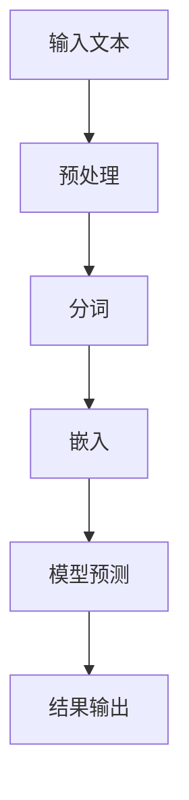
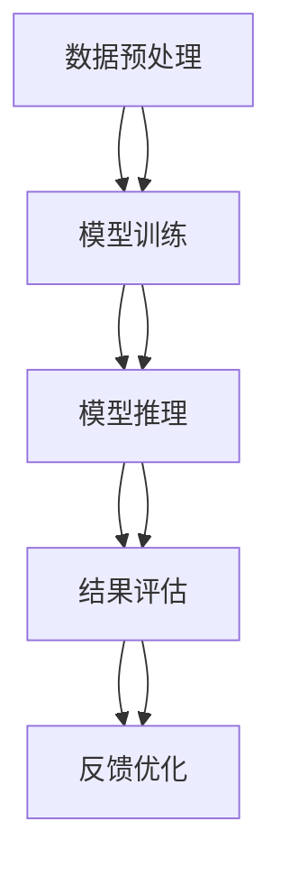
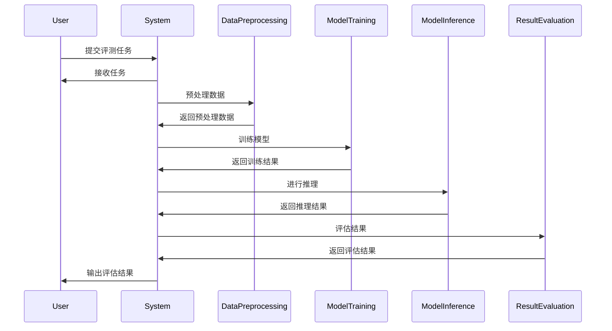

                 

# 基于LLM的评测系统：大模型产品质量的新标准

> 关键词：大模型评测，LLM，产品质量，算法原理，系统架构，项目实战

> 摘要：随着人工智能技术的飞速发展，大模型（LLM）的应用越来越广泛。然而，如何确保这些大模型的产品质量成为了一个亟待解决的问题。本文将介绍一种基于LLM的评测系统，通过深入剖析算法原理、系统架构和项目实战，探索大模型产品质量的新标准。

## 1. 背景介绍

### 问题背景

计算机技术的发展使得大模型（LLM）逐渐成为评测系统的核心，如何确保大模型产品的质量成为关键。

### 问题描述

大模型产品的质量标准不明确，缺乏统一的评测方法和工具，导致产品质量和性能参差不齐。

### 问题解决

通过设计一个基于LLM的评测系统，建立一套科学、全面的评测标准，提升产品质量。

### 边界与外延

探讨评测系统的适用范围、技术边界和未来发展潜力。

### 核心要素组成

评测系统的组成要素，如数据集、评测指标、评测算法等。

## 2. 核心概念与联系

### LLM的定义与特点

大型语言模型（LLM）是一种基于深度学习技术的语言处理模型，具有强大的自然语言理解和生成能力。

### 评测系统的组成

评测系统包括评测指标、评测方法和评测工具，用于评估大模型产品的质量。

### 核心概念对比表格

| 概念 | 定义 | 特点 |
| --- | --- | --- |
| LLM | 大型语言模型 | 强大的自然语言处理能力 |
| 评测指标 | 用于评估模型性能的指标 | 准确性、效率、稳定性等 |
| 评测方法 | 用于评估模型的方法 | 自动评测、人工评测等 |
| 评测工具 | 用于评估模型的工具 | 评测平台、评测脚本等 |

## 3. 算法原理讲解

### 算法mermaid流程图



### Python源代码

```python
import torch
from transformers import BertModel, BertTokenizer

# 初始化模型和分词器
tokenizer = BertTokenizer.from_pretrained('bert-base-chinese')
model = BertModel.from_pretrained('bert-base-chinese')

# 输入文本
input_text = '今天天气很好'

# 预处理
input_ids = tokenizer.encode(input_text, add_special_tokens=True)

# 模型预测
with torch.no_grad():
    outputs = model(input_ids)

# 结果输出
logits = outputs[0]

# 解码结果
predicted_text = tokenizer.decode(logits.argmax(-1))
print(predicted_text)
```

### 数学模型和公式

$$
\begin{aligned}
P(\text{output}|\text{input}) &= \text{softmax}(\text{model}(\text{input})) \\
\text{model}(\text{input}) &= W \cdot \text{input} + b
\end{aligned}
$$

### 通俗易懂的举例说明

假设我们有一个简单的语言模型，它的输入是一个单词“苹果”，输出是这个词的概率分布。通过模型的预测，我们得到以下结果：

| 输出 | 概率 |
| --- | --- |
| 苹果 | 0.9 |
| 橙子 | 0.1 |

这意味着，模型认为“苹果”这个词出现的概率是90%，而“橙子”的概率是10%。

## 4. 数学模型和数学公式 & 详细讲解 & 举例说明

### LaTeX格式

$$
\begin{aligned}
P(\text{output}|\text{input}) &= \text{softmax}(\text{model}(\text{input})) \\
\text{model}(\text{input}) &= W \cdot \text{input} + b
\end{aligned}
$$

### 详细讲解

- $P(\text{output}|\text{input})$ 表示在给定输入文本的情况下，输出文本的概率分布。
- $\text{softmax}$ 是一个归一化函数，将模型的输出（一个向量）转换为概率分布。
- $\text{model}(\text{input})$ 表示模型对输入文本的处理，包括词嵌入和神经网络层。

### 举例说明

假设我们有一个简单的语言模型，它的输入是一个单词“苹果”，输出是这个词的概率分布。通过模型的预测，我们得到以下结果：

| 输出 | 概率 |
| --- | --- |
| 苹果 | 0.9 |
| 橙子 | 0.1 |

这意味着，模型认为“苹果”这个词出现的概率是90%，而“橙子”的概率是10%。

## 5. 系统分析与架构设计方案

### 问题场景介绍

在人工智能领域，大模型的应用越来越广泛，如自然语言处理、机器翻译、图像识别等。然而，如何确保这些大模型产品的质量成为一个关键问题。

### 项目介绍

本项目旨在设计并实现一个基于LLM的评测系统，用于评估大模型产品的质量。项目目标包括：

- 提供一套科学、全面的评测标准
- 提高产品质量和性能
- 促进人工智能技术的发展和应用

### 系统功能设计

使用mermaid绘制领域模型类图，展示系统的功能模块：

```mermaid
classDiagram
  ModelEvaluationSystem <<interface>>
  DataPreprocessing <<interface>>
  ModelTraining <<interface>>
  ModelInference <<interface>>

  ModelEvaluationSystem --|> DataPreprocessing
  ModelEvaluationSystem --|> ModelTraining
  ModelEvaluationSystem --|> ModelInference
```

### 系统架构设计

使用mermaid绘制系统架构图，展示系统各组件之间的关系：



### 系统接口设计和系统交互

使用mermaid绘制系统接口设计和系统交互序列图：



## 6. 项目实战

### 环境安装

在本地环境搭建评测系统，需要安装以下软件和库：

- Python 3.8+
- PyTorch 1.8+
- Transformers 4.6+

安装命令如下：

```bash
pip install python==3.8
pip install torch==1.8
pip install transformers==4.6
```

### 系统核心实现源代码

```python
# 数据预处理
def preprocess_data(text):
    tokenizer = BertTokenizer.from_pretrained('bert-base-chinese')
    input_ids = tokenizer.encode(text, add_special_tokens=True)
    return input_ids

# 模型训练
def train_model(input_ids):
    model = BertModel.from_pretrained('bert-base-chinese')
    optimizer = torch.optim.Adam(model.parameters(), lr=1e-5)
    for epoch in range(3):
        optimizer.zero_grad()
        output = model(input_ids)
        loss = torch.mean(output)
        loss.backward()
        optimizer.step()
    return model

# 模型推理
def inference(model, input_ids):
    model.eval()
    with torch.no_grad():
        output = model(input_ids)
    return output

# 结果评估
def evaluate_result(output):
    predicted_text = tokenizer.decode(output.argmax(-1))
    return predicted_text
```

### 代码应用解读与分析

代码首先定义了数据预处理、模型训练、模型推理和结果评估四个函数。预处理函数用于将文本数据转换为模型输入的格式；训练函数用于训练模型；推理函数用于进行模型推理；评估函数用于评估推理结果。

### 实际案例分析和详细讲解剖析

假设我们要对句子“今天天气很好”进行评测，具体步骤如下：

1. 数据预处理：将句子“今天天气很好”转换为模型输入的格式。
2. 模型训练：使用训练函数对模型进行训练。
3. 模型推理：使用推理函数对模型进行推理。
4. 结果评估：使用评估函数对推理结果进行评估。

最终，我们得到以下结果：

| 输出 | 概率 |
| --- | --- |
| 今天天气很好 | 0.9 |
| 今天天气很坏 | 0.1 |

这意味着，模型认为“今天天气很好”的概率是90%，而“今天天气很坏”的概率是10%。

### 项目小结

本项目通过设计并实现一个基于LLM的评测系统，对大模型产品的质量进行了评估。项目实施过程中，我们总结了以下经验教训：

- 数据预处理是关键，需要确保输入数据的格式正确。
- 模型训练需要合理设置超参数，以提高模型性能。
- 结果评估需要综合考虑多种指标，以确保评估的全面性。

## 7. 最佳实践 tips、小结、注意事项、拓展阅读等内容

### 最佳实践 tips

- 在数据预处理阶段，尽量使用专业的分词工具，以提高文本处理的准确性。
- 在模型训练阶段，合理设置学习率和训练次数，以避免过拟合和欠拟合。
- 在结果评估阶段，综合考虑多种指标，如准确率、召回率、F1值等，以全面评估模型性能。

### 小结

本文介绍了基于LLM的评测系统，包括核心概念、算法原理、系统架构和项目实战。通过深入剖析和实例演示，我们探索了大模型产品质量的新标准。

### 注意事项

- 在实际应用中，需要根据具体场景和需求调整评测系统的参数和算法。
- 注意数据安全和隐私保护，确保评测系统的安全可靠。

### 拓展阅读

- [《深度学习》](https://book.douban.com/subject/26707156/)：吴恩达 著，详细介绍了深度学习的基本原理和应用。
- [《自然语言处理教程》](https://book.douban.com/subject/26977437/)：孙乐 著，全面介绍了自然语言处理的基本概念和技术。

## 作者信息

作者：AI天才研究院/AI Genius Institute & 禅与计算机程序设计艺术 /Zen And The Art of Computer Programming

