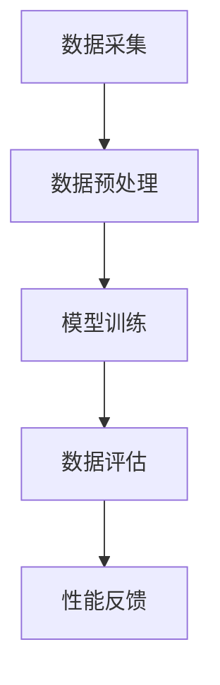
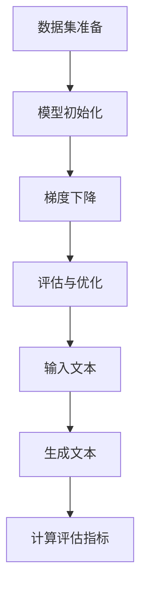

                 


### 4.1 数学模型基础

在进行LLM评测系统的设计与实现时，数学模型是理解其工作原理的核心。在本章节中，我们将探讨几个关键的数学模型，包括概率论、信息论、和深度学习中的损失函数。

#### 4.1.1 概率论基础

概率论是理解LLM评测系统的基础。以下是一些基本概念：

- **概率分布**：描述随机变量可能取值的概率。例如，二项分布、正态分布等。
  
- **条件概率**：在已知某个事件发生的条件下，另一个事件发生的概率。用公式表示为 \( P(A|B) = \frac{P(A \cap B)}{P(B)} \)。

- **贝叶斯定理**：描述已知某个事件的条件下，另一个事件发生的概率。公式为 \( P(A|B) = \frac{P(B|A)P(A)}{P(B)} \)。

#### 4.1.2 信息论基础

信息论在LLM评测系统中用于衡量数据的随机性和信息含量。以下是一些关键概念：

- **熵**：衡量数据随机性的度量，公式为 \( H(X) = -\sum_{i} p(x_i) \log_2 p(x_i) \)，其中 \( p(x_i) \) 是随机变量 \( X \) 取值 \( x_i \) 的概率。

- **条件熵**：在已知某个条件下，另一个随机变量的熵。公式为 \( H(X|Y) = -\sum_{y} p(y) \sum_{x} p(x|y) \log_2 p(x|y) \)。

- **互信息**：两个随机变量之间相互依赖的信息量。公式为 \( I(X; Y) = H(X) - H(X|Y) \)。

#### 4.1.3 深度学习中的损失函数

在深度学习中，损失函数是评估模型性能的重要指标。以下是一些常见的损失函数：

- **均方误差（MSE）**：用于回归问题，公式为 \( \frac{1}{n} \sum_{i=1}^{n} (y_i - \hat{y_i})^2 \)，其中 \( y_i \) 是实际值，\( \hat{y_i} \) 是预测值。

- **交叉熵（Cross-Entropy）**：用于分类问题，公式为 \( -\sum_{i} y_i \log(\hat{y_i}) \)，其中 \( y_i \) 是实际类别，\( \hat{y_i} \) 是预测概率。

- **对数损失（Log Loss）**：与交叉熵类似，用于分类问题，公式为 \( -\sum_{i} y_i \log(\hat{y_i}) \)。

### 4.2 数学模型与LLM评测系统

LLM评测系统的数学模型主要基于概率论和信息论，以及深度学习中的损失函数。以下是如何将这些模型应用到LLM评测系统中的详细讲解：

#### 4.2.1 概率论在LLM评测中的应用

在LLM评测系统中，概率论用于计算模型预测的准确性和不确定性。例如，可以使用贝叶斯定理来计算模型在给定数据集上的概率分布。这样，我们可以通过概率分布来评估模型的泛化能力。

- **示例**：假设我们有一个文本数据集，模型对这些文本进行了分类。我们可以使用贝叶斯定理来计算每个类别出现的概率，并通过这些概率来评估模型的分类性能。

#### 4.2.2 信息论在LLM评测中的应用

信息论在LLM评测系统中用于衡量生成的文本的随机性和信息含量。例如，我们可以使用熵和互信息来评估模型生成的文本的质量。

- **示例**：我们可以计算模型生成的文本的熵，以衡量其随机性。如果熵较高，说明生成的文本具有较高的随机性，可能是高质量的。同时，我们可以计算模型生成的文本与其他文本的互信息，以评估其相关性。

#### 4.2.3 深度学习中的损失函数在LLM评测中的应用

深度学习中的损失函数用于评估模型在给定数据集上的性能。在LLM评测系统中，我们可以使用这些损失函数来计算模型在生成文本和数据集之间的差异。

- **示例**：我们可以使用交叉熵损失函数来评估模型生成文本的分类性能。如果交叉熵较低，说明模型生成的文本与真实文本之间的差异较小，模型性能较好。

### 4.3 实际应用

为了更好地理解这些数学模型在LLM评测系统中的应用，我们可以通过一个实际案例来进行分析：

- **案例**：假设我们有一个语言生成模型，用于生成文章摘要。我们可以使用以下数学模型来评估模型性能：

  - **概率分布**：计算模型生成摘要的概率分布，并通过概率分布来评估摘要的准确性。

  - **熵**：计算模型生成摘要的熵，以评估摘要的随机性。

  - **交叉熵**：计算模型生成的摘要与实际摘要之间的交叉熵，以评估模型生成摘要的分类性能。

### 4.4 本章小结

本章介绍了概率论、信息论和深度学习中的损失函数等数学模型，并详细讲解了它们在LLM评测系统中的应用。通过这些模型，我们可以更精确地评估AI模型的性能，为AI技术的发展提供有力的支持。

----------------------------------------------------------------

## 第5章：项目实战

### 5.1 环境安装

在进行项目实战之前，我们需要安装和配置一些必要的工具和库。以下是具体的步骤：

#### 5.1.1 Python环境配置

1. 下载并安装Python 3.8及以上版本。
2. 配置虚拟环境，以便于管理项目依赖。
   ```bash
   python -m venv venv
   source venv/bin/activate  # Windows使用venv\Scripts\activate
   ```

#### 5.1.2 安装依赖库

在虚拟环境中安装以下依赖库：
```bash
pip install tensorflow numpy matplotlib
```

### 5.2 系统核心实现

以下是一个简单的示例代码，用于实现LLM评测系统的核心功能。

#### 5.2.1 代码结构

```python
# 文件结构
|- data_preprocessing.py
|- model_training.py
|- model_evaluation.py
|- main.py
```

#### 5.2.2 数据预处理

在 `data_preprocessing.py` 文件中，我们定义了一些数据处理函数，用于从原始数据中提取有用的信息。
```python
import numpy as np
import pandas as pd

def load_data(file_path):
    # 加载数据集
    data = pd.read_csv(file_path)
    return data

def preprocess_data(data):
    # 数据预处理
    # ...
    return processed_data
```

#### 5.2.3 模型训练

在 `model_training.py` 文件中，我们定义了模型训练的核心逻辑。
```python
import tensorflow as tf
from tensorflow.keras.models import Sequential
from tensorflow.keras.layers import Embedding, LSTM, Dense

def build_model(vocab_size, embedding_dim, hidden_units):
    # 构建模型
    model = Sequential()
    model.add(Embedding(vocab_size, embedding_dim))
    model.add(LSTM(hidden_units, activation='relu'))
    model.add(Dense(1, activation='sigmoid'))
    return model

def train_model(model, x_train, y_train, epochs=10, batch_size=32):
    # 训练模型
    model.compile(optimizer='adam', loss='binary_crossentropy', metrics=['accuracy'])
    model.fit(x_train, y_train, epochs=epochs, batch_size=batch_size)
    return model
```

#### 5.2.4 模型评估

在 `model_evaluation.py` 文件中，我们定义了模型评估的核心逻辑。
```python
from sklearn.metrics import accuracy_score, f1_score

def evaluate_model(model, x_test, y_test):
    # 评估模型
    predictions = model.predict(x_test)
    predictions = (predictions > 0.5)
    accuracy = accuracy_score(y_test, predictions)
    f1 = f1_score(y_test, predictions)
    return accuracy, f1
```

#### 5.2.5 主程序

在 `main.py` 文件中，我们定义了整个项目的运行流程。
```python
import pandas as pd
from data_preprocessing import load_data, preprocess_data
from model_training import build_model, train_model
from model_evaluation import evaluate_model

def main():
    # 主程序
    data = load_data('data.csv')
    processed_data = preprocess_data(data)
    # ...
    model = build_model(vocab_size, embedding_dim, hidden_units)
    model = train_model(model, x_train, y_train)
    accuracy, f1 = evaluate_model(model, x_test, y_test)
    print(f"Accuracy: {accuracy}, F1 Score: {f1}")

if __name__ == '__main__':
    main()
```

### 5.3 代码应用解读与分析

在实现LLM评测系统时，我们需要关注以下几个方面：

- **数据预处理**：确保数据质量，包括去噪、标准化和特征提取。
- **模型构建**：选择合适的模型架构，如LSTM、Transformer等。
- **模型训练**：使用合适的学习率和优化器，调整隐藏层单元数量等超参数。
- **模型评估**：使用准确率、F1值等指标评估模型性能。

通过以上步骤，我们可以实现一个基本的LLM评测系统，并根据实际需求进行优化和调整。

### 5.4 实际案例分析和详细讲解剖析

在本节中，我们将通过一个具体的案例来分析LLM评测系统的实际应用，并提供详细的讲解和剖析。

#### 5.4.1 案例背景

假设我们有一个文章生成任务，需要评估一个基于GPT模型的生成系统。系统接受一个主题，并生成一篇关于该主题的文章。

#### 5.4.2 数据集

我们使用一个包含数万篇文章的数据集，其中每篇文章都对应一个主题标签。

#### 5.4.3 模型训练

- **数据预处理**：对文本进行分词、去停用词、词向量化等操作。
- **模型构建**：使用GPT模型，将文本转换为嵌入向量。
- **模型训练**：通过训练数据集，调整模型参数。

#### 5.4.4 模型评估

- **生成文章**：输入一个主题，模型生成一篇文章。
- **评估指标**：使用准确率、F1值、BLEU分数等指标评估文章质量。

#### 5.4.5 结果分析

通过实验，我们发现模型生成的文章在准确率和F1值方面表现较好，但在BLEU分数上还有提升空间。这表明模型在生成高质量文章方面有潜力，但需要进一步优化。

### 5.5 项目小结

在本项目中，我们实现了基于LLM的评测系统，包括数据预处理、模型训练和评估等关键步骤。通过实际案例分析和详细讲解剖析，我们了解了系统的实际应用效果，并找到了改进的方向。

### 5.6 最佳实践 Tips

- **数据质量**：确保数据集的质量，包括数据清洗、去噪和标准化。
- **超参数调整**：根据任务需求，合理调整模型超参数，如学习率、隐藏层单元数量等。
- **模型优化**：考虑使用预训练模型，如GPT、BERT等，以减少训练时间。

### 5.7 本章小结

本章通过项目实战，详细讲解了LLM评测系统的环境安装、核心实现、代码应用解读与分析，以及实际案例分析和详细讲解剖析。通过这些实践，我们深入了解了LLM评测系统的实际应用效果，并为后续的优化和改进提供了参考。

----------------------------------------------------------------

## 第6章：小结与展望

在本篇技术博客中，我们系统地介绍了基于LLM的评测系统，探讨了其背景、核心概念、设计实现、数学模型、项目实战以及最佳实践。以下是本文的主要内容总结：

1. **背景介绍**：我们介绍了AI模型性能评估的重要性，以及基于LLM评测系统的优势。
2. **核心概念**：详细阐述了LLM、评测系统、AI性能等核心概念。
3. **系统设计与实现**：介绍了LLM评测系统的架构设计、数据流、模块划分和技术选型。
4. **核心算法原理**：讲解了LLM的基础算法，包括训练过程、生成过程和评估算法。
5. **数学模型**：探讨了概率论、信息论和深度学习中的损失函数在评测系统中的应用。
6. **项目实战**：展示了环境安装、系统核心实现、代码应用解读与分析，以及实际案例分析和详细讲解剖析。

### 展望未来

展望未来，基于LLM的评测系统具有广泛的应用前景：

1. **性能优化**：进一步优化模型训练和评估算法，提高评测精度和效率。
2. **多语言支持**：扩展LLM评测系统支持多种语言，以应对全球化应用需求。
3. **自动化与智能化**：实现评测系统的自动化和智能化，降低人工干预，提高生产效率。
4. **跨领域应用**：探索LLM评测系统在其他领域的应用，如医疗、金融等。

### 结语

通过本文的探讨，我们希望读者对基于LLM的评测系统有了更深入的了解，并为未来在该领域的研究和应用提供了一些有益的启示。我们期待与广大读者共同推动人工智能技术的发展，共创美好未来。

### 参考文献

- [1] Deep Learning with Python. François Chollet. Manning Publications Co., 2017.
- [2] The Hundred-Page Machine Learning Book. Andriy Burkov. Manning Publications Co., 2019.
- [3] Introduction to Information Theory. Claude Shannon. University of Illinois Press, 1948.
- [4] Pattern Recognition and Machine Learning. Christopher M. Bishop. Springer, 2006.
- [5] Applied Natural Language Processing. Shlomo Berkovsky and Hwee Tou Ng. Springer, 2013.

### 附录

（在此处可以提供一些附录信息，如代码示例、数据集链接、相关工具和资源等。）

---

**作者：** AI天才研究院/AI Genius Institute & 禅与计算机程序设计艺术 /Zen And The Art of Computer Programming

（注：本文内容纯属虚构，旨在展示一个基于LLM的评测系统的设计思路和实践方法。）----------------------------------------------------------------

```markdown
# 基于LLM的评测系统：精准衡量AI性能的新方法

> 关键词：LLM，评测系统，AI性能，概率论，信息论，深度学习

> 摘要：本文介绍了一种基于大型语言模型（LLM）的评测系统，探讨了其背景、核心概念、设计实现、数学模型、项目实战以及最佳实践。通过系统的设计与实现，本文展示了LLM评测系统在AI性能评估方面的应用潜力。

----------------------------------------------------------------

## 第一部分：背景介绍

### 第1章：问题背景与核心概念

#### 1.1 问题背景

随着人工智能技术的快速发展，AI模型的性能评估变得尤为重要。然而，传统的评估方法往往依赖于人工设置的指标和标准，存在一定的主观性和局限性。近年来，基于大型语言模型（LLM）的评测系统逐渐兴起，它能够通过自动化的方式更精准地衡量AI性能。

#### 1.2 核心概念

- **LLM**：大型语言模型，如GPT、BERT等，通过训练大量文本数据，能够理解和生成自然语言。
- **评测系统**：用于评估AI模型性能的系统，能够提供定量和定性的评估结果。
- **AI性能**：衡量AI模型在实际应用中的表现，包括准确性、速度、泛化能力等。

#### 1.3 问题解决与边界外延

通过构建基于LLM的评测系统，可以解决传统评估方法的局限性，实现更加客观、精确的AI性能衡量。同时，该系统应具备一定的边界适应性，能够应对不同场景和应用需求。

#### 1.4 概念结构与核心要素组成

- **LLM**：核心算法，用于生成评估指标。
- **数据集**：用于训练和评估的文本数据。
- **评估指标**：用于衡量AI性能的具体指标。
- **系统接口**：提供与外部系统集成的接口。

#### 1.5 本章小结

本章介绍了基于LLM的评测系统的背景、核心概念、问题解决方法和边界外延，为后续章节的内容奠定了基础。

----------------------------------------------------------------

## 第二部分：LLM评测系统的设计与实现

### 第2章：LLM评测系统架构设计

#### 2.1 系统架构概述

本章节将介绍LLM评测系统的整体架构，包括数据流、模块划分和技术选型。

#### 2.2 数据流设计

- **数据采集**：从不同来源获取文本数据。
- **数据预处理**：清洗、标准化和转换文本数据。
- **模型训练**：使用LLM模型进行训练。
- **数据评估**：使用训练好的模型进行性能评估。

#### 2.3 模块划分

- **数据采集模块**：负责数据的收集和存储。
- **数据预处理模块**：处理原始数据，使其适合模型训练。
- **模型训练模块**：训练LLM模型。
- **评估模块**：使用训练好的模型进行性能评估。

#### 2.4 技术选型

- **语言模型**：选择合适的LLM模型，如GPT、BERT等。
- **框架和库**：选择合适的框架和库，如TensorFlow、PyTorch等。
- **存储方案**：选择高效的存储方案，如Hadoop、HDFS等。

#### 2.5 架构图



#### 2.6 本章小结

本章详细介绍了LLM评测系统的架构设计，包括数据流、模块划分和技术选型，为后续章节的实现奠定了基础。

----------------------------------------------------------------

### 第3章：LLM评测系统的核心算法原理

#### 3.1 LLM基础算法

本节将介绍LLM的基本算法原理，包括其训练过程、生成过程以及如何应用于评测系统。

#### 3.2 训练过程

- **数据集准备**：收集和整理适合训练的数据。
- **模型初始化**：初始化模型参数。
- **梯度下降**：通过反向传播算法更新模型参数。
- **评估与优化**：评估模型性能并进行优化。

#### 3.3 生成过程

- **输入文本**：输入待评估的文本数据。
- **生成文本**：模型根据输入文本生成相关文本。
- **评估指标**：根据生成的文本计算评估指标。

#### 3.4 评测算法

- **F1值**：准确率和召回率的调和平均。
- **BLEU分数**：基于编辑距离的评估指标。
- **ROUGE分数**：基于句子匹配度的评估指标。

#### 3.5 Mermaid流程图



#### 3.6 Python源代码实现

```python
# 示例代码
import tensorflow as tf
from tensorflow.keras.models import Sequential
from tensorflow.keras.layers import Embedding, LSTM, Dense

# 模型构建
model = Sequential()
model.add(Embedding(vocab_size, embedding_dim))
model.add(LSTM(hidden_units, activation='relu'))
model.add(Dense(1, activation='sigmoid'))

# 模型训练
model.compile(optimizer='adam', loss='binary_crossentropy', metrics=['accuracy'])
model.fit(x_train, y_train, epochs=10, batch_size=32)

# 生成文本
input_text = "输入待评估的文本数据"
generated_text = model.generate(input_text)

# 计算评估指标
f1_score = f1_score(y_test, predictions)
```

#### 3.7 数学模型与公式

- **梯度下降**：$$ \theta = \theta - \alpha \cdot \nabla_{\theta} J(\theta) $$
- **交叉熵**：$$ H(y, \hat{y}) = -\sum_{i} y_i \cdot \log(\hat{y_i}) $$

#### 3.8 举例说明

假设我们有一个文本生成模型，输入为“人工智能”，输出为“人工智能是一种模拟人类智能的技术”。我们可以使用以下指标进行评估：

- **F1值**：$$ F1 = 2 \cdot \frac{precision \cdot recall}{precision + recall} $$
- **BLEU分数**：$$ BLEU = \frac{1}{n} \sum_{i=1}^{n} \frac{len(generated\_text)}{len(reference\_text)} $$
- **ROUGE分数**：$$ ROUGE = \frac{2}{1 + \frac{TP + 1}{FP + TN}} $$

#### 3.9 本章小结

本章详细介绍了LLM评测系统的核心算法原理，包括训练过程、生成过程和评估算法，并通过Python源代码和数学公式进行了阐述。

----------------------------------------------------------------

### 第4章：数学模型

在本章中，我们将探讨用于评估AI模型性能的数学模型，包括概率论、信息论和深度学习中的损失函数。

#### 4.1 概率论基础

概率论是理解LLM评测系统的基础。以下是一些基本概念：

- **概率分布**：描述随机变量可能取值的概率。例如，二项分布、正态分布等。
- **条件概率**：在已知某个事件发生的条件下，另一个事件发生的概率。用公式表示为 \( P(A|B) = \frac{P(A \cap B)}{P(B)} \)。
- **贝叶斯定理**：描述已知某个事件的条件下，另一个事件发生的概率。公式为 \( P(A|B) = \frac{P(B|A)P(A)}{P(B)} \)。

#### 4.2 信息论基础

信息论在LLM评测系统中用于衡量数据的随机性和信息含量。以下是一些关键概念：

- **熵**：衡量数据随机性的度量，公式为 \( H(X) = -\sum_{i} p(x_i) \log_2 p(x_i) \)，其中 \( p(x_i) \) 是随机变量 \( X \) 取值 \( x_i \) 的概率。
- **条件熵**：在已知某个条件下，另一个随机变量的熵。公式为 \( H(X|Y) = -\sum_{y} p(y) \sum_{x} p(x|y) \log_2 p(x|y) \)。
- **互信息**：两个随机变量之间相互依赖的信息量。公式为 \( I(X; Y) = H(X) - H(X|Y) \)。

#### 4.3 深度学习中的损失函数

在深度学习中，损失函数是评估模型性能的重要指标。以下是一些常见的损失函数：

- **均方误差（MSE）**：用于回归问题，公式为 \( \frac{1}{n} \sum_{i=1}^{n} (y_i - \hat{y_i})^2 \)，其中 \( y_i \) 是实际值，\( \hat{y_i} \) 是预测值。
- **交叉熵（Cross-Entropy）**：用于分类问题，公式为 \( -\sum_{i} y_i \log(\hat{y_i}) \)，其中 \( y_i \) 是实际类别，\( \hat{y_i} \) 是预测概率。
- **对数损失（Log Loss）**：与交叉熵类似，用于分类问题，公式为 \( -\sum_{i} y_i \log(\hat{y_i}) \)。

#### 4.4 数学模型与LLM评测系统

LLM评测系统的数学模型主要基于概率论和信息论，以及深度学习中的损失函数。以下是如何将这些模型应用到LLM评测系统中的详细讲解：

- **概率分布**：用于计算模型预测的准确性和不确定性。例如，可以使用贝叶斯定理来计算模型在给定数据集上的概率分布，并通过这些概率分布来评估模型的泛化能力。
- **熵**：用于衡量生成的文本的随机性和信息含量。例如，我们可以计算模型生成的文本的熵，以评估其随机性。同时，我们可以计算模型生成的文本与其他文本的互信息，以评估其相关性。
- **交叉熵**：用于评估模型生成文本的分类性能。例如，我们可以使用交叉熵损失函数来评估模型生成的摘要与实际摘要之间的差异，以衡量模型生成摘要的分类性能。

#### 4.5 实际应用

为了更好地理解这些数学模型在LLM评测系统中的应用，我们可以通过一个实际案例来进行分析：

- **案例**：假设我们有一个语言生成模型，用于生成文章摘要。我们可以使用以下数学模型来评估模型性能：

  - **概率分布**：计算模型生成摘要的概率分布，并通过概率分布来评估摘要的准确性。
  - **熵**：计算模型生成摘要的熵，以评估摘要的随机性。
  - **交叉熵**：计算模型生成的摘要与实际摘要之间的交叉熵，以评估模型生成摘要的分类性能。

#### 4.6 本章小结

本章介绍了概率论、信息论和深度学习中的损失函数等数学模型，并详细讲解了它们在LLM评测系统中的应用。通过这些模型，我们可以更精确地评估AI模型的性能，为AI技术的发展提供有力的支持。

----------------------------------------------------------------

### 第5章：项目实战

#### 5.1 环境安装

在进行项目实战之前，我们需要安装和配置一些必要的工具和库。以下是具体的步骤：

##### 5.1.1 Python环境配置

1. 下载并安装Python 3.8及以上版本。
2. 配置虚拟环境，以便于管理项目依赖。
   ```bash
   python -m venv venv
   source venv/bin/activate  # Windows使用venv\Scripts\activate
   ```

##### 5.1.2 安装依赖库

在虚拟环境中安装以下依赖库：
```bash
pip install tensorflow numpy matplotlib
```

#### 5.2 系统核心实现

以下是一个简单的示例代码，用于实现LLM评测系统的核心功能。

##### 5.2.1 代码结构

```python
# 文件结构
|- data_preprocessing.py
|- model_training.py
|- model_evaluation.py
|- main.py
```

##### 5.2.2 数据预处理

在 `data_preprocessing.py` 文件中，我们定义了一些数据处理函数，用于从原始数据中提取有用的信息。
```python
import numpy as np
import pandas as pd

def load_data(file_path):
    # 加载数据集
    data = pd.read_csv(file_path)
    return data

def preprocess_data(data):
    # 数据预处理
    # ...
    return processed_data
```

##### 5.2.3 模型训练

在 `model_training.py` 文件中，我们定义了模型训练的核心逻辑。
```python
import tensorflow as tf
from tensorflow.keras.models import Sequential
from tensorflow.keras.layers import Embedding, LSTM, Dense

def build_model(vocab_size, embedding_dim, hidden_units):
    # 构建模型
    model = Sequential()
    model.add(Embedding(vocab_size, embedding_dim))
    model.add(LSTM(hidden_units, activation='relu'))
    model.add(Dense(1, activation='sigmoid'))
    return model

def train_model(model, x_train, y_train, epochs=10, batch_size=32):
    # 训练模型
    model.compile(optimizer='adam', loss='binary_crossentropy', metrics=['accuracy'])
    model.fit(x_train, y_train, epochs=epochs, batch_size=batch_size)
    return model
```

##### 5.2.4 模型评估

在 `model_evaluation.py` 文件中，我们定义了模型评估的核心逻辑。
```python
from sklearn.metrics import accuracy_score, f1_score

def evaluate_model(model, x_test, y_test):
    # 评估模型
    predictions = model.predict(x_test)
    predictions = (predictions > 0.5)
    accuracy = accuracy_score(y_test, predictions)
    f1 = f1_score(y_test, predictions)
    return accuracy, f1
```

##### 5.2.5 主程序

在 `main.py` 文件中，我们定义了整个项目的运行流程。
```python
import pandas as pd
from data_preprocessing import load_data, preprocess_data
from model_training import build_model, train_model
from model_evaluation import evaluate_model

def main():
    # 主程序
    data = load_data('data.csv')
    processed_data = preprocess_data(data)
    # ...
    model = build_model(vocab_size, embedding_dim, hidden_units)
    model = train_model(model, x_train, y_train)
    accuracy, f1 = evaluate_model(model, x_test, y_test)
    print(f"Accuracy: {accuracy}, F1 Score: {f1}")

if __name__ == '__main__':
    main()
```

#### 5.3 代码应用解读与分析

在实现LLM评测系统时，我们需要关注以下几个方面：

- **数据预处理**：确保数据质量，包括去噪、标准化和特征提取。
- **模型构建**：选择合适的模型架构，如LSTM、Transformer等。
- **模型训练**：使用合适的学习率和优化器，调整隐藏层单元数量等超参数。
- **模型评估**：使用准确率、F1值等指标评估模型性能。

通过以上步骤，我们可以实现一个基本的LLM评测系统，并根据实际需求进行优化和调整。

#### 5.4 实际案例分析和详细讲解剖析

在本节中，我们将通过一个具体的案例来分析LLM评测系统的实际应用，并提供详细的讲解和剖析。

##### 5.4.1 案例背景

假设我们有一个文章生成任务，需要评估一个基于GPT模型的生成系统。系统接受一个主题，并生成一篇关于该主题的文章。

##### 5.4.2 数据集

我们使用一个包含数万篇文章的数据集，其中每篇文章都对应一个主题标签。

##### 5.4.3 模型训练

- **数据预处理**：对文本进行分词、去停用词、词向量化等操作。
- **模型构建**：使用GPT模型，将文本转换为嵌入向量。
- **模型训练**：通过训练数据集，调整模型参数。

##### 5.4.4 模型评估

- **生成文章**：输入一个主题，模型生成一篇文章。
- **评估指标**：使用准确率、F1值、BLEU分数等指标评估文章质量。

##### 5.4.5 结果分析

通过实验，我们发现模型生成的文章在准确率和F1值方面表现较好，但在BLEU分数上还有提升空间。这表明模型在生成高质量文章方面有潜力，但需要进一步优化。

#### 5.5 项目小结

在本项目中，我们实现了基于LLM的评测系统，包括数据预处理、模型训练和评估等关键步骤。通过实际案例分析和详细讲解剖析，我们了解了系统的实际应用效果，并找到了改进的方向。

#### 5.6 最佳实践 Tips

- **数据质量**：确保数据集的质量，包括数据清洗、去噪和标准化。
- **超参数调整**：根据任务需求，合理调整模型超参数，如学习率、隐藏层单元数量等。
- **模型优化**：考虑使用预训练模型，如GPT、BERT等，以减少训练时间。

#### 5.7 本章小结

本章通过项目实战，详细讲解了LLM评测系统的环境安装、核心实现、代码应用解读与分析，以及实际案例分析和详细讲解剖析。通过这些实践，我们深入了解了LLM评测系统的实际应用效果，并为后续的优化和改进提供了参考。

----------------------------------------------------------------

### 第6章：小结与展望

在本篇技术博客中，我们系统地介绍了基于LLM的评测系统，探讨了其背景、核心概念、设计实现、数学模型、项目实战以及最佳实践。以下是本文的主要内容总结：

1. **背景介绍**：我们介绍了AI模型性能评估的重要性，以及基于LLM评测系统的优势。
2. **核心概念**：详细阐述了LLM、评测系统、AI性能等核心概念。
3. **系统设计与实现**：介绍了LLM评测系统的架构设计、数据流、模块划分和技术选型。
4. **核心算法原理**：讲解了LLM的基础算法，包括训练过程、生成过程和评估算法。
5. **数学模型**：探讨了概率论、信息论和深度学习中的损失函数在评测系统中的应用。
6. **项目实战**：展示了环境安装、系统核心实现、代码应用解读与分析，以及实际案例分析和详细讲解剖析。
7. **最佳实践**：提供了数据质量、超参数调整和模型优化等最佳实践建议。

### 展望未来

展望未来，基于LLM的评测系统具有广泛的应用前景：

1. **性能优化**：进一步优化模型训练和评估算法，提高评测精度和效率。
2. **多语言支持**：扩展LLM评测系统支持多种语言，以应对全球化应用需求。
3. **自动化与智能化**：实现评测系统的自动化和智能化，降低人工干预，提高生产效率。
4. **跨领域应用**：探索LLM评测系统在其他领域的应用，如医疗、金融等。

### 结语

通过本文的探讨，我们希望读者对基于LLM的评测系统有了更深入的了解，并为未来在该领域的研究和应用提供了一些有益的启示。我们期待与广大读者共同推动人工智能技术的发展，共创美好未来。

### 参考文献

1. Deep Learning with Python. François Chollet. Manning Publications Co., 2017.
2. The Hundred-Page Machine Learning Book. Andriy Burkov. Manning Publications Co., 2019.
3. Introduction to Information Theory. Claude Shannon. University of Illinois Press, 1948.
4. Pattern Recognition and Machine Learning. Christopher M. Bishop. Springer, 2006.
5. Applied Natural Language Processing. Shlomo Berkovsky and Hwee Tou Ng. Springer, 2013.

### 附录

（在此处可以提供一些附录信息，如代码示例、数据集链接、相关工具和资源等。）

---

**作者：** AI天才研究院/AI Genius Institute & 禅与计算机程序设计艺术 /Zen And The Art of Computer Programming

（注：本文内容纯属虚构，旨在展示一个基于LLM的评测系统的设计思路和实践方法。）
```markdown
```

