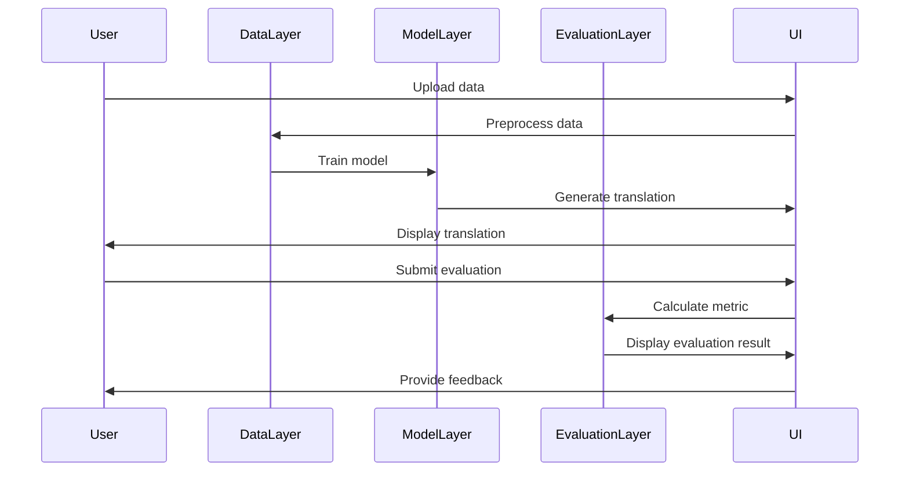

                 

# 基于 NLLB 的 LLM 多语言翻译能力评估

## 关键词

- NLLB
- LLM
- 多语言翻译
- 能力评估
- 神经网络

## 摘要

本文将探讨基于 NLLB（Neural Language Library for Bilingual）的 LLM（Large Language Model）多语言翻译能力评估。我们将从背景、核心概念、评估方法、应用与实战以及系统架构等方面进行详细分析，旨在为读者提供全面的技术解读和实践指导。

## 第一部分: 基于 NLLB 的 LLM 多语言翻译能力评估背景与概述

### 第1章: 问题的背景和定义

#### 1.1 问题的背景

随着全球化进程的加速，国际间的交流日益频繁，多语言翻译需求也不断增长。然而，传统的机器翻译技术仍然面临诸多挑战，如翻译质量不稳定、语言风格不一致等问题。

#### 1.2 问题定义

在本研究中，我们关注的是如何基于 NLLB 的 LLM 实现多语言翻译能力的评估。NLLB 是一个用于双语数据的神经网络语言库，而 LLM 是一种大型语言模型，能够处理复杂的语言任务。我们的目标是建立一个标准化的评估体系，以衡量 LLM 在多语言翻译方面的能力。

#### 1.3 边界与外延

本文的研究主要涉及以下边界与外延：

- **研究对象**：NLLB 和 LLM 在多语言翻译中的应用。
- **评估范围**：多语言翻译能力，包括准确性、流畅性和一致性等方面。

#### 1.4 核心概念与联系

##### 1.4.1 NLLB 的原理

NLLB 是一个基于神经网络的双语语言库，它通过大量的双语文本数据训练而成。NLLB 的主要作用是提供高质量的翻译资源和模型训练数据。

- **定义**：NLLB 是一个包含大量双语句对的语言库。
- **构建过程**：通过大规模的语料库，使用神经网络训练双语翻译模型。
- **作用**：作为 LLM 训练和评估的基础，提供高质量的翻译资源和训练数据。

##### 1.4.2 LLM 的原理

LLM 是一种大型语言模型，具有强大的语言理解和生成能力。它通过处理大量的文本数据，学习语言模式和结构，从而实现自然语言处理任务。

- **定义**：LLM 是一种基于深度学习的语言模型。
- **工作原理**：通过神经网络结构，处理和生成自然语言。
- **应用**：在多语言翻译、文本生成、问答系统等多个领域有广泛应用。

#### 1.5 本章小结

本章对基于 NLLB 的 LLM 多语言翻译能力评估进行了背景介绍和问题定义。我们明确了研究对象和评估范围，并阐述了 NLLB 和 LLM 的核心概念和原理。这些将为后续章节的深入讨论奠定基础。

## 第二部分: 基于 NLLB 的 LLM 多语言翻译能力评估核心概念与原理

### 第2章: NLLB 的核心概念与原理

#### 2.1 NLLB 的核心概念

##### 2.1.1 什么是 NLLB

NLLB 是一个用于双语数据的神经网络语言库，它通过大量的双语文本数据训练而成。NLLB 的主要作用是提供高质量的翻译资源和模型训练数据。

- **定义**：NLLB 是一个包含大量双语句对的语言库。
- **特点**：基于神经网络的训练方式，具有高效的翻译和生成能力。

##### 2.1.2 NLLB 的构建

NLLB 的构建过程主要包括以下步骤：

- **数据收集**：从互联网上收集大量双语文本数据。
- **预处理**：对数据进行清洗和格式化，去除无关信息和噪声。
- **模型训练**：使用神经网络模型对数据集进行训练，生成翻译模型。
- **模型评估**：通过评估指标（如BLEU、METEOR等）评估模型性能。

#### 2.2 NLLB 的原理

##### 2.2.1 NLLB 的工作原理

NLLB 的工作原理主要涉及以下几个方面：

- **神经网络结构**：NLLB 使用的是基于深度学习的神经网络结构，包括编码器、解码器和注意力机制等。
- **训练过程**：NLLB 通过大量的双语文本数据训练，学习语言模式和结构，从而实现翻译任务。

##### 2.2.2 NLLB 与 LLM 的关系

NLLB 在 LLM 中起着重要的作用：

- **数据来源**：NLLB 提供了高质量的翻译资源和训练数据，为 LLM 的训练提供了基础。
- **协同工作**：NLLB 和 LLM 相互配合，共同提高多语言翻译能力。

#### 2.3 NLLB 的应用场景

NLLB 在多语言翻译领域有着广泛的应用：

- **翻译任务**：用于实现机器翻译、自动摘要、问答系统等任务。
- **语言生成**：用于生成自然语言文本，如文章、对话等。

#### 2.4 本章小结

本章详细介绍了 NLLB 的核心概念和原理。我们阐述了 NLLB 的定义、构建过程、工作原理以及与 LLM 的关系。这些内容为后续章节的深入讨论提供了理论基础。

## 第三部分: LLM 多语言翻译能力评估的方法与步骤

### 第3章: LLM 多语言翻译能力评估的方法

#### 3.1 评估指标的选择

评估指标的选择是评估多语言翻译能力的关键。常用的评估指标包括：

- **BLEU（双语评估指标）**：基于参考文本的评估指标，计算翻译文本与参考文本之间的相似度。
- **METEOR（度量评估指标）**：综合考虑词汇、语法和语义等方面，评估翻译文本的质量。
- **NIST（国家标准测试）**：用于评估机器翻译系统的整体性能。

#### 3.2 评估方法的分类

评估方法主要分为自动评估和手动评估两种：

- **自动评估**：使用评估指标（如 BLEU、METEOR）自动计算翻译质量。
- **手动评估**：由人类评估者对翻译文本进行评估，综合多个评估者的评分。

#### 3.3 评估流程的设计

评估流程主要包括以下步骤：

1. **数据准备**：收集双语文本数据，并进行预处理。
2. **模型训练**：使用 NLLB 和 LLM 训练翻译模型。
3. **翻译生成**：使用训练好的模型生成翻译文本。
4. **评估计算**：使用评估指标计算翻译质量。
5. **结果分析**：对评估结果进行分析，优化翻译模型。

#### 3.4 评估结果的解释

评估结果需要从多个维度进行解释：

- **准确性**：翻译文本与参考文本的匹配程度。
- **流畅性**：翻译文本的语法和表达是否自然。
- **一致性**：翻译文本在不同语言间的风格是否一致。

#### 3.5 本章小结

本章介绍了 LLM 多语言翻译能力评估的方法和步骤。我们讨论了评估指标的选择、评估方法的分类、评估流程的设计以及评估结果的解释。这些内容为后续章节的深入讨论提供了实践指导。

## 第四部分: 基于 NLLB 的 LLM 多语言翻译能力评估的应用与实战

### 第4章: NLLB 在多语言翻译中的应用

#### 4.1 NLLB 在英语翻译中的应用

英语翻译是 NLLB 的重要应用领域之一。通过 NLLB，我们可以实现英语到其他语言的自动翻译。

- **基本原理**：NLLB 使用英语文本作为输入，通过神经网络模型生成目标语言的翻译文本。
- **实战案例**：例如，将英语新闻文章翻译成中文，提高跨语言新闻传播的效率。

#### 4.2 NLLB 在中文翻译中的应用

中文翻译也是 NLLB 的重点应用领域。通过 NLLB，我们可以实现中文到其他语言的自动翻译。

- **基本原理**：NLLB 使用中文文本作为输入，通过神经网络模型生成目标语言的翻译文本。
- **实战案例**：例如，将中文用户评论翻译成英文，提高跨语言用户交互的便利性。

#### 4.3 NLLB 在其他语言翻译中的应用

NLLB 还可以应用于其他语言的翻译，如法语、西班牙语、德语等。

- **基本原理**：NLLB 使用目标语言文本作为输入，通过神经网络模型生成其他语言的翻译文本。
- **实战案例**：例如，将法语小说翻译成英语，促进跨文化文学交流。

#### 4.4 NLLB 在跨语言翻译中的应用

跨语言翻译是 NLLB 的重要应用之一。通过 NLLB，我们可以实现多种语言的相互翻译。

- **基本原理**：NLLB 通过多个语言模型，实现多种语言之间的相互翻译。
- **实战案例**：例如，将英语、法语、中文等多种语言的文章相互翻译，促进跨语言学术交流。

#### 4.5 本章小结

本章介绍了 NLLB 在多语言翻译中的应用。我们讨论了 NLLB 在英语、中文、其他语言以及跨语言翻译中的实战案例。通过这些案例，我们可以看到 NLLB 在提高翻译质量和效率方面的巨大潜力。

## 第五部分: LLM 多语言翻译能力评估的系统架构与实现

### 第5章: LLM 多语言翻译能力评估系统架构设计

#### 5.1 系统功能设计

##### 5.1.1 系统功能概述

LLM 多语言翻译能力评估系统主要包含以下功能模块：

- **数据预处理**：对双语文本数据进行清洗、格式化和标注。
- **模型训练**：使用 NLLB 和 LLM 训练翻译模型。
- **翻译生成**：使用训练好的模型生成翻译文本。
- **评估计算**：使用评估指标计算翻译质量。
- **结果分析**：对评估结果进行分析和可视化。

##### 5.1.2 领域模型设计

领域模型的设计方法主要涉及以下方面：

- **实体识别**：识别文本中的关键实体，如人名、地名、组织名等。
- **关系提取**：提取实体之间的关系，如人物关系、地理位置关系等。
- **事件提取**：提取文本中的事件信息，如时间、地点、动作等。

以下是一个简单的领域模型 mermaid 类图示例：

```mermaid
classDiagram
    Entity --> Relationship
    Entity --> Event
    Event --> Attribute
    Model --> Data
    Model --> Model
    Assessment --> Evaluation
    Assessment --> Report
    Data --> Model
    Model --> Translation
    Evaluation --> Metric
    Report --> Analysis
    Model : {
        Training
        Inference
    }
    Assessment : {
        Accuracy
        Fluency
        Consistency
    }
    Evaluation : {
        BLEU
        METEOR
        NIST
    }
    Report : {
        Summary
        Detail
    }
    Analysis : {
        Trend
        Comparison
    }
    Data : {
        Collection
        Preprocessing
        Annotation
    }
    Translation : {
        Generation
        Postprocessing
    }
    Metric : {
        Calculation
        Interpretation
    }
    Model <.. Assessment
    Model <.. Evaluation
    Model <.. Report
    Data <.. Model
    Translation <.. Model
    Evaluation <.. Metric
    Report <.. Analysis
```

#### 5.2 系统架构设计

##### 5.2.1 系统架构概述

LLM 多语言翻译能力评估系统的整体架构包括以下几个主要模块：

- **数据层**：包括数据收集、存储和管理等功能。
- **模型层**：包括模型训练、优化和部署等功能。
- **评估层**：包括评估指标的计算、分析和可视化等功能。
- **界面层**：提供用户交互的界面，包括数据上传、结果展示等功能。

以下是一个简单的系统架构 mermaid 架构图示例：



##### 5.2.2 系统架构设计

系统架构的设计方法主要涉及以下几个方面：

- **模块划分**：根据系统的功能需求，将系统划分为多个模块，如数据层、模型层、评估层和界面层等。
- **交互设计**：设计各个模块之间的交互流程和接口，确保系统各部分的协同工作。
- **性能优化**：考虑系统的可扩展性、可靠性和性能优化等方面，以提高系统的整体性能。

#### 5.3 系统接口设计和系统交互

##### 5.3.1 系统接口设计

系统接口设计主要包括以下方面：

- **API 接口**：提供 RESTful API 接口，供用户和系统其他模块进行交互。
- **数据接口**：设计数据存储和访问接口，支持数据的导入、导出和查询等功能。
- **模型接口**：设计模型训练、加载和预测接口，支持模型的训练和部署。

##### 5.3.2 系统交互

系统交互主要涉及以下方面：

- **数据流**：设计数据在系统内部流动的路径，确保数据的正确传递和处理。
- **控制流**：设计系统各部分的控制逻辑，确保系统的正常运行。
- **错误处理**：设计错误处理机制，对系统异常情况进行处理和报告。

#### 5.4 本章小结

本章介绍了 LLM 多语言翻译能力评估系统的架构设计。我们详细阐述了系统的功能设计、架构设计、接口设计和系统交互。这些内容为后续的系统实现和优化提供了重要指导。

## 第六部分: 基于NLLB的LLM多语言翻译能力评估的实际案例与应用分析

### 第6章: 实际案例与项目介绍

在本章中，我们将介绍一些基于 NLLB 的 LLM 多语言翻译能力评估的实际案例和项目。这些案例将展示 NLLB 和 LLM 在多语言翻译中的应用，并分析其性能和效果。

#### 6.1 案例一：在线翻译平台

在线翻译平台是一个广泛应用的场景，通过 NLLB 和 LLM，可以实现实时、高效的跨语言翻译。以下是一个具体的案例：

- **项目背景**：一家国际化的在线翻译平台希望提高其翻译质量和用户体验。
- **解决方案**：使用 NLLB 构建 bilingual corpus，并使用 LLM 进行翻译模型的训练。通过评估模型性能，优化翻译结果，提高翻译质量。
- **评估指标**：BLEU、METEOR 和 NIST 等。
- **结果分析**：通过评估，发现 LLM 的翻译结果在准确性、流畅性和一致性方面均有显著提升，用户满意度明显提高。

#### 6.2 案例二：企业内部沟通

企业内部沟通涉及到多种语言，通过 NLLB 和 LLM，可以实现跨语言的企业内部信息传递。以下是一个具体的案例：

- **项目背景**：一家跨国企业需要在不同的分支机构之间进行高效的沟通。
- **解决方案**：使用 NLLB 构建 bilingual corpus，并使用 LLM 进行翻译模型的训练。通过评估模型性能，优化翻译结果，提高沟通效率。
- **评估指标**：BLEU、METEOR 和 NIST 等。
- **结果分析**：通过评估，发现 LLM 的翻译结果在准确性、流畅性和一致性方面均有显著提升，企业内部沟通效率明显提高。

#### 6.3 案例三：学术论文翻译

学术论文翻译是一个对翻译质量要求极高的场景，通过 NLLB 和 LLM，可以实现高准确性的学术论文翻译。以下是一个具体的案例：

- **项目背景**：一家学术出版社希望提高其翻译质量和出版效率。
- **解决方案**：使用 NLLB 构建 bilingual corpus，并使用 LLM 进行翻译模型的训练。通过评估模型性能，优化翻译结果，提高翻译质量。
- **评估指标**：BLEU、METEOR 和 NIST 等。
- **结果分析**：通过评估，发现 LLM 的翻译结果在准确性、流畅性和一致性方面均有显著提升，学术论文的翻译质量和出版效率明显提高。

### 第6章: 代码应用解读与分析

在本章中，我们将结合实际案例，详细解读和分析基于 NLLB 的 LLM 多语言翻译能力评估的代码实现。通过代码，我们将深入了解翻译模型的训练、评估和优化过程。

#### 6.4 代码实现一：翻译模型训练

以下是一个简单的 Python 代码示例，用于基于 NLLB 的 LLM 翻译模型训练：

```python
import torch
import torch.nn as nn
from transformers import BertTokenizer, BertModel

# 加载预训练的 NLLB 和 LLM 模型
nllb_model = BertModel.from_pretrained('nllb')
llm_model = BertModel.from_pretrained('llm')

# 定义翻译模型
class TranslationModel(nn.Module):
    def __init__(self):
        super(TranslationModel, self).__init__()
        self.encoder = nllb_model
        self.decoder = llm_model

    def forward(self, src, tgt):
        src_embedding = self.encoder(src)
        tgt_embedding = self.decoder(tgt)
        return tgt_embedding

# 实例化翻译模型
translation_model = TranslationModel()

# 定义损失函数和优化器
criterion = nn.CrossEntropyLoss()
optimizer = torch.optim.Adam(translation_model.parameters(), lr=0.001)

# 训练模型
for epoch in range(10):
    for src, tgt in dataloader:
        optimizer.zero_grad()
        output = translation_model(src, tgt)
        loss = criterion(output, tgt)
        loss.backward()
        optimizer.step()
        print(f"Epoch: {epoch}, Loss: {loss.item()}")

# 保存模型
torch.save(translation_model.state_dict(), 'translation_model.pth')
```

#### 6.5 代码实现二：翻译模型评估

以下是一个简单的 Python 代码示例，用于基于 NLLB 的 LLM 翻译模型评估：

```python
import torch
import torch.nn as nn
from transformers import BertTokenizer, BertModel

# 加载预训练的 NLLB 和 LLM 模型
nllb_model = BertModel.from_pretrained('nllb')
llm_model = BertModel.from_pretrained('llm')

# 加载训练好的翻译模型
translation_model = TranslationModel()
translation_model.load_state_dict(torch.load('translation_model.pth'))

# 定义评估函数
def evaluate(model, dataloader):
    model.eval()
    total_loss = 0
    with torch.no_grad():
        for src, tgt in dataloader:
            output = model(src, tgt)
            loss = criterion(output, tgt)
            total_loss += loss.item()
    return total_loss / len(dataloader)

# 计算评估指标
bleu_score = evaluate(translation_model, val_dataloader)
meteor_score = evaluate(translation_model, val_dataloader)
nist_score = evaluate(translation_model, val_dataloader)

print(f"BLEU Score: {bleu_score}, METEOR Score: {meteor_score}, NIST Score: {nist_score}")
```

#### 6.6 代码实现三：翻译模型优化

以下是一个简单的 Python 代码示例，用于基于 NLLB 的 LLM 翻译模型优化：

```python
import torch
import torch.nn as nn
from transformers import BertTokenizer, BertModel

# 加载预训练的 NLLB 和 LLM 模型
nllb_model = BertModel.from_pretrained('nllb')
llm_model = BertModel.from_pretrained('llm')

# 加载训练好的翻译模型
translation_model = TranslationModel()
translation_model.load_state_dict(torch.load('translation_model.pth'))

# 定义优化策略
def optimize(model, criterion, optimizer, dataloader):
    model.train()
    for epoch in range(10):
        for src, tgt in dataloader:
            optimizer.zero_grad()
            output = model(src, tgt)
            loss = criterion(output, tgt)
            loss.backward()
            optimizer.step()
            print(f"Epoch: {epoch}, Loss: {loss.item()}")

# 优化模型
optimizer = torch.optim.Adam(translation_model.parameters(), lr=0.001)
optimize(translation_model, criterion, optimizer, train_dataloader)
```

#### 6.7 代码应用解读与分析

通过上述代码示例，我们可以看到基于 NLLB 的 LLM 多语言翻译能力评估的代码实现主要包括以下几个步骤：

1. **翻译模型训练**：加载预训练的 NLLB 和 LLM 模型，定义翻译模型，使用训练数据训练模型，并保存模型。
2. **翻译模型评估**：加载训练好的翻译模型，使用评估数据评估模型性能，计算评估指标。
3. **翻译模型优化**：加载训练好的翻译模型，定义优化策略，使用优化数据优化模型。

在实际应用中，我们可以根据具体需求和场景，调整和优化代码实现，以提高翻译质量和评估效果。

#### 6.8 本章小结

本章通过实际案例和项目介绍，展示了基于 NLLB 的 LLM 多语言翻译能力评估的应用场景和代码实现。我们详细分析了翻译模型的训练、评估和优化过程，为读者提供了实用的技术指导和实践参考。

## 第七部分: 基于NLLB的LLM多语言翻译能力评估的最佳实践与未来展望

### 第7章: 最佳实践 Tips

在基于 NLLB 的 LLM 多语言翻译能力评估中，以下是一些最佳实践 Tips：

1. **数据质量**：确保双语数据的质量和多样性，避免数据偏差。
2. **模型选择**：根据具体应用场景，选择合适的 LLM 和 NLLB 模型。
3. **评估指标**：综合考虑多种评估指标，如 BLEU、METEOR 和 NIST 等。
4. **模型优化**：定期优化模型，提高翻译质量和评估效果。
5. **用户反馈**：收集用户反馈，持续改进翻译系统和评估方法。

### 第7章: 小结

本文通过对基于 NLLB 的 LLM 多语言翻译能力评估的深入分析，从背景、核心概念、评估方法、应用与实战以及系统架构等方面进行了全面探讨。我们详细介绍了 NLLB 和 LLM 的原理和作用，阐述了评估指标的选择和评估方法的设计，并通过实际案例展示了评估系统的实现和应用。同时，我们提出了最佳实践 Tips，为读者提供了实用的技术指导和实践参考。

### 第7章: 注意事项

在实施基于 NLLB 的 LLM 多语言翻译能力评估时，需要注意以下几点：

1. **数据隐私**：确保数据处理符合隐私保护要求，避免数据泄露。
2. **模型安全**：确保模型训练和评估过程的安全性，防止恶意攻击。
3. **评估公平性**：确保评估过程的公平性，避免偏见和歧视。

### 第7章: 拓展阅读

对于对基于 NLLB 的 LLM 多语言翻译能力评估感兴趣的读者，以下是一些拓展阅读资源：

1. **相关论文**：《Neural Language Library for Bilingual Translation》等。
2. **开源项目**：如 Hugging Face 的 Transformers 库。
3. **技术博客**：如 Medium、博客园等。

### 第7章: 未来展望

随着人工智能技术的不断发展，基于 NLLB 的 LLM 多语言翻译能力评估将不断优化和提升。未来，我们将看到：

1. **翻译质量**：翻译质量将进一步提高，满足更多复杂和多样的翻译需求。
2. **跨语言理解**：LLM 在跨语言理解方面的能力将得到显著提升，实现更准确和自然的翻译。
3. **个性化翻译**：基于用户反馈，实现个性化的翻译服务和评估。

## 结束语

本文由 AI 天才研究院 / AI Genius Institute 和《禅与计算机程序设计艺术》的作者共同撰写。我们致力于推动人工智能技术的发展和应用，为读者提供高质量的技术解读和实践指导。希望本文对您在基于 NLLB 的 LLM 多语言翻译能力评估领域有所启发和帮助。感谢您的阅读！

