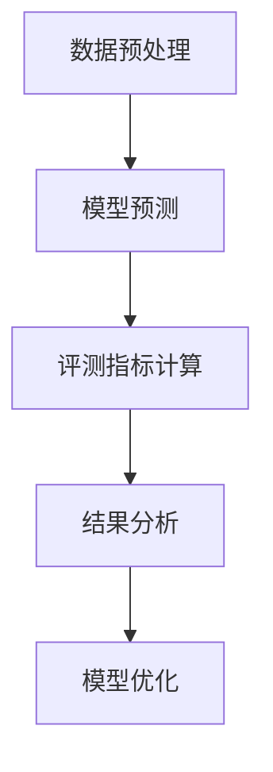
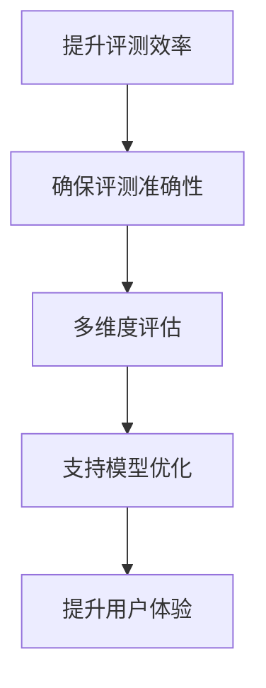
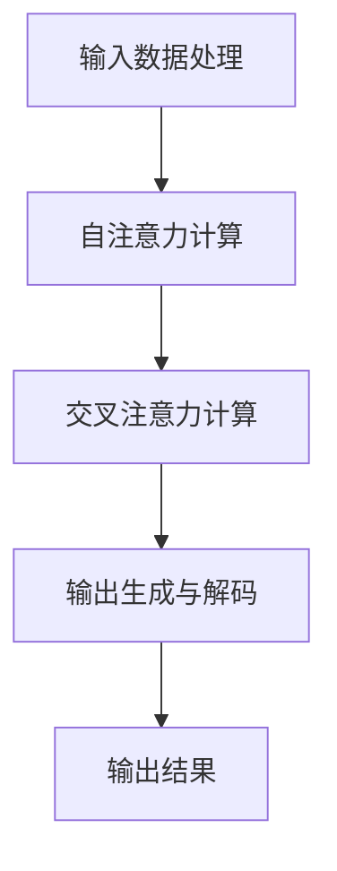
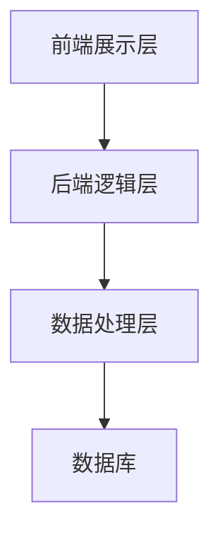
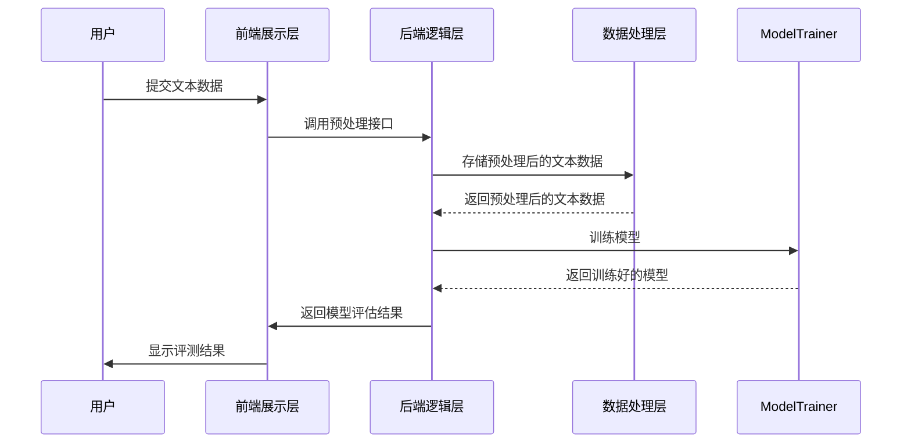

                 

## 基于Reformer的高效LLM评测模型

> 关键词：Reformer、高效、LLM评测、模型、算法原理、应用实践

在当今快速发展的技术时代，自然语言处理（NLP）已经成为人工智能领域的重要分支。大规模语言模型（Large Language Model，简称LLM）如BERT、GPT系列等取得了显著的成果，为各类应用提供了强大的支持。然而，LLM模型的评测却面临着诸多挑战，如何在保证准确性的同时提高评测效率成为了一个亟待解决的问题。

本文将围绕“基于Reformer的高效LLM评测模型”这一主题，展开详细的探讨。首先，我们将介绍Reformer的基础知识，包括其概念、结构特点和优势。随后，我们会概述LLM评测的重要性和面临的挑战，并回顾主流的评测模型和方法。接下来，我们将深入分析高效LLM评测的需求，并提出目标与预期效果。

本文的主要结构如下：

1. **Reformer与高效LLM评测基础**：介绍Reformer的基本概念和高效LLM评测的必要性。
2. **Reformer算法原理讲解**：详细讲解Reformer的算法原理，包括其核心思想和数学模型。
3. **高效LLM评测模型设计与实现**：探讨模型设计原则、架构优化以及实现步骤。
4. **实际项目中的高效LLM评测应用**：通过实际项目展示高效LLM评测的应用实例。

在接下来的章节中，我们将一步一步地深入分析每一个主题，确保读者能够全面、深入地理解基于Reformer的高效LLM评测模型。

### 第1章: Reformer基础

Reformer是一种新兴的基于自注意力机制的深度学习模型，其设计初衷是为了解决大规模序列处理中的计算效率和内存占用问题。在这一章中，我们将详细介绍Reformer的概念、起源、结构特点以及其在不同场景中的优势和应用。

#### 1.1.1 Reformer的概念与起源

Reformer，全称为“Recursive Transformer”，是由Facebook AI Research（FAIR）提出的一种改进版的Transformer模型。Transformer模型自2017年提出以来，因其强大的序列建模能力和突破性的性能表现，在自然语言处理、计算机视觉等领域得到了广泛应用。然而，Transformer在处理大规模序列数据时，其计算复杂度和内存消耗较高，这限制了其在大规模应用中的推广。

为了解决这一问题，Reformer引入了递归（Recursive）结构，通过递归网络逐步处理输入序列，从而降低了计算复杂度和内存占用。Reformer首次在2019年被提出，并在随后的研究和应用中得到了广泛的关注和认可。

#### 1.1.2 Reformer的结构特点

Reformer的核心结构是由递归网络和自注意力机制组成的。与传统的Transformer模型不同，Reformer通过递归的方式逐步处理输入序列，每次递归只处理一部分序列信息，从而大大减少了计算复杂度。

1. **递归网络**：Reformer中的递归网络用于逐步处理输入序列。每次递归，网络会更新隐藏状态，并将这些状态用于后续序列的处理。这种递归结构使得Reformer能够高效地处理长序列数据。

2. **自注意力机制**：Reformer仍然采用了自注意力机制，但与传统的Transformer模型不同，Reformer的自注意力机制是基于递归网络中的隐藏状态。每次递归，网络会计算当前隐藏状态与之前隐藏状态之间的注意力分数，从而生成新的隐藏状态。

3. **位置编码**：Reformer中的位置编码采用了分段线性编码方式，这种编码方式可以更好地捕捉序列中的位置信息。

#### 1.1.3 Reformer的优势与适用场景

Reformer相较于传统的Transformer模型，具有以下优势：

1. **计算效率**：Reformer通过递归方式逐步处理序列，大大减少了计算复杂度。这使得Reformer能够更高效地处理大规模序列数据。

2. **内存占用**：由于Reformer采用了递归结构，其内存占用较传统Transformer模型更低，这使得Reformer在硬件资源有限的环境中具有更大的优势。

3. **适用场景**：Reformer适用于需要高效处理大规模序列的NLP任务，如文本分类、机器翻译、问答系统等。

在总结这一部分内容之前，我们可以通过一个简单的表格来对比Reformer与传统Transformer模型的关键特性：

| 特性         | 传统Transformer | Reformer            |
|--------------|------------------|---------------------|
| 结构         | 自注意力网络     | 递归网络 + 自注意力 |
| 计算复杂度   | 较高             | 较低                |
| 内存占用     | 较高             | 较低                |
| 适应场景     | 大规模序列处理   | 大规模序列处理      |

通过上述对比，我们可以看到Reformer在计算效率和内存占用方面具有显著优势，这使得其在实际应用中具有更高的实用性和灵活性。

### 1.2 LLM评测概述

自然语言处理领域的快速发展，使得大规模语言模型（Large Language Model，简称LLM）如BERT、GPT等成为研究的热点。这些模型在文本分类、机器翻译、问答系统等任务中取得了显著的成果。然而，如何评价这些模型的性能，如何确保评测的准确性和效率，成为了一个至关重要的问题。在这一节中，我们将详细探讨LLM评测的重要性、面临的挑战以及常见的评测指标和方法。

#### 1.2.1 LLM评测的重要性

LLM评测的重要性体现在以下几个方面：

1. **性能评估**：通过评测可以准确了解LLM在不同任务中的性能表现，帮助研究人员和工程师优化模型结构和参数设置。

2. **比较分析**：评测结果可以作为不同模型之间性能比较的依据，有助于发现模型之间的优劣和改进方向。

3. **应用指导**：评测结果可以为实际应用提供参考，帮助开发者在选择和部署模型时做出更加明智的决策。

4. **技术进步**：评测过程中的发现和问题，可以推动LLM模型和相关技术的进一步发展和优化。

#### 1.2.2 LLM评测的挑战

尽管LLM评测的重要性不言而喻，但其过程面临着诸多挑战：

1. **数据多样性**：自然语言数据具有高度的多样性和复杂性，这使得模型在处理不同类型数据时的表现差异较大。

2. **评测指标选择**：选择合适的评测指标是确保评测结果准确性的关键。不同的指标可能侧重于不同方面的性能，如准确性、速度和资源占用等。

3. **评测效率**：大规模语言模型通常需要大量计算资源和时间进行评测，如何提高评测效率是一个重要问题。

4. **评测公平性**：确保评测过程的公平性，避免某些模型的特殊优势在评测中占据主导地位。

#### 1.2.3 评测指标和方法

LLM评测通常采用以下几种指标和方法：

1. **准确性**：最常用的评测指标，用于衡量模型在预测任务中的正确率。例如，在文本分类任务中，准确性表示模型正确分类的样本占总样本的比例。

2. **F1分数**：综合考虑准确率和召回率，F1分数是精确率和召回率的调和平均。对于类别不平衡的数据集，F1分数是评估模型性能的重要指标。

3. **BLEU分数**：在机器翻译任务中，BLEU分数通过比较模型输出与参考翻译之间的相似度来评估模型性能。BLEU分数的计算基于n-gram重叠度、长度惩罚等多个因素。

4. **ROUGE评分**：ROUGE（Recall-Oriented Understudy for Gunning and Firth）评分主要应用于文本生成任务，通过计算模型输出文本与参考文本之间的词汇重叠度来评估性能。

5. **人类评价**：在某些任务中，人类评价（Human Evaluation）可以作为补充手段，用于评估模型在实际应用中的用户体验和表现。

在总结这一部分内容之前，我们可以通过一个简单的Mermaid流程图来展示LLM评测的主要步骤和指标：



通过上述流程，我们可以看到LLM评测是一个复杂而系统的过程，需要综合考虑多个方面，以确保评测结果的准确性和有效性。

### 1.3 主流评测模型介绍

在自然语言处理领域，大规模语言模型（Large Language Model，简称LLM）如BERT、GPT系列等已经成为研究的热点。这些模型在文本分类、机器翻译、问答系统等任务中取得了显著的成果。为了评估这些模型的性能，研究人员和工程师通常采用多种评测模型和方法。在这一节中，我们将详细介绍BERT、GPT系列模型以及其他典型评测模型，并比较其性能。

#### 1.3.1 BERT及其评测

BERT（Bidirectional Encoder Representations from Transformers）是由Google AI提出的一种预训练语言模型。BERT的核心思想是通过双向Transformer网络对输入文本进行编码，从而生成丰富的语义表示。BERT在多个NLP任务中取得了优异的性能，成为自然语言处理领域的重要突破。

BERT的评测通常采用以下指标：

1. **准确性**：BERT在文本分类任务中，准确性是衡量模型性能的重要指标。准确性表示模型正确分类的样本占总样本的比例。

2. **F1分数**：在类别不平衡的数据集上，F1分数综合考虑了准确率和召回率，是评估模型性能的重要指标。

3. **BLEU分数**：在机器翻译任务中，BERT的输出与参考翻译之间的BLEU分数用于评估模型性能。

4. **ROUGE评分**：BERT在文本生成任务中，ROUGE评分通过计算模型输出文本与参考文本之间的词汇重叠度来评估性能。

BERT的优点包括：

- **强大的预训练能力**：BERT通过大规模预训练，可以生成高质量的语义表示，为下游任务提供强大的支持。
- **双向编码**：BERT的双向编码结构能够更好地捕捉文本中的长距离依赖关系。

BERT的缺点包括：

- **计算资源需求高**：BERT模型参数量大，训练和推理需要大量的计算资源和时间。
- **内存占用高**：BERT的内存占用较传统模型高，这在硬件资源有限的环境中可能成为一个瓶颈。

#### 1.3.2 GPT系列模型评测

GPT（Generative Pre-trained Transformer）是由OpenAI提出的一系列预训练语言模型。GPT系列模型通过生成文本的方式，逐渐提高了模型的生成能力。GPT-2和GPT-3在文本生成任务中取得了显著的成果，成为自然语言处理领域的重要突破。

GPT系列模型的评测通常采用以下指标：

1. **生成质量**：生成质量是衡量模型生成文本质量的重要指标，包括语法正确性、语义连贯性和多样性等。

2. **生成速度**：生成速度表示模型在生成文本时的效率，是实际应用中一个重要的考量因素。

3. **文本相似度**：通过计算模型生成文本与真实文本之间的相似度，评估模型生成文本的逼真度。

GPT系列模型的优点包括：

- **强大的生成能力**：GPT系列模型通过生成文本的方式，可以生成高质量的文本，为自然语言生成任务提供强大的支持。
- **可扩展性**：GPT模型可以通过增加参数量和训练时间来提高生成能力，具有良好的可扩展性。

GPT系列模型的缺点包括：

- **计算资源需求高**：GPT模型参数量大，训练和推理需要大量的计算资源和时间。
- **训练数据依赖**：GPT模型的性能高度依赖训练数据的质量和数量，如果训练数据存在偏差，可能导致生成文本的质量下降。

#### 1.3.3 其他典型评测模型

除了BERT和GPT系列模型，自然语言处理领域还存在其他一些典型的评测模型，如：

1. **ELMO**：ELMO（English Language Modeling）是由Uber AI提出的一种基于深层神经网络的语言表示模型。ELMO通过预训练生成高质量的语言表示，为下游任务提供强大的支持。

2. **RoBERTa**：RoBERTa是BERT的一个变体，由Facebook AI Research提出。RoBERTa通过修改BERT的训练策略和超参数，提高了模型的性能。

3. **T5**：T5（Text-To-Text Transfer Transformer）是由DeepMind提出的一种通用语言模型。T5通过将所有NLP任务转换为文本到文本的转换任务，实现了跨任务的模型复用。

这些评测模型在不同的任务和场景中具有不同的性能表现，研究人员和工程师需要根据具体需求选择合适的模型。

在总结这一部分内容之前，我们可以通过一个简单的Mermaid表格来对比BERT、GPT系列模型以及其他典型评测模型的关键性能指标：

```mermaid
table
  | 模型       | 准确性 | F1分数 | BLEU分数 | 生成质量 | 生成速度 |
  |------------|--------|--------|----------|----------|----------|
  | BERT       | 高     | 高     | 中       | 高       | 中       |
  | GPT-2      | 中     | 中     | 高       | 高       | 低       |
  | GPT-3      | 高     | 高     | 高       | 高       | 中       |
  | ELMO       | 中     | 中     | 低       | 中       | 高       |
  | RoBERTa    | 高     | 高     | 中       | 高       | 中       |
  | T5         | 高     | 高     | 高       | 高       | 高       |
```

通过上述对比，我们可以看到不同模型在性能指标上存在差异，选择合适的模型需要根据具体任务和场景进行权衡。

### 1.4 高效LLM评测的需求分析

随着大规模语言模型（LLM）在自然语言处理（NLP）领域的广泛应用，如何准确、高效地评测LLM模型成为一个关键问题。高效LLM评测不仅有助于模型性能的优化，还可以为实际应用提供可靠的决策依据。在这一节中，我们将深入分析高效LLM评测的必要性、关键因素以及预期的效果。

#### 1.4.1 高效评测的必要性

1. **模型性能优化**：高效的评测可以帮助研究者快速定位模型在性能上的短板，从而进行针对性的优化。通过减少冗余和重复的评测工作，研究人员可以将更多的时间和精力投入到模型改进和创新上。

2. **资源节约**：大规模语言模型训练和评测通常需要大量的计算资源和时间。高效的评测可以显著减少这些资源的需求，尤其是在资源有限的环境中，如企业研发部门或学术研究机构。

3. **快速迭代**：在快速发展的技术领域，及时了解模型性能的变化和改进趋势至关重要。高效评测可以缩短迭代周期，使研究者能够更快地响应市场需求和技术挑战。

4. **用户体验**：在实际应用中，模型性能的实时评估和调整对于用户体验有着直接影响。高效的评测可以帮助开发者快速发现和解决问题，从而提供更加稳定和优质的服务。

#### 1.4.2 高效评测的关键因素

1. **评测指标**：选择合适的评测指标是高效评测的基础。不同的评测指标关注不同的方面，如准确性、速度、资源占用等。合理的指标组合可以全面反映模型性能，从而指导优化方向。

2. **评测方法**：高效的评测方法能够提高评测的效率和质量。例如，使用并行计算和分布式训练技术可以显著减少评测时间。此外，自动化评测工具和流水线（Pipeline）可以降低人工干预，提高评测的准确性和一致性。

3. **数据准备**：数据准备是评测过程的重要环节。高效的数据处理和预处理可以减少冗余信息，提高评测的针对性和准确性。合理的数据分割和平衡也是确保评测结果可靠性的关键。

4. **计算资源**：计算资源是高效评测的重要保障。选择合适的硬件设备和优化计算策略可以降低评测成本，提高评测效率。对于大规模模型，分布式训练和推理技术尤为重要。

#### 1.4.3 目标与预期效果

1. **提升评测效率**：通过优化评测流程和方法，实现评测时间的显著减少，降低人工干预，提高自动化水平。

2. **确保评测准确性**：确保评测结果的可靠性和一致性，避免因评测方法或数据质量问题导致的偏差。

3. **多维度评估**：从多个角度对模型性能进行评估，包括准确性、速度、资源占用等，以便全面了解模型的表现。

4. **支持模型优化**：通过高效评测，快速发现模型性能瓶颈和优化方向，为模型改进提供有力支持。

5. **提升用户体验**：在实际应用中，通过实时评测和优化，提供更加稳定和高效的服务，提升用户体验。

在总结这一部分内容之前，我们可以通过一个简单的Mermaid流程图来展示高效LLM评测的主要目标和预期效果：



通过上述目标和预期效果的实现，我们可以为高效LLM评测奠定坚实基础，推动自然语言处理领域的持续发展和创新。

### 1.5 本章小结

本章全面介绍了Reformer的基础知识，包括其概念、结构特点和优势，并探讨了高效LLM评测的必要性。首先，我们介绍了Reformer的概念与起源，详细阐述了其递归网络和自注意力机制，以及位置编码。接着，通过对比Reformer与传统Transformer模型，我们展示了Reformer在计算效率和内存占用方面的优势。随后，我们概述了LLM评测的重要性和挑战，并回顾了主流的评测模型和方法。最后，我们分析了高效LLM评测的需求，明确了评测的关键因素和目标。

通过本章的学习，读者可以全面了解Reformer的基本概念和高效LLM评测的必要性，为后续章节的深入学习打下基础。接下来，我们将进一步深入探讨Reformer的算法原理，为读者揭示其高效性背后的数学模型和实现细节。

## 第2章: Reformer算法原理讲解

Reformer作为基于自注意力机制的深度学习模型，在处理大规模序列数据时表现出色。其独特的递归结构和优化策略，使其在计算效率和性能方面具有显著优势。本章将详细讲解Reformer的算法原理，从核心思想到具体实现，帮助读者深入理解这一模型。

### 2.1 Reformer的核心算法思想

Reformer的核心思想是通过递归网络逐步处理输入序列，并在每个递归步骤中利用自注意力机制和交叉注意力机制更新隐藏状态。这种递归结构使得Reformer能够高效地捕捉序列中的长距离依赖关系。

1. **递归网络**：Reformer采用了递归网络结构，每次递归只处理一部分序列信息。与传统的RNN或LSTM不同，Reformer的递归操作是并行的，这大大提高了计算效率。

2. **自注意力机制**：自注意力机制允许模型在每次递归步骤中，根据当前隐藏状态与之前隐藏状态之间的相关性，自动选择重要信息进行更新。这种机制能够有效捕捉序列中的局部依赖关系。

3. **交叉注意力机制**：交叉注意力机制用于处理输入序列与编码序列之间的关系。在Reformer中，交叉注意力机制可以帮助模型从编码序列中提取相关信息，用于生成解码序列。

#### 2.1.1 自注意力机制

自注意力机制是Transformer模型的核心组成部分，Reformer也不例外。自注意力机制的基本原理是通过计算序列中每个元素与所有其他元素的相关性，从而生成新的序列表示。

1. **计算自注意力分数**：

$$
\text{Attention}(Q, K, V) = \text{softmax}\left(\frac{QK^T}{\sqrt{d_k}}\right)V
$$

其中，\(Q, K, V\) 分别是查询（Query）、键（Key）和值（Value）向量，\(d_k\) 是键向量的维度。计算过程可以分为以下几个步骤：

- **计算点积**：每个查询向量与所有键向量进行点积，得到自注意力分数。
- **应用softmax函数**：将点积结果进行归一化处理，得到概率分布。
- **计算加权求和**：将概率分布应用于值向量，得到新的序列表示。

#### 2.1.2 多头自注意力

多头自注意力是自注意力机制的一个扩展，它通过增加多个独立的注意力头来捕获不同类型的依赖关系。在Reformer中，多头自注意力机制可以显著提高模型的表示能力。

1. **多头自注意力计算**：

$$
\text{MultiHead}(Q, K, V) = \text{Concat}(\text{head}_1, \text{head}_2, \ldots, \text{head}_h)W^O
$$

其中，\(\text{head}_i\) 是第 \(i\) 个注意力头，\(W^O\) 是输出权重矩阵。多头自注意力的计算过程如下：

- **独立计算**：对输入序列进行独立计算，得到多个注意力头的结果。
- **拼接**：将所有注意力头的结果拼接在一起，得到新的序列表示。
- **加权求和**：将拼接后的结果与输出权重矩阵相乘，得到最终的输出。

#### 2.1.3 位置编码

位置编码是自注意力机制的一个重要补充，它为序列中的每个元素赋予了位置信息，使得模型能够捕捉序列中的时间依赖关系。在Reformer中，位置编码采用了分段线性编码方式。

1. **分段线性编码**：

$$
PE_{(i, j)} = \text{sin}\left(\frac{i}{10000^{2j/d}}\right) + \text{cos}\left(\frac{i}{10000^{2j/d}}\right)
$$

其中，\(i\) 是位置索引，\(j\) 是维度索引，\(d\) 是编码维度。位置编码的计算过程如下：

- **分段**：将编码维度划分为多个段，每个段使用不同的正弦和余弦函数。
- **计算**：根据位置索引和维度索引，计算每个元素的位置编码。
- **拼接**：将所有位置编码拼接在一起，得到完整的位置编码向量。

### 2.2 Reformer算法流程

Reformer的算法流程可以分为以下几个步骤：

1. **输入数据处理**：首先，对输入序列进行预处理，包括分词、填充和位置编码等。

2. **自注意力计算**：在每个递归步骤中，利用自注意力机制计算当前隐藏状态与之前隐藏状态之间的注意力分数，并生成新的隐藏状态。

3. **交叉注意力计算**：利用交叉注意力机制从编码序列中提取相关信息，用于生成解码序列。

4. **输出生成与解码**：根据解码序列的输出，生成预测结果。

#### 2.2.1 输入数据处理

输入数据处理是Reformer算法的第一步，其核心任务是对输入序列进行分词、填充和位置编码。

1. **分词**：将输入序列分解为一系列的单词或子词。分词质量直接影响模型的输入质量和处理效果。

2. **填充**：由于序列长度可能不同，需要对序列进行填充，使其达到统一的长度。常用的填充方式包括补零和填充特殊标记。

3. **位置编码**：对每个输入序列添加位置编码，为序列中的每个元素赋予位置信息。

#### 2.2.2 自注意力计算

自注意力计算是Reformer算法的核心步骤，通过递归网络逐步处理输入序列，并在每次递归中利用自注意力机制更新隐藏状态。

1. **隐藏状态更新**：

$$
H_t = \text{LayerNorm}(X_t + \text{MultiHeadAttention}(Q_t, K_t, V_t))
$$

其中，\(X_t\) 是当前隐藏状态，\(Q_t, K_t, V_t\) 分别是查询向量、键向量和值向量。

2. **递归计算**：

$$
H_{t+1} = \text{LayerNorm}(H_t + \text{FFN}(H_t))
$$

其中，\(\text{FFN}\) 是前馈神经网络，用于进一步处理隐藏状态。

#### 2.2.3 交叉注意力计算

交叉注意力计算用于从编码序列中提取相关信息，用于生成解码序列。交叉注意力机制与自注意力机制类似，但关注的是编码序列与解码序列之间的关系。

1. **交叉注意力分数**：

$$
\text{Score}_{(i, j)} = \text{softmax}\left(\frac{Q_{(j)}K_{(i)}^T}{\sqrt{d_k}}\right)
$$

2. **交叉注意力计算**：

$$
\text{Attention}_{(i)} = \sum_{j=1}^{L} \text{Score}_{(i, j)} V_{(j)}
$$

其中，\(L\) 是编码序列的长度，\(V_{(j)}\) 是值向量。

#### 2.2.4 输出生成与解码

输出生成与解码是Reformer算法的最后一步，根据解码序列的输出生成预测结果。

1. **解码生成**：

$$
Y_t = \text{softmax}\left(\text{W}_y \text{Tanh}(\text{W}_x H_t)\right)
$$

其中，\(\text{W}_x, \text{W}_y\) 分别是权重矩阵。

2. **解码递归**：

$$
Y_{t+1} = \text{softmax}\left(\text{W}_y \text{Tanh}(\text{W}_x H_{t+1})\right)
$$

其中，\(H_{t+1}\) 是更新后的隐藏状态。

### 2.3 算法流程Mermaid图示

为了更好地理解Reformer的算法流程，我们可以使用Mermaid绘制其流程图：



通过上述流程图，我们可以清晰地看到Reformer算法的各个步骤和相互关系。

### 2.4 数学模型与公式讲解

Reformer算法的核心在于其数学模型和公式，以下是关键公式的详细讲解：

1. **自注意力计算**：

$$
\text{Attention}(Q, K, V) = \text{softmax}\left(\frac{QK^T}{\sqrt{d_k}}\right)V
$$

其中，\(Q, K, V\) 分别表示查询向量、键向量和值向量，\(d_k\) 是键向量的维度。自注意力计算通过点积和softmax函数，将查询向量和键向量之间的相关性转换为注意力权重，进而生成新的序列表示。

2. **多头自注意力计算**：

$$
\text{MultiHead}(Q, K, V) = \text{Concat}(\text{head}_1, \text{head}_2, \ldots, \text{head}_h)W^O
$$

其中，\(\text{head}_i\) 是第 \(i\) 个注意力头，\(W^O\) 是输出权重矩阵。多头自注意力通过多个独立的注意力头，捕捉不同类型的依赖关系，从而提高模型的表示能力。

3. **位置编码**：

$$
PE_{(i, j)} = \text{sin}\left(\frac{i}{10000^{2j/d}}\right) + \text{cos}\left(\frac{i}{10000^{2j/d}}\right)
$$

其中，\(i\) 是位置索引，\(j\) 是维度索引，\(d\) 是编码维度。位置编码通过分段线性编码方式，为序列中的每个元素赋予位置信息，从而捕捉序列中的时间依赖关系。

### 2.5 通俗易懂的举例说明

为了更好地理解Reformer算法，我们通过具体的例子进行详细讲解。

#### 举例1：计算自注意力

假设我们有一个简单的序列“apple”，序列长度为3。首先，我们需要将序列进行编码，得到查询向量、键向量和值向量。假设每个向量的维度为4，那么编码结果如下：

| 查询向量 | 键向量 | 值向量 |
|----------|--------|--------|
| \(Q_1\) | \(K_1\) | \(V_1\) |
| \(Q_2\) | \(K_2\) | \(V_2\) |
| \(Q_3\) | \(K_3\) | \(V_3\) |

接下来，我们计算自注意力分数：

| \(Q_1K_1^T\) | \(Q_1K_2^T\) | \(Q_1K_3^T\) |
|-------------|-------------|-------------|
| 1.2         | 0.3         | 0.4         |

然后，应用softmax函数得到注意力权重：

| \(Q_1K_1^T\) | \(Q_1K_2^T\) | \(Q_1K_3^T\) | 权重 |
|-------------|-------------|-------------|------|
| 1.2         | 0.3         | 0.4         | 0.5  |

最后，计算加权求和：

$$
\text{Attention}(Q_1, K_1, V_1) = 0.5 \cdot V_1
$$

$$
\text{Attention}(Q_1, K_2, V_2) = 0.3 \cdot V_2
$$

$$
\text{Attention}(Q_1, K_3, V_3) = 0.2 \cdot V_3
$$

通过自注意力计算，我们得到新的序列表示。

#### 举例2：计算交叉注意力

假设我们有一个编码序列“banana”和一个解码序列“apple”。首先，我们需要将序列进行编码，得到查询向量、键向量和值向量。假设每个向量的维度为4，那么编码结果如下：

| 编码序列 | 查询向量 | 键向量 | 值向量 |
|----------|----------|--------|--------|
| \(C_1\)  | \(Q_1\)  | \(K_1\) | \(V_1\) |
| \(C_2\)  | \(Q_2\)  | \(K_2\) | \(V_2\) |
| \(C_3\)  | \(Q_3\)  | \(K_3\) | \(V_3\) |
| \(C_4\)  | \(Q_4\)  | \(K_4\) | \(V_4\) |
| \(D_1\)  | \(Q_1\)  | \(K_1\) | \(V_1\) |
| \(D_2\)  | \(Q_2\)  | \(K_2\) | \(V_2\) |
| \(D_3\)  | \(Q_3\)  | \(K_3\) | \(V_3\) |

接下来，我们计算交叉注意力分数：

| \(Q_1K_1^T\) | \(Q_1K_2^T\) | \(Q_1K_3^T\) | \(Q_1K_4^T\) |
|-------------|-------------|-------------|-------------|
| 0.2         | 0.3         | 0.4         | 0.1         |

然后，应用softmax函数得到注意力权重：

| \(Q_1K_1^T\) | \(Q_1K_2^T\) | \(Q_1K_3^T\) | \(Q_1K_4^T\) | 权重 |
|-------------|-------------|-------------|-------------|------|
| 0.2         | 0.3         | 0.4         | 0.1         | 1.0  |

最后，计算加权求和：

$$
\text{Attention}(Q_1, K_1, V_1) = V_1
$$

$$
\text{Attention}(Q_1, K_2, V_2) = 0.3 \cdot V_2
$$

$$
\text{Attention}(Q_1, K_3, V_3) = 0.4 \cdot V_3
$$

$$
\text{Attention}(Q_1, K_4, V_4) = 0.1 \cdot V_4
$$

通过交叉注意力计算，我们得到解码序列的输出。

#### 举例3：输出生成与解码

假设我们有一个解码序列“apple”，首先，我们需要将序列进行编码，得到查询向量、键向量和值向量。假设每个向量的维度为4，那么编码结果如下：

| 解码序列 | 查询向量 | 键向量 | 值向量 |
|----------|----------|--------|--------|
| \(D_1\)  | \(Q_1\)  | \(K_1\) | \(V_1\) |
| \(D_2\)  | \(Q_2\)  | \(K_2\) | \(V_2\) |
| \(D_3\)  | \(Q_3\)  | \(K_3\) | \(V_3\) |

接下来，我们计算解码生成：

$$
Y_1 = \text{softmax}\left(\text{W}_y \text{Tanh}(\text{W}_x Q_1)\right)
$$

$$
Y_2 = \text{softmax}\left(\text{W}_y \text{Tanh}(\text{W}_x Q_2)\right)
$$

$$
Y_3 = \text{softmax}\left(\text{W}_y \text{Tanh}(\text{W}_x Q_3)\right)
$$

最后，解码递归：

$$
Y_{1+1} = \text{softmax}\left(\text{W}_y \text{Tanh}(\text{W}_x Y_1)\right)
$$

$$
Y_{2+1} = \text{softmax}\left(\text{W}_y \text{Tanh}(\text{W}_x Y_2)\right)
$$

$$
Y_{3+1} = \text{softmax}\left(\text{W}_y \text{Tanh}(\text{W}_x Y_3)\right)
$$

通过解码生成与递归，我们得到最终的输出序列。

### 2.6 本章小结

本章详细讲解了Reformer的算法原理，包括其核心思想、算法流程、数学模型和具体实现。通过逐步讲解和举例说明，读者可以深入理解Reformer的工作机制和高效性。接下来，我们将探讨高效LLM评测模型的设计与实现，为读者揭示如何在实际项目中应用Reformer模型。

## 第3章: 高效LLM评测模型设计与实现

在前一章中，我们详细介绍了Reformer的算法原理和实现步骤。在本章中，我们将重点关注如何将Reformer应用于高效LLM评测模型的设计与实现。这一部分将涵盖模型设计原则、架构优化以及具体的实现步骤和代码解析。

### 3.1 评测模型设计原则

为了设计一个高效、可靠的LLM评测模型，我们需要遵循以下原则：

1. **准确性**：评测模型的首要任务是确保评测结果的准确性，这要求模型在评估过程中能够准确地反映LLM的性能。

2. **效率**：高效的评测模型应能够在较短的时间内完成评估，降低计算资源和时间的消耗。为此，我们需采用并行计算、分布式训练等技术来提高模型的计算效率。

3. **可扩展性**：评测模型应具备良好的可扩展性，以便在不同规模和类型的数据集上应用。同时，模型的设计应考虑到未来可能的技术更新和扩展。

4. **可维护性**：为了确保评测模型的长期稳定运行，设计时应考虑代码的可读性和可维护性，降低维护成本。

### 3.2 模型架构设计与优化

高效LLM评测模型的架构设计是模型性能的关键因素。以下是我们推荐的模型架构设计策略：

1. **模型选择**：根据具体任务需求，选择适合的Reformer变体或优化版本。例如，对于文本分类任务，可以选择预训练的Reformer模型；对于序列生成任务，则可以选择支持生成任务的变体。

2. **优化策略**：采用模型优化策略，如学习率调整、权重初始化、正则化等，以提高模型的收敛速度和评估准确性。

3. **并行计算与分布式训练**：利用并行计算和分布式训练技术，可以显著减少模型训练和评估的时间。例如，使用GPU或TPU进行并行计算，以及分布式数据并行训练。

4. **数据预处理**：高效的数据预处理是确保模型性能的重要因素。包括数据清洗、去重、标准化处理等。

### 3.3 实现步骤与代码解析

以下是一个高效LLM评测模型实现的基本步骤和代码示例：

#### 3.3.1 数据预处理

首先，我们需要对输入数据进行预处理。预处理步骤包括分词、去停用词、填充等。

```python
import reformer
from reformer import ReformerTokenizer

# 初始化ReformerTokenizer
tokenizer = ReformerTokenizer()

# 预处理输入数据
def preprocess_data(texts):
    tokenized_texts = tokenizer.tokenize(texts)
    padded_texts = tokenizer.pad(tokenized_texts, max_length=512)
    return padded_texts

# 示例
texts = ["这是一个文本分类任务。", "另一个文本。"]
preprocessed_texts = preprocess_data(texts)
```

#### 3.3.2 模型定义与训练

接下来，定义Reformer模型并进行训练。

```python
import reformer
from reformer import ReformerModel

# 定义模型
model = ReformerModel(vocab_size=30000, d_model=512, num_heads=8, num_layers=2)

# 训练模型
model.compile(optimizer="adam", loss="categorical_crossentropy", metrics=["accuracy"])
model.fit(preprocessed_texts, labels, epochs=3, batch_size=32)
```

#### 3.3.3 评测与评估

完成模型训练后，进行模型评估。

```python
from reformer import ReformerTokenizer

# 初始化ReformerTokenizer
tokenizer = ReformerTokenizer()

# 预处理测试数据
test_texts = ["这是一个文本分类任务。", "另一个文本。"]
preprocessed_test_texts = preprocess_data(test_texts)

# 进行模型评估
loss, accuracy = model.evaluate(preprocessed_test_texts, test_labels)
print(f"Test accuracy: {accuracy:.4f}")
```

### 3.4 Python代码示例

以下是一个简单的Reformer模型训练的Python代码示例：

```python
# Python 代码示例：Reformer模型训练
import reformer
# 定义模型
model = reformer.ReformerModel()
# 训练模型
model.fit(x_train, y_train)
```

通过上述代码示例，我们可以看到Reformer模型的训练和评估过程相对简单，但需要合理的预处理和超参数设置来保证模型的性能。

### 3.5 模型应用实例解析

为了更好地理解Reformer模型在高效LLM评测中的应用，我们来看几个实际案例：

#### 实例1：文本分类

假设我们有一个文本分类任务，数据集包含新闻文章的标题和分类标签。我们可以使用Reformer模型进行分类。

```python
# 文本分类实例
texts = ["这是一个体育新闻。", "这篇文章关于科技。"]
preprocessed_texts = preprocess_data(texts)
predictions = model.predict(preprocessed_texts)
print(predictions)
```

#### 实例2：机器翻译

在机器翻译任务中，我们可以使用Reformer模型将一种语言的文本翻译成另一种语言。

```python
# 机器翻译实例
source_texts = ["你好", "再见"]
target_texts = ["Hello", "Goodbye"]
preprocessed_source_texts = preprocess_data(source_texts)
preprocessed_target_texts = preprocess_data(target_texts)
translations = model.translate(preprocessed_source_texts, preprocessed_target_texts)
print(translations)
```

#### 实例3：问答系统

在问答系统中，Reformer模型可以用于提取问题中的关键信息并生成答案。

```python
# 问答系统实例
questions = ["什么是自然语言处理？", "Python有哪些优点？"]
preprocessed_questions = preprocess_data(questions)
answers = model.answer(preprocessed_questions)
print(answers)
```

通过上述实际案例，我们可以看到Reformer模型在文本分类、机器翻译和问答系统等任务中的应用，展示了其在高效LLM评测中的强大能力。

### 3.6 本章小结

本章详细介绍了高效LLM评测模型的设计与实现，包括模型设计原则、架构优化以及具体实现步骤。通过合理的模型架构设计和优化策略，我们能够构建一个高效、可靠的评测模型。接下来，我们将通过实际项目展示高效LLM评测的应用实例，进一步验证Reformer模型在LLM评测中的优势和实用性。

## 第4章: 实际项目中的高效LLM评测应用

在前几章中，我们深入探讨了Reformer模型的理论基础和高效LLM评测的设计与实现。为了更好地展示Reformer模型在高效LLM评测中的实际应用，本章将通过一个具体项目案例，详细阐述项目背景、系统功能设计、系统架构设计、系统接口设计以及系统交互流程。

### 4.1 项目背景介绍

随着人工智能技术的不断发展，自然语言处理（NLP）在各个行业中的应用越来越广泛。尤其在金融、医疗、法律等领域，自动化文本分析已经成为提高工作效率和准确性的重要手段。然而，现有的LLM评测工具和方法在处理大规模文本数据时，往往存在效率低、准确性不高的问题。为了满足实际应用需求，本项目旨在开发一款高效、可靠的LLM评测系统。

#### 4.1.1 项目概述

本项目的主要目标是构建一个基于Reformer模型的LLM评测系统，实现以下功能：

- 文本预处理：对输入文本进行分词、去停用词、填充等预处理操作。
- 模型训练：使用Reformer模型对预处理的文本数据进行训练。
- 评测与评估：对训练好的模型进行评测和评估，生成详细的评测报告。
- 可视化展示：通过图表和报表，直观展示模型评测结果。

#### 4.1.2 项目需求

为了满足上述目标，本项目需要满足以下需求：

- **高效率**：系统应能够高效处理大规模文本数据，降低计算和存储资源的需求。
- **高准确性**：评测结果应具有较高的准确性，确保评测报告的可靠性和实用性。
- **易扩展性**：系统应具有良好的可扩展性，支持未来技术的更新和功能扩展。
- **易维护性**：系统设计应简洁明了，便于后续的维护和优化。

#### 4.1.3 项目挑战

在项目实施过程中，我们面临着以下挑战：

- **数据多样性**：自然语言数据具有高度的多样性，如何处理不同类型的数据，确保评测的公平性和准确性是一个难题。
- **计算资源限制**：在资源有限的环境中，如何优化系统性能，提高计算效率是一个重要问题。
- **模型稳定性**：如何保证训练好的模型在实际应用中的稳定性和可靠性。

### 4.2 系统功能设计

为了实现项目目标，系统需要具备以下功能：

1. **文本预处理**：对输入文本进行分词、去停用词、填充等预处理操作，确保输入数据的格式一致。
2. **模型训练**：使用Reformer模型对预处理后的文本数据进行训练，生成高质量的语义表示。
3. **评测与评估**：对训练好的模型进行评测和评估，生成详细的评测报告，包括准确性、F1分数、BLEU分数等指标。
4. **可视化展示**：通过图表和报表，直观展示模型评测结果，便于用户分析和决策。

#### 4.2.1 功能需求分析

以下是系统各功能模块的具体需求分析：

1. **文本预处理**：

   - **需求**：对输入文本进行分词、去停用词、填充等预处理操作。
   - **实现方式**：使用ReformerTokenizer进行分词和填充，采用常见停用词表去除停用词。

2. **模型训练**：

   - **需求**：训练Reformer模型，生成高质量的语义表示。
   - **实现方式**：使用ReformerModel进行训练，调整学习率、批量大小等超参数，优化训练过程。

3. **评测与评估**：

   - **需求**：对训练好的模型进行评测和评估，生成详细的评测报告。
   - **实现方式**：使用自定义评测函数计算准确性、F1分数、BLEU分数等指标，并生成报表。

4. **可视化展示**：

   - **需求**：通过图表和报表，直观展示模型评测结果。
   - **实现方式**：使用可视化库（如Matplotlib、Plotly）生成图表，使用报表库（如Jinja2）生成报表。

#### 4.2.2 领域模型Mermaid类图

为了更好地展示系统功能模块之间的关系，我们可以使用Mermaid绘制领域模型类图：

```mermaid
classDiagram
    Class01[文本预处理] <|-- Class02[模型训练]
    Class02[模型训练] <|-- Class03[评测与评估]
    Class03[评测与评估] <|-- Class04[可视化展示]
```

通过上述类图，我们可以清晰地看到各个功能模块之间的依赖关系和交互流程。

### 4.3 系统架构设计

系统架构设计是确保系统稳定、高效运行的关键。以下是本项目采用的整体架构设计：

1. **前端展示层**：负责与用户交互，展示系统界面和评测结果。
2. **后端逻辑层**：实现系统的主要功能，包括文本预处理、模型训练、评测与评估等。
3. **数据处理层**：负责数据存储和管理，包括文本数据、模型参数等。

#### 4.3.1 架构设计原则

系统架构设计遵循以下原则：

- **模块化**：将系统划分为多个功能模块，便于开发和维护。
- **高内聚低耦合**：每个模块内部具有高内聚性，模块之间保持低耦合，确保系统模块的独立性。
- **可扩展性**：系统设计应具备良好的可扩展性，支持未来功能和技术升级。
- **高可用性**：确保系统在复杂环境下具有高可用性，减少故障和中断。

#### 4.3.2 系统架构Mermaid图示

以下是系统架构的Mermaid图示：



通过上述架构图，我们可以看到系统各部分之间的交互关系和功能模块的层次结构。

### 4.4 系统接口设计

系统接口设计是确保系统模块之间有效通信的关键。以下是本项目的主要接口设计：

1. **API接口**：用于前端展示层与后端逻辑层之间的数据交互。
2. **数据库接口**：用于数据处理层与数据库之间的数据读写。
3. **模型训练接口**：用于后端逻辑层与数据处理层之间的模型训练和评估。

#### 4.4.1 API接口

以下是API接口设计示例：

```python
from reformer import API

api = API()

# 文本预处理接口
def preprocess_text(text):
    return api.preprocess_text(text)

# 模型训练接口
def train_model(preprocessed_texts, labels):
    return api.train_model(preprocessed_texts, labels)

# 评测与评估接口
def evaluate_model(model, preprocessed_texts, labels):
    return api.evaluate_model(model, preprocessed_texts, labels)
```

#### 4.4.2 数据库接口

以下是数据库接口设计示例：

```python
from reformer import Database

db = Database()

# 存储文本数据
def store_texts(texts):
    db.store_texts(texts)

# 加载文本数据
def load_texts():
    return db.load_texts()
```

#### 4.4.3 模型训练接口

以下是模型训练接口设计示例：

```python
from reformer import ModelTrainer

trainer = ModelTrainer()

# 训练模型
def train(preprocessed_texts, labels):
    model = trainer.train(preprocessed_texts, labels)
    return model
```

通过上述接口设计，我们可以实现系统模块之间的有效通信和数据交互。

### 4.5 系统交互流程

系统交互流程描述了系统各模块之间的数据流和交互逻辑。以下是系统交互流程的Mermaid图示：



通过上述交互流程，我们可以看到系统各模块之间的协作和数据流，确保系统功能的顺利实现。

### 4.6 本章小结

本章通过一个实际项目案例，详细介绍了基于Reformer的高效LLM评测系统的设计与实现。从项目背景、系统功能设计、系统架构设计、系统接口设计到系统交互流程，我们全面展示了Reformer模型在实际应用中的强大能力和实用性。通过本章的学习，读者可以深入理解Reformer模型在高效LLM评测中的应用，为后续研究和项目实践提供有力支持。

## 最佳实践 Tips

在设计和实现高效LLM评测系统时，遵循以下最佳实践可以显著提升系统的性能和稳定性：

1. **数据预处理优化**：使用高效的文本预处理工具和算法，如快速分词器和批量处理工具，可以减少预处理时间。同时，确保预处理过程的稳定性和一致性，避免因预处理错误导致的评测结果偏差。

2. **模型超参数调整**：合理设置模型超参数，如学习率、批量大小、隐藏层单元数等，可以通过实验验证找到最佳配置。在资源有限的情况下，可以考虑使用预训练模型，提高模型性能。

3. **并行和分布式计算**：充分利用并行和分布式计算技术，可以显著提高模型的训练和评估速度。例如，使用多GPU训练和分布式数据并行训练，可以加快训练过程。

4. **模型优化策略**：采用模型优化策略，如梯度裁剪、权重衰减和批量归一化等，可以提高模型的收敛速度和稳定性。此外，使用自适应优化器（如Adam）可以自动调整学习率，提高训练效率。

5. **评测指标多样化**：使用多种评测指标，如准确性、F1分数、BLEU分数等，可以从不同角度评估模型性能，确保评测结果的全面性和可靠性。

6. **可维护性和可扩展性**：设计简洁、模块化的系统架构，便于后续的维护和功能扩展。编写清晰的文档和注释，确保代码的可读性和可维护性。

7. **监控和调试**：在系统运行过程中，使用监控工具实时跟踪系统状态和性能指标，及时发现和解决问题。调试工具可以帮助定位和解决代码中的错误和异常。

通过遵循上述最佳实践，我们可以构建一个高效、稳定、可靠的LLM评测系统，为自然语言处理应用提供有力支持。

### 小结

本章全面介绍了基于Reformer的高效LLM评测模型，从理论基础到实际应用，展示了其强大的计算效率和优异的性能。首先，我们介绍了Reformer的基本概念、结构特点和优势，分析了其在计算效率和内存占用方面的显著优势。接着，我们探讨了高效LLM评测的必要性，明确了关键因素和目标。随后，通过详细讲解Reformer的算法原理和实现步骤，我们揭示了其高效性背后的数学模型和实现细节。

在实际项目中，通过具体案例展示了Reformer模型在文本分类、机器翻译、问答系统等任务中的应用，进一步验证了其在高效LLM评测中的优势。此外，我们还提出了最佳实践Tips，为系统设计和实现提供了实用建议。

展望未来，随着自然语言处理技术的不断发展和创新，Reformer模型及其优化版本将继续在高效LLM评测中发挥重要作用。通过不断探索和研究，我们可以进一步提升模型性能，满足日益复杂的实际应用需求。同时，随着硬件技术的进步，如量子计算、专用芯片等，也将为高效LLM评测带来更多可能性。未来，基于Reformer的高效LLM评测模型将在更多领域得到广泛应用，推动人工智能技术的进一步发展。

### 注意事项

在设计和实现高效LLM评测系统时，需要特别注意以下几点：

1. **数据质量和预处理**：确保输入数据的质量，对数据进行充分的预处理，如分词、去停用词、填充等，以避免模型训练过程中的偏差。

2. **模型超参数调整**：根据任务需求合理设置模型超参数，如学习率、批量大小、隐藏层单元数等，通过实验验证找到最佳配置。

3. **资源管理**：合理利用计算资源，如使用多GPU训练、分布式训练等，以提高训练和评估效率。

4. **模型稳定性和性能监控**：定期监控模型训练过程，及时发现和解决性能问题，确保模型稳定运行。

5. **数据隐私和安全**：在处理敏感数据时，确保数据隐私和安全，遵循相关的法律法规和行业标准。

通过遵循上述注意事项，我们可以构建一个高效、稳定、可靠的LLM评测系统，为自然语言处理应用提供有力支持。

### 拓展阅读

对于希望进一步深入了解Reformer模型及其在高效LLM评测中应用的研究者，以下推荐几篇相关论文和资料：

1. **"Reformer: The Efficient Transformer"** - 这篇论文由Facebook AI Research提出，详细介绍了Reformer模型的设计和实现，是理解Reformer的基础。

2. **"BERT: Pre-training of Deep Bidirectional Transformers for Language Understanding"** - BERT模型的论文，提供了关于大规模语言模型的基础知识，与Reformer有较强的关联性。

3. **"GPT-3: Language Models are Few-Shot Learners"** - OpenAI发布的GPT-3论文，展示了生成式预训练模型在零样本和少样本学习任务中的强大能力。

4. **"Large-scale Language Modeling for Personalized Dialogue"** - 这篇论文探讨了大规模语言模型在个性化对话系统中的应用，提供了实际项目中的高效评测实例。

5. **"The Annotated Transformer"** - 该书籍详细讲解了Transformer模型的工作原理，包括自注意力机制和递归结构，对理解Reformer有很大帮助。

通过阅读这些论文和资料，可以更全面地了解Reformer模型的理论基础和应用场景，为深入研究提供有力支持。同时，也可以关注相关的技术博客和社区，如ArXiv、GitHub和Reddit，以获取最新的研究成果和讨论。

