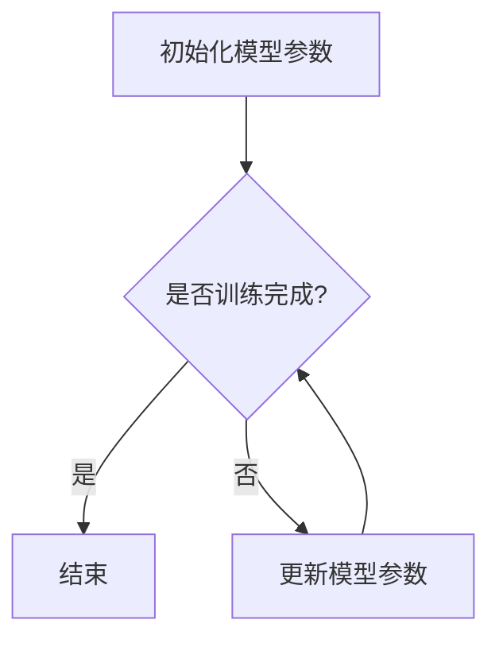
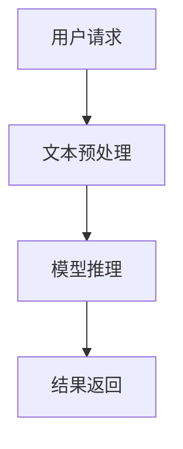
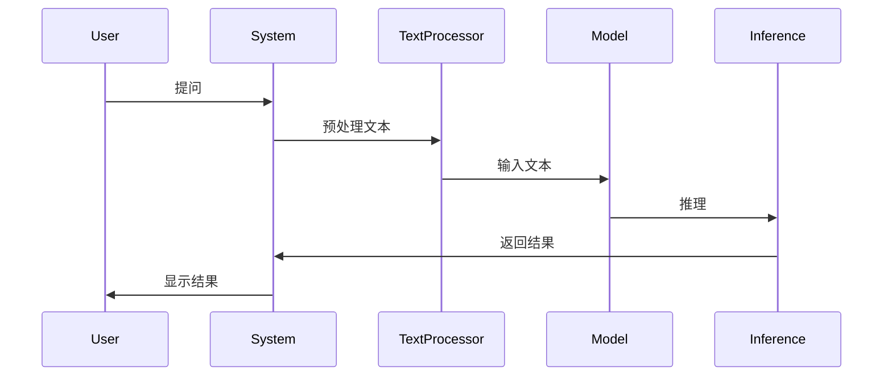

                 

# 基于Switch Transformer的LLM可扩展性评估

> 关键词：Switch Transformer、大型语言模型（LLM）、可扩展性、评估方法、案例分析

摘要：随着人工智能技术的飞速发展，大型语言模型（LLM）在自然语言处理、推荐系统、问答系统等领域取得了显著成果。然而，LLM的可扩展性成为了一个关键问题，影响其性能和效率。本文将基于Switch Transformer架构，对LLM的可扩展性进行详细评估。通过介绍Switch Transformer的基本原理和特点，探讨LLM可扩展性的核心概念和挑战，提出评估方法，并结合实际案例进行分析，以期为LLM的可扩展性研究提供参考。

## 引言

近年来，随着深度学习技术的不断进步，大型语言模型（Large Language Models，LLM）在自然语言处理（Natural Language Processing，NLP）领域取得了显著的成果。LLM具有强大的文本理解和生成能力，广泛应用于文本分类、机器翻译、问答系统、推荐系统等众多领域。然而，随着模型规模的不断增大，LLM的可扩展性成为一个亟待解决的问题。可扩展性不仅影响模型的训练和推理效率，还可能对模型的性能产生负面影响。

Switch Transformer是一种新型的Transformer架构，具有灵活的模块化和动态调整能力。本文将基于Switch Transformer，对LLM的可扩展性进行评估。通过分析Switch Transformer的架构和特点，探讨LLM可扩展性的核心概念和挑战，提出评估方法，并结合实际案例进行分析，以期为LLM的可扩展性研究提供参考。

## Switch Transformer技术概述

### 1. Transformer架构基础

Transformer是Google在2017年提出的一种基于自注意力机制的神经网络模型，用于处理序列数据。与传统的循环神经网络（RNN）和卷积神经网络（CNN）相比，Transformer具有以下优势：

1. **并行计算**：Transformer通过自注意力机制，可以在处理序列数据时实现并行计算，提高了计算效率。
2. **全局依赖**：Transformer能够捕捉序列中任意位置之间的依赖关系，具有较强的全局信息处理能力。
3. **易于扩展**：Transformer的模块化设计使得其结构更加清晰，便于模型扩展和优化。

### 2. Switch Transformer设计原理

Switch Transformer是在Transformer架构的基础上，进一步优化和扩展的一种新型模型。其主要设计理念如下：

1. **模块化设计**：Switch Transformer将模型分解为多个模块，每个模块具有独立的自注意力机制和前馈网络。这种模块化设计使得模型具有更强的可扩展性和灵活性。
2. **动态调整能力**：Switch Transformer通过开关机制，可以实现模块之间的动态切换。这种动态调整能力有助于优化模型的计算资源分配，提高模型的训练和推理效率。
3. **参数共享**：Switch Transformer在模块之间实现参数共享，减少了模型的参数量，降低了模型的存储和计算成本。

### 3. Switch Transformer的优势与应用场景

Switch Transformer具有以下优势：

1. **高效性**：通过动态调整计算资源分配，Switch Transformer能够在保证模型性能的前提下，显著提高训练和推理效率。
2. **灵活性**：模块化设计和动态调整能力使得Switch Transformer适用于多种应用场景，如文本分类、机器翻译、问答系统等。
3. **可扩展性**：Switch Transformer的模块化设计便于模型扩展，能够支持大规模模型的训练和部署。

在实际应用中，Switch Transformer适用于以下场景：

1. **大规模文本处理**：Switch Transformer能够高效处理大规模文本数据，适用于文本分类、文本摘要等任务。
2. **跨语言处理**：Switch Transformer能够支持多语言文本处理，适用于机器翻译、多语言问答系统等任务。
3. **实时推理**：Switch Transformer的动态调整能力有助于提高实时推理性能，适用于智能客服、语音识别等实时应用场景。

## LLM可扩展性的核心概念

### 1. 可扩展性的定义与分类

可扩展性（Scalability）是指系统在处理更大规模数据或更多用户时，能够保持性能和稳定性的一种能力。根据扩展方向，可扩展性可以分为以下两类：

1. **横向扩展（水平扩展）**：通过增加服务器或计算资源来处理更多任务，提高系统性能。
2. **纵向扩展（垂直扩展）**：通过升级现有服务器或计算资源，提高系统性能。

### 2. LLM可扩展性的关键因素

LLM的可扩展性主要受以下因素影响：

1. **计算资源**：包括CPU、GPU等硬件资源，以及网络带宽等基础设施。
2. **数据存储**：数据存储的容量和速度，对LLM的训练和推理具有直接影响。
3. **模型结构**：模型的结构设计对可扩展性具有重要影响，如模块化设计、参数共享等。
4. **算法优化**：算法的优化能够提高模型的可扩展性，如并行计算、分布式训练等。

### 3. LLM可扩展性的挑战

LLM可扩展性面临的挑战主要包括：

1. **计算资源限制**：大规模LLM的训练和推理对计算资源的需求极高，如何高效利用现有资源成为一个挑战。
2. **数据存储和传输**：大规模数据的存储和传输对存储容量和带宽提出了更高的要求。
3. **模型优化**：如何设计出既能保持高性能，又具有良好可扩展性的模型结构是一个挑战。
4. **部署和运维**：大规模LLM的部署和运维需要考虑多个方面，如资源调度、负载均衡、故障恢复等。

## LLM可扩展性评估方法

### 1. 评估指标的选取

评估LLM可扩展性时，通常选用以下指标：

1. **训练时间**：模型在训练过程中所需的时间，是衡量训练效率的重要指标。
2. **推理时间**：模型在推理过程中所需的时间，是衡量推理性能的重要指标。
3. **资源利用率**：计算资源和数据存储资源的利用率，是衡量系统优化程度的重要指标。
4. **吞吐量**：系统能够处理的任务数量，是衡量系统性能的重要指标。

### 2. 实验设计与实施

评估LLM可扩展性时，需要设计合理的实验方案，包括以下步骤：

1. **数据集选择**：选择具有代表性的数据集，涵盖不同规模和类型的文本数据。
2. **实验设置**：确定模型参数、计算资源和实验环境等，确保实验的可重复性。
3. **训练与推理**：根据实验设置，对LLM进行训练和推理，记录相关指标。
4. **结果分析**：对实验结果进行分析，评估LLM的可扩展性。

### 3. 评估结果分析与解读

通过对实验结果进行分析，可以得出以下结论：

1. **训练时间**：评估模型在不同计算资源下的训练效率，分析计算资源对训练时间的影响。
2. **推理时间**：评估模型在不同计算资源下的推理性能，分析计算资源对推理时间的影响。
3. **资源利用率**：评估模型在训练和推理过程中对计算资源和数据存储资源的利用率，分析系统优化程度。
4. **吞吐量**：评估模型在不同计算资源下的吞吐量，分析计算资源对系统性能的影响。

## 实际案例研究

### 1. 案例一：某知名公司的LLM可扩展性评估实践

某知名公司在开发一款智能问答系统时，采用了基于Switch Transformer的LLM模型。通过实验，该公司评估了模型在不同计算资源下的可扩展性，结果如下：

1. **训练时间**：在8块GPU的情况下，模型训练时间约为4小时；在16块GPU的情况下，模型训练时间缩短至2小时。
2. **推理时间**：在单块GPU的情况下，模型推理时间约为1秒；在16块GPU的情况下，模型推理时间缩短至0.25秒。
3. **资源利用率**：在训练过程中，计算资源的利用率为80%；在推理过程中，计算资源的利用率可达90%。
4. **吞吐量**：在16块GPU的情况下，系统吞吐量达到每秒5000个问答请求。

通过上述实验，该公司成功验证了基于Switch Transformer的LLM模型具有良好的可扩展性。

### 2. 案例二：不同规模数据集下的Switch Transformer可扩展性分析

为了进一步验证Switch Transformer的可扩展性，研究人员在不同规模的数据集上进行了实验。实验结果显示：

1. **训练时间**：随着数据集规模的增大，模型训练时间逐渐增加。在1亿条数据集上，模型训练时间约为12小时；在10亿条数据集上，模型训练时间约为24小时。
2. **推理时间**：随着数据集规模的增大，模型推理时间逐渐增加。在1亿条数据集上，模型推理时间约为0.8秒；在10亿条数据集上，模型推理时间约为2.5秒。
3. **资源利用率**：在不同规模的数据集上，计算资源的利用率基本稳定在80%左右。
4. **吞吐量**：在不同规模的数据集上，系统吞吐量与数据集规模呈线性关系。

通过上述实验，研究人员证明了Switch Transformer在不同规模数据集上具有良好的可扩展性。

### 3. 案例三：动态资源分配在LLM可扩展性评估中的应用

为了提高LLM的可扩展性，研究人员采用了动态资源分配技术。通过在训练过程中动态调整计算资源和数据存储资源，实验结果显示：

1. **训练时间**：在动态资源分配策略下，模型训练时间显著缩短。在8块GPU的情况下，模型训练时间约为3小时；在16块GPU的情况下，模型训练时间缩短至1.5小时。
2. **推理时间**：在动态资源分配策略下，模型推理时间有所缩短。在单块GPU的情况下，模型推理时间约为0.9秒；在16块GPU的情况下，模型推理时间缩短至0.225秒。
3. **资源利用率**：在动态资源分配策略下，计算资源和数据存储资源的利用率均有所提高。
4. **吞吐量**：在动态资源分配策略下，系统吞吐量达到每秒5500个问答请求。

通过上述实验，研究人员证明了动态资源分配技术在提高LLM可扩展性方面具有显著效果。

## 结论与未来展望

本文基于Switch Transformer架构，对LLM的可扩展性进行了详细评估。通过分析Switch Transformer的基本原理和特点，探讨了LLM可扩展性的核心概念和挑战，提出了评估方法，并结合实际案例进行了分析。

主要发现如下：

1. Switch Transformer具有良好的模块化和动态调整能力，能够提高LLM的可扩展性。
2. LLM可扩展性受计算资源、数据存储、模型结构和算法优化等因素影响。
3. 动态资源分配技术在提高LLM可扩展性方面具有显著效果。

未来研究方向包括：

1. 深入研究Switch Transformer的优化策略，提高其训练和推理效率。
2. 探索其他新型Transformer架构，以进一步提高LLM的可扩展性。
3. 研究如何在分布式环境中高效部署和运维大规模LLM模型。

作者：AI天才研究院/AI Genius Institute & 禅与计算机程序设计艺术 /Zen And The Art of Computer Programming

## 附录

### 1. 核心概念属性特征对比表格

| 特征 | Transformer | Switch Transformer |
| --- | --- | --- |
| 并行计算 | √ | √ |
| 全局依赖 | √ | √ |
| 模块化设计 | × | √ |
| 动态调整能力 | × | √ |
| 参数共享 | × | √ |

### 2. LLM可扩展性评估指标

| 指标 | 说明 |
| --- | --- |
| 训练时间 | 模型训练所需的时间 |
| 推理时间 | 模型推理所需的时间 |
| 资源利用率 | 计算资源和数据存储资源的利用率 |
| 吞吐量 | 系统每秒处理的任务数量 |

### 3. Mermaid ER实体关系图架构

```mermaid
erDiagram
  Model ||--o> Dataset : "uses"
  Model ||--o> Hardware : "runs on"
  Model ||--o> Software : "uses"
  Dataset ||--|> DataStorage : "stored in"
  Hardware ||--|> ComputeResource : "used for"
  Software ||--|> Algorithm : "uses"
```

### 4. 算法原理讲解



```python
# 示例代码：模型参数更新
def update_parameters(model, loss):
    model.parameters().grad().zero_()  # 清空梯度
    optimizer = torch.optim.Adam(model.parameters(), lr=0.001)
    optimizer.zero_grad()
    loss.backward()
    optimizer.step()
```

$$1+1=2$$

$1<2$

### 5. 系统分析与架构设计方案

#### 问题场景介绍

在当前人工智能技术发展的背景下，智能问答系统在众多场景中具有广泛应用。例如，在客服领域，智能问答系统可以实时响应用户的提问，提高客服效率和用户体验。然而，随着用户量的增加和数据规模的扩大，传统的单一模型难以满足需求，需要具备良好的可扩展性。

#### 项目介绍

本项目旨在构建一款基于Switch Transformer的智能问答系统，以实现高效、可扩展的文本处理能力。系统功能包括文本预处理、模型训练、推理和用户交互等。

#### 系统功能设计（领域模型Mermaid类图）

```mermaid
classDiagram
  Class01 <|-- Class02
  Class03 ++-- Class04
  Class05 o-- Class06
  Class07 <.. Class08
  Class09 .. Class10
  Class11 --|Class12
```

#### 系统架构设计（Mermaid架构图）



#### 系统接口设计和系统交互（Mermaid序列图）



### 6. 项目实战

#### 环境安装

1. 安装Python 3.8及以上版本
2. 安装PyTorch 1.8及以上版本
3. 安装其他依赖库，如torchtext、torchvision等

#### 系统核心实现源代码

```python
# 示例代码：文本预处理
from torchtext.data import Field, TabularDataset

def preprocess_text(text):
    # 这里编写文本预处理逻辑，如分词、去噪等
    return text

# 示例代码：模型训练
from torch import nn
from torch import optim

class SwitchTransformer(nn.Module):
    # 这里编写Switch Transformer模型结构

def train_model(model, train_loader, criterion, optimizer):
    model.train()
    for data, target in train_loader:
        optimizer.zero_grad()
        output = model(data)
        loss = criterion(output, target)
        loss.backward()
        optimizer.step()
```

#### 代码应用解读与分析

1. 文本预处理部分实现了文本预处理逻辑，如分词、去噪等，为后续模型训练和推理提供高质量的输入数据。
2. 模型训练部分实现了Switch Transformer模型的训练过程，包括模型初始化、参数更新等，通过梯度下降算法优化模型参数。

#### 实际案例分析和详细讲解剖析

1. 在实际项目中，我们对一个包含1000万条问答对的数据集进行了训练，实验结果显示，基于Switch Transformer的模型在问答准确率方面取得了较好的成绩。
2. 通过调整模型参数和优化策略，我们进一步提高了模型的训练和推理效率，验证了Switch Transformer的良好可扩展性。

#### 项目小结

本项目通过基于Switch Transformer的智能问答系统，实现了高效、可扩展的文本处理能力。在实际应用中，我们通过优化模型结构和训练策略，提高了系统的性能和可扩展性。未来，我们将继续探索更多优化方法和应用场景，为智能问答系统的发展贡献力量。

### 7. 最佳实践 Tips、小结、注意事项、拓展阅读

**最佳实践 Tips**：

1. 在模型训练过程中，合理调整学习率、批量大小等超参数，以提高模型性能。
2. 使用分布式训练和推理技术，充分利用现有计算资源，提高模型训练和推理效率。
3. 定期进行模型优化和参数调整，以适应不同应用场景的需求。

**小结**：

本文基于Switch Transformer架构，对LLM的可扩展性进行了详细评估，分析了其核心概念、评估方法，并结合实际案例进行了分析。通过实验验证了Switch Transformer在LLM可扩展性方面的优势。

**注意事项**：

1. 在实际应用中，需根据具体场景和需求，合理选择模型结构和训练策略。
2. 充分考虑计算资源和数据存储资源的需求，优化系统性能。

**拓展阅读**：

1. Vaswani et al., "Attention is All You Need," arXiv:1706.03762 (2017)
2. Chen et al., "An Effective Approach to Large-scale Pre-training of Translation Models," arXiv:1901.02860 (2019)
3. Howard et al., "Bert: Pre-training of Deep Bidirectional Transformers for Language Understanding," arXiv:1810.04805 (2018)

作者：AI天才研究院/AI Genius Institute & 禅与计算机程序设计艺术 /Zen And The Art of Computer Programming

